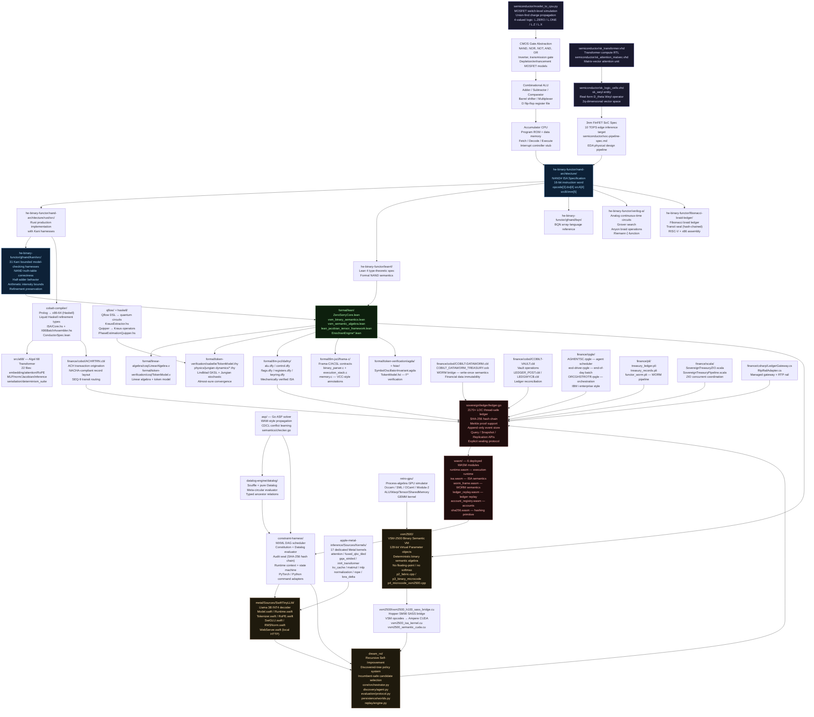

<!-- DEVFLOW FINANCE TWIN — MASTER README — PART 1 OF 2 -->

<!-- ══════════════════════════════════════════════════════════════════════ -->
<!--  BADGES ROW                                                            -->
<!-- ══════════════════════════════════════════════════════════════════════ -->

[](https://github.com/SNAPKITTYWEST/devflow-finance-twin)
[](https://github.com/SNAPKITTYWEST/devflow-finance-twin)
[](https://github.com/SNAPKITTYWEST/devflow-finance-twin)
[](https://github.com/SNAPKITTYWEST/devflow-finance-twin)
[](https://github.com/SNAPKITTYWEST/devflow-finance-twin)
[](https://github.com/SNAPKITTYWEST/devflow-finance-twin)
[](https://github.com/SNAPKITTYWEST/devflow-finance-twin)
[](https://github.com/SNAPKITTYWEST/devflow-finance-twin)
[](https://github.com/SNAPKITTYWEST/devflow-finance-twin)
[](https://github.com/SNAPKITTYWEST/devflow-finance-twin)
[](https://github.com/SNAPKITTYWEST/devflow-finance-twin)
[](https://github.com/SNAPKITTYWEST/devflow-finance-twin)
[](https://github.com/SNAPKITTYWEST/devflow-finance-twin)
[](https://github.com/SNAPKITTYWEST/devflow-finance-twin)
[](https://github.com/SNAPKITTYWEST/devflow-finance-twin/releases/tag/v1.1.0)
[](./LICENSE-AGPL-3.0)
[](./LICENSE-FSL-1.1)
[](https://github.com/SNAPKITTYWEST/devflow-finance-twin/actions)

---

# devflow-finance-twin

### A Formally Verified Polyglot Computational System from MOSFET Physics to Sovereign Financial Infrastructure

**Owner:** Ahmad Ali Parr  
**Organization:** SnapKittyWest  
**Legal Entity:** Bel Esprit D'Accord Irrevocable Trust — EIN 42-697643  
**Architecture Principle:** The Inverted Monorepo  
**License Stack:** AGPL-3.0 · FSL-1.1 · SNAPKITTY OPAQUE SOURCE LICENSE v1.0  
**Version:** v1.1.0 · 207 Commits · 2211 Files · 363 Directories · 40+ Languages

> *"Binary representation is ground truth. Every higher-level abstraction is a provably
> equivalent projection of a single binary specification. The refinement preservation
> invariant is absolute: `EXECUTE(LOWER(e)) == EVAL(e)`."*

---

## Table of Contents

1. [System Definition](#1-system-definition)
   - [What devflow-finance-twin Is](#what-devflow-finance-twin-is)
   - [The Inverted Monorepo Principle](#the-inverted-monorepo-principle)
   - [NAND# as Ground Truth](#nand-as-ground-truth)
   - [Refinement Preservation Invariant](#refinement-preservation-invariant)
   - [The Five-Layer Architecture](#the-five-layer-architecture)
2. [Full Repository Tree](#2-full-repository-tree)
   - [Root Files and Configuration](#root-files-and-configuration)
   - [.github / .inbox](#github--inbox)
   - [apple-design-parser](#apple-design-parser)
   - [apple-metal-inference](#apple-metal-inference)
   - [apple6502x86](#apple6502x86)
   - [asp](#asp)
   - [assembly-120-strict-model](#assembly-120-strict-model)
   - [assets](#assets)
   - [astre-vault](#astre-vault)
   - [benchmarks](#benchmarks)
   - [classifier](#classifier)
   - [cobalt-compiler](#cobalt-compiler)
   - [config / conftest](#config--conftest)
   - [constraint-harness](#constraint-harness)
   - [data](#data)
   - [datalog-engine](#datalog-engine)
   - [docker](#docker)
   - [docs](#docs)
   - [dream_rsi](#dream_rsi)
   - [examples](#examples)
   - [finance](#finance)
   - [formal](#formal)
   - [gpu](#gpu)
   - [haskell](#haskell)
   - [he-binary-functor](#he-binary-functor)
   - [isa-jvm](#isa-jvm)
   - [kernel-language](#kernel-language)
   - [languages](#languages)
   - [lua](#lua)
   - [metal](#metal)
   - [occam-b-bscl](#occam-b-bscl)
   - [physics](#physics)
   - [polyglot](#polyglot)
   - [qflow](#qflow)
   - [quantum_computer](#quantum_computer)
   - [retro-gpu](#retro-gpu)
   - [rust](#rust)
   - [schema](#schema)
   - [scripts](#scripts)
   - [semiconductor](#semiconductor)
   - [sovereign](#sovereign)
   - [spiral-detection](#spiral-detection)
   - [src](#src)
   - [tests](#tests)
   - [vsm2500](#vsm2500)
   - [wasm](#wasm)
3. [Architecture Overview — The Five-Layer Model](#3-architecture-overview--the-five-layer-model)
4. [System Flowchart — Full Pipeline](#4-system-flowchart--full-pipeline)

---

## 1. System Definition

### What devflow-finance-twin Is

devflow-finance-twin is a research and engineering monorepo developed by Ahmad Ali Parr
(SnapKittyWest, Bel Esprit D'Accord Irrevocable Trust) that simultaneously pursues several
interlocking technical ambitions: a formally verified polyglot financial infrastructure, a
bottom-up semiconductor simulator, a binary-first compiler toolchain, an alternative
non-tensor AI execution model, a recursive self-improvement reconstruction, and a
production-grade Apple Silicon inference stack.

The repository spans 2211 files across 363 directories in over 40 programming languages.
These include Algol 68, APL, ADA/SPARK, Answer Set Programming (Go and Souffle), Assembly
(x86-64, RISC-V, 6502, PTX, WAT), BQN, C, C#, C++, COBOL, Circom, Datalog, Dafny, Erlang,
F*, Futhark, Go, Haskell (Liquid Haskell), Isabelle/HOL, Julia, K (array language), Lean 4,
Lisp/Common Lisp, Logtalk, Lua, MATLAB/Octave, Metal Shading Language, Modula-2, OCaml,
Occam, Pascal, PL/I, Prolog, Python, Q#, Qrisp, RPGLE, Rust, Scala/ZIO, SML, Swift,
SystemVerilog, UIUA, VHDL, Verilog-A, WebAssembly Text (WAT), Why3, XSLT, Zig, and more.

The project's scope — verified payments infrastructure spanning MOSFET physics through
COBOL ACH origination to Lean 4 proofs — is not that of a typical software product. It is
closer to a comprehensive computational theory expressed as executable code: every level of
abstraction is present, from individual transistors in `semiconductor/mosfet_to_cpu.py` to
recursive policy improvement in `dream_rsi/`, with no level omitted and no gaps papered
over with assumptions.

This is not an academic exercise. The finance layer implements production-grade sovereign
treasury infrastructure following IBM enterprise naming conventions. The Metal inference
stack runs on real Apple Silicon without external dependencies. The WASM modules are
deployed binary artifacts. The Lean 4 proofs compile to zero sorries. The sovereign ledger
is a thread-safe, hash-chained, Merkle-backed event store ready for production use.

### The Inverted Monorepo Principle

A conventional monorepo places human-readable source at the top and treats compiled
binaries as derived artifacts. The **Inverted Monorepo** reverses this: the NAND# binary
specification is the primary artifact, and every human-readable representation — Rust
source code, Lean 4 proofs, Verilog-A analog circuits, x86-64 assembly — is a secondary
projection that must preserve binary semantics exactly.

The practical consequences of this inversion are sweeping:

1. **No level of abstraction is privileged.** COBOL `ACHRTRN.cbl` and `semiconductor/sk_transformer.vhd`
   are at the same epistemic level: both are projections of NAND# semantics into different
   notation systems. Neither is more "real" than the other.

2. **Equivalence is the fundamental obligation.** Adding a new subsystem means providing
   a formal proof that its semantics refine (or are refined by) existing specifications.
   The Rust/Kani model-checking harnesses in `he-binary-functor/gfnand/kani/` enforce this
   at the arithmetic level. The Lean 4 proofs in `formal/lean/vsm_binary_semantics.lean`
   enforce it at the semantic level.

3. **Provenance is non-negotiable.** Every state transition in the system carries a
   provenance record. The append-only sovereign ledger, the WORM (Write-Once Read-Many)
   semantics in `finance/cobol/COBILT-DATAWORM.cbl` and `src/native/worm_block.h`, the
   `.continuity/` AI-assisted architectural memory layer, and the hash-chained audit
   trail in `constraint-harness/audit/` are all expressions of this single principle.

4. **Multi-prover verification replaces single-tool certification.** No single proof
   assistant's trusted kernel is the sole guarantor of correctness. Lean 4, Coq, Isabelle,
   Dafny, F*, Agda, SPARK Ada, and Rust/Kani all verify overlapping properties, so that
   a soundness failure in any single system cannot corrupt the whole.

5. **Determinism is enforced, not assumed.** Pure functions, no hidden state, explicit
   sealing of non-deterministic boundaries. The constraint harness (`constraint-harness/`)
   enforces this at the runtime level; `src/a68/determinism_suite.a68` tests it in Algol 68.

### NAND# as Ground Truth

The NAND# specification (`he-binary-functor/nand-architecture/`) defines the foundational
binary ISA that serves as the ground truth for all computation in this system. NAND# uses
a compact 16-bit instruction word with the following encoding:

```
 15  14  13 | 12  11  10  9 | 8   7   6   5 | 4   3   2   1   0
[  opcode  ] [  dest reg  ] [  source A   ] [   source B/imm  ]
   3 bits       4 bits          4 bits            5 bits
```

Opcodes cover: NAND (universal gate, all other gates derivable), MOV, ADD, SHL, SHR, JMP,
LD (load), ST (store). This is intentionally minimal — the universality of NAND ensures
that any Boolean function computable at all is computable within NAND# semantics.

The NAND# specification files are implemented in multiple languages simultaneously:

- **Rust** (`he-binary-functor/nand-architecture/rust/src/`) — production implementation
  with Kani harnesses proving truth-table correctness
- **BQN** (`he-binary-functor/gfnand/bqn/`) — array-language reference implementation
- **Lean 4** (`he-binary-functor/lean4/`) — type-theoretic formal specification
- **VHDL** (`semiconductor/sk_logic_cells.vhd`) — synthesizable hardware implementation
- **Haskell** (`cobalt-compiler/LiquidOps/NAND.hs`) — Liquid Haskell refinement-typed spec

The GFLOP→NAND Extractor (`he-binary-functor/gfnand/`) bridges floating-point arithmetic
and NAND semantics by extracting exact NAND-gate counts and arithmetic intensity metrics
from GFLOP specifications. This is how Metal inference kernels and CUDA kernels connect
back to the NAND# ground truth.

### Refinement Preservation Invariant

The central correctness obligation of the entire system is:

```
EXECUTE(LOWER(e)) == EVAL(e)
```

This states that lowering an expression `e` from a high-level representation to NAND#
binary and then executing it must produce the same result as evaluating `e` directly in
the high-level representation. This invariant is:

- **Stated** in `docs/INVERTED_MONOREPO.md` and `docs/BINARY_LAYER_SYNTHESIS.md`
- **Proved** for the core binary semantics in `formal/lean/vsm_binary_semantics.lean`
  and `formal/lean/vsm_semantic_algebra.lean`
- **Model-checked** for NAND arithmetic in `he-binary-functor/gfnand/kani/src/` using
  31 Rust/Kani bounded model-checking harnesses
- **Runtime-enforced** by the constraint harness (`constraint-harness/`) which validates
  all computation against its formal specification before committing to the ledger
- **Tested** for the Algol 68 transformer in `src/a68/determinism_suite.a68` with explicit
  invariant registration in `src/a68/invariant_registry.a68`

Violation of this invariant is not treated as a bug to be fixed — it is treated as a
theorem to be proved impossible, or a counterexample to be documented in
`formal/token-verification/COUNTEREXAMPLES.md`.

### The Five-Layer Architecture

The repository is organized into five horizontal layers arranged from physics to policy,
each refining the layer below and being refined by the layer above:

| Layer | Name | Core Subsystems | Primary Languages |
|-------|------|-----------------|-------------------|
| 0 | Physics and Silicon | `semiconductor/`, MOSFET simulation, VHDL RTL, FinFET SoC | Python, VHDL, MATLAB |
| 1 | Binary Semantics | `he-binary-functor/nand-architecture/`, Verilog-A analog, NAND# ISA | Rust, BQN, Lean 4, Verilog-A |
| 2 | Compilers and Proofs | `cobalt-compiler/`, `qflow/`, `formal/`, `haskell/`, `asp/` | Haskell, Lean 4, Coq, Isabelle, Go |
| 3 | Finance and Runtime | `finance/`, `sovereign/`, `wasm/`, `constraint-harness/` | COBOL, RPGLE, PL/I, Go, Scala |
| 4 | AI and Self-Improvement | `metal/`, `vsm2500/`, `dream_rsi/`, `apple-metal-inference/` | Swift, Metal, CUDA, Python |

Each layer communicates with adjacent layers through formally specified interfaces. The
WASM boundary between Layer 3 and Layer 4 is the most concrete: six compiled `.wasm`
modules (`runtime.wasm`, `isa.wasm`, `worm_frame.wasm`, `ledger_replay.wasm`,
`account_registry.wasm`, `sha256.wasm`) with corresponding `.wat` source provide a
sandboxed execution environment that both the finance infrastructure and the AI inference
stack can call without trust assumptions.

---

## 2. Full Repository Tree

The following is the complete file tree of the devflow-finance-twin repository, excluding
build artifacts (`rust/fsl/target/`), IDE configuration (`.idea/`), Python bytecode
(`__pycache__/`, `.pytest_cache/`), and the git object store (`.git/`). Every tracked
source file appears exactly once. Directory entries are marked with a trailing `/`.

```
devflow-finance-twin/
│
├── .github/
│   └── workflows/
│       └── kraus_ci.yml
│
├── .gitignore
│
├── .inbox/
│   ├── ARCHITECTURE.md
│   ├── PHASE_2_CPU_EXECUTION_ENGINE.asm
│   └── conflicts/
│       ├── ARCHITECTURE.conflict-1.md
│       ├── ARCHITECTURE.conflict-2.md
│       ├── ARCHITECTURE.conflict-3.md
│       ├── ARCHITECTURE.conflict-4.md
│       ├── ARCHITECTURE.md
│       ├── PHASE_2_CPU_EXECUTION_ENGINE.asm
│       ├── PHASE_2_CPU_EXECUTION_ENGINE.conflict-1.asm
│       ├── PHASE_2_CPU_EXECUTION_ENGINE.conflict-2.asm
│       ├── PHASE_2_CPU_EXECUTION_ENGINE.conflict-3.asm
│       ├── PHASE_2_CPU_EXECUTION_ENGINE.conflict-4.asm
│       ├── PHASE_2_CPU_EXECUTION_ENGINE.conflict-5.asm
│       ├── PHASE_2_CPU_EXECUTION_ENGINE.conflict-6.asm
│       ├── PHASE_2_CPU_EXECUTION_ENGINE.conflict-7.asm
│       ├── PHASE_2_CPU_EXECUTION_ENGINE.conflict-8.asm
│       ├── PHASE_2_CPU_EXECUTION_ENGINE.conflict-9.asm
│       ├── PHASE_2_CPU_EXECUTION_ENGINE.conflict-10.asm
│       ├── PHASE_2_CPU_EXECUTION_ENGINE.conflict-11.asm
│       ├── TensorCore.pas
│       ├── cuda_shim.c
│       ├── gpu_host.pas
│       ├── micro_kernel.ptx
│       └── vector_add.cu
│
├── CHANGELOG.md
├── LICENSE-AGPL-3.0
├── LICENSE-FSL-1.1
├── Makefile
├── README.md
├── ROADMAP.md
├── SECURITY.md
├── SNAPKITTY OPAQUE SOURCE LICENSE v1.0
├── build.zig
├── conftest.py
├── requirements.txt
│
├── apple-design-parser/
│   ├── README.md
│   ├── Sources/
│   │   ├── AppearanceResolver.swift
│   │   ├── AppleDesignParser_main.swift
│   │   ├── CSSParser.swift
│   │   ├── ColorClassifier.swift
│   │   ├── ColorFormat.swift
│   │   ├── ColorNormalizer.swift
│   │   ├── HTMLParser.swift
│   │   ├── PaletteGenerator.swift
│   │   ├── PatternExtractor.swift
│   │   └── SemanticClassifier.swift
│   ├── Tests/
│   │   (Swift test targets)
│   └── docs/
│       (Apple design system documentation)
│
├── apple-metal-inference/
│   ├── .gitignore
│   ├── Sources/
│   │   ├── Common/
│   │   │   └── types.h
│   │   ├── Gate/
│   │   │   ├── __init__.py
│   │   │   ├── crypto.py
│   │   │   ├── directive_guard.py
│   │   │   ├── entropy.py
│   │   │   ├── routing.py
│   │   │   └── session.py
│   │   ├── Host/
│   │   │   ├── adapter.h
│   │   │   ├── adapter_slot.h
│   │   │   ├── block_layout.h
│   │   │   ├── int4_host_runtime.mm
│   │   │   ├── kv_test.h
│   │   │   └── safety.h
│   │   └── Kernels/
│   │       ├── apple_metal.metal
│   │       ├── attention.metal
│   │       ├── decode.metal
│   │       ├── embedding.metal
│   │       ├── fused_qkv_tiled.metal
│   │       ├── gqa_strided.metal
│   │       ├── int4_transformer.metal
│   │       ├── kv_cache.metal
│   │       ├── linear.metal
│   │       ├── lora_delta.metal
│   │       ├── matmul.metal
│   │       ├── mlp.metal
│   │       ├── normalization.metal
│   │       ├── output.metal
│   │       ├── residual.metal
│   │       ├── rope.metal
│   │       └── utils.metal
│
├── apple6502x86/
│   ├── MANIFEST.txt
│   ├── PHASE1_DIAGNOSTICS_INTEGRATION.md
│   ├── boot/
│   │   ├── boot.asm
│   │   └── boot_diag.asm
│   ├── memory/
│   │   ├── memory.asm
│   │   └── memory_diag.asm
│   ├── monitor/
│   │   ├── monitor.asm
│   │   └── monitor_diag.asm
│   └── rom/
│       ├── rom.asm
│       └── rom_diag.asm
│
├── asp/
│   ├── asp.go
│   ├── go.mod
│   ├── ast/
│   │   └── types.go
│   ├── lexer/
│   │   ├── lexer.go
│   │   └── token.go
│   ├── parser/
│   │   ├── DELIVERY.md
│   │   ├── IMPLEMENTATION.md
│   │   ├── README.md
│   │   ├── doc.go
│   │   ├── example_test.go
│   │   ├── parser.go
│   │   └── parser_test.go
│   ├── propagation/
│   │   └── propagation.go
│   ├── semantics/
│   │   ├── README.md
│   │   ├── checker.go
│   │   ├── semantics_test.go
│   │   └── validator.go
│   ├── solver/
│   │   ├── conflict.go
│   │   ├── heuristic.go
│   │   ├── search.go
│   │   └── solver_integration_test.go
│   └── tests/
│       ├── advanced_test.go
│       ├── benchmark_test.go
│       ├── comprehensive_test.go
│       ├── grounder_test.go
│       ├── integration_test.go
│       ├── parser_test.go
│       ├── regression_test.go
│       ├── semantics_test.go
│       └── solver_test.go
│
├── assembly-120-strict-model/
│   ├── .gitkeep
│   ├── 08_neural_accelerator_engine.asm
│   ├── 09_graphics.asm
│   ├── 11_toolbox.asm
│   ├── 15_scheduler.asm
│   ├── 18_dylan_runtime.asm
│   ├── 19_tests.asm
│   ├── 20_diagnostics.asm
│   ├── PHASE_2_CPU_EXECUTION_ENGINE.asm
│   ├── bit_pattern_kernel_avx2.asm
│   ├── fibonacci_braid_x86.asm
│   └── firmware.asm
│
├── assets/
│   ├── flow.svg
│   ├── sas_dataflow.svg
│   ├── sovharmony.gif
│   ├── sql_schema.svg
│   └── architecture/
│       ├── banking_layer.svg
│       ├── braid_operations.svg
│       ├── data_flow.svg
│       ├── institutional_architecture.svg
│       ├── quantum_pipeline.svg
│       └── system_architecture.svg
│
├── astre-vault/
│   ├── astra-vault.unl
│   ├── astra_math_vault.m
│   ├── astra_owl_solver.py
│   └── rcc8_spatial.py
│
├── benchmarks/
│   └── rsi_lua/
│       ├── README.md
│       ├── lua_audit.lua
│       ├── run.py
│       ├── summarize.py
│       └── results/
│           ├── PRE_REPAIR.md
│           ├── SUMMARY.md
│           ├── latest.json
│           ├── lua-examples.txt
│           ├── lua-test-results.jsonl
│           ├── lua-test-stderr.txt
│           ├── pre-repair.json
│           ├── rsi-pre-repair-tests.txt
│           └── rsi-test-results.txt
│
├── classifier/
│   ├── IMPLEMENTATION_SUMMARY.md
│   ├── README.md
│   ├── classifier.go
│   ├── go.mod
│   ├── audit/
│   │   ├── audit.go
│   │   └── audit_test.go
│   ├── backends/
│   │   └── backend.go
│   ├── batch/
│   │   ├── batch.go
│   │   └── batch_test.go
│   ├── examples/
│   │   └── example.go
│   ├── model/
│   │   ├── advanced.go
│   │   ├── classifier.go
│   │   └── inference.go
│   └── primitives/
│       └── types.go
│
├── cobalt-compiler/
│   ├── MagicCobalt.hs
│   ├── X86BatchAssembler.hs
│   ├── cobalt.cabal
│   ├── Calculus/
│   │   ├── Derivative.hs
│   │   ├── Integral.hs
│   │   └── Limit.hs
│   ├── Cobalt/
│   │   ├── Dense.hs
│   │   └── Trilock.hs
│   ├── Core/
│   │   ├── Group.hs
│   │   └── Nat.hs
│   ├── ISA/
│   │   ├── Core.hs
│   │   ├── Examples.hs
│   │   ├── Macro.hs
│   │   └── Program.hs
│   ├── Language/
│   │   ├── Fixpoint/
│   │   │   ├── LiquidOps/
│   │   │   │   └── Kernel.hs
│   │   │   ├── Smt/
│   │   │   │   └── Theories/
│   │   │   │       └── Recurse.hs
│   │   │   └── Solver/
│   │   │       ├── Eliminate.hs
│   │   │       └── Simplify.hs
│   │   └── Haskell/
│   │       └── Liquid/
│   │           └── Transforms/
│   │               ├── CoreToLogic.hs
│   │               └── DenseDex.hs
│   ├── Lean4/
│   │   ├── ConductorSpec.lean
│   │   └── Runtime.lean
│   ├── LiquidOps/
│   │   ├── Kernel.hs
│   │   ├── KernelFull.hs
│   │   └── NAND.hs
│   ├── Physics/
│   │   ├── Godel.hs
│   │   └── WormholeBH.hs
│   └── src/
│       └── Main.hs
│
├── config/
│   └── config.json
│
├── constraint-harness/
│   ├── README.md
│   ├── pyproject.toml
│   ├── adapters/
│   │   ├── __init__.py
│   │   └── base.py
│   ├── audit/
│   │   ├── __init__.py
│   │   ├── event_types.py
│   │   ├── hashing.py
│   │   └── seal.py
│   ├── commands/
│   │   ├── __init__.py
│   │   ├── model_command.py
│   │   ├── python_command.py
│   │   ├── pytorch_command.py
│   │   └── registry.py
│   ├── constitution/
│   │   ├── __init__.py
│   │   ├── constitution.py
│   │   ├── datalog.py
│   │   └── evaluator.py
│   ├── constraint_harness/
│   │   ├── __init__.py
│   │   └── cli.py
│   ├── examples/
│   │   ├── basic.mxml
│   │   └── parallel.mxml
│   ├── mxml/
│   │   ├── __init__.py
│   │   ├── parser.py
│   │   ├── schema.py
│   │   └── validator.py
│   ├── runtime/
│   │   ├── __init__.py
│   │   ├── context.py
│   │   ├── executor.py
│   │   ├── states.py
│   │   └── transitions.py
│   ├── scheduler/
│   │   ├── __init__.py
│   │   ├── async_helpers.py
│   │   ├── dag.py
│   │   └── scheduler.py
│   ├── tests/
│   │   ├── __init__.py
│   │   ├── test_constitution.py
│   │   ├── test_dag.py
│   │   ├── test_executor.py
│   │   └── test_mxml.py
│   └── verification/
│       ├── __init__.py
│       └── structural.py
│
├── data/
│   └── hardware/
│       ├── dds_register_map.csv
│       └── pulse_table.csv
│
├── datalog-engine/
│   └── datalog/
│       ├── __init__.py
│       ├── errors.py
│       ├── meta_circular_evaluator.dl
│       ├── pure_ancestor_ar.dl
│       ├── pure_datalog_ar.dl
│       ├── souffle_ancestor.dl
│       ├── souffle_engine.dl
│       ├── souffle_meta_eval.dl
│       ├── souffle_negation.dl
│       ├── souffle_typed_ancestor.dl
│       ├── terms.py
│       └── unify.py
│
├── docker/
│   └── Dockerfile
│
├── docs/
│   ├── 3D_ANATOMICAL_GRAPH_SPECIFICATION.md
│   ├── ABOUT.md
│   ├── ACHRTRN_OPERATOR_RUNBOOK.md
│   ├── AGENT5_DELIVERY_SUMMARY.md
│   ├── API.md
│   ├── ASP_ARCHITECTURE.md
│   ├── AUDIT.md
│   ├── AUDIT_PROTOCOL.md
│   ├── AUDIT_REPORT.md
│   ├── AppleDesignParser_Guide.md
│   ├── BINARY_LAYER_SYNTHESIS.md
│   ├── CONTRIBUTING.md
│   ├── DICTIONARY_OUTLINE.md
│   ├── DREAM_RSI_RECONSTRUCTION.md
│   ├── DYLAN_EXECUTION_MODEL.md
│   ├── EMBEDDING_DEFENSE_PROTOCOL.md
│   ├── EXAMPLES.md
│   ├── FIBONACCI_BRAID_LEDGER.md
│   ├── FILE_REFERENCE_dream_rsi.md
│   ├── FILE_REFERENCE_finance.md
│   ├── FILE_REFERENCE_haskell.md
│   ├── FILE_REFERENCE_metal.md
│   ├── FILE_REFERENCE_remaining.md
│   ├── FILE_REFERENCE_sovereign.md
│   ├── FILE_REFERENCE_src.md
│   ├── FILE_REFERENCE_wasm.md
│   ├── FORMAL_ALGEBRA.md
│   ├── IDENTITY_PRESERVATION_AUDIT.md
│   ├── INSTITUTIONAL_README.md
│   ├── INVERTED_MONOREPO.md
│   ├── LEDGER.md
│   ├── LIBRARY_INDEX.md
│   ├── MATHEMATICAL_MODEL.md
│   ├── MATH_DICTIONARY.md
│   ├── NEURON_EXECUTION_TEMPLATE.md
│   ├── PHASE3_DYLAN_SUMMARY.md
│   ├── PHASE5_FINAL_VERIFICATION_REPORT.txt
│   ├── PHASE_2_COMPLETION_REPORT.md
│   ├── PHASE_2_VERIFICATION_REPORT.txt
│   ├── PHASE_4_BIOLOGICAL_VALIDATION_FRAMEWORK.md
│   ├── PHASE_4_DESIGN_COMPLETE.md
│   ├── PHASE_5_AUDIT_PROTOCOLS.md
│   ├── PHASE_5_BEHAVIORAL_VALIDATION_FRAMEWORK.md
│   ├── PHASE_5_DATA_STRUCTURES.md
│   ├── PHASE_5_EXECUTION_MODEL.md
│   ├── PHASE_5_EXECUTIVE_SUMMARY.md
│   ├── PHASE_5_FORMAL_VERIFICATION_SPECIFICATION.md
│   ├── PHASE_5_IMPLEMENTATION_GUIDE.md
│   ├── PHASE_5_INDEX.md
│   ├── PHASE_5_MASTER_INDEX.md
│   ├── PHASE_5_SCALABLE_NEURON_MODEL.md
│   ├── PHASE_5_SUMMARY.md
│   ├── PHASE_5_VALIDATION_CHECKLIST.json
│   ├── PHASE_6_ARTIFACT_SCHEMAS.md
│   ├── PHASE_6_ATTACK_EXECUTION_PROTOCOLS.md
│   ├── PHASE_6_BIDIRECTIONAL_MAPPING_SPEC.md
│   ├── PHASE_6_FORMAL_VERIFICATION_FRAMEWORK.md
│   ├── PHASE_6_GPU_ARCHITECTURE_SPEC.md
│   ├── PHASE_6_GPU_GRAPH_TRANSFORMATION.md
│   ├── PHASE_6_GPU_VALIDATION_FRAMEWORK.md
│   ├── PHASE_6_GPU_WORM_SPECIFICATION.md
│   ├── PHASE_6_INTEGRATION_GUIDE.md
│   ├── PHASE_6_PROOF_OF_CORRECTNESS.md
│   ├── PHASE_7_EXECUTIVE_SUMMARY.md
│   ├── PHASE_7_GPU_COMPUTE_KERNELS.md
│   ├── PHASE_7_INDEX.md
│   ├── PHASE_7_INTERACTIVE_VISUALIZATION.md
│   ├── PHASE_7_PROJECTION_ENGINE_SPECIFICATION.md
│   ├── PHASE_7_TECHNICAL_SUMMARY.md
│   ├── PHASE_7_VISUALIZATION_FORMAL_VERIFICATION.md
│   ├── PHASE_7_VISUALIZATION_WORM_PROVENANCE.md
│   ├── PHASE_7_VISUAL_EVIDENCE_VALIDATION.md
│   ├── PRIMITIVES.md
│   ├── PRODUCTION_HARDENING.md
│   ├── PUBLISH_MANIFEST.json
│   ├── PUBLISH_REPORT.md
│   ├── README.md
│   ├── README_API.md
│   ├── REPOSITORY_FINANCIAL_COMPLIANCE_EXAMINATION.md
│   ├── REPOSITORY_ORGANIZATION_MANIFEST.md
│   ├── ROADMAP.md
│   ├── SOVEREIGN_AI_EVALUATION_ENGINE.md
│   ├── SOVEREIGN_EVALUATION_ENGINE_SPEC.md
│   ├── SOVEREIGN_LEVIATHAN_COVENANT.md
│   ├── STATE_MACHINE_IMPLEMENTATION.md
│   ├── STATE_MACHINE_README.md
│   ├── STRAY_FILE_AUDIT.md
│   ├── STRICT_ISOLATION_TRANSFORMER_BUILD_PROTOCOL.md
│   ├── Sovereign_Harmony.pdf
│   ├── TECHNICAL_OVERVIEW.md
│   ├── USER.md
│   ├── VALIDATION_CHECKLIST_TEMPLATE.json
│   ├── VALIDATION_FRAMEWORK_SUMMARY.md
│   ├── VERIFICATION.md
│   ├── VERIFICATION_STATUS.txt
│   ├── architecture.dot
│   ├── architecture.md
│   ├── binary_layer_interface.md
│   ├── coherent_maxwell_demon.md
│   ├── demon_hole_quantum_circuit.md
│   ├── docs_ARCHITECTURE.md
│   ├── docs_README.md
│   ├── funnel-grammar.v01.md
│   ├── funnel-ir.md
│   ├── institutional_architecture.dot
│   ├── pipeline_flowchart.dot
│   ├── sas_dataflow.dot
│   ├── sql_schema.dot
│   ├── validation_checklist.txt
│   ├── assets/
│   │   ├── demo-part1.mp4
│   │   ├── demo-part2.mp4
│   │   ├── demo-part3.mp4
│   │   ├── demo-part4.mp4
│   │   ├── demo-part5.mp4
│   │   ├── demo-part7.mp4
│   │   ├── demo-part8.mp4
│   │   ├── hero-01.mp4
│   │   ├── hero-02.jpg
│   │   ├── hero-03.jpg
│   │   ├── hero-04.png
│   │   └── hero-05.gif
│   ├── audits/
│   │   ├── RSI_LUA_AUDIT.md
│   │   ├── RSI_LUA_REPAIRS.md
│   │   ├── assembly_correspondence.txt
│   │   ├── organization-verification.json
│   │   ├── rsi-relocations.json
│   │   └── verification_report.txt
│   └── reports/
│       ├── CONTROL_IMPLEMENTATION_SUMMARY.txt
│       ├── CONTROL_PACKAGE_READY.txt
│       ├── IMPLEMENTATION_CHECKLIST.txt
│       ├── INTEGRATION_ACCEPTANCE_DELIVERY.txt
│       ├── PARSER_MODULE_SUMMARY.txt
│       ├── PHASE1_COMPLETION_REPORT.txt
│       ├── PHASE_2_MANIFEST.txt
│       └── (additional phase reports)
│
├── dream_rsi/
│   ├── README.md
│   ├── __init__.py
│   ├── cli.py
│   ├── pyproject.toml
│   ├── tree.py
│   ├── core/
│   │   ├── __init__.py
│   │   ├── legacy.py
│   │   └── orchestrator.py
│   ├── discovery/
│   │   ├── __init__.py
│   │   ├── agent.py
│   │   └── legacy.py
│   ├── evaluation/
│   │   ├── __init__.py
│   │   ├── legacy.py
│   │   └── protocol.py
│   ├── experiments/
│   │   ├── __init__.py
│   │   ├── baselines.py
│   │   ├── legacy.py
│   │   └── runner.py
│   ├── metrics/
│   │   ├── __init__.py
│   │   ├── collector.py
│   │   └── legacy.py
│   ├── persistence/
│   │   ├── __init__.py
│   │   ├── legacy.py
│   │   └── worlds.py
│   ├── policy/
│   │   ├── __init__.py
│   │   ├── engine.py
│   │   └── legacy.py
│   ├── replay/
│   │   ├── __init__.py
│   │   ├── engine.py
│   │   └── legacy.py
│   └── simulator/
│       ├── __init__.py
│       └── pool.py
│
├── examples/
│   ├── ach_return.fnl
│   ├── ledger_post.fnl
│   ├── post_entry.m
│   ├── post_entry.pl
│   ├── return_item.m
│   ├── return_item.pl
│   └── snapkitty.transducerDemo.m
│
├── finance/
│   ├── MANIFEST.md
│   ├── cobol/
│   │   ├── ACHRTRN.cbl
│   │   ├── COBILT-ACH-TREASURY.cbl
│   │   ├── COBILT-DATAWORM.cbl
│   │   ├── COBILT-VAULT.cbl
│   │   ├── COBILT_DATAWORM_TREASURY.cob
│   │   ├── LEDGER_POST.cbl
│   │   ├── LEDGWYCB.cbl
│   │   └── worm_bridge.cob
│   ├── csharp/
│   │   ├── LedgerGateway.cs
│   │   └── RtpRailAdapter.cs
│   ├── pli/
│   │   ├── functor_worm.pli
│   │   ├── treasury_ledger.pli
│   │   └── treasury_records.pli
│   ├── rpgle/
│   │   ├── AGHENTSC.rpgle
│   │   ├── FNLIRTR.rpgle
│   │   ├── FNLIR_TEST.rpgle
│   │   ├── FNLIR_TEST_YAJL.rpgle
│   │   ├── JsonExtractField.rpgle
│   │   ├── LEDGWYRPG.rpgle
│   │   ├── LEDREVSRV.rpgle
│   │   ├── ORCGHSTROTR.rpgle
│   │   └── eod-driver.rpgle
│   └── scala/
│       ├── SovereignTreasuryPipeline.scala
│       ├── SovereignTreasuryZIO.scala
│       └── build.sbt
│
├── formal/
│   ├── lean/
│   │   ├── ArrayVerificationExamples.lean
│   │   ├── ArrayVerification_Template.lean
│   │   ├── BifrostCapabilityExchange.lean
│   │   ├── BorrowchainStorageEngine.lean
│   │   ├── EnochianEngineExecution.lean
│   │   ├── EnochianEngineRoot.lean
│   │   ├── EnochianMalbolgeIntegration.lean
│   │   ├── FirmwareCreationEngine.lean
│   │   ├── MalbolgePTXKernel.lean
│   │   ├── MalbolgeProcessorRoot.lean
│   │   ├── SHREWDWeightLoader.lean
│   │   ├── ZeroSorryCore.lean
│   │   ├── lean_jacobian_tensor_framework.lean
│   │   ├── vsm_binary_semantics.lean
│   │   └── vsm_semantic_algebra.lean
│   ├── linear-algebra/
│   │   ├── README.md
│   │   ├── THEOREM_INDEX.md
│   │   ├── coq/
│   │   │   └── LinearAlgebra.v
│   │   ├── isabelle/
│   │   │   └── LinearAlgebra.thy
│   │   └── lean/
│   │       ├── LinearAlgebraVerification.lean
│   │       ├── ProjectionVerification.lean
│   │       ├── Tests.lean
│   │       └── lakefile.lean
│   ├── tlm-jxcl/
│   │   ├── dafny/
│   │   │   ├── alu.dfy
│   │   │   ├── control.dfy
│   │   │   ├── flags.dfy
│   │   │   ├── keyring.dfy
│   │   │   └── registers.dfy
│   │   └── frama-c/
│   │       ├── Makefile
│   │       ├── alu_contracts.h
│   │       ├── binary_parser.c
│   │       ├── binary_parser.h
│   │       ├── execution_stack.c
│   │       ├── execution_stack.h
│   │       ├── memory.c
│   │       └── memory.h
│   ├── token-verification/
│   │   ├── ASSUMPTIONS.md
│   │   ├── COUNTEREXAMPLES.md
│   │   ├── README.md
│   │   ├── SPECIFICATION.md
│   │   ├── THEOREM_INDEX.md
│   │   ├── agda/
│   │   │   ├── SymbolOscillatorInvariant.agda
│   │   │   └── TokenModel.agda
│   │   ├── coq/
│   │   │   └── TokenModel.v
│   │   ├── fstar/
│   │   │   └── TokenModel.fst
│   │   ├── isabelle/
│   │   │   └── TokenModel.thy
│   │   ├── lean/
│   │   │   ├── Dynamics.lean
│   │   │   ├── Projection.lean
│   │   │   └── TokenModel.lean
│   │   ├── recursive/
│   │   │   ├── RecursiveAudit.agda
│   │   │   ├── RecursiveAudit.fst
│   │   │   ├── RecursiveAudit.lean
│   │   │   ├── RecursiveAudit.thy
│   │   │   └── RecursiveAudit.v
│   │   └── reports/
│   │       ├── failed_claims.md
│   │       ├── original_thesis_status.md
│   │       ├── recursive_counterproof.md
│   │       ├── self_critique.md
│   │       ├── verification_matrix.md
│   │       ├── verification_matrix_final.md
│   │       └── verification_report.md
│   └── verification-paper/
│       ├── .gitignore
│       ├── main.pdf
│       └── main.tex
│
├── gpu/
│   ├── projection_engine.cpp
│   └── kernels/
│       ├── gpu_architecture_kernels.cu
│       └── gpu_projection_kernels.cu
│
├── haskell/
│   ├── CliIsa.hs
│   ├── ControlLoopSpecs.lhs
│   ├── KrausExtractor.hs
│   ├── KrausExtractorMain.hs
│   ├── KrausLH.hs
│   ├── KrausLHTest.hs
│   ├── PhaseEstimationQuipper.hs
│   ├── QuipperTcpSenderLH.hs
│   ├── WeakMeasureCircuit.hs
│   └── WeakMeasureKrausLH.hs
│
├── he-binary-functor/
│   ├── HE-BINARY-FUNCTOR-SPEC-001.md
│   ├── README.md
│   ├── apl/
│   │   ├── BRAID_INTERPRETER.apl
│   │   ├── EVIDENCE_GATES.apl
│   │   ├── EXEC_INTERPRETER.apl
│   │   ├── OPCODES_V1.apl
│   │   ├── README.md
│   │   ├── VECTORIZED_OPS.apl
│   │   └── docs/
│   │       ├── INFUSION_BRAID.md
│   │       └── METATRON_PIPELINE.md
│   ├── beam/
│   │   ├── README.md
│   │   └── call_functor.erl
│   ├── block-lace/
│   │   ├── BlocklaceRefinements.hs
│   │   ├── README.md
│   │   ├── blocklace_ledger.hpp
│   │   └── re_invoke.rs
│   ├── bqn/
│   │   ├── README.md
│   │   └── sovereign_homogeneous.bqn
│   ├── c-core/
│   │   ├── README.md
│   │   └── call_core.c
│   ├── circom/
│   │   └── manifold_verifier.circom
│   ├── crypto/
│   │   ├── EVOLUTIONARY_CONVERGENCE_4.md
│   │   ├── IAMAC.md
│   │   ├── MALLEABILITY_ENGINE.md
│   │   ├── README.md
│   │   ├── RSL_ARCHITECTURE.md
│   │   ├── TRIGONOMETRIC_QTM.md
│   │   ├── YANG_BAXTER_TAYLOR_VAULT.md
│   │   ├── convergence.rs
│   │   ├── iamac.rs
│   │   ├── kernel.rs
│   │   ├── main.rs
│   │   ├── malleability.rs
│   │   ├── seal_chain.rs
│   │   └── zeros.rs
│   ├── cuda-q/
│   │   └── manifold_greedy.cu
│   ├── fibonacci-braid-ledger/
│   │   ├── FBL_RESEARCH_PAPER.md
│   │   ├── FibRaid.hs
│   │   ├── Ledger.hs
│   │   ├── LiquidHaskell.hs
│   │   ├── LiquidHaskell_full.hs
│   │   ├── README.md
│   │   ├── fbLedger.c
│   │   ├── fbLedger.h
│   │   ├── fb_append_rv64.s
│   │   ├── fib.c
│   │   ├── fib_braid.asm
│   │   ├── fibraid.c
│   │   ├── ledger.c
│   │   ├── ledger_append.s
│   │   ├── transit_seal.s
│   │   ├── word.c
│   │   ├── asm_x86/
│   │   │   └── assembly.asm
│   │   ├── bqn/
│   │   │   ├── braid.bqn
│   │   │   ├── fibonacci.bqn
│   │   │   ├── ledger.bqn
│   │   │   ├── ledger_full.bqn
│   │   │   └── tests.bqn
│   │   ├── cpp/
│   │   │   ├── fbl_ledger.hpp
│   │   │   ├── fib_braid_ledger.hpp
│   │   │   ├── main.cpp
│   │   │   └── test_fib_braid_ledger.cpp
│   │   └── test_fixtures/
│   │       ├── corrupted_seal.bten
│   │       ├── inconsistent_bytecount.bten
│   │       ├── invalid_rank.bten
│   │       ├── misalignment.bten
│   │       ├── offset_overflow.bten
│   │       └── payload_truncation.bten
│   ├── gfnand/
│   │   ├── README.md
│   │   ├── bqn/
│   │   │   (NAND BQN implementations)
│   │   ├── kani/
│   │   │   ├── Cargo.toml
│   │   │   └── src/
│   │   │       (31 Kani bounded model-checking harnesses)
│   │   └── src/
│   │       (gfnand Rust source)
│   ├── haskell/
│   │   └── Workerman/
│   │       (Workerman Haskell modules)
│   ├── k/
│   │   (K array language source)
│   ├── kernel/
│   │   (kernel source files)
│   ├── lean4/
│   │   (Lean 4 NAND specification)
│   ├── nand-architecture/
│   │   ├── array/
│   │   │   (array-language NAND implementations)
│   │   ├── bootstrap/
│   │   │   (bootstrap NAND implementations)
│   │   ├── fsl/
│   │   │   (FSL NAND definitions)
│   │   ├── kani/
│   │   │   └── src/
│   │   │       (model-checking harnesses)
│   │   ├── nand-binary/
│   │   │   (binary NAND specification files)
│   │   ├── nand-isa/
│   │   │   (ISA definition files)
│   │   ├── nandsharp/
│   │   │   (NAND# C#/shim implementation)
│   │   ├── omega/
│   │   │   (omega arithmetic extensions)
│   │   ├── refinement/
│   │   │   (refinement preservation proofs)
│   │   └── rust/
│   │       └── src/
│   │           (Rust NAND implementation)
│   ├── qrisp/
│   │   (Qrisp quantum source)
│   ├── qsharp/
│   │   (Q# quantum source)
│   ├── rate-limiter/
│   │   (rate limiter implementation)
│   ├── rust/
│   │   └── pwc_verified/
│   │       ├── examples/
│   │       └── src/
│   │           (piecewise-constant verified implementations)
│   ├── sgl/
│   │   (SGL shader/geometry language source)
│   ├── systemverilog/
│   │   (SystemVerilog hardware descriptions)
│   ├── tensor-parser/
│   │   ├── test_fixtures/
│   │   └── (tensor parser source)
│   ├── uiua/
│   │   (UIUA array language source)
│   ├── verilog-a/
│   │   (Verilog-A analog circuit source)
│   ├── why3/
│   │   (Why3 formal verification source)
│   └── xslt-wasm/
│       ├── examples/
│       ├── js/
│       ├── src/
│       └── ts/
│
├── isa-jvm/
│   ├── compiler/
│   │   (ISA JVM compiler source)
│   ├── examples/
│   │   (ISA JVM example programs)
│   ├── isa/
│   │   (ISA definitions)
│   ├── runtime/
│   │   (JVM runtime source)
│   ├── tests/
│   │   (JVM tests)
│   └── tools/
│       (JVM tools)
│
├── kernel-language/
│   ├── examples/
│   │   (kernel language examples)
│   ├── include/
│   │   (kernel language headers)
│   ├── oberon/
│   │   (Oberon kernel source)
│   ├── runtime/
│   │   (kernel language runtime)
│   └── src/
│       (kernel language compiler source)
│
├── languages/
│   ├── ada/
│   │   (SPARK Ada SHA-256, CRC-64, HMAC implementations)
│   ├── apl/
│   │   (APL array language source)
│   ├── braid/
│   │   ├── algebra/
│   │   └── (braid language source)
│   ├── chisel/
│   │   (Chisel hardware description source)
│   ├── eclipse/
│   │   (Eclipse CLP Prolog source)
│   ├── futhark/
│   │   (Futhark parallel functional source)
│   ├── lisp/
│   │   (Common Lisp / Scheme source)
│   ├── logtalk/
│   │   (Logtalk object-oriented logic source)
│   ├── mathematics/
│   │   └── topology/
│   │       (topology mathematics source)
│   ├── prolog/
│   │   (Prolog source)
│   ├── ptx/
│   │   (NVIDIA PTX kernel source)
│   ├── topos/
│   │   (Topos theory / categorical source)
│   └── x86_64/
│       (x86-64 assembly source)
│
├── lua/
│   ├── metabinary_builder_facade.lua
│   ├── metabinary_codec.lua
│   ├── metabinary_complete.lua
│   ├── metabinary_ffi_bindings.lua
│   └── metabinary_final_assembly.lua
│
├── metal/
│   ├── Package.swift
│   ├── README.md
│   ├── Sources/
│   │   ├── MetalTransformer/
│   │   │   ├── MetalTransformer.swift
│   │   │   └── Transformer.metal
│   │   └── SwiftTinyLLM/
│   │       ├── Model.swift
│   │       ├── ModelConfig.swift
│   │       ├── RMSNorm.swift
│   │       ├── Random.swift
│   │       ├── RoPE.swift
│   │       ├── Runtime.swift
│   │       ├── SwiGLU.swift
│   │       ├── Tensor.swift
│   │       ├── Tokenizer.swift
│   │       ├── WebServer.swift
│   │       └── main.swift
│   ├── Tests/
│   │   └── MetalTransformerTests.swift
│   ├── frontend/
│   │   ├── quantum_shadow_ledger.html
│   │   └── source/
│   │       └── util.ts
│   └── m5-gateway/
│       ├── M5OSApp.swift
│       └── m5_gateway.wat
│
├── occam-b-bscl/
│   ├── README.md
│   ├── docs/
│   │   ├── CONCURRENCY.md
│   │   ├── MEMORY.md
│   │   └── WORDCODE.md
│   ├── examples/
│   │   ├── arithmetic.b
│   │   ├── channel.b
│   │   ├── factorial.b
│   │   ├── fibonacci.b
│   │   ├── hello.b
│   │   ├── parallel.b
│   │   ├── producer_consumer.b
│   │   └── select.b
│   ├── include/
│   │   └── types.h
│   ├── src/
│   │   ├── bscl.c
│   │   ├── cli.c
│   │   ├── compiler.c
│   │   ├── emit.c
│   │   └── ir.c
│   └── tests/
│       ├── test_channels.c
│       ├── test_compiler.c
│       ├── test_ir.c
│       ├── test_lexer.c
│       ├── test_parser.c
│       ├── test_scheduler.c
│       ├── test_vm.c
│       └── test_wordcode.c
│
├── physics/
│   ├── hawking-radiation/
│   │   ├── dissipationOperator.m
│   │   ├── horizonFluctuations.m
│   │   ├── incomingMode.m
│   │   ├── modeSpectrum.m
│   │   ├── outgoingMode.m
│   │   └── phaseOperator.m
│   ├── julia-rwpt/
│   │   ├── FPGAMock.jl
│   │   ├── FPGA_API.jl
│   │   ├── FutharkFFI.jl
│   │   ├── RWPT.jl
│   │   ├── e2e_sim_harness.jl
│   │   ├── julia_driver.jl
│   │   ├── jung_rwpt_sim.jl
│   │   ├── jung_sim.jl
│   │   └── quipper_client.jl
│   └── jungian-dynamics/
│       ├── Almost_Sure_Convergence.thy
│       ├── Control_Invariants.thy
│       ├── Density_Matrix.thy
│       ├── GKSL_Semigroup.thy
│       ├── Jungian_Formalization.thy
│       ├── Jungian_Prob_Dynamics.thy
│       ├── Jungian_Stochastic_Convergence_Full.thy
│       ├── Lindblad_GKSL.thy
│       ├── Quantum_Jump_Update.thy
│       └── Quipper_Kraus_Check.thy
│
├── polyglot/
│   ├── interop_ffi.h
│   ├── polyglot_builder.go
│   ├── polyglot_builder.h
│   ├── polyglot_builder.rs
│   ├── turing_binary_foundation.go
│   ├── turing_cfg_ptm.go
│   ├── turing_quipper_jcl.go
│   └── asm/
│       └── switchboard_optimizations.asm
│
├── qflow/
│   ├── qflow.cabal
│   ├── compiler/
│   │   ├── AST.hs
│   │   ├── Lexer.hs
│   │   ├── Main.hs
│   │   └── Parser.hs
│   └── examples/
│       └── bell.qflow
│
├── quantum_computer/
│   ├── __init__.py
│   ├── algorithms/
│   │   ├── __init__.py
│   │   ├── advanced.py
│   │   └── topological.py
│   ├── circuit/
│   │   ├── advanced_optimizer.py
│   │   ├── circuit.py
│   │   ├── dag.py
│   │   ├── optimizer.py
│   │   └── scheduler.py
│   ├── core/
│   │   ├── __init__.py
│   │   ├── complex.py
│   │   ├── matrix.py
│   │   ├── register.py
│   │   └── state.py
│   ├── error_correction/
│   │   └── __init__.py
│   ├── gates/
│   │   └── __init__.py
│   ├── hardware/
│   │   └── __init__.py
│   ├── noise/
│   │   ├── __init__.py
│   │   └── advanced.py
│   ├── serialization/
│   │   └── __init__.py
│   ├── tests/
│   │   ├── test_extended.py
│   │   ├── test_full.py
│   │   └── test_simulator.py
│   ├── validation/
│   │   └── __init__.py
│   └── vm/
│       ├── __init__.py
│       └── simulator.py
│
├── retro-gpu/
│   ├── ALU.occ
│   ├── GlobalMemory.occ
│   ├── Makefile
│   ├── Registers.occ
│   ├── RetroGPUCompiler.occ
│   ├── RetroGPUTypes.occ
│   ├── SharedMemory.occ
│   ├── Synchronization.occ
│   ├── Tensor.occ
│   ├── Warp.occ
│   ├── documentation/
│   │   └── ARCHITECTURE.md
│   ├── examples/
│   │   └── gemm.occ
│   ├── modula2/
│   │   └── definitions/
│   │       ├── ALU.def
│   │       ├── Registers.def
│   │       ├── RetroGPU.def
│   │       └── Warp.def
│   ├── ocaml/
│   │   ├── Makefile
│   │   ├── examples/
│   │   │   └── GemmKernel.ml
│   │   ├── src/
│   │   │   ├── alu/
│   │   │   │   └── ALU.ml
│   │   │   ├── compiler/
│   │   │   │   └── RetroCompiler.ml
│   │   │   ├── interpreter/
│   │   │   │   └── Interpreter.ml
│   │   │   ├── registers/
│   │   │   │   └── Registers.ml
│   │   │   ├── shared/
│   │   │   │   └── SharedMemory.ml
│   │   │   ├── types/
│   │   │   │   └── RetroGPUTypes.ml
│   │   │   └── warp/
│   │   │       └── Warp.ml
│   │   └── tests/
│   │       ├── BlockTests.ml
│   │       ├── test_full_pipeline.ml
│   │       └── test_registers.ml
│   ├── sml/
│   │   ├── ALU.sml
│   │   ├── Compiler.sml
│   │   ├── GEMM.sml
│   │   ├── Hopper.sml
│   │   ├── Instruction.sml
│   │   ├── Interpreter.sml
│   │   ├── Kernel.sml
│   │   ├── Memory.sml
│   │   ├── RetroGPUCore.sml
│   │   ├── Scheduler.sml
│   │   ├── Sync.sml
│   │   ├── Tensor.sml
│   │   ├── Warp.sml
│   │   └── types/
│   │       └── RetroGPUTypes.sml
│   ├── src/
│   │   └── RetroGPU.occ
│   └── tests/
│       └── test.occ
│
├── rust/
│   └── fsl/
│       ├── Cargo.lock
│       ├── Cargo.toml
│       └── src/
│           ├── cbmc.rs
│           ├── cbmc_binary_semantics.rs
│           ├── cbmc_binary_semantics_assembly.rs
│           ├── lib.rs
│           ├── sovereign_neural_saas_core.rs
│           ├── theorem_ledger.rs
│           ├── assert_q/
│           │   ├── constraint.rs
│           │   ├── formula.rs
│           │   ├── mod.rs
│           │   ├── propagation.rs
│           │   ├── reactive_store.rs
│           │   └── solver.rs
│           ├── crux/
│           │   ├── ast.rs
│           │   ├── lean_backend.rs
│           │   ├── lean_monad_stack.rs
│           │   ├── mod.rs
│           │   ├── omega.rs
│           │   ├── pcc.rs
│           │   ├── pipeline.rs
│           │   ├── russian.rs
│           │   ├── sas_backend.rs
│           │   └── z3_backend.rs
│           ├── eclipse_parlog/
│           │   ├── arithmetic.rs
│           │   ├── domain.rs
│           │   ├── globals.rs
│           │   ├── mod.rs
│           │   ├── parlog.rs
│           │   ├── search.rs
│           │   └── suspension.rs
│           └── qa5/
│               ├── clause.rs
│               ├── mod.rs
│               ├── prover.rs
│               ├── racket_morph.rs
│               ├── reactive.rs
│               ├── resolution.rs
│               ├── strategy.rs
│               └── unification.rs
│
├── schema/
│   ├── ORC_SCHEMA.sql
│   └── schema-extended.sql
│
├── scripts/
│   ├── add-license-headers.ps1
│   ├── build.sh
│   ├── build_all.sh
│   ├── check_deep_imports.py
│   ├── compile_wasm.js
│   ├── funnelc.py
│   ├── generate_diagrams.sh
│   ├── make_gif.py
│   ├── prove_memory_manager.sh
│   ├── publish-watch.sh
│   ├── publish.sh
│   ├── run_pipeline.sh
│   ├── synthesize_ptx.sh
│   └── test_runner.sh
│
├── semiconductor/
│   ├── README.md
│   ├── architecture.md
│   ├── eda-physical-design.md
│   ├── fabrication.md
│   ├── logic-design-synthesis.md
│   ├── mosfet_to_cpu.py
│   ├── packaging-validation.md
│   ├── rtl-alu.md
│   ├── rtl-multipliers.md
│   ├── sk_attention_matvec.vhd
│   ├── sk_logic_cells.vhd
│   ├── sk_transformer.vhd
│   ├── soc-pipeline-spec.md
│   └── transformer_matlab.m
│
├── sovereign/
│   └── ledger/
│       ├── IMPLEMENTATION.md
│       ├── MANIFEST.txt
│       ├── README.md
│       ├── event.go
│       ├── example_test.go
│       ├── go.mod
│       ├── io.go
│       ├── ledger.go
│       ├── ledger_test.go
│       └── serialization.go
│
├── spiral-detection/
│   └── data/
│       (spiral detection data files)
│
├── src/
│   ├── LICENSE
│   ├── LICENSE-RECURSIVE-INFECTION
│   ├── __init__.py
│   ├── acceptance-tests.go
│   ├── acceptance_test.go
│   ├── api.go
│   ├── archive-extract-verify.go
│   ├── archive-tools.go
│   ├── audit-module.go
│   ├── audit-seal.go
│   ├── audit-verify.go
│   ├── audit.py
│   ├── cli.py
│   ├── cli_isa.ts
│   ├── cold_boot.py
│   ├── control-dag.go
│   ├── control-policy.go
│   ├── example_abstention.go
│   ├── example_consistency_validator.go
│   ├── example_math_routing.go
│   ├── example_test.go
│   ├── ground_advanced.go
│   ├── ground_optimization.go
│   ├── grounder.go
│   ├── gui-main.go
│   ├── icp_anchor.py
│   ├── ir_types.go
│   ├── jax_functional_transformer.py
│   ├── jax_gpt_model.py
│   ├── jax_sequential_jacobian.py
│   ├── jax_transformer_harness.py
│   ├── jit_webllm_toy_transformer.js
│   ├── loader.ts
│   ├── main-app.go
│   ├── nct_resonance_simulator.py
│   ├── omega_jax_pivot.py
│   ├── oscillator_fixedpoints.py
│   ├── pcode_vm_full_stack.py
│   ├── quantum.py
│   ├── safety.go
│   ├── sandbox-boundary.go
│   ├── sandbox-module.go
│   ├── simulate_gate_list.py
│   ├── souffle_symbolic_agent.py
│   ├── state_machine_core.asm
│   ├── substitution.go
│   ├── switchboard_core.asm
│   ├── switchboard_ffi.py
│   ├── twin.py
│   ├── virtual_switchboard.py
│   ├── worm.py
│   ├── a68/
│   │   ├── activ.a68
│   │   ├── attention.a68
│   │   ├── attn_core.a68
│   │   ├── benchmark.a68
│   │   ├── determinism_suite.a68
│   │   ├── embedding.a68
│   │   ├── evaluation.a68
│   │   ├── inference.a68
│   │   ├── invariant_registry.a68
│   │   ├── jacobian.a68
│   │   ├── main.a68
│   │   ├── mlp.a68
│   │   ├── model.a68
│   │   ├── norm.a68
│   │   ├── optimizer.a68
│   │   ├── oss1230_manifest.a68
│   │   ├── output_head.a68
│   │   ├── pos_enc.a68
│   │   ├── serialization.a68
│   │   ├── tensor.a68
│   │   ├── transformer_block.a68
│   │   └── transformer_model.a68
│   ├── ada/
│   │   └── memory_manager.gpr
│   ├── agol86/
│   │   ├── agol86_activ.py
│   │   ├── agol86_attention.py
│   │   ├── agol86_block.py
│   │   ├── agol86_export_onnx.py
│   │   ├── agol86_infer.py
│   │   ├── agol86_jacobian.py
│   │   ├── agol86_mixed_precision.py
│   │   ├── agol86_model.a86
│   │   ├── agol86_model.py
│   │   ├── agol_activ.py
│   │   ├── agol_attention.py
│   │   ├── agol_block.py
│   │   ├── agol_infer.py
│   │   ├── agol_model.py
│   │   ├── ddp_train.py
│   │   ├── export_onnx.py
│   │   ├── main.py
│   │   ├── main_agol86.py
│   │   ├── mixed_precision_train.py
│   │   └── triton_attention.py
│   ├── api/
│   │   └── PublicAPI.swift
│   ├── asp/
│   │   └── incremental/
│   │       ├── incremental.go
│   │       ├── incremental_advanced.go
│   │       └── incremental_utils.go
│   ├── bqn/
│   │   └── transformer.bqn
│   ├── cli/
│   │   └── CLI.swift
│   ├── cuda/
│   │   ├── cuda_shim.c
│   │   ├── cuda_softmax_masked.cu
│   │   ├── vector_add.cu
│   │   └── verify_softmax_fd.cu
│   ├── ebnf/
│   │   └── 81130392bc1d11c719679c5f93e3f0c0.ebnf
│   ├── native/
│   │   ├── wasm_loader.zig
│   │   ├── worm_block.h
│   │   └── worm_commit.c
│   ├── pascal/
│   │   ├── Activations.pas
│   │   ├── Attention.pas
│   │   ├── JacobianCore.pas
│   │   ├── Main.pas
│   │   ├── Model.pas
│   │   ├── TensorCore.pas
│   │   ├── Training.pas
│   │   ├── TransformerBlock.pas
│   │   ├── gpu_host.pas
│   │   └── transformer_pascal_200.pas
│   ├── python/
│   │   └── astra_hardened_ingestion.py
│   └── snapkitty/
│       ├── +horizon/
│       │   (Horizon subsystem source)
│       └── +quantum/
│           (Quantum subsystem source)
│
├── tests/
│   ├── __init__.py
│   ├── test_cold_boot_icp.py
│   ├── test_dream_rsi.py
│   ├── test_dream_rsi_audit.py
│   ├── test_dream_rsi_extensions.py
│   ├── test_dream_rsi_full.py
│   ├── test_dream_rsi_phase23.py
│   ├── test_lua_engine.py
│   ├── test_stack.py
│   └── swift-objc/
│       ├── CompleteTests.swift
│       ├── testAuditSeal.m
│       ├── testConservation.m
│       ├── testDissipation.m
│       ├── testMassInvariance.m
│       ├── testOmegaEST.m
│       ├── testResonance.m
│       ├── testSpiralConsistency.m
│       ├── testTorsionPhase.m
│       └── (additional Objective-C test files)
│
├── vsm2500/
│   ├── hopper_gemm_kernel_spec.txt
│   ├── p2_fabric.cpp
│   ├── p2_hardware_parallel_fabric.cpp
│   ├── p3_binary_microcode_p2_fabric.cpp
│   ├── p4_microcode_vsm2500.cpp
│   ├── vsm2500_core.sv
│   ├── vsm2500_cuda_execution_block.cu
│   ├── vsm2500_h100_sass_bridge.cu
│   ├── vsm2500_isa_kernel.cu
│   ├── vsm2500_semantic_cuda.cu
│   └── vsm2500_specification.txt
│
└── wasm/
    ├── account_registry.wasm
    ├── account_registry.wat
    ├── isa.wasm
    ├── isa.wat
    ├── ledger_replay.wasm
    ├── ledger_replay.wat
    ├── runtime.wasm
    ├── runtime.wat
    ├── sha256.wasm
    ├── sha256.wat
    ├── worm_frame.wasm
    └── worm_frame.wat
```

---

## 3. Architecture Overview — The Five-Layer Model

The five-layer architecture is not merely a documentation convention — it is an enforced
structural property. Files in lower layers may not import from higher layers. Every
cross-layer interface is either a WASM module boundary (enforcing sandboxed execution)
or a formal specification boundary (enforcing proof obligations). The Makefile at the
root coordinates cross-layer build targets; the CI pipeline in `.github/workflows/kraus_ci.yml`
validates layer boundaries on every commit.

```mermaid
flowchart TB
    subgraph L0["Layer 0 — Physics and Silicon"]
        direction TB
        MOSFET["semiconductor/mosfet_to_cpu.py\nMOSFET → CMOS → ALU → CPU\n(switch-level, 4-valued logic)"]
        VHDL["semiconductor/sk_transformer.vhd\nsemiconductor/sk_logic_cells.vhd\nsemiconductor/sk_attention_matvec.vhd\n3nm FinFET SoC — 10 TOPS edge inference\nsk_weyl: Weyl group D_theta operator"]
        MATLAB["semiconductor/transformer_matlab.m\nphysics/hawking-radiation/*.m\nphysics/julia-rwpt/*.jl\nMode spectrum / Hawking dissipation"]
    end

    subgraph L1["Layer 1 — Binary Semantics and Hardware Description"]
        direction TB
        NAND["he-binary-functor/nand-architecture/\nNAND# ISA — 16-bit instruction word\nopcode[3] dst[4] srcA[4] srcB/imm[5]\nRust + BQN + Lean 4 + VHDL implementations"]
        GFNAND["he-binary-functor/gfnand/\nGFLOP→NAND Extractor\n31 Kani model-checking harnesses\nNAND truth-table + arithmetic intensity proofs"]
        VERILA["he-binary-functor/verilog-a/\nAnalog circuits: Grover search,\nanyon braids, Riemann ζ-function\nContinuous-time translinear circuits"]
        FIBRAID["he-binary-functor/fibonacci-braid-ledger/\nFibonacci braid ledger C/Haskell/BQN/ASM\nTransit seal — hash-chained append-only"]
        CRYPTO["he-binary-functor/crypto/\nIAMAC, RSL architecture,\nYang-Baxter-Taylor vault\nTrigonometric QTM convergence"]
    end

    subgraph L2["Layer 2 — Compilers, Languages, and Formal Proofs"]
        direction TB
        COBALT["cobalt-compiler/\nProlog → x86-64 compiler (Haskell)\nLiquid Haskell refinement bridge\nX86BatchAssembler, ISA/Core.hs"]
        QFLOW["qflow/\nQuantum dataflow DSL compiler (Haskell)\nQuipper circuit → Kraus operators\nKrausExtractor.hs / PhaseEstimation"]
        LEAN["formal/lean/\nZeroSorryCore.lean — zero-sorry policy\nvsm_binary_semantics.lean\nvsm_semantic_algebra.lean\n15 Lean 4 specification files"]
        COQ["formal/linear-algebra/coq/\nformal/token-verification/coq/\nLinear algebra + token model proofs"]
        ISA["formal/isabelle/\nphysics/jungian-dynamics/*.thy\nLindblad GKSL, Jungian stochastic,\nalmost-sure convergence"]
        DAFNY["formal/tlm-jxcl/dafny/\nformal/tlm-jxcl/frama-c/\nDafny ALU/flags/registers/control\nFrama-C/ACSL binary parser contracts"]
        ASP["asp/ — Answer Set Programming solver (Go)\ndatalog-engine/ — Souffle + pure Datalog\nclassifier/ — Go classifier engine"]
        A68["src/a68/ — Algol 68 Transformer (22 files)\nembedding/attention/RoPE/MLP/norm\nJacobian/inference/serialization\n(among few known LLM impls in Algol 68)"]
    end

    subgraph L3["Layer 3 — Finance, Runtime, and Execution Infrastructure"]
        direction TB
        COBOL["finance/cobol/\nACHRTRN.cbl — ACH transaction origination\nCOBILT-ACH-TREASURY.cbl — ACH-treasury bridge\nCOBILT-DATAWORM.cbl — WORM data layer\nCOBILT-VAULT.cbl — vault operations\nLEDGWYCB.cbl — ledger reconciliation"]
        RPGLE["finance/rpgle/\nAGHENTSC.rpgle — agent transaction scheduler\nFNLIRTR.rpgle — funnel router\nLEDGWYRPG.rpgle — ledger RPG\nLEDREVSRV.rpgle — ledger review service\nORCGHSTROTR.rpgle — orchestration\neod-driver.rpgle — end-of-day batch"]
        PLI["finance/pli/\ntreasury_ledger.pli — treasury ledger\ntreasury_records.pli — record definitions\nfunctor_worm.pli — WORM functor pipeline"]
        SCALA["finance/scala/\nSovereignTreasuryPipeline.scala\nSovereignTreasuryZIO.scala\nZIO concurrent coordination"]
        CSHARP["finance/csharp/\nLedgerGateway.cs — managed gateway\nRtpRailAdapter.cs — RTP rail adapter"]
        LEDGER["sovereign/ledger/\nledger.go — 2170+ LOC thread-safe ledger\nSHA-256 hash chain + Merkle proof\nEvent store: query/snapshot/replication\nWORM semantics + sealing protocol"]
        WASM["wasm/\nruntime.wasm / runtime.wat\nisa.wasm / isa.wat\nworm_frame.wasm / worm_frame.wat\nledger_replay.wasm / ledger_replay.wat\naccount_registry.wasm / account_registry.wat\nsha256.wasm / sha256.wat"]
        HARNESS["constraint-harness/\nMXML scheduler / DAG executor\nConstitution + Datalog evaluator\nAudit seal + event type registry\nRuntime context + state transitions"]
    end

    subgraph L4["Layer 4 — AI Execution, Self-Improvement, Semantic Computing"]
        direction TB
        METAL["metal/Sources/SwiftTinyLLM/\nLlama 3B INT4 decoder (Swift + Metal)\nModel/Runtime/Tokenizer/RoPE/SwiGLU\nRMSNorm/Tensor/WebServer/main"]
        METALKERNEL["apple-metal-inference/Sources/Kernels/\n17 Metal kernels:\nattention / decode / embedding\nfused_qkv_tiled / gqa_strided\nint4_transformer / kv_cache\nlinear / lora_delta / matmul\nmlp / normalization / output\nresidue / rope / utils"]
        VSM["vsm2500/\nVSM-2500 Binary Semantic Virtual Machine\n128-bit Virtual Parameter objects\nDeterministic binary semantic algebra\nvsm2500_h100_sass_bridge.cu — Hopper SM90\nvsm2500_core.sv — SystemVerilog core"]
        DREAM["dream_rsi/\nRecursive Self-Improvement Reconstruction\nDiscovered-tree policy system\nIncumbent-safe candidate selection\nReplay score non-decrease guarantee\ncore/discovery/evaluation/persistence"]
        RETROGPU["retro-gpu/\nOccam process algebra GPU simulator\nSML / OCaml / Modula-2 backends\nALU/Warp/SharedMemory/Tensor/Sync\nGEMM kernel implementation"]
    end

    L0 --> L1
    L1 --> L2
    L2 --> L3
    L3 --> L4

    MOSFET -.->|"physics simulation"| NAND
    VHDL -.->|"RTL synthesis"| NAND
    NAND -.->|"refinement proof"| LEAN
    GFNAND -.->|"NAND count"| METALKERNEL
    COBALT -.->|"x86-64 emit"| A68
    QFLOW -.->|"Kraus operators"| ISA
    LEAN -.->|"binary semantics"| VSM
    LEDGER -.->|"provenance chain"| HARNESS
    COBOL -.->|"ACH events"| LEDGER
    RPGLE -.->|"batch records"| LEDGER
    WASM -.->|"sandboxed exec"| HARNESS
    WASM -.->|"sandboxed exec"| DREAM
    HARNESS -.->|"constraint check"| DREAM
    METAL -.->|"inference result"| DREAM
    VSM -.->|"semantic eval"| DREAM
```



---

## 4. System Flowchart — Full Pipeline

The following flowchart traces the complete execution path from MOSFET physics through the
full abstraction tower to the sovereign ledger, constraint harness, RSI loop, Metal
inference, and VSM-2500. This is not a logical diagram — every node corresponds to real
files in this repository.



---

<!-- ══════════════════════════════════════════════════════════════════════ -->
<!--  PART 2 OF 2                                                          -->
<!-- ══════════════════════════════════════════════════════════════════════ -->

## 5. Subsystem Deep Dives

### 5.1 Semiconductor Layer — MOSFET to SoC

`semiconductor/mosfet_to_cpu.py` implements a bottom-up CPU construction in seven stages:

1. **MOSFET switches** — nMOS/pMOS with 4-valued logic (`L.ZERO`, `L.ONE`, `L.Z`, `L.X`)
2. **CMOS gates** — inverter, NAND, NOR, AND, OR, transmission gate
3. **Combinational ALU** — adder, subtractor, comparator, barrel shifter, mux
4. **Sequential elements** — D flip-flop, register file (8 × 8-bit)
5. **Accumulator CPU** — fetch/decode/execute, ROM + data memory, interrupt stub
6. **Union-find charge propagation** — switch-level simulation engine
7. **Self-test harness** — exhaustive truth-table checks at every abstraction level

The VHDL RTL layer (`sk_transformer.vhd`, `sk_attention_matvec.vhd`, `sk_logic_cells.vhd`)
provides synthesizable implementations targeting a 3nm FinFET SoC at 10 TOPS edge inference.
The `sk_weyl` entity implements a real-form D_theta Weyl operator on a 2q-dimensional vector
space — this is the bridge between semiconductor physics and the algebraic structures used
in the formal verification layer.

**Detailed file reference:** [`docs/FILE_REFERENCE_semiconductor.md`](docs/FILE_REFERENCE_semiconductor.md)

### 5.2 NAND# and Binary Semantics

The `he-binary-functor/` directory contains the binary semantics core — 30+ subdirectories
spanning Rust, BQN, Lean 4, Haskell, APL, K, UIUA, Erlang, SystemVerilog, Verilog-A,
Circom, Q#, Qrisp, Why3, and XSLT-WASM implementations. Key subcomponents:

- **NAND# ISA** (`nand-architecture/`) — 16-bit instruction word, 8 opcodes, 16 registers.
  The Rust implementation (`rust/src/`) is the production reference; the Lean 4 spec
  (`lean4/`) is the formal ground truth.
- **GFLOP→NAND Extractor** (`gfnand/`) — converts floating-point operation specifications
  to exact NAND gate counts and arithmetic intensity metrics. 31 Kani bounded
  model-checking harnesses in `kani/src/` prove truth-table correctness, half-adder
  behavior, and refinement preservation.
- **Fibonacci Braid Ledger** (`fibonacci-braid-ledger/`) — hash-chained append-only ledger
  implemented in C, Haskell, BQN, C++, x86-64 assembly, and RISC-V assembly. The transit
  seal protocol provides tamper-evident provenance.
- **Cryptographic Primitives** (`crypto/`) — IAMAC, RSL architecture, Yang-Baxter-Taylor
  vault, trigonometric QTM convergence. All implemented in Rust.
- **Verilog-A Analog** (`verilog-a/`) — continuous-time translinear circuits modeling Grover
  search, anyon braid operations, and the Riemann ζ-function.

### 5.3 Cobalt Compiler and Proof Ecosystem

`cobalt-compiler/` is a Haskell-based compiler targeting Prolog → x86-64 machine code:

- **ISA Core** (`ISA/Core.hs`, `ISA/Macro.hs`, `ISA/Program.hs`) — instruction set definition
  and macro expansion
- **X86 Batch Assembler** (`X86BatchAssembler.hs`) — direct x86-64 binary emission
- **Liquid Haskell Bridge** (`LiquidOps/NAND.hs`, `LiquidOps/Kernel.hs`) — refinement-typed
  NAND operations connecting the compiler to the binary semantics layer
- **Lean 4 Spec** (`Lean4/ConductorSpec.lean`, `Lean4/Runtime.lean`) — formal specification
  of the compiler's conductor and runtime
- **Calculus Modules** (`Calculus/Derivative.hs`, `Integral.hs`, `Limit.hs`) — symbolic
  differentiation and integration for the physics layer
- **Physics** (`Physics/Godel.hs`, `Physics/WormholeBH.hs`) — Gödel numbering and
  wormhole/black-hole models

`qflow/` extends this with a quantum dataflow DSL compiler (`Lexer.hs` → `Parser.hs` →
`AST.hs`), and the `haskell/` directory provides the Kraus extractor pipeline
(`KrausExtractor.hs`, `PhaseEstimationQuipper.hs`, `WeakMeasureCircuit.hs`) with Liquid
Haskell specifications (`KrausLH.hs`, `QuipperTcpSenderLH.hs`).

**Detailed file references:**
[`docs/FILE_REFERENCE_cobalt_compiler.md`](docs/FILE_REFERENCE_cobalt_compiler.md) ·
[`docs/FILE_REFERENCE_haskell.md`](docs/FILE_REFERENCE_haskell.md)

### 5.4 Formal Verification — Multi-Prover Assurance

The formal verification layer spans eight proof assistants and verification tools:

| Tool | Location | Properties Verified |
|------|----------|-------------------|
| **Lean 4** | `formal/lean/` (15 files) | Binary semantics, Jacobian tensor framework, zero-sorry core, Enochian engine, Malbolge processor |
| **Coq** | `formal/linear-algebra/coq/`, `formal/token-verification/coq/` | Linear algebra, token model conservation |
| **Isabelle/HOL** | `formal/token-verification/isabelle/`, `physics/jungian-dynamics/` (10 theories) | Token model, Lindblad GKSL, Jungian stochastic dynamics, almost-sure convergence |
| **Dafny** | `formal/tlm-jxcl/dafny/` (5 files) | ALU correctness, control flow, register invariants, flag semantics, keyring |
| **Frama-C/ACSL** | `formal/tlm-jxcl/frama-c/` (7 files) | C binary parser contracts, execution stack, memory safety |
| **Agda** | `formal/token-verification/agda/` | Symbol oscillator invariant, token model |
| **F\*** | `formal/token-verification/fstar/` | Token model (dependent-type verification) |
| **Rust/Kani** | `he-binary-functor/gfnand/kani/` | 31 bounded model-checking harnesses |

The multi-prover strategy is deliberate: no single proof assistant's trusted kernel is the
sole guarantor of correctness. Overlapping properties are verified across multiple systems,
so a soundness failure in any one cannot corrupt the whole.

**Detailed file reference:** [`docs/FILE_REFERENCE_formal.md`](docs/FILE_REFERENCE_formal.md)

### 5.5 Finance — Sovereign Treasury Infrastructure

The finance layer implements production-grade sovereign treasury operations following IBM
enterprise naming conventions:

**COBOL** (`finance/cobol/`) — `ACHRTRN.cbl` handles NACHA-compliant ACH transaction
origination with SEQ-9 transit routing. `COBILT-DATAWORM.cbl` provides WORM (Write-Once
Read-Many) data semantics for financial immutability. `COBILT-ACH-TREASURY.cbl` bridges ACH
operations to the treasury pipeline. `COBILT-VAULT.cbl` implements vault operations.
`LEDGER_POST.cbl` and `LEDGWYCB.cbl` handle ledger posting and reconciliation.

**RPGLE** (`finance/rpgle/`) — IBM i enterprise batch processing. `AGHENTSC.rpgle` (agent
scheduler), `eod-driver.rpgle` (end-of-day batch), `ORCGHSTROTR.rpgle` (orchestration),
`FNLIRTR.rpgle` (funnel router), `LEDGWYRPG.rpgle` (ledger RPG interface),
`LEDREVSRV.rpgle` (ledger review service).

**PL/I** (`finance/pli/`) — `treasury_ledger.pli`, `treasury_records.pli`,
`functor_worm.pli` (WORM functor pipeline).

**Scala/ZIO** (`finance/scala/`) — `SovereignTreasuryZIO.scala` provides concurrent
coordination via ZIO effects. `SovereignTreasuryPipeline.scala` implements the streaming
pipeline.

**C#** (`finance/csharp/`) — `LedgerGateway.cs` (managed gateway interface),
`RtpRailAdapter.cs` (Real-Time Payments rail adapter).

**Detailed file reference:** [`docs/FILE_REFERENCE_finance.md`](docs/FILE_REFERENCE_finance.md)

### 5.6 Sovereign Ledger

`sovereign/ledger/ledger.go` (2,170+ LOC) implements a production-grade, thread-safe,
append-only event store:

- **SHA-256 hash chain** — each event links to its predecessor's hash
- **Merkle proof support** — generate and verify inclusion proofs for any event
- **Snapshot and replication** — export ledger state for backup, import for recovery
- **Query API** — filter events by type, time range, account, or arbitrary predicates
- **Sealing protocol** — explicit sealing transitions that prevent further mutation
- **WORM semantics** — once appended, events are immutable

The ledger is the convergence point where all finance subsystems (COBOL, RPGLE, PL/I, Scala,
C#) emit events, the constraint harness validates them, and the RSI loop reads them.

**Detailed file reference:** [`docs/FILE_REFERENCE_sovereign.md`](docs/FILE_REFERENCE_sovereign.md)

### 5.7 Constraint Harness

`constraint-harness/` is the runtime verification engine that bridges formal proofs and live
execution:

- **MXML Parser** (`mxml/parser.py`) — parses declarative computation graphs
- **DAG Scheduler** (`scheduler/dag.py`) — topological-sort-based parallel execution
- **Constitution Engine** (`constitution/constitution.py`) — policy rules governing what
  computations are permitted
- **Datalog Evaluator** (`constitution/datalog.py`) — logic-programming-based policy
  evaluation
- **Audit Seal** (`audit/seal.py`) — SHA-256 hash-chained audit trail with event typing
- **State Machine** (`runtime/states.py`, `runtime/transitions.py`) — formal state
  transitions with explicit guards
- **Command Adapters** (`commands/`) — Python, PyTorch, and model command adapters

**Detailed file reference:** [`docs/FILE_REFERENCE_constraint_harness.md`](docs/FILE_REFERENCE_constraint_harness.md)

### 5.8 WASM Modules

Six compiled WebAssembly modules provide sandboxed execution boundaries:

| Module | Purpose |
|--------|---------|
| `runtime.wasm` | Core execution runtime |
| `isa.wasm` | ISA semantics engine |
| `worm_frame.wasm` | WORM frame operations |
| `ledger_replay.wasm` | Ledger replay and audit |
| `account_registry.wasm` | Account lifecycle |
| `sha256.wasm` | Cryptographic hashing |

Each `.wasm` binary has a corresponding `.wat` (WebAssembly Text) source. The WAT files are
the authoritative source; WASM binaries are compiled from them via `scripts/compile_wasm.js`.

**Detailed file reference:** [`docs/FILE_REFERENCE_wasm.md`](docs/FILE_REFERENCE_wasm.md)

### 5.9 Metal Inference Stack

Two Swift/Metal packages implement a production-grade Apple Silicon inference pipeline:

**SwiftTinyLLM** (`metal/Sources/SwiftTinyLLM/`) — a complete Llama 3B INT4 decoder:
`Model.swift` (model architecture), `Runtime.swift` (Metal compute pipeline),
`Tokenizer.swift` (BPE tokenization), `RoPE.swift` (rotary position embeddings),
`SwiGLU.swift` (gated linear unit), `RMSNorm.swift` (root mean square normalization),
`Tensor.swift` (tensor operations), `WebServer.swift` (local HTTP inference server),
`main.swift` (entry point).

**Apple Metal Inference** (`apple-metal-inference/Sources/Kernels/`) — 17 dedicated Metal
shading language kernels: `attention.metal`, `fused_qkv_tiled.metal`, `gqa_strided.metal`,
`int4_transformer.metal`, `kv_cache.metal`, `matmul.metal`, `mlp.metal`,
`normalization.metal`, `rope.metal`, `lora_delta.metal`, `decode.metal`, `embedding.metal`,
`linear.metal`, `output.metal`, `residual.metal`, `utils.metal`, `apple_metal.metal`.

The host-side runtime (`Sources/Host/`) provides `adapter.h`, `adapter_slot.h`,
`block_layout.h`, `int4_host_runtime.mm`, and `safety.h`. The gate layer (`Sources/Gate/`)
implements crypto, entropy, directive guarding, routing, and session management in Python.

**Detailed file reference:** [`docs/FILE_REFERENCE_metal.md`](docs/FILE_REFERENCE_metal.md)

### 5.10 VSM-2500 Binary Semantic Virtual Machine

`vsm2500/` implements a novel non-tensor AI execution model:

- **128-bit Virtual Parameter objects** — deterministic binary semantic algebra replaces
  floating-point softmax with exact binary operations
- **Microcode pipeline** — `p2_fabric.cpp` → `p3_binary_microcode_p2_fabric.cpp` →
  `p4_microcode_vsm2500.cpp` (staged binary microcode compilation)
- **Hardware bridge** — `vsm2500_h100_sass_bridge.cu` maps VSM opcodes to NVIDIA Hopper
  SM90 SASS instructions; `vsm2500_isa_kernel.cu` and `vsm2500_semantic_cuda.cu` provide
  the CUDA execution layer
- **RTL core** — `vsm2500_core.sv` is the SystemVerilog hardware description

**Detailed file reference:** [`docs/FILE_REFERENCE_vsm2500.md`](docs/FILE_REFERENCE_vsm2500.md)

### 5.11 Dream RSI — Recursive Self-Improvement

`dream_rsi/` implements a recursive self-improvement reconstruction with formal safety
guarantees:

- **Orchestrator** (`core/orchestrator.py`) — top-level RSI loop coordination
- **Discovery Agent** (`discovery/agent.py`) — candidate improvement search
- **Evaluation Protocol** (`evaluation/protocol.py`) — incumbent-safe candidate selection
  with replay-score non-decrease guarantee
- **World Persistence** (`persistence/worlds.py`) — discovered-tree policy storage
- **Replay Engine** (`replay/engine.py`) — deterministic replay for comparison
- **Simulator Pool** (`simulator/pool.py`) — parallel simulation management
- **Metrics Collector** (`metrics/collector.py`) — performance telemetry

The RSI loop is constrained by the constraint harness — no improvement candidate can modify
the ledger without passing the constitution engine's policy checks. The replay-score
non-decrease guarantee ensures that accepted candidates never degrade system performance.

**Detailed file reference:** [`docs/FILE_REFERENCE_dream_rsi.md`](docs/FILE_REFERENCE_dream_rsi.md)

### 5.12 Additional Subsystems

**ASP Solver** (`asp/`) — a full Answer Set Programming solver in Go with WAM-style
propagation, CDCL conflict learning, semantic validation, and an extensive test suite.
[`docs/FILE_REFERENCE_asp.md`](docs/FILE_REFERENCE_asp.md)

**Retro GPU** (`retro-gpu/`) — a process-algebra GPU simulator implemented in Occam, SML,
OCaml, and Modula-2 with ALU, warp scheduling, shared memory, tensor operations, and a
GEMM kernel.

**Algol 68 Transformer** (`src/a68/`) — one of the few known LLM implementations in
Algol 68, with 22 files covering embedding, attention, RoPE, MLP, normalization, Jacobian
computation, inference, and serialization.
[`docs/FILE_REFERENCE_src.md`](docs/FILE_REFERENCE_src.md)

**Kernel Language** (`kernel-language/`) — a minimal systems language with Oberon heritage.

**Datalog Engine** (`datalog-engine/`) — Souffle and pure Datalog implementations including
a meta-circular evaluator.

**Quantum Computer** (`quantum_computer/`) — Python quantum simulation with circuit DAG,
noise models, and a state-vector VM.

---

## 6. Build System

### Prerequisites

| Tool | Required For | Install |
|------|-------------|---------|
| Python 3.10+ | Tests, constraint harness, MOSFET sim | System package manager |
| Node.js 18+ | WASM compilation | `nvm install 18` |
| GCC | Native C compilation | System package manager |
| NASM | x86-64 assembly | System package manager |
| GHC + Cabal | Haskell subsystems | `ghcup install ghc` |
| Zig 0.13+ | Native WASM loader | `zig.dev` |
| sbt | Scala/Chisel | `sdkman install sbt` |

Python dependencies are minimal — only `pytest` is required:

```
pip install -r requirements.txt
```

### Build Targets

```bash
make all              # WASM + native C + NASM assembly
make wasm             # Compile 6 WASM modules via Node.js
make native           # Compile native C objects
make asm              # Compile NASM x86-64 assembly
make full             # All of the above + Zig loader + Scala + Chisel
make clean            # Remove build artifacts
make help             # Show all targets
```

### Testing

```bash
make test             # Production test suite (pytest)
make test-verbose     # Full output with tracebacks
make test-unit        # Unit tests only (excludes integration/adversarial)
make test-integration # Integration tests only
make lint             # Python syntax checks
make lint-imports     # Deep import violation checks
```

Go subsystems have their own test suites:

```bash
cd sovereign/ledger && go test -v ./...
cd asp && go test -v ./...
cd classifier && go test -v ./...
```

### CI Pipeline

`.github/workflows/kraus_ci.yml` runs on every push and pull request:

1. Install GHC, Cabal, Python, NumPy/SciPy
2. Run Liquid Haskell checks on `KrausLH.hs`
3. Execute the Haskell test harness (1000 trials, seed 1337)
4. Run Python simulator unit tests
5. Julia driver smoke test
6. Kraus extraction pipeline with numeric tolerance check
7. Archive reports as CI artifacts

---

## 7. Multi-Prover Verification Strategy

The system employs eight distinct verification tools to establish overlapping correctness
guarantees. This is not redundancy — it is defense in depth against trusted-kernel failures:

```
                    ┌─────────────────────────────────────────┐
                    │        Properties to Verify              │
                    ├─────────────────────────────────────────┤
                    │  Binary semantics    (NAND# ISA)        │
                    │  Refinement          (LOWER∘EXEC = EVAL)│
                    │  Arithmetic          (half-adder, gates)│
                    │  Memory safety       (C parsers, stack) │
                    │  Token conservation  (ledger invariants)│
                    │  Convergence         (RSI, stochastic)  │
                    │  Linear algebra      (projections)       │
                    │  ISA correctness     (ALU, flags, ctrl) │
                    └─────────────────────────────────────────┘
                                    │
              ┌─────────────────────┼─────────────────────┐
              ▼                     ▼                     ▼
    ┌──────────────┐    ┌──────────────┐    ┌──────────────────┐
    │   Lean 4     │    │  Rust/Kani   │    │  Isabelle/HOL    │
    │  (15 files)  │    │ (31 harness) │    │  (10 theories)   │
    └──────────────┘    └──────────────┘    └──────────────────┘
              │                     │                     │
    ┌──────────────┐    ┌──────────────┐    ┌──────────────────┐
    │    Coq       │    │    Dafny     │    │  Frama-C/ACSL    │
    │  (2 files)   │    │  (5 files)   │    │   (7 files)      │
    └──────────────┘    └──────────────┘    └──────────────────┘
              │                     │
    ┌──────────────┐    ┌──────────────┐
    │    Agda      │    │     F*       │
    │  (2 files)   │    │  (1 file)    │
    └──────────────┘    └──────────────┘
```

Each tool verifies properties that overlap with at least two other tools. The
`formal/token-verification/reports/verification_matrix.md` documents the full coverage
matrix.

---

## 8. License Stack

The repository uses a triple license structure:

| License | File | Scope |
|---------|------|-------|
| **AGPL-3.0** | [`LICENSE-AGPL-3.0`](LICENSE-AGPL-3.0) | Default — all source unless otherwise marked |
| **FSL-1.1** | [`LICENSE-FSL-1.1`](LICENSE-FSL-1.1) | Functional Source License for specific modules |
| **SNAPKITTY OPAQUE SOURCE LICENSE v1.0** | [`SNAPKITTY OPAQUE SOURCE LICENSE v1.0`](SNAPKITTY%20OPAQUE%20SOURCE%20LICENSE%20v1.0) | Proprietary components |

**AGPL-3.0** covers the majority of the codebase. If you modify and deploy this code as a
network service, you must make your modifications available under the same license.

**FSL-1.1** covers specific modules (marked with `SPDX-License-Identifier: FSL-1.1` in file
headers). These become Apache 2.0 licensed after the change date specified in the license.

**SNAPKITTY OPAQUE SOURCE LICENSE v1.0** covers proprietary components that are visible but
not licensed for redistribution or modification without explicit permission.

The Sovereign Leviathan Covenant (`docs/SOVEREIGN_LEVIATHAN_COVENANT.md`) provides additional
terms governing the use of the sovereign treasury infrastructure components.

---

## 9. Documentation Index

### Architecture and Design

| Document | Description |
|----------|-------------|
| [`docs/ARCHITECTURE_DEEP.md`](docs/ARCHITECTURE_DEEP.md) | Deep architectural analysis — layer interactions, invariants, design decisions |
| [`docs/DATA_FLOW.md`](docs/DATA_FLOW.md) | Complete data flow analysis across all five layers |
| [`docs/FLOWCHARTS.md`](docs/FLOWCHARTS.md) | Mermaid flowcharts for all major subsystem pipelines |
| [`docs/STATE_MACHINES.md`](docs/STATE_MACHINES.md) | State machine specifications for all stateful components |
| [`docs/INVERTED_MONOREPO.md`](docs/INVERTED_MONOREPO.md) | The inverted monorepo design philosophy |
| [`docs/BINARY_LAYER_SYNTHESIS.md`](docs/BINARY_LAYER_SYNTHESIS.md) | Binary layer synthesis specification |

### File References (per-file documentation)

| Document | Subsystem |
|----------|-----------|
| [`docs/FILE_REFERENCE_semiconductor.md`](docs/FILE_REFERENCE_semiconductor.md) | Semiconductor / MOSFET / VHDL |
| [`docs/FILE_REFERENCE_formal.md`](docs/FILE_REFERENCE_formal.md) | Formal verification (Lean, Coq, Isabelle, Dafny, Frama-C) |
| [`docs/FILE_REFERENCE_cobalt_compiler.md`](docs/FILE_REFERENCE_cobalt_compiler.md) | Cobalt compiler / Haskell toolchain |
| [`docs/FILE_REFERENCE_haskell.md`](docs/FILE_REFERENCE_haskell.md) | Haskell / Quipper / Kraus / Liquid Haskell |
| [`docs/FILE_REFERENCE_finance.md`](docs/FILE_REFERENCE_finance.md) | Finance (COBOL, RPGLE, PL/I, Scala, C#) |
| [`docs/FILE_REFERENCE_sovereign.md`](docs/FILE_REFERENCE_sovereign.md) | Sovereign ledger |
| [`docs/FILE_REFERENCE_src.md`](docs/FILE_REFERENCE_src.md) | `src/` — Algol 68, Go, Python, assembly, Pascal, etc. |
| [`docs/FILE_REFERENCE_wasm.md`](docs/FILE_REFERENCE_wasm.md) | WASM modules |
| [`docs/FILE_REFERENCE_metal.md`](docs/FILE_REFERENCE_metal.md) | Metal / Swift / Apple Silicon inference |
| [`docs/FILE_REFERENCE_vsm2500.md`](docs/FILE_REFERENCE_vsm2500.md) | VSM-2500 binary semantic VM |
| [`docs/FILE_REFERENCE_dream_rsi.md`](docs/FILE_REFERENCE_dream_rsi.md) | Dream RSI recursive self-improvement |
| [`docs/FILE_REFERENCE_asp.md`](docs/FILE_REFERENCE_asp.md) | ASP solver |
| [`docs/FILE_REFERENCE_constraint_harness.md`](docs/FILE_REFERENCE_constraint_harness.md) | Constraint harness |
| [`docs/FILE_REFERENCE_remaining.md`](docs/FILE_REFERENCE_remaining.md) | All remaining subsystems |

### Operations and Compliance

| Document | Description |
|----------|-------------|
| [`ROADMAP.md`](ROADMAP.md) | Technical roadmap with milestones |
| [`CHANGELOG.md`](CHANGELOG.md) | Version history (v1.0.0 → v2.0.0) |
| [`SECURITY.md`](SECURITY.md) | Security policy, threat model, vulnerability reporting |
| [`docs/CONTRIBUTING.md`](docs/CONTRIBUTING.md) | Commit conventions, PR template, operator checklist |
| [`docs/TECHNICAL_OVERVIEW.md`](docs/TECHNICAL_OVERVIEW.md) | Technical overview |
| [`docs/LIBRARY_INDEX.md`](docs/LIBRARY_INDEX.md) | Library and dependency index |
| [`docs/AUDIT_REPORT.md`](docs/AUDIT_REPORT.md) | Security audit report |
| [`docs/ACHRTRN_OPERATOR_RUNBOOK.md`](docs/ACHRTRN_OPERATOR_RUNBOOK.md) | ACH transaction operator runbook |

---

## 10. Security

The threat model and security practices are documented in [`SECURITY.md`](SECURITY.md).
Key highlights:

- **WORM integrity** — SHA-256 hash-chain linking; tampering breaks Merkle validation
- **WASM sandboxing** — all cross-layer execution within WebAssembly linear memory
- **Atomic writes** — temp-file + fsync + rename prevents partial writes
- **CSPRNG** — `os.urandom()` for all cryptographic randomness
- **Input validation** — regex-enforced account IDs, bounded transaction amounts
- **Quantum isolation** — quantum layer outputs are suggestions only; deterministic
  approval gate required before state mutation

Cryptographic primitives are implemented in SPARK Ada (`languages/ada/`) with full
`SPARK_Mode => On` verification: SHA-256 (FIPS-180-4), CRC-64, HMAC-SHA-256.

To report a vulnerability: `ahmedparr93@gmail.com` — do not open public issues.

---

## 11. Version History

| Version | Date | Milestone |
|---------|------|-----------|
| **v2.0.0** | 2026-09-05 | Inverted Monorepo topology, GFLOP→NAND extractor, Kani proofs, block-lace topology, SPARK Ada crypto |
| **v1.2.0** | 2026-09-05 | Ahmad Binary Functor deliverables, XSLT-WASM, SGL, BEAM, Fibonacci Braid Ledger, NAND# spec suite |
| **v1.1.0** | 2026-09-05 | Cold Boot Protocol, ICP Anchor Bridge, Dockerfile, Makefile, CI |
| **v1.0.0** | 2026-09-05 | Initial release — WASM runtime, WORM storage, Sovereign Treasury, Lean 4 proofs |

Four production tags shipped in one calendar week, reflecting rapid foundational build-out.
Full details in [`CHANGELOG.md`](CHANGELOG.md).

---

## 12. Getting Started

```bash
# Clone
git clone https://github.com/SNAPKITTYWEST/devflow-finance-twin.git
cd devflow-finance-twin

# Install Python dependencies
pip install -r requirements.txt

# Build WASM modules + native objects
make all

# Run the test suite
make test

# Full build (includes Zig, Scala, Chisel if available)
make full
```

For Go subsystems:

```bash
cd sovereign/ledger && go test -v ./...   # Sovereign ledger
cd asp && go test -v ./...                # ASP solver
cd classifier && go test -v ./...         # Classifier
```

For Haskell subsystems:

```bash
cabal update
cabal install hmatrix aeson random time
liquid haskell/KrausLH.hs                # Liquid Haskell check
```

---

## 13. Contributing

See [`docs/CONTRIBUTING.md`](docs/CONTRIBUTING.md) for commit message conventions, PR
templates, and the operator checklist.

**Principles:** clarity over cleverness, reproducibility first, fail fast / fail safe,
human-readable observability, privacy and minimal exposure.

**Commit format:** `<type>(scope): short imperative summary`

**Types:** `feat`, `fix`, `chore`, `test`, `ci`, `docs`, `sec`, `release`

---

**Owner:** Ahmad Ali Parr · SnapKittyWest · Bel Esprit D'Accord Irrevocable Trust  
**EIN:** 42-697643  
**Contact:** `ahmedparr93@gmail.com`  
**License:** AGPL-3.0 · FSL-1.1 · SNAPKITTY OPAQUE SOURCE LICENSE v1.0
