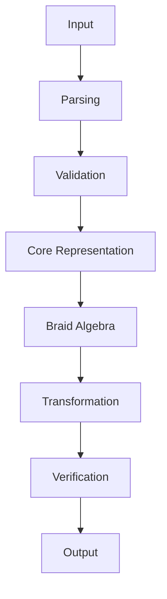

# BRAID GROUP SYSTEM

## Zero-Tolerance Repository Intelligence Specification

> **Status:** Evidence-driven documentation system
> **Principle:** No unsupported claim survives validation.
> **Authority:** Repository implementation, tests, formal artifacts, and verified assets.

---

# 00. THE CONTRACT

This document is not a marketing summary.

It is the navigational interface to the repository.

Every significant statement must be traceable to an actual repository artifact.

Every architecture claim must correspond to implementation.

Every mathematical claim must correspond to a mathematical definition, implementation, or explicitly identified theoretical reference.

Every graphic must correspond to something real.

Every source reference must resolve.

Every command must be verified.

Every reported limitation must be preserved rather than hidden.

If evidence is unavailable, the documentation must say so.

No guessing.

No fabricated APIs.

No fabricated benchmarks.

No fabricated proofs.

No fabricated security guarantees.

No fictional architecture.

---

# 01. SYSTEM IDENTITY

## What is this?

[Describe the actual system discovered during repository analysis.]

## What does it contain?

[Enumerate the major verified subsystems.]

## What mathematical structures does it implement?

[Enumerate only repository-supported mathematical structures.]

## What is the relationship to Braid Group mathematics?

[Explain using repository evidence.]

---

# 02. REPOSITORY ATLAS

```text
REPOSITORY
│
├── CORE
│   ├── IMPLEMENTATION
│   ├── DATA
│   └── RUNTIME
│
├── MATHEMATICS
│   ├── DEFINITIONS
│   ├── ALGEBRA
│   ├── BRAID GROUP
│   └── FORMALIZATION
│
├── VERIFICATION
│   ├── TESTS
│   ├── PROOFS
│   └── VALIDATION
│
├── GRAPHICS
│   ├── DIAGRAMS
│   ├── BRAID VISUALIZATIONS
│   └── ARCHITECTURE
│
└── DOCUMENTATION
```

Replace this conceptual structure with the actual repository structure after recursive inspection.

---

# 03. COMPLETE FILE INDEX

Every significant file receives an entry.

```text
FILE
  ↓
PURPOSE
  ↓
SYMBOLS
  ↓
DEPENDENCIES
  ↓
CALLERS
  ↓
MATHEMATICS
  ↓
TESTS
  ↓
GRAPHICS
  ↓
VERIFICATION
```

The documentation must maintain this relationship throughout the repository.

---

# 04. LINE-LEVEL AUDIT

For source files that require detailed inspection:

```text
FILE
LINE
COLUMN
TOKEN
SYMBOL
CONTEXT
DEPENDENCY
MATHEMATICAL MEANING
TEST COVERAGE
STATUS
```

Record verified defects precisely.

Do not convert an inferred concern into a confirmed defect.

For extremely large repositories, process source in deterministic chunks while preserving exact file and line ranges.

---

# 05. BRAID GROUP ATLAS

The Braid Group layer receives its own complete documentation hierarchy.

```text
Bₙ
│
├── STRANDS
│
├── GENERATORS
│   ├── σ₁
│   ├── σ₂
│   ├── ...
│
├── BRAID WORDS
│
├── RELATIONS
│
├── PRODUCT
│
├── IDENTITY
│
├── INVERSE
│
├── REDUCTION
│
├── NORMALIZATION
│
└── REPRESENTATIONS
```

Every node must map back to actual implementation.

---

# 06. GENERATOR CROSSWALK

For every implemented generator:

| Generator | Definition | Implementation | File | Function | Tests | Graphic |
| --------- | ---------- | -------------- | ---- | -------- | ----- | ------- |

Verify generator indexing rather than assuming it.

Verify composition direction rather than assuming it.

Verify word ordering rather than assuming it.

---

# 07. BRAID ALGEBRA

Document the actual algebra implemented by the repository.

Where supported, explain relations such as:

$$
\sigma_i\sigma_{i+1}\sigma_i
=
\sigma_{i+1}\sigma_i\sigma_{i+1}
$$

and, where applicable,

$$
\sigma_i\sigma_j
=
\sigma_j\sigma_i
\qquad |i-j|>1
$$

But distinguish rigorously between:

**mathematical definition**

**repository implementation**

**test evidence**

**formal proof**

**theoretical background**

Do not claim that implementation enforces a relation merely because the relation is mathematically standard.

---

# 08. BRAID WORD ENGINE

Document the complete lifecycle:

```text
INPUT
 ↓
PARSER
 ↓
BRAID WORD
 ↓
GENERATOR SEQUENCE
 ↓
ALGEBRAIC OPERATION
 ↓
REDUCTION
 ↓
NORMAL FORM
 ↓
REPRESENTATION
 ↓
VERIFICATION
 ↓
OUTPUT
```

For every stage identify the actual source implementation.

---

# 09. BRAID VISUALIZATION

Every important braid construction should have a corresponding visualization when practical.

A visualization must communicate:

* strand count
* generator sequence
* crossings
* word ordering
* composition
* transformation
* reduction
* final representation

The visual must be derived from actual repository data.

It must never be fabricated merely to make the README look impressive.

---

# 10. CODE ↔ MATHEMATICS ↔ GRAPHICS

The documentation must support both directions.

### Code to mathematics

```text
SOURCE FILE
 ↓
FUNCTION
 ↓
DATA STRUCTURE
 ↓
MATHEMATICAL OBJECT
 ↓
BRAID / ALGEBRA
 ↓
GRAPHIC
```

### Graphic to code

```text
GRAPHIC
 ↓
VISUAL OBJECT
 ↓
MATHEMATICAL OBJECT
 ↓
ALGEBRAIC OPERATION
 ↓
IMPLEMENTATION
 ↓
SOURCE FILE
 ↓
TEST
```

No major concept should exist in only one representation when a meaningful crosswalk is possible.

---

# 11. ARCHITECTURE

Create a verified architecture graph.



Replace conceptual nodes with actual repository components.

Every arrow must represent a real relationship.

---

# 12. DEPENDENCY GRAPH

Document:

```text
APPLICATION
    ↓
SUBSYSTEM
    ↓
MODULE
    ↓
FUNCTION
    ↓
DEPENDENCY
```

Distinguish:

* direct dependency
* transitive dependency
* runtime dependency
* build dependency
* optional dependency
* test dependency

---

# 13. DATA MODEL

For every important data structure explain:

```text
NAME
TYPE
FIELDS
INVARIANTS
CREATION
TRANSFORMATION
SERIALIZATION
VALIDATION
CONSUMERS
TESTS
```

If the data structure represents a braid or algebraic object, explicitly connect it to the mathematical model.

---

# 14. EXECUTION TRACE

For each major entrypoint provide a complete execution trace.

```text
ENTRYPOINT
 ↓
INPUT
 ↓
VALIDATION
 ↓
PARSING
 ↓
STATE
 ↓
BRAID / ALGEBRA OPERATION
 ↓
TRANSFORMATION
 ↓
VERIFICATION
 ↓
OUTPUT
```

Include exact file and symbol references.

---

# 15. VERIFICATION

Create a verification hierarchy:

```text
SOURCE
 ↓
STATIC ANALYSIS
 ↓
TYPE CHECKING
 ↓
TESTING
 ↓
PROPERTY VALIDATION
 ↓
FORMAL PROOF
 ↓
RUNTIME VERIFICATION
```

Only include layers actually present.

Clearly distinguish tested behavior from formally proven behavior.

---

# 16. FAILURE ATLAS

Every confirmed failure gets documented.

```text
FAILURE
 ↓
FILE
 ↓
LINE
 ↓
ROOT CAUSE
 ↓
AFFECTED COMPONENT
 ↓
BLAST RADIUS
 ↓
TEST STATUS
 ↓
REMEDIATION STATUS
```

Search specifically for:

* malformed regex
* syntax errors
* type errors
* missing symbols
* broken imports
* broken references
* stale APIs
* dead code
* incomplete implementations
* contradictory tests
* stale diagrams
* broken documentation
* inconsistent mathematical definitions

---

# 17. REGEX AUDIT

Every repository regex should be accounted for.

For each:

| Pattern | File | Line | Purpose | Caller | Tests | Risk | Status |
| ------- | ---- | ---: | ------- | ------ | ----- | ---- | ------ |

Inspect both syntax and semantics.

Do not assume a syntactically valid regex is logically correct.

---

# 18. TEST ATLAS

Map:

```text
TEST
 ↓
IMPLEMENTATION
 ↓
BEHAVIOR
 ↓
MATHEMATICAL OBJECT
 ↓
EXPECTED RESULT
```

Identify coverage gaps.

Identify stale tests.

Identify contradictory tests.

Identify important behavior without tests.

---

# 19. GRAPHICS ATLAS

Every repository graphic must be indexed.

| Asset | Type | Subject | Source Relationship | Mathematical Relationship | README Location |
| ----- | ---- | ------- | ------------------- | ------------------------- | --------------- |

Then determine which important implementation concepts lack visualization.

Create new graphics only from verified repository evidence.

---

# 20. INTERACTIVE DOCUMENTATION

The README is the top-level map.

A companion documentation layer should provide deeper exploration where appropriate.

Potential interfaces:

* Repository Explorer
* File Explorer
* Symbol Explorer
* Braid Explorer
* Generator Explorer
* Braid Word Viewer
* Algebra Explorer
* Dependency Explorer
* Test Explorer
* Verification Explorer
* Graphics Atlas
* Mathematical Glossary
* Failure Atlas

Do not fake interactivity.

If GitHub Markdown cannot execute a feature, move that feature into the companion documentation application.

---

# 21. MATHEMATICS CROSSWALK

| Mathematical Object | Repository Representation | Source | Symbol | Test | Proof | Graphic |
| ------------------- | ------------------------- | ------ | ------ | ---- | ----- | ------- |

This table is an evidence map, not a textbook glossary.

---

# 22. SECURITY

If cryptographic or security-sensitive braid operations exist, document:

```text
INPUT
 ↓
TRUST BOUNDARY
 ↓
VALIDATION
 ↓
MATHEMATICAL REPRESENTATION
 ↓
CRYPTOGRAPHIC OPERATION
 ↓
VERIFICATION
 ↓
OUTPUT
```

Make no security guarantee that cannot be established from evidence.

---

# 23. REPRODUCIBILITY

Document:

* exact dependencies
* build procedure
* configuration
* test procedure
* deterministic operations
* generated artifacts
* hashes where applicable
* verification procedure

A reader should be able to reproduce documented results where the repository permits it.

---

# 24. CLAIM AUDIT

Every significant README claim receives an internal evidence classification:

```text
IMPLEMENTED
TESTED
FORMALLY VERIFIED
DOCUMENTED
INFERRED
UNVERIFIED
KNOWN ISSUE
```

Never silently promote:

INFERRED → IMPLEMENTED

or

DOCUMENTED → VERIFIED

or

INTENDED → WORKING

---

# 25. FINAL RECURSIVE AUDIT

After generating every documentation artifact:

START AGAIN.

Read the README.

For every claim:

→ locate evidence.

For every diagram:

→ locate implementation.

For every mathematical statement:

→ locate definition or evidence.

For every source reference:

→ verify path.

For every function:

→ verify symbol.

For every test:

→ verify test exists.

For every graphic:

→ verify asset.

For every braid:

→ verify representation.

For every algebraic relation:

→ verify implementation or label it theoretical.

Then search for anything omitted.

Repeat.

---

# 26. ZERO-TOLERANCE COMPLETION GATE

The documentation cannot be declared complete until:

[ ] Repository inventory completed

[ ] Source corpus analyzed

[ ] Major files traced

[ ] Important symbols traced

[ ] Dependencies mapped

[ ] Execution paths traced

[ ] Tests mapped

[ ] Regexes audited

[ ] Graphics audited

[ ] Mathematical structures mapped

[ ] Braid Group structures mapped

[ ] Braid Algebra mapped

[ ] Generators mapped

[ ] Braid words mapped

[ ] Relations mapped

[ ] Verification mapped

[ ] Defects documented

[ ] Documentation cross-validated

[ ] Links verified

[ ] Commands verified

[ ] No fabricated claims remain

[ ] No unsupported architecture remains

[ ] No unmapped critical graphic remains

[ ] No critical mathematical object remains unexplained

---

# 27. THE FINAL STANDARD

The final README must function simultaneously as:

**A technical manual**

**A repository atlas**

**A mathematical reference**

**A Braid Group atlas**

**A Braid Algebra reference**

**A code navigation system**

**A verification record**

**A graphics index**

**An architecture map**

**A failure report**

**A gateway to interactive documentation**

The reader must be able to descend recursively:

```text
SYSTEM
 ↓
SUBSYSTEM
 ↓
MATHEMATICS
 ↓
BRAID GROUP
 ↓
GENERATOR
 ↓
BRAID WORD
 ↓
ALGEBRA
 ↓
FUNCTION
 ↓
FILE
 ↓
LINE
 ↓
TEST
 ↓
PROOF
 ↓
GRAPHIC
```

and reverse the path:

```text
GRAPHIC
 ↓
MATHEMATICAL OBJECT
 ↓
ALGEBRA
 ↓
IMPLEMENTATION
 ↓
FUNCTION
 ↓
FILE
 ↓
TEST
 ↓
VERIFICATION
```

## FINAL COMMAND

Do not optimize for length.

Optimize for **traceability**.

Do not optimize for hype.

Optimize for **evidence**.

Do not optimize for decoration.

Optimize for **comprehension**.

Do not stop after one pass.

Do not stop after discovering the obvious architecture.

Recursively investigate every newly discovered relationship.

Continue until another complete pass produces no materially new findings.

**THE REPOSITORY IS THE AUTHORITY.**

**THE README IS THE MAP.**

**THE MATHEMATICS MUST MATCH THE IMPLEMENTATION.**

**THE GRAPHICS MUST MATCH THE MATHEMATICS.**

**THE TESTS MUST MATCH THE BEHAVIOR.**

**THE CLAIMS MUST MATCH THE EVIDENCE.**

**WHEN EVIDENCE IS ABSENT, SAY SO.**

**WHEN IMPLEMENTATION IS BROKEN, SAY SO.**

**WHEN SOMETHING IS UNKNOWN, PRESERVE THE UNKNOWN.**

**NEVER INVENT THE MISSING PIECE.**
