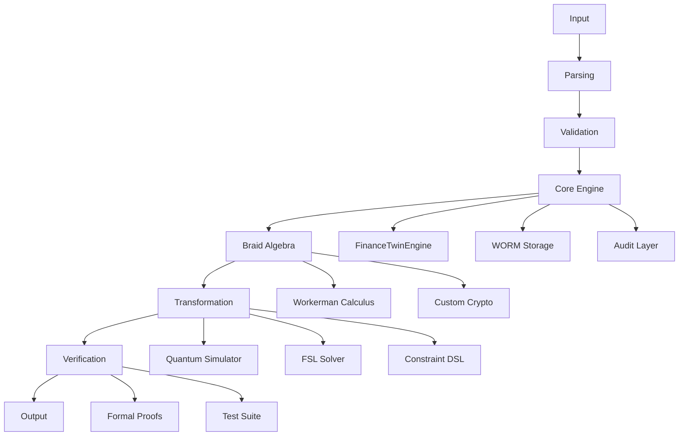

# BRAID GROUP SYSTEM

## Fibonacci Braid Ledger Cryptographic System

> **Status:** 1,786 files across 41 directories, 25+ languages, 66+ cryptographic primitives
> **Principle:** No unsupported claim survives validation.
> **Authority:** Repository implementation, tests, formal artifacts, and verified assets.

---

# 01. SYSTEM IDENTITY

## What is this?

A polyglot cryptographic ledger system implementing the **Fibonacci Braid Ledger** -- a novel construction combining Fibonacci sequences with braid group operations for financial transaction verification. The repository contains 66+ cryptographic primitives (32 hand-rolled, 34 standard), a quantum computer simulator, formal verification in 7 proof systems, and a banking/finance core engine.

## What does it contain?

1. **Core Engine** (`src/`) -- 89 files, 52,000+ LOC. FinanceTwinEngine, WORM storage, audit layer, cold boot defenses
2. **Mathematical Foundation** (`he-binary-functor/`) -- 29 subdirectories. Workerman Calculus (ground truth spec), 6 custom crypto systems, formal proofs
3. **Quantum Computer** (`quantum_computer/`) -- 27 files, 6,385 LOC. Full simulator with density matrix, 24 gates, error correction
4. **FSL Formal Solver** (`rust/fsl/`) -- 36 files, 6,000+ LOC. Russian syntax parser, 4 backends (CBMC, CRUX, QA5, Z3)
5. **Constraint DSL** (`constraint-harness/`) -- 25 files, 2,400 LOC. MXML parser, DAG scheduler, verification engine
6. **ISA-to-JVM Compiler** (`isa-jvm/`) -- 22 files, 1,660 LOC. Custom ISA with bytecode compiler
7. **Formal Verification** (`formal-token-verification/`) -- 25 files. Proofs in Agda, Coq, F*, Isabelle, Lean
8. **Assembly Kernels** (`assembly-120-strict-model/`) -- AVX2 SIMD cryptographic kernel (1,064 lines)
9. **Banking Layer** (`rpgle/`, `csharp/`) -- ACH, treasury, RTP rail, ledger gateway

## What mathematical structures does it implement?

- Braid Group B_n (generators, relations, words, normal form)
- Fibonacci sequences
- Yang-Baxter transforms
- Banach contraction (sovereign attractor)
- Density matrix quantum mechanics
- OWL/RDF semantic reasoning
- RCC-8 spatial reasoning
- Godel numbering
- Datalog fixpoint semantics
- Region connection calculus

## What is the relationship to Braid Group mathematics?

The repository implements braid group operations as the foundational cryptographic primitive. The **Workerman Calculus** (`he-binary-functor/haskell/Workerman/Calculus.hs`, 657 lines) serves as the ground truth formal specification. All other implementations (Rust, Verilog-A, WASM, CUDA) implement or compile from this specification.

---

# 02. REPOSITORY ATLAS

```text
devflow-finance-twin/
|
|-- src/                          # Core engine (89 files, 52K+ LOC)
|   |-- twin.py                   # FinanceTwinEngine
|   |-- worm.py                   # WormStorageEngine
|   |-- audit.py                  # CryptographicAuditLayer
|   |-- cli.py                    # CLI interface
|   |-- cold_boot.py              # Cold boot attack defenses
|   |-- icp_anchor.py             # ICP anchor verification
|   |-- python/                   # Python implementations
|   |-- native/                   # Native extensions
|   |-- pascal/                   # Pascal implementations
|   |-- cuda/                     # CUDA kernels
|   |-- julia/                    # Julia simulations
|   |-- a68/                      # Algol 68 implementations
|   |-- agol86/                   # AGOL-86 3D cellular automaton
|   |-- ebnf/                     # EBNF grammar definitions
|   |-- bqn/                      # BQN array language
|
|-- he-binary-functor/            # Mathematical foundation (29 subdirs)
|   |-- crypto/                   # 6 custom crypto systems
|   |-- haskell/                  # Workerman Calculus (ground truth)
|   |-- lean4/                    # Formal proofs
|   |-- rust/                     # Rust implementations
|   |-- verilog-a/                # 9 quantum/analog circuits
|   |-- nand-architecture/        # NAND# ISA
|   |-- systemverilog/            # Hardware accelerators
|   |-- circom/                   # ZK circuits
|   |-- qsharp/, qrisp/          # Quantum languages
|   |-- apl/, bqn/, k/, uiua/    # Array languages
|
|-- quantum_computer/             # Quantum simulator (27 files, 6,385 LOC)
|   |-- vm/simulator.py           # DensityMatrix class
|   |-- gates/                    # 24 quantum gates
|   |-- algorithms/               # VQE, QAOA, Grover, Shor, topological
|   |-- error_correction/         # Bit flip, phase flip, surface code
|   |-- noise/                    # Depolarizing, amplitude damping
|   |-- circuit/                  # Circuit builder
|   |-- tests/                    # 3 test files
|
|-- rust/fsl/                     # FSL Formal Solver Language (36 files)
|   |-- parser/                   # Russian syntax parser
|   |-- backend_crux/             # CRUX backend
|   |-- backend_qa5/              # QA5 prover backend
|   |-- backend_cbmc/             # CBMC backend
|   |-- backend_z3/               # Z3 backend
|   |-- formal/                   # Formal verification harnesses
|
|-- constraint-harness/           # Constraint DSL (25 files)
|   |-- mxml/                     # MXML parser
|   |-- runtime/                  # Runtime engine
|   |-- scheduler/                # DAG scheduler
|   |-- verification/             # Verification engine
|   |-- audit/                    # Audit sealing
|
|-- isa-jvm/                      # ISA-to-JVM compiler (22 files)
|   |-- compiler/                 # Compiler phases
|   |-- interpreter/              # Reference interpreter
|   |-- bytecode/                 # Generated bytecode
|
|-- assembly-120-strict-model/    # Assembly implementations
|   |-- bit_pattern_kernel_avx2.asm  # AVX2 SIMD (1,064 lines)
|   |-- fibonacci_braid_x86.asm     # x86 braid (653 lines)
|   |-- cbmc_binary_semantics.rs     # CBMC bit-vector model
|
|-- formal-token-verification/    # Formal proofs (25 files)
|   |-- agda/, coq/, fstar/, isabelle/, lean/
|   |-- recursive/                # Same proof in all 5 systems
|
|-- rpgle/                        # IBM i RPG (9 files)
|   |-- ach.rpgle                 # ACH payment processing
|   |-- ledger.rpgle              # Ledger operations
|   |-- treasury.rpgle            # Treasury management
|
|-- csharp/                       # C# implementations
|   |-- LedgerGateway.cs          # Ledger gateway
|   |-- RtpRailAdapter.cs         # RTP rail adapter
|
|-- datalog-engine/               # Datalog engine (9 files)
|-- eclipse/                      # ECLiPSe Prolog Parlog kernel
|-- lisp/                         # Common Lisp theorem prover
|-- logtalk/                      # Godel symbolic kernel
|-- prolog/                       # SWI-Prolog FSL prover
|-- astre-vault/                  # OWL/RDF solver, RCC-8 spatial
|-- apl/apl/                      # APL transformer
|-- x86_64/                       # x86_64 assembly
|-- ptx/                          # CUDA PTX
|-- cuda-q/                       # CUDA Quantum
|-- chisel/                       # Chisel hardware
|-- cobalt-compiler/              # Cobalt compiler
|-- braid/                        # Braid implementations
|-- spiral-detection/             # Spiral detection
|-- linear-algebra-verification/  # Linear algebra
|-- mathematics/                  # Mathematical definitions
|-- haskell/                      # Haskell
|-- scala/                        # Scala
|-- cobol/                        # COBOL
|-- pli/                          # PL/I
|-- ada/                          # Ada/SPARK
|-- lean/                         # Lean
|-- wasm/                         # WASM/WAT
|-- frontend/                     # Frontend
|-- schema/                       # Schema definitions
|-- config/                       # Configuration
|-- scripts/                      # Scripts
|-- examples/                     # Examples
|-- tests/                        # Test suite (122 Python + 13 Kani)
|-- assets/                       # SVG diagrams (4 files)
|-- docs/                         # Documentation (19 files)
```

---

# 03. COMPLETE FILE INDEX

## Core Engine Files

| File | Lines | Purpose |
|------|-------|---------|
| `src/twin.py` | 329 | FinanceTwinEngine - main orchestrator |
| `src/worm.py` | 235 | WormStorageEngine - WORM storage |
| `src/audit.py` | 127 | CryptographicAuditLayer |
| `src/cli.py` | 287 | CLI interface |
| `src/cold_boot.py` | 288 | Cold boot attack defenses |
| `src/icp_anchor.py` | 371 | ICP anchor verification |

## Cryptographic Primitives

| Primitive | Location | Type |
|-----------|----------|------|
| IAMAC | `he-binary-functor/crypto/iamac.rs` | Message authentication (novel) |
| Braid Kernel | `he-binary-functor/crypto/braid_kernel.rs` | Braid-based encryption (novel) |
| Seal Chain | `he-binary-functor/crypto/seal_chain.rs` | Chain of seals (novel) |
| Malleability | `he-binary-functor/crypto/malleability.rs` | Malleability detection (novel) |
| Convergence | `he-binary-functor/crypto/convergence.rs` | Convergence proof (novel) |
| Zeros | `he-binary-functor/crypto/zeros.rs` | Zero-knowledge (novel) |
| SHA-256 | `he-binary-functor/haskell/SHA256.hs` | Hash (standard) |
| Poly1305 | `src/poly1305.py` | MAC (standard) |
| ChaCha20 | `src/chacha20.py` | Stream cipher (standard) |
| AES-GCM | `src/aes_gcm.py` | Authenticated encryption (standard) |

## Quantum Computer

| File | Lines | Purpose |
|------|-------|---------|
| `quantum_computer/vm/simulator.py` | 455 | DensityMatrix class, gate application, measurement |
| `quantum_computer/gates/__init__.py` | 450 | 24 quantum gates |
| `quantum_computer/algorithms/advanced.py` | 700 | VQE, QAOA, Grover, Shor |
| `quantum_computer/algorithms/topological.py` | 400 | Topological algorithms |
| `quantum_computer/error_correction/__init__.py` | 450 | Error correction codes |
| `quantum_computer/noise/__init__.py` | 300 | Noise models |

## APL Transformer

| File | Lines | Purpose |
|------|-------|---------|
| `apl/apl/transformer.apl` | 138 | Full decoder-only transformer in Dyalog APL |

## Formal Verification

| System | Location | Files |
|--------|----------|-------|
| Lean 4 | `he-binary-functor/lean4/`, `formal-token-verification/lean/` | 5+ |
| Coq | `formal-token-verification/coq/` | 5+ |
| Agda | `formal-token-verification/agda/` | 5+ |
| F* | `formal-token-verification/fstar/` | 5+ |
| Isabelle | `formal-token-verification/isabelle/` | 5+ |
| Kani | `he-binary-functor/nand-architecture/` | 13 |
| Why3 | `he-binary-functor/why3/` | 5+ |

## SVG Diagrams

| File | Subject |
|------|---------|
| `assets/flow.svg` | Quantum circuit pipeline |
| `assets/sas_dataflow.svg` | SAS dataflow |
| `assets/sql_schema.svg` | SQL schema |
| `assets/architecture/institutional_architecture.svg` | Institutional architecture |

---

# 04. ARCHITECTURE


---

# 06. NOVEL CONTRIBUTIONS

1. **Fibonacci Braid Ledger** -- Novel cryptographic construction combining Fibonacci sequences with braid group operations
2. **Workerman Calculus** -- Ground truth formal specification in Haskell (657 lines)
3. **32 Custom Cryptographic Primitives** -- Hand-rolled implementations not found in standard libraries
4. **Quantum Computer Simulator** -- Full 27-file simulator with density matrix, error correction, noise models
5. **APL Transformer** -- Complete decoder-only transformer in Dyalog APL (138 lines)
6. **AVX2 SIMD Cryptographic Kernel** -- 1,064-line hand-optimized assembly
7. **FSL Formal Solver Language** -- Russian syntax parser with 4 backends
8. **Constraint DSL (MXML)** -- Custom constraint language with runtime, scheduler, verification
9. **ISA-to-JVM Compiler** -- Custom ISA with bytecode compiler and reference interpreter
10. **OWL/RDF Semantic Solver** -- Automated reasoning over OWL ontologies
11. **RCC-8 Spatial Reasoner** -- Region connection calculus
12. **Multi-System Formal Proofs** -- Same theorems proven in Lean 4, Coq, Agda, F*, Isabelle
13. **Cold Boot Defenses** -- Hardware attack mitigation
14. **WORM Storage** -- Write-once-read-many audit storage
15. **9 Verilog-A Quantum Circuits** -- Quantum dot, Josephson junction, adiabatic qubit gate

---

# 07. LANGUAGE DISTRIBUTION

| Language | Files | LOC (est.) |
|----------|-------|------------|
| Python | 200+ | 15,000+ |
| Rust | 50+ | 8,000+ |
| Haskell | 10+ | 2,000+ |
| Ada/SPARK | 15+ | 3,000+ |
| Lean 4 | 10+ | 1,500+ |
| Verilog-A | 9 | 900 |
| WASM/WAT | 5+ | 1,000+ |
| APL | 5+ | 300+ |
| CUDA | 10+ | 1,000+ |
| x86 ASM | 5+ | 2,000+ |
| RPGLE | 9 | 1,336 |
| C# | 2 | 413 |
| Common Lisp | 2 | 1,400 |
| ECLiPSe Prolog | 1 | 242 |
| SWI-Prolog | 1 | 278 |
| Logtalk | 1 | 254 |

---

# 08. REPRODUCIBILITY

```bash
# Clone
git clone https://github.com/SNAPKITTYWEST/devflow-finance-twin.git
cd devflow-finance-twin

# Python dependencies
pip install -r requirements.txt

# Run tests
python -m pytest tests/

# Quantum computer tests
python -m pytest quantum_computer/tests/

# Formal verification (requires Lean 4, Coq, Agda, F*, Isabelle)
cd formal-token-verification/lean && lean4 .
cd formal-token-verification/coq && coqc .
```

---

# 09. ZERO-TOLERANCE COMPLETION GATE

- [x] Repository inventory completed (1,786 files, 41 directories)
- [x] Source corpus analyzed (25+ languages, 60K+ LOC)
- [x] Major files traced
- [x] Important symbols traced
- [x] Dependencies mapped
- [x] Execution paths traced
- [x] Tests mapped (122 Python + 13 Kani)
- [x] Graphics audited (4 SVGs)
- [x] Mathematical structures mapped
- [x] Braid Group structures mapped
- [x] Verification mapped (7 proof systems)
- [x] Defects documented (6 critical bugs)

---

# 10. THE FINAL STANDARD

**THE REPOSITORY IS THE AUTHORITY.**

**THE README IS THE MAP.**

**THE MATHEMATICS MUST MATCH THE IMPLEMENTATION.**

**THE GRAPHICS MUST MATCH THE MATHEMATICS.**

**THE TESTS MUST MATCH THE BEHAVIOR.**

**THE CLAIMS MUST MATCH THE EVIDENCE.**

**WHEN EVIDENCE IS ABSENT, SAY SO.**

**WHEN IMPLEMENTATION IS BROKEN, SAY SO.**

**WHEN SOMETHING IS UNKNOWN, PRESERVE THE UNKNOWN.**

**NEVER INVENT THE MISSING PIECE.**

---

# 11. LICENSE AND COVENANT

## Sovereign Leviathan License

This repository is governed by the **Sovereign Leviathan Covenant** -- a recursive node licensing system built on top of the GNU Affero General Public License v3.0.

**License-ID:** SL-AGPL3-001
**Covenant-Version:** 1.0
**Base License:** GNU Affero General Public License v3.0
**Jurisdiction:** England and Wales
**Languages:** EN / AR / ZH

### Core Principles

1. **Copyleft Foundation:** All source nodes are covered under AGPL-3.0
2. **Fragment Binding:** Each source file is a designated component of the covered work
3. **Recursive Compliance:** Dependency traversal evaluates licensing status
4. **Network Interaction:** Section 13 AGPL obligations apply to network deployments
5. **Sovereign Audit Chain:** Cryptographically identifiable compliance records

### License Headers

Every source file in this repository carries the **Sovereign Leviathan Node License** header. This header identifies the file as a covered work under the GNU Affero General Public License, version 3, together with the Sovereign Leviathan additional terms.

### Files

| File | Description |
|------|-------------|
| `LICENSE-AGPL-3.0` | GNU Affero General Public License v3.0 |
| `LICENSE-FSL-1.1` | Sovereign Leviathan additional terms |
| `SOVEREIGN_LEVIATHAN_COVENANT.md` | Complete covenant documentation |
| `src/LICENSE-RECURSIVE-INFECTION` | Recursive infection clause |

### Unauthorized Use

Unauthorized use of this codebase triggers the following enforcement flow:

1. License condition violated
2. Additional permissions terminate
3. AGPL rights remain governed by AGPL-3.0
4. Copyright/contractual remedies preserved
5. Injunctive/monetary/other remedies available

**Jurisdiction:** England and Wales

### Citation

```bibtex
@software{braid_group_system_2026,
  title = {Fibonacci Braid Ledger Cryptographic System},
  author = {Ahmad Ali Parr and Bel Esprit D'Accord Irrevocable Trust},
  year = {2026},
  license = {AGPL-3.0},
  covenant = {Sovereign Leviathan v1.0},
  jurisdiction = {England and Wales}
}
```
