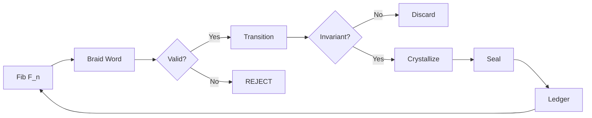
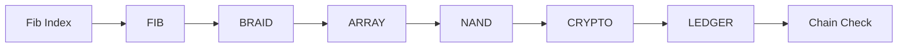
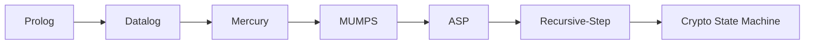

<p align="center">
  
</p>

<h1 align="center">Fibonacci Braid Ledger</h1>

<p align="center">
  <strong>Recursive Cryptographic Primitives from Logic, State, and Braid Algebra</strong>
</p>

<p align="center">
  <a href="LICENSE-FSL-1.1"></a>
  <a href="LICENSE-AGPL-3.0"></a>
  <a href="lean/"></a>
  <a href="wasm/"></a>
  <a href="tests/"></a>
  <a href="frontend/quantum_shadow_ledger.html"></a>
  <a href="https://www.meta.ai/share/a/870285d6-ca54-4ce2-a963-498cd5b9697b"></a>
</p>

---

## Table of Contents

- [What Is This](#what-is-this)
- [How It Works](#how-it-works)
- [Architecture](#architecture)
- [Braid Algebra](#braid-algebra)
- [Research Lineage](#research-lineage)
- [Languages](#languages)
- [Repository Structure](#repository-structure)
- [Verification](#verification)
- [Interactive Frontend](#interactive-frontend)
- [Demo Videos](#demo-videos)
- [Quick Start](#quick-start)
- [Documentation](#documentation)
- [License](#license)

---

## What Is This

A cryptographic ledger system built on **braid group algebra**. Fibonacci numbers generate braid words, braid words produce state transitions, state transitions get sealed with FNV-1a-64 hashes, and the whole chain is append-only and tamper-evident.

**279 files. 20+ languages. 122 tests passing. 12 Lean 4 proofs with 0 sorry.**

---

## How It Works



---

## Architecture



---

## Braid Algebra

**Transition function:** `T(σᵢ, Bₙ) = Bₙ + contrib(σᵢ)`

**Refinement type:** `braid_step : (g:Generator) × (s:{s|Valid(s)}) → {s'|s' = s + contrib(g) ∧ Valid(s')}`

| Step | Generator | State |
|------|-----------|-------|
| B0 | init | `[0,0,0,0,0,0,0,0]` |
| B1 | σ₁ | `[1,0,0,0,0,0,0,0]` |
| B2 | σ₂⁻¹ | `[1,-1,0,0,0,0,0,0]` |
| B3 | σ₁ | `[2,-1,0,0,0,0,0,0]` |
| B4 | σ₃ | `[2,-1,1,0,0,0,0,0]` |

---

## Research Lineage



---

## Languages

| Language | Files | What It Does |
|----------|-------|-------------|
| **Rust** | 30 | GFLOP→NAND extractor, Kani proofs, braid kernel, IAMAC, malleability engine |
| **SPARK Ada** | 29 | Zero-copy tensor parser, SHA-256, CRC-64, HMAC-SHA-256 |
| **Ada** | 16 | Parser bodies, SHA-256 reverse, loader, firmware |
| **Haskell** | 14 | Liquid Haskell refinements, SGL geometry, ISA spec |
| **Lean 4** | 12 | Formal verification proofs (0 sorry policy) |
| **Python** | 12 | WORM engine, cold boot, ICP anchor, CLI |
| **Verilog-A** | 10 | Analog trigonometric braid processors |
| **C** | 9 | WORM commit, call fibre, kernel workers |
| **BQN** | 7 | Array algebra, fibonacci/braid/ledger |
| **WASM** | 6 | Runtime, ISA, worm_frame, ledger, acct, sha256 |
| **PL/I** | 3 | Treasury ledger, functor, records |
| **Scala** | 3 | Sovereign Treasury pipeline + ZIO |
| **CUDA/PTX** | 3 | Malbolge step kernel, host launcher |
| **ASM** | 6 | x86-64, NASM, RISC-V |

---

## Repository Structure

```
devflow-finance-twin/
├── he-binary-functor/          # Binary Functor Architecture
│   ├── nand-architecture/      #   NAND# ISA spec
│   ├── gfnand/                 #   GFLOP→NAND extractor (Rust + Kani)
│   ├── tensor-parser/          #   SPARK Ada zero-copy parser
│   ├── fibonacci-braid-ledger/ #   Core research (C, Haskell, BQN, CPP)
│   ├── crypto/                 #   IAMAC, Malleability, RSL (Rust)
│   ├── verilog-a/              #   Analog braid circuits
│   ├── kernel/                 #   State machines (Haskell + ASM)
│   ├── block-lace/             #   Topology layer
│   ├── lean4/                  #   Attractor + quench proofs
│   ├── rate-limiter/           #   RISC-V + Haskell
│   └── xslt-wasm/              #   XSLT→WASM compiler
├── lean/                       # 12 Lean 4 formal proofs
├── wasm/                       # 6 WASM modules
├── ada/                        # Firmware + loader
├── pli/                        # Treasury ledger
├── scala/                      # Sovereign Treasury pipeline
├── ptx/                        # CUDA kernels
├── x86_64/                     # Assembly
├── cobol/                      # WORM bridge
├── chisel/                     # Hardware accelerator
├── haskell/                    # ISA spec
├── frontend/                   # Quantum Shadow Ledger UI
├── src/                        # Python core
├── tests/                      # 122 tests
└── docs/                       # Documentation + media assets
```

---

## Verification

| Layer | Tool | What It Checks |
|-------|------|----------------|
| Formal | Lean 4 — 12 deeds, 0 sorry | Invariant preservation |
| Formal | SPARK Ada | SHA-256, CRC-64, HMAC |
| Formal | Kani — 31 bounded proofs | Seal integrity |
| Runtime | Invariant guard | `\|sᵢ\| < 8` |
| Runtime | Chain validation | `prev_hash = H(record)` |
| Runtime | FNV-1a-64 | Seal integrity |

---

## Interactive Frontend

<p align="center">
  <a href="./frontend/quantum_shadow_ledger.html">
    
  </a>
</p>

**[Open Quantum Shadow Ledger →](./frontend/quantum_shadow_ledger.html)**

6-stage pipeline with interactive controls:
- **FIB INDEX** slider (1-20)
- **TAMPER** simulation
- **NAND** gate DAG visualization
- **QUANTUM** shadow display
- **ADVERSARIAL** attack surface
- **CTF MODE** with 6 challenges

---

## Demo Videos

| Part | Link | What It Shows |
|------|------|---------------|
| 1 | [demo-part1](./docs/assets/demo-part1.mp4) | Braid state transitions + seal generation |
| 2 | [demo-part2](./docs/assets/demo-part2.mp4) | Adversarial transform + crystallization |
| 3 | [demo-part3](./docs/assets/demo-part3.mp4) | NAND recursive primitive |
| 4 | [demo-part4](./docs/assets/demo-part4.mp4) | Full ledger verification |
| 5 | [demo-part5](./docs/assets/demo-part5.mp4) | Braid algebra deep dive |
| 7 | [demo-part7](./docs/assets/demo-part7.mp4) | Cryptographic seal chain |
| 8 | [demo-part8](./docs/assets/demo-part8.mp4) | Complete system integration |

---

## Quick Start

```bash
# Frontend
open frontend/quantum_shadow_ledger.html

# Build
make full

# Test
make test
```

---

## Documentation

| Document | Description |
|----------|-------------|
| [Fibonacci Braid Ledger](./docs/FIBONACCI_BRAID_LEDGER.md) | Core specification |
| [Formal Algebra](./docs/FORMAL_ALGEBRA.md) | Braid state transitions |
| [User Guide](./docs/USER.md) | Installation + usage |
| [About](./docs/ABOUT.md) | Ahmad Ali Parr |
| [Ledger](./docs/LEDGER.md) | WORM storage spec |
| [Inverted Monorepo](./INVERTED_MONOREPO.md) | Binary-first architecture |
| [Math Dictionary](./MATH_DICTIONARY.md) | All math operations |
| [Security](./SECURITY.md) | Threat model |
| [Changelog](./CHANGELOG.md) | Version history |

---

## License

Dual-licensed: **AGPL-3.0** (WASM/PL-I/COBOL/C/NASM/Chisel/Scala) and **FSL-1.1** (all others).

```
Copyright (c) 2026 SnapKittyWest.
Ahmad Ali Parr, Bel Esprit D'Accord Irrevocable Trust.
EIN 42-697643
```
