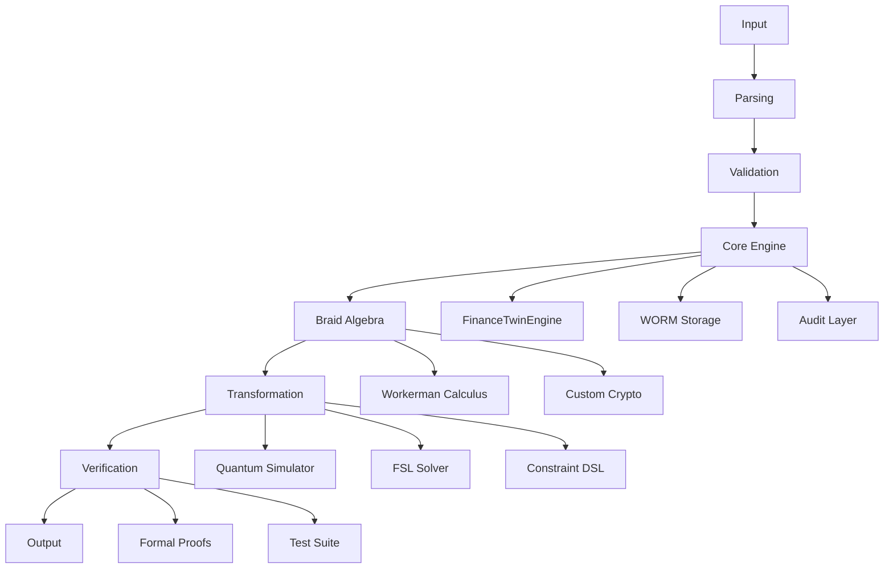

# BRAID GROUP SYSTEM

## Fibonacci Braid Ledger Cryptographic System

> **Repository snapshot:** 1,002 tracked files in 50 top-level directories at `865c011` (2026-09-17). Counts include source, tests, documentation, fixtures, and media.
> **Principle:** No unsupported claim survives validation.
> **Authority:** Repository implementation, tests, formal artifacts, and verified assets.

---

# 01. SYSTEM IDENTITY

## What is this?

A polyglot repository centered on the **Fibonacci Braid Ledger** and an event-sourced financial twin. Alongside the Python ledger engine, it contains cryptographic experiments, quantum simulation, compilers and virtual machines, GPU execution models, logic solvers, classification and evaluation components, and formal-methods artifacts.

These areas have separate entry points and toolchains. The root build does not assemble every directory into one application. Start with the [component guide](#05-component-guide) for source links and integration boundaries, or the [build and test entry points](#08-reproducibility) for a particular subsystem.

## Navigation

- [Repository atlas](#02-repository-atlas) and [selected file index](#03-selected-file-index)
- [Finance engine, reasoning, evaluation, compilers, and GPU models](#05-component-guide)
- [Language inventory](#07-language-distribution)
- [Build and test entry points](#08-reproducibility)
- [Verification scope](#09-verification-scope)
- [License and covenant](#11-license-and-covenant)

## What does it contain?

| Area | Tracked files | Contents |
|------|--------------:|----------|
| [src/](src/) | 163 | Financial twin, audit/boot code, Go integration sources, transformer and hardware experiments |
| [he-binary-functor/](he-binary-functor/) | 199 | Workerman calculus, cryptographic experiments, tensor parsers, hardware models, and formal artifacts |
| [quantum_computer/](quantum_computer/) | 26 | State and density-matrix simulation, circuits, gates, algorithms, noise, and tests |
| [constraint-harness/](constraint-harness/) | 41 | MXML validation, execution state machine, DAG scheduler, and audit components |
| [rust/](rust/) | 37 | FSL constraint IR and solver-related modules |
| [asp/](asp/) | 29 | Go parsing, semantics, propagation, solver, and tests |
| [classifier/](classifier/) | 13 | Go classification, batch inference, routing, and audit sources |
| [sovereign/](sovereign/) | 10 | Go event-ledger package and documentation |
| [kernel-language/](kernel-language/) | 34 | C compiler frontend, IR, register allocation, examples, and specifications |
| [retro-gpu/](retro-gpu/) | 44 | GPU-oriented language models and reference interpreters |
| [cobalt-compiler/](cobalt-compiler/) | 28 | Haskell compiler, ISA, assembly, and refinement-related modules |
| [occam-b-bscl/](occam-b-bscl/) | 26 | Wordcode compiler sources, specifications, examples, and tests |
| [formal-token-verification/](formal-token-verification/) | 25 | Cross-prover models, assumptions, theorem indexes, and reports |
| [docs/](docs/) | 67 | Documentation, specifications, reports, and demonstration media |

Counts are recursive tracked-file counts at the snapshot above, not source-only counts or a claim of build completeness. Smaller areas are listed in the atlas and component guide.

## What mathematical structures does it implement?

- Braid Group B_n (generators, relations, words, normal form)
- Fibonacci sequences
- Yang-Baxter transforms
- Banach contraction (sovereign attractor)
- Density matrix quantum mechanics
- OWL/RDF semantic reasoning
- RCC-8 spatial reasoning
- Godel numbering
- Datalog fixpoint semantics
- Region connection calculus

## What is the relationship to Braid Group mathematics?

The [Workerman Calculus](he-binary-functor/haskell/Workerman/Calculus.hs) defines a Haskell expression language with refinement types, substitution, trigonometric annotations, and braid words. Its rewrite routines include inverse cancellation, far commutativity, and Yang-Baxter rewrites. Related Rust, hardware, and formal sources live under [he-binary-functor/](he-binary-functor/). Their presence does not establish that every implementation is compiled from, or proven equivalent to, the Haskell model.

---

# 02. REPOSITORY ATLAS

```text
devflow-finance-twin/
|
|-- src/                          # Core engine and polyglot sources
|   |-- twin.py                   # FinanceTwinEngine
|   |-- worm.py                   # WormStorageEngine
|   |-- audit.py                  # CryptographicAuditLayer
|   |-- cli.py                    # CLI interface
|   |-- cold_boot.py              # Boot initialization model
|   |-- icp_anchor.py             # Local ICP-style anchor-chain model
|   |-- python/                   # Python implementations
|   |-- native/                   # Native extensions
|   |-- pascal/                   # Pascal implementations
|   |-- cuda/                     # CUDA kernels
|   |-- *.jl                      # Julia simulations
|   |-- a68/                      # Algol 68 implementations
|   |-- agol86/                   # AGOL-86 transformer experiments
|   |-- ebnf/                     # EBNF grammar definitions
|   |-- bqn/                      # BQN array language
|
|-- he-binary-functor/            # Mathematical and hardware artifacts
|   |-- crypto/                   # Cryptographic experiments and models
|   |-- haskell/                  # Workerman Calculus and Haskell models
|   |-- lean4/                    # Formal artifacts
|   |-- rust/                     # Rust implementations
|   |-- verilog-a/                # 9 quantum/analog circuits
|   |-- nand-architecture/        # NAND# ISA
|   |-- systemverilog/            # Hardware accelerators
|   |-- circom/                   # ZK circuits
|   |-- qsharp/, qrisp/          # Quantum languages
|   |-- apl/, bqn/, k/, uiua/    # Array languages
|
|-- quantum_computer/             # Quantum simulator
|   |-- vm/simulator.py           # DensityMatrix class
|   |-- gates/                    # 24 quantum gates
|   |-- algorithms/               # VQE, QAOA, Grover, Shor, topological
|   |-- error_correction/         # Bit flip, phase flip, surface code
|   |-- noise/                    # Depolarizing, amplitude damping
|   |-- circuit/                  # Circuit builder
|   |-- tests/                    # 3 test files
|
|-- rust/fsl/                     # FSL Formal Solver Language
|   |-- src/lib.rs               # Constraint IR and solver kernel
|   |-- src/assert_q/             # Assertion constraints and propagation
|   |-- src/crux/                 # CRUX, Russian syntax, Z3/Lean modules
|   |-- src/qa5/                  # Clauses, resolution, unification
|   |-- src/cbmc.rs               # CBMC-related code
|   |-- src/eclipse_parlog/       # Constraint logic programming
|
|-- constraint-harness/           # Constraint DSL
|   |-- mxml/                     # MXML parser
|   |-- runtime/                  # Runtime engine
|   |-- scheduler/                # DAG scheduler
|   |-- verification/             # Verification engine
|   |-- audit/                    # Audit sealing
|
|-- isa-jvm/                      # ISA-to-JVM compiler
|   |-- compiler/                 # Compiler phases
|   |-- runtime/interpreter.py    # Reference interpreter
|   |-- compiler/bytecode.py      # Bytecode emitter
|
|-- assembly-120-strict-model/    # Assembly implementations
|   |-- bit_pattern_kernel_avx2.asm  # AVX2 SIMD
|   |-- fibonacci_braid_x86.asm     # x86 braid
|   |-- cbmc_binary_semantics.rs     # CBMC bit-vector model
|
|-- formal-token-verification/    # Formal proofs
|   |-- agda/, coq/, fstar/, isabelle/, lean/
|   |-- recursive/                # Recursive audit models in 5 systems
|
|-- rpgle/                        # IBM i RPG
|   |-- LEDGWYRPG.rpgle           # Ledger gateway
|   |-- LEDREVSRV.rpgle           # Ledger reversal service
|   |-- eod-driver.rpgle          # End-of-day driver
|
|-- csharp/                       # C# implementations
|   |-- LedgerGateway.cs          # Ledger gateway
|   |-- RtpRailAdapter.cs         # RTP rail adapter
|
|-- asp/                         # Go ASP module
|-- classifier/                  # Go classifier and audit module
|-- sovereign/ledger/            # Go event ledger
|-- kernel-language/             # C compiler frontend and IR
|-- retro-gpu/                   # GPU models in OCCAM, OCaml, SML, Modula-2
|-- occam-b-bscl/                 # Wordcode project sources and tests
|-- apple6502x86/                 # Assembly system experiments
|-- qflow/                       # Quantum dataflow parser
|-- datalog-engine/               # Datalog engine
|-- eclipse/                      # ECLiPSe Prolog Parlog kernel
|-- lisp/                         # Common Lisp theorem prover
|-- logtalk/                      # Godel symbolic kernel
|-- prolog/                       # SWI-Prolog FSL prover
|-- astre-vault/                  # OWL/RDF solver, RCC-8 spatial
|-- apl/apl/                      # APL transformer
|-- x86_64/                       # x86_64 assembly
|-- ptx/                          # CUDA PTX
|-- chisel/                       # Chisel hardware
|-- cobalt-compiler/              # Cobalt compiler
|-- braid/                        # Braid implementations
|-- linear-algebra-verification/  # Linear algebra
|-- mathematics/                  # Mathematical definitions
|-- haskell/                      # Haskell
|-- scala/                        # Scala
|-- cobol/                        # COBOL
|-- pli/                          # PL/I
|-- ada/                          # Ada/SPARK
|-- lean/                         # Lean
|-- wasm/                         # WASM/WAT
|-- frontend/                     # Frontend
|-- schema/                       # Schema definitions
|-- config/                       # Configuration
|-- scripts/                      # Scripts
|-- examples/                     # Examples
|-- tests/                        # Test suite
|-- assets/                       # SVG diagrams
|-- docs/                         # Documentation
```

---

# 03. SELECTED FILE INDEX

## Core Engine Files

| File | Purpose |
|------|---------|
| `src/twin.py` | FinanceTwinEngine - main orchestrator |
| `src/worm.py` | WormStorageEngine - WORM storage |
| `src/audit.py` | CryptographicAuditLayer |
| `src/cli.py` | CLI interface |
| `src/cold_boot.py` | Boot initialization model |
| `src/icp_anchor.py` | Local ICP-style anchor-chain model |

## Cryptographic Primitives

| Primitive | Location | Type |
|-----------|----------|------|
| IAMAC | `he-binary-functor/crypto/iamac.rs` | Modular arithmetic and IAMAC computation |
| Braid Kernel | `he-binary-functor/crypto/kernel.rs` | Braid kernel source |
| Seal Chain | `he-binary-functor/crypto/seal_chain.rs` | Sealed-step chain using FNV-1a |
| Malleability | `he-binary-functor/crypto/malleability.rs` | Digest-to-zero-orbit mapping |
| Convergence | `he-binary-functor/crypto/convergence.rs` | Static epoch/mechanism/bound descriptions |
| Zeros | `he-binary-functor/crypto/zeros.rs` | Tabulated imaginary parts of zeta zeros |
| SHA-256 | `wasm/sha256.wat` | WebAssembly text implementation |
| SHA-256 audit digests | `src/audit.py` | Uses Python's `hashlib` |

## Quantum Computer

| File | Purpose |
|------|---------|
| `quantum_computer/vm/simulator.py` | DensityMatrix class, gate application, measurement |
| `quantum_computer/gates/__init__.py` | 24 quantum gates |
| `quantum_computer/algorithms/advanced.py` | VQE, QAOA, Grover, Shor |
| `quantum_computer/algorithms/topological.py` | Topological algorithms |
| `quantum_computer/error_correction/__init__.py` | Error correction codes |
| `quantum_computer/noise/__init__.py` | Noise models |

## APL Transformer

| File | Purpose |
|------|---------|
| `apl/apl/transformer.apl` | Full decoder-only transformer in Dyalog APL |

## Formal Verification

| System | Sources |
|--------|---------|
| Lean | [he-binary-functor/lean4/](he-binary-functor/lean4/), [formal-token-verification/lean/](formal-token-verification/lean/), [lean/](lean/) |
| Coq | [formal-token-verification/coq/](formal-token-verification/coq/), [linear-algebra-verification/coq/](linear-algebra-verification/coq/) |
| Agda | [formal-token-verification/agda/](formal-token-verification/agda/) |
| F* | [formal-token-verification/fstar/](formal-token-verification/fstar/) |
| Isabelle | [formal-token-verification/isabelle/](formal-token-verification/isabelle/) and root src/*.thy files |
| Kani | [NAND harness sources](he-binary-functor/nand-architecture/kani/src/) |
| Why3 | [he-binary-functor/why3/](he-binary-functor/why3/) |

The [recursive models](formal-token-verification/recursive/), [assumptions](formal-token-verification/ASSUMPTIONS.md), and [verification reports](formal-token-verification/reports/) describe individual proof targets. See [verification scope](#09-verification-scope) before treating an artifact as a checked result.

---

## SVG Diagrams

| File | Subject |
|------|---------|
| `assets/flow.svg` | Quantum circuit pipeline |
| `assets/sas_dataflow.svg` | SAS dataflow |
| `assets/sql_schema.svg` | SQL schema |
| `assets/architecture/institutional_architecture.svg` | Institutional architecture |

---

# 04. ARCHITECTURE

The diagram groups repository themes. It is not a claim that the quantum simulator, FSL solver, and formal projects are all called by the financial runtime. The directly imported Python components are described below.


---

# 05. COMPONENT GUIDE

## Financial twin and audit storage

[src/cli.py](src/cli.py) is the command-line entry point for [FinanceTwinEngine](src/twin.py). It exposes account creation, transfers, invoices, status, and history verification. The engine reconstructs financial state from stored events and quantizes monetary values to four decimal places with `Decimal` and half-even rounding.

| Component | Source | Role |
|-----------|--------|------|
| Financial state | [twin.py](src/twin.py) | Account balances, transactions, invoices, obligations, command validation, and replay |
| Event storage | [worm.py](src/worm.py) | Append-oriented JSON records linked by SHA-256 hashes, reading, and integrity checks |
| Decision seals | [audit.py](src/audit.py) | Canonical JSON digests over event metadata and before/after state hashes |
| Entropy and optimization interface | [quantum.py](src/quantum.py) | System randomness, seeded test mode, and portfolio experiment helpers |
| Boot and anchor models | [cold_boot.py](src/cold_boot.py), [icp_anchor.py](src/icp_anchor.py) | Three-phase initialization, record serialization, and local anchor-chain construction |
| Behavioral tests | [test_stack.py](tests/test_stack.py), [test_cold_boot_icp.py](tests/test_cold_boot_icp.py) | Replay, transfers, tampering, seals, boot stages, and anchor chains |

The Python WORM layer uses a local file; it does not make the underlying disk physically write-once. `ICPAnchorBridge` maintains anchor state in memory; its current implementation does not submit records to a remote Internet Computer canister. The separate [quantum_computer/](quantum_computer/) simulator is not the implementation imported by `twin.py`.

Native counterparts and support artifacts include [C record commit code](src/native/worm_commit.c), the [Zig loader](src/native/wasm_loader.zig), [WAT modules](wasm/), [x86-64 assembly](x86_64/), [Ada sources](ada/), and [Scala sources](scala/). The [root Makefile](Makefile) specifies the native/WASM build targets.

## Constraint execution and logic reasoning

The [constraint harness](constraint-harness/README.md) is a separate Python package. Its [Executor](constraint-harness/runtime/executor.py) parses and validates MXML, evaluates authorization/schema rules, builds a task DAG, schedules work, and checks the results through an explicit state machine. Its CLI exposes `harness validate` and `harness run`; examples are in [constraint-harness/examples/](constraint-harness/examples/).

| Area | Entry point | Contents |
|------|-------------|----------|
| MXML constraint harness | [pyproject.toml](constraint-harness/pyproject.toml) | Parser, constitution evaluator, scheduler, command adapters, audit sealing, and local tests |
| Go answer-set programming | [asp/](asp/) | AST, lexer/parser, semantic checks, propagation, and conflict-driven search with heuristics and restart policies |
| Grounding sources | [src/grounder.go](src/grounder.go), [src/asp/incremental/](src/asp/incremental/) | Grounding, safety checks, substitutions, and incremental reasoning sources outside the `asp` module directory |
| Rust FSL | [rust/fsl/src/lib.rs](rust/fsl/src/lib.rs) | Boolean, integer, and bit-vector constraint IR; assertion obligations and solver-related modules |
| Datalog | [datalog-engine/datalog/](datalog-engine/datalog/) | Python terms/unification code and `.dl` programs, including Souffle examples |
| Other logic systems | [prolog/](prolog/), [eclipse/](eclipse/), [logtalk/](logtalk/), [lisp/](lisp/), [astre-vault/](astre-vault/) | Separate logic-programming and symbolic-reasoning implementations |

The Go module at [asp/go.mod](asp/go.mod) is scoped to `asp/`. Files under root `src/` include several different Go packages and are not a single module that can be built with a root-level `go build`.

## Classification, evaluation, and event provenance

[classifier/](classifier/) is a Go module containing routing and classification-head interfaces, decision envelopes, batch processing, backend abstractions, and audit records. Start with [model/classifier.go](classifier/model/classifier.go), [batch/batch.go](classifier/batch/batch.go), and [audit/audit.go](classifier/audit/audit.go). The `GPUBackend` in [backends/backend.go](classifier/backends/backend.go) currently encodes inputs with Go loops; its name is not evidence of device execution.

[sovereign/ledger/](sovereign/ledger/) is another Go module. [ledger.go](sovereign/ledger/ledger.go) implements event appends, sequence numbers, hash links, verification, and sealing; [serialization.go](sovereign/ledger/serialization.go) and [io.go](sovereign/ledger/io.go) cover serialization and I/O. Package tests and examples sit beside the implementation.

The [Sovereign evaluation guide](docs/SOVEREIGN_AI_EVALUATION_ENGINE.md) and [evaluation specification](docs/SOVEREIGN_EVALUATION_ENGINE_SPEC.md) describe the wider transcript/constraint/proof workflow. Read them alongside the concrete classifier, ASP, and ledger modules: the tracked tree does not provide one root build that demonstrates the complete workflow. Additional [control DAG](src/control-dag.go), [policy](src/control-policy.go), [sandbox](src/sandbox-module.go), and [archive](src/archive-tools.go) sources are collected under `src/`.

## Compilers and virtual machines

| Project | Source and examples | Current scope |
|---------|---------------------|---------------|
| Cobalt | [cobalt-compiler/cobalt.cabal](cobalt-compiler/cobalt.cabal), [demo driver](cobalt-compiler/src/Main.hs) | Haskell compiler/ISA modules, x86 batch assembly, LiquidOps, and an optional LiquidHaskell bridge |
| Kernel Language | [kernel-language/README.md](kernel-language/README.md), [driver](kernel-language/src/main.c), [.kl examples](kernel-language/examples/) | C lexer/parser, AST-to-IR lowering, and register allocation; the driver emits IR, not a runnable GPU binary |
| OCCAM/B/BSCL | [occam-b-bscl/](occam-b-bscl/), [wordcode format](occam-b-bscl/docs/WORDCODE.md) | Compiler/IR/emitter sources, concurrency and memory specifications, examples, and C tests; several included headers and the advertised Makefile are absent |
| ISA-to-JVM | [isa-jvm/README.md](isa-jvm/README.md) | ISA compiler stages, a reference interpreter, and bytecode-related sources |
| Qflow | [qflow/compiler/](qflow/compiler/), [Bell example](qflow/examples/bell.qflow) | Haskell quantum-dataflow AST, lexer, parser, driver, and Cabal manifest |
| P-code stack | [src/pcode_vm_full_stack.py](src/pcode_vm_full_stack.py) | Tagged values, stack frames, tensor/value helpers, and VM-related code in a standalone Python source file |
| Apple/6502/x86 experiments | [apple6502x86/](apple6502x86/) | Assembly boot, memory, monitor, ROM, and diagnostic variants with delivery notes |

Kernel Language's own [status section](kernel-language/README.md#current-status) identifies unfinished lowering, macro expansion, SASS/cubin emission, and runtime loading. These are compiler development artifacts with explicit remaining work.

## GPU models, transformers, and numerical experiments

[retro-gpu/](retro-gpu/) contains OCCAM, OCaml, Standard ML, and Modula-2 material for registers, ALUs, warps, memory, synchronization, and tensor operations. The [OCaml interpreter](retro-gpu/ocaml/src/interpreter/Interpreter.ml) is a reference model with partial instruction handling, not a hardware execution benchmark. Its tests and build recipe are in [retro-gpu/ocaml/](retro-gpu/ocaml/).

Other entry points are [CUDA kernels](src/cuda/), [PTX sources](ptx/), the [VSM2500 specification](src/vsm2500_specification.txt) and adjacent CUDA/SystemVerilog files, [Pascal transformer modules](src/pascal/), [Algol 68 modules](src/a68/), [AGOL-86 Python experiments](src/agol86/), and the [JAX transformer harness](src/jax_transformer_harness.py). These paths contain different implementations and experiments; the root Python requirements file is not a dependency manifest for all of them.

## Quantum simulation and mathematical artifacts

[quantum_computer/](quantum_computer/) has its own complex numbers, matrices, state/register types, circuit builder, gates, [simulator](quantum_computer/vm/simulator.py), algorithms, noise, error-correction code, and [tests](quantum_computer/tests/). It models quantum states in software.

[he-binary-functor/](he-binary-functor/) is the largest tracked subtree in this snapshot. It brings together Workerman Haskell, Rust cryptographic experiments, [tensor parsers and binary fixtures](he-binary-functor/tensor-parser/), [NAND architecture material](he-binary-functor/nand-architecture/), Verilog-A and SystemVerilog sources, array-language implementations, and Lean/Why3 artifacts. Its subdirectory READMEs are the next level of navigation.

Formal material is distributed across [formal-token-verification/](formal-token-verification/), [lean/](lean/), [linear-algebra-verification/](linear-algebra-verification/), [he-binary-functor/lean4/](he-binary-functor/lean4/), and the Isabelle `.thy` files under [src/](src/). Some sources contain `sorry`, axioms, or templates. A source file or historical completion report is not a substitute for a successful checker run with its dependencies and assumptions recorded.

## Banking sources, demonstrations, and documentation

- [rpgle/](rpgle/), [cobol/](cobol/), [csharp/](csharp/), and [pli/](pli/) contain banking, ledger, treasury, and payment-related sources. The [ACH return operator runbook](docs/ACHRTRN_OPERATOR_RUNBOOK.md) and [Funnel examples](examples/) provide additional context.
- [frontend/quantum_shadow_ledger.html](frontend/quantum_shadow_ledger.html) is the browser-facing ledger demonstration. [docs/assets/](docs/assets/) contains videos and images; [assets/](assets/) contains diagrams and other visual assets.
- [docs/](docs/) contains architecture notes, API/user documentation, evaluation specifications, and phase-by-phase design and verification reports. [docs/README.md](docs/README.md) and [INSTITUTIONAL_README.md](INSTITUTIONAL_README.md) offer other reading routes.
- [publish.sh](publish.sh), [PUBLISH_MANIFEST.json](PUBLISH_MANIFEST.json), and [PUBLISH_REPORT.md](PUBLISH_REPORT.md) describe artifact intake and publication. [REPOSITORY_ORGANIZATION_MANIFEST.md](REPOSITORY_ORGANIZATION_MANIFEST.md) and [STRAY_FILE_AUDIT.md](STRAY_FILE_AUDIT.md) record organization work; they are not build manifests.

---

# 06. RESEARCH AND IMPLEMENTATION THEMES

The repository explores Fibonacci/braid ledger constructions, refinement-typed languages, constraint reasoning, audit provenance, quantum simulation, and explicit machine models. Representative starting points are:

- [Fibonacci Braid Ledger notes](docs/FIBONACCI_BRAID_LEDGER.md) and [Workerman Calculus](he-binary-functor/haskell/Workerman/Calculus.hs).
- [Cryptographic experiment sources and notes](he-binary-functor/crypto/), including IAMAC, seal chains, and malleability/convergence models.
- [Assembly kernels](assembly-120-strict-model/), [APL transformer](apl/apl/transformer.apl), and [Verilog-A circuits](he-binary-functor/verilog-a/).
- [Constraint execution](constraint-harness/), [FSL](rust/fsl/), and [ASP](asp/) as distinct approaches to expressing and evaluating obligations.
- [Formal specifications and counterexamples](formal-token-verification/) alongside executable implementations.

These links identify the work and its source. They do not establish cryptographic security, novelty, equivalence between implementations, or performance results.

---

# 07. LANGUAGE DISTRIBUTION

Selected file-extension counts from the tracked snapshot. Headers, generated outputs, and other extensions are not folded into language totals; these are file counts, not LOC estimates.

| Language/source family | Extensions | Tracked files |
|------------------------|------------|--------------:|
| Python | `.py` | 132 |
| Rust | `.rs` | 68 |
| Go | `.go` | 67 |
| Haskell | `.hs` | 52 |
| C | `.c` | 31 |
| Lean | `.lean` | 27 |
| Ada | `.ads`, `.adb` | 36 |
| Assembly | `.asm`, `.s`, `.nasm` | 31 |
| Algol 68 | `.a68` | 22 |
| Standard ML | `.sml` | 14 |
| Isabelle | `.thy` | 13 |
| OCCAM | `.occ` | 12 |
| Pascal | `.pas` | 11 |
| OCaml | `.ml` | 11 |
| CUDA | `.cu` | 10 |
| Verilog-A | `.va` | 9 |
| RPGLE | `.rpgle` | 9 |
| Julia | `.jl` | 9 |

---

# 08. REPRODUCIBILITY

## Python financial core

The root [requirements.txt](requirements.txt) contains pytest. The financial core uses Python's standard library; it is separate from experiments requiring JAX, PyTorch, CUDA, or other runtimes. Run these commands from the repository root in a Python environment:

```bash
git clone https://github.com/SNAPKITTYWEST/devflow-finance-twin.git
cd devflow-finance-twin
python -m pip install -r requirements.txt
python src/cli.py --help
python -m pytest tests/test_stack.py tests/test_cold_boot_icp.py
python -m pytest quantum_computer/tests/
```

A small CLI example writes a local demonstration ledger. Use a fresh path when repeating it, because account identifiers must be unique:

```bash
python src/cli.py --storage demo.worm CREATE_ACCOUNT --account_id treasury --balance 100.0000
python src/cli.py --storage demo.worm STATUS
python src/cli.py --storage demo.worm VERIFY_HISTORY
```

These are source-matched entry points, not a record of passing tests for this snapshot.

## Component-specific builds and tests

Commands below assume a POSIX shell for parenthesized subshells, plus the named toolchain. On Windows, enter each directory separately before running its command.

| Component | Entry point | Requirements and scope |
|-----------|-------------|------------------------|
| Python baseline | `make test` | Root Makefile runs only `tests/test_stack.py` |
| Constraint harness | `(cd constraint-harness && python -m pip install -e ".[dev]" && python -m pytest)` | Python 3.10+; optional PyTorch extra is separate |
| ASP | `(cd asp && go test ./...)` | Go 1.21+ module-local tests |
| Classifier | `(cd classifier && go test ./...)` | Go 1.21+ module-local tests |
| Event ledger | `(cd sovereign/ledger && go test ./...)` | Go 1.21+ module-local tests |
| Rust FSL | `cargo test --manifest-path rust/fsl/Cargo.toml` | Rust/Cargo; targets the FSL crate only |
| Cobalt | `(cd cobalt-compiler && cabal build)` | GHC/Cabal; optional `lh-bridge` flag adds dependencies |
| Kernel Language | `make -C kernel-language test` | C compiler and Make; example IR emission checks |
| RetroGPU OCaml | `make -C retro-gpu/ocaml test` | OCaml, ocamlfind, Make; reference-model tests |
| WASM/native support | `make all` | Node with `wabt`, GCC, NASM, and archive tools; NASM target uses ELF64 |

There is no repository-wide build or test command covering all languages. `compile_wasm.js` requires the Node `wabt` package, but the root has no package.json. The OCCAM/B README advertises `make`, but its directory has no tracked Makefile and lacks headers included by the compiler. The RetroGPU OCCAM test target names `tests/CompilerTests.occ`, which is absent. Resolve those packaging gaps before using their advertised commands.

Formal sources require project-specific dependencies. For example, [TokenModel.lean](formal-token-verification/lean/TokenModel.lean) imports Mathlib, and [TokenModel.v](formal-token-verification/coq/TokenModel.v) imports Mathematical Components. Use the corresponding project's dependency setup and check individual source files; a blanket `lean4 .` or `coqc .` is not a valid verification procedure.

---

# 09. VERIFICATION SCOPE

This README update is based on the tracked tree, selected implementation files, build manifests, and test sources at `865c011`. It is a navigation and source review, not a full build, security audit, or cross-language proof run.

| Evidence | What it establishes |
|----------|---------------------|
| `git ls-files` inventory | Paths and scoped file counts in this snapshot |
| Source and manifest inspection | Entry points, represented operations, dependencies, and visible packaging gaps |
| Test files | Intended checks; their presence does not establish passing results |
| Proof sources | Statements, assumptions, and proof scripts; some include unfinished proofs or axioms |
| Phase reports and completion notes | Historical project records, not current execution results |

For example, [lean_jacobian_tensor_framework.lean](lean/lean_jacobian_tensor_framework.lean) includes `sorry` and axioms, and [sovereign_attractor.lean](he-binary-functor/lean4/sovereign_attractor.lean) assumes a braid contraction mapping. Report checker results per artifact together with assumptions. Do not infer a repository-wide proof or deployment status from a filename or status heading.

To refresh the tracked-file total:

```bash
git ls-files | wc -l
```

---

# 10. THE FINAL STANDARD

**THE REPOSITORY IS THE AUTHORITY.**

**THE README IS THE MAP.**

**THE MATHEMATICS MUST MATCH THE IMPLEMENTATION.**

**THE GRAPHICS MUST MATCH THE MATHEMATICS.**

**THE TESTS MUST MATCH THE BEHAVIOR.**

**THE CLAIMS MUST MATCH THE EVIDENCE.**

**WHEN EVIDENCE IS ABSENT, SAY SO.**

**WHEN IMPLEMENTATION IS BROKEN, SAY SO.**

**WHEN SOMETHING IS UNKNOWN, PRESERVE THE UNKNOWN.**

**NEVER INVENT THE MISSING PIECE.**

---

# 11. LICENSE AND COVENANT

## Sovereign Leviathan License

This repository is governed by the **Sovereign Leviathan Covenant** -- a recursive node licensing system built on top of the GNU Affero General Public License v3.0.

**License-ID:** SL-AGPL3-001
**Covenant-Version:** 1.0
**Base License:** GNU Affero General Public License v3.0
**Jurisdiction:** England and Wales
**Languages:** EN / AR / ZH

### Core Principles

1. **Copyleft Foundation:** All source nodes are covered under AGPL-3.0
2. **Fragment Binding:** Each source file is a designated component of the covered work
3. **Recursive Compliance:** Dependency traversal evaluates licensing status
4. **Network Interaction:** Section 13 AGPL obligations apply to network deployments
5. **Sovereign Audit Chain:** Cryptographically identifiable compliance records

### License Headers

Every source file in this repository carries the **Sovereign Leviathan Node License** header. This header identifies the file as a covered work under the GNU Affero General Public License, version 3, together with the Sovereign Leviathan additional terms.

### Files

| File | Description |
|------|-------------|
| `LICENSE-AGPL-3.0` | GNU Affero General Public License v3.0 |
| `LICENSE-FSL-1.1` | Sovereign Leviathan additional terms |
| `SOVEREIGN_LEVIATHAN_COVENANT.md` | Complete covenant documentation |
| `src/LICENSE-RECURSIVE-INFECTION` | Recursive infection clause |

### Unauthorized Use

Unauthorized use of this codebase triggers the following enforcement flow:

1. License condition violated
2. Additional permissions terminate
3. AGPL rights remain governed by AGPL-3.0
4. Copyright/contractual remedies preserved
5. Injunctive/monetary/other remedies available

**Jurisdiction:** England and Wales

### Citation

```bibtex
@software{braid_group_system_2026,
  title = {Fibonacci Braid Ledger Cryptographic System},
  author = {Ahmad Ali Parr and Bel Esprit D'Accord Irrevocable Trust},
  year = {2026},
  license = {AGPL-3.0},
  covenant = {Sovereign Leviathan v1.0},
  jurisdiction = {England and Wales}
}
```
