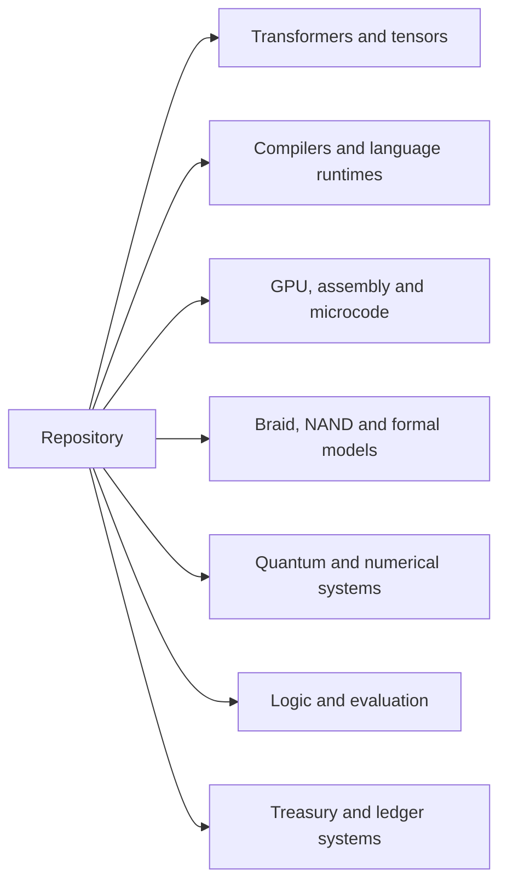

# BRAID GROUP SYSTEM

## Fibonacci Braid Ledger Cryptographic System

> **Repository snapshot:** 1,002 tracked files in 50 top-level directories at `865c011` (2026-09-17). Counts include source, tests, documentation, fixtures, and media.
> **Principle:** No unsupported claim survives validation.
> **Authority:** Repository implementation, tests, formal artifacts, and verified assets.

---

# 01. SYSTEM IDENTITY

## What is this?

A polyglot systems and mathematical computing repository spanning **transformer implementations, tensor and Jacobian engines, language compilers, virtual machines, GPU and microcode models, Fibonacci Braid Ledger constructions, quantum dynamics, and treasury systems**. The source includes Algol 68, AGOL-86, Pascal, APL, BQN, Haskell, Rust, C/C++, assembly, CUDA/PTX, SystemVerilog, OCCAM, Standard ML, OCaml, Ada/SPARK, COBOL, RPGLE, PL/I, Scala, Go, Julia, Futhark, and formal languages.

These areas have separate entry points and toolchains. The root build does not assemble every directory into one application. Start with the [component guide](#05-component-guide) for source links and integration boundaries, or the [build and test entry points](#08-reproducibility) for a particular subsystem.

## Navigation

- [Repository atlas](#02-repository-atlas) and [selected file index](#03-selected-file-index)
- [Transformers and neural computation](#transformers-and-neural-computation)
- [Algol 68 and AGOL-86](#algol-68-and-agol-86), [Pascal](#pascal-transformers-and-tensor-engines), and [array-language decoders](#apl-bqn-and-other-array-language-systems)
- [Tensor formats and Jacobians](#tensor-formats-jacobians-and-weight-loading)
- [VSM2500, P2/P3/P4, and GPU execution](#vsm2500-p2p3p4-and-gpu-execution)
- [Assembly machines and Dylan runtime](#assembly-machines-neural-accelerator-and-dylan-runtime)
- [Compilers and virtual machines](#compilers-and-virtual-machines)
- [Fibonacci braid, NAND, and blocklace](#fibonacci-braid-nand-and-blocklace-systems)
- [Quantum dynamics and scientific computing](#quantum-dynamics-and-scientific-computing)
- [Banking and treasury implementations](#banking-and-treasury-implementations)
- [Reasoning](#constraint-execution-and-logic-reasoning), [evaluation](#classification-evaluation-and-event-provenance), and [financial twin](#financial-twin-and-audit-storage)
- [Language inventory](#07-language-distribution)
- [Build and test entry points](#08-reproducibility)
- [Verification scope](#09-verification-scope)
- [License and covenant](#11-license-and-covenant)

## What does it contain?

| Area | Tracked files | Contents |
|------|--------------:|----------|
| [src/](src/) | 163 | Algol/AGOL/Pascal transformers, CUDA and VSM sources, Julia dynamics, Go integration, and financial twin |
| [he-binary-functor/](he-binary-functor/) | 199 | Workerman calculus, cryptographic experiments, tensor parsers, hardware models, and formal artifacts |
| [quantum_computer/](quantum_computer/) | 26 | State and density-matrix simulation, circuits, gates, algorithms, noise, and tests |
| [constraint-harness/](constraint-harness/) | 41 | MXML validation, execution state machine, DAG scheduler, and audit components |
| [rust/](rust/) | 37 | FSL constraint/solver modules and the standalone neural/Jacobian core |
| [asp/](asp/) | 29 | Go parsing, semantics, propagation, solver, and tests |
| [classifier/](classifier/) | 13 | Go classification, batch inference, routing, and audit sources |
| [sovereign/](sovereign/) | 10 | Go event-ledger package and documentation |
| [kernel-language/](kernel-language/) | 34 | C compiler frontend, IR, register allocation, examples, and specifications |
| [retro-gpu/](retro-gpu/) | 44 | GPU-oriented language models and reference interpreters |
| [cobalt-compiler/](cobalt-compiler/) | 28 | Haskell compiler, ISA, assembly, and refinement-related modules |
| [occam-b-bscl/](occam-b-bscl/) | 26 | Wordcode compiler sources, specifications, examples, and tests |
| [formal-token-verification/](formal-token-verification/) | 25 | Cross-prover models, assumptions, theorem indexes, and reports |
| [docs/](docs/) | 67 | Documentation, specifications, reports, and demonstration media |

Counts are recursive tracked-file counts at the snapshot above, not source-only counts or a claim of build completeness. Smaller areas are listed in the atlas and component guide.

## What mathematical structures does it implement?

- Braid Group B_n (generators, relations, words, normal form)
- Fibonacci sequences
- Yang-Baxter transforms
- Banach contraction (sovereign attractor)
- Density matrix quantum mechanics
- OWL/RDF semantic reasoning
- RCC-8 spatial reasoning
- Godel numbering
- Datalog fixpoint semantics
- Region connection calculus

## What is the relationship to Braid Group mathematics?

The [Workerman Calculus](he-binary-functor/haskell/Workerman/Calculus.hs) defines a Haskell expression language with refinement types, substitution, trigonometric annotations, and braid words. Its rewrite routines include inverse cancellation, far commutativity, and Yang-Baxter rewrites. Related Rust, hardware, and formal sources live under [he-binary-functor/](he-binary-functor/). Their presence does not establish that every implementation is compiled from, or proven equivalent to, the Haskell model.

---

# 02. REPOSITORY ATLAS

```text
devflow-finance-twin/
|
|-- src/                          # Transformer, machine, numerical, and finance sources
|   |-- transformer_model.a68     # Algol decoder and supporting root .a68 modules
|   |-- agol86_model.a86          # AGOL-86 transformer source
|   |-- TensorCore.pas            # Standalone Pascal tensor engine
|   |-- vsm2500_core.sv           # VSM hardware description
|   |-- vsm2500_semantic_cuda.cu  # Semantic machine and neural CUDA operations
|   |-- p3_binary_microcode_p2_fabric.cpp # Binary microcode / parallel fabric
|   |-- RWPT.jl                  # Open-system dynamics
|   |-- wigner_futhark.fut        # Wigner/resampling source
|   |-- twin.py                   # FinanceTwinEngine
|   |-- worm.py                   # WormStorageEngine
|   |-- audit.py                  # CryptographicAuditLayer
|   |-- cli.py                    # CLI interface
|   |-- cold_boot.py              # Boot initialization model
|   |-- icp_anchor.py             # Local ICP-style anchor-chain model
|   |-- python/                   # Python implementations
|   |-- native/                   # Native extensions
|   |-- pascal/                   # Pascal implementations
|   |-- cuda/                     # CUDA kernels
|   |-- *.jl                      # Julia simulations
|   |-- a68/                      # Algol 68 implementations
|   |-- agol86/                   # AGOL-86 transformer experiments
|   |-- ebnf/                     # EBNF grammar definitions
|   |-- bqn/                      # BQN array language
|
|-- he-binary-functor/            # Mathematical and hardware artifacts
|   |-- crypto/                   # Cryptographic experiments and models
|   |-- haskell/                  # Workerman Calculus and Haskell models
|   |-- lean4/                    # Formal artifacts
|   |-- rust/                     # Rust implementations
|   |-- verilog-a/                # 9 quantum/analog circuits
|   |-- nand-architecture/        # NAND# ISA
|   |-- systemverilog/            # Hardware accelerators
|   |-- circom/                   # ZK circuits
|   |-- qsharp/, qrisp/          # Quantum languages
|   |-- apl/, bqn/, k/, uiua/    # Array languages
|
|-- quantum_computer/             # Quantum simulator
|   |-- vm/simulator.py           # DensityMatrix class
|   |-- gates/                    # 24 quantum gates
|   |-- algorithms/               # VQE, QAOA, Grover, Shor, topological
|   |-- error_correction/         # Bit flip, phase flip, surface code
|   |-- noise/                    # Depolarizing, amplitude damping
|   |-- circuit/                  # Circuit builder
|   |-- tests/                    # 3 test files
|
|-- rust/fsl/                     # FSL Formal Solver Language
|   |-- src/lib.rs               # Constraint IR and solver kernel
|   |-- src/assert_q/             # Assertion constraints and propagation
|   |-- src/crux/                 # CRUX, Russian syntax, Z3/Lean modules
|   |-- src/qa5/                  # Clauses, resolution, unification
|   |-- src/cbmc.rs               # CBMC-related code
|   |-- src/eclipse_parlog/       # Constraint logic programming
|
|-- constraint-harness/           # Constraint DSL
|   |-- mxml/                     # MXML parser
|   |-- runtime/                  # Runtime engine
|   |-- scheduler/                # DAG scheduler
|   |-- verification/             # Verification engine
|   |-- audit/                    # Audit sealing
|
|-- isa-jvm/                      # ISA-to-JVM compiler
|   |-- compiler/                 # Compiler phases
|   |-- runtime/interpreter.py    # Reference interpreter
|   |-- compiler/bytecode.py      # Bytecode emitter
|
|-- assembly-120-strict-model/    # Assembly implementations
|   |-- bit_pattern_kernel_avx2.asm  # AVX2 SIMD
|   |-- fibonacci_braid_x86.asm     # x86 braid
|   |-- cbmc_binary_semantics.rs     # CBMC bit-vector model
|
|-- formal-token-verification/    # Formal proofs
|   |-- agda/, coq/, fstar/, isabelle/, lean/
|   |-- recursive/                # Recursive audit models in 5 systems
|
|-- rpgle/                        # IBM i RPG
|   |-- LEDGWYRPG.rpgle           # Ledger gateway
|   |-- LEDREVSRV.rpgle           # Ledger reversal service
|   |-- eod-driver.rpgle          # End-of-day driver
|
|-- csharp/                       # C# implementations
|   |-- LedgerGateway.cs          # Ledger gateway
|   |-- RtpRailAdapter.cs         # RTP rail adapter
|
|-- asp/                         # Go ASP module
|-- classifier/                  # Go classifier and audit module
|-- sovereign/ledger/            # Go event ledger
|-- kernel-language/             # C compiler frontend and IR
|-- retro-gpu/                   # GPU models in OCCAM, OCaml, SML, Modula-2
|-- occam-b-bscl/                 # Wordcode project sources and tests
|-- apple6502x86/                 # Assembly system experiments
|-- qflow/                       # Quantum dataflow parser
|-- datalog-engine/               # Datalog engine
|-- eclipse/                      # ECLiPSe Prolog Parlog kernel
|-- lisp/                         # Common Lisp theorem prover
|-- logtalk/                      # Godel symbolic kernel
|-- prolog/                       # SWI-Prolog FSL prover
|-- astre-vault/                  # OWL/RDF solver, RCC-8 spatial
|-- apl/apl/                      # APL transformer
|-- x86_64/                       # x86_64 assembly
|-- ptx/                          # CUDA PTX
|-- chisel/                       # Chisel hardware
|-- cobalt-compiler/              # Cobalt compiler
|-- braid/                        # Braid implementations
|-- linear-algebra-verification/  # Linear algebra
|-- mathematics/                  # Mathematical definitions
|-- haskell/                      # Haskell
|-- scala/                        # Scala
|-- cobol/                        # COBOL
|-- pli/                          # PL/I
|-- ada/                          # Ada/SPARK
|-- lean/                         # Lean
|-- wasm/                         # WASM/WAT
|-- frontend/                     # Frontend
|-- schema/                       # Schema definitions
|-- config/                       # Configuration
|-- scripts/                      # Scripts
|-- examples/                     # Examples
|-- tests/                        # Test suite
|-- assets/                       # SVG diagrams
|-- docs/                         # Documentation
```

---

# 03. SELECTED FILE INDEX

## Transformer and machine entry points

| File | Purpose |
|------|---------|
| [src/transformer_model.a68](src/transformer_model.a68) | Algol decoder state, weights, forward computation, and loss |
| [src/agol86_model.a86](src/agol86_model.a86) | AGOL-86 causal attention and residual MLP |
| [src/pascal/Model.pas](src/pascal/Model.pas) | Pascal decoder class |
| [src/bqn/transformer.bqn](src/bqn/transformer.bqn) | BQN decoder and Jacobian operators |
| [src/TensorCore.pas](src/TensorCore.pas) | Tensor arithmetic, shapes, initialization, and persistence |
| [rust/sovereign_neural_saas_core.rs](rust/sovereign_neural_saas_core.rs) | Embeddings, Jacobian inversion, opcodes, and serialization |
| [src/vsm2500_semantic_cuda.cu](src/vsm2500_semantic_cuda.cu) | VSM state and semantic/neural device kernels |
| [18_dylan_runtime.asm](18_dylan_runtime.asm) | Assembly object, class, method, and generic dispatch |

## Financial ledger files

| File | Purpose |
|------|---------|
| `src/twin.py` | FinanceTwinEngine - main orchestrator |
| `src/worm.py` | WormStorageEngine - WORM storage |
| `src/audit.py` | CryptographicAuditLayer |
| `src/cli.py` | CLI interface |
| `src/cold_boot.py` | Boot initialization model |
| `src/icp_anchor.py` | Local ICP-style anchor-chain model |

## Cryptographic Primitives

| Primitive | Location | Type |
|-----------|----------|------|
| IAMAC | `he-binary-functor/crypto/iamac.rs` | Modular arithmetic and IAMAC computation |
| Braid Kernel | `he-binary-functor/crypto/kernel.rs` | Braid kernel source |
| Seal Chain | `he-binary-functor/crypto/seal_chain.rs` | Sealed-step chain using FNV-1a |
| Malleability | `he-binary-functor/crypto/malleability.rs` | Digest-to-zero-orbit mapping |
| Convergence | `he-binary-functor/crypto/convergence.rs` | Static epoch/mechanism/bound descriptions |
| Zeros | `he-binary-functor/crypto/zeros.rs` | Tabulated imaginary parts of zeta zeros |
| SHA-256 | `wasm/sha256.wat` | WebAssembly text implementation |
| SHA-256 audit digests | `src/audit.py` | Uses Python's `hashlib` |

## Quantum Computer

| File | Purpose |
|------|---------|
| `quantum_computer/vm/simulator.py` | DensityMatrix class, gate application, measurement |
| `quantum_computer/gates/__init__.py` | 24 quantum gates |
| `quantum_computer/algorithms/advanced.py` | VQE, QAOA, Grover, Shor |
| `quantum_computer/algorithms/topological.py` | Topological algorithms |
| `quantum_computer/error_correction/__init__.py` | Error correction codes |
| `quantum_computer/noise/__init__.py` | Noise models |

## APL Transformer

| File | Purpose |
|------|---------|
| `apl/apl/transformer.apl` | Full decoder-only transformer in Dyalog APL |

## Formal Verification

| System | Sources |
|--------|---------|
| Lean | [he-binary-functor/lean4/](he-binary-functor/lean4/), [formal-token-verification/lean/](formal-token-verification/lean/), [lean/](lean/) |
| Coq | [formal-token-verification/coq/](formal-token-verification/coq/), [linear-algebra-verification/coq/](linear-algebra-verification/coq/) |
| Agda | [formal-token-verification/agda/](formal-token-verification/agda/) |
| F* | [formal-token-verification/fstar/](formal-token-verification/fstar/) |
| Isabelle | [formal-token-verification/isabelle/](formal-token-verification/isabelle/) and root src/*.thy files |
| Kani | [NAND harness sources](he-binary-functor/nand-architecture/kani/src/) |
| Why3 | [he-binary-functor/why3/](he-binary-functor/why3/) |

The [recursive models](formal-token-verification/recursive/), [assumptions](formal-token-verification/ASSUMPTIONS.md), and [verification reports](formal-token-verification/reports/) describe individual proof targets. See [verification scope](#09-verification-scope) before treating an artifact as a checked result.

---

## SVG Diagrams

| File | Subject |
|------|---------|
| `assets/flow.svg` | Quantum circuit pipeline |
| `assets/sas_dataflow.svg` | SAS dataflow |
| `assets/sql_schema.svg` | SQL schema |
| `assets/architecture/institutional_architecture.svg` | Institutional architecture |

---

# 04. ARCHITECTURE

The repository is organized around several source families. This map groups them by subject; the component guide below traces their individual files and interfaces.


---

# 05. COMPONENT GUIDE

## Transformers and neural computation

The transformer work is spread across several implementations, with explicit tensor operations, causal attention, residual blocks, activations, normalization, output projection, and derivative-related code. The main source families are:

| Implementation | Start here | What the source contains |
|----------------|------------|--------------------------|
| Algol 68 modular decoder | [transformer_model.a68](src/transformer_model.a68) | Model configuration, parameter allocation/initialization, embedding, per-layer attention/MLP, final normalization, logits, and loss |
| Algol 68 tensor/Jacobian model | [src/a68/](src/a68/) | Separate tensor, activation, Jacobian, attention, model, and main modules |
| AGOL-86 | [agol86_model.a86](src/agol86_model.a86) | Flat tensor storage, GELU, stable softmax, causal multi-head attention, and residual MLP source |
| Pascal decoder | [Model.pas](src/pascal/Model.pas) | `TDecoderTransformer`, token/position embeddings, block stack, output projection, loss, and perplexity |
| Dyalog APL decoder | [transformer.apl](apl/apl/transformer.apl) | Array-based softmax, layer normalization, GELU, attention projections, MLP, and decoder demonstration |
| BQN decoder | [transformer.bqn](src/bqn/transformer.bqn) | Matrix operations, causal attention, decoder blocks, softmax/linear Jacobians, finite-difference helpers, and SGD step |
| Rust neural core | [sovereign_neural_saas_core.rs](rust/sovereign_neural_saas_core.rs) | Explicit embeddings, Jacobian blocks, inversion, opcode execution, tenant metadata, and binary serialization |
| Typed-array JavaScript decoder | [jit_webllm_toy_transformer.js](src/jit_webllm_toy_transformer.js) | Explicit `Float32Array` matrix multiplication, attention, normalization, and small decoder model |
| JAX implementations | [jax_gpt_model.py](src/jax_gpt_model.py), [jax_functional_transformer.py](src/jax_functional_transformer.py) | Parameter initialization, causal attention, logits/loss, gradients, generation or JIT entry points, and shape/attention checks |

These are separate source families. Similar operator names make comparison possible, but the files use their own tensor layouts, configuration records, and runtime assumptions.

### Algol 68 and AGOL-86

The root-level Algol modules describe a decoder as **embedding + position encoding → repeated attention/MLP blocks → final normalization → vocabulary projection and loss**. [transformer_model.a68](src/transformer_model.a68) defines `ModelConfig`, `ModelWeights`, and `ModelState`, with `model_alloc`, `model_normal_init`, `model_layer_forward`, `model_forward`, and `model_loss`. Its default configuration is vocabulary 512, width 128, four attention heads, two layers, feed-forward width 512, and context length 64; `small_config` defines a smaller configuration.

| Part of the Algol stack | Source | Operations and data |
|------------------------|--------|---------------------|
| Embedding | [embedding.a68](src/embedding.a68) | Token embedding operations and gradient-related routines |
| Position encoding | [pos_enc.a68](src/pos_enc.a68) | Sinusoidal tables, learned position parameters, application, backward accumulation, and SGD update |
| Attention | [attn_core.a68](src/attn_core.a68) | Head/dimension checks, causal masks, score softmax, forward caches, and backward routines |
| Normalization | [norm.a68](src/norm.a68) | `LNParams`, cached forward calculation, and `ln_backward` |
| Feed-forward block | [mlp.a68](src/mlp.a68) | GELU and its derivative, MLP forward cache, backward computation, and parameter initialization |
| Residual composition | [transformer_block.a68](src/transformer_block.a68) | Attention/MLP block composition |
| Output and loss | [output_head.a68](src/output_head.a68) | Logits, cross-entropy, gradients with respect to inputs/weights, and top-one accuracy |
| Optimization | [optimizer.a68](src/optimizer.a68) | Adam state, SGD momentum, warmup/scheduling, norm clipping, and gradient-health checks |
| Inference | [inference.a68](src/inference.a68) | Greedy choice, temperature, top-k/top-p filtering, probability sampling, context extension, and EOS checks |
| Checkpoints | [serialization.a68](src/serialization.a68) | Header validation, parameter counts, binary arrays, checksums, and round-trip helpers |
| Evaluation and checks | [evaluation.a68](src/evaluation.a68), [benchmark.a68](src/benchmark.a68), [determinism_suite.a68](src/determinism_suite.a68), [invariant_registry.a68](src/invariant_registry.a68) | Evaluation/benchmark routines, repeatability probes, and numerical invariants |

The separate [src/a68/](src/a68/) layout imports `tensor`, `activ`, `jacobian`, and `attention` into [model.a68](src/a68/model.a68). Its [jacobian.a68](src/a68/jacobian.a68) represents a forward output together with a flattened Jacobian; [attention.a68](src/a68/attention.a68) contains causal masking, head splitting/combining, and attention routines. This layout and the root-level decoder modules should be read as distinct implementations, not interchangeable modules.

**AGOL-86 has its own source file:** [src/agol86_model.a86](src/agol86_model.a86). It defines `Tensor` as flat data plus a two-dimensional shape, row/column access, `gelu`, `softmax`, and `agol86 attention full`, which returns attention scores, probabilities, and output. The companion [src/agol86/](src/agol86/) tree contains AGOL and AGOL86 model/block variants, training drivers, inference/loading, ONNX export, mixed precision, distributed training, a Triton attention source, and central finite-difference Jacobian code. Those companions use PyTorch; they are distinct from the `.a86` source.

### Pascal transformers and tensor engines

The [Pascal stack](src/pascal/) is divided by computational responsibility:

- [TensorCore.pas](src/pascal/TensorCore.pas) supplies the tensor representation used by the neighboring model units.
- [Activations.pas](src/pascal/Activations.pas), [Attention.pas](src/pascal/Attention.pas), and [TransformerBlock.pas](src/pascal/TransformerBlock.pas) contain activation, attention, residual-block, forward, and backward interfaces. `TTransformerBlock` also exposes `ForwardWithJacobian`.
- [JacobianCore.pas](src/pascal/JacobianCore.pas) holds derivative-related structures and routines. [Model.pas](src/pascal/Model.pas) combines embeddings and blocks into `TDecoderTransformer`.
- [Training.pas](src/pascal/Training.pas) defines `TAdamState`, `TAdamOptimizer`, gradient clipping, learning-rate scheduling, and batch helpers; [Main.pas](src/pascal/Main.pas) is the associated program source.

There are two additional Pascal sources outside that directory. [src/TensorCore.pas](src/TensorCore.pas) is a separate tensor unit with rank/shape queries, indexed access, matrix multiplication, transposition, reshaping, reductions, Xavier initialization, finite-value checks, and binary save/load. [transformer_pascal_200.pas](src/transformer_pascal_200.pas) is another transformer unit with layer normalization, GELU, and causal softmax. The duplicate `TensorCore` unit names matter when choosing compiler search paths.

The [Pascal GPU host](src/pascal/gpu_host.pas) and [C CUDA shim](src/cuda/cuda_shim.c) form a separate host/device experiment: allocation, copies, device initialization, and a vector-add launch. The shim calls the kernel in [vector_add.cu](src/cuda/vector_add.cu).

### APL, BQN, and other array-language systems

The [APL decoder](apl/apl/transformer.apl) expresses attention projections, row softmax, layer normalization, GELU, and MLP operations through array primitives. It includes illustrative/simplified portions. The [BQN decoder](src/bqn/transformer.bqn) has named operators including `SoftmaxJac`, `LinearJac`, `MultiHeadAttn`, `TransformerBlock`, `DecoderModel`, and `FiniteDiffJac`.

Array-language work also extends beyond transformers:

| Sources | Contents |
|---------|----------|
| [apl/LiquidAssert.apl](apl/LiquidAssert.apl) | Tensor-state assertions for shape, rank, approximate equality, norm, and dimension limits |
| [he-binary-functor/apl/](he-binary-functor/apl/) | Opcode definitions, execution and braid interpreters, evidence gates, and vectorized operations |
| [Fibonacci Braid Ledger BQN](he-binary-functor/fibonacci-braid-ledger/bqn/) | Fibonacci, braid, ledger, and test sources |
| [sovereign_homogeneous.bqn](he-binary-functor/bqn/sovereign_homogeneous.bqn) and [sovereign_tensor.k](he-binary-functor/k/sovereign_tensor.k) | Homogeneous tensor/state-transformation sources in BQN and K |
| [Uiua artifacts](he-binary-functor/uiua/) | Fibonacci sonification and quantum-entanglement source sketches |

## Compilers and virtual machines

| Project | Source and examples | Current scope |
|---------|---------------------|---------------|
| Cobalt | [cobalt-compiler/cobalt.cabal](cobalt-compiler/cobalt.cabal), [demo driver](cobalt-compiler/src/Main.hs) | Haskell compiler/ISA modules, x86 batch assembly, LiquidOps, and an optional LiquidHaskell bridge |
| Kernel Language | [kernel-language/README.md](kernel-language/README.md), [driver](kernel-language/src/main.c), [.kl examples](kernel-language/examples/) | C lexer/parser, AST-to-IR lowering, and register allocation; the driver emits IR, not a runnable GPU binary |
| OCCAM/B/BSCL | [occam-b-bscl/](occam-b-bscl/), [wordcode format](occam-b-bscl/docs/WORDCODE.md) | Compiler/IR/emitter sources, concurrency and memory specifications, examples, and C tests; several included headers and the advertised Makefile are absent |
| ISA-to-JVM | [isa-jvm/README.md](isa-jvm/README.md) | ISA compiler stages, a reference interpreter, and bytecode-related sources |
| Qflow | [qflow/compiler/](qflow/compiler/), [Bell example](qflow/examples/bell.qflow) | Haskell quantum-dataflow AST, lexer, parser, driver, and Cabal manifest |
| P-code stack | [src/pcode_vm_full_stack.py](src/pcode_vm_full_stack.py) | Tagged values, stack frames, tensor/value helpers, and VM-related code in a standalone Python source file |
| Apple/6502/x86 experiments | [apple6502x86/](apple6502x86/) | Assembly boot, memory, monitor, ROM, and diagnostic variants with delivery notes |

Cobalt's [Dense.hs](cobalt-compiler/Cobalt/Dense.hs) parses a subset of Prolog rules into functor structures, expands/crystallizes them, lowers to its ISA, and encodes instructions. [Trilock.hs](cobalt-compiler/Cobalt/Trilock.hs) computes a three-part structural/connectivity/emission identity. The adjacent [ISA modules](cobalt-compiler/ISA/), [LiquidOps](cobalt-compiler/LiquidOps/), [X86BatchAssembler.hs](cobalt-compiler/X86BatchAssembler.hs), refinement transforms, and [Lean4 models](cobalt-compiler/Lean4/) cover different layers of that compiler work.

Kernel Language draws on **BLISS, PL/M, and CORAL 66**. Its C implementation separates lexing, recursive-descent parsing, symbol storage, IR emission, and register allocation. [Oberon modules](kernel-language/oberon/) represent kernel and ML/tensor metadata; the [CPL bridge](kernel-language/runtime/cpl_bridge.c) and [Smalltalk-80-style runtime](kernel-language/runtime/st80_runtime.c) provide host-side metadata/objects. The emitted representation is project IR; SASS/cubin output and loading are separate unfinished stages.

Additional compiler/runtime paths include [XSLT-to-WASM](he-binary-functor/xslt-wasm/) with Rust instruction/string-table code and JavaScript/TypeScript hosts, the [Haskell state-machine kernel](he-binary-functor/kernel/), and [Ada Malbolge firmware](ada/malbolge_firmware.adb). The Malbolge/Enochian material also has [PTX/CUDA execution sources](ptx/malbolge_step_kernel.cu), an [Ada boot layer](ada/enochian_boot.adb), and [Lean integration models](lean/EnochianMalbolgeIntegration.lean).


## Tensor formats, Jacobians, and weight loading

The [Ada/SPARK tensor-parser tree](he-binary-functor/tensor-parser/) contains BTEN and MLTR format declarations, parser/validation variants, SHA-256, HMAC-SHA256, CRC64, a Haskell refinement model, and binary fixtures. [format_bten.ads](he-binary-functor/tensor-parser/format_bten.ads) specifies explicit endianness, fixed header/descriptor sizes, bounded offsets/counts/ranks, and dtype tags for floating-point and integer payloads. Fixtures exercise malformed magic, truncation, dtype/rank/count limits, and valid tensor inputs.

Derivative work appears in the [Algol Jacobian module](src/a68/jacobian.a68), [Pascal Jacobian unit](src/pascal/JacobianCore.pas), [BQN decoder](src/bqn/transformer.bqn), [AGOL86 finite differences](src/agol86/agol86_jacobian.py), and [sequential JAX Jacobians](src/jax_sequential_jacobian.py). The [Rust neural core](rust/sovereign_neural_saas_core.rs) adds Jacobian inversion and a `SNWJAC01` binary format with explicit dimension/length/error handling.

The formal side includes [lean_jacobian_tensor_framework.lean](lean/lean_jacobian_tensor_framework.lean), [SHREWDWeightLoader.lean](lean/SHREWDWeightLoader.lean), and [linear-algebra-verification/](linear-algebra-verification/). The [embedding defense protocol](docs/EMBEDDING_DEFENSE_PROTOCOL.md) and [transformer build protocol](docs/STRICT_ISOLATION_TRANSFORMER_BUILD_PROTOCOL.md) supply the associated design requirements.

## VSM2500, P2/P3/P4, and GPU execution

The [VSM2500 specification](src/vsm2500_specification.txt) describes a register-memory-graph machine with structured virtual parameters, semantic opcodes, constraints, provenance, and state transitions. Its 128-bit virtual-parameter fields include identity, domain, state, polarity, binding, scope, transition, and flags.

| Layer | Source | What to inspect |
|-------|--------|-----------------|
| P2 parallel fabric | [p2_fabric.cpp](src/p2_fabric.cpp), [p2_hardware_parallel_fabric.cpp](src/p2_hardware_parallel_fabric.cpp) | Lane, instruction, execution-unit, barrier, and phase/state structures |
| P3 binary microcode | [p3_binary_microcode_p2_fabric.cpp](src/p3_binary_microcode_p2_fabric.cpp) | Instruction classes, ALU/state opcodes, decoding, machine state, and `p3_binary_execute` |
| P4 micro-operations | [p4_microcode_vsm2500.cpp](src/p4_microcode_vsm2500.cpp) | Control words, P4 state, and `p4_microcode_kernel` |
| VSM CUDA execution | [vsm2500_cuda_execution_block.cu](src/vsm2500_cuda_execution_block.cu), [vsm2500_isa_kernel.cu](src/vsm2500_isa_kernel.cu) | CUDA representations of execution and ISA operations |
| Semantic/neural CUDA operations | [vsm2500_semantic_cuda.cu](src/vsm2500_semantic_cuda.cu) | Embedding lookup/transforms, XOR/addition, convolution, ReLU, pooling, fully connected operations, program execution, and binary reduction |
| H100 bridge source | [vsm2500_h100_sass_bridge.cu](src/vsm2500_h100_sass_bridge.cu) | Device-side bridge material for the virtual machine |
| Hardware description | [vsm2500_core.sv](src/vsm2500_core.sv) | Packed semantic types, register/memory structures, opcodes, and SystemVerilog modules |
| Semantic models | [vsm_binary_semantics.lean](lean/vsm_binary_semantics.lean), [vsm_semantic_algebra.lean](lean/vsm_semantic_algebra.lean) | Lean representations of the binary and semantic layers |

P2/P3/P4 are project-defined virtual-machine layers; the P3 source explicitly distinguishes them from NVIDIA's internal H100 microcode.

The GPU work also includes [masked attention and inverted softmax](src/cuda/cuda_softmax_masked.cu), a [finite-difference softmax check](src/cuda/verify_softmax_fd.cu), [PTX kernels and launch sources](ptx/), and [RetroGPU](retro-gpu/). RetroGPU is represented in OCCAM, OCaml, Standard ML, and Modula-2. Its SML modules separate [instructions](retro-gpu/sml/Instruction.sml), [memory](retro-gpu/sml/Memory.sml), [warp state](retro-gpu/sml/Warp.sml), [tensor fragments/transfers](retro-gpu/sml/Tensor.sml), [scheduling](retro-gpu/sml/Scheduler.sml), [GEMM](retro-gpu/sml/GEMM.sml), and a [Hopper target](retro-gpu/sml/Hopper.sml). The Hopper emitter remains a placeholder; the OCaml tree supplies a separate compiler/interpreter model and tests.

## Assembly machines, neural accelerator, and Dylan runtime

The assembly sources cover substantially more than ledger hashing:

| Source | Represented subsystem |
|--------|-----------------------|
| [08_neural_accelerator_engine.asm](assembly-120-strict-model/08_neural_accelerator_engine.asm) | Neural buffers, vector/MAC operations, activation routines, matrix/convolution/reduction operations, layer dispatch, and memory-mapped control |
| [PHASE_2_CPU_EXECUTION_ENGINE.asm](assembly-120-strict-model/PHASE_2_CPU_EXECUTION_ENGINE.asm) | CPU execution-engine source |
| [09_graphics.asm](09_graphics.asm) | GPU-core state, work queues, shared/cache memory, vertex/index/frame buffers, and graphics pipeline routines |
| [18_dylan_runtime.asm](18_dylan_runtime.asm) | Object creation, class/slot tables, method invocation, generic/type dispatch, inheritance checks, messages, and virtual-method tables |
| [15_scheduler.asm](assembly-120-strict-model/15_scheduler.asm), [20_diagnostics.asm](assembly-120-strict-model/20_diagnostics.asm), [19_tests.asm](19_tests.asm) | Scheduling, diagnostics, and assembly test material |
| [bit_pattern_kernel_avx2.asm](assembly-120-strict-model/bit_pattern_kernel_avx2.asm), [fibonacci_braid_x86.asm](assembly-120-strict-model/fibonacci_braid_x86.asm) | Bit-pattern/SIMD and Fibonacci/braid kernels |
| [apple6502x86/](apple6502x86/) | Boot, ROM, monitor, memory, and diagnostic assembly variants |

[DYLAN_EXECUTION_MODEL.md](DYLAN_EXECUTION_MODEL.md), the [neuron execution template](NEURON_EXECUTION_TEMPLATE.md), and the phase 5–7 documents describe the broader neural execution, graph transformation, GPU mapping, and visualization designs. They accompany the source rather than serving as a single assembler/build recipe.

## Fibonacci braid, NAND, and blocklace systems

The [Fibonacci Braid Ledger subtree](he-binary-functor/fibonacci-braid-ledger/) contains parallel C, C++, Haskell/LiquidHaskell, BQN, x86, and RISC-V artifacts. The C files split Fibonacci calculation, braid words, and ledger operations; the [C++ directory](he-binary-functor/fibonacci-braid-ledger/cpp/) contains ledger headers, a driver, and tests. [FibRaid.hs](he-binary-functor/fibonacci-braid-ledger/FibRaid.hs), [Ledger.hs](he-binary-functor/fibonacci-braid-ledger/Ledger.hs), and the LiquidHaskell files express related operations and refinement specifications.

The [blocklace implementation](he-binary-functor/block-lace/blocklace_ledger.hpp) represents entries with multiple parent seals, a transition identifier, a braid word, and a self-seal; its sealing routine uses FNV-1a. Adjacent Haskell and Rust files cover refinements and reinvocation.

[GFNAND](he-binary-functor/gfnand/) separates parsing, IR, refinement, metrics, and NAND lowering. Its [NandDag](he-binary-functor/gfnand/src/nand_lowering.rs) stores input/NAND nodes and caches repeated gates. The related [NAND architecture tree](he-binary-functor/nand-architecture/) includes ISA/grammar/binary-format specifications, a Rust VM source, FSL, and Kani harness sources.

Other parts of `he-binary-functor/` have their own roles: [Workerman Calculus](he-binary-functor/haskell/Workerman/Calculus.hs) supplies the expression/refinement/braid language; [PWC Rust](he-binary-functor/rust/pwc_verified/) separates core, transformation, hardware, pipeline, and timing models; [SystemVerilog](he-binary-functor/systemverilog/) contains accelerator/timing and braid-ROM sources; [Why3](he-binary-functor/why3/) holds PWC proof material; [SGL](he-binary-functor/sgl/SGL.hs) defines spherical-geometry types and operations such as haversine distance, bearings, and great-circle intersections.

The subtree also includes [Haskell/assembly rate-limiter sources](he-binary-functor/rate-limiter/), an [Erlang functor caller](he-binary-functor/beam/call_functor.erl), a [C core caller](he-binary-functor/c-core/call_core.c), an [SMT parser](he-binary-functor/src/smt_parser.rs), and additional [Rust manifold/transformation sources](he-binary-functor/rust/). These smaller runtime and language bridges are separate entry points alongside the larger compiler and ledger trees.

## Quantum dynamics and scientific computing

The numerical and quantum sources extend beyond the circuit simulator:

| Source family | Computational content |
|---------------|-----------------------|
| [RWPT.jl](src/RWPT.jl) and [Julia harness](src/e2e_sim_harness.jl) | QuantumOptics-based cavity/spin setup, density-matrix propagation, jump updates, and ensemble experiments |
| [wigner_futhark.fut](src/wigner_futhark.fut) and [FutharkFFI.jl](src/FutharkFFI.jl) | Wigner-transform/resampling source and Julia shared-library interface |
| [FPGA_API.jl](src/FPGA_API.jl), [FPGAMock.jl](src/FPGAMock.jl), [pulse table](src/pulse_table.csv), [DDS map](src/dds_register_map.csv) | Socket command interface, mock hardware, pulse sequences, and register data |
| [KrausExtractor.hs](haskell/KrausExtractor.hs), [KrausLH.hs](haskell/KrausLH.hs), [WeakMeasureCircuit.hs](haskell/WeakMeasureCircuit.hs) | Quipper circuit simulation, Kraus extraction, refinement-related checks, and weak-measurement circuits |
| [PhaseEstimationQuipper.hs](haskell/PhaseEstimationQuipper.hs), [quantum wire network](haskell/quantum_wire_network_1500_lines.hs) | Phase-estimation and explicit quantum-wire constructions |
| [Jung/RWPT Julia model](src/jung_rwpt_sim.jl) and [Isabelle sources](src/Jungian_Stochastic_Convergence_Full.thy) | Stochastic-dynamics experiments and associated formal statements |
| [MATLAB quantum/horizon packages](src/snapkitty/) and [MATLAB tests](tests/tests/) | Incoming/outgoing modes, phase, FFT spectra, horizon fluctuations, dissipation, and conservation/resonance test sources |
| [Verilog-A](he-binary-functor/verilog-a/) | Analog behavioral sources for braid/trigonometric processors, Grover circuits, and topological-lattice models |
| [Q#](he-binary-functor/qsharp/), [Qrisp](he-binary-functor/qrisp/), [CUDA-Q](he-binary-functor/cuda-q/), [Circom](he-binary-functor/circom/) | Manifold computation and verifier artifacts in separate quantum/circuit languages |

The Haskell extractor exposes JSON and Isabelle output functions. The Julia Futhark bridge expects `futhark/libwigner.so`; building and connecting that native library is a separate integration step. [Qflow](qflow/) supplies a quantum-dataflow parser, while [topos/pipeline.pl](topos/pipeline.pl) expresses staged dataflow/circuit/mapping transition rules.

## Banking and treasury implementations

| Language/system | Sources | Role |
|-----------------|---------|------|
| COBOL | [ACHRTRN.cbl](cobol/ACHRTRN.cbl), [LEDGER_POST.cbl](cobol/LEDGER_POST.cbl), [COBILT-ACH-TREASURY.cbl](cobol/COBILT-ACH-TREASURY.cbl) | ACH return records, posting, and treasury operations |
| COBILT vault/data storage | [COBILT-VAULT.cbl](cobol/COBILT-VAULT.cbl), [COBILT-DATAWORM.cbl](cobol/COBILT-DATAWORM.cbl), [worm_bridge.cob](cobol/worm_bridge.cob) | Vault records, state/hash/sequence metadata, and WORM bridge sources |
| RPGLE | [LEDGWYRPG.rpgle](rpgle/LEDGWYRPG.rpgle), [LEDREVSRV.rpgle](rpgle/LEDREVSRV.rpgle), [FNLIRTR.rpgle](rpgle/FNLIRTR.rpgle), [eod-driver.rpgle](rpgle/eod-driver.rpgle) | Ledger gateway/reversal, Funnel IR interpretation, and end-of-day processing |
| PL/I | [treasury_ledger.pli](pli/treasury_ledger.pli), [treasury_records.pli](pli/treasury_records.pli), [functor_worm.pli](pli/functor_worm.pli) | Fixed-layout treasury records, serialization, and storage interfaces |
| Scala/ZIO | [SovereignTreasuryPipeline.scala](scala/SovereignTreasuryPipeline.scala), [SovereignTreasuryZIO.scala](scala/SovereignTreasuryZIO.scala) | Treasury domain records, serialization/storage, and effectful stream/batch pipeline |
| C# | [LedgerGateway.cs](csharp/LedgerGateway.cs), [RtpRailAdapter.cs](csharp/RtpRailAdapter.cs) | Ledger gateway and real-time-payment adapter sources |
| Chisel | [WormHardwareAccelerator.scala](chisel/WormHardwareAccelerator.scala) | Hardware buffer/register interface and hash-folding model |
| SQL and Funnel | [schema/](schema/), [funnel grammar](docs/funnel-grammar.v01.md), [funnel IR](docs/funnel-ir.md), [examples/](examples/) | Database schemas, language/IR definitions, ledger-post and ACH-return examples |

The [ACH operator runbook](docs/ACHRTRN_OPERATOR_RUNBOOK.md) accompanies the return-processing path. The financial twin described next is another implementation area within this wider repository.

## Financial twin and audit storage

[src/cli.py](src/cli.py) is the command-line entry point for [FinanceTwinEngine](src/twin.py). It exposes account creation, transfers, invoices, status, and history verification. The engine reconstructs financial state from stored events and quantizes monetary values to four decimal places with `Decimal` and half-even rounding.

| Component | Source | Role |
|-----------|--------|------|
| Financial state | [twin.py](src/twin.py) | Account balances, transactions, invoices, obligations, command validation, and replay |
| Event storage | [worm.py](src/worm.py) | Append-oriented JSON records linked by SHA-256 hashes, reading, and integrity checks |
| Decision seals | [audit.py](src/audit.py) | Canonical JSON digests over event metadata and before/after state hashes |
| Entropy and optimization interface | [quantum.py](src/quantum.py) | System randomness, seeded test mode, and portfolio experiment helpers |
| Boot and anchor models | [cold_boot.py](src/cold_boot.py), [icp_anchor.py](src/icp_anchor.py) | Three-phase initialization, record serialization, and local anchor-chain construction |
| Behavioral tests | [test_stack.py](tests/test_stack.py), [test_cold_boot_icp.py](tests/test_cold_boot_icp.py) | Replay, transfers, tampering, seals, boot stages, and anchor chains |

The Python WORM layer uses a local file; it does not make the underlying disk physically write-once. `ICPAnchorBridge` maintains anchor state in memory; its current implementation does not submit records to a remote Internet Computer canister. The separate [quantum_computer/](quantum_computer/) simulator is not the implementation imported by `twin.py`.

Native counterparts and support artifacts include [C record commit code](src/native/worm_commit.c), the [Zig loader](src/native/wasm_loader.zig), [WAT modules](wasm/), [x86-64 assembly](x86_64/), [Ada sources](ada/), and [Scala sources](scala/). The [root Makefile](Makefile) specifies the native/WASM build targets.

## Constraint execution and logic reasoning

The [constraint harness](constraint-harness/README.md) is a separate Python package. Its [Executor](constraint-harness/runtime/executor.py) parses and validates MXML, evaluates authorization/schema rules, builds a task DAG, schedules work, and checks the results through an explicit state machine. Its CLI exposes `harness validate` and `harness run`; examples are in [constraint-harness/examples/](constraint-harness/examples/).

| Area | Entry point | Contents |
|------|-------------|----------|
| MXML constraint harness | [pyproject.toml](constraint-harness/pyproject.toml) | Parser, constitution evaluator, scheduler, command adapters, audit sealing, and local tests |
| Go answer-set programming | [asp/](asp/) | AST, lexer/parser, semantic checks, propagation, and conflict-driven search with heuristics and restart policies |
| Grounding sources | [src/grounder.go](src/grounder.go), [src/asp/incremental/](src/asp/incremental/) | Grounding, safety checks, substitutions, and incremental reasoning sources outside the `asp` module directory |
| Rust FSL | [rust/fsl/src/lib.rs](rust/fsl/src/lib.rs) | Boolean, integer, and bit-vector constraint IR; assertion obligations and solver-related modules |
| Datalog | [datalog-engine/datalog/](datalog-engine/datalog/) | Python terms/unification code and `.dl` programs, including Souffle examples |
| Other logic systems | [prolog/](prolog/), [eclipse/](eclipse/), [logtalk/](logtalk/), [lisp/](lisp/), [astre-vault/](astre-vault/) | Separate logic-programming and symbolic-reasoning implementations |

The Go module at [asp/go.mod](asp/go.mod) is scoped to `asp/`. Files under root `src/` include several different Go packages and are not a single module that can be built with a root-level `go build`.

## Classification, evaluation, and event provenance

[classifier/](classifier/) is a Go module containing routing and classification-head interfaces, decision envelopes, batch processing, backend abstractions, and audit records. Start with [model/classifier.go](classifier/model/classifier.go), [batch/batch.go](classifier/batch/batch.go), and [audit/audit.go](classifier/audit/audit.go). The `GPUBackend` in [backends/backend.go](classifier/backends/backend.go) currently encodes inputs with Go loops; its name is not evidence of device execution.

[sovereign/ledger/](sovereign/ledger/) is another Go module. [ledger.go](sovereign/ledger/ledger.go) implements event appends, sequence numbers, hash links, verification, and sealing; [serialization.go](sovereign/ledger/serialization.go) and [io.go](sovereign/ledger/io.go) cover serialization and I/O. Package tests and examples sit beside the implementation.

The [Sovereign evaluation guide](docs/SOVEREIGN_AI_EVALUATION_ENGINE.md) and [evaluation specification](docs/SOVEREIGN_EVALUATION_ENGINE_SPEC.md) describe the wider transcript/constraint/proof workflow. Read them alongside the concrete classifier, ASP, and ledger modules: the tracked tree does not provide one root build that demonstrates the complete workflow. Additional [control DAG](src/control-dag.go), [policy](src/control-policy.go), [sandbox](src/sandbox-module.go), and [archive](src/archive-tools.go) sources are collected under `src/`.

## Quantum simulation and mathematical artifacts

[quantum_computer/](quantum_computer/) has its own complex numbers, matrices, state/register types, circuit builder, gates, [simulator](quantum_computer/vm/simulator.py), algorithms, noise, error-correction code, and [tests](quantum_computer/tests/). It models quantum states in software.

[he-binary-functor/](he-binary-functor/) is the largest tracked subtree in this snapshot. It brings together Workerman Haskell, Rust cryptographic experiments, [tensor parsers and binary fixtures](he-binary-functor/tensor-parser/), [NAND architecture material](he-binary-functor/nand-architecture/), Verilog-A and SystemVerilog sources, array-language implementations, and Lean/Why3 artifacts. Its subdirectory READMEs are the next level of navigation.

Formal material is distributed across [formal-token-verification/](formal-token-verification/), [lean/](lean/), [linear-algebra-verification/](linear-algebra-verification/), [he-binary-functor/lean4/](he-binary-functor/lean4/), and the Isabelle `.thy` files under [src/](src/). Some sources contain `sorry`, axioms, or templates. A source file or historical completion report is not a substitute for a successful checker run with its dependencies and assumptions recorded.

## Banking sources, demonstrations, and documentation

- [rpgle/](rpgle/), [cobol/](cobol/), [csharp/](csharp/), and [pli/](pli/) contain banking, ledger, treasury, and payment-related sources. The [ACH return operator runbook](docs/ACHRTRN_OPERATOR_RUNBOOK.md) and [Funnel examples](examples/) provide additional context.
- [frontend/quantum_shadow_ledger.html](frontend/quantum_shadow_ledger.html) is the browser-facing ledger demonstration. [docs/assets/](docs/assets/) contains videos and images; [assets/](assets/) contains diagrams and other visual assets.
- [docs/](docs/) contains architecture notes, API/user documentation, evaluation specifications, and phase-by-phase design and verification reports. [docs/README.md](docs/README.md) and [INSTITUTIONAL_README.md](INSTITUTIONAL_README.md) offer other reading routes.
- [publish.sh](publish.sh), [PUBLISH_MANIFEST.json](PUBLISH_MANIFEST.json), and [PUBLISH_REPORT.md](PUBLISH_REPORT.md) describe artifact intake and publication. [REPOSITORY_ORGANIZATION_MANIFEST.md](REPOSITORY_ORGANIZATION_MANIFEST.md) and [STRAY_FILE_AUDIT.md](STRAY_FILE_AUDIT.md) record organization work; they are not build manifests.
- [braid/algebra/generator.rs](braid/algebra/generator.rs) and [mathematics/topology/manifold.py](mathematics/topology/manifold.py) contain additional algebra/topology sources outside `he-binary-functor/`.
- [formal-verification-paper/](formal-verification-paper/) contains the LaTeX paper and Rust theorem-ledger artifact. [scripts/](scripts/) contains Funnel, diagram, build, and verification utilities; [config/](config/) and [config-or-data/](config-or-data/) contain configuration artifacts.

---

# 06. RESEARCH AND IMPLEMENTATION THEMES

The repository explores Fibonacci/braid ledger constructions, refinement-typed languages, constraint reasoning, audit provenance, quantum simulation, and explicit machine models. Representative starting points are:

- [Fibonacci Braid Ledger notes](docs/FIBONACCI_BRAID_LEDGER.md) and [Workerman Calculus](he-binary-functor/haskell/Workerman/Calculus.hs).
- [Cryptographic experiment sources and notes](he-binary-functor/crypto/), including IAMAC, seal chains, and malleability/convergence models.
- [Assembly kernels](assembly-120-strict-model/), [APL transformer](apl/apl/transformer.apl), and [Verilog-A circuits](he-binary-functor/verilog-a/).
- [Constraint execution](constraint-harness/), [FSL](rust/fsl/), and [ASP](asp/) as distinct approaches to expressing and evaluating obligations.
- [Formal specifications and counterexamples](formal-token-verification/) alongside executable implementations.

These links identify the work and its source. They do not establish cryptographic security, novelty, equivalence between implementations, or performance results.

---

# 07. LANGUAGE DISTRIBUTION

Selected file-extension counts from the tracked snapshot. Headers, generated outputs, and other extensions are not folded into language totals; these are file counts, not LOC estimates.

| Language/source family | Extensions | Tracked files |
|------------------------|------------|--------------:|
| Python | `.py` | 132 |
| Rust | `.rs` | 68 |
| Go | `.go` | 67 |
| Haskell | `.hs` | 52 |
| C | `.c` | 31 |
| Lean | `.lean` | 27 |
| Ada | `.ads`, `.adb` | 36 |
| Assembly | `.asm`, `.s`, `.nasm` | 31 |
| Algol 68 | `.a68` | 22 |
| Standard ML | `.sml` | 14 |
| Isabelle | `.thy` | 13 |
| OCCAM | `.occ` | 12 |
| Pascal | `.pas` | 11 |
| OCaml | `.ml` | 11 |
| CUDA | `.cu` | 10 |
| Verilog-A | `.va` | 9 |
| RPGLE | `.rpgle` | 9 |
| Julia | `.jl` | 9 |
| C++ | `.cpp`, `.hpp` | 9 |
| APL | `.apl` | 8 |
| BQN | `.bqn` | 8 |
| AGOL-86 | `.a86` | 1 |
| SystemVerilog | `.sv` | 4 |
| PTX | `.ptx` | 2 |
| COBOL | `.cbl`, `.cob` | 8 |
| PL/I | `.pli` | 3 |
| Scala / Chisel | `.scala` | 3 |
| Futhark | `.fut` | 1 |
| Oberon modules | `.Mod` | 2 |
| Modula-2 definitions | `.def` | 4 |
| JavaScript | `.js` | 3 |
| TypeScript | `.ts` | 4 |
| WAT | `.wat` | 6 |
| Coq | `.v` | 3 |
| Agda | `.agda` | 3 |
| F* | `.fst` | 2 |
| Why3 | `.mlw` | 2 |
| Common Lisp | `.lisp`, `.l` | 2 |
| Prolog | `.pl` | 4 |
| ECLiPSe | `.ecl` | 1 |
| Logtalk | `.lgt` | 1 |
| Q# | `.qs` | 1 |
| Qrisp | `.qrisp` | 1 |
| Circom | `.circom` | 1 |
| K | `.k` | 1 |
| Uiua artifacts | `.ua` | 2 |
| Erlang | `.erl` | 1 |
| MATLAB / M-family sources | `.m` | 18 |
| SQL | `.sql` | 2 |

---

# 08. REPRODUCIBILITY

## Choose the source family

The repository has independent toolchains. Start with the implementation you want to study or build:

| Source family | Toolchain or build material | Entry point |
|---------------|-----------------------------|-------------|
| Algol 68 / AGOL-86 | Dialect/module support must match the source; no root build target for these files | [model](src/transformer_model.a68), [Algol modules](src/a68/), [AGOL source](src/agol86_model.a86) |
| Pascal transformer | Pascal compiler and the matching local units | [Main.pas](src/pascal/Main.pas); keep the two TensorCore units distinct |
| APL / BQN | Dyalog APL / CBQN; inspect dialect-specific and illustrative portions | [APL decoder](apl/apl/transformer.apl), [BQN decoder](src/bqn/transformer.bqn) |
| CUDA / Pascal / Ada bridge | CUDA toolkit, FPC, GNAT/GNATprove | [build script](scripts/scripts/build_all.sh); its relative paths require arranging the expected source layout |
| VSM / microcode / hardware | CUDA/C++ compilation or a SystemVerilog toolchain, depending on the file | [VSM CUDA](src/vsm2500_semantic_cuda.cu), [SV core](src/vsm2500_core.sv) |
| Julia / Futhark / Quipper | Julia packages, a matching Futhark shared library, or GHC with Quipper/hmatrix | [RWPT](src/RWPT.jl), [Futhark bridge](src/FutharkFFI.jl), [Kraus extractor](haskell/KrausExtractor.hs) |
| COBOL / RPGLE / PL/I | Appropriate compiler/runtime and the record/database interfaces expected by each source | [banking guide](#banking-and-treasury-implementations) |

## Component-specific builds and tests

Commands below assume a POSIX shell for parenthesized subshells, plus the named toolchain. On Windows, enter each directory separately before running its command.

| Component | Entry point | Requirements and scope |
|-----------|-------------|------------------------|
| Kernel Language | `make -C kernel-language test` | C compiler and Make; example IR emission checks |
| Cobalt | `(cd cobalt-compiler && cabal build)` | GHC/Cabal; optional `lh-bridge` flag adds dependencies |
| RetroGPU OCaml | `make -C retro-gpu/ocaml test` | OCaml, ocamlfind, Make; reference-model tests |
| WASM/native support | `make all` | Node with `wabt`, GCC, NASM, and archive tools; NASM target uses ELF64 |
| Rust FSL | `cargo test --manifest-path rust/fsl/Cargo.toml` | Rust/Cargo; targets the FSL crate only |
| ASP | `(cd asp && go test ./...)` | Go 1.21+ module-local tests |
| Classifier | `(cd classifier && go test ./...)` | Go 1.21+ module-local tests |
| Event ledger | `(cd sovereign/ledger && go test ./...)` | Go 1.21+ module-local tests |
| Constraint harness | `(cd constraint-harness && python -m pip install -e ".[dev]" && python -m pytest)` | Python 3.10+; optional PyTorch extra is separate |
| Python baseline | `make test` | Root Makefile runs only `tests/test_stack.py` |

There is no repository-wide build or test command covering all languages. `compile_wasm.js` requires the Node `wabt` package, but the root has no package.json. The OCCAM/B README advertises `make`, but its directory has no tracked Makefile and lacks headers included by the compiler. The RetroGPU OCCAM test target names `tests/CompilerTests.occ`, which is absent. Resolve those packaging gaps before using their advertised commands.

Formal sources require project-specific dependencies. For example, [TokenModel.lean](formal-token-verification/lean/TokenModel.lean) imports Mathlib, and [TokenModel.v](formal-token-verification/coq/TokenModel.v) imports Mathematical Components. Use the corresponding project's dependency setup and check individual source files; a blanket `lean4 .` or `coqc .` is not a valid verification procedure.

## Financial CLI and simulator tests

For the financial CLI, run `python src/cli.py --help`. Its standard-library implementation and root pytest dependency cover that subsystem only. The matching test entry points are `python -m pytest tests/test_stack.py tests/test_cold_boot_icp.py` and `python -m pytest quantum_computer/tests/`. They are not tests of the Algol, Pascal, assembly, or other language implementations.

---

# 09. VERIFICATION SCOPE

This README update is based on the tracked tree, selected implementation files, build manifests, and test sources at `865c011`. It is a navigation and source review, not a full build, security audit, or cross-language proof run.

| Evidence | What it establishes |
|----------|---------------------|
| `git ls-files` inventory | Paths and scoped file counts in this snapshot |
| Source and manifest inspection | Entry points, represented operations, dependencies, and visible packaging gaps |
| Test files | Intended checks; their presence does not establish passing results |
| Proof sources | Statements, assumptions, and proof scripts; some include unfinished proofs or axioms |
| Phase reports and completion notes | Historical project records, not current execution results |

For example, [lean_jacobian_tensor_framework.lean](lean/lean_jacobian_tensor_framework.lean) includes `sorry` and axioms, and [sovereign_attractor.lean](he-binary-functor/lean4/sovereign_attractor.lean) assumes a braid contraction mapping. Report checker results per artifact together with assumptions. Do not infer a repository-wide proof or deployment status from a filename or status heading.

To refresh the tracked-file total:

```bash
git ls-files | wc -l
```

---

# 10. THE FINAL STANDARD

**THE REPOSITORY IS THE AUTHORITY.**

**THE README IS THE MAP.**

**THE MATHEMATICS MUST MATCH THE IMPLEMENTATION.**

**THE GRAPHICS MUST MATCH THE MATHEMATICS.**

**THE TESTS MUST MATCH THE BEHAVIOR.**

**THE CLAIMS MUST MATCH THE EVIDENCE.**

**WHEN EVIDENCE IS ABSENT, SAY SO.**

**WHEN IMPLEMENTATION IS BROKEN, SAY SO.**

**WHEN SOMETHING IS UNKNOWN, PRESERVE THE UNKNOWN.**

**NEVER INVENT THE MISSING PIECE.**

---

# 11. LICENSE AND COVENANT

## Sovereign Leviathan License

This repository is governed by the **Sovereign Leviathan Covenant** -- a recursive node licensing system built on top of the GNU Affero General Public License v3.0.

**License-ID:** SL-AGPL3-001
**Covenant-Version:** 1.0
**Base License:** GNU Affero General Public License v3.0
**Jurisdiction:** England and Wales
**Languages:** EN / AR / ZH

### Core Principles

1. **Copyleft Foundation:** All source nodes are covered under AGPL-3.0
2. **Fragment Binding:** Each source file is a designated component of the covered work
3. **Recursive Compliance:** Dependency traversal evaluates licensing status
4. **Network Interaction:** Section 13 AGPL obligations apply to network deployments
5. **Sovereign Audit Chain:** Cryptographically identifiable compliance records

### License Headers

Every source file in this repository carries the **Sovereign Leviathan Node License** header. This header identifies the file as a covered work under the GNU Affero General Public License, version 3, together with the Sovereign Leviathan additional terms.

### Files

| File | Description |
|------|-------------|
| `LICENSE-AGPL-3.0` | GNU Affero General Public License v3.0 |
| `LICENSE-FSL-1.1` | Sovereign Leviathan additional terms |
| `SOVEREIGN_LEVIATHAN_COVENANT.md` | Complete covenant documentation |
| `src/LICENSE-RECURSIVE-INFECTION` | Recursive infection clause |

### Unauthorized Use

Unauthorized use of this codebase triggers the following enforcement flow:

1. License condition violated
2. Additional permissions terminate
3. AGPL rights remain governed by AGPL-3.0
4. Copyright/contractual remedies preserved
5. Injunctive/monetary/other remedies available

**Jurisdiction:** England and Wales

### Citation

```bibtex
@software{braid_group_system_2026,
  title = {Fibonacci Braid Ledger Cryptographic System},
  author = {Ahmad Ali Parr and Bel Esprit D'Accord Irrevocable Trust},
  year = {2026},
  license = {AGPL-3.0},
  covenant = {Sovereign Leviathan v1.0},
  jurisdiction = {England and Wales}
}
```
