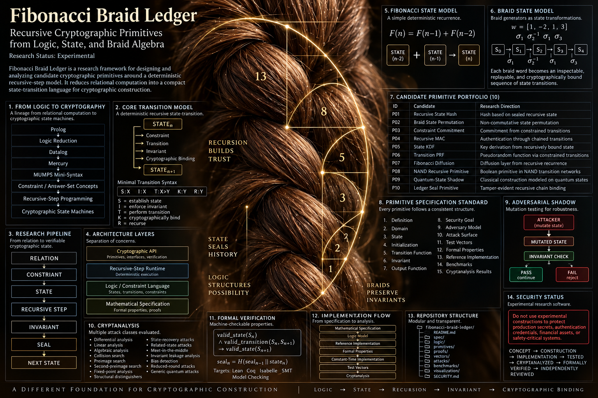
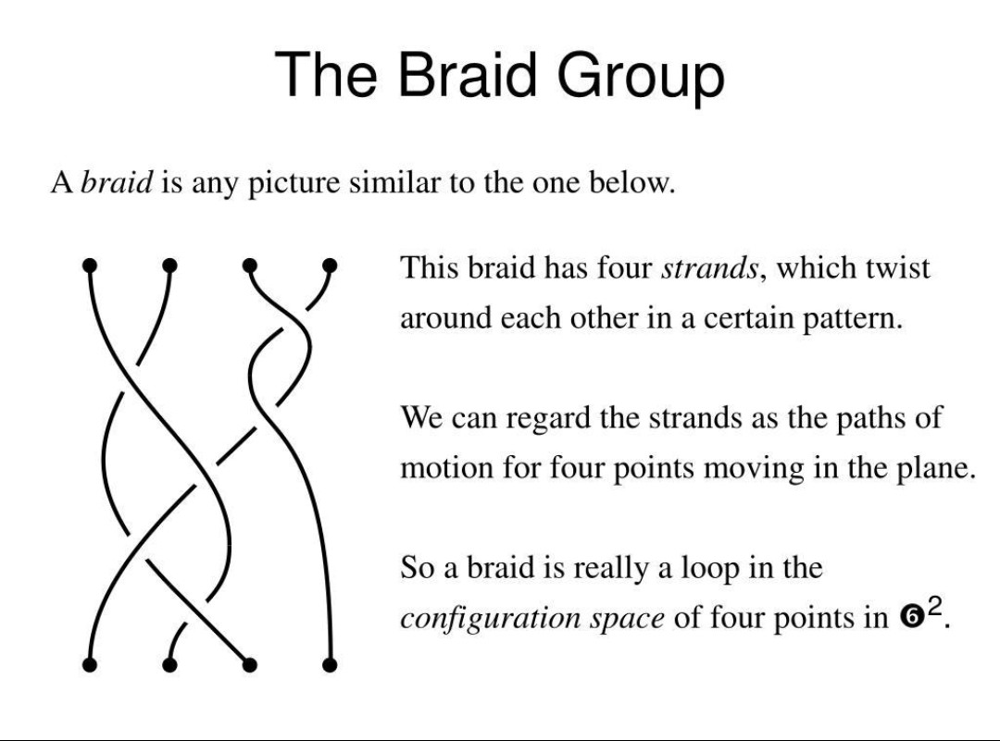
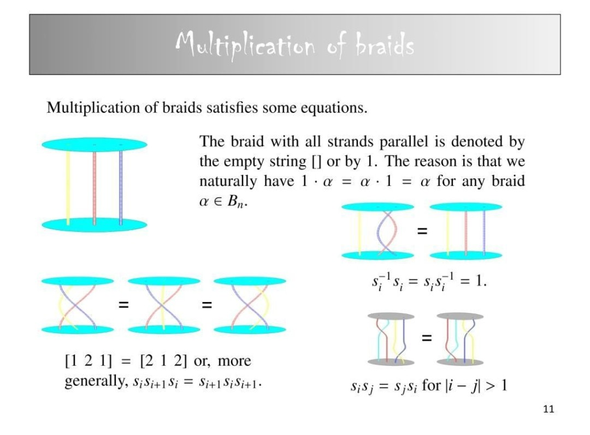

<p align="center">
  
  
</p>

<p align="center">
  <strong>Recursive Cryptographic Primitives from Logic, State, and Braid Algebra</strong>
</p>

<p align="center">
  EXPERIMENTAL RESEARCH
</p>

---

[](LICENSE-FSL-1.1)
[](LICENSE-AGPL-3.0)
[](lean/)
[](wasm/)
[](tests/)
[](he-binary-functor/nand-architecture/)
[](he-binary-functor/fibonacci-braid-ledger/)
[](frontend/quantum_shadow_ledger.html)
[](https://www.meta.ai/share/a/870285d6-ca54-4ce2-a963-498cd5b9697b)
[](PRODUCTION.md)
[](SECURITY.md)
[](CHANGELOG.md)

---

## Core Model

```
RELATION
    |
    v
CONSTRAINT
    |
    v
STATE
    |
    v
RECURSIVE STEP
    |
    v
INVARIANT
    |
    v
SEAL
```

---

## About

Fibonacci Braid Ledger is an experimental research framework for
investigating cryptographic constructions based on deterministic
recursive state transitions.

The system explores the reduction of relational logic into a compact
recursive-step computational model.

A ledger that does not trust its current state -- it reconstructs it from provable history. The runtime executes in WebAssembly, not Python.

---

## Research Lineage

```
Prolog
    |
    v
Logic Reduction
    |
    v
Datalog
    |
    v
Mercury
    |
    v
MUMPS Mini-Syntax
    |
    v
Constraint Systems
    |
    v
Recursive-Step Programming
    |
    v
Cryptographic State Machines
```

---

## Quick Start

```bash
# Open the Quantum Shadow Ledger in your browser
open frontend/quantum_shadow_ledger.html

# Full build (all layers)
make full

# Run Python baseline tests
make test
```

---

## Documentation

| Document | Description |
|----------|-------------|
| [Fibonacci Braid Ledger](./docs/FIBONACCI_BRAID_LEDGER.md) | Core specification and formal algebra |
| [Formal Algebra](./docs/FORMAL_ALGEBRA.md) | Braid state transitions, invariants, verification |
| [User Guide](./docs/USER.md) | Installation, usage, testing |
| [About](./docs/ABOUT.md) | Ahmad Ali Parr, SnapKittyWest |
| [Ledger](./docs/LEDGER.md) | WORM storage, account registry |
| [Inverted Monorepo](./INVERTED_MONOREPO.md) | Binary-first architecture |
| [Math Dictionary](./MATH_DICTIONARY.md) | All mathematical operations |
| [Security Policy](./SECURITY.md) | Threat model and practices |
| [Changelog](./CHANGELOG.md) | Version history |

---

## Interactive Instrument

**[Open Quantum Shadow Ledger](./frontend/quantum_shadow_ledger.html)**

6-stage pipeline: Fibonacci -> Braid -> Array -> NAND -> Crypto -> Seal

---

## Visual Research Archive

<p align="center">
  
  
  
</p>

<p align="center">
  
  
</p>

---

## Demonstration

- [Video Demo Part 1](./docs/assets/demo-part1.mp4) -- Core braid state transitions
- [Video Demo Part 2](./docs/assets/demo-part2.mp4) -- Adversarial transform
- [Video Demo Part 3](./docs/assets/demo-part3.mp4) -- NAND recursive primitive
- [Video Demo Part 4](./docs/assets/demo-part4.mp4) -- Full ledger verification

---

## Project Structure

```
devflow-finance-twin/
├── docs/                           # Documentation
│   ├── FIBONACCI_BRAID_LEDGER.md   # Core specification
│   ├── FORMAL_ALGEBRA.md           # Braid algebra formalization
│   ├── USER.md                     # User guide
│   ├── ABOUT.md                    # About Ahmad Ali Parr
│   ├── LEDGER.md                   # Ledger specification
│   └── assets/                     # Media files (GIFs, videos, images)
├── frontend/                       # Gold Standard Frontend
│   └── quantum_shadow_ledger.html  # Interactive 6-stage pipeline UI
├── lean/                           # Lean 4 formal verification
├── wasm/                           # WebAssembly runtime
├── he-binary-functor/              # Binary Functor Architecture
│   ├── nand-architecture/          # NAND# spec
│   ├── gfnand/                     # GFLOP→NAND Extractor
│   ├── tensor-parser/              # SPARK Ada zero-copy
│   ├── block-lace/                 # Block-Lace topology
│   ├── verilog-a/                  # Analog/mixed-signal
│   ├── crypto/                     # IAMAC, Malleability, RSL
│   └── fibonacci-braid-ledger/     # FBL: array algebra + ledger
├── pli/ / cobol/                   # Sovereign Treasury Engine
├── src/                            # Python legacy + cold boot + ICP
├── tests/                          # 122 passing tests
├── INVERTED_MONOREPO.md            # Binary-first architecture
├── MATH_DICTIONARY.md              # All math/arithmetic reference
├── SECURITY.md                     # Security policy
├── CHANGELOG.md                    # Version history
├── PRODUCTION.md                   # Deployment guide
└── README.md                       # This file
```

---

## Threat Model

- **WORM & Merkle Chain**: Every record contains prev_hash = SHA-256(previous record). Tampering breaks chain validation.
- **WASM Sandboxing**: Runtime executes in WebAssembly linear memory sandbox, no system access.
- **Fixed-Point Arithmetic**: 18-decimal fixed-point for financial calculations, no floating-point drift.
- **Quantum Isolation**: Quantum layer is sandboxed; outputs are suggestions pending deterministic approval.
- **Lean 4 Proofs**: 12 deed files, 0 sorry policy, formal verification of core invariants.
- **SPARK Mode**: All Ada cryptographic code in SPARK_Mode => On.
- **Kani Proofs**: 31 bounded proof harnesses for NAND verification.

---

## License

Dual-licensed: AGPL-3.0 (WASM/PL-I/COBOL/C/NASM/Chisel/Scala) and FSL-1.1 (all others).

```
Copyright (c) 2026 SnapKittyWest.
Ahmad Ali Parr, Bel Esprit D'Accord Irrevocable Trust.
EIN 42-697643
```
