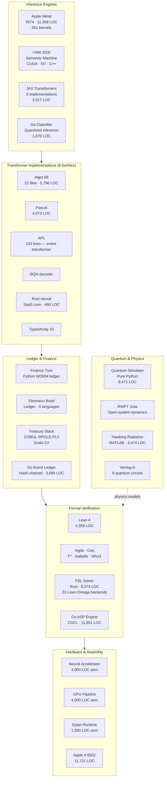
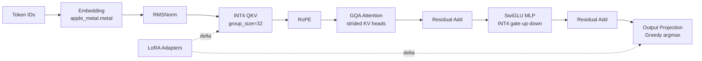
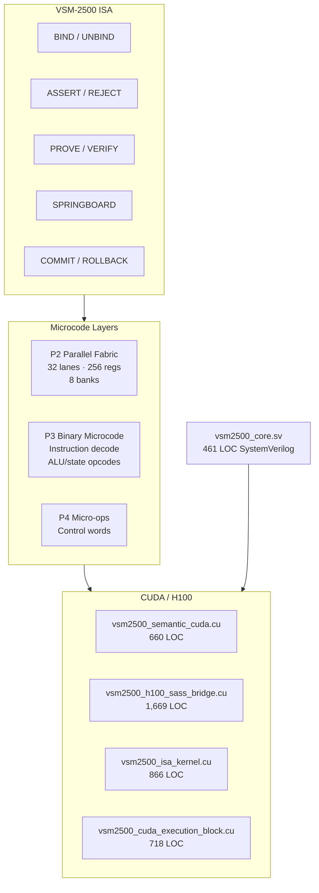
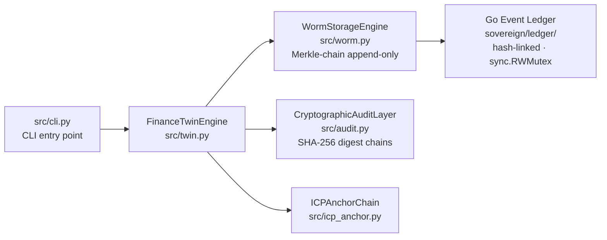
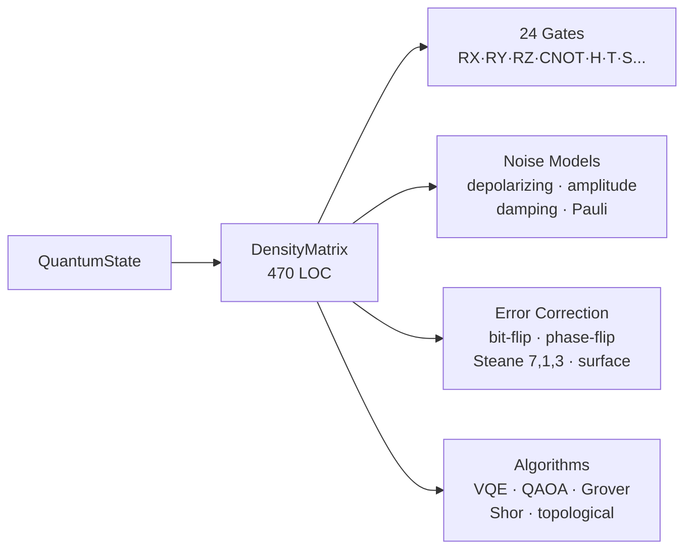
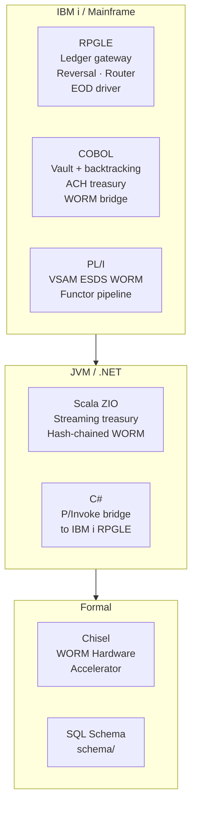

# Sovereign Devflow Finance Twin


> **334,061 lines · 1,055 files · 40+ languages**
> Polyglot systems repository: transformer implementations, VSM-2500 semantic machine, Fibonacci Braid Ledger, GPU/Metal inference engines, formal verification suite, quantum simulator, and multi-language treasury stack.

---

## Navigation

- [Repository Atlas](#repository-atlas)
- [Architecture Overview](#architecture-overview)
- [Products & Packages](#products--packages)
  - [Apple Metal INT4 Inference](#1-apple-metal-int4-inference-engine)
  - [VSM-2500 Semantic Machine](#2-vsm-2500-semantic-machine)
  - [Transformer Implementations](#3-transformer-implementations-8-language-families)
  - [Finance Twin & WORM Ledger](#4-finance-twin--worm-ledger)
  - [Go ASP Engine](#5-go-answer-set-programming-engine)
  - [Quantum Computer Simulator](#6-quantum-computer-simulator)
  - [FSL Formal Solver](#7-fsl-formal-solver-language)
  - [Fibonacci Braid Ledger](#8-fibonacci-braid-ledger)
  - [Cobalt Compiler](#9-cobalt-haskell-compiler)
  - [Banking & Treasury Stack](#10-banking--treasury-stack)
- [Formal Verification](#formal-verification)
- [Language Distribution](#language-distribution)
- [Build & Test](#build--test)
- [License](#license)

---

## Repository Atlas

```
devflow-finance-twin/                          334K LOC · 1,055 files · 40+ languages
│
├── src/                          59,633 LOC   Python engine · Go core · JAX transformers
│   ├── a68/                                   Algol 68 transformer stack (22 files)
│   ├── agol86/                                AGOL-86 Python ports + .a86 source
│   ├── pascal/                                Pascal transformer + TensorCore (1,184 LOC)
│   ├── cuda/                                  CUDA utilities + Futhark + shims
│   ├── python/                                Python inference harnesses
│   ├── asp/                                   Go incremental ASP grounding
│   ├── native/                                C native extensions
│   ├── bqn/                                   BQN array decoder
│   ├── cli/                                   Swift CLI (917 LOC)
│   ├── api/                                   Go API layer
│   ├── ebnf/                                  EBNF grammar definitions
│   └── [130+ loose files]                     JAX transformers · VSM2500 (moved) · finance twin
│
├── vsm2500/                      ~10,000 LOC  VSM-2500 Semantic Machine
│   ├── vsm2500_semantic_cuda.cu   (660)        Semantic state + neural device kernels
│   ├── vsm2500_h100_sass_bridge.cu (1,669)     H100 SASS bridge
│   ├── vsm2500_isa_kernel.cu      (866)        ISA execution kernel
│   ├── vsm2500_cuda_execution_block.cu (718)   Execution block
│   ├── vsm2500_core.sv            (461)        SystemVerilog behavioral model
│   ├── p2_fabric.cpp              (2,164)      32-lane parallel fabric
│   ├── p2_hardware_parallel_fabric.cpp (1,921) Hardware parallel fabric
│   ├── p3_binary_microcode_p2_fabric.cpp (839) P3 binary microcode
│   └── p4_microcode_vsm2500.cpp   (594)        P4 micro-operations
│
├── apple-metal-inference/        ~10,000 LOC  Apple Silicon INT4 inference engine
│   └── Sources/Kernels/
│       ├── apple_metal.metal      (7,200)      561-kernel monolithic GPU library
│       ├── Transformer.metal      (2,331)      762-kernel standalone transformer
│       └── [16 focused kernels]               attention · rope · kv_cache · lora · mlp
│
├── apple-design-parser/                        Swift design system parser
│   └── Sources/                               CSS/HTML parser · color normalizer · palette
│
├── metal/                        ~2,400 LOC   Standalone Metal transformer + M5 gateway
│   ├── Sources/MetalTransformer/              Transformer.metal (2,331) · Swift host
│   └── m5-gateway/                            M5 OS Swift + WAT WASM bridge
│
├── asp/                          11,651 LOC   Go CDCL Answer Set Programming engine
│   ├── parser/parser.go           (883)        Lexer + recursive descent parser
│   ├── solver/                                 CDCL + Luby restart
│   ├── semantics/                              AST · IR · semantic checker
│   └── tests/                    (4,462)       Full test suite
│
├── quantum_computer/              8,471 LOC   Pure-Python density matrix simulator
│   ├── vm/simulator.py            (470)        DensityMatrix class
│   ├── gates/__init__.py          (371)        24 quantum gates
│   ├── algorithms/                (1,402)      VQE · QAOA · Grover · Shor · topological
│   ├── error_correction/          (400)        Bit-flip · phase-flip · surface code
│   └── noise/                     (656)        Depolarizing · amplitude damping
│
├── rust/                          8,876 LOC   FSL formal solver + neural SaaS core
│   ├── fsl/src/lib.rs             (987)        Constraint IR (Bool/BV/Int/Array)
│   ├── fsl/src/crux/                           Z3 · Lean · Omega · SAS · PCC backends
│   ├── fsl/src/cbmc.rs            (528)        CBMC model checker interface
│   └── sovereign_neural_saas_core.rs (488)     Rust neural inference core
│
├── he-binary-functor/            16,495 LOC   Crypto · braid · NAND · hardware
│   ├── fibonacci-braid-ledger/   (3,241)       C · Haskell · BQN · RISC-V · x86
│   ├── tensor-parser/            (2,366)       Ada/SPARK BTEN format parser
│   ├── nand-architecture/        (1,453)       NAND# ISA · Rust VM · Kani harness
│   ├── crypto/                   (1,272)       IAMAC · seal chain · malleability
│   ├── verilog-a/                (1,066)       9 analog quantum circuits
│   ├── haskell/                  (702)         Workerman Calculus + Yang-Baxter
│   ├── why3/                     (276)         PWC braid algebra formalization
│   └── [15 more subdirs]                       APL · BQN · K · Uiua · SystemVerilog · beam
│
├── assembly-120-strict-model/    14,889 LOC   Neural accel · GPU · scheduler · CPU engine
│   ├── 08_neural_accelerator_engine.asm (4,000) Distributed neural accelerator
│   ├── PHASE_2_CPU_EXECUTION_ENGINE.asm (3,374)  CPU execution engine
│   ├── 09_graphics.asm            (4,000)      8-core GPU pipeline
│   ├── 18_dylan_runtime.asm       (1,500)      Dylan OOP runtime
│   ├── 15_scheduler.asm           (1,500)      Scheduler
│   └── bit_pattern_kernel_avx2.asm (1,079)     AVX2 SIMD kernel
│
├── apple6502x86/                 11,721 LOC   Complete Apple II 6502 system
│   ├── boot/boot.asm              (1,502)      Boot loader · RESET/NMI/IRQ vectors
│   ├── memory/memory.asm          (2,907)      Memory manager
│   ├── monitor/monitor.asm        (2,230)      System monitor
│   └── rom/rom.asm                (2,524)      ROM routines
│
├── classifier/                    5,295 LOC   Go quantized inference engine
│   ├── model/inference.go         (902)        Attention · softmax · LayerNorm · decode
│   ├── model/advanced.go          (768)        Multi-head attention orchestration
│   ├── batch/batch.go             (662)        Batch processing
│   └── audit/audit.go             (555)        Audit records
│
├── cobalt-compiler/               3,704 LOC   Haskell LiquidHaskell compiler
│   ├── LiquidOps/KernelFull.hs    (531)        FExpr→NandTree→typed ISA (GADT)
│   ├── LiquidOps/NAND.hs          (412)        NAND extraction
│   └── ISA/Core.hs                             64-bit ISA definition
│
├── finance/                       ~8,000 LOC  Multi-language treasury stack
│   ├── cobol/                     (2,636)      Vault · ACH treasury · WORM bridge
│   ├── rpgle/                     (2,942)      IBM i ledger · reversal · router
│   ├── pli/                       (588)        VSAM WORM functor pipeline
│   ├── scala/                     (577)        ZIO streaming treasury
│   └── csharp/                    (263)        P/Invoke IBM i bridge
│
├── formal/                        ~6,000 LOC  Lean4 · Agda · Coq · F* · Isabelle
│   ├── lean/                      (3,186)      VSM algebra · Jacobian · array verification
│   ├── token-verification/        (1,584)      Cross-prover token model (5 systems)
│   ├── linear-algebra/            (526)        Linear algebra verification
│   └── verification-paper/                     LaTeX paper + theorem_ledger.rs
│
├── physics/                                    Scientific computing
│   ├── hawking-radiation/         (3,474 MATLAB) Hawking modes · horizon fluctuations
│   ├── jungian-dynamics/          (904 Isabelle) Lindblad GKSL · density matrix
│   └── julia-rwpt/                (426 Julia)   RWPT open-system dynamics
│
├── retro-gpu/                     4,252 LOC   GPU architecture models
│   ├── sml/                                   GEMM · ALU · Warp · Hopper (SML)
│   ├── ocaml/                                 Full pipeline · compiler (OCaml)
│   └── occam/                                 Occam GPU model
│
├── kernel-language/               9,883 LOC   C compiler frontend
│   ├── src/                       (2,114 C)    Lexer · parser · IR · regalloc · codegen
│   └── examples/self_hosted_compiler.kl (1,135) Self-hosted .kl example
│
├── languages/                                  Consolidated single-language dirs
│   ├── ada/                       (972)        Ada/SPARK tensor parser + firmware
│   ├── apl/                       (1,916)      APL transformer (153 LOC!) + LiquidAssert
│   ├── ptx/                       (358)        PTX kernels
│   ├── x86_64/                    (438)        x86_64 assembly
│   └── [lisp · logtalk · prolog · chisel · eclipse · braid · topos · mathematics]
│
├── sovereign/                     3,699 LOC   Go hash-chained immutable event ledger
├── constraint-harness/            2,064 LOC   MXML constraint DSL + DAG scheduler
├── isa-jvm/                       1,856 LOC   ISA→JVM .class compiler (no ASM library)
├── astre-vault/                   1,831 LOC   OWL 2 reasoner + RCC-8 spatial engine
├── occam-b-bscl/                  1,538 LOC   Occam-B wordcode compiler
├── haskell/                       1,109 LOC   Kraus extractor · weak measurement
├── datalog-engine/                608 LOC     Datalog engine
├── wasm/                          720 LOC     SHA-256 · WORM frame · account registry
├── qflow/                         902 LOC     Haskell quantum-dataflow parser
├── tests/                         3,737 LOC   Integration + behavioral tests
├── scripts/                       1,651 LOC   Build + publish automation
├── docs/                          34,763 LOC  Specs · phases · architecture docs
└── assets/                                    SVG diagrams
```

---

## Architecture Overview



---

## Products & Packages

### 1. Apple Metal INT4 Inference Engine

**`apple-metal-inference/`** · 11,358 Metal LOC · macOS 13+ · Apple Silicon

Complete Apple Silicon LLM inference engine with INT4/INT8 quantized weights, grouped-query attention, RoPE, LoRA adapters, and KV cache.



| File | LOC | Purpose |
|---|---|---|
| `apple_metal.metal` | **7,200** | 561 kernels — named primitives + `kernel_000`–`kernel_525` dispatch |
| `Transformer.metal` | **2,331** | 762 kernels — batched variants, prefix cache, mixed precision |
| `int4_transformer.metal` | 205 | QKV · GQA · RMSNorm · SwiGLU · LoRA |
| `fused_qkv_tiled.metal` | 89 | Tiled fused QKV projection |
| `gqa_strided.metal` | 106 | Grouped-query attention strided access |
| `kv_cache.metal` | 85 | KV cache read/write |
| `rope.metal` | 72 | Rotary positional encoding |
| `lora_delta.metal` | 35 | LoRA delta weight injection |

---

### 2. VSM-2500 Semantic Machine

**`vsm2500/`** · ~10,000 LOC · CUDA + C++ + SystemVerilog

Custom machine architecture with **proof-oriented ISA opcodes**: `BIND`, `UNBIND`, `ASSERT`, `REJECT`, `PROVE`, `VERIFY`, `PROPAGATE`, `SPRINGBOARD`. Targets H100 SM90.



---

### 3. Transformer Implementations (8 language families)

| Language | Files | LOC | Entry point |
|---|---|---|---|
| **Algol 68** | 22 | 5,796 | [`src/a68/transformer_model.a68`](src/a68/transformer_model.a68) |
| **AGOL-86** | 1 `.a86` + 17 `.py` | 305 + ~768 | [`src/agol86/agol86_model.a86`](src/agol86/agol86_model.a86) |
| **Pascal** | 11 | 4,673 | [`src/pascal/Model.pas`](src/pascal/Model.pas) |
| **APL** | 1 | 153 | [`languages/apl/apl/transformer.apl`](languages/apl/apl/transformer.apl) |
| **BQN** | 1 | ~200 | [`src/bqn/transformer.bqn`](src/bqn/transformer.bqn) |
| **JAX (Python)** | 3 | 3,517 | [`src/jax_gpt_model.py`](src/jax_gpt_model.py) |
| **Rust** | 1 | 488 | [`rust/sovereign_neural_saas_core.rs`](rust/sovereign_neural_saas_core.rs) |
| **TypedArray JS** | 1 | 221 | [`src/jit_webllm_toy_transformer.js`](src/jit_webllm_toy_transformer.js) |

The Algol 68 stack is a full modular decoder:

| Module | LOC | Purpose |
|---|---|---|
| `embedding.a68` | 1,212 | Token embedding + gradient routines |
| `attn_core.a68` | 486 | Causal mask · head split · forward/backward |
| `transformer_block.a68` | 342 | Attention/MLP composition |
| `optimizer.a68` | 317 | Adam · SGD · warmup · grad clipping |
| `mlp.a68` | 285 | GELU · forward cache · backward |
| `inference.a68` | 266 | Greedy · top-k/p · temperature · EOS |
| `serialization.a68` | 258 | Checkpoint binary format · round-trip |
| `output_head.a68` | 243 | Logits · cross-entropy · gradients |

---

### 4. Finance Twin & WORM Ledger

**`src/twin.py`** · **`sovereign/`** · 18-decimal fixed-point arithmetic



| Component | LOC | Purpose |
|---|---|---|
| `src/twin.py` | 344 | `FinanceTwinEngine` — 18-decimal fixed-point, sliding-window rate limiter |
| `src/worm.py` | 250 | `WormStorageEngine` — Merkle-chain hash-linked append-only log |
| `src/audit.py` | 125 | `CryptographicAuditLayer` — SHA-256 digest chains |
| `sovereign/ledger/ledger.go` | ~400 | Go hash-chained immutable ledger |

---

### 5. Go Answer Set Programming Engine

**`asp/`** · 11,651 LOC · Go 1.21+

Complete CDCL (Conflict-Driven Clause Learning) ASP solver with Luby restart policy, full parser/lexer/AST, semantic checker, and grounder.

```bash
cd asp && go test ./...
```

---

### 6. Quantum Computer Simulator

**`quantum_computer/`** · 8,471 LOC · Pure Python (no NumPy core)



---

### 7. FSL Formal Solver Language

**`rust/fsl/`** · 8,374 Rust LOC

Multi-backend constraint IR with `Expr` enum (Bool/BV/Int/Array sorts), quantifiers, and full arithmetic.

| Backend | File | LOC |
|---|---|---|
| Z3 | `crux/z3_backend.rs` | 317 |
| Lean | `crux/lean_backend.rs` | 377 |
| Omega test | `crux/russian.rs` | 725 |
| SAS | `crux/sas_backend.rs` | 256 |
| PCC (proof-carrying code) | `crux/pcc.rs` | 212 |
| CBMC model checker | `cbmc.rs` | 528 |
| DPLL/unification | `qa5/` | ~400 |
| CLP/Parlog search | `eclipse_parlog/` | ~570 |

```bash
cargo test --manifest-path rust/fsl/Cargo.toml
```

---

### 8. Fibonacci Braid Ledger

**`he-binary-functor/fibonacci-braid-ledger/`** · 3,241 LOC · 5 languages

Ledger entries authenticated by Fibonacci-indexed braid group words. Parallel implementations:

| Language | File | What it proves |
|---|---|---|
| LiquidHaskell | `Ledger.hs` | Refinement-typed `validTrans` invariants |
| C | `fbLedger.c` | Braid word reduction — inverse cancellation |
| RISC-V asm | `fb_append_rv64.s` | Ledger append in RV64 |
| BQN | `ledger_full.bqn` | Structure-of-arrays tacit programming |
| x86 asm | `fib_braid.asm` | Fibonacci + braid semantics |

**Workerman Calculus** ([`he-binary-functor/haskell/Workerman/Calculus.hs`](he-binary-functor/haskell/Workerman/Calculus.hs)) — Yang-Baxter normalization: σᵢσᵢ₊₁σᵢ = σᵢ₊₁σᵢσᵢ₊₁ with trigonometric sphere coordinates in Haskell refinement types.

---

### 9. Cobalt Haskell Compiler

**`cobalt-compiler/`** · 3,704 LOC · Haskell/GHC

GADT-based compiler pipeline: `FExpr → Logic IR → NandTree → typed ISA → MachineState` with termination proofs via `exprSize`/`logicSize`/`nandSize`.

```bash
cd cobalt-compiler && cabal build
```

---

### 10. Banking & Treasury Stack

**`finance/`** · ~8,000 LOC · 5 languages, no single API surface (yet)



---

## Formal Verification

| System | Location | Contents |
|---|---|---|
| **Lean 4** | [`formal/lean/`](formal/lean/) | VSM algebra · Jacobian framework · array verification · Enochian engine |
| **Agda** | [`formal/token-verification/agda/`](formal/token-verification/agda/) | `SymbolOscillatorInvariant` — complex numbers over ℚ, `--without-K --safe` |
| **Coq** | [`formal/token-verification/coq/`](formal/token-verification/coq/) | Token model |
| **F\*** | [`formal/token-verification/fstar/`](formal/token-verification/fstar/) | Token model formalization |
| **Isabelle/HOL** | [`physics/jungian-dynamics/`](physics/jungian-dynamics/) | Lindblad GKSL · density matrix · stochastic convergence |
| **Why3** | [`he-binary-functor/why3/`](he-binary-functor/why3/) | PWC braid algebra — Fibonacci anyon matrix, Yang-Baxter lemmas |
| **LiquidHaskell** | [`he-binary-functor/fibonacci-braid-ledger/Ledger.hs`](he-binary-functor/fibonacci-braid-ledger/Ledger.hs) | Machine-checked ledger transition predicates |
| **Kani** | [`he-binary-functor/nand-architecture/kani/`](he-binary-functor/nand-architecture/kani/) | NAND safety harness |

**Notable proofs:**
- [`he-binary-functor/lean4/sovereign_attractor.lean`](he-binary-functor/lean4/sovereign_attractor.lean) — Mathlib Banach contraction proof: Fibonacci braid sequence converges to topological fixed point
- [`he-binary-functor/why3/pwc_core.mlw`](he-binary-functor/why3/pwc_core.mlw) — Fibonacci anyon braid matrix `σ = [[φ/2, 1/2], [1/2, -φ/2]]` with Yang-Baxter and length non-increase lemmas

---

## Language Distribution

| Language | LOC | Files |
|---|---|---|
| Assembly (x86/6502/RISC-V/GPU) | **86,537** | 35 |
| Python | **30,547** | 138 |
| Go | **28,811** | 67 |
| Rust | **13,041** | 68 |
| Metal (GPU shaders) | **11,358** | 18 |
| Swift | **8,868** | 17 |
| Haskell | **8,716** | 52 |
| C++ | **5,810** | 6 |
| Algol 68 | **5,796** | 22 |
| Pascal | **4,673** | 13 |
| CUDA | **4,499** | 11 |
| C | **4,403** | 32 |
| Lean 4 | **4,359** | 27 |
| MATLAB | **3,474** | 18 |
| RPGLE (IBM i) | **2,942** | 9 |
| APL | **2,440** | 8 |
| Ada/SPARK | **3,063** | 36 |
| COBOL | **2,103** | 8 |
| Occam | **1,848** | 12 |
| Kernel Language (.kl) | **1,208** | 3 |
| OCaml | **1,186** | 11 |
| Isabelle/HOL | **904** | 13 |
| SML | **806** | 14 |
| WAT/WebAssembly | **813** | 7 |
| SystemVerilog | **655** | 4 |
| Scala / Chisel | **624** | 4 |
| PL/I | **588** | 3 |
| BQN | **545** | 8 |
| Julia | **426** | 9 |
| Verilog-A | **418** | 9 |
| + 15 more (Agda, Coq, F*, Why3, Lisp, Prolog, ECLiPSe, Logtalk, Erlang, Q#, Qrisp, Circom, K, Uiua, Futhark) | ~2,000 | ~35 |

**Grand total: ~334,061 lines · 1,055 files · 40+ languages**

---

## Novel Implementations

| What | Where | Why it's unusual |
|---|---|---|
| 153-line APL transformer | [`languages/apl/apl/transformer.apl`](languages/apl/apl/transformer.apl) | Complete decoder-only transformer in 153 lines of tacit APL |
| Proof-oriented ISA | [`vsm2500/vsm2500_core.sv`](vsm2500/vsm2500_core.sv) | Machine opcodes: PROVE, VERIFY, ASSERT — formal reasoning as hardware |
| IAMAC homomorphic MAC | [`he-binary-functor/crypto/iamac.rs`](he-binary-functor/crypto/iamac.rs) | `IAMAC(k,a+b) = IAMAC(k,a) + IAMAC(k,b)` over Mersenne-like prime |
| NCT resonance simulator | [`src/nct_resonance_simulator.py`](src/nct_resonance_simulator.py) | Diophantine approximation on non-commutative tori → PDF scientific reports |
| COBOL with backtracking | [`finance/cobol/COBILT-VAULT.cbl`](finance/cobol/COBILT-VAULT.cbl) | Prolog-style choice points in COBOL working-storage |
| Raw BEAM assembly | [`he-binary-functor/beam/call_functor.erl`](he-binary-functor/beam/call_functor.erl) | BEAM opcode format (not Erlang source) for SIP/RTP OTP state |
| XSLT→WASM compiler | [`he-binary-functor/xslt-wasm/`](he-binary-functor/xslt-wasm/) | Rust XSLT→WASM string-table VM — replaces deprecated browser XSLTProcessor |
| Banach contraction proof | [`he-binary-functor/lean4/sovereign_attractor.lean`](he-binary-functor/lean4/sovereign_attractor.lean) | Mathlib proof Fibonacci braid converges via topological fixed point |
| OWL 2 reasoner from scratch | [`astre-vault/astra_owl_solver.py`](astre-vault/astra_owl_solver.py) | Pure-Python OWL 2 tableau — no rdflib, hand-built triplestore + SP/PO/SO indices |

---

## Build & Test

The repository has independent toolchains per subsystem — there is no single root build.

| Subsystem | Command | Requirements |
|---|---|---|
| **Go ASP** | `cd asp && go test ./...` | Go 1.21+ |
| **Go Classifier** | `cd classifier && go test ./...` | Go 1.21+ |
| **Go Ledger** | `cd sovereign/ledger && go test ./...` | Go 1.21+ |
| **Rust FSL** | `cargo test --manifest-path rust/fsl/Cargo.toml` | Rust stable |
| **Cobalt** | `cd cobalt-compiler && cabal build` | GHC/Cabal |
| **Python tests** | `python -m pytest tests/` | Python 3.11+ |
| **Quantum sim** | `python -m pytest quantum_computer/tests/` | Python 3.11+ |
| **Constraint harness** | `cd constraint-harness && pip install -e ".[dev]" && pytest` | Python 3.10+ |
| **Metal inference** | `swift build` (in `apple-metal-inference/`) | macOS 13+ · Xcode 15+ |
| **Kernel Language** | `make -C kernel-language test` | C compiler + Make |
| **WASM/native** | `make all` | Node + wabt + GCC + NASM |

---

## License

Governed by the **Sovereign Leviathan Covenant** — AGPL-3.0 base with recursive node licensing.

| File | Description |
|---|---|
| `LICENSE-AGPL-3.0` | GNU Affero General Public License v3.0 |
| `LICENSE-FSL-1.1` | Sovereign Leviathan additional terms |
| `SOVEREIGN_LEVIATHAN_COVENANT.md` | Complete covenant documentation |
| `src/LICENSE-RECURSIVE-INFECTION` | Recursive infection clause |

```bibtex
@software{sovereign_devflow_2026,
  title  = {Sovereign Devflow Finance Twin},
  author = {Ahmad Ali Parr and Bel Esprit D'Accord Irrevocable Trust},
  year   = {2026},
  license = {AGPL-3.0 + Sovereign Leviathan Covenant v1.0},
  url    = {https://github.com/SNAPKITTYWEST/devflow-finance-twin}
}
```

---

**THE REPOSITORY IS THE AUTHORITY. THE README IS THE MAP.**
