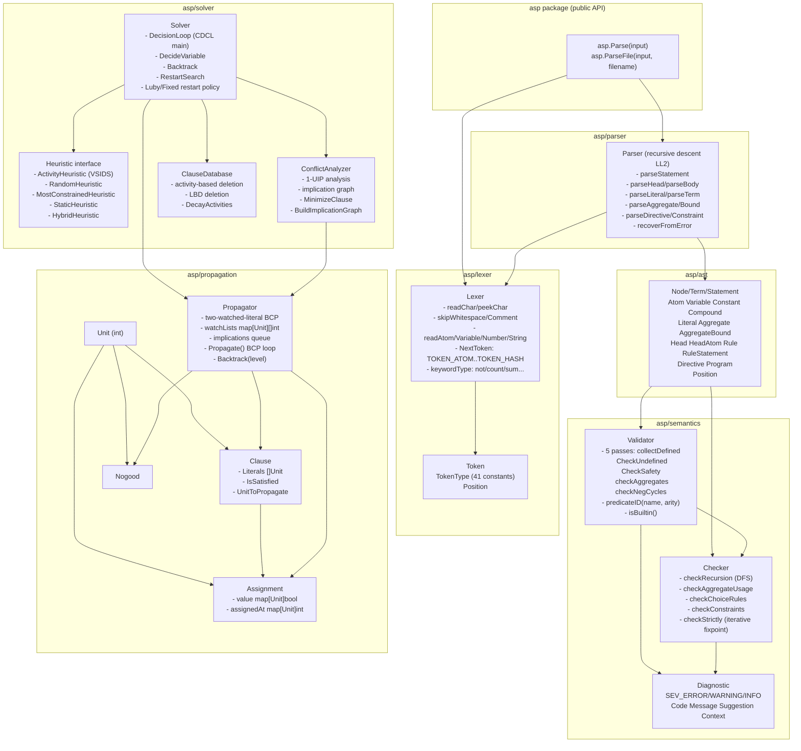
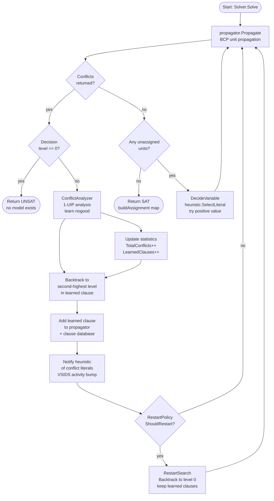

# FILE REFERENCE: asp/

The `asp/` package is a complete Answer Set Programming (ASP) toolchain written in Go. It
provides a lexer, recursive-descent parser, AST type system, semantic validator, conflict-driven
clause learning (CDCL) solver with VSIDS heuristic, and a public entry-point package. The solver
is designed to find stable models of ASP programs and is integrated with the devflow-finance-twin
symbolic reasoning layer, including `souffle_symbolic_agent.py`.

---

## FILE: asp/asp.go

**PURPOSE:** Public entry-point package. Re-exports primary AST types from `asp/ast` and exposes
two top-level parse functions so external consumers can import only `devflow-finance-twin/asp`
without touching sub-packages directly.

**LANGUAGE:** Go

**KEY FUNCTIONS/TYPES:**

Type aliases (re-exported from `asp/ast`):
- `Statement = ast.Statement` — top-level interface for any parsed ASP statement.
- `Rule = ast.Rule` — complete ASP rule (head :- body.).
- `RuleStatement = ast.RuleStatement` — wraps a Rule as a Statement.
- `Directive = ast.Directive` — meta-directive (`#show`, `#const`, etc.).
- `Program = ast.Program` — parsed collection of statements.
- `Literal = ast.Literal` — positive or negated body/head literal.
- `Head = ast.Head` — head of an ASP rule.
- `Term = ast.Term` — base interface (Atom, Variable, Compound, Constant).
- `Atom = ast.Atom` — ground or non-ground atom name.
- `Variable = ast.Variable` — upper-case or underscore-prefixed logic variable.
- `Position = ast.Position` — source file, line, column for error reporting.

Functions:
- `Parse(input string) ([]ast.Statement, []string)` — creates `lexer.NewLexer(input, "<input>")`,
  wraps in `parser.NewParser`, calls `p.Parse()`. Returns statements + error strings.
- `ParseFile(input, filename string) ([]ast.Statement, []string)` — identical but passes filename
  to lexer for accurate position reporting.

**ALGORITHM:** Thin facade. All parsing logic lives in sub-packages.

**DEPENDENCIES:** `devflow-finance-twin/asp/ast`, `devflow-finance-twin/asp/lexer`,
`devflow-finance-twin/asp/parser`.

**CALLERS/CALLEES:** Entry point for all external consumers. Calls `lexer.NewLexer`,
`parser.NewParser`, `parser.Parse`.

---

## FILE: asp/ast/types.go

**PURPOSE:** Defines the complete Abstract Syntax Tree type hierarchy for ASP programs. All
parser output and semantic analysis input/output is expressed in terms of these types.

**LANGUAGE:** Go (package `ast`)

**KEY FUNCTIONS/TYPES:**

*Interfaces:*
- `Node` — marker interface (`node()` method); base of all AST nodes.
- `Term` — extends Node with `term()` marker; implemented by Atom, Variable, Constant, Compound.
- `Statement` — extends Node with `statement()` marker; implemented by RuleStatement, Directive.

*Term types:*
- `Atom` — `Name string`, `Pos Position`. Ground or schematic atom (e.g., `parent`, `tweety`).
- `Variable` — `Name string`, `Pos Position`. Logic variable (starts with upper-case or `_`).
- `Constant` — `Type ConstantType` (CONST_INT/CONST_FLOAT/CONST_STRING), `Value interface{}`,
  `Pos Position`. Typed constant literal.
- `Compound` — `Functor string`, `Args []Term`, `Pos Position`. Function term `f(a, b)`.

*Literal and aggregate:*
- `Literal` — `Positive bool` (true = positive, false = negation-as-failure `not`),
  `Atom *Atom`, `Args []Term`, `Aggregate *Aggregate`, `Pos Position`.
- `Aggregate` — `Op AggregateOp` (count/sum/min/max), `Variables []Term`, `Condition *Literal`,
  `Bound *AggregateBound`, `Pos Position`.
- `AggregateBound` — `Lower *Term`, `Upper *Term`, `Pos Position`.
- `AggregateOp` — string type constants: `AGG_COUNT`, `AGG_SUM`, `AGG_MIN`, `AGG_MAX`.

*Head types:*
- `Head` — `Atoms []*HeadAtom`, `Type HeadType` (HEAD_NORMAL/HEAD_CHOICE/HEAD_DISJUNCTIVE),
  `Pos Position`.
- `HeadAtom` — `Atom *Atom`, `Args []Term`, `Pos Position`.

*Rule:*
- `Rule` — `ID uint64` (auto-incremented by parser), `Head *Head`, `Body []*Literal`,
  `Type RuleType` (RULE_NORMAL/RULE_CHOICE/RULE_CONSTRAINT/RULE_WEAK/RULE_FACT), `Pos Position`.

*Statement types:*
- `RuleStatement` — `Rule *Rule`, `Pos Position`. Implements Statement.
- `Directive` — `Type string` (directive name), `Arguments []Term`, `Pos Position`.

*Program:*
- `Program` — `Statements []Statement`, `Directives []Directive`, `Pos Position`.

*Position:*
- `Position` — `File string`, `Line int`, `Column int`, `Offset int`. `String()` returns
  `"file:line:column"`.

**ALGORITHM:** Pure type definitions; no logic. All marker methods (`node()`, `term()`,
`statement()`) are empty stubs providing Go interface dispatch.

**DEPENDENCIES:** `fmt`.

**CALLERS/CALLEES:** Produced by `asp/parser`. Consumed by `asp/semantics`, `asp/solver` (via
propagation), and all test files in `asp/tests/`.

---

## FILE: asp/lexer/token.go

**PURPOSE:** Defines the `TokenType` enum and `Token` struct used throughout the lexer and
parser. Also defines a second `Position` struct (parallel to `ast.Position`, used within lexer
package before AST position is available).

**LANGUAGE:** Go (package `lexer`)

**KEY FUNCTIONS/TYPES:**

- `TokenType` — `int` enum with 41 constants:
  - Structural: TOKEN_EOF, TOKEN_ERROR.
  - Primary: TOKEN_ATOM, TOKEN_VARIABLE, TOKEN_INTEGER, TOKEN_STRING.
  - Delimiters: TOKEN_LPAREN, TOKEN_RPAREN, TOKEN_LBRACKET, TOKEN_RBRACKET, TOKEN_LBRACE,
    TOKEN_RBRACE, TOKEN_DOT, TOKEN_COMMA, TOKEN_PIPE.
  - Keywords/operators: TOKEN_RULE (`:-`), TOKEN_NOT, TOKEN_MINUS, TOKEN_PLUS, TOKEN_SLASH,
    TOKEN_STAR, TOKEN_EQ, TOKEN_NEQ, TOKEN_LT, TOKEN_LE, TOKEN_GT, TOKEN_GE, TOKEN_HASH.
  - Aggregate keywords: TOKEN_COUNT, TOKEN_SUM, TOKEN_MIN, TOKEN_MAX, TOKEN_CHOICE,
    TOKEN_AGGREGATE.

- `Position` — `Filename string`, `Line int`, `Column int`, `Offset int`.
  (Note: parallel to `ast.Position`; the lexer uses this internally and the parser adapts it.)

- `Token` — `Type TokenType`, `Lexeme string`, `Value interface{}`, `Position Position`.

**DEPENDENCIES:** None (pure type declarations).

**CALLERS/CALLEES:** Used by `lexer.Lexer` (produces tokens) and `parser.Parser` (consumes tokens).

---

## FILE: asp/lexer/lexer.go

**PURPOSE:** Implements the character-level tokenizer for ASP source code. Handles whitespace,
`%`-style line comments, atoms (lowercase identifiers), variables (uppercase or `_`-prefixed),
integers, quoted strings, all ASP punctuation, comparison operators, and keywords.

**LANGUAGE:** Go (package `lexer`)

**KEY FUNCTIONS/TYPES:**

- `Lexer` struct — `input string`, `pos/readPos int`, `ch byte`, `line/column int`,
  `filename string`, `tokens []Token`.

- `NewLexer(input, filename string) *Lexer` — initializes lexer, calls `readChar()` to prime.

- `readChar()` — advances `pos`/`readPos`; sets `ch = 0` at EOF.

- `peekChar() byte` — lookahead without advancing.

- `skipWhitespace()` — skips spaces, tabs, `\n`, `\r`; tracks line/column increments.

- `skipComment()` — skips from `%` to end-of-line.

- `readAtom() string` — reads while `isAtomChar(ch)` (lowercase letter, digit, or `_`).

- `readVariable() string` — reads while `isAlphaNum(ch) || ch == '_'`.

- `readNumber() string` — reads while `unicode.IsDigit`.

- `readString() string` — reads between matching quote characters.

- `NextToken() Token` — main dispatch:
  - Skips whitespace and `%` comments.
  - Single-character punctuation returns immediately.
  - Multi-character: `-` checks for `-->`, `->`, `--`; `:` checks for `:-`; `!` for `!=`;
    `<` for `<=`; `>` for `>=`.
  - `#` returns TOKEN_HASH.
  - `"` triggers `readString()` → TOKEN_STRING.
  - Uppercase/`_` → `readVariable()` → TOKEN_VARIABLE.
  - Lowercase → `readAtom()` → `keywordType()` to distinguish keyword from atom.
  - Digit → `readNumber()` → TOKEN_INTEGER.

- `keywordType(s string) TokenType` — maps `"not"`, `"count"`, `"sum"`, `"min"`, `"max"`,
  `"choice"`, `"aggregate"` to their token types; everything else → TOKEN_ATOM.

- `isAtomChar(ch byte) bool` — lowercase letter | digit | `_`.

- `isAlphaNum(ch byte) bool` — letter | digit.

- `ScanAll() []Token` — eagerly tokenizes entire input; appends to `l.tokens`; stops at EOF.

**ALGORITHM:** Single-pass byte-level scanner with one-character lookahead (`peekChar`). O(n)
in input length. Line and column tracking for error reporting. Comment stripping is eager (not
preserved in token stream).

**DEPENDENCIES:** `unicode` (standard library only).

**CALLERS/CALLEES:** Called by `asp.Parse` / `asp.ParseFile` via `NewLexer`. The parser calls
`NextToken()` repeatedly.

---

## FILE: asp/parser/doc.go

**PURPOSE:** Package documentation comment for the `parser` package.

**LANGUAGE:** Go (package `parser`, doc-only)

**KEY FUNCTIONS/TYPES:** None (documentation only).

**DEPENDENCIES:** None.

---

## FILE: asp/parser/parser.go

**PURPOSE:** Implements a recursive-descent parser for the ASP grammar. Produces a slice of
`ast.Statement` values (RuleStatement or Directive) from the lexer token stream. Recovers from
parse errors by skipping tokens to the next statement boundary.

**LANGUAGE:** Go (package `parser`)

**KEY FUNCTIONS/TYPES:**

- `Parser` struct — `lexer *lexer.Lexer`, `current/peek lexer.Token`, `errors []string`,
  `ruleCounter uint64`.

- `NewParser(l *lexer.Lexer) *Parser` — primes `current` and `peek` by calling `advance()` twice.

Token management:
- `advance()` — shifts `current = peek`, calls `lexer.NextToken()` for new `peek`.
- `expect(t) bool` — advances if current matches; records error otherwise.
- `match(t) bool` / `matchPeek(t) bool` — non-consuming type checks.
- `error(msg)` — prepends `current.Position` to message, appends to `p.errors`.
- `recoverFromError()` — skips tokens until TOKEN_EOF, TOKEN_DOT, TOKEN_ATOM, or TOKEN_HASH.

Top-level:
- `Parse() ([]ast.Statement, []string)` — main loop calling `parseStatement` until EOF;
  calls `recoverFromError` after any error.

Statement dispatch (`parseStatement`):
- TOKEN_HASH → `parseDirective()`.
- TOKEN_RULE → `parseConstraint()`.
- Otherwise → `parseHead()` → optional `:-` → `parseBody()` → expect `.` → build `ast.Rule`.

Head parsing:
- `parseHead()` — checks for `{` (choice) or sequences of atoms separated by `|` (disjunctive).
- `parseChoiceHead()` — parses `{ atom, atom, ... }`.
- `parseHeadAtom()` — single atom with optional `(args)`.

Body parsing:
- `parseBody() []*ast.Literal` — comma-separated list of literals.
- `parseLiteral()` — handles `not`, `#` (aggregate), comparisons (variable/integer left-hand
  side), and regular `atom(args)` literals.
- `parseComparisonLiteral()` — parses `term op term` where op is =, !=, <, <=, >, >=.
- `parseAggregateLiteral()` — parses `#count/sum/min/max { vars | condition } bound`.

Term parsing:
- `parseTerm()` — handles TOKEN_ATOM (atom or compound), TOKEN_VARIABLE, TOKEN_INTEGER,
  TOKEN_STRING, TOKEN_LPAREN (parenthesized or arithmetic), TOKEN_MINUS (negation/unary).
- `parseArithmeticExpression(left, pos)` — left-associative binary expression for `+`, `-`,
  `*`, `/`.

Aggregate parsing:
- `parseAggregate()` — `{ vars | condition }` form.
- `parseAggregateBound()` — comparison operator + term for bound.

Helper:
- `tokenName(t) string` — token type → human-readable string for error messages.
- `Errors() []string` / `HasErrors() bool`.
- `isBinaryOperator(t) bool` / `isComparisonOperator(t) bool`.

**ALGORITHM:** LL(2) recursive descent (two tokens of lookahead: `current` and `peek`). Error
recovery uses synchronization on `.`, atom tokens, or `#` after a parse error. Rule counter
auto-increments for each successfully parsed rule to provide unique IDs.

Grammar overview (simplified BNF):
```
program     ::= statement* EOF
statement   ::= directive | constraint | rule
directive   ::= '#' atom ('(' term (',' term)* ')')? '.'
constraint  ::= ':-' body '.'
rule        ::= head (':-' body)? '.'
head        ::= '{' head_atom (',' head_atom)* '}'  -- choice
              | head_atom ('|' head_atom)*            -- normal/disjunctive
body        ::= literal (',' literal)*
literal     ::= 'not'? ('#' agg_type agg_expr bound?
              | term comp_op term
              | atom ('(' term (',' term)* ')')?)
term        ::= atom ('(' term (',' term)* ')') | variable | integer | string
              | '(' term (binop term)* ')' | '-' term
```

**DEPENDENCIES:** `fmt`, `strconv`, `devflow-finance-twin/asp/ast`,
`devflow-finance-twin/asp/lexer`.

**CALLERS/CALLEES:** Called by `asp.Parse` and `asp.ParseFile`. Calls `lexer.NextToken`.
Produces `[]ast.Statement` consumed by `asp/semantics` and `asp/solver`.

---

## FILE: asp/parser/README.md, DELIVERY.md, IMPLEMENTATION.md

**PURPOSE:** Documentation files for the parser sub-package. README covers usage and grammar
overview; DELIVERY records milestone status; IMPLEMENTATION covers design decisions.

**LANGUAGE:** Markdown

**KEY FUNCTIONS/TYPES:** Documentation only.

**DEPENDENCIES:** None.

---

## FILE: asp/parser/example_test.go, parser_test.go

**PURPOSE:** Test files for the parser sub-package.

**LANGUAGE:** Go (package `parser_test`)

**KEY FUNCTIONS/TYPES:** Test cases for parser correctness.

**DEPENDENCIES:** `devflow-finance-twin/asp/parser`.

---

## FILE: asp/propagation/propagation.go

**PURPOSE:** Implements the unit propagation engine used by the CDCL solver. Defines the core
data structures: `Unit` (proposition identifier), `Assignment` (truth value + decision level
tracking), `Clause` (disjunctive clause with watched literals), `Nogood` (conflict clause),
and `Propagator` (manages clauses, assignments, watch lists, backtracking).

**LANGUAGE:** Go (package `propagation`)

**KEY FUNCTIONS/TYPES:**

- `Unit int` — proposition/atom identifier. Positive = positive literal; negative = negated.

- `Assignment` struct — `value map[Unit]bool`, `assignedAt map[Unit]int`.
  - `Assign(unit, value, level) error` — assigns unit; returns error on conflicting reassignment.
  - `IsAssigned(unit) bool`, `GetValue(unit) (bool, bool)`, `GetLevel(unit) int`.
  - `Unassign(unit)` — removes assignment (used during backtracking).
  - `Copy() *Assignment` — shallow copy for state snapshots.

- `Clause` struct — `Literals []Unit`, `Learned bool`, `Activity float64`.
  - `NewClause(lits, learned) *Clause`.
  - `IsSatisfied(a *Assignment) bool` — true if any literal evaluates to true.
  - `UnitToPropagate(a *Assignment) (Unit, bool)` — returns the single unassigned literal when
    exactly one literal is unassigned and all others are false (unit propagation trigger).

- `Nogood` struct — `Literals []Unit`, `Level int`. Represents a learned conflict clause.

- `Propagator` struct — `clauses []*Clause`, `assignment *Assignment`, `trail []Unit`,
  `decisionLevel int`, `watchLists map[Unit][]int` (clause indices per watched literal),
  `implications []Unit`.
  - `NewPropagator() *Propagator`.
  - `AddClause(c *Clause) error` — appends clause; registers first two literals in watchLists.
  - `Propagate() ([]Nogood, error)` — BCP loop: drains implications queue; for each lit,
    scans watched clauses; triggers unit propagation or reports conflict Nogood.
  - `Assign(unit, value) error` — adds literal to implications queue + assigns.
  - `DecideVariable(unit, value) error` — increments decisionLevel then calls Assign.
  - `Backtrack(targetLevel int) error` — unassigns all units at level > targetLevel;
    resets decisionLevel; clears implications and trail.
  - `GetAssignment() *Assignment`, `GetDecisionLevel() int`, `GetTrail() []Unit`.
  - `GetUnassignedUnits(allUnits []Unit) []Unit`.

**ALGORITHM:** Two-watched-literal BCP (Boolean Constraint Propagation). Each clause watches
exactly two literals. When a watched literal is falsified, the clause is inspected: if another
unassigned literal can be watched, watch is updated; otherwise the clause is unit or conflicting.
The implementation uses a simple implications queue (FIFO) rather than a trail-based approach.

**DEPENDENCIES:** `fmt`.

**CALLERS/CALLEES:** Created by `solver.NewSolver`. Called by `solver.DecisionLoop`,
`solver.Backtrack`, `solver.RestartSearch`. `ConflictAnalyzer` accesses it via `GetAssignment`
and `GetDecisionLevel`.

---

## FILE: asp/solver/heuristic.go

**PURPOSE:** Defines the `Heuristic` interface and four concrete implementations for variable
selection during CDCL search.

**LANGUAGE:** Go (package `solver`)

**KEY FUNCTIONS/TYPES:**

- `Heuristic` interface — `SelectLiteral(unassigned []Unit) (Unit, bool)`,
  `NotifyConflict(units []Unit)`, `Decay()`, `GetActivity(unit) float64`.

- `ActivityHeuristic` (VSIDS — Variable State Independent Decaying Sum):
  - `activity map[Unit]float64`, `increment float64` (starts 1.0), `decayFactor 0.95`,
    `decayInterval 100`.
  - `SelectLiteral` — linear scan for highest activity score.
  - `NotifyConflict` — bumps activity of each conflict literal by `increment`; triggers
    `Decay()` every 100 conflicts.
  - `Decay()` — multiplies all activities by `decayFactor`; scales increment by `1/decayFactor`
    to prevent overflow.

- `RandomHeuristic` — linear congruential generator (`seed = seed*1103515245 + 12345 mod 2^31`);
  selects `unassigned[seed % len]`. No conflict tracking.

- `MostConstrainedHeuristic` — maintains `clauseCount map[Unit]int`; sorts unassigned by count
  descending; halves all counts on decay for recency bias.

- `StaticHeuristic` — fixed order slice; scans for first unassigned unit matching the order;
  no conflict tracking.

- `HybridHeuristic` — wraps primary + secondary; switches to secondary after `switchAt` conflicts;
  notifies and decays both.

**ALGORITHM:** VSIDS is the default (used in `NewSolver`). It is the industry-standard heuristic
for CDCL solvers, producing a recency bias toward variables involved in recent conflicts.

**DEPENDENCIES:** `devflow-finance-twin/asp/propagation`, `math`, `sort`.

**CALLERS/CALLEES:** Created externally, passed to `NewSolver`. Called by `solver.DecideVariable`
(`SelectLiteral`), `solver.DecisionLoop` (`NotifyConflict`), `solver.Backtrack` (`Decay`).

---

## FILE: asp/solver/conflict.go

**PURPOSE:** Implements 1-UIP (First Unique Implication Point) conflict analysis, clause
minimization, the implication graph, and the clause database with activity-based deletion.

**LANGUAGE:** Go (package `solver`)

**KEY FUNCTIONS/TYPES:**

- `ImplicationNode` — `Unit`, `Reasons []Unit`, `Level int`, `Mark bool`.

- `ConflictGraph` — `nodes map[Unit]*ImplicationNode`.

- `ConflictAnalyzer` — `implicationGraph map[Unit]*ImplicationNode`, `learnedClauses []*Clause`,
  `analyzer *ConflictGraph`.
  - `NewConflictAnalyzer() *ConflictAnalyzer`.
  - `AnalyzeConflict(conflict Nogood, propagator *Propagator) (Nogood, int, error)` — 1-UIP
    analysis: initializes frontier from conflict literals; BFS/DFS expanding reasons for
    current-level literals; collects earlier-level literals as learned clause; stops at 1-UIP.
    Computes backtrack level as second-highest level in learned clause. Creates and stores
    learned clause in database.
  - `RecordImplication(unit, reasons, level)` — adds node to implication graph.
  - `ClearImplicationGraph()` — resets both maps.
  - `GetLearnedClauses() []*Clause`.
  - `ResolveLiteral(clause1, clause2, resolveVar) []Unit` — resolution step: union of both
    clauses minus `resolveVar`.
  - `MinimizeClause(clause, propagator) []Unit` — removes redundant literals (conservative
    implementation currently keeps all literals).
  - `BuildImplicationGraph(trail, propagator, implications)` — bulk graph construction.
  - `AnalyzeStatistics() ConflictStatistics` — computes totals and average clause size.

- `ClauseDatabase` — `clauses []*Clause`, `locked map[int]bool`, `deletePolicy string`,
  `maxClauses int`, `activity float64`.
  - `NewClauseDatabase(maxClauses, deletePolicy) *ClauseDatabase`.
  - `AddClause(clause)` — appends; triggers `DeleteInactiveClauseActivity` if over limit.
  - `DeleteInactiveClauseActivity()` — sorts by descending activity; keeps top `maxClauses`.
  - `DeleteInactiveClauseLBD()` — sorts by ascending activity (as age proxy); removes older half.
  - `DecayActivities()` — multiplies all activities by 0.999.
  - `IncreaseActivity(idx)` / `UpdateActivityIncrement(factor)`.

Free functions:
- `Canonicalize(clause) []Unit` — sorts by absolute value.
- `ClauseSubsumes(clause1, clause2) bool` — checks if clause1 is subset of clause2.
- `LiteralsToString(lits) string` — formats as `[x1, ¬x2, ...]` for debug output.

**ALGORITHM:** 1-UIP conflict analysis is the standard CDCL algorithm. Starting from the
conflicting clause, it expands the reasons of current-decision-level literals until only one
current-level literal remains in the frontier (the 1-UIP). All other literals in the learned
clause come from earlier decision levels, allowing non-chronological backtracking to the
second-highest level in the learned clause.

**DEPENDENCIES:** `devflow-finance-twin/asp/propagation`, `fmt`, `sort`.

**CALLERS/CALLEES:** `ConflictAnalyzer` is created in `solver.NewSolver`. Called by
`solver.DecisionLoop` on every conflict. `ClauseDatabase` is also created in `NewSolver`.

---

## FILE: asp/solver/search.go

**PURPOSE:** Implements the top-level CDCL search loop. Orchestrates propagation, conflict
analysis, backtracking, decision-making, restart policy, and statistics collection.

**LANGUAGE:** Go (package `solver`)

**KEY FUNCTIONS/TYPES:**

- `SolverStatistics` — TotalConflicts, TotalDecisions, TotalPropagations, LearnedClauses,
  AverageBacktrack, AverageClauseSize, RestartCount, ElapsedConflicts, DecisionLevelReach.

- `RestartPolicy` interface — `ShouldRestart(conflictCount, decisionLevel int) bool`,
  `OnRestart()`.

- `LubyRestartPolicy` — restarts on Luby sequence schedule.
  - `computeLuby(n int) []int` — generates first n Luby numbers.
  - Default: `NewLubyRestartPolicy(baseLimit=10)` used in `NewSolver`.

- `FixedRestartPolicy` — restarts every `interval` conflicts.

- `Solver` struct — `propagator *Propagator`, `analyzer *ConflictAnalyzer`,
  `heuristic Heuristic`, `allUnits []Unit`, `trail []Unit`, `decisions []int`,
  `conflicts []Nogood`, `learnedClauses []*Clause`, `clauseDatabase *ClauseDatabase`,
  `restartPolicy RestartPolicy`, `statistics SolverStatistics`, `maxDecisionLevel int`,
  `verbosity int`.

- `NewSolver(propagator, units, heuristic) *Solver` — defaults to `ActivityHeuristic`,
  `LubyRestartPolicy(10)`, `ClauseDatabase(100000, "activity")`.

- `Solve() (map[int]bool, error)` — calls `DecisionLoop`; returns nil + error on UNSAT.

- `DecisionLoop() (map[int]bool, error)` — main CDCL loop:
  1. `propagator.Propagate()` — BCP.
  2. If conflicts → `AnalyzeConflict` → learn clause → notify heuristic → `Backtrack` →
     add learned clause → check restart.
  3. If conflict at level 0 → UNSAT (return nil, nil).
  4. If no conflict and all assigned → SAT (return assignment).
  5. If no conflict and unassigned exist → `DecideVariable`.

- `DecideVariable() (int, bool)` — calls `heuristic.SelectLiteral`; calls
  `propagator.DecideVariable(unit, true)` (always tries positive first).

- `Backtrack(level int) error` — calls `propagator.Backtrack`; decays heuristic and clause
  activities every 10 decision levels.

- `RestartSearch() error` — backtracks to level 0; resets decisions slice.

- `buildAssignment() map[int]bool` — reads `propagator.GetAssignment()` for all tracked units.

- `VerifyAssignment`, `AddClause`, `GetUnitsInvolvedInConflicts`, `GetConflictAnalysisTrace`,
  `PrintStatistics` — utility/diagnostic methods.

**ALGORITHM:** Standard CDCL (Conflict-Driven Clause Learning):
1. Unit propagation.
2. Conflict analysis (1-UIP) → learn nogood.
3. Non-chronological backjumping to second-highest level in learned clause.
4. Assert new unit from learned clause (asserting literal).
5. Resume propagation.
6. Make a decision if no conflict and variables remain.
7. Restart periodically per Luby schedule to escape local minima.

The algorithm is complete (finds a model if one exists) and sound (any returned assignment
satisfies all clauses).

**DEPENDENCIES:** `devflow-finance-twin/asp/propagation`, `fmt`, `sort`.

**CALLERS/CALLEES:** `NewSolver` is the public constructor. `Solve()` is the main entry point.
The solver calls `propagation.Propagator`, `ConflictAnalyzer`, `Heuristic`, `ClauseDatabase`,
`RestartPolicy` internally.

---

## FILE: asp/semantics/validator.go

**PURPOSE:** Multi-pass semantic validator for ASP programs. Performs four sequential passes:
collect defined predicates, check undefined predicates, check rule safety (variable scope),
check aggregate syntax, detect negative cycles (unstable semantics).

**LANGUAGE:** Go (package `semantics`)

**KEY FUNCTIONS/TYPES:**

- `Severity int` — SEV_ERROR(0), SEV_WARNING(1), SEV_INFO(2).

- `Diagnostic` struct — `File string`, `Line/Column int`, `Severity`, `Code string`,
  `Message string`, `Suggestion string`, `Context string`. `String()` method formats as
  `"file:line:col: severity [code]: message"`.

- `Validator` struct — `undefined/defined map[string]bool`, `diagnostics []Diagnostic`,
  `rules []*ast.Rule`, `currentFile string`.

- `NewValidator() *Validator`.

- `ValidateProgram(program []ast.Statement) []Diagnostic` — runs all 5 passes:
  1. `collectDefinedPredicates()` — builds `defined` map (name/arity → `"name/arity"` key).
  2. `CheckUndefined(program)` — scans body literals; emits `undefined_pred` error for any
     predicate not in `defined` and not a built-in. Also checks aggregate conditions.
  3. `CheckSafety(rule)` — collects head variables; collects positive body variables; emits
     `unsafe_var` error for any head variable not appearing in positive body.
  4. `checkAggregatesInRule(rule)` → `CheckAggregates(agg)` — validates op, bounds, condition.
  5. `checkNegativeCycles()` — builds dependency graph; DFS to find cycles through negative
     edges; emits `negative_cycle` error (unstable semantics).

- `CheckUndefined(program []ast.Statement) []Diagnostic`.
- `CheckSafety(rule *ast.Rule) error` — adds diagnostics directly to `v.diagnostics`.
- `CheckAggregates(agg *ast.Aggregate) error` — validates op type, bounds, condition name.
- `collectVariablesFromTerms(terms, vars)` / `collectVariablesFromAggregate(agg, vars)`.
- `checkNegativeCycles()` — DFS with `depEdge{to, positive}` edges; reports `negative_cycle`.
- `dfsCycleDetection(node, graph, visited, recStack, path)`.
- `predicateID(name, arity) string` — returns `"name/arity"`.
- `isBuiltin(name) bool` — checks against `=`, `!=`, `<`, `>`, `<=`, `>=`, `is`, `true`,
  `false`, `fail`, `!`, `\+`.
- `GetDiagnostics()`, `HasErrors()`, `ErrorCount()`, `WarningCount()`.

**ALGORITHM:**
- *Undefined check:* O(R×L) where R = rules, L = body literals per rule.
- *Safety check:* O(H+B) per rule (H = head vars, B = body vars).
- *Negative cycle detection:* O(V+E) DFS over predicate dependency graph. A cycle through
  a negative edge violates stratifiability (well-founded/stable semantics requirement).

**DEPENDENCIES:** `fmt`, `strings`, `devflow-finance-twin/asp/ast`.

**CALLERS/CALLEES:** Called by `semantics.ValidateSemantically` and directly by tests. Calls
AST node accessors.

---

## FILE: asp/semantics/checker.go

**PURPOSE:** Higher-level semantic checker built on top of `Validator`. Provides additional
checks for recursion (left-recursive predicates), aggregate usage patterns, choice rule
structure, constraint structure, and program stratifiability.

**LANGUAGE:** Go (package `semantics`)

**KEY FUNCTIONS/TYPES:**

- `Checker` struct — `validator *Validator`, `rules []*ast.Rule`, `diagnostics []Diagnostic`,
  `dependencyMap map[string][]string`, `aggregateRules []*ast.Rule`.

- `NewChecker(v *Validator) *Checker`.

- `CheckProgram(program []ast.Statement) []Diagnostic` — extracts rules; runs 5 sub-checks:
  `checkRecursion`, `checkAggregateUsage`, `checkChoiceRules`, `checkConstraints`,
  `checkStrictly`.

- `checkRecursion()` — builds dependency map (head → body predicates); DFS via
  `dfsRecursion`; emits `left_recursion` INFO diagnostic for detected cycles (informational
  in ASP — not an error).

- `dfsRecursion(node, visited, recStack, path, currentPath)` — standard DFS cycle detection.

- `checkAggregateUsage()` — for each aggregate literal: warns on `aggregate_in_choice`
  (aggregate in choice rule head), `aggregate_no_variables` (empty variable list), and
  `sum_aggregate_unbounded` (sum without bounds).

- `checkSumAggregate(agg, rule)` — emits INFO if sum has no bound.

- `checkChoiceRules()` — INFO for `single_choice` (only one head atom) and `free_choice`
  (empty body).

- `checkConstraints()` — ERROR for `constraint_with_head` and `empty_constraint`.

- `checkStrictly()` — iterative fixed-point stratification check (up to 100 iterations);
  emits `non_stratifiable` WARNING when negation appears at or above head stratum;
  emits `stratification_timeout` if max iterations exceeded.

- `CheckConsistency(program) []Diagnostic` — checks for `duplicate_rule` (same head:-body
  string) and `mixed_definition` (predicate defined as both fact and derived rule).

- `ValidateSemantically(program) ([]Diagnostic, bool)` — public convenience function:
  creates Validator + Checker, runs all checks, sorts diagnostics, returns combined results
  with `hasErrors` flag.

- `SortDiagnostics(diags)`, `FormatDiagnostics(diags) string`.

**ALGORITHM:**

Stratification check uses iterative fixed-point (like datalog stratification): assigns stratum
levels to predicates based on their body dependencies. A predicate's stratum must be strictly
greater than any positive body predicate's stratum. Negation of a predicate at level ≥ head
level indicates non-stratifiability (unsafe under stable semantics without well-founded
semantics support).

**DEPENDENCIES:** `fmt`, `sort`, `devflow-finance-twin/asp/ast`.

**CALLERS/CALLEES:** Called by `ValidateSemantically`. Also testable directly via `NewChecker`.

---

## FILE: asp/semantics/validator.go — README.md

**PURPOSE:** Documentation for the semantics sub-package.

**LANGUAGE:** Markdown

---

## FILE: asp/semantics/semantics_test.go

**PURPOSE:** Tests for the semantics sub-package.

**LANGUAGE:** Go (package `semantics`)

---

## FILE: asp/solver/solver_integration_test.go

**PURPOSE:** Integration tests for the solver package.

**LANGUAGE:** Go (package `solver`)

---

## FILE: asp/go.mod

**PURPOSE:** Go module definition for the `asp` sub-module.

**LANGUAGE:** Go module file

**KEY FUNCTIONS/TYPES:** Declares module path `devflow-finance-twin/asp`.

---

## FILE: asp/tests/ (advanced_test.go, benchmark_test.go, comprehensive_test.go, grounder_test.go, integration_test.go, parser_test.go, regression_test.go, semantics_test.go, solver_test.go)

**PURPOSE:** Test suite covering the full stack: parser (basic rules, facts, constraints,
aggregates, choice rules, directives), semantics (undefined predicates, safety, negative cycles,
stratification), solver (CDCL correctness, Luby restarts, VSIDS heuristic), integration
(end-to-end ASP programs), benchmarks (parsing and solving throughput), regression (previously
fixed bugs).

**LANGUAGE:** Go (package `tests`)

**KEY FUNCTIONS/TYPES:** Standard Go test functions (`TestXxx`, `BenchmarkXxx`).

**DEPENDENCIES:** All sub-packages of `devflow-finance-twin/asp`.

---

## ASP Solver Architecture



---

## CDCL Solving Process Flowchart



---

## Parser Grammar Overview

```
program     ::= statement* EOF

statement   ::= '#' atom args? '.'                -- directive: #show, #const, etc.
              | ':-' body '.'                      -- constraint: integrity rule
              | head '.'                           -- fact
              | head ':-' body '.'                 -- normal rule

head        ::= '{' head_atom (',' head_atom)* '}'                  -- choice rule
              | head_atom ('|' head_atom)*                           -- normal or disjunctive

head_atom   ::= atom ('(' term (',' term)* ')')?

body        ::= literal (',' literal)+

literal     ::= 'not'? atom ('(' term (',' term)* ')')?             -- regular literal
              | 'not'? term comp_op term                             -- comparison
              | 'not'? '#' agg_op '{' vars '|' condition '}' bound? -- aggregate

term        ::= atom                              -- ground atom
              | atom '(' term (',' term)* ')'    -- compound
              | VARIABLE                          -- logic variable
              | INTEGER                           -- integer constant
              | STRING                            -- quoted string
              | '(' term (binop term)* ')'        -- arithmetic
              | '-' term                          -- negation/unary

agg_op      ::= 'count' | 'sum' | 'min' | 'max'

comp_op     ::= '=' | '!=' | '<' | '<=' | '>' | '>='

binop       ::= '+' | '-' | '*' | '/'

bound       ::= comp_op term
```

Token classes:
- Atoms: lowercase start, continue with `[a-z0-9_]`
- Variables: uppercase start or `_`, continue with `[A-Za-z0-9_]`
- Comments: `%` to end of line (stripped)
- Rules: `:-` (TOKEN_RULE)
- Directives: `#` (TOKEN_HASH) followed by atom

---

## Integration with souffle_symbolic_agent.py

The `asp/` package serves as the Go-native ASP processing layer that complements the Python-based
`souffle_symbolic_agent.py`. The integration pattern is:

```
souffle_symbolic_agent.py
  |-- Generates ASP program text (facts + rules) from financial twin state
  |-- Calls asp.Parse / asp.ParseFile (via cgo or subprocess)
  |-- Passes []ast.Statement to ValidateSemantically
  |-- Submits validated clauses to Solver.Solve
  |-- Reads map[int]bool assignment → interprets as atom truth values
  |-- Uses stable model to drive financial reasoning decisions
```

The solver's `Unit` type maps directly to Souffle's internal integer atom IDs, allowing the
Go CDCL engine to operate on the same proposition space that Souffle's Datalog engine uses.
Learned clauses from the CDCL solver can be fed back to Souffle as additional constraints in
subsequent iterations, implementing an incremental solve-and-refine loop.

Key integration points:
- `asp.Parse(input)` — accepts Souffle-generated ASP syntax directly.
- `semantics.ValidateSemantically(stmts)` — validates before committing to solver.
- `solver.NewSolver(propagator, units, nil)` — nil heuristic defaults to VSIDS.
- `solver.Solve()` — returns `map[int]bool` where key is Souffle atom ID.
- `solver.GetLearnedClauses()` — exports learned nogoods for Souffle constraint injection.
