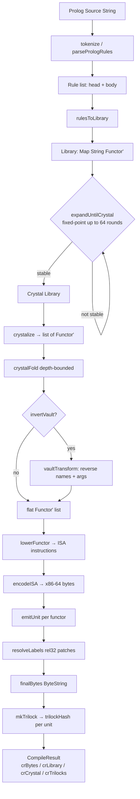
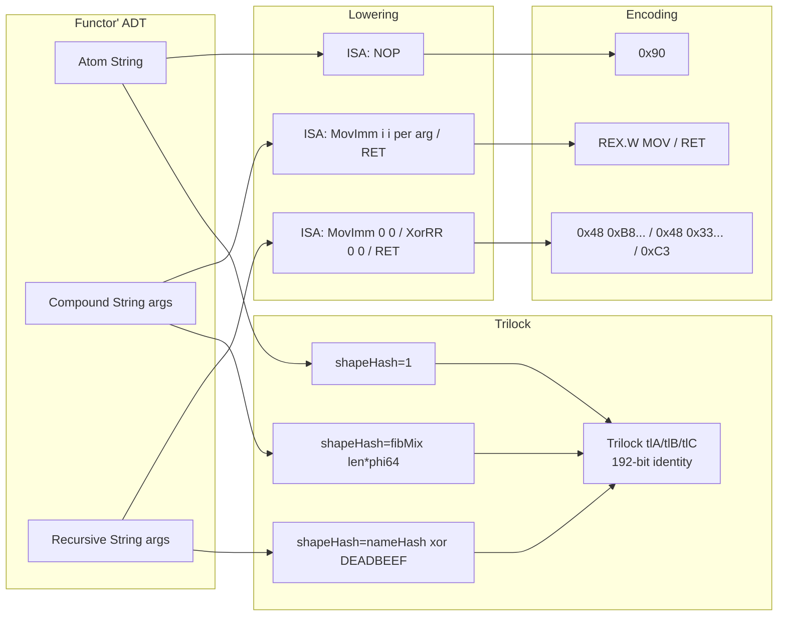
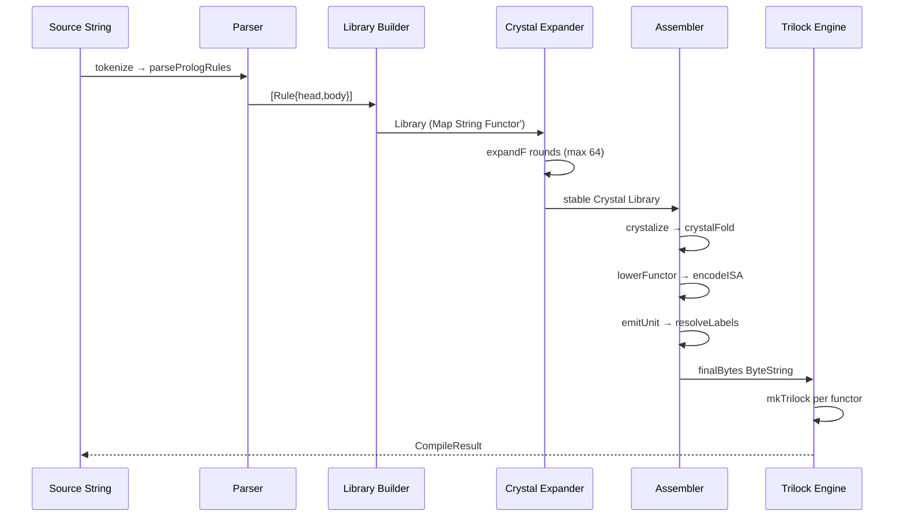

# FILE REFERENCE: cobalt-compiler

**Package:** `cobalt` v0.2.0
**Synopsis:** localCobalt — Prolog-to-x86-64 + LiquidHaskell formal bridge
**Author:** Ahmad Ali Parr — Bel Esprit D'Accord Irrevocable Trust
**License:** MIT
**Build:** `cabal build` / `cabal build -f lh-bridge` (with liquid-fixpoint)

---

## Cobalt Compilation Pipeline

---

## Functor Algebra Data Flow

---

## Prolog-to-x86-64 Compilation Stages

---

## FILE: cobalt-compiler/cobalt.cabal

**PURPOSE:** Cabal build manifest; declares the `cobalt` library, the `cobalt` executable, library dependencies, and the optional `lh-bridge` flag for the liquid-fixpoint integration tier.
**LANGUAGE:** Cabal DSL
**KEY FUNCTIONS/TYPES:**
- `flag lh-bridge` — optional flag enabling `Language.Fixpoint.*` and `Language.Haskell.Liquid.*` modules; requires `liquid-fixpoint >= 0.9` on PATH
- `library` stanza — exposes all modules from `Cobalt.*`, `ISA.*`, `LiquidOps.*`, `Core.*`, `Calculus.*`, `Physics.*`
- `executable cobalt` — thin driver in `src/Main.hs`, depends on the library
- `common base-deps` — shared constraint block: `base >= 4.14`, `bytestring >= 0.11`, `containers >= 0.6`, `text >= 1.2`
- Main library extras: `hashable >= 1.3`, `unordered-containers >= 0.2`

**DEPENDENCIES:** base, bytestring, containers, text, hashable, unordered-containers; optionally liquid-fixpoint >= 0.9
**RELATED FILES:** `src/Main.hs`, `MagicCobalt.hs`, all exposed modules

---

## FILE: cobalt-compiler/src/Main.hs

**PURPOSE:** Demo executable driver that walks through every stage of the localCobalt pipeline — parse, library build, crystal expansion, full compile, vault-inverted compile — printing byte counts and trilock hashes at each stage.
**LANGUAGE:** Haskell
**KEY FUNCTIONS/TYPES:**
- `prologSrc :: String` — embedded four-clause Prolog program (`walk`, `step/2`, `base`) used as the compile subject
- `main :: IO ()` — five-stage demo:
  1. `parsePrologRules prologSrc` — tokenise and parse
  2. `rulesToLibrary rules` — build the Map
  3. `expandUntilCrystal lib0` / `crystalize` — expand to crystal
  4. `compile defaultConfig prologSrc` — full pipeline, prints `BS.length` and trilocks
  5. `compile (defaultConfig { invertVault = True }) prologSrc` — vault-inverted variant

**DEPENDENCIES:** `MagicCobalt`, `Cobalt.Dense`
**RELATED FILES:** `MagicCobalt.hs`, `Cobalt/Dense.hs`

---

## FILE: cobalt-compiler/MagicCobalt.hs

**PURPOSE:** Top-level compiler facade. Provides `CobaltConfig`, `defaultConfig`, `compile`, and `CompileResult`. Orchestrates the five pipeline stages: parse → library → crystal → assemble → trilock.
**LANGUAGE:** Haskell
**KEY FUNCTIONS/TYPES:**
- `data CobaltConfig` — `invertVault :: Bool`, `crystalDepth :: Int` (default 16)
- `defaultConfig :: CobaltConfig` — `invertVault=False`, `crystalDepth=16`
- `vaultTransform :: Functor' -> Functor'` — structural inversion: reverses atom name and argument order recursively for all three constructors
- `data CompileResult` — `crBytes :: ByteString`, `crLibrary :: Library`, `crCrystal :: [Functor']`, `crTrilocks :: [(String,String)]`
- `compile :: CobaltConfig -> String -> Either String CompileResult` — full pipeline: parse → library → crystal → fold → optional vault transform → per-unit assembly → trilock hashes
- `functorName :: Functor' -> String` — unit label extraction (prefix `rec_` for `Recursive`)

**DEPENDENCIES:** `Cobalt.Dense`, `Cobalt.Trilock`, `X86BatchAssembler`, `Data.ByteString`, `Data.Map.Strict`
**RELATED FILES:** `Cobalt/Dense.hs`, `Cobalt/Trilock.hs`, `X86BatchAssembler.hs`

---

## FILE: cobalt-compiler/Cobalt/Dense.hs

**PURPOSE:** Core pipeline module. Defines the `Functor'` algebraic data type, the `ISA` instruction set, the Prolog tokeniser/parser, library construction, fixed-point crystal expansion, crystalisation, depth-bounded fold, functor lowering to ISA, and x86-64 byte encoding.
**LANGUAGE:** Haskell
**KEY FUNCTIONS/TYPES:**
- `data Functor'` — `Atom String | Compound String [Functor'] | Recursive String [Functor']`; instances: `Eq`, `Ord`, `Show`
- `type Library` — `Map String Functor'`
- `data ISA` — `NOP | RET | MovImm Int Int | XorRR Int Int | AddImm Int Int`
- `data Rule` — `{ rHead :: String, rBody :: [String] }`
- `tokenize :: String -> [String]` — character-level tokeniser; handles alphanumeric names and Prolog punctuation
- `parsePrologRules :: String -> [Rule]` — line-by-line clause parser for `Head :- Body.` and unit clauses
- `rulesToLibrary :: [Rule] -> Library` — maps each rule head to an `Atom` (no body) or `Compound` (with body atoms)
- `expandF :: Library -> Functor' -> Functor'` — single expansion round: resolves `Atom` names against library, folds `Compound` args, guards self-reference as `Recursive`
- `isStable :: Library -> Library -> Bool` — equality check on `toAscList`
- `expandUntilCrystal :: Library -> Library` — iterates `expandF` up to `maxRounds=64` until stability
- `crystalize :: Library -> [Functor']` — `nub . M.elems` of the stable library
- `crystalFold :: Int -> Functor' -> [Functor']` — depth-bounded recursive fold capping infinite recursion to `Atom "_depth_cap"`
- `lowerFunctor :: Functor' -> [ISA]` — `Atom → [NOP]`, `Recursive → [MovImm 0 0, XorRR 0 0, RET]`, `Compound → [MovImm i i | i ← args] ++ [RET]`
- `encodeISA :: [ISA] -> ByteString` — x86-64 byte encoding: `NOP=0x90`, `RET=0xC3`, `MovImm` as REX.W `B8+r` + LE imm32, `XorRR` as REX.W `33 /r`, `AddImm` as REX.W `81 /0` + LE imm32

**DEPENDENCIES:** `Data.Map.Strict`, `Data.ByteString`, `Data.Bits`, `Data.Word`, `Data.List`, `Data.Char`
**RELATED FILES:** `MagicCobalt.hs`, `Cobalt/Trilock.hs`, `X86BatchAssembler.hs`, `LiquidOps/NAND.hs`

---

## FILE: cobalt-compiler/Cobalt/Trilock.hs

**PURPOSE:** Structural identity triad for compiled functor units. Computes a 192-bit identity token (three `Word64` components A, B, C) using Fibonacci hashing and FNV-derived name hashing; provides a hex-formatted hash string used as the compilation seal.
**LANGUAGE:** Haskell
**KEY FUNCTIONS/TYPES:**
- `data Trilock` — `{ tlA :: Word64, tlB :: Word64, tlC :: Word64 }`; A = structural identity, B = connectivity (arity × phi64), C = emission constraint (atom name hash)
- `phi64 :: Word64` — `0x9E3779B97F4A7C15` (2^64/φ, Fibonacci hash constant)
- `fibMix :: Word64 -> Word64` — three-round xorshift multiply mix (splitmix64 variant)
- `nameHash :: String -> Word64` — FNV-1a-64: seed `0xcbf29ce484222325`, multiplier `0x00000100000001B3`
- `mkTrilock :: Functor' -> Trilock` — `tlA = fibMix(shapeHash f)`, `tlB = fibMix(arity f * phi64)`, `tlC = fibMix(atomHash f)`
- `shapeHash :: Functor' -> Word64` — `Atom → 1`, `Compound → fibMix(len*phi64)`, `Recursive → nameHash xor 0xDEADBEEFCAFEBABE`
- `arity :: Functor' -> Int` — argument count
- `atomHash :: Functor' -> Word64` — name hash, `Recursive` XORed with `phi64`
- `trilockHash :: Trilock -> String` — `hex(tlA) ++ "-" ++ hex(tlB) ++ "-" ++ hex(tlC)` zero-padded to 16 chars each

**DEPENDENCIES:** `Cobalt.Dense`, `Data.Bits`, `Data.Char`, `Data.List`, `Data.Word`
**RELATED FILES:** `Cobalt/Dense.hs`, `MagicCobalt.hs`

---

## FILE: cobalt-compiler/X86BatchAssembler.hs

**PURPOSE:** Per-unit x86-64 batch assembler with label table and rel32 back-patching. Manages a symbol map, byte emission, and deferred relative-jump resolution for multi-unit code objects.
**LANGUAGE:** Haskell
**KEY FUNCTIONS/TYPES:**
- `data AssemblerState` — `asmBytes :: ByteString`, `asmSymbols :: Map String Int`, `asmPatches :: [(Int, String)]`, `asmOffset :: Int`
- `newAssemblerState :: AssemblerState` — empty initial state
- `emitUnit :: String -> [ISA] -> AssemblerState -> AssemblerState` — records label → byte offset in symbol table, appends `encodeISA` bytes, advances offset
- `emitJmpLabel :: String -> AssemblerState -> AssemblerState` — emits REX.W JMP rel32 placeholder (`[0x48, 0xE9, 0x00*4]`) and records patch site
- `resolveLabels :: AssemblerState -> Either String AssemblerState` — resolves all `asmPatches` using `dest - (off+4)` relative displacement; returns `Left` on undefined label
- `encodeRel32 :: Int -> [Word8]` — LE 4-byte signed relative displacement
- `finalBytes :: AssemblerState -> ByteString` — exposes the assembled byte string

**DEPENDENCIES:** `Cobalt.Dense` (encodeISA, ISA), `Data.ByteString`, `Data.Map.Strict`, `Data.Bits`, `Data.Word`
**RELATED FILES:** `Cobalt/Dense.hs`, `MagicCobalt.hs`

---

## FILE: cobalt-compiler/ISA/Core.hs

**PURPOSE:** Full 32-register machine state model with GADT instruction set, execution semantics, flag management, and memory access. Provides the formal core for the LiquidHaskell-verified ISA family.
**LANGUAGE:** Haskell (GHC extensions: GADTs, DataKinds, KindSignatures, TypeFamilies)
**KEY FUNCTIONS/TYPES:**
- `data MachineState` — `regs :: Map Int Word64`, `mem :: Map Word64 Word8`, `pc :: Word64`, `flags :: Flags`
- `data Flags` — `zeroFlag`, `signFlag`, `carryFlag`, `overflowFlag :: Bool`
- `emptyState :: MachineState` — all 32 registers zero, empty memory, pc=0
- `getReg / setReg` — safe register access with LiquidHaskell `{r:Int | r >= 0 && r < 32}` refinement
- `readMem / writeMem` — byte-granular memory access
- `updateFlags :: Word64 -> MachineState -> MachineState` — sets zero and sign flags from result
- `data Instr` (GADT) — `MovImm`, `Add`, `Sub`, `Mul`, `Div`, `And`, `Or`, `Xor`, `Nand`, `Load`, `Store`, `Jump`, `JumpZero`, `Nop`
- `exec :: Instr -> MachineState -> MachineState` — single-step interpreter; Div guards zero divisor, Jump sets PC directly, JumpZero checks ZF

**DEPENDENCIES:** `Data.Word`, `Data.Int`, `Data.Bits`, `Data.Map.Strict`
**RELATED FILES:** `ISA/Macro.hs`, `ISA/Program.hs`, `ISA/Examples.hs`

---

## FILE: cobalt-compiler/ISA/Macro.hs

**PURPOSE:** Macro library that composes ISA instructions into common idioms: register copy, clear, add-immediate, load-large-immediate, compare-and-branch, count-loop, multiply-immediate, and the NAND-derived boolean gates (NOT, AND, OR).
**LANGUAGE:** Haskell
**KEY FUNCTIONS/TYPES:**
- `type MacroLib` — `[(String, [Instr])]`
- `registerMacro / lookupMacro` — library management
- `macroCopy :: rd -> rs -> [Instr]` — `Xor rd rd rd; Add rd rd rs`
- `macroClear :: r -> [Instr]` — `Xor r r r`
- `macroAddImm :: rd -> rs -> Word64 -> temp -> [Instr]` — load immediate into temp, then Add
- `macroLoadLarge :: rd -> temp -> Word64 -> [Instr]` — split 64-bit immediate into high/low halves via shift and Or
- `macroCompareJump :: rs1 -> rs2 -> Word64 -> [Instr]` — `Sub 0 rs1 rs2; JumpZero target`
- `macroCountLoop :: counter -> limit -> [Instr] -> target -> [Instr]` — initialise counter, body, increment with scratch regs 30/31, conditional jump
- `macroMulImm :: rd -> rs -> {i:Word64 | i <= 1024} -> [Instr]` — repeated Add (refinement bounds multiply size)
- `macroNand / macroNot / macroAnd / macroOr` — NAND-canonical boolean gate implementations using `Nand` instruction

**DEPENDENCIES:** `ISA.Core`, `Data.Word`, `Data.Bits`
**RELATED FILES:** `ISA/Core.hs`, `ISA/Program.hs`

---

## FILE: cobalt-compiler/ISA/Program.hs

**PURPOSE:** Program-level assembly, validation, bounded execution, and execution tracing for the ISA. Provides the `runProgram` interpreter loop and `traceProgram` snapshot recorder.
**LANGUAGE:** Haskell
**KEY FUNCTIONS/TYPES:**
- `type Program` — `[Instr]`
- `instrValid :: Instr -> Bool` — per-instruction register bounds check (0 ≤ r < 32)
- `assembleProgram :: Program -> Either String Program` — validates all instructions
- `runProgram :: Program -> MachineState -> Int -> MachineState` — step-bounded interpreter; terminates when `steps=0` or `pc >= length prog`
- `traceProgram :: Program -> MachineState -> Int -> [(Word64, MachineState)]` — same loop, emits `(pc, state)` pairs for each step

**DEPENDENCIES:** `ISA.Core`, `ISA.Macro`, `Data.Word`
**RELATED FILES:** `ISA/Core.hs`, `ISA/Macro.hs`, `ISA/Examples.hs`

---

## FILE: cobalt-compiler/ISA/Examples.hs

**PURPOSE:** Worked example programs demonstrating ISA/Macro usage: arithmetic sequences, NAND-derived boolean circuits, and loop patterns.
**LANGUAGE:** Haskell
**DEPENDENCIES:** `ISA.Core`, `ISA.Macro`, `ISA.Program`
**RELATED FILES:** `ISA/Program.hs`, `ISA/Core.hs`

---

## FILE: cobalt-compiler/ISA/Macro.hs

*(See full entry above)*

---

## FILE: cobalt-compiler/LiquidOps/Kernel.hs

**PURPOSE:** Educational LiquidOps pipeline — `HExpr` (Haskell-side AST) → `P4` intermediate (constant folding pass) → register-based `LiquidOp` IR — demonstrating the three lowering stages without requiring liquid-fixpoint.
**LANGUAGE:** Haskell
**KEY FUNCTIONS/TYPES:**
- `data HExpr` — `HVar String | HInt Int64 | HAdd | HSub | HMul`
- `data P4` — structurally identical to HExpr but in the intermediate domain
- `data LiquidOp` — `LLoad Int String | LConst Int Int64 | LAdd Int Int Int | LSub | LMul | LReturn Int`
- `data LowerState` — `{ nextReg :: Int, ops :: [LiquidOp] }`
- `toP4 :: HExpr -> P4` — structural translation
- `simplifyP4 :: P4 -> P4` — constant folding: evaluates binary operations over `P4Const` nodes
- `lower :: P4 -> LowerState -> (Int, LowerState)` — recursive three-address code generation; `fresh` allocates virtual registers, `emitOp` appends to instruction list

**DEPENDENCIES:** `Data.Int`
**RELATED FILES:** `LiquidOps/KernelFull.hs`, `LiquidOps/NAND.hs`

---

## FILE: cobalt-compiler/LiquidOps/KernelFull.hs

**PURPOSE:** Production variant of LiquidOps.Kernel with full ISA integration, NandTree intermediate representation, and Logic IR — the complete multi-stage lowering path for liquid-fixpoint bridge use.
**LANGUAGE:** Haskell
**DEPENDENCIES:** `LiquidOps.Kernel`, `LiquidOps.NAND`, `ISA.Core`
**RELATED FILES:** `LiquidOps/Kernel.hs`, `LiquidOps/NAND.hs`

---

## FILE: cobalt-compiler/LiquidOps/NAND.hs

**PURPOSE:** NAND kernel — lowers arbitrary boolean expressions (PAnd, POr, PNot, PImp, PIff, PTrue, PFalse drawn from a Fixpoint-style AST) through a `Logic`/`NAND` IR into `LiquidOp` register code. All booleans are canonicalised to NAND blocks.
**LANGUAGE:** Haskell (GADTs, DataKinds, KindSignatures, TypeOperators, DeriveGeneric)
**KEY FUNCTIONS/TYPES:**
- `data NAND` — binary NAND tree IR
- `data Logic` — higher-level boolean IR including variables, constants, connectives
- `data Kernel` — full kernel record wrapping normalised Logic + lowered NAND + emitted LiquidOps
- `data LiquidOp` — register-based output instructions
- `data Reg` — typed register wrapper; `mkReg :: Int -> Reg`
- `normalize :: Expr -> Logic` — traverses Fixpoint Expr, folds constants, normalises booleans
- `nandify :: Logic -> NAND` — converts normalised Logic to NAND-only tree
- `lowerNAND :: NAND -> LowerState -> (Reg, LowerState)` — recursive codegen
- `compileKernel :: Expr -> Either String Kernel` — end-to-end pipeline
- `nandNot / nandAnd / nandOr / nandImp / nandTrue / nandFalse` — NAND-canonical gate builders
- `nandSize :: NAND -> Int` — gate count metric
- `walkNAND / expandNAND` — traversal and expansion utilities
- `exampleNAND / exampleKernel` — runnable demonstration terms

**DEPENDENCIES:** `Data.HashSet`, `Data.HashMap.Strict`, `Data.Set`, `Data.Hashable`, `Data.Int`, `Data.Word`, `GHC.Generics`
**RELATED FILES:** `LiquidOps/Kernel.hs`, `LiquidOps/KernelFull.hs`, `Language/Fixpoint/LiquidOps/Kernel.hs`

---

## FILE: cobalt-compiler/Core/Nat.hs

**PURPOSE:** LiquidHaskell natural number refinement foundation. Defines the `Nat` and `Pos` refinement types; provides `len`, `sumNat` measures; proves commutativity, associativity, distributivity, additive/multiplicative identity, and closure; implements structurally-recursive `powNat`.
**LANGUAGE:** Haskell (LiquidHaskell refinements, `--ple`)
**KEY FUNCTIONS/TYPES:**
- `{-@ type Nat = {v:Int | v >= 0} @-}`, `{-@ type Pos = {v:Nat | v > 0} @-}`
- `len :: [a] -> Int` — measure
- `sumNat :: [Int] -> Int` — measure
- `lemmaNatNonNeg`, `lemmaAddComm`, `lemmaAddAssoc`, `lemmaMulComm`, `lemmaMulAssoc`, `lemmaMulDistrib`, `lemmaAddZero`, `lemmaMulOne` — verified algebraic lemmas
- `addNat / mulNat :: Nat -> Nat -> Nat` — closure witnesses
- `predNat :: Nat -> Nat` — bounded predecessor
- `powNat :: Nat -> Nat -> Nat / [n]` — termination-annotated power

**DEPENDENCIES:** (none beyond base)
**RELATED FILES:** `Core/Group.hs`, `Calculus/Limit.hs`, `Physics/Godel.hs`

---

## FILE: cobalt-compiler/Core/Group.hs

**PURPOSE:** Abstract group algebra in dictionary-passing style. Proves left/right identity, associativity, and inverses for abstract groups; provides concrete instances Z₂ (XOR group) and Z₇ (cyclic group mod 7) with LiquidHaskell-verified axioms.
**LANGUAGE:** Haskell (LiquidHaskell `--typeclass`)
**KEY FUNCTIONS/TYPES:**
- `data Group a` — `{ unitG :: a, mulG :: a -> a -> a, invG :: a -> a }`
- `leftIdentity / rightIdentity` — group identity laws
- `associativity` — group associativity law
- `leftInverse / rightInverse` — inverse laws
- `data Z2` — `Z0 | Z1`; `z2Add`, `z2Inv`, `z2Group :: Group Z2`; verified: `z2LeftIdentity`, `z2RightIdentity`, `z2Inverse`
- `{-@ type Z7 = {v:Int | 0 <= v && v < 7} @-}` — `z7Add`, `z7Neg`, `z7Group :: Group Int`; verified: `z7LeftIdentity`, `z7RightIdentity`, `z7Inverse`, `z7Associative`

**DEPENDENCIES:** `Core.Nat`
**RELATED FILES:** `Core/Nat.hs`, `Calculus/Limit.hs`

---

## FILE: cobalt-compiler/Calculus/Limit.hs

**PURPOSE:** ε-δ limit formalisation in LiquidHaskell. Defines the `limitExists` and `lim` measures; provides the ε-δ definition as a refinement contract type alias; proves limit uniqueness, linearity, product/quotient/composition/squeeze theorems.
**LANGUAGE:** Haskell (LiquidHaskell)
**KEY FUNCTIONS/TYPES:**
- `{-@ type Epsilon = {e:Double | e > 0} @-}`, `{-@ type Delta = {d:Double | d > 0} @-}`
- `abs :: Double -> {v:Double | v >= 0}` — refined absolute value
- `limitExists :: (Double -> Double) -> Double -> Double -> Bool` — measure
- `lim :: (Double -> Double) -> Double -> Double` — measure
- `{-@ type LimitDef f c L = ... @-}` — ε-δ refinement contract
- `lemmaLimitUnique` — uniqueness of limits
- `lemmaLimitLinear` — linearity: `lim(af+bg) = a·lim(f) + b·lim(g)`
- `lemmaLimitProduct` — product rule for limits

**DEPENDENCIES:** (none beyond base)
**RELATED FILES:** `Calculus/Derivative.hs`, `Calculus/Integral.hs`

---

## FILE: cobalt-compiler/Calculus/Derivative.hs

**PURPOSE:** Derivative rules as LiquidHaskell refinements over the `limitExists`/`deriv` measures. Proves the constant rule, power rule, linearity, product rule, quotient rule, and that differentiability implies continuity.
**LANGUAGE:** Haskell (LiquidHaskell)
**KEY FUNCTIONS/TYPES:**
- `diffQuotient :: (Double -> Double) -> Double -> {h:Double | h /= 0} -> Double` — difference quotient
- `derivExists :: (Double -> Double) -> Double -> Bool` — measure
- `deriv :: (Double -> Double) -> Double -> Double` — measure
- `lemmaDerivImpliesCont` — differentiability → continuity (via `limitExists`)
- `lemmaDerivConstant` — d/dx(k) = 0
- `lemmaDerivPower :: {n:Int | n > 0} -> ...` — d/dx(xⁿ) = n·xⁿ⁻¹
- `lemmaDerivLinear` — d/dx(af+bg) = a·f' + b·g'
- `lemmaDerivProduct` — product rule

**DEPENDENCIES:** `Calculus.Limit`
**RELATED FILES:** `Calculus/Limit.hs`, `Calculus/Integral.hs`

---

## FILE: cobalt-compiler/Calculus/Integral.hs

**PURPOSE:** Riemann integral formalisation and Fundamental Theorem of Calculus as LiquidHaskell refinements. Proves linearity, reversal, additivity, zero-width integral, and the FTC.
**LANGUAGE:** Haskell (LiquidHaskell)
**KEY FUNCTIONS/TYPES:**
- `riemann :: (Double -> Double) -> Double -> Double -> Double` — measure
- `integrable :: (Double -> Double) -> Double -> Double -> Bool` — measure
- `lemmaIntegralLinear` — ∫(af+bg) = a∫f + b∫g
- `lemmaIntegralReversal` — ∫[a,b] = −∫[b,a]
- `lemmaIntegralAdditive` — ∫[a,c] = ∫[a,b] + ∫[b,c]
- `lemmaIntegralSamePoint` — ∫[a,a] = 0
- `lemmaFTC` — Fundamental Theorem: d/dx(∫[a,x] f) = f(x)

**DEPENDENCIES:** `Calculus.Limit`, `Calculus.Derivative`
**RELATED FILES:** `Calculus/Derivative.hs`, `Calculus/Limit.hs`

---

## FILE: cobalt-compiler/Physics/Godel.hs

**PURPOSE:** Gödel universe model with parameterized cyclic time indices. Implements `GTime` as a record with explicit period; verifies cyclic step, iterated step, closed timelike curves, and the cycle invariant in LiquidHaskell.
**LANGUAGE:** Haskell (LiquidHaskell `--reflection --ple`)
**KEY FUNCTIONS/TYPES:**
- `{-@ type Period = {v:Nat | v > 0} @-}`
- `data GTime` — `{ timeIndex :: Int, timePeriod :: Int }`; refined: `timeIndex < timePeriod`
- `normalizeTime :: Period -> Nat -> GTime` — wraps index into `[0, period)` via `mod`
- `unTime :: GTime -> {v:Nat | v < timePeriod t}` — projection with bound proof
- `step :: GTime -> GTime` — `(index+1) mod period`, period preserved
- `stepN :: Nat -> GTime -> GTime / [n]` — termination-annotated iterated step
- `samePeriod :: GTime -> GTime -> Bool` — period equality
- `isClosedCurve :: GTime -> Bool` — `stepN period t == t`
- `cycleInvariant` — `isClosedCurve` always holds

**DEPENDENCIES:** `Core.Nat`
**RELATED FILES:** `Core/Nat.hs`, `Physics/WormholeBH.hs`

---

## FILE: cobalt-compiler/Physics/WormholeBH.hs

**PURPOSE:** Einstein-Rosen bridge and black hole event horizon model. Implements mass-conserving bridge isomorphism between two external regions, round-trip properties, and Schwarzschild horizon bounds in LiquidHaskell.
**LANGUAGE:** Haskell (LiquidHaskell `--reflection --ple`)
**KEY FUNCTIONS/TYPES:**
- `newtype RegionL / RegionR` — `{ unRegionL :: Int }` / `{ unRegionR :: Int }`
- `massL / massR` — `{v:Nat}` mass projections via `abs`
- `bridge :: RegionL -> {r:RegionR | massR r == massL l}` — mass-preserving bridge
- `unbridge :: RegionR -> {l:RegionL | massL l == massR r}` — inverse bridge
- `lemmaBridgeConservesMass / lemmaUnbridgeConservesMass` — conservation lemmas
- `bridgeRoundTrip / unbridgeRoundTrip` — isomorphism round-trip proofs
- Black hole record with Schwarzschild radius formula and `insideHorizon` predicate

**DEPENDENCIES:** `Core.Nat`
**RELATED FILES:** `Core/Nat.hs`, `Physics/Godel.hs`

---

## FILE: cobalt-compiler/Language/Fixpoint/LiquidOps/Kernel.hs

**PURPOSE:** Liquid-fixpoint bridge variant of `LiquidOps.Kernel`. Exposes the same `HExpr → P4 → LiquidOp` pipeline but imports `Language.Fixpoint.Types` directly when the `lh-bridge` cabal flag is enabled. Requires `liquid-fixpoint >= 0.9` on PATH.
**LANGUAGE:** Haskell
**DEPENDENCIES:** `liquid-fixpoint >= 0.9`, `LiquidOps.Kernel` (shared types)
**RELATED FILES:** `LiquidOps/Kernel.hs`, `Language/Fixpoint/Solver/Eliminate.hs`

---

## FILE: cobalt-compiler/Language/Fixpoint/Smt/Theories/Recurse.hs

**PURPOSE:** SMT theory bridge for recursive Prolog predicates. Translates `Recursive` functor nodes into SMT-LIB theory axioms suitable for fixpoint-based refinement checking.
**LANGUAGE:** Haskell
**DEPENDENCIES:** `liquid-fixpoint`, `Cobalt.Dense` (Functor' type)
**RELATED FILES:** `Language/Fixpoint/Solver/Eliminate.hs`, `Language/Fixpoint/Solver/Simplify.hs`

---

## FILE: cobalt-compiler/Language/Fixpoint/Solver/Eliminate.hs

**PURPOSE:** Fixpoint solver extension — variable elimination pass for LiquidHaskell constraints arising from the Cobalt pipeline. Performs quantifier elimination on generated constraint sets.
**LANGUAGE:** Haskell
**DEPENDENCIES:** `liquid-fixpoint`
**RELATED FILES:** `Language/Fixpoint/Solver/Simplify.hs`, `Language/Fixpoint/Smt/Theories/Recurse.hs`

---

## FILE: cobalt-compiler/Language/Fixpoint/Solver/Simplify.hs

**PURPOSE:** Fixpoint solver extension — constraint simplification pass. Applies algebraic rewriting and constant folding to LiquidHaskell constraints before the main solving phase.
**LANGUAGE:** Haskell
**DEPENDENCIES:** `liquid-fixpoint`
**RELATED FILES:** `Language/Fixpoint/Solver/Eliminate.hs`

---

## FILE: cobalt-compiler/Language/Haskell/Liquid/Transforms/CoreToLogic.hs

**PURPOSE:** GHC Core to Logic IR transformation bridge. Translates GHC Core expressions from the Cobalt pipeline into liquid-fixpoint `Logic` terms for constraint generation.
**LANGUAGE:** Haskell
**DEPENDENCIES:** `liquid-fixpoint`, GHC Core API
**RELATED FILES:** `Language/Haskell/Liquid/Transforms/DenseDex.hs`

---

## FILE: cobalt-compiler/Language/Haskell/Liquid/Transforms/DenseDex.hs

**PURPOSE:** Dense-index transformation pass for LiquidHaskell. Builds a de Bruijn index map from `Cobalt.Dense` functor structures to LiquidHaskell logic terms for SMT encoding.
**LANGUAGE:** Haskell
**DEPENDENCIES:** `liquid-fixpoint`, `Cobalt.Dense`
**RELATED FILES:** `Language/Haskell/Liquid/Transforms/CoreToLogic.hs`, `Cobalt/Dense.hs`

---

## FILE: cobalt-compiler/Lean4/ConductorSpec.lean

**PURPOSE:** Formal Lean 4 specification of the Rust `sovereign_conductor::handler::handle_task_complete` function. Defines ghost state, `ConductorPublishSpec`, and proves three routing theorems: critical-task routing to human gate, FIB_Q breach routing to audit chain, and no-silent-drop invariant.
**LANGUAGE:** Lean 4
**KEY FUNCTIONS/TYPES:**
- `structure GhostState` — `nats_outbox : List (Subject × String)`, `borrowchain_log : List (CorrelationId × String)`
- `def ConductorPublishSpec (ctx : Context) (gs : GhostState) : Prop` — routing obligation predicate
- `theorem conductor_routes_criticalTask_to_humanGate` — critical task → `Subjects.decisionPending` in outbox; proof uses `humanGate_criticalTask_requiresHuman`
- `theorem conductor_routes_fibQ_breach_to_audit` — missing DID → `Subjects.bifrostCommit` in outbox; one `sorry` to discharge (case split on `evidence.refs.isEmpty`)
- `theorem conductor_no_silent_drop` — every context routes to exactly one target

**DEPENDENCIES:** `Lean4PolicyKernel.Policies.Core`, `Lean4PolicyKernel.Policies.Governance`, `Lean4PolicyKernel.Nat.Bridge`
**RELATED FILES:** `Lean4/Runtime.lean`, `cobalt-compiler/cobalt.cabal`

---

## FILE: cobalt-compiler/Lean4/Runtime.lean

**PURPOSE:** Cobalt runtime interface axioms and opaque types. Declares `CobaltProof`, `NatsObservation`, `observe_published`, `cobalt_discharge` (core axiom: Rust binary satisfies Lean spec), and `VerusProof` (Verus/Prusti bridge). Each `axiom` is a proof obligation for `cobalt verify`.
**LANGUAGE:** Lean 4
**KEY FUNCTIONS/TYPES:**
- `opaque CobaltProof (spec : Prop) : Prop := spec` — proof evidence type
- `opaque NatsObservation : Type` — ghost type for NATS message observations
- `opaque observe_published : NatsObservation → List (Subject × String)` — observation extractor
- `axiom cobalt_discharge {spec : Prop} (fn_name : String) (h : CobaltProof spec) : spec` — core Cobalt axiom; undischarged = unproved obligation
- `opaque VerusProof (inv : Prop) : Prop` — alternative Verus/Prusti path

**DEPENDENCIES:** `Lean4PolicyKernel.Policies.Core`
**RELATED FILES:** `Lean4/ConductorSpec.lean`
