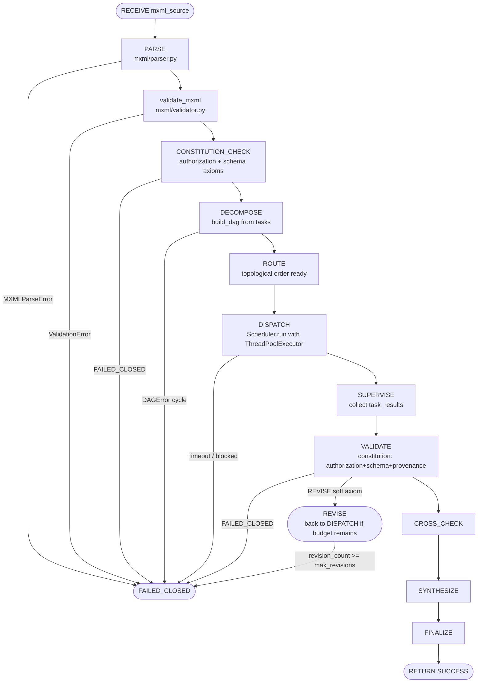
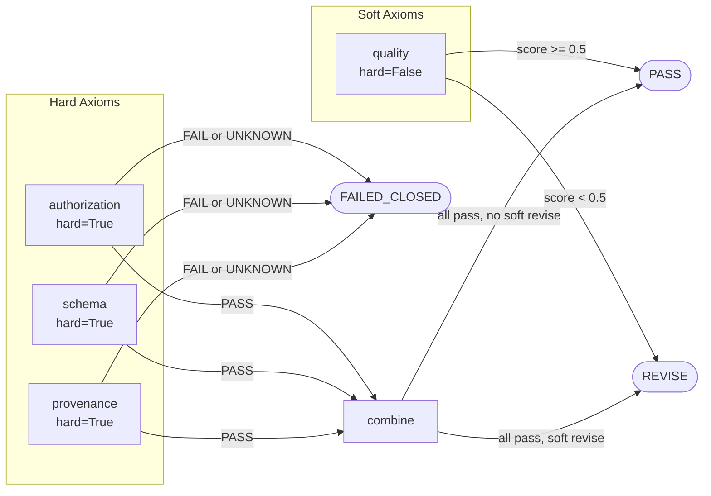

# Constraint Harness — File Reference

**Directory:** `constraint-harness/`
**License:** SL-AGPL3-001, Covenant-Version 1.0
**Language:** Python 3.12
**Entry point:** `constraint_harness/cli.py`

---

## MXML Contract Structure

An MXML document is the top-level contract that drives every execution. Its
canonical on-disk form is XML; after parsing it becomes an immutable frozen
dataclass tree:

```xml
<?xml version="1.0"?>
<mxml version="1.0">
  <runtime id="basic-example">
    <limits>
      <max_workers>4</max_workers>
      <max_revisions>2</max_revisions>
      <timeout_seconds>30</timeout_seconds>
      <!-- max_tasks defaults to 256; max_tool_calls defaults to 64 -->
    </limits>
    <constitution>
      <axiom ref="authorization"/>
      <axiom ref="schema"/>
      <axiom ref="provenance"/>
    </constitution>
    <commands>
      <command id="py" type="python" isolation="process"/>
    </commands>
    <tasks>
      <task id="t1" command="py" depends_on="t0">
        <input><code>print(2 + 2)</code></input>
      </task>
    </tasks>
  </runtime>
</mxml>
```

Object hierarchy after parsing:

```
MXMLDocument
  version: str
  raw_hash: str                   # SHA-256 of raw XML source, first 32 hex chars
  runtime: RuntimeConfig
    id: str
    limits: Limits                # max_workers, max_revisions, timeout_seconds,
                                  # max_tasks, max_tool_calls
    axioms: tuple[str, ...]       # ordered axiom refs from <constitution>
    commands: tuple[CommandDecl]  # each: id, type, isolation, version
    tasks: tuple[TaskDecl]        # each: id, command, depends_on, input, revision_limit
```

---

## 8-Layer Constraint Evaluation Flowchart



Each arrow that terminates at `FAILED_CLOSED` is irreversible. The state
machine enforces legality via `LEGAL_TRANSITIONS` before recording the audit
event and changing state.

---

## Constitutional Axiom Precedence Diagram



Precedence rule encoded in `evaluate_constitution`:
`FAILED_CLOSED > REVISE > PASS`. A single hard `FAIL` or `UNKNOWN` result
short-circuits all soft axioms.

---

## FILE: constraint-harness/mxml/schema.py

**PURPOSE:** Defines the immutable dataclass schema for parsed MXML documents.
All classes are `frozen=True` — mutation after construction raises `FrozenInstanceError`.

**KEY CLASSES/FUNCTIONS:**
- `Limits` — resource ceiling dataclass: `max_workers`, `max_revisions`, `timeout_seconds`, `max_tasks=256`, `max_tool_calls=64`
- `CommandDecl` — single command declaration: `id`, `type`, `isolation` (`none`|`process`), `version`
- `TaskDecl` — task node: `id`, `command`, `depends_on: tuple[str]`, `input: dict`, `revision_limit: int|None`
- `RuntimeConfig` — container for a complete runtime block: holds `Limits`, `axioms`, `commands`, `tasks`
- `MXMLDocument` — root document object with `version`, `runtime`, `raw_hash`

**STATE MANAGED:** No mutable state. All instances are frozen dataclasses.

**INPUTS/OUTPUTS:** No I/O. Pure data type definitions consumed by `mxml/parser.py` and `runtime/context.py`.

**DEPENDENCIES:** `dataclasses`, `typing`

---

## FILE: constraint-harness/mxml/parser.py

**PURPOSE:** Strict XML-to-dataclass parser for MXML contracts. Raises `MXMLParseError` on any
malformation. Never silently repairs or supplies defaults for required fields.

**KEY CLASSES/FUNCTIONS:**
- `MXMLParseError(Exception)` — carries `.path` (XPath-style location string) and message
- `parse_mxml(source: str) -> MXMLDocument` — top-level entry point; parses XML, validates structure, returns frozen document; computes `raw_hash` as `sha256(source.encode())[:32]`
- `_require_child(parent, tag, path)` — raises `MXMLParseError` if child element missing
- `_require_attr(elem, name, path)` — raises if attribute absent or empty
- `_parse_int(text, path, name)` — rejects negative values and non-integer strings
- `_parse_limits(elem, path) -> Limits` — builds `Limits`; `max_tasks` defaults to 256, `max_tool_calls` to 64
- `_parse_commands(elem, path) -> tuple[CommandDecl]` — enforces uniqueness of `id`; validates `isolation` is `none` or `process`; requires at least one command
- `_parse_tasks(elem, path) -> tuple[TaskDecl]` — enforces uniqueness of task `id`; parses `depends_on` as comma-separated list; requires at least one task

**STATE MANAGED:** Stateless. Each call is independent.

**INPUTS/OUTPUTS:**
- In: raw XML string
- Out: `MXMLDocument` or raises `MXMLParseError`

**DEPENDENCIES:** `hashlib`, `xml.etree.ElementTree`, `mxml.schema`

---

## FILE: constraint-harness/mxml/validator.py

**PURPOSE:** Post-parse structural validation enforcing semantic rules that cannot be
expressed in the XML schema alone.

**KEY CLASSES/FUNCTIONS:**
- `ValidationError(Exception)` — carries `.code` (default `"STRUCTURAL"`)
- `validate_mxml(doc: MXMLDocument) -> None` — raises `ValidationError` if any rule fails:
  - `max_workers >= 1`
  - `max_revisions >= 0`
  - `timeout_seconds >= 1`
  - task count does not exceed `max_tasks`
  - every task's `command` references a declared command `id`
  - no task depends on itself
  - DFS cycle detection on dependency graph (raises on any back-edge)

**STATE MANAGED:** Stateless; all validation is pure function over the document tree.

**INPUTS/OUTPUTS:**
- In: `MXMLDocument`
- Out: `None` on success, `ValidationError` on failure

**DEPENDENCIES:** `mxml.schema`

---

## FILE: constraint-harness/constitution/constitution.py

**PURPOSE:** Core constitutional evaluator. Implements Datalog-style axiom evaluation
over an execution context dict. Hard axioms (`authorization`, `schema`, `provenance`)
override all soft axioms (`quality`).

**KEY CLASSES/FUNCTIONS:**
- `DecisionStatus(str, Enum)` — `PASS`, `FAIL`, `UNKNOWN`, `REVISE`, `FAILED_CLOSED`
- `AxiomResult` — per-axiom verdict dataclass: `name`, `status`, `evidence`, `hard: bool`
- `ConstitutionalDecision` — aggregate decision: `status`, `axiom_results: list[AxiomResult]`, `reason`, `may_revise: bool`
  - `.is_accept() -> bool` — true if `status == PASS`
  - `.is_closed() -> bool` — true if `status == FAILED_CLOSED`
- `evaluate_constitution(context, result=None, requested_axioms=None) -> ConstitutionalDecision`
  — evaluates axioms in order: authorization → schema → provenance → quality (if requested);
  any hard `FAIL` or `UNKNOWN` immediately produces `FAILED_CLOSED`; soft `REVISE` only
  triggers if all hard axioms pass

**STATE MANAGED:** Stateless. Returns a new `ConstitutionalDecision` each call.

**INPUTS/OUTPUTS:**
- In: `context: dict` (must have `agent`, `task_id`, `allowed_tasks`, `authorized`, `schema_valid`, `provenance`, `axioms`); optional `result: dict`; optional `requested_axioms: list[str]`
- Out: `ConstitutionalDecision`

**DEPENDENCIES:** `dataclasses`, `enum`

---

## FILE: constraint-harness/constitution/datalog.py

**PURPOSE:** Declarative Datalog-style specification of constitutional axioms. This file
is documentation and specification — it is not executed at runtime. The actual evaluation
is performed by `constitution/constitution.py`.

**KEY CLASSES/FUNCTIONS:** None (specification file only)

Predicates defined:
- `authorized(Agent, Task) :- allowed(Agent, Task), has_capability(Agent, Task)`
- `valid(Result) :- provenance_complete(Result), not hard_fail(Result)`
- `consistent(A, B) :- same_contract(A, B), equivalent_payload(A, B)`
- Default-closed: absence of positive evidence yields `UNKNOWN`

**STATE MANAGED:** None.

**DEPENDENCIES:** None (plain text Datalog specification)

---

## FILE: constraint-harness/constitution/evaluator.py

**PURPOSE:** Thin re-export shim. Exposes `evaluate_constitution`, `ConstitutionalDecision`,
and `DecisionStatus` as the public API of the `constitution` package.

**KEY CLASSES/FUNCTIONS:** Re-exports from `constitution.constitution`.

**DEPENDENCIES:** `constitution.constitution`

---

## FILE: constraint-harness/runtime/states.py

**PURPOSE:** Enumerates all legal execution states and the complete transition graph.
Encoding legality here means no state machine implementation can accidentally
allow a forbidden transition.

**KEY CLASSES/FUNCTIONS:**
- `State(str, Enum)` — 14 states: `RECEIVE`, `PARSE`, `CONSTITUTION_CHECK`, `DECOMPOSE`, `ROUTE`, `DISPATCH`, `SUPERVISE`, `VALIDATE`, `CROSS_CHECK`, `SYNTHESIZE`, `FINALIZE`, `RETURN`, `REVISE`, `FAILED_CLOSED`
- `LEGAL_TRANSITIONS: dict[State, frozenset[State]]` — complete transition graph:
  - `RECEIVE → {PARSE, FAILED_CLOSED}`
  - `PARSE → {CONSTITUTION_CHECK, FAILED_CLOSED}`
  - `CONSTITUTION_CHECK → {DECOMPOSE, REVISE, FAILED_CLOSED}`
  - `DECOMPOSE → {ROUTE, FAILED_CLOSED}`
  - `ROUTE → {DISPATCH, FAILED_CLOSED}`
  - `DISPATCH → {SUPERVISE, FAILED_CLOSED}`
  - `SUPERVISE → {VALIDATE, FAILED_CLOSED}`
  - `VALIDATE → {CROSS_CHECK, REVISE, FAILED_CLOSED}`
  - `CROSS_CHECK → {SYNTHESIZE, REVISE, FAILED_CLOSED}`
  - `SYNTHESIZE → {FINALIZE, FAILED_CLOSED}`
  - `FINALIZE → {RETURN, FAILED_CLOSED}`
  - `RETURN → {}` (terminal)
  - `REVISE → {CONSTITUTION_CHECK, DISPATCH, FAILED_CLOSED}`
  - `FAILED_CLOSED → {}` (terminal, absorbing)
- `can_transition(from_state, to_state) -> bool`

**STATE MANAGED:** Defines static graph. No instance state.

**DEPENDENCIES:** `enum`

---

## FILE: constraint-harness/runtime/transitions.py

**PURPOSE:** Stateful execution of the legal state machine. Each transition records
a cryptographic audit event carrying a SHA-256 hash of the input payload.

**KEY CLASSES/FUNCTIONS:**
- `AuditEvent` — dataclass: `event_type`, `from_state`, `to_state`, `execution_id`, `task_id`, `input_hash` (first 16 hex chars of SHA-256), `timestamp`, `reason`, `metadata`
- `IllegalTransitionError(Exception)` — raised when `can_transition` returns False
- `StateMachine`
  - `__init__(execution_id=None)` — generates UUID if no id provided; starts at `RECEIVE`
  - `current: State` — live current state
  - `history: list[AuditEvent]` — append-only log of all transitions
  - `revision_count: int` — incremented each time `REVISE` is entered
  - `transition(to_state, task_id="", input_data=None, reason="") -> AuditEvent` — validates legality, hashes input, appends to history, updates current

**STATE MANAGED:** `current`, `history`, `revision_count`, `execution_id`

**INPUTS/OUTPUTS:**
- In: target state, optional input data, reason string
- Out: `AuditEvent` on success; `IllegalTransitionError` on illegal transition

**DEPENDENCIES:** `hashlib`, `time`, `uuid`, `runtime.states`

---

## FILE: constraint-harness/runtime/context.py

**PURPOSE:** Shared mutable execution context passed between all layers of the harness.
Acts as the single source of truth for constitutional evaluation inputs during a run.

**KEY CLASSES/FUNCTIONS:**
- `ExecutionContext` — mutable dataclass:
  - `execution_id: str`
  - `document: MXMLDocument | None`
  - `agent: str` — identity string of executing agent
  - `allowed_tasks: set[str]` — set of task IDs from document
  - `authorized: bool` — global authorization flag
  - `schema_valid: bool` — set True after successful `validate_mxml`
  - `provenance: dict[str, Any]` — populated after task dispatch; `complete: bool` key
  - `task_results: dict[str, Any]` — task_id → result dict
  - `revision_count: int`
  - `metadata: dict[str, Any]` — includes `current_task`
  - `to_constitution_dict() -> dict` — projects context fields into the format consumed by `evaluate_constitution`

**STATE MANAGED:** All runtime execution state except the state machine itself.

**DEPENDENCIES:** `mxml.schema.MXMLDocument`

---

## FILE: constraint-harness/runtime/executor.py

**PURPOSE:** High-level execution driver wiring the state machine, constitution evaluator,
DAG builder, and scheduler together into a single `run()` call.

**KEY CLASSES/FUNCTIONS:**
- `Executor`
  - `__init__()` — creates `StateMachine` and `None` context
  - `run(mxml_source, agent="default", authorized=True) -> dict` — complete execution:
    1. PARSE: `parse_mxml` → `validate_mxml`
    2. CONSTITUTION_CHECK: evaluates `authorization` + `schema` axioms
    3. DECOMPOSE: `build_dag`
    4. ROUTE: orders tasks
    5. DISPATCH: `Scheduler.run`
    6. SUPERVISE + VALIDATE: evaluates full constitution including `provenance`
    7. REVISE path if soft axiom triggers (loops back to DISPATCH up to `max_revisions` times)
    8. CROSS_CHECK → SYNTHESIZE → FINALIZE → RETURN
  - `_result(status, reason, task_results=None) -> dict` — assembles output dict with `status`, `reason`, `execution_id`, `history` of transition events

**STATE MANAGED:** Owns `StateMachine` instance and `ExecutionContext` per `run()` call.

**INPUTS/OUTPUTS:**
- In: raw MXML string, agent name, authorization flag
- Out: dict with keys `status`, `reason`, `execution_id`, `history`, and (on success) `task_results`

**DEPENDENCIES:** `constitution`, `mxml`, `runtime.context`, `runtime.states`, `runtime.transitions`, `scheduler`

---

## FILE: constraint-harness/scheduler/dag.py

**PURPOSE:** Constructs a directed acyclic graph (DAG) from task declarations and computes
a topological ordering using Kahn's algorithm. Fails closed on missing dependencies or cycles.

**KEY CLASSES/FUNCTIONS:**
- `DAGError(Exception)` — raised for missing dependency references, self-dependencies, and cycles
- `DAG` — dataclass:
  - `nodes: dict[str, TaskDecl]` — task id → task
  - `edges: dict[str, list[str]]` — task id → list of predecessor ids
  - `order: list[str]` — topological ordering
  - `predecessors(task_id) -> list[str]`
  - `ready(completed: set[str]) -> list[str]` — tasks whose all predecessors are in `completed` and are not yet complete
- `build_dag(tasks: Iterable[TaskDecl]) -> DAG` — validates references, detects self-dependency, runs Kahn topological sort; raises `DAGError` if `len(order) != len(nodes)` (cycle detected)

**STATE MANAGED:** Stateless builder function returning immutable-ish DAG.

**INPUTS/OUTPUTS:**
- In: iterable of `TaskDecl`
- Out: `DAG` or `DAGError`

**DEPENDENCIES:** `mxml.schema.TaskDecl`

---

## FILE: constraint-harness/scheduler/scheduler.py

**PURPOSE:** Bounded concurrent task scheduler. Executes tasks respecting DAG dependency
order using a `ThreadPoolExecutor`. Enforces wall-clock timeout and returns results for
all tasks including those that timed out or were blocked.

**KEY CLASSES/FUNCTIONS:**
- `Scheduler`
  - `__init__(max_workers=4, timeout_seconds=60)` — clamps `max_workers` to minimum 1
  - `run(dag: DAG, runtime: RuntimeConfig) -> dict[str, Any]` — inner loop:
    1. While `remaining` is not empty and deadline not exceeded
    2. Call `dag.ready(completed)` to find executable tasks
    3. Submit all ready tasks to thread pool
    4. Collect results via `as_completed`
    5. Mark completed, discard from remaining
    6. On timeout: mark remaining tasks with `status: "timeout"`
    7. On no ready tasks (blocked): mark remaining with `status: "blocked"`
  - `execute_one(task_id)` — per-task stub; dispatches `python` type tasks with echo of code/expr; other types get stub payload; records `duration_ms`

**STATE MANAGED:** No persistent state between `run()` calls.

**INPUTS/OUTPUTS:**
- In: `DAG`, `RuntimeConfig`
- Out: `dict[str, dict]` mapping task_id to result dict containing `status`, `command`, `input`, `duration_ms`, `task_id`

**DEPENDENCIES:** `concurrent.futures`, `time`, `mxml.schema`, `scheduler.dag`

---

## FILE: constraint-harness/scheduler/async_helpers.py

**PURPOSE:** Optional asyncio path for concurrent execution. The core scheduler uses
threads for simplicity; this module provides a semaphore-bounded coroutine gatherer
for callers that prefer async.

**KEY CLASSES/FUNCTIONS:**
- `bounded_gather(coros: list[Awaitable], max_concurrency=8) -> list[Any]` — wraps each
  coroutine with an `asyncio.Semaphore` guard; returns gathered results in submission order

**STATE MANAGED:** Stateless.

**DEPENDENCIES:** `asyncio`

---

## FILE: constraint-harness/scheduler/dag.py

*(See above under scheduler/dag.py)*

---

## FILE: constraint-harness/commands/registry.py

**PURPOSE:** Explicit command registry. Unknown command names fail closed with `KeyError`.
The registry maps command names to `CommandSpec` descriptors that include handlers.

**KEY CLASSES/FUNCTIONS:**
- `CommandSpec` — dataclass: `name`, `version`, `required_capabilities: tuple[str]`, `isolation_mode`, `handler: Callable`
- `CommandRegistry`
  - `register(spec: CommandSpec) -> None`
  - `get(name: str) -> CommandSpec | None`
  - `require(name: str) -> CommandSpec` — raises `KeyError` if not found
- `default_registry() -> CommandRegistry` — registers three built-in commands:
  - `python` v1.0, no capabilities, process isolation → `run_python`
  - `pytorch` v1.0, requires `pytorch` capability → `run_pytorch`
  - `model` v1.0, requires `model` capability → `run_model`

**STATE MANAGED:** Internal `_cmds: dict[str, CommandSpec]` dict.

**DEPENDENCIES:** `commands.python_command`, `commands.pytorch_command`, `commands.model_command`

---

## FILE: constraint-harness/commands/python_command.py

**PURPOSE:** Sandboxed Python code execution. Treats supplied code as untrusted.
Writes code to a temporary directory and invokes a subprocess to isolate execution.

**KEY CLASSES/FUNCTIONS:**
- `run_python(input_data: dict, timeout=10) -> dict` — extracts `code` or `expr` key from input;
  writes to `tempfile.TemporaryDirectory`; runs `subprocess.run([sys.executable, script], cwd=tmpdir, timeout=timeout)`;
  returns `status` (`ok` or `error`), `exit_code`, `stdout`, `stderr`; returns `status: "timeout"` on `TimeoutExpired`

**STATE MANAGED:** None. Each call creates and destroys a temporary directory.

**INPUTS/OUTPUTS:**
- In: `{"code": "..."}` or `{"expr": "..."}`
- Out: `{"status": "ok"|"error"|"timeout", "exit_code": int, "stdout": str, "stderr": str}`

**DEPENDENCIES:** `subprocess`, `sys`, `tempfile`, `pathlib`

---

## FILE: constraint-harness/commands/pytorch_command.py

**PURPOSE:** Optional PyTorch command handler. The core harness runs without PyTorch;
this handler returns `status: "unavailable"` gracefully if `torch` is not installed.

**KEY CLASSES/FUNCTIONS:**
- `run_pytorch(input_data: dict, **kwargs) -> dict`
  - `op: "info"` → returns `torch_version`, `cuda_available`
  - `op: "tensor"` → constructs tensor from `data` list, returns shape and sum
  - Unknown op → error dict

**STATE MANAGED:** None.

**DEPENDENCIES:** `torch` (optional import)

---

## FILE: constraint-harness/commands/model_command.py

**PURPOSE:** Stub model adapter boundary. Actual model providers live under `adapters/`.
This stub enforces the principle that no private weights or hidden state cross the command
boundary.

**KEY CLASSES/FUNCTIONS:**
- `run_model(input_data: dict, **kwargs) -> dict` — reads `prompt` from input; returns
  stub response with `provider: "stub"`, `prompt_len`, and truncated `output`

**STATE MANAGED:** None.

**DEPENDENCIES:** None

---

## FILE: constraint-harness/audit/hashing.py

**PURPOSE:** Cryptographic hashing utilities used for provenance and decision seals.
All hashing uses SHA-256 over canonical JSON representations.

**KEY CLASSES/FUNCTIONS:**
- `canonical_json(obj: Any) -> str` — deterministic JSON: `sort_keys=True`, compact separators, `default=str`
- `sha256_hex(data: str | bytes) -> str` — SHA-256 hexdigest; accepts str (UTF-8 encoded) or bytes
- `hash_record(record: dict) -> str` — combines `canonical_json` + `sha256_hex` in one call

**STATE MANAGED:** None.

**DEPENDENCIES:** `hashlib`, `json`

---

## FILE: constraint-harness/audit/seal.py

**PURPOSE:** Cryptographic decision sealing. Produces a `DecisionRecord` whose `seal`
field is a SHA-256 digest over all other fields, preventing post-hoc modification.

**KEY CLASSES/FUNCTIONS:**
- `DecisionRecord` — dataclass: `execution_id`, `request_hash`, `result_hash`, `axiom_results`, `verification_results`, `state_history`, `timestamp`, `decision`, `seal`
  - `compute_seal() -> str` — converts self to dict (excluding `seal`), hashes with `hash_record`, stores result in `self.seal`
- `seal_decision(execution_id, request_hash, result, axiom_results, state_history) -> DecisionRecord`
  — computes `result_hash` from `result` dict, populates `DecisionRecord`, calls `compute_seal()`

**STATE MANAGED:** `DecisionRecord` instances are mutable until `compute_seal()` is called, after which `seal` is set.

**INPUTS/OUTPUTS:**
- In: execution metadata + result dict + axiom results list + state history list
- Out: `DecisionRecord` with valid `seal`

**DEPENDENCIES:** `audit.hashing`, `time`, `dataclasses`

---

## FILE: constraint-harness/audit/event_types.py

**PURPOSE:** Machine-readable catalog of all valid audit event type strings. Allows
external consumers to validate event type fields without importing execution code.

**KEY CLASSES/FUNCTIONS:**
- `EVENT_TYPES: frozenset[str]` — 14 event types:
  `execution_started`, `contract_loaded`, `axiom_evaluated`, `task_created`,
  `task_routed`, `task_started`, `task_completed`, `verification_started`,
  `verification_completed`, `revision_started`, `state_transition`,
  `execution_committed`, `execution_failed_closed`, `decision_sealed`

**STATE MANAGED:** Immutable module-level constant.

**DEPENDENCIES:** None

---

## FILE: constraint-harness/adapters/base.py

**PURPOSE:** Abstract base class for model adapters. Enforces the adapter boundary:
no private weights or hidden activations may be exposed across the interface.

**KEY CLASSES/FUNCTIONS:**
- `ModelAdapter(ABC)` — abstract base:
  - `infer(prompt: str, **kwargs) -> dict[str, Any]` — abstract; must return dict with at least `output` key
  - `stream(prompt: str, **kwargs) -> Iterator[str]` — default implementation calls `infer` and yields the `output` field; subclasses may override for true streaming
  - `metadata() -> dict` — returns `{"provider": class_name}`; subclasses should override

**STATE MANAGED:** None in base class. Concrete adapters may hold connection state.

**DEPENDENCIES:** `abc`, `typing`

---

## FILE: constraint-harness/verification/structural.py

**PURPOSE:** Post-execution structural verification of task results. Checks that each
result dict contains the required `status` field.

**KEY CLASSES/FUNCTIONS:**
- `VerificationResult` — dataclass: `status` (`PASS`|`FAIL`|`UNKNOWN`), `score: float=1.0`, `evidence: list[str]`, `failures: list[str]`, `warnings: list[str]`
- `structural_check(result: dict) -> VerificationResult` — fails with score 0.0 if `status` key absent from result dict; otherwise passes with score 1.0

**STATE MANAGED:** None.

**DEPENDENCIES:** `dataclasses`

---

## FILE: constraint-harness/constraint_harness/cli.py

**PURPOSE:** Command-line interface exposing `validate` and `run` subcommands.
JSON output on all paths for machine consumption.

**KEY CLASSES/FUNCTIONS:**
- `cmd_validate(path: str) -> int` — reads file, calls `parse_mxml` + `validate_mxml`;
  prints `{"status":"VALID", "runtime_id":..., "tasks":N}` on success;
  prints `{"status":"INVALID","error":"..."}` on failure; returns exit code 0 or 1
- `cmd_run(path: str) -> int` — reads file, creates `Executor`, calls `run(src, authorized=True)`;
  pretty-prints JSON result; returns exit code 0 on `SUCCESS`, 2 otherwise
- `main(argv=None)` — argparse entry; dispatches to `cmd_validate` or `cmd_run`; `sys.exit` on result

**STATE MANAGED:** No persistent state.

**INPUTS/OUTPUTS:**
- In (validate): MXML file path
- Out (validate): JSON on stdout, exit code
- In (run): MXML file path
- Out (run): full execution result JSON including state history, exit code

**DEPENDENCIES:** `argparse`, `json`, `sys`, `pathlib`, `mxml`, `runtime.Executor`, `audit.seal_decision`

---

## Cross-File Dependency Summary

```
constraint_harness/cli.py
  └── mxml (parse_mxml, validate_mxml, MXMLParseError, ValidationError)
  └── runtime.Executor
  └── audit.seal_decision

runtime/executor.py
  └── constitution (evaluate_constitution, DecisionStatus)
  └── mxml (parse_mxml, validate_mxml)
  └── runtime.context (ExecutionContext)
  └── runtime.states (State)
  └── runtime.transitions (StateMachine, IllegalTransitionError)
  └── scheduler (build_dag, DAGError, Scheduler)

scheduler/scheduler.py
  └── mxml.schema (RuntimeConfig)
  └── scheduler.dag (DAG)

constitution/constitution.py
  (standalone, no project imports)

audit/seal.py
  └── audit.hashing (hash_record)
```
