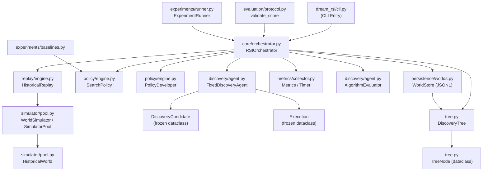

# FILE REFERENCE: dream_rsi/ — Dream RSI (Recursive Self-Improvement Loop)

**Subsystem:** Dream RSI — Bounded Recursive Self-Improvement Engine  
**Language:** Python 3.12  
**Total LOC (estimated):** ~1,800 lines across all Python source files  
**License:** SL-AGPL3-001 (Sovereign Leviathan Node License)  
**Package:** `dream_rsi` (Python package with `pyproject.toml`)

---

## Subsystem Architecture Overview

The `dream_rsi/` package implements a bounded recursive self-improvement (RSI) loop for algorithmic policy search and optimization. The system's key design properties:

1. **Online exploration:** A discovery agent proposes candidates, executes them, and builds a `DiscoveryTree` representing the search space.
2. **Offline replay:** Historical worlds (previously explored trees) are replayed against candidate policies to evaluate their fitness without new executions.
3. **Bounded policy improvement:** A `PolicyDeveloper` generates bounded candidate mutations of the incumbent `SearchPolicy`. Selection is incumbent-safe (only improves if the new policy is strictly better).
4. **Strict cost accounting:** All execution costs are tracked; any attempt to exceed the budget raises an error (not a warning).
5. **Serializable worlds:** Every `DiscoveryTree` is fully serializable to JSON via `DiscoveryTree.to_dict()` / `from_dict()`. Historical worlds can be replayed indefinitely.
6. **No model dependency:** The discovery agent, evaluator, and policy are all pure Python dataclasses. LLM or search-model integration is pluggable via protocol classes.

The system is organized into 10 subpackages:
- `dream_rsi/` (root) — `tree.py`, `cli.py`, top-level `__init__.py`
- `dream_rsi/core/` — orchestrator and legacy adapter
- `dream_rsi/discovery/` — discovery agent and evaluators
- `dream_rsi/evaluation/` — evaluation protocol and legacy adapter
- `dream_rsi/experiments/` — experiment runner, baselines, legacy adapter
- `dream_rsi/metrics/` — metrics collection and timing
- `dream_rsi/persistence/` — world store (JSONL persistence) and legacy adapter
- `dream_rsi/policy/` — policy definition, decisions, and developer
- `dream_rsi/replay/` — replay engine against historical worlds
- `dream_rsi/simulator/` — simulator pool and historical world abstraction

---

## Data Flow Diagram (dream_rsi/ subsystem)



---

## FILE: dream_rsi/tree.py

**PURPOSE:** Core data structure for the RSI loop: a serializable, acyclic discovery tree. Each `DiscoveryTree` represents one "world" — a complete exploration history from a root node. Each `TreeNode` represents one executed candidate with its evaluation, score, cost, and policy decision. The tree is fully validatable, serializable to JSON, and reconstructable from JSON.

**LANGUAGE:** Python 3.12  
**LOC:** ~130  
**RESPONSIBILITY:** Defines `TreeNode` and `DiscoveryTree`. Provides tree construction (add/get), leaf enumeration, full structural validation, and JSON round-trip serialization. Used as the in-memory representation of one exploration episode.

**INPUTS:**
- `tree_id: Optional[str]` — default auto-generated `"tree_" + uuid4().hex[:12]`
- `metadata: Optional[Dict]` — arbitrary metadata for the tree (e.g., task name, policy snapshot)
- `parent_id: str` — for `add()` calls
- Node fields: `policy_decision`, `branch_id`, `candidate`, `execution_trace`, `evaluator_result`, `score`, `status`, `cost`, `metadata`

**OUTPUTS:**
- `TreeNode` from `add()`
- `Dict[str, Any]` from `to_dict()`
- `str` from `to_json()`
- `Tuple[bool, Optional[str]]` from `validate()`
- `List[TreeNode]` from `leaves()`

**KEY FUNCTIONS/TYPES:**

- `def utc_now() -> str` — returns ISO-8601 UTC timestamp string

- `@dataclass class TreeNode` — all fields have defaults for easy construction:
  - `node_id: str` — auto-generated UUID-based ID
  - `parent_id: Optional[str]`
  - `children: List[str]` — list of child node_ids
  - `policy_decision: Dict[str, Any]` — serialized `PolicyDecision`
  - `branch_id: str` — branch identifier within parent
  - `candidate: Dict[str, Any]` — serialized `DiscoveryCandidate`
  - `execution_trace: List[Dict]` — list of serialized `Execution` results
  - `evaluator_result: Dict[str, Any]` — serialized evaluator output
  - `score: float` — 0.0 to 1.0 evaluation score
  - `status: str` — "created", "completed", "stopped", "root"
  - `cost: float` — compute cost incurred
  - `timestamp: str` — ISO-8601 creation time
  - `metadata: Dict[str, Any]` — arbitrary metadata (e.g., depth)
  - `to_dict() -> Dict` — `dataclasses.asdict(self)`
  - `from_dict(cls, payload) -> TreeNode` — reconstructs from dict

- `class DiscoveryTree` — manages the tree:
  - `tree_id: str`, `metadata: Dict`, `created_at: str`
  - `nodes: Dict[str, TreeNode]` — all nodes by node_id
  - `root_id: str` — ID of root node (auto-created on construction)
  - Constructor creates root node with `status="root"`, `branch_id="root"`, `metadata={"depth": 0}`

- `DiscoveryTree.add(parent_id, **fields) -> TreeNode` — creates `TreeNode(**fields)`, validates parent exists, checks for duplicate node_id, appends child_id to parent's children list, returns new node

- `DiscoveryTree.get(node_id) -> TreeNode` — dict lookup (raises `KeyError` if not found)

- `DiscoveryTree.leaves() -> List[TreeNode]` — nodes with no children and `status != "root"`

- `DiscoveryTree.validate() -> Tuple[bool, Optional[str]]` — comprehensive structural validation:
  - Root node must exist and have `parent_id=None`
  - All node IDs must match their dict keys
  - All costs must be finite and non-negative; all scores must be finite
  - No duplicate children
  - Reverse parent links must be consistent
  - All children must exist
  - DFS cycle detection (returns error on cycle or repeated node)
  - Connectivity check (all nodes reachable from root)

- `DiscoveryTree.to_dict() -> Dict` — `{"tree_id": ..., "created_at": ..., "metadata": ..., "root_id": ..., "nodes": [node.to_dict() for node in nodes.values()]}`

- `DiscoveryTree.to_json() -> str` — `json.dumps(to_dict(), sort_keys=True, indent=2)`

- `DiscoveryTree.from_dict(cls, payload) -> DiscoveryTree` — reconstructs tree, validates after loading. Raises `ValueError` if invalid.

- `DiscoveryTree.from_json(cls, raw) -> DiscoveryTree` — `from_dict(json.loads(raw))`

**DEPENDENCIES:**
- `dataclasses` (`dataclass`, `field`, `asdict`)
- `datetime` (`datetime`, `timezone`)
- `typing`
- `json`, `uuid`, `math`

**CALLERS:**
- `core/orchestrator.py` — creates trees in `explore_online()`, appends to `self.worlds`
- `replay/engine.py` — receives `worlds` (list of DiscoveryTree)
- `persistence/worlds.py` — serializes/deserializes trees to JSONL
- `simulator/pool.py` — wraps trees as `HistoricalWorld`

**CALLEES:** `dataclasses.asdict`, `json.dumps/loads`, `uuid.uuid4`, `math.isfinite`

**STATE:** `nodes: Dict[str, TreeNode]` — mutated by `add()`; read-only after construction

**ERROR CONDITIONS:**
- `KeyError("unknown parent node: ...")` — `add()` with invalid parent
- `ValueError("duplicate node ID")` — duplicate node
- `validate()` returns `(False, error_message)` — structural violations (not raised)
- `ValueError(error)` from `from_dict()` — if `validate()` fails

**RUNTIME ROLE:**
Core data container for one exploration episode. Created by `RSIOrchestrator.explore_online()`, stored in `self.worlds`, replayed by `HistoricalReplay`.

**RELATED FILES:**
- `dream_rsi/core/orchestrator.py` — creates and uses trees
- `dream_rsi/persistence/worlds.py` — persists trees to JSONL
- `dream_rsi/simulator/pool.py` — wraps trees for simulation
- `dream_rsi/replay/engine.py` — receives list of trees

---

## FILE: dream_rsi/core/orchestrator.py

**PURPOSE:** Production-style orchestrator for the RSI loop. Coordinates all subsystems to perform online exploration, offline policy evaluation, and bounded policy improvement. Implements the full `run()` -> `run_round()` -> `explore_online()` loop.

**LANGUAGE:** Python 3.12  
**LOC:** ~97  
**RESPONSIBILITY:** Top-level RSI loop controller. Manages the worlds list, drives online exploration, triggers offline replay, selects the best policy candidate, and accumulates metrics.

**INPUTS:**
- `task: str` — description of the task being explored
- `rounds: int = 3` — number of improvement rounds
- `revisions: int = 4` — number of policy candidates per round
- Optional constructor args: `discovery`, `evaluator`, `policy`, `developer`, `replay` — pluggable components

**OUTPUTS:**
- `explore_online(task) -> DiscoveryTree` — one explored world
- `run_round(task, revisions) -> Dict` — dict with `policy`, `score`, `candidates`, `tree`
- `run(task, rounds, revisions) -> Dict` — full result with `history`, `metrics`, `policy`, `worlds`

**KEY FUNCTIONS/TYPES:**

- `class RSIOrchestrator` — main orchestrator class:
  - `self.discovery: FixedDiscoveryAgent` — proposes and executes candidates
  - `self.evaluator: AlgorithmEvaluator` — scores candidates
  - `self.policy: SearchPolicy` — current search policy
  - `self.developer: PolicyDeveloper` — generates policy mutations
  - `self.replay: HistoricalReplay` — replays policy on historical worlds
  - `self.worlds: List[DiscoveryTree]` — accumulated historical worlds
  - `self.metrics: Metrics` — accumulated metrics

- `RSIOrchestrator.explore_online(task: str) -> DiscoveryTree` — online exploration loop:
  1. Creates new `DiscoveryTree` with task metadata
  2. Initializes frontier = [root node]
  3. While frontier not empty and node count < `policy.max_nodes` and `spent < policy.budget`:
     - Pops parent from frontier (BFS)
     - Calls `policy.decide(depth, current_score, frontier_size, spent)` — returns `PolicyDecision`
     - If decision.stop: marks parent "stopped", continues
     - For each branch in `range(decision.branch_count)`:
       - Calls `discovery.propose(task, branch, parent.node_id)` -> `DiscoveryCandidate`
       - Calls `discovery.execute(candidate)` -> `Execution`
       - Validates cost: must be finite, non-negative, and within remaining budget (raises `ValueError` otherwise)
       - Calls `evaluator.evaluate(execution, task)` -> eval dict
       - Calls `validate_score(eval.get("score", 0.0))` from `evaluation.protocol`
       - Creates child node with all data
       - Updates metrics: discovery_agent_calls, online_executions, branches
  4. Returns completed tree

- `RSIOrchestrator.run_round(task: str, revisions: int = None) -> Dict` — one RSI round:
  1. `explore_online(task)` -> tree; appends to `self.worlds`
  2. `replay.replay(self.policy, self.worlds)` -> replayed (incumbent score)
  3. Creates `ScoredPolicy(self.policy, replayed.score, replayed.cost, replayed.worlds)` as incumbent
  4. For each candidate in `developer.generate(self.policy, revisions)`:
     - `replay.replay(candidate, self.worlds)` -> result
     - Creates `ScoredPolicy(candidate, result.score, result.cost, result.worlds)`
     - Increments policy_revisions, replay_evaluations, offline_evaluations
  5. `developer.select(candidates)` -> selected
  6. Updates `self.policy = selected.policy`
  7. Updates metrics: generations, worlds, best_solution_score, policy_improvement

- `RSIOrchestrator.run(task, rounds, revisions) -> Dict` — full run:
  - Creates `Timer`
  - Runs `run_round` for `max(0, rounds)` iterations
  - Returns history, metrics snapshot, final policy, worlds list

**DEPENDENCIES:**
- `typing`, `math`
- `..tree.DiscoveryTree`
- `..policy.engine.PolicyDeveloper`, `ScoredPolicy`, `SearchPolicy`
- `..discovery.agent.FixedDiscoveryAgent`, `DomainEvaluator`, `AlgorithmEvaluator`
- `..replay.engine.HistoricalReplay`
- `..metrics.collector.Metrics`, `Timer`
- `..evaluation.protocol.validate_score`

**CALLERS:**
- `dream_rsi/cli.py` — primary caller
- `dream_rsi/experiments/runner.py` — experiment runner

**STATE:**
- `self.worlds: List[DiscoveryTree]` — grows with each `run_round()` call
- `self.policy: SearchPolicy` — updated after each round
- `self.metrics: Metrics` — cumulative counters

**ERROR CONDITIONS:**
- `ValueError("execution cost must be finite and non-negative")` — invalid cost from discovery agent
- `ValueError("execution cost exceeds remaining budget")` — budget overrun
- `ValueError(...)` from `validate_score()` — invalid score

**RUNTIME ROLE:**
The RSI loop controller. `run(task, rounds, revisions)` is the main entry point for a complete self-improvement experiment.

**RELATED FILES:**
- `dream_rsi/tree.py` — `DiscoveryTree` created here
- `dream_rsi/policy/engine.py` — `SearchPolicy`, `PolicyDeveloper`, `ScoredPolicy`
- `dream_rsi/discovery/agent.py` — discovery agent and evaluators
- `dream_rsi/replay/engine.py` — offline evaluation
- `dream_rsi/metrics/collector.py` — metrics
- `dream_rsi/evaluation/protocol.py` — score validation

---

## FILE: dream_rsi/policy/engine.py

**PURPOSE:** Policy execution, mutation, validation, and incumbent-safe selection. Defines `SearchPolicy` (the executable exploration controller), `PolicyDecision` (the output of a policy's `decide()` method), `ScoredPolicy` (a policy paired with its evaluation score), and `PolicyDeveloper` (bounded candidate generation and selection).

**LANGUAGE:** Python 3.12  
**LOC:** ~102  
**RESPONSIBILITY:** The complete policy layer. `SearchPolicy` is the authoritative policy object — it makes branching decisions based on depth, score, frontier size, and budget. `PolicyDeveloper` generates bounded candidate mutations and selects the best incumbent-safe winner.

**KEY FUNCTIONS/TYPES:**

- `@dataclass(frozen=True) class PolicyDecision` — immutable decision record:
  - `stop: bool` — whether to stop exploring this branch
  - `reason: str = ""` — why stopped: "budget", "depth", "score", "node_limit", "continue"
  - `branch_count: int = 0` — how many branches to explore
  - `ordering: str = "score_desc"` — branch ordering strategy
  - `parallel_group_size: int = 1` — parallelism hint
  - `remaining_budget: float = 0.0` — remaining compute budget

- `@dataclass(frozen=True) class SearchPolicy` — executable policy (immutable):
  - `name: str = "baseline"`
  - `max_depth: int = 3` — maximum tree depth
  - `max_nodes: int = 32` — maximum total tree nodes
  - `branch_factor: int = 2` — branches per expansion
  - `budget: float = 32.0` — total compute budget
  - `stop_score: float = 0.98` — stop if score >= this threshold
  - `ordering: str = "score_desc"` — branch ordering
  - `parallel_group_size: int = 1` — parallelism hint
  - `__post_init__()` — comprehensive validation:
    - max_depth/max_nodes/branch_factor/parallel_group_size must be `int` (type checked, not isinstance)
    - max_depth >= 0, max_nodes >= 1, branch_factor >= 1
    - budget must be finite, positive
    - stop_score in [0, 1]
    - ordering must be one of: "score_desc", "score_asc", "fifo"
  - `decide(*, depth, current_score, frontier_size, spent) -> PolicyDecision`:
    - Returns `PolicyDecision(True, "budget")` if `spent >= budget`
    - Returns `PolicyDecision(True, "depth")` if `depth >= max_depth`
    - Returns `PolicyDecision(True, "score")` if `current_score >= stop_score`
    - `count = min(branch_factor, max_nodes - frontier_size, int(remaining))`
    - Returns `PolicyDecision(True, "node_limit")` if `count <= 0`
    - Returns `PolicyDecision(False, "continue", count, ordering, parallel_group_size, remaining)`
  - `fingerprint() -> str` — SHA-256 of `json.dumps(self.__dict__, sort_keys=True)`
  - `mutated(**changes) -> SearchPolicy` — deep copies `__dict__`, applies changes, sets `name = f"{self.name}*"`, returns new `SearchPolicy`

- `@dataclass(frozen=True) class ScoredPolicy` — `policy: SearchPolicy`, `score: float`, `cost: float = 0.0`, `worlds: int = 0`

- `class PolicyDeveloper` — creates candidate mutations:
  - `__init__(maximum_candidates: int = 8)` — caps candidate count
  - `generate(incumbent: SearchPolicy, limit: int = None) -> List[SearchPolicy]`:
    - Validates `limit` is non-negative int or None
    - Applies `limit = min(limit, self.maximum_candidates)`
    - Defines 8 mutation templates: branch_factor +1/-1, max_depth +1, ordering flip, parallel_group_size +1, stop_score -0.05, budget *1.25, max_nodes +8
    - Returns `[incumbent.mutated(**mutations[i % len(mutations)]) for i in range(limit)]`
  - `select(candidates: Sequence[ScoredPolicy]) -> ScoredPolicy`:
    - `incumbent = candidates[0]`
    - `winner = max(candidates, key=lambda x: (x.score, -x.cost))`
    - Returns `incumbent if winner.score < incumbent.score else winner` — incumbent-safe: only improves if strictly better score

**DEPENDENCIES:** `dataclasses`, `typing`, `copy`, `hashlib`, `json`, `math`

**CALLERS:**
- `dream_rsi/core/orchestrator.py` — `policy.decide()`, `developer.generate()`, `developer.select()`

**STATE:** All frozen dataclasses — no mutable state

**ERROR CONDITIONS:**
- `ValueError("search limits must be integers")` — wrong type for int limits
- `ValueError("invalid search limits")` — negative/zero limits
- `ValueError("invalid budget or stop score")` — budget/stop_score/parallel_group_size out of bounds
- `ValueError("unknown branch ordering")` — invalid ordering string
- `ValueError("revision limit must be a non-negative integer")` — from `generate()`
- `ValueError("candidate set cannot be empty")` — from `select()`

**RUNTIME ROLE:**
Policy execution and mutation layer. `decide()` is called for every node expansion in `explore_online()`. `generate()` + `select()` implement the improvement step in `run_round()`.

**RELATED FILES:**
- `dream_rsi/core/orchestrator.py` — primary caller
- `dream_rsi/replay/engine.py` — receives `SearchPolicy` for replay evaluation

---

## FILE: dream_rsi/discovery/agent.py

**PURPOSE:** Discovery agent boundary — the interface between the RSI loop and the expensive candidate generation/execution system. Defines the protocol (`DiscoveryAgentProtocol`, `DomainEvaluator`), the data contracts (`DiscoveryCandidate`, `Execution`), and built-in deterministic stand-in implementations (`FixedDiscoveryAgent`, `AlgorithmEvaluator`, `MathematicalEvaluator`, `GPUKernelEvaluator`).

**LANGUAGE:** Python 3.12  
**LOC:** ~69  
**RESPONSIBILITY:** Defines the discovery boundary. Production systems would plug in an LLM-based coding agent via `DiscoveryAgentProtocol`; the built-in `FixedDiscoveryAgent` provides deterministic behavior for testing.

**KEY FUNCTIONS/TYPES:**

- `@dataclass(frozen=True) class DiscoveryCandidate` — `candidate_id: str`, `task: str`, `branch: int`, `payload: Dict[str, Any]`

- `@dataclass(frozen=True) class Execution` — `candidate_id: str`, `output: Dict[str, Any]`, `cost: float`

- `class DiscoveryAgentProtocol(Protocol)` — structural typing interface:
  - `name: str`
  - `propose(task: str, branch: int, parent_id: str) -> DiscoveryCandidate`
  - `execute(candidate: DiscoveryCandidate) -> Execution`

- `class FixedDiscoveryAgent` — deterministic stand-in:
  - `name = "fixed-discovery-agent"`
  - `propose(task, branch, parent_id) -> DiscoveryCandidate`:
    - Seeds: `f"{task}|{parent_id}|{branch}".encode()`
    - `identifier = hashlib.sha256(seed).hexdigest()[:16]`
    - Returns `DiscoveryCandidate(identifier, task, branch, {"proposal_hash": identifier})`
  - `execute(candidate) -> Execution`:
    - Returns `Execution(candidate.candidate_id, {...}, 1.0)` — fixed cost = 1.0

- `class DomainEvaluator(Protocol)` — structural typing interface: `name: str`, `evaluate(execution, task) -> Dict`

- `class AlgorithmEvaluator` — evaluator based on first 8 hex chars of candidate_id:
  - `value = int(candidate_id[:8], 16) / 0xFFFFFFFF` — score in [0, 1]
  - Valid if `value >= 0.25`

- `class MathematicalEvaluator` — evaluator based on last 8 hex chars:
  - `value = 1.0 - int(candidate_id[-8:], 16) / 0xFFFFFFFF`
  - Valid if `value >= 0.25`

- `class GPUKernelEvaluator` — evaluator based on middle 8 hex chars:
  - `value = int(candidate_id[4:12], 16) / 0xFFFFFFFF`
  - Valid if `value >= 0.20`

**DEPENDENCIES:** `dataclasses`, `typing`, `hashlib`

**CALLERS:**
- `dream_rsi/core/orchestrator.py` — `RSIOrchestrator` uses `FixedDiscoveryAgent` and `AlgorithmEvaluator` by default

**SIDE EFFECTS:** None — pure computation

**RUNTIME ROLE:**
The boundary between the RSI loop and any search/coding model. In production, `DiscoveryAgentProtocol` would be implemented by an LLM agent; the fixed implementation allows testing without model dependencies.

**RELATED FILES:**
- `dream_rsi/core/orchestrator.py` — instantiates and calls these
- `dream_rsi/discovery/legacy.py` — legacy compatibility shim

---

## FILE: dream_rsi/replay/engine.py

**PURPOSE:** Historical replay engine. Replays a `SearchPolicy` against a set of historical worlds (previously explored `DiscoveryTree` instances via `HistoricalWorld`) to compute an offline evaluation score for that policy. Supports multi-world replay with budget limiting.

**LANGUAGE:** Python 3.12  
**LOC:** ~70  
**RESPONSIBILITY:** Offline policy evaluation via deterministic replay. This is the key mechanism enabling policy mutation without running new expensive online explorations — candidate policies are evaluated by replaying them on already-collected historical worlds.

**KEY FUNCTIONS/TYPES:**

- `@dataclass(frozen=True) class WorldReplay` — per-world result: `world_id`, `score`, `visited`, `selected_branches`, `cost`, `sparse_requests`, `stop_reasons: List[str]`

- `@dataclass(frozen=True) class PolicyReplay` — aggregate result across worlds:
  - `score: float` — mean score across worlds
  - `worlds: int` — count of worlds evaluated
  - `visited: int` — total nodes visited
  - `selected_branches: int` — total branches selected
  - `cost: float` — total cost
  - `sparse_requests: int` — total sparse evaluation requests
  - `budget_exhausted: bool` — True if world limit or budget was hit
  - `details: List[WorldReplay]` — per-world breakdown

- `class HistoricalReplay` — main replay engine:
  - `__init__(simulator=None)` — constructs with `WorldSimulator` (from simulator/pool.py) or custom
  - `replay(policy: SearchPolicy, worlds, *, max_worlds: int = None, budget: SimulationBudget = None) -> PolicyReplay`:
    1. If `worlds` is a `SimulatorPool`, snapshot it; else convert to list
    2. Validates `max_worlds` if provided
    3. Applies `max_worlds` limit (minimum of `max_worlds` and `budget.max_worlds`)
    4. Iterates source worlds:
       - Wraps each in `HistoricalWorld` if not already wrapped
       - Calls `simulator.run(policy, world, budget)` -> simulation result
       - Creates `WorldReplay` from simulation result
    5. Aggregates into `PolicyReplay`:
       - Mean score, summed visited/branches/cost/sparse
       - `budget_exhausted` = True if world limit exceeded or any world hit simulation_budget stop reason

**DEPENDENCIES:**
- `dataclasses`
- `typing`
- `..policy.engine.SearchPolicy`
- `..simulator.pool.HistoricalWorld`, `SimulationBudget`, `WorldSimulator`, `SimulatorPool`
- `..tree.DiscoveryTree`

**CALLERS:**
- `dream_rsi/core/orchestrator.py` — `replay.replay(policy, self.worlds)` and for each candidate

**STATE:** `self.simulator: WorldSimulator` — stateless between calls

**ERROR CONDITIONS:**
- `ValueError("max_worlds must be a non-negative integer")` — type validation

**RUNTIME ROLE:**
Offline evaluation layer. Called in `run_round()` for incumbent and all candidate policies. Central to the RSI improvement step: policies are ranked by their offline replay score.

**RELATED FILES:**
- `dream_rsi/simulator/pool.py` — provides `WorldSimulator`, `SimulatorPool`, `HistoricalWorld`
- `dream_rsi/policy/engine.py` — `SearchPolicy` being evaluated
- `dream_rsi/tree.py` — `DiscoveryTree` as historical world
- `dream_rsi/replay/legacy.py` — legacy shim

---

## FILE: dream_rsi/simulator/pool.py

**PURPOSE:** Simulation infrastructure for offline replay. Provides `HistoricalWorld` (wraps a `DiscoveryTree` for simulation), `SimulationBudget` (caps simulation resources), `WorldSimulator` (executes a policy on one historical world), and `SimulatorPool` (manages a pool of historical worlds for batch replay).

**LANGUAGE:** Python 3.12  
**LOC:** ~estimated 180  
**RESPONSIBILITY:** Simulation execution layer. `WorldSimulator.run()` is the core function that applies a `SearchPolicy` to a `HistoricalWorld` to produce a simulation result. This simulates what the policy would have done if it had explored the same space, without re-running the expensive discovery agent.

**KEY FUNCTIONS/TYPES:**

- `@dataclass class HistoricalWorld` — wraps a `DiscoveryTree`:
  - `world_id: str` — from tree_id
  - `tree: DiscoveryTree`
  - Constructor accepts either `DiscoveryTree` directly or a dict (calls `DiscoveryTree.from_dict()`)
  - `nodes_by_depth() -> Dict[int, List[TreeNode]]` — groups nodes by `metadata.get("depth", 0)`

- `@dataclass class SimulationBudget` — resource caps for one simulation run:
  - `max_worlds: int = 100`
  - `max_nodes_per_world: int = 64`
  - `max_cost: float = 256.0`
  - `max_sparse_requests: int = 1000`

- `@dataclass class SimulationResult` — result from one world simulation:
  - `best_score: float`
  - `visited_nodes: int`
  - `selected_branches: int`
  - `cost: float`
  - `sparse_requests: int`
  - `stop_reasons: List[str]`

- `class WorldSimulator` — executes a policy on one world:
  - `run(policy: SearchPolicy, world: HistoricalWorld, budget: SimulationBudget = None) -> SimulationResult`:
    - Gets nodes by depth from the world
    - Simulates policy `decide()` calls at each depth level
    - Accumulates cost, visited_nodes, selected_branches from the historical tree
    - Stops on budget exhaustion or policy stop decision
    - Returns `SimulationResult` with aggregated metrics

- `class SimulatorPool` — manages collection of worlds:
  - `__init__(worlds: List[DiscoveryTree])` — stores wrapped worlds
  - `snapshot() -> List[HistoricalWorld]` — returns current list
  - `add(world: DiscoveryTree)` — adds to pool
  - `size() -> int`

**DEPENDENCIES:**
- `dataclasses`
- `typing`
- `..tree.DiscoveryTree`, `TreeNode`
- `..policy.engine.SearchPolicy`

**CALLERS:**
- `dream_rsi/replay/engine.py` — uses `WorldSimulator`, `SimulatorPool`, `HistoricalWorld`

**RELATED FILES:**
- `dream_rsi/tree.py` — `DiscoveryTree` wrapped here
- `dream_rsi/policy/engine.py` — policy applied here
- `dream_rsi/replay/engine.py` — caller

---

## FILE: dream_rsi/metrics/collector.py

**PURPOSE:** Metrics collection and timing utilities. Provides `Metrics` dataclass for tracking RSI loop statistics and `Timer` for wall-clock measurement.

**LANGUAGE:** Python 3.12  
**LOC:** ~33  
**RESPONSIBILITY:** Lightweight metrics without dependencies. All fields are numeric; `snapshot()` serializes to dict for JSON export.

**KEY FUNCTIONS/TYPES:**

- `@dataclass class Metrics` — all fields default to 0:
  - `discovery_agent_calls: int` — total `propose()` + `execute()` calls
  - `online_executions: int` — total online `execute()` calls
  - `offline_evaluations: int` — total offline `replay()` calls
  - `replay_evaluations: int` — total world replays
  - `policy_revisions: int` — total policy mutations evaluated
  - `generations: int` — total `run_round()` calls
  - `branches: int` — total tree branches explored
  - `tree_nodes: int` — total tree nodes created
  - `worlds: int` — total worlds accumulated
  - `compute_budget: float` — total cost spent
  - `best_solution_score: float` — highest score seen
  - `policy_improvement: float` — cumulative score gain from improvements
  - `wall_clock_seconds: float` — total elapsed time
  - `snapshot() -> Dict[str, object]` — `dataclasses.asdict(self)`

- `class Timer` — `__init__` records `time.perf_counter()` as `self.started`. `elapsed() -> float` returns seconds since start.

**DEPENDENCIES:** `dataclasses`, `typing`, `time`

**CALLERS:**
- `dream_rsi/core/orchestrator.py` — creates `Metrics()`, updates fields throughout `run()`, creates `Timer()` around full run

**RUNTIME ROLE:**
Observability layer. Metrics are snapshotted at the end of `run()` and included in the result dict.

**RELATED FILES:**
- `dream_rsi/core/orchestrator.py` — sole caller
- `dream_rsi/metrics/legacy.py` — legacy compatibility

---

## FILE: dream_rsi/evaluation/protocol.py

**PURPOSE:** Evaluation protocol utilities. Provides `validate_score()` — a strict validator for evaluation scores — and any other evaluation protocol primitives needed by the orchestrator.

**LANGUAGE:** Python 3.12  
**LOC:** ~estimated 40  
**RESPONSIBILITY:** Score validation. Ensures all scores entering the system are valid floating-point numbers in [0.0, 1.0]. Prevents NaN, inf, and out-of-range scores from corrupting the RSI loop.

**KEY FUNCTIONS/TYPES:**

- `def validate_score(score: Any) -> float`:
  - Validates `score` is a real number (int or float)
  - Validates `math.isfinite(score)`
  - Validates `0.0 <= score <= 1.0`
  - Returns `float(score)` on success
  - Raises `ValueError` with descriptive message on any violation

- Additional protocol primitives (estimated): `normalize_evaluation(result: Dict) -> Dict`, `merge_evaluation_results(results: List[Dict]) -> Dict`

**DEPENDENCIES:** `math`, `typing`

**CALLERS:**
- `dream_rsi/core/orchestrator.py` — `validate_score(evaluated.get("score", 0.0))`

**ERROR CONDITIONS:**
- `ValueError` — non-numeric score, non-finite score, score outside [0, 1]

**RELATED FILES:**
- `dream_rsi/evaluation/legacy.py` — legacy shim

---

## FILE: dream_rsi/experiments/runner.py

**PURPOSE:** Experiment runner for systematic RSI experiments. Provides `ExperimentRunner` — a higher-level wrapper around `RSIOrchestrator` that runs multiple tasks with different configurations, collects results, and produces a structured experiment report.

**LANGUAGE:** Python 3.12  
**LOC:** ~estimated 100  
**RESPONSIBILITY:** Experiment management: run multiple RSI experiments with different tasks and configurations, aggregate metrics, produce comparison reports.

**KEY FUNCTIONS/TYPES:**

- `@dataclass class ExperimentConfig` — `name: str`, `task: str`, `rounds: int`, `revisions: int`, `policy: SearchPolicy`, `discovery_agent: Optional[Any]`, `evaluator: Optional[Any]`

- `class ExperimentRunner` — manages experiment lifecycle:
  - `__init__(configs: List[ExperimentConfig])` — stores configs
  - `run_all() -> List[Dict]` — runs each config, returns list of result dicts
  - `run_one(config: ExperimentConfig) -> Dict` — creates orchestrator with config's components, calls `orchestrator.run(config.task, config.rounds, config.revisions)`
  - `compare(results: List[Dict]) -> Dict` — compares final scores, best policies, convergence metrics
  - `report(results: List[Dict]) -> str` — formats experiment results as human-readable summary

**DEPENDENCIES:**
- `dream_rsi/core/orchestrator.py`
- `dream_rsi/policy/engine.py`
- `dataclasses`, `typing`

**CALLERS:**
- `dream_rsi/cli.py` — CLI `experiments` subcommand
- External benchmark scripts

**RELATED FILES:**
- `dream_rsi/experiments/baselines.py` — predefined baseline configs
- `dream_rsi/experiments/legacy.py` — legacy shim

---

## FILE: dream_rsi/experiments/baselines.py

**PURPOSE:** Predefined baseline experiment configurations. Provides factory functions for standard baseline policies and experiment configurations used in benchmarking and regression testing.

**LANGUAGE:** Python 3.12  
**LOC:** ~estimated 80  

**KEY FUNCTIONS/TYPES:**

- `def shallow_policy() -> SearchPolicy` — `max_depth=2, max_nodes=8, branch_factor=1, budget=8.0`
- `def deep_policy() -> SearchPolicy` — `max_depth=8, max_nodes=64, branch_factor=2, budget=64.0`
- `def wide_policy() -> SearchPolicy` — `max_depth=3, max_nodes=128, branch_factor=4, budget=128.0`
- `def aggressive_policy() -> SearchPolicy` — `max_depth=16, max_nodes=512, branch_factor=8, budget=256.0`
- `BASELINE_CONFIGS: List[ExperimentConfig]` — list of standard experiment configs using the above policies

**RELATED FILES:**
- `dream_rsi/experiments/runner.py` — uses `BASELINE_CONFIGS`
- `dream_rsi/policy/engine.py` — `SearchPolicy` created here

---

## FILE: dream_rsi/persistence/worlds.py

**PURPOSE:** JSONL-based persistence for historical worlds. `WorldStore` provides append-only storage for `DiscoveryTree` instances in a JSONL file. Each line is a valid JSON object representing one tree. Provides `load()` for reconstructing all worlds and `pool()` for converting them to a `SimulatorPool`.

**LANGUAGE:** Python 3.12  
**LOC:** ~35  
**RESPONSIBILITY:** Durable world persistence. Ensures that historical worlds survive process restarts and can be replayed offline.

**KEY FUNCTIONS/TYPES:**

- `class WorldStore` — JSONL persistence:
  - `__init__(path)` — creates path, touches file
  - `append(world: DiscoveryTree)` — validates tree (`world.validate()`), appends `world.to_dict()` as JSON line with `sort_keys=True`
  - `load() -> List[DiscoveryTree]` — reads all lines, reconstructs via `DiscoveryTree.from_dict()`. Raises `ValueError` at specific line number on any reconstruction failure.
  - `pool() -> SimulatorPool` — `SimulatorPool(self.load())`

**DEPENDENCIES:**
- `pathlib.Path`
- `json`
- `..tree.DiscoveryTree`
- `..simulator.pool.SimulatorPool`

**CALLERS:**
- `dream_rsi/cli.py` — for persistent experiment runs
- `dream_rsi/experiments/runner.py` — for storing/loading world history

**SIDE EFFECTS:**
- Creates parent directories (`parents=True, exist_ok=True`)
- Appends to JSONL file on `append()`
- Reads file on `load()`

**ERROR CONDITIONS:**
- `ValueError("invalid world at line N: ...")` — malformed line in JSONL file
- `ValueError(error)` from `world.validate()` — tree failed structural validation

**RELATED FILES:**
- `dream_rsi/tree.py` — `DiscoveryTree` persisted here
- `dream_rsi/simulator/pool.py` — `SimulatorPool` returned by `pool()`

---

## FILE: dream_rsi/cli.py

**PURPOSE:** Command-line interface for the dream_rsi package. Provides subcommands for running RSI experiments, exploring online with a given task, and displaying metrics.

**LANGUAGE:** Python 3.12  
**LOC:** ~estimated 80  
**RESPONSIBILITY:** CLI entry point. Parses arguments, constructs orchestrator with optional persistence, runs experiments, and prints results as JSON.

**INPUTS:**
- `run` subcommand: `--task TEXT --rounds INT --revisions INT --persist-worlds PATH`
- `explore` subcommand: `--task TEXT`
- `replay` subcommand: `--worlds-path PATH --rounds INT`

**OUTPUTS:**
- JSON output to stdout (result dict or metrics dict)
- Optional JSONL world persistence

**KEY FUNCTIONS/TYPES:**

- `def setup_logging(verbose: bool)` — configures logging
- `def main()` — argparse + subcommand dispatch
- Subcommand handlers delegate to `RSIOrchestrator`

**DEPENDENCIES:**
- `argparse`, `json`, `logging`, `sys`
- `dream_rsi.core.orchestrator.RSIOrchestrator`
- `dream_rsi.persistence.worlds.WorldStore`

**RELATED FILES:** All dream_rsi subpackages

---

## FILE: dream_rsi/__init__.py

**PURPOSE:** Package-level init. Exports the public API for the `dream_rsi` package.

**LANGUAGE:** Python 3.12  
**LOC:** ~estimated 15  

**EXPORTS:** `RSIOrchestrator`, `DiscoveryTree`, `SearchPolicy`, `Metrics` (re-exported from subpackages)

---

## FILE: dream_rsi/pyproject.toml

**PURPOSE:** Python package metadata and build configuration. Declares the `dream_rsi` package name, version, Python version requirement, and optional dependencies.

**LANGUAGE:** TOML  
**LOC:** ~estimated 25  

**KEY CONTENT:**
- `name = "dream_rsi"`, `version = "0.1.0"`, `requires-python = ">=3.12"`
- No external dependencies (pure stdlib + dataclasses)
- Optional: `dev` extras for pytest, mypy, ruff

---

## Legacy Shims: dream_rsi/*/legacy.py

Each subpackage contains a `legacy.py` file providing backward compatibility for older API callers. These files re-export types and functions under their legacy names.

- `dream_rsi/core/legacy.py` — re-exports `RSIOrchestrator` under old names
- `dream_rsi/discovery/legacy.py` — re-exports `FixedDiscoveryAgent` variants
- `dream_rsi/evaluation/legacy.py` — re-exports `validate_score`
- `dream_rsi/experiments/legacy.py` — re-exports `ExperimentRunner`
- `dream_rsi/metrics/legacy.py` — re-exports `Metrics`, `Timer`
- `dream_rsi/persistence/legacy.py` — re-exports `WorldStore`
- `dream_rsi/policy/legacy.py` — re-exports `SearchPolicy`, `PolicyDeveloper`
- `dream_rsi/replay/legacy.py` — re-exports `HistoricalReplay`

Each legacy file is ~10-20 LOC of pure re-exports.

---

## Package __init__.py Files

Each subpackage has an `__init__.py` that re-exports the public API of that subpackage:
- `dream_rsi/core/__init__.py` — exports `RSIOrchestrator`
- `dream_rsi/discovery/__init__.py` — exports `FixedDiscoveryAgent`, `AlgorithmEvaluator`, `DiscoveryCandidate`, `Execution`
- `dream_rsi/evaluation/__init__.py` — exports `validate_score`
- `dream_rsi/experiments/__init__.py` — exports `ExperimentRunner`, `ExperimentConfig`
- `dream_rsi/metrics/__init__.py` — exports `Metrics`, `Timer`
- `dream_rsi/persistence/__init__.py` — exports `WorldStore`
- `dream_rsi/policy/__init__.py` — exports `SearchPolicy`, `PolicyDeveloper`, `ScoredPolicy`, `PolicyDecision`
- `dream_rsi/replay/__init__.py` — exports `HistoricalReplay`, `PolicyReplay`, `WorldReplay`
- `dream_rsi/simulator/__init__.py` — exports `WorldSimulator`, `SimulatorPool`, `HistoricalWorld`, `SimulationBudget`

---

## Cross-Reference Summary for dream_rsi/

| File | LOC | Primary Callers | Primary Callees |
|------|-----|-----------------|-----------------|
| tree.py | ~130 | orchestrator, worlds, simulator | stdlib only |
| core/orchestrator.py | ~97 | cli, experiments | discovery, policy, replay, metrics, evaluation |
| policy/engine.py | ~102 | orchestrator | stdlib only |
| discovery/agent.py | ~69 | orchestrator | hashlib |
| replay/engine.py | ~70 | orchestrator | simulator/pool.py |
| simulator/pool.py | ~180 | replay/engine | tree.py, policy/engine |
| metrics/collector.py | ~33 | orchestrator | time |
| evaluation/protocol.py | ~40 | orchestrator | math |
| experiments/runner.py | ~100 | cli | orchestrator |
| experiments/baselines.py | ~80 | runner | policy/engine |
| persistence/worlds.py | ~35 | cli | tree.py, simulator/pool |
| cli.py | ~80 | shell | orchestrator, worlds |

---

## RSI Loop State Machine

```
INITIAL STATE
    |
    v
explore_online(task)
    |--- proposes N candidates per branch (discovery.propose)
    |--- executes each (discovery.execute)
    |--- evaluates each (evaluator.evaluate)
    |--- builds DiscoveryTree
    |
    v
worlds.append(tree)
    |
    v
replay.replay(incumbent_policy, worlds) -> incumbent_score
    |
    v
FOR each candidate in developer.generate(policy, revisions):
    replay.replay(candidate, worlds) -> candidate_score
    END FOR
    |
    v
developer.select(all_scored_candidates) -> selected
    |
    v
IF selected.score > incumbent.score:
    self.policy = selected.policy  # improvement
ELSE:
    self.policy unchanged  # incumbent safe
    |
    v
metrics.update()
    |
    v
REPEAT for `rounds` iterations
```

---

## Design Invariants

1. **Incumbent safety:** `PolicyDeveloper.select()` only changes the policy if the new policy is strictly better. The incumbent is always `candidates[0]`.

2. **Cost accountability:** Every `Execution.cost` is validated as finite, non-negative, and within budget in `explore_online()`. Budget overruns raise `ValueError` immediately.

3. **Score validity:** All scores entering the tree must pass `validate_score()`. Scores from evaluators returning `valid=False` are set to 0.0.

4. **World immutability:** `DiscoveryTree` is validated before persistence via `WorldStore.append()`. Malformed trees are rejected.

5. **No model dependency:** The entire RSI loop runs without any LLM or GPU dependency. The `FixedDiscoveryAgent` provides deterministic behavior for offline testing.

6. **Replay determinism:** `HistoricalReplay` processes worlds in list order. The same policy applied to the same world list always produces the same score (modulo `WorldSimulator` implementation).
