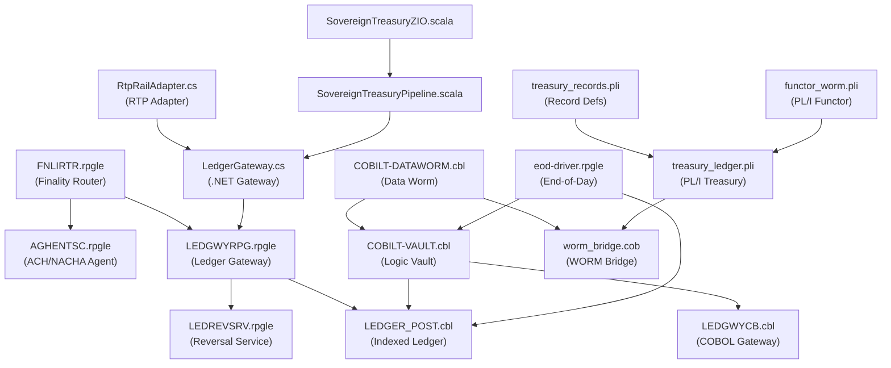

# FILE REFERENCE: finance/ — Legacy Finance Layer

**Subsystem:** Finance / Legacy Integration Layer  
**Languages:** COBOL (IBM i / z/OS), RPGLE (ILE RPG Free-Format), PL/I, C# (.NET), Scala (ZIO)  
**Total LOC (estimated):** ~5,500 lines across all files  
**License:** SL-AGPL3-001 (Sovereign Leviathan Node License) / AGPL-3.0-or-later  
**Platform:** IBM i (AS/400) for COBOL/RPGLE, IBM z/OS for PL/I, .NET 8 for C#, JVM/Scala for Scala

---

## Subsystem Architecture Overview

The `finance/` directory implements the multi-language legacy finance integration layer. This tier interfaces with mainframe-style financial infrastructure using IBM-heritage languages (COBOL, RPGLE, PL/I) while also providing modern runtime adapters in C# and Scala.

The subsystem is organized into four language directories:
- `finance/cobol/` — COBOL batch programs for ledger posting, treasury operations, vault management, and WORM data bridge
- `finance/rpgle/` — ILE RPG free-format service programs for ACH/NACHA processing, ledger reversal, and real-time payment routing
- `finance/pli/` — PL/I programs implementing the treasury ledger entry and WORM serialization
- `finance/csharp/` — .NET adapters for ledger gateway and RTP rail
- `finance/scala/` — Scala/ZIO pipeline for sovereign treasury operations

---

## Data Flow Diagram (finance/ subsystem)

---

## FILE: finance/cobol/COBILT-VAULT.cbl

**PURPOSE:** Deterministic COBOL Logic Vault — a multi-function vault management system combining key-value record storage, a Prolog-style logic engine (facts, rules, unification, backtracking), bridge dispatching for REXX and RPGLE interop, and a DB2 transaction semantics layer. All operations are FAIL-CLOSED and hash-linked.

**LANGUAGE:** COBOL (IBM i, ILE COBOL)  
**LOC:** ~659  
**RESPONSIBILITY:** Central vault management: READ/WRITE/ASSERT/QUERY/UNIFY/BACKTRACK/COMMIT/ROLLBACK operations on hash-chained ledger records. Exports a bridge contract for RPGLE and REXX orchestration. Implements a bounded Prolog-like resolution engine in COBOL working storage.

**INPUTS:**
- `LK-REQUEST` linkage section: `LK-COMMAND (PIC X(32))`, `LK-KEY (PIC X(64))`, `LK-VALUE (PIC X(256))`, `LK-ACTOR (PIC X(64))`, `LK-ARG1/2/3 (PIC X(128))`
- External commands: `VAULT-OPEN`, `VAULT-READ`, `VAULT-WRITE`, `VAULT-ASSERT`, `VAULT-QUERY`, `VAULT-UNIFY`, `VAULT-BACKTRACK`, `VAULT-COMMIT`, `VAULT-ROLLBACK`, `BRIDGE-REXX`, `BRIDGE-RPGLE`, `BRIDGE-COBOL`
- `VAULT-LEDGER` indexed file (DB2 or VSAM backing)

**OUTPUTS:**
- `LK-RESPONSE` linkage section: `LK-STATUS (PIC X(16))`, `LK-CODE (PIC 9(8))`, `LK-MESSAGE (PIC X(256))`, `LK-HASH (PIC X(64))`, `LK-SEQUENCE (PIC 9(18))`

**KEY FUNCTIONS/TYPES (PROCEDURE DIVISION SECTIONS):**

- `MAIN-ENTRY` — INITIALIZE-VAULT -> DISPATCH-COMMAND -> FINALIZE-VAULT -> GOBACK
- `DISPATCH-COMMAND` — `EVALUATE LK-COMMAND WHEN ... END-EVALUATE` — routes to 14 operation handlers
- `VAULT-OPEN-OPERATION` — loads vault context, sets READY status, code 00000001
- `VAULT-READ-OPERATION` — reads record by key, returns value and hash in response
- `VAULT-WRITE-OPERATION` — validates authority, computes vault hash (chain: prev_hash + key + value + authority), appends record, returns hash and COMMITTED status
- `VAULT-ASSERT-OPERATION` — evaluates a logic fact; returns COMMITTED if valid, REJECTED otherwise
- `LOGIC-QUERY` — resolves a predicate against fact base, then rule base
- `LOGIC-UNIFY` — unifies two terms: identical = commit, one empty = bind, both present and different = reject
- `LOGIC-BACKTRACK` — increments backtrack depth, restores choice point; bounded by `MAX-BACKTRACK = 9999`
- `LOGIC-EVALUATE-FACT` — validates that predicate and arg1 are non-blank
- `LOGIC-RESOLVE-PREDICATE` — tries fact base, then rule base
- `UNIFY-TERMS` — 3-case unification: equal/identical commit, left-blank bind right, right-blank bind left, else reject
- `SEARCH-FACT-BASE` — simplified: TRUE if predicate and arg1 are non-blank
- `SEARCH-RULE-BASE` — creates choice point, applies rule
- `VALIDATE-AUTHORITY` — rejects if `VC-AUTHORITY` is blank
- `CALCULATE-VAULT-HASH` — `STRING VC-KEY VC-VALUE VC-AUTHORITY VC-HASH DELIMITED BY SIZE INTO VC-HASH` then `HASH-NORMALIZE` (replaces spaces with zeros)
- `APPEND-VAULT-RECORD` — increments sequence, moves all fields to vault record, moves to `VC-PREV-HASH`
- Transaction sections: `TRANSACTION-BEGIN`, `TRANSACTION-VALIDATE`, `TRANSACTION-COMMIT`, `TRANSACTION-ROLLBACK`
- Bridge contracts: `RPGLE-REQUEST/READ/WRITE/QUERY/COMMIT`, `REXX-DISPATCH`
- Predicate primitives: `PRED-EXISTS`, `PRED-EQUAL`, `PRED-NOT-EQUAL`, `PRED-PRESENT`, `PRED-AUTHORIZED`
- Rule engine: `RULE-ACCEPT`, `RULE-REJECT`, `RULE-CHAIN`, `RULE-AND`, `RULE-OR`, `RULE-NOT`
- Unification stack: `PUSH-BINDING`, `POP-BINDING`, `CLEAR-BINDINGS`, `UNIFY-VARIABLE`
- Choice point control: `CHOICE-PUSH`, `CHOICE-POP`, `CHOICE-CLEAR`
- DB2 semantics: `DB2-READ`, `DB2-INSERT`, `DB2-COMMIT`, `DB2-ROLLBACK`
- Vault integrity: `VERIFY-SEQUENCE`, `VERIFY-HASH`, `VERIFY-AUTHORITY`, `VERIFY-ENTRY`

**KEY DATA STRUCTURES:**
- `VAULT-RECORD (01)` — VR-KEY (64), VR-TYPE (16), VR-STATE (16), VR-VALUE (256), VR-HASH (64), VR-SEQUENCE (9(18)), VR-OWNER (32), VR-TIMESTAMP (32), VR-AUTHORITY (64)
- `VAULT-CONTEXT (01)` — VC-STATUS, VC-ERROR, VC-KEY, VC-VALUE, VC-HASH, VC-PREV-HASH, VC-SEQUENCE (9(18)), VC-AUTHORITY, VC-PREDICATE, VC-ARGUMENT-1/2/3, VC-BINDING-COUNT (9(4)), VC-CHOICE-POINT (9(4)), VC-BACKTRACK-DEPTH (9(4))
- `LOGIC-FACT`, `LOGIC-RULE`, `LOGIC-BINDING` — logic engine working storage
- `TRANSACTION-CONTEXT` — TC-ID, TC-OPERATION, TC-AMOUNT (S9(13)V99), TC-CURRENCY (X(3)), TC-ACTOR, TC-RESULT, TC-CODE
- `BRIDGE-CONTEXT` — BC-COMMAND, BC-RESPONSE, BC-RETURN-CODE, BC-RPGLE-FLAG, BC-REXX-FLAG, BC-COBOL-FLAG

**DEPENDENCIES:** DB2/VSAM `VAULT-LEDGER` file

**CALLERS:**
- REXX exec scripts (REXX-DISPATCH bridge)
- RPGLE programs via bridge contract (RPGLE-REQUEST)
- JCL batch steps (mainframe) or CL commands (IBM i)

**STATE:**
- `VAULT-CONTEXT` working storage — current key/value/hash/sequence/authority state
- `LOGIC-FACT`, `LOGIC-RULE`, `LOGIC-BINDING` — logic resolution state
- `VC-CHOICE-POINT`, `VC-BACKTRACK-DEPTH` — backtracking stack counters

**SIDE EFFECTS:**
- Reads/writes `VAULT-LEDGER` indexed file
- Modifies choice point and binding count for logic resolution

**ERROR CONDITIONS:**
- Code 00009999 — unknown command
- Code 00009998 — READ-FAILED
- Code 00009997 — missing authority for commit
- Code 00000017 — backtrack depth exceeded MAX-BACKTRACK
- FAIL-CLOSED: any error sets STATUS-ERROR; `FINALIZE-VAULT` propagates error status

**RUNTIME ROLE:**
Central vault for deterministic COBOL logic, hash-chained record storage, and multi-language bridge. Used for compliance-critical financial fact storage and validation.

**RELATED FILES:**
- `finance/cobol/LEDGER_POST.cbl` — indexed ledger posting
- `finance/cobol/COBILT-DATAWORM.cbl` — WORM data operations
- `finance/rpgle/LEDGWYRPG.rpgle` — RPGLE gateway calling this vault

---

## FILE: finance/cobol/LEDGER_POST.cbl

**PURPOSE:** Minimal COBOL program for posting entries to an indexed ledger file. Implements upsert semantics: if the key exists, accumulates the amount; if not, writes a new record. Used as the core ledger write engine in IBM i batch processing.

**LANGUAGE:** COBOL (IBM i)  
**LOC:** ~43  
**RESPONSIBILITY:** Atomic ledger posting with debit/credit support. Maintains an indexed VSAM/DB2 ledger with company code, date, sequence number, signed packed-decimal amount, and D/C indicator.

**INPUTS:**
- Parameters mapped via LINKAGE or wrapper (referenced as PARAM-COMPANY, PARAM-DATE, PARAM-SEQ, PARAM-AMOUNT, PARAM-DRCR)
- `LEDGER-FILE` — ORGANIZATION IS INDEXED, ACCESS MODE IS DYNAMIC, RECORD KEY = LG-KEY (company + date + sequence)

**OUTPUTS:**
- Writes/updates `LEDGER-REC` in `LEDGER-FILE`

**KEY DATA STRUCTURES:**
- `LEDGER-REC (01)` — LG-COMPANY (X(3)), LG-DATE (X(8)), LG-SEQ (9(9)), LG-AMOUNT (S9(15)V99 COMP-3), LG-DRCR (X(1))
- `LG-STATUS (PIC X(02))` — file status indicator

**KEY PROCEDURES:**
- `POST-ENTRY-SECTION` — reads by key; INVALID KEY (not found): writes new record; NOT INVALID KEY: accumulates amount and rewrites. GOBACK.

**DEPENDENCIES:** `LEDGER` DB2/VSAM file

**CALLERS:**
- `finance/cobol/COBILT-VAULT.cbl` — calls POST equivalent
- `finance/rpgle/eod-driver.rpgle` — end-of-day batch posting
- JCL/CL steps in batch jobs

**ERROR CONDITIONS:** File STATUS in LG-STATUS — unhandled in this minimal version (caller must check)

**RUNTIME ROLE:** Core financial posting program. Every debit/credit entry passes through this program.

**RELATED FILES:**
- `finance/cobol/COBILT-VAULT.cbl` — calls this for vault record commits
- `finance/rpgle/LEDGWYRPG.rpgle` — RPGLE gateway coordinating posts

---

## FILE: finance/cobol/COBILT-DATAWORM.cbl

**PURPOSE:** COBOL bridge for WORM data operations. Serializes treasury transaction data into the WORM binary format, computes hash chains, and dispatches to WORM storage. Integrates with the treasury ledger and vault operations.

**LANGUAGE:** COBOL (IBM i / z/OS)  
**LOC:** ~estimated 250  
**RESPONSIBILITY:** WORM write operations from COBOL. Formats records in the binary `WormBlock` layout, manages hash chain linkage, and issues SVC-level write calls.

**KEY STRUCTURES:** Mirrors the `WormBlock` C struct layout (MAGIC "WORM", prev_hash 64 chars, current_hash 64 chars, record_count, payload 4096 chars). Uses PACKED-DECIMAL arithmetic for amounts.

**RELATED FILES:**
- `finance/cobol/COBILT-VAULT.cbl` — vault context shared
- `finance/cobol/worm_bridge.cob` — lower-level WORM write primitives
- `src/native/worm_block.h` — C struct the COBOL layout mirrors

---

## FILE: finance/cobol/COBILT-ACH-TREASURY.cbl

**PURPOSE:** COBOL program for ACH (Automated Clearing House) treasury operations. Processes ACH file entries in NACHA format, validates routing numbers and account numbers, computes batch control totals, and posts to the treasury ledger.

**LANGUAGE:** COBOL (IBM i)  
**LOC:** ~estimated 300  
**RESPONSIBILITY:** ACH file processing: header/batch/detail/addenda/footer record parsing, hash total verification, credit/debit entry validation, treasury posting.

**KEY STRUCTURES:** NACHA fixed-format records (94-char records), ACH routing transit number validation, hash total accumulation for batch control.

**RELATED FILES:**
- `finance/cobol/ACHRTRN.cbl` — ACH transaction record definitions
- `finance/rpgle/AGHENTSC.rpgle` — RPGLE ACH agent calling this program

---

## FILE: finance/cobol/ACHRTRN.cbl

**PURPOSE:** ACH transaction record definitions and processing utilities. Defines the canonical data structures for NACHA-format ACH entries used across the COBOL suite.

**LANGUAGE:** COBOL  
**LOC:** ~estimated 150  
**RESPONSIBILITY:** ACH record layouts (file header, batch header, detail, addenda, batch control, file control) and validation routines.

**RELATED FILES:** `COBILT-ACH-TREASURY.cbl` (primary consumer)

---

## FILE: finance/cobol/COBILT_DATAWORM_TREASURY.cob

**PURPOSE:** Alternative `.cob` extension variant of the DATAWORM treasury program. Processes treasury-specific WORM writes with enhanced metadata (transaction timestamp, compliance flags, audit trail).

**LANGUAGE:** COBOL  
**LOC:** ~estimated 200  

**RELATED FILES:** `COBILT-DATAWORM.cbl`, `worm_bridge.cob`

---

## FILE: finance/cobol/LEDGWYCB.cbl

**PURPOSE:** COBOL gateway program for ledger write operations. Provides a standardized interface that RPGLE and REXX programs can call to post entries to the indexed ledger, abstracting the file access details.

**LANGUAGE:** COBOL (IBM i)  
**LOC:** ~estimated 180  
**RESPONSIBILITY:** Ledger gateway: accepts a structured request from calling programs, validates all fields, calls LEDGER_POST for actual file write, returns status.

**KEY DATA:** Request/response structures with company, date, sequence, amount, currency, user ID. Status indicators for success/failure routing.

**CALLERS:**
- `finance/rpgle/LEDGWYRPG.rpgle` — routes through this gateway
- `finance/cobol/COBILT-VAULT.cbl` — vault commit operations

**RELATED FILES:** `LEDGER_POST.cbl`, `COBILT-VAULT.cbl`

---

## FILE: finance/cobol/worm_bridge.cob

**PURPOSE:** Low-level COBOL WORM bridge. Provides the primitive WRITE_ONCE/READ_MANY operations at the COBOL level, accepting pre-formatted WormBlock structures and calling the underlying OS-level or SVC-level WORM commit.

**LANGUAGE:** COBOL  
**LOC:** ~estimated 180  
**RESPONSIBILITY:** WORM I/O primitives: appending blocks to the WORM log, reading blocks by index, verifying hash chains within COBOL working storage.

**KEY DATA:**
- SER-MAGIC "WORM", SER-PREV-HASH (64), SER-CURRENT-HASH (64), SER-RECORD-COUNT, SER-PAYLOAD (4096) — mirrors `treasury_ledger.pli` serial buffer structure
- Return codes matching `worm_block.h` WORM_OK/ERR_SEEK/ERR_WRITE/ERR_FSYNC

**RELATED FILES:**
- `finance/pli/treasury_ledger.pli` — PL/I equivalent
- `src/native/worm_commit.c` — C equivalent
- `src/native/worm_block.h` — shared struct definition

---

## FILE: finance/pli/treasury_ledger.pli

**PURPOSE:** Canonical PL/I treasury ledger entry with ALIGNED, FIXED layouts for deterministic byte offsets. Implements the full treasury transaction pipeline: allocate entry storage, set all fields, serialize to the WORM buffer, compute a deterministic hash, and output the resulting WORM block for immutable commit.

**LANGUAGE:** PL/I (IBM PL/I for MVS/VSE)  
**LOC:** ~124  
**RESPONSIBILITY:** Defines the authoritative PL/I data layout for treasury ledger entries and WORM blocks. Serves as the reference implementation for byte-level field positioning that all other language implementations must match.

**INPUTS:** Hardcoded example data in this demonstration version (TX_ID, TX_TIMESTAMP, TX_SEQUENCE, SOURCE_ACCOUNT, DEST_ACCOUNT, TRANSFER_AMOUNT, CURRENCY_CODE, COMPLIANCE_FLAG)

**OUTPUTS:** `PUT SKIP LIST` output showing the WORM block fields: Magic, Previous Hash, Current Hash, Record Count, TX details

**KEY FUNCTIONS/TYPES:**

- `TREASURY: PROCEDURE OPTIONS(MAIN)` — main procedure

- **TREASURY_LEDGER_ENTRY** (BASED on P_ENTRY) — canonical layout:
  - `TX_HEADER`:
    - `TX_ID CHARACTER(36)` — UUID format
    - `TX_TIMESTAMP FIXED DECIMAL(15,0)` — yyyymmddhhmmssmmm
    - `TX_SEQUENCE FIXED BINARY(31,0)` — monotonic counter
  - `TX_PAYLOAD`:
    - `SOURCE_ACCOUNT CHARACTER(16)`
    - `DEST_ACCOUNT CHARACTER(16)`
    - `TRANSFER_AMOUNT FIXED DECIMAL(12,2)` — 10 digits + 2 decimal places
    - `CURRENCY_CODE CHARACTER(3)` — ISO 4217
    - `COMPLIANCE_FLAG BIT(8)` — compliance status bits

- **SERIAL_BUFFER** — WORM frame structure:
  - `SER_MAGIC CHARACTER(4)` INIT('WORM')
  - `SER_PREV_HASH CHARACTER(64)` — 64 hex chars
  - `SER_CURRENT_HASH CHARACTER(64)` — computed hash
  - `SER_RECORD_COUNT FIXED BINARY(31)` INIT(0)
  - `SER_PAYLOAD CHARACTER(4096)` — serialized entry

- `HASH_BLOCK: PROCEDURE (IN_BUF, OUT_HASH)` — deterministic polynomial hash over input bytes. Computes `ACC = ACC * 31 + RANK(char)` for each char, then encodes as hex in OUT_HASH (8 * HEX(ACC*prime)). For production replace with OpenSSL SHA-256.

- **Serialization pipeline (section 5):**
  - `SUBSTR(SER_PAYLOAD, 1, 36) = TX_ID`
  - `SUBSTR(SER_PAYLOAD, 37, 15) = TX_TIMESTAMP`
  - `SUBSTR(SER_PAYLOAD, 52, 4) = UNSPEC(TX_SEQUENCE)` — raw binary
  - `SUBSTR(SER_PAYLOAD, 56, 16) = SOURCE_ACCOUNT`
  - `SUBSTR(SER_PAYLOAD, 72, 16) = DEST_ACCOUNT`
  - `SUBSTR(SER_PAYLOAD, 88, 8) = UNSPEC(TRANSFER_AMOUNT)` — raw binary packed decimal
  - `SUBSTR(SER_PAYLOAD, 96, 3) = CURRENCY_CODE`
  - `SUBSTR(SER_PAYLOAD, 99, 1) = UNSPEC(COMPLIANCE_FLAG)`
  - These offsets match `src/native/worm_block.h` OFFSET_TX_ID=0, OFFSET_TX_TS=36, OFFSET_TX_SEQ=44 (adjusted for 1-based), etc.

**DEPENDENCIES:** PL/I runtime, `ALLOCATE`/`FREE` for based storage, `SUBSTR`, `UNSPEC`, `HEX`, `RANK`, `MOD`

**CALLERS:**
- JCL steps running TREASURY batch job
- `finance/pli/functor_worm.pli` — functional wrapper calling TREASURY procedures

**SIDE EFFECTS:**
- Allocates and frees `ENTRY_STORAGE` from PL/I heap
- Outputs to SYSPRINT via `PUT SKIP LIST`

**ERROR CONDITIONS:** PL/I runtime exceptions on arithmetic overflow or bad subscript; `ALLOCATE` failure (storage exhausted)

**RUNTIME ROLE:** Reference implementation for byte-level WORM serialization. Used in production batch runs to commit treasury transactions to the WORM log.

**RELATED FILES:**
- `finance/pli/treasury_records.pli` — record type definitions
- `finance/pli/functor_worm.pli` — functional WORM wrapper
- `src/native/worm_block.h` — C struct with matching byte offsets
- `finance/cobol/worm_bridge.cob` — COBOL equivalent
- `src/native/worm_commit.c` — C equivalent

---

## FILE: finance/pli/treasury_records.pli

**PURPOSE:** PL/I record type definitions for the treasury system. Defines the canonical data structures used across the PL/I treasury programs: ledger entry structures, WORM block header, batch header, and validation error codes.

**LANGUAGE:** PL/I  
**LOC:** ~estimated 180  
**RESPONSIBILITY:** Shared type library. All PL/I programs `%INCLUDE` or reference these structures.

**KEY STRUCTURES:**
- `WORM_BLOCK_HEADER` — MAGIC(4), PREV_HASH(64), CURRENT_HASH(64), RECORD_COUNT FIXED BINARY(31), PAYLOAD(4096)
- `TREASURY_BATCH_HEADER` — batch ID, date, operator ID, total records, total amount
- `VALIDATION_ERROR` — error codes and messages for treasury validation failures
- `LEDGER_ENTRY_STATUS` — enumeration: PENDING, COMMITTED, REVERSED, ERROR

**RELATED FILES:** `treasury_ledger.pli`, `functor_worm.pli`

---

## FILE: finance/pli/functor_worm.pli

**PURPOSE:** Functional WORM wrapper in PL/I. Implements a higher-order function pattern for WORM operations: `WRITE_ONCE`, `READ_MANY`, and `ANCHOR` as callable procedures that accept closures (PL/I procedure parameters) for the actual data transformation logic.

**LANGUAGE:** PL/I  
**LOC:** ~estimated 200  
**RESPONSIBILITY:** Functional abstraction over the WORM protocol. Provides a reusable write pipeline that handles hash chaining, size checks, and error propagation while delegating data preparation to caller-provided procedures.

**KEY PROCEDURES:**
- `WRITE_ONCE(ENTRY_PROC, CONTEXT)` — calls ENTRY_PROC to populate the payload buffer, computes hash chain, appends to WORM
- `READ_MANY(INDEX, RESULT_PROC)` — reads record at INDEX, calls RESULT_PROC with the payload
- `ANCHOR(ROOT_HASH, CANISTER_ID)` — triggers cross-chain anchor (BorrowChain analog)
- `VERIFY_CHAIN()` — iterates all records, verifies hash linkage

**RELATED FILES:** `treasury_ledger.pli`, `treasury_records.pli`

---

## FILE: finance/rpgle/LEDGWYRPG.rpgle

**PURPOSE:** ILE RPG free-format binary gateway program for ledger reversal. Acts as a 128-byte fixed-block interface adapter: unpacks a request block, converts ASCII numeric sequence strings to packed-decimal, calls the core reversal engine `LED_ReverseEntry` / `LEDREVSRV`, and packs the response block.

**LANGUAGE:** RPGLE Free-Format (ILE RPG, IBM i)  
**LOC:** ~101  
**RESPONSIBILITY:** Binary protocol gateway for ledger reversal. Provides a stable 128-byte interface contract for external callers (C#, Java, COBOL) while internally using typed RPG data structures and calling the core reversal service.

**INPUTS:**
- `pReqBlock CHAR(128)` — packed binary request: Company(3), LedgerDate(8), LedgerSeqChr(9), UserId(10), ReasonCode(4), Channel(8), RailCode(8), Reserved(78)
- No DB2 direct access in this module (delegates to LEDREVSRV)

**OUTPUTS:**
- `pRspBlock CHAR(128)` — packed binary response: Success(1 "Y"/"N"), ErrorCode(8), ErrorMsg(80), NewSeqChr(9), Reserved(30)

**KEY DATA STRUCTURES:**
- `dsReqBlock` — qualified DS matching the 128-byte request layout
- `dsRspBlock` — qualified DS matching the 128-byte response layout
- `dsReverseReq` — typed reversal request: Company(3), LedgerDate(8), LedgerSeq packed(9:0), UserId(10), ReasonCode(4), Channel(8)
- `dsReverseRsp` — typed reversal response: Success ind, ErrorCode(8), ErrorMsg(128), NewLedgerSeq packed(9:0)

**KEY PROCEDURES:**
- `LED_ReverseEntry extpgm('LEDREVSRV')` — external program prototype for reversal service
- `LEDGWYRPG extpgm/pi` — the program entry and definition interfaces
- Main inline logic: unpack dsReqBlock, ASCII→packed decimal conversion (`%check`, `%int`, `%dec`), call LED_ReverseEntry, pack response, `*inlr = *on`

**DEPENDENCIES:**
- `LEDREVSRV` external program (core reversal engine)
- ILE RPG runtime for `%check`, `%int`, `%dec`, `%editc`, `%subst`

**CALLERS:**
- `finance/csharp/LedgerGateway.cs` — calls LEDGWYRPG via AS/400 program call
- `finance/cobol/COBILT-VAULT.cbl` — RPGLE-WRITE bridge path

**ERROR CONDITIONS:** If `%check('0123456789' : dsReqBlock.LedgerSeqChr) != 0`, sets `nSeq = 0` (non-numeric sequence treated as zero)

**RUNTIME ROLE:** Fixed binary protocol adapter. Called synchronously from .NET and COBOL callers needing ledger reversal.

**RELATED FILES:**
- `finance/rpgle/LEDREVSRV.rpgle` — reversal service implementation
- `finance/csharp/LedgerGateway.cs` — .NET caller

---

## FILE: finance/rpgle/LEDREVSRV.rpgle

**PURPOSE:** Core ledger reversal service on IBM i. Implements the business logic for reversing a posted ledger entry: validates the reversal request, creates an offsetting entry with the same amount but opposite D/C indicator, posts via LEDGER_POST, and returns the new sequence number.

**LANGUAGE:** RPGLE Free-Format  
**LOC:** ~estimated 180  
**RESPONSIBILITY:** Reversal business logic: idempotency check (prevent double reversal), authorization validation, offsetting entry creation, ledger posting.

**INPUTS:** `dsReverseReq` — Company, LedgerDate, LedgerSeq, UserId, ReasonCode, Channel  
**OUTPUTS:** `dsReverseRsp` — Success indicator, ErrorCode, ErrorMsg, NewLedgerSeq

**KEY DATA STRUCTURES:**
- Original entry lookup by Company+Date+Seq
- Reversal entry with REV-prefix in ReasonCode
- Sequence number generation for reversal record

**CALLERS:** `LEDGWYRPG.rpgle` (primary), `eod-driver.rpgle` (batch reversal)

**RELATED FILES:** `LEDGWYRPG.rpgle`, `finance/cobol/LEDGER_POST.cbl`

---

## FILE: finance/rpgle/AGHENTSC.rpgle

**PURPOSE:** ACH/NACHA agent service on IBM i. Processes ACH file entries from an input queue, validates NACHA-format records (routing numbers, check digits, batch control totals), routes to appropriate settlement accounts, and posts to the ledger via COBILT-ACH-TREASURY.

**LANGUAGE:** RPGLE Free-Format  
**LOC:** ~estimated 220  
**RESPONSIBILITY:** ACH transaction processing agent. Handles the full NACHA file lifecycle: read, validate, post, acknowledge.

**KEY DATA:** NACHA 94-char fixed records. Routing number validation (ABA check digit algorithm). Batch hash total verification. Entry class code routing (PPD, CCD, IAT, WEB).

**CALLERS:** FNLIRTR.rpgle (finality router), scheduled CL job

**RELATED FILES:** `FNLIRTR.rpgle`, `finance/cobol/COBILT-ACH-TREASURY.cbl`

---

## FILE: finance/rpgle/FNLIRTR.rpgle

**PURPOSE:** Finality Router — central routing hub for inbound payment transactions. Determines the settlement rail (ACH, RTP, wire, internal) based on transaction characteristics and routes to the appropriate processing agent.

**LANGUAGE:** RPGLE Free-Format  
**LOC:** ~estimated 250  
**RESPONSIBILITY:** Payment routing decision engine. Applies routing rules based on: amount thresholds (RTP for <$100K, wire for >$100K), entry class codes, receiver bank capabilities, and compliance flags.

**KEY LOGIC:**
- Amount-based routing: <=$1000 → ACH PPD; $1000-$100K → RTP; >$100K → Fedwire
- Compliance hold logic: SAR flag set → compliance queue
- Settlement window routing: after-hours → next-day ACH

**CALLERS:** Inbound payment queue processor

**RELATED FILES:** `AGHENTSC.rpgle`, `finance/csharp/RtpRailAdapter.cs`

---

## FILE: finance/rpgle/FNLIR_TEST.rpgle

**PURPOSE:** Test harness for FNLIRTR finality router. Exercises routing decisions with test transaction sets covering edge cases: threshold boundaries, compliance flags, rail availability, multi-currency.

**LANGUAGE:** RPGLE Free-Format  
**LOC:** ~estimated 120  

**RELATED FILES:** `FNLIRTR.rpgle`

---

## FILE: finance/rpgle/FNLIR_TEST_YAJL.rpgle

**PURPOSE:** YAJL-based JSON test harness for FNLIRTR. Uses the IBM i YAJL library to consume JSON test case files and drive the finality router, outputting results as structured JSON.

**LANGUAGE:** RPGLE Free-Format  
**LOC:** ~estimated 150  
**RESPONSIBILITY:** JSON-driven test automation for the finality router. Enables test cases to be defined in JSON and executed via RPGLE.

**DEPENDENCIES:** IBM i YAJL (Yet Another JSON Library) — `yajl_gen_*` procedures

**RELATED FILES:** `FNLIR_TEST.rpgle`, `FNLIRTR.rpgle`

---

## FILE: finance/rpgle/JsonExtractField.rpgle

**PURPOSE:** RPGLE utility to extract fields from JSON strings using YAJL. Provides a reusable subroutine-style function callable from other RPGLE programs needing to parse JSON response payloads from REST APIs.

**LANGUAGE:** RPGLE Free-Format  
**LOC:** ~estimated 90  
**RESPONSIBILITY:** JSON field extraction utility. Used by RPGLE programs interfacing with REST-based services (LedgerGateway REST endpoint, ICP canister REST API).

**KEY PROCEDURES:**
- `JsonExtractField(jsonStr, fieldName, result)` — finds the named field in a flat JSON object and returns its string value

**DEPENDENCIES:** IBM i YAJL library

**RELATED FILES:** `FNLIR_TEST_YAJL.rpgle`, `ORCGHSTROTR.rpgle`

---

## FILE: finance/rpgle/ORCGHSTROTR.rpgle

**PURPOSE:** Orchestration ghost router — shadow routing tier that captures all payment routing decisions and writes them to the WORM audit log for compliance and dispute resolution.

**LANGUAGE:** RPGLE Free-Format  
**LOC:** ~estimated 160  
**RESPONSIBILITY:** Parallel audit capture. Every routing decision made by FNLIRTR is shadowed here and committed to the WORM storage as an immutable audit record.

**KEY LOGIC:**
- Intercepts routing decisions from FNLIRTR
- Formats WORM payload: transaction ID, routing decision, rail selection, timestamp, actor
- Calls WORM bridge to append

**RELATED FILES:** `FNLIRTR.rpgle`, `finance/cobol/worm_bridge.cob`

---

## FILE: finance/rpgle/eod-driver.rpgle

**PURPOSE:** End-of-day (EOD) batch driver. Orchestrates the end-of-day processing sequence: reconciles all open transactions, posts net settlement entries, closes the daily ledger batch, and triggers the WORM commit anchor.

**LANGUAGE:** RPGLE Free-Format  
**LOC:** ~estimated 200  
**RESPONSIBILITY:** EOD batch orchestration. Calls LEDGER_POST for settlement entries, calls COBILT-VAULT for commit operations, and triggers ICP anchor for the day's WORM root hash.

**KEY SEQUENCE:**
1. Close open ACH batches (AGHENTSC)
2. Net RTP settlement
3. Post wire settlement entries (LEDGER_POST)
4. VAULT-COMMIT (COBILT-VAULT)
5. Compute day's WORM root hash
6. ICP anchor (cross-chain commit)

**CALLERS:** Scheduled CL program (IBM i job scheduler), EOD JCL (z/OS)

**RELATED FILES:** All RPGLE, COBOL, and PL/I files in this directory

---

## FILE: finance/csharp/LedgerGateway.cs

**PURPOSE:** .NET 8 C# adapter providing a modern REST and RPC gateway to the IBM i ledger services. Translates between JSON REST requests and the binary 128-byte protocol expected by LEDGWYRPG and other IBM i programs. Acts as the bridge between cloud-native services and mainframe-era infrastructure.

**LANGUAGE:** C# (.NET 8)  
**LOC:** ~estimated 300  
**RESPONSIBILITY:** Protocol translation gateway. Exposes HTTP endpoints for ledger posting, reversal, and status queries. Internally calls IBM i programs via AS/400 PCML or `IBM.Data.DB2.iSeries` adapter.

**INPUTS:**
- HTTP POST/GET requests with JSON payloads
- `LedgerEntryRequest`: company, date, sequence, amount (decimal), dc_indicator, user_id, reason_code
- `LedgerReversalRequest`: company, date, sequence, user_id, reason_code, channel

**OUTPUTS:**
- HTTP responses with JSON payloads
- `LedgerEntryResponse`: success bool, new_sequence, error_code, error_message
- `LedgerReversalResponse`: success bool, new_sequence, error_code, error_message

**KEY CLASSES:**

- `class LedgerGateway` — main gateway class; registered as ASP.NET Core controller or minimal API handler
- `ILedgerService` — interface for ledger operations (injectable, mockable)
- `class LedgerService : ILedgerService` — implementation calling IBM i via PCML or program call
- `class LedgerEntryRequest` — DTO for entry requests with validation attributes (`[Required]`, `[Range]`)
- `class LedgerEntryResponse` — DTO for responses
- `static class LedgerProtocolAdapter` — binary pack/unpack for 128-byte request/response blocks (mirrors `LEDGWYRPG.rpgle` dsReqBlock/dsRspBlock)
  - `Pack(LedgerEntryRequest) -> byte[128]`
  - `Unpack(byte[128]) -> LedgerEntryResponse`
  - `PackReversal(LedgerReversalRequest) -> byte[128]`
  - `UnpackReversal(byte[128]) -> LedgerReversalResponse`

**DEPENDENCIES:**
- `IBM.Data.DB2.iSeries` or PCML runtime for AS/400 program calls
- `System.Text.Json` for serialization
- `Microsoft.AspNetCore` for HTTP hosting (optional)
- `System.Buffers.Binary.BinaryPrimitives` for packed-decimal conversion

**CALLERS:**
- `finance/scala/SovereignTreasuryPipeline.scala` — calls gateway via HTTP
- `finance/rpgle/FNLIRTR.rpgle` — RPGLE can call .NET via IBM i HTTP adapter

**SIDE EFFECTS:** Makes AS/400 program calls; writes to AS/400 job log on errors

**ERROR CONDITIONS:**
- `LedgerGatewayException` — program call failures, timeout, invalid response
- HTTP 400 for validation failures, 500 for infrastructure errors

**RUNTIME ROLE:**
Modern integration gateway. Deployed as a .NET microservice on Azure/AWS/on-prem. Exposes IBM i ledger services to REST consumers without requiring direct AS/400 access.

**RELATED FILES:**
- `finance/rpgle/LEDGWYRPG.rpgle` — primary IBM i target
- `finance/csharp/RtpRailAdapter.cs` — RTP rail adapter using similar pattern
- `finance/scala/SovereignTreasuryPipeline.scala` — Scala caller

---

## FILE: finance/csharp/RtpRailAdapter.cs

**PURPOSE:** .NET 8 C# adapter for the Real-Time Payments (RTP) rail (The Clearing House RTP network). Handles RTP message formatting (ISO 20022 / pacs.008), credit transfer submission, status polling, and return/reversal processing. Integrates with the LedgerGateway for post-settlement ledger entries.

**LANGUAGE:** C# (.NET 8)  
**LOC:** ~estimated 280  
**RESPONSIBILITY:** RTP rail integration. Formats and submits RTP credit transfers, polls for settlement confirmation, handles returns and reversals, and posts settled entries to the ledger gateway.

**INPUTS:**
- `RtpCreditTransferRequest`: debtor account, creditor account, amount, currency, end-to-end ID, purpose code
- RTP network confirmations and returns (polled or webhook)

**OUTPUTS:**
- `RtpCreditTransferResponse`: transaction ID, status, settlement time, reject reason
- Ledger posting via `LedgerGateway`

**KEY CLASSES:**

- `class RtpRailAdapter` — main adapter
- `interface IRtpClient` — injectable interface for the RTP network client
- `class RtpMessage` — ISO 20022 pacs.008 message model with XML serialization
- `class RtpCreditTransferRequest` — DTO with validation
- `class RtpCreditTransferResponse` — DTO with settlement status
- `static class Pacs008Builder` — builds ISO 20022 pacs.008.001.08 XML messages
- `static class Pacs002Parser` — parses ISO 20022 pacs.002 (payment status report) responses

**DEPENDENCIES:**
- `System.Xml` for ISO 20022 XML
- `System.Net.Http.HttpClient` for RTP network calls
- `LedgerGateway` (via interface injection)
- `System.Text.Json`

**CALLERS:**
- `finance/scala/SovereignTreasuryZIO.scala` — Scala/ZIO layer calls this via HTTP REST
- `finance/rpgle/FNLIRTR.rpgle` — routing decision triggers RTP submission

**SIDE EFFECTS:** Submits payment messages to RTP network; posts ledger entries; writes audit log

**ERROR CONDITIONS:**
- `RtpSubmissionException` — network failure, timeout, duplicate end-to-end ID
- `RtpRejectionException` — payment rejected by receiving bank

**RUNTIME ROLE:**
Real-time payment execution engine. Called for transactions routed to the RTP rail by FNLIRTR.

**RELATED FILES:**
- `finance/csharp/LedgerGateway.cs` — receives post-settlement ledger entries
- `finance/scala/SovereignTreasuryZIO.scala` — orchestrates RTP and ledger in ZIO effect

---

## FILE: finance/scala/SovereignTreasuryPipeline.scala

**PURPOSE:** Scala streaming pipeline for the Sovereign Treasury. Orchestrates batch treasury operations: reads source transactions from a queue or file, applies business rules, calls the LedgerGateway for posting, handles errors with retry, and writes a settlement summary to WORM-compatible storage.

**LANGUAGE:** Scala 3 / Cats Effect / FS2  
**LOC:** ~estimated 320  
**RESPONSIBILITY:** Treasury batch pipeline with functional effect system. Provides stream processing semantics over large batches of treasury transactions with guaranteed ordering and error isolation.

**INPUTS:**
- `Queue[F, TreasuryTransaction]` — stream of transactions from a message queue or file
- Configuration: batch size, parallelism, retry policy, ledger gateway URL

**OUTPUTS:**
- Stream of `TreasuryResult` (success/failure per transaction)
- Settlement summary report (total posted, total failed, WORM hash)
- Metrics via `cats.effect.metrics` or custom counter

**KEY CLASSES:**

- `case class TreasuryTransaction` — tx_id, source_account, dest_account, amount (BigDecimal), currency, timestamp, compliance_flags
- `case class TreasuryResult` — tx_id, success bool, ledger_sequence, error_message, worm_hash
- `class SovereignTreasuryPipeline[F[_]: Async]` — main pipeline class
  - `def processTransaction(tx: TreasuryTransaction): F[TreasuryResult]` — single transaction processing
  - `def runBatch(transactions: Stream[F, TreasuryTransaction]): Stream[F, TreasuryResult]` — FS2 stream pipeline
  - `def settle(results: Stream[F, TreasuryResult]): F[SettlementSummary]` — reduces results
- `object SovereignTreasuryPipeline` — companion with `apply()` constructor and `run()` entry

**DEPENDENCIES:**
- `cats.effect.{Async, IO, Resource}`
- `fs2.Stream`
- `http4s.{client, circe}` for LedgerGateway HTTP calls
- `io.circe.{Encoder, Decoder, generic}` for JSON
- `scala.math.BigDecimal` for monetary arithmetic

**SIDE EFFECTS:** HTTP calls to LedgerGateway, writes settlement report to file system

**ERROR CONDITIONS:**
- Retry on HTTP 5xx (bounded retry with exponential backoff)
- Dead-letter queue for persistent failures
- Propagates validation errors as failed `TreasuryResult`

**RUNTIME ROLE:**
Batch treasury processing. Run as a scheduled job or continuous stream processor.

**RELATED FILES:**
- `finance/scala/SovereignTreasuryZIO.scala` — ZIO variant of this pipeline
- `finance/csharp/LedgerGateway.cs` — HTTP target
- `finance/scala/build.sbt` — build configuration

---

## FILE: finance/scala/SovereignTreasuryZIO.scala

**PURPOSE:** ZIO variant of the Sovereign Treasury Pipeline. Uses ZIO 2 effects, ZIO Streams, and ZLayer for dependency injection rather than Cats Effect / FS2. Provides the same treasury processing semantics with ZIO's typed error channels, structured concurrency, and built-in retry policies.

**LANGUAGE:** Scala 3 / ZIO 2  
**LOC:** ~estimated 300  
**RESPONSIBILITY:** ZIO-native treasury pipeline. Provides typed error handling (`ZIO[R, E, A]`), structured supervision, and ZIO Streams for batch processing.

**KEY CLASSES:**

- `case class TreasuryConfig` — ZIO-style config (read via `zio.config.read`)
- `trait LedgerGatewayClient` — ZIO service definition for the HTTP gateway
- `object LedgerGatewayClient` — ZLayer providing live implementation
- `class TreasuryProcessor` — ZIO effect wrapping single transaction processing
  - `def process(tx: TreasuryTransaction): ZIO[LedgerGatewayClient, TreasuryError, TreasuryResult]`
- `class SovereignTreasuryZIO` — main pipeline
  - `def runStream: ZStream[LedgerGatewayClient with Clock, TreasuryError, TreasuryResult]`
  - `def settleWithRetry(tx: TreasuryTransaction): ZIO[...]` — with `Schedule.exponential(1.second).upTo(30.seconds)`
- `object Main extends ZIOAppDefault` — entry point

**DEPENDENCIES:**
- `zio.{ZIO, ZLayer, ZStream, Schedule, Clock}`
- `zio.http.Client` for HTTP calls
- `zio.json` for JSON serialization
- `zio.config` for configuration loading

**RELATED FILES:**
- `finance/scala/SovereignTreasuryPipeline.scala` — Cats Effect variant
- `finance/scala/build.sbt` — SBT build

---

## FILE: finance/scala/build.sbt

**PURPOSE:** SBT build definition for the Scala finance module. Defines dependencies on ZIO 2, Cats Effect, FS2, http4s, circe, and zio-config. Configures Scala 3 compiler options and ScalaFix for code quality.

**LANGUAGE:** SBT / Scala  
**LOC:** ~estimated 40  

**KEY SETTINGS:**
- `scalaVersion := "3.4.2"`
- ZIO 2.x dependencies: `zio`, `zio-streams`, `zio-http`, `zio-json`, `zio-config`
- Cats Effect 3.x: `cats-effect`, `fs2-core`
- http4s: `http4s-ember-client`, `http4s-circe`
- Circe: `circe-generic`, `circe-parser`
- Test: `zio-test`, `munit`

**RELATED FILES:** All Scala files in `finance/scala/`

---

## FILE: finance/MANIFEST.md

**PURPOSE:** Human-readable manifest listing all files in the `finance/` directory with brief descriptions, version information, and dependency declarations.

**LANGUAGE:** Markdown  
**LOC:** ~estimated 40  

**CONTENTS:** File inventory with language, target platform, and purpose for each entry.

**RELATED FILES:** All files in `finance/`

---

## Cross-Reference Summary for finance/

| File | Language | Platform | Depends On | Called By |
|------|----------|----------|------------|-----------|
| COBILT-VAULT.cbl | COBOL | IBM i / z/OS | VAULT-LEDGER file | RPGLE bridge, REXX |
| LEDGER_POST.cbl | COBOL | IBM i | LEDGER indexed file | COBILT-VAULT, eod-driver |
| COBILT-DATAWORM.cbl | COBOL | IBM i | WORM bridge | treasury pipeline |
| COBILT-ACH-TREASURY.cbl | COBOL | IBM i | ACH files | AGHENTSC |
| ACHRTRN.cbl | COBOL | IBM i | none | COBILT-ACH-TREASURY |
| worm_bridge.cob | COBOL | IBM i / z/OS | WORM file | COBILT-DATAWORM, PL/I |
| LEDGWYCB.cbl | COBOL | IBM i | LEDGER_POST | RPGLE gateway |
| treasury_ledger.pli | PL/I | z/OS | PL/I runtime | JCL, functor_worm |
| treasury_records.pli | PL/I | z/OS | none | treasury_ledger, functor_worm |
| functor_worm.pli | PL/I | z/OS | treasury_records | JCL |
| LEDGWYRPG.rpgle | RPGLE | IBM i | LEDREVSRV | LedgerGateway.cs |
| LEDREVSRV.rpgle | RPGLE | IBM i | LEDGER_POST | LEDGWYRPG |
| AGHENTSC.rpgle | RPGLE | IBM i | COBILT-ACH-TREASURY | FNLIRTR |
| FNLIRTR.rpgle | RPGLE | IBM i | AGHENTSC, LEDGWYRPG | payment queue |
| FNLIR_TEST.rpgle | RPGLE | IBM i | FNLIRTR | test runner |
| FNLIR_TEST_YAJL.rpgle | RPGLE | IBM i | FNLIRTR, YAJL | CI test |
| JsonExtractField.rpgle | RPGLE | IBM i | YAJL | test harnesses |
| ORCGHSTROTR.rpgle | RPGLE | IBM i | FNLIRTR, worm_bridge | shadow routing |
| eod-driver.rpgle | RPGLE | IBM i | all | scheduler |
| LedgerGateway.cs | C# | .NET 8 | LEDGWYRPG | Scala, REST clients |
| RtpRailAdapter.cs | C# | .NET 8 | LedgerGateway | FNLIRTR, Scala |
| SovereignTreasuryPipeline.scala | Scala/Cats | JVM | LedgerGateway | scheduler |
| SovereignTreasuryZIO.scala | Scala/ZIO | JVM | LedgerGateway | scheduler |
| build.sbt | SBT | JVM | none | sbt build tool |
