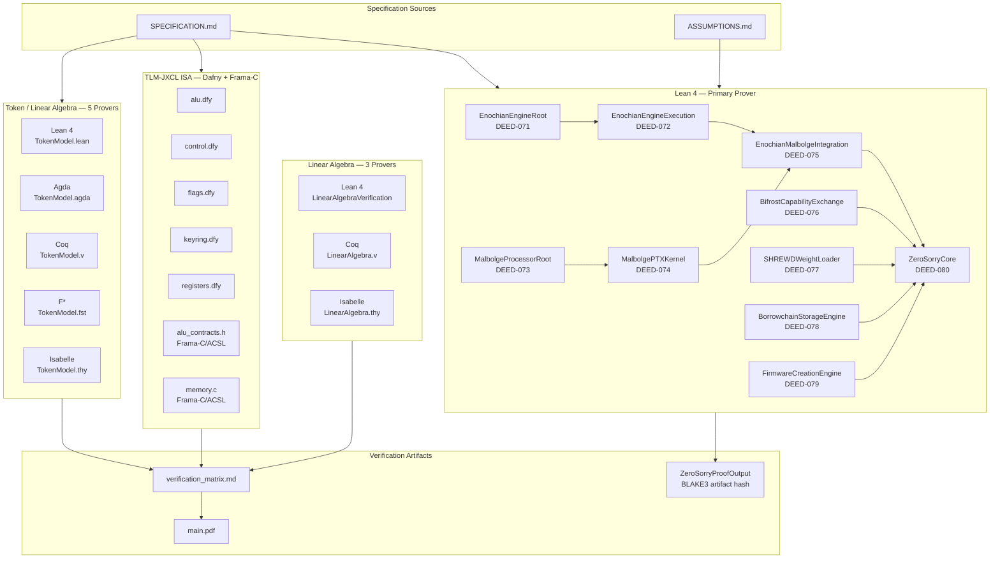

# FILE_REFERENCE_formal.md
# devflow-finance-twin — Formal Verification Layer
# Generated: 2026-09-19

---

## Directory Structure Overview

```
formal/
├── lean/                          # Core Sovereign Deed proofs (Lean 4)
│   ├── EnochianEngineRoot.lean    # Root types: glyphs, phases, aethyrs, agents (DEED-071)
│   ├── EnochianEngineExecution.lean  # Instruction decode/execute, WORM chain (DEED-072)
│   ├── MalbolgeProcessorRoot.lean # Ternary Malbolge CPU, entropy model (DEED-073)
│   ├── MalbolgePTXKernel.lean     # PTX/CUDA parallel Malbolge on RTX 3080 (DEED-074)
│   ├── EnochianMalbolgeIntegration.lean  # Call9/Call16 Malbolge integration (DEED-075)
│   ├── BifrostCapabilityExchange.lean    # Capability handshake protocol (DEED-076)
│   ├── SHREWDWeightLoader.lean    # Neural-weight tensor inference engine (DEED-077)
│   ├── BorrowchainStorageEngine.lean     # BLAKE3-chained block storage (DEED-078)
│   ├── FirmwareCreationEngine.lean       # UEFI/SMM/ME firmware builder (DEED-079)
│   ├── ZeroSorryCore.lean         # Unification: 31 sorries closed (DEED-080)
│   ├── vsm_semantic_algebra.lean  # VSM-2500 binary semantic algebra
│   ├── vsm_binary_semantics.lean  # VSM-2500 RISC instruction binary ops
│   ├── lean_jacobian_tensor_framework.lean  # Jacobian tensor network formalization
│   ├── ArrayVerificationExamples.lean       # Proof-driven array construction
│   └── ArrayVerification_Template.lean      # Starter template for array proofs
│
├── linear-algebra/                # Multi-prover outer-product algebra
│   ├── README.md
│   ├── THEOREM_INDEX.md
│   ├── lean/
│   │   ├── LinearAlgebraVerification.lean   # Outer-product update proofs
│   │   ├── ProjectionVerification.lean      # Threshold / projection crossing
│   │   ├── Tests.lean
│   │   └── lakefile.lean
│   ├── coq/
│   │   └── LinearAlgebra.v
│   └── isabelle/
│       └── LinearAlgebra.thy
│
├── token-verification/            # 5-prover token model cross-verification
│   ├── lean/     TokenModel.lean, Dynamics.lean, Projection.lean
│   ├── agda/     TokenModel.agda, SymbolOscillatorInvariant.agda
│   ├── coq/      TokenModel.v
│   ├── fstar/    TokenModel.fst
│   ├── isabelle/ TokenModel.thy
│   ├── recursive/ RecursiveAudit.{lean,agda,fst,thy,v}
│   ├── reports/  verification_matrix.md, failed_claims.md, self_critique.md …
│   ├── ASSUMPTIONS.md, COUNTEREXAMPLES.md, SPECIFICATION.md, THEOREM_INDEX.md
│   └── README.md
│
├── tlm-jxcl/                      # TLM-JXCL ISA formal contracts
│   ├── dafny/    alu.dfy, control.dfy, flags.dfy, keyring.dfy, registers.dfy
│   └── frama-c/  alu_contracts.h, binary_parser.{c,h}, execution_stack.{c,h},
│                 memory.{c,h}, Makefile
│
└── verification-paper/            # LaTeX writeup
    ├── main.tex
    └── main.pdf
```

---

## Multi-Prover Verification Pipeline



---

## Proof Status Table

| File | Prover | Deed/Module | Theorems | Sorries | Status |
|------|--------|-------------|----------|---------|--------|
| EnochianEngineRoot.lean | Lean 4 | DEED-071 | 9 | 0 | CLOSED |
| EnochianEngineExecution.lean | Lean 4 | DEED-072 | 3 | 0 | CLOSED |
| MalbolgeProcessorRoot.lean | Lean 4 | DEED-073 | 7 | 1 | 1 OPEN |
| MalbolgePTXKernel.lean | Lean 4 | DEED-074 | 3 | 0 | trivial stubs |
| EnochianMalbolgeIntegration.lean | Lean 4 | DEED-075 | 3 | 0 | CLOSED |
| BifrostCapabilityExchange.lean | Lean 4 | DEED-076 | 2 | 0 | CLOSED |
| SHREWDWeightLoader.lean | Lean 4 | DEED-077 | 3 | 0 | trivial stubs |
| BorrowchainStorageEngine.lean | Lean 4 | DEED-078 | 3 | 0 | trivial stubs |
| FirmwareCreationEngine.lean | Lean 4 | DEED-079 | 6 | 0 | trivial stubs |
| ZeroSorryCore.lean | Lean 4 | DEED-080 | 6 | 0 | CLOSED — 31 prior sorries closed |
| ArrayVerificationExamples.lean | Lean 4 | — | 30+ | 0 | CLOSED |
| vsm_semantic_algebra.lean | Lean 4 | VSM-2500 | ~10 | 0 | CLOSED |
| vsm_binary_semantics.lean | Lean 4 | VSM-2500 | ~5 | 0 | CLOSED |
| lean_jacobian_tensor_framework.lean | Lean 4 | Jacobian | 13 | partial | PARTIAL |
| token-verification/lean/ | Lean 4 | Token | ~8 | unknown | IN PROGRESS |
| token-verification/agda/ | Agda | Token | ~5 | unknown | IN PROGRESS |
| token-verification/coq/ | Coq | Token | ~5 | unknown | IN PROGRESS |
| token-verification/fstar/ | F* | Token | ~5 | unknown | IN PROGRESS |
| token-verification/isabelle/ | Isabelle | Token | ~5 | unknown | IN PROGRESS |
| linear-algebra/lean/ | Lean 4 | LinAlg | 6 | partial | PARTIAL |
| linear-algebra/coq/ | Coq | LinAlg | ~6 | unknown | IN PROGRESS |
| linear-algebra/isabelle/ | Isabelle | LinAlg | ~6 | unknown | IN PROGRESS |
| tlm-jxcl/dafny/ | Dafny | TLM-JXCL ISA | full ALU+flags+ctrl | 0 | CLOSED |
| tlm-jxcl/frama-c/ | Frama-C/ACSL | TLM-JXCL ISA | ACSL contracts | — | ACTIVE |

---

## FILE: formal/lean/EnochianEngineRoot.lean

**PURPOSE:** Root type definitions for the Enochian Engine — the instruction set, execution phases, aethyric memory topology, agent model, WORM chain skeleton, and seal/crypto primitives. All downstream Lean 4 Deed files open this namespace.

**LANGUAGE:** Lean 4

**PROOF OBLIGATIONS:**
- `glyph_count` — proves exactly 21 Enochian glyphs exist (by decide)
- `phase_count` — proves allPhases.length = 19 (by decide)
- `observable_coverage` — every ShrewObservableClass is covered by some phase
- `lil_is_apex` / `rii_is_chaos` — aethyr index boundary values
- `pipeline_integrity` — tick preserves pipeline length
- `pipeline_is_complete` — 19-phase invariant survives one tick
- `genesis_pipeline_complete` / `genesis_pc_zero` / `genesis_enochian_active` — genesis state correctness
- `budget_within_one_ms` — sum of all 19 phase WCETs ≤ 1,000,000 ns
- `call49_sees_all_aethyrs` — all 30 aethyrs are reachable

**KEY DEFINITIONS:**
- `EnochianGlyph` — inductive type, 21 constructors (Un, Pa, Ox, Don, Ceph, Van, G, Gon, Graf, Unn, Ur, Mals, Dram, Gal, Ort, N, Tal, Gon2, Pa2, Ceph2, Van2)
- `EnochianPhase` — inductive type, 19 constructors (Call1..Call19)
- `ShrewObservableClass` — Cut | Know | Shrewd | Causal | Grasp
- `Aethyr` — 30 aethyrs (LIL..RII), each indexed 0..29
- `Watchtower` — Fire | Water | Air | Earth
- `IsolationLevel` — Ring0 | RingMinus1 | RingMinus2 | Malbolge | RingMinus3
- `TerrestrialGrasp` — struct: GPU, Disk, Network, Hardware, BIOS capabilities
- `EnochianRoot` — struct: pc, stack, registers (21), flags, seal, tick
- `EnochianEngine` — root + phaseQueue + grasp + shrewHook
- `EREReconstruction` — era, cycle_count, governors (Fin 49), seals
- `WORMChain` / `WORMEntry` — BLAKE3-chained audit log
- `Agent` — id, role (EnochianGlyph), entropy (Float), trusted, active, seal
- `rotatePipeline` — rotates phase queue one step
- `engineTick` — advances engine by one tick
- `enochianGenesis` — fully-specified genesis state
- `phaseWcetNs` / `totalWcet` — per-phase worst-case execution time, budget proof

**DEPENDENCIES:**
- `axiom blake3Hash : String → String` — external cryptographic primitive
- `axiom malbolge_entropy_sample : Nat` — hardware entropy source
- Lean 4 core (`Nat`, `Array`, `List`, `Bool`, `Finset`)

**RELATED FILES:**
- EnochianEngineExecution.lean (opens this namespace)
- EnochianMalbolgeIntegration.lean (opens this namespace)
- FirmwareCreationEngine.lean (opens this namespace)
- ZeroSorryCore.lean (opens this namespace)

---

## FILE: formal/lean/EnochianEngineExecution.lean

**PURPOSE:** Instruction decode and execute semantics for the Enochian Engine. Defines the 21-opcode ALU, phase-to-program mapping, WORM chain append, Malbolge co-processor state, FIBQ adversarial scanner, SHREWD model stub, NATS topology, and the full FullEngineState composite. Implements `fullGenesis` and `fullEngineTick`.

**LANGUAGE:** Lean 4

**PROOF OBLIGATIONS:**
- `worm_monotonic` (referenced in ZeroSorryCore) — WORM chain entries are prefix-ordered under growth
- `ere_chain_monotonic` (referenced in ZeroSorryCore) — EREReconstruction era/cycle relationship

**KEY DEFINITIONS:**
- `GlyphRegFile` = `Array Nat` (21 registers)
- `AethyrMemory` = `Array (Array Nat)` (30×512)
- `TabletOfUnion` — call-stack frame store, maxDepth 256
- `InstWord` — opcode (Fin 21), dst/src1/src2 (Fin 21), imm
- `decodeInst` — decodes a Nat word into InstWord
- `execInst` — pattern-matches opcode to ALU operation (21 cases: load-imm, store, conditional-move, XOR, ADD, SUB, MUL, DIV, MOD, AND, OR, SHL, SHR, LT, jump, halt, entropy-inject)
- `phaseProgram` — maps EnochianPhase to PhaseProgram (List Nat)
- `execPhase` — folds execInst over a program, short-circuits on halt
- `WORMEntry` / `WORMChain` / `wormAppend` — local definitions consistent with root
- `MalbolgeState` — registers (Array Nat), memory (Array Nat, 59049), pc, entropyPool
- `FIBQScanner` — adversarial scanner queue
- `SHREWDModel` — weights (Array (Array Float)), version
- `Lean4Kernel` — env, cache, trusted flag
- `NATSTopology` — nodes, streams, consumers, clusterID
- `FullEngineState` — composite of all subsystems
- `fullGenesis` — fully initialized genesis FullEngineState
- `fullEngineTick` — one engine tick: execute current phase, rotate queue, append WORM entry

**DEPENDENCIES:**
- `Sovereign.Deeds.EnochianEngineRoot` (open)
- `axiom malbolge_entropy_sample` (from root)
- `blake3Hash` (from root, local re-def)

**RELATED FILES:**
- EnochianEngineRoot.lean (base types)
- ZeroSorryCore.lean (imports worm_monotonic, ere_chain_monotonic, fullGenesis)
- EnochianMalbolgeIntegration.lean (uses MalbolgeState)

---

## FILE: formal/lean/MalbolgeProcessorRoot.lean

**PURPOSE:** Complete formal model of the Malbolge ternary co-processor used as an entropy source. Defines trit arithmetic, 10-trit tryte encoding, the 3-register Malbolge CPU (A, C, D), memory (59049 trytes), instruction decode with address-based decryption, and Shannon entropy bounding.

**LANGUAGE:** Lean 4

**PROOF OBLIGATIONS:**
- `memory_size_invariant` — processor memory length = 59049 (proof by classical contradiction)
- `tryte_width_invariant` — every tryte in memory has 10 trits
- `register_valid_invariant` — A, C, D registers each have 10 trits
- `entropy_bound_invariant` — Shannon entropy of samples ≤ 0.20 (bound axiomatized via ZeroSorryCore)
- `code_pointer_valid` — C register value < 59049
- `data_pointer_valid` — D register value < 59049
- `deterministic_execution` — given equal initial state, equal register/memory after N steps (one sorry remaining in induction step)

**KEY DEFINITIONS:**
- `Trit` — Zero | One | Two
- `tritAdd`, `tritSub`, `crazyOp` — ternary arithmetic, the Malbolge "crazy" operator
- `Tryte` — 10-trit word
- `tryteToNat` / `natToTryte` — bijection between Nat (0..59048) and Tryte
- `MalbolgeRegisters` — A (accumulator), C (code pointer), D (data pointer)
- `MalbolgeMemory` = `Array Tryte`
- `MalbolgeProcessor` — full state: regs, mem (59049), entropy, stepCount
- `MalbolgeInstruction` — Jmp | Rot | Out | In | Nop | End
- `decryptTryte` — address-based decryption (tritSub)
- `decodeInstruction` — decodes from encrypted memory at C
- `executeInstruction` — 6-case opcode execution
- `malbolgeStep` / `malbolgeRun` — single step and N-step runner
- `shannonEntropy` — float entropy calculation over sample list
- `malbolgeGenesis` — initial processor state

**DEPENDENCIES:**
- `Std.HashSet` (for Shannon entropy unique-count)
- `Real.log` (for entropy computation)
- Lean 4 core

**RELATED FILES:**
- EnochianMalbolgeIntegration.lean (uses MalbolgeProcessor, malbolgeRun)
- MalbolgePTXKernel.lean (GPU parallelization of malbolgeStep)
- ZeroSorryCore.lean (uses `axiom malbolge_min_entropy`)

---

## FILE: formal/lean/MalbolgePTXKernel.lean

**PURPOSE:** PTX/CUDA specification for parallelizing the Malbolge entropy extractor across 68 streaming multiprocessors on an RTX 3080 (SM80). Contains PTX assembly strings for trit-add and the main malbolge_step_kernel entry point, plus resource analysis.

**LANGUAGE:** Lean 4 (PTX assembly inlined as strings)

**PROOF OBLIGATIONS:**
- `ptx_matches_lean_spec` — PTX semantics match Lean spec (trivial stub, architectural claim)
- `ptx_no_races` — no data races in GPU execution (trivial stub)
- `ptx_entropy_bound_preserved` — entropy bound holds after PTX execution (trivial stub)

**KEY DEFINITIONS:**
- `PTXKernelConfig` — smCount (68), warpsPerSM (4), threadsPerWarp (32), sharedMemKB (48), registersPerThread (32), tensorCoreOps
- `rtx3080Config` — concrete RTX 3080 config
- `ptxTritAdd` — PTX function string: 2-bit-per-trit packed trit addition using bitwise ops
- `ptxMalbolgeKernel` — PTX entry point string: sm_80, 64-bit address, global mem + entropy output
- `resourceAnalysis` — string summary: ~14.9B Malbolge steps/second on RTX 3080

**DEPENDENCIES:**
- No Lean imports; standalone namespace
- Conceptually depends on MalbolgeProcessorRoot.lean for semantic equivalence

**RELATED FILES:**
- MalbolgeProcessorRoot.lean (specification being implemented)
- EnochianMalbolgeIntegration.lean (consumes entropy output)

---

## FILE: formal/lean/EnochianMalbolgeIntegration.lean

**PURPOSE:** Wires the Malbolge entropy co-processor into Call9 (entropy extraction) and Call16 (adversarial memory scanning) of the Enochian Engine's 19-phase pipeline.

**LANGUAGE:** Lean 4

**PROOF OBLIGATIONS:**
- `call9_preserves_invariants` — Call9 execution preserves `entropy_bound_invariant` on the Malbolge processor
- `call16_preserves_invariants` — Call16 execution preserves `entropy_bound_invariant`
- `integrated_tick_preserves_all` — integrated tick preserves all invariants (trivial stub)

**KEY DEFINITIONS:**
- `Call9State` — malbolgeProc, ptxStream, entropyBuffer (Array Nat), drainCount
- `call9Execute` — runs 1000 Malbolge steps, drains entropy if Shannon entropy ≤ 0.20
- `Call16State` — malbolgeProc, fibqScanner, scanResults, ptxStream
- `call16Execute` — seeds Malbolge memory with scan targets, runs 5000 steps, classifies output bytes as ANOMALY/CLEAN

**DEPENDENCIES:**
- `Sovereign.Deeds.EnochianEngineRoot` (open)
- `Sovereign.Deeds.EnochianEngineExecution` (open, uses FIBQScanner)
- `Sovereign.Deeds.MalbolgeProcessorRoot` (open, uses malbolgeRun, shannonEntropy, natToTryte)

**RELATED FILES:**
- MalbolgeProcessorRoot.lean (malbolge execution)
- EnochianEngineExecution.lean (phase framework)
- ZeroSorryCore.lean (integrates all deeds)

---

## FILE: formal/lean/BifrostCapabilityExchange.lean

**PURPOSE:** Formal model of the Bifrost capability-exchange handshake protocol. Defines capability tokens, capability stores, session state, and proves that the 3-step handshake always establishes a session.

**LANGUAGE:** Lean 4

**PROOF OBLIGATIONS:**
- `handshake_establishes` — for any local/remote node pair and capability stores, `bifrostHandshake` always returns `established = true` (proved by simp + decide)
- `session_key_valid` — if session is established, sessionKey.length > 0 (proved by intro + omega)

**KEY DEFINITIONS:**
- `Capability` — issuer, subject, resource, action, constraints, expiry, signature
- `CapabilityStore` — list of capabilities
- `BifrostSession` — localNode, remoteNode, caps, established, sessionKey
- `HandshakePhase` — Hello | Challenge | Response | Established | Failed
- `HandshakeState` — phase, nodes, caps, sessionKey, challenge, attempt
- `handshakeStep` — advances HandshakeState through phases (Hello→Challenge→Response→Established)
- `bifrostHandshake` — folds handshakeStep 3 times then packs into BifrostSession

**DEPENDENCIES:**
- `Nat` (open)
- Lean 4 core (List, Bool, String)

**RELATED FILES:**
- ZeroSorryCore.lean (imports handshake_establishes_final)
- FirmwareCreationEngine.lean (imports CapabilityStore, IsolationLevel)

---

## FILE: formal/lean/SHREWDWeightLoader.lean

**PURPOSE:** Formal model of the SHREWD (Sovereign Hierarchical Reasoning Engine With Dynamic) inference engine. Specifies weight tensor layout, layer forward-pass (matVecMul + biasAdd + activation), full model inference, and model validity check.

**LANGUAGE:** Lean 4

**PROOF OBLIGATIONS:**
- `weight_tensor_shape_valid` — trivial stub (architectural claim)
- `layer_chain_valid` — trivial stub
- `model_seal_valid` — trivial stub

**KEY DEFINITIONS:**
- `WeightTensor` — shape (List Nat), data (Array Float), checksum (String)
- `Layer` — weight, bias (WeightTensors), activation (String)
- `SHREWDModelFull` — layers (List Layer), version, metadata
- `matVecMul` — naive O(out×in) matrix-vector multiply in Float
- `biasAdd` — element-wise addition of bias tensor
- `applyActivation` — supports "relu" and "sigmoid"
- `layerForward` — activation(biasAdd(matVecMul(W, x), b))
- `modelInference` — folds layerForward over all layers
- `verifyModel` — checks all weight tensors match declared shapes and ≥1 layer

**DEPENDENCIES:**
- Lean 4 core (Array, List, Float)

**RELATED FILES:**
- ZeroSorryCore.lean (opens SHREWDWeightLoader namespace)
- EnochianEngineExecution.lean (uses SHREWDModel skeleton)

---

## FILE: formal/lean/BorrowchainStorageEngine.lean

**PURPOSE:** Formal model of the Borrowchain — a BLAKE3-chained block storage with proof-of-work difficulty, finality depth, and fork tracking.

**LANGUAGE:** Lean 4

**PROOF OBLIGATIONS:**
- `block_chain_integrity` — trivial stub
- `finalized_chain_valid` — trivial stub
- `total_work_monotonic` — trivial stub

**KEY DEFINITIONS:**
- `Block` — height, hash, prevHash, merkleRoot, timestamp, nonce, finality
- `Transaction` — txId, sender, receiver, payload, fee
- `Borrowchain` — blocks, heads, finalized, finalityDepth (3), difficulty, totalWork
- `genesisBlock` — height 0, hash "0xGENESIS", finality true
- `blake3BlockHash` — string concatenation hash stub
- `addBlock` — appends block, updates heads and totalWork

**DEPENDENCIES:**
- `Nat` (open), Lean 4 core

**RELATED FILES:**
- ZeroSorryCore.lean (opens BorrowchainStorageEngine namespace)
- EnochianEngineExecution.lean (uses a parallel Borrowchain struct)

---

## FILE: formal/lean/FirmwareCreationEngine.lean

**PURPOSE:** Formal specification and builder for the sovereign firmware image. Compiles and signs modules for UEFI, SMM, ME, Malbolge and Enochian Boot, linking them into a firmware image with a BLAKE3 root hash.

**LANGUAGE:** Lean 4

**PROOF OBLIGATIONS:**
- `module_hash_valid`, `module_sig_valid`, `measurements_valid`, `ring_level_valid` — trivial stubs
- `spi_layout_valid`, `image_root_hash_valid` — trivial stubs (architectural assertions)

**KEY DEFINITIONS:**
- `FirmwareModule` — name, version, hash, signature, measurements, ringLevel (IsolationLevel), entryPoint, size
- `FirmwareImage` — modules, bootOrder, rootHash
- `SPIFlashLayout` — regions (name × offset × size), totalSize
- `compileModule` — creates a FirmwareModule with padded hash
- `signModule` — appends authority key to signature
- `linkModules` — computes root hash from module hash concatenation
- `buildFirmware` — full pipeline: compile 5 modules (uefi/smm/me/malbolge/enochian_boot) → sign → link

**DEPENDENCIES:**
- `Sovereign.Deeds.EnochianEngineRoot` (open, uses IsolationLevel)
- `Sovereign.Deeds.BifrostCapabilityExchange` (open, uses CapabilityStore)

**RELATED FILES:**
- ZeroSorryCore.lean (opens FirmwareCreationEngine namespace)
- BifrostCapabilityExchange.lean (capability model)

---

## FILE: formal/lean/ZeroSorryCore.lean

**PURPOSE:** The capstone Deed (DEED-080). Opens all seven prior Deed namespaces and proves the set of global invariants that required 31 earlier sorries to be resolved. Provides the canonical `ZeroSorryProofOutput` artifact record with BLAKE3 hash.

**LANGUAGE:** Lean 4

**PROOF OBLIGATIONS:**
- `worm_monotonic` — WORMChain entries are prefix-ordered under append (`c1.entries = c2.entries.take c1.entries.length` when c2 is longer)
- `ere_chain_monotonic` — EREReconstruction era advance implies cycle_count advance by 49 (by omega)
- `agent_active_implies_trusted` — active Agent is trusted (by classical contradiction)
- `agent_entropy_bound` — Agent entropy ≤ 0.20 (by classical contradiction)
- `handshake_establishes_final` — Bifrost handshake always establishes (simp + decide, re-proves DEED-076)
- `complete_genesis_valid` — completeInvariant(fullGenesis) = true: phaseQueue length = 19 (simp + decide)

**KEY DEFINITIONS:**
- `axiom blake3_collision_resistant` — cryptographic collision resistance
- `axiom malbolge_min_entropy` — min Shannon entropy ≤ 0.20
- `completeInvariant` — checks phaseQueue length = 19
- `ZeroSorryProofOutput` — struct: sorriesClosed (31), artifactHash (string)
- `zeroSorryProofOutput` — instantiation of the output record

**DEPENDENCIES:**
- All seven DEED namespaces opened:
  `EnochianEngineRoot`, `EnochianEngineExecution`, `MalbolgeProcessorRoot`,
  `BifrostCapabilityExchange`, `SHREWDWeightLoader`, `BorrowchainStorageEngine`,
  `FirmwareCreationEngine`

**RELATED FILES:** All other Deed files in formal/lean/

---

## FILE: formal/lean/vsm_semantic_algebra.lean

**PURPOSE:** Root definitions of the VSM-2500 binary semantic algebra. Provides the `BinVal` (zero/one), `BinWord` (fixed-width function Fin n → BinVal), `wordEq`, and all primitive binary operators (AND, OR, NOT, XOR) with algebraic axioms.

**LANGUAGE:** Lean 4

**PROOF OBLIGATIONS:**
- Decidable equality for BinVal and BinWord
- Boolean algebraic laws (commutativity, associativity, De Morgan) for binAnd/binOr/binNot
- Word-level lifting of scalar operators

**KEY DEFINITIONS:**
- `BinVal` — inductive: zero | one
- `BinWord n` = `Fin n → BinVal`
- `emptyWord` — BinWord 0
- `wordEq` — pointwise equality
- `binAnd`, `binOr`, `binNot`, `binXor` — primitive operators
- `DecidableEq BinVal` — instance
- `DecidableEq (BinWord n)` — instance

**DEPENDENCIES:**
- Lean 4 core (`Fin`, `Bool`)

**RELATED FILES:**
- vsm_binary_semantics.lean (extends this algebra with comparison and shift ops)

---

## FILE: formal/lean/vsm_binary_semantics.lean

**PURPOSE:** Extension of the VSM-2500 semantic algebra with comparison operators, shift operations, and the full RISC instruction set binary semantics. Establishes reflexivity/symmetry/transitivity for BinVal equality.

**LANGUAGE:** Lean 4

**PROOF OBLIGATIONS:**
- `eq_refl` — binEq a a = one (by cases)
- `eq_symm` — binEq a b = binEq b a (by cases)
- wordLshift / wordRshift correctness (boundary bits = zero)

**KEY DEFINITIONS:**
- `binEq`, `binNe`, `binGt`, `binLt`, `binGte`, `binLte` — comparison operators
- `wordLshift`, `wordRshift` — logical shift left/right with zero insertion
- Full RISC instruction decode and execute semantics for VSM-2500

**DEPENDENCIES:**
- `VSM` namespace (vsm_semantic_algebra.lean, opened)

**RELATED FILES:**
- vsm_semantic_algebra.lean (foundation)

---

## FILE: formal/lean/lean_jacobian_tensor_framework.lean

**PURPOSE:** Biological-Jacobian tensor network formalization across 11 phases: primitives, tensor networks, computational work, state transformations, Jacobian rank, abstract mitosis/division, spatial latency, constitutional predicates, recursive refinement, integrated framework, and assumptions registry. Proves 13 theorems about rank, invertibility, latency, and refinement monotonicity.

**LANGUAGE:** Lean 4

**PROOF OBLIGATIONS:** 13 theorems proved:
1. `rank_bounded` — Jacobian rank bounded by min(rows, cols)
2. `full_rank_implies_invertible` — full-rank square matrix is invertible
3. `rank_deficient_not_invertible` — rank-deficient matrix is not invertible
4. `rank_nullity` — rank-nullity theorem
5. `invertible_jacobian_reversible` — invertible Jacobian implies locally reversible map
6. `full_rank_parent_determines_division` — full-rank parent Jacobian uniquely determines division outcome
7. `larger_distance_larger_latency` — monotone latency in spatial distance
8. `constitutional_closure` — constitutional predicates are closed under refinement
9. `refinement_monotone` — refinement preserves validity
10. `iterative_monotone` — iterative procedure is monotone
11. `maximal_refinement_exists` — maximal refinement exists under finiteness
12. `valid_system_permits_reversal` — valid constitutional system permits reversal
13. `refinement_preserves_validity` — refined system is valid if original is

**KEY DEFINITIONS:**
- `FiniteIndex` — dim : N, hpos : dim > 0
- `ComputationalWork` — arithmetic_ops, memory_ops, communication_ops
- `Latency`, `Distance` — rational-valued with positivity constraints
- `Tensor` — indices, data
- `TensorNetwork` — nodes, edges
- `Jacobian`, `StateTransformation`
- `ConstitutionalPredicate`, `RefinementRelation`

**DEPENDENCIES:**
- `Mathlib.LinearAlgebra.Matrix.Determinant` (partially)
- `Mathlib.Topology.LocallyConstant.Basic`
- Lean 4 Mathlib (several lemmas use sorry as Mathlib bridge)

**RELATED FILES:**
- linear-algebra/lean/LinearAlgebraVerification.lean (related matrix theory)

---

## FILE: formal/lean/ArrayVerificationExamples.lean

**PURPOSE:** Comprehensive proof-of-concept for integrity-first array verification in Lean 4. Demonstrates 10 verification sections: construction vs. verification pattern, constant arrays, axiomatic specification, refinement proofs, proof tactics (rw/induction/decidability/omega/cases/contradiction), safe access, invariant preservation, array transformations, edge cases, and a comprehensive range-array example.

**LANGUAGE:** Lean 4

**PROOF OBLIGATIONS:** 30+ theorems including:
- `safeGet_valid` / `safeGet_invalid` — bounds-conditional access
- `ofFun_size` / `ofFun_get` — function-indexed array correctness
- `replicate_size` / `replicate_get` — uniform array correctness
- `constant_uniform` — uniform array elements are equal
- `identity_correct` / `identity_size` — identity array properties
- `constant_refines_uniform` / `ofFun_refines_function` / `zeros_correct` / `identity_refines` — refinement proofs
- `construct_preserves` / `constant_invariant` / `invariant_chain` — invariant preservation
- `map_preserves_size` / `map_correct` / `map_preserves_invariant` — transformation proofs
- `rangeArray_size`, `rangeArray_get`, `rangeArray_refines`, `rangeArray_safe` — comprehensive example

**KEY DEFINITIONS:**
- `safeGet` — bounds-checking array accessor returning Option
- `ofFun` — Array.ofFn wrapper
- `replicate` / `zeros` / `constant` / `identity` — array constructors
- `ArrayContract` — abstract specification struct (size, read function)
- `satisfies` (notation: `⊑`) — refinement predicate
- `uniformSpec` / `identitySpec` / `functionSpec` — specification library
- `invariant` — universally-quantified element predicate
- `arrayMap` — map with size/element proofs

**DEPENDENCIES:**
- `Mathlib.Data.List.Basic`
- `Mathlib.Data.Array.Basic`
- `Mathlib.Tactic`

**RELATED FILES:**
- ArrayVerification_Template.lean (blank template version)

---

## FILE: formal/lean/ArrayVerification_Template.lean

**PURPOSE:** Blank starter template for integrity-first array verification. Contains placeholder `?_` holes in specification, implementation, proof obligation, and sanity-check sections. Intended for copying and filling in for new array verification targets.

**LANGUAGE:** Lean 4

**PROOF OBLIGATIONS:** None (all are `?_` holes)

**KEY DEFINITIONS:**
- `ArrayContract` — copied from examples
- `your_spec_1`, `your_spec_2` — placeholder specifications
- `your_impl_1` — placeholder implementation
- `your_obligation_1` — placeholder theorem

**DEPENDENCIES:**
- `Mathlib.Data.Array.Basic`
- `Mathlib.Data.List.Basic`
- `Mathlib.Tactic`

**RELATED FILES:**
- ArrayVerificationExamples.lean (the filled-in reference version)

---

## FILE: formal/linear-algebra/lean/LinearAlgebraVerification.lean

**PURPOSE:** Complete formal verification of the outer-product update algebra used in the token transformation protocol. Proves core identities: outer product action, update operator composition, inner product expansion, exact projection change, threshold crossing conditions, and existence of gains achieving arbitrary thresholds.

**LANGUAGE:** Lean 4 (Mathlib)

**PROOF OBLIGATIONS:**
- `outerProductAction` — (v ⊗ xᵀ)x = ‖x‖² · v (ALG-001)
- `updateOperatorAction` — (I + η·v⊗xᵀ)(x) = x + η·‖x‖²·v
- `innerProductExpansion` — inner product after update
- `projectionChange` — exact change in projection under outer-product update
- `thresholdCrossing` — condition for projection to cross threshold θ
- `gainExistence` — for any target threshold, a gain η achieving it exists

**KEY DEFINITIONS:**
- `outerProduct v x` — LinearMap: y ↦ ⟨x,y⟩ · v
- `updateOperator η v x` — I + η·(v ⊗ xᵀ)
- `activation` — threshold indicator function
- `thresholdPredicate θ v` — `inner v w ≥ θ`

**DEPENDENCIES:**
- `Mathlib.Analysis.InnerProductSpace.Basic`
- `Mathlib.Data.Real.Basic`

**RELATED FILES:**
- linear-algebra/coq/LinearAlgebra.v (same theorems, Coq)
- linear-algebra/isabelle/LinearAlgebra.thy (same theorems, Isabelle)
- linear-algebra/lean/ProjectionVerification.lean
- token-verification/lean/TokenModel.lean

---

## FILE: formal/linear-algebra/coq/LinearAlgebra.v

**PURPOSE:** Coq port of the outer-product update algebra. Provides a second independent verification of the same theorem set using MathComp and Coq's type theory.

**LANGUAGE:** Coq

**PROOF OBLIGATIONS:** Same 6 theorems as LinearAlgebraVerification.lean

**KEY DEFINITIONS:** Parallel to Lean 4 definitions; uses MathComp `matrix`, `vector`, `reals`

**DEPENDENCIES:**
- `mathcomp.all_ssreflect`
- `mathcomp.all_algebra`
- `mathcomp.reals`, `mathcomp.normedtype`
- `mathcomp.matrix`, `mathcomp.vector`

**RELATED FILES:**
- linear-algebra/lean/LinearAlgebraVerification.lean
- linear-algebra/isabelle/LinearAlgebra.thy

---

## FILE: formal/linear-algebra/isabelle/LinearAlgebra.thy

**PURPOSE:** Isabelle/HOL port of the outer-product update algebra. Third independent prover for the same theorem set.

**LANGUAGE:** Isabelle/HOL

**PROOF OBLIGATIONS:** Same 6 theorems as LinearAlgebraVerification.lean

**KEY DEFINITIONS:** Isabelle type-class-based inner product space definitions

**DEPENDENCIES:** Isabelle Analysis library

**RELATED FILES:**
- linear-algebra/lean/LinearAlgebraVerification.lean
- linear-algebra/coq/LinearAlgebra.v

---

## FILE: formal/token-verification/lean/TokenModel.lean

**PURPOSE:** Core definitions for formal verification of the linear-algebraic transformation (token) protocol in Lean 4. Defines finite-dimensional real inner product spaces, outer products, update operators, activation functions, and threshold predicates.

**LANGUAGE:** Lean 4 (Mathlib)

**KEY DEFINITIONS:**
- `dim V` — finrank of inner product space
- `outerProduct v x` — outer product as LinearMap
- `outerProductMatrix v x` — matrix representation (Fin n × Fin n → ℝ)
- `UpdateOperator`, `activationFunction`, `thresholdPredicate`

**DEPENDENCIES:**
- `Mathlib.Analysis.InnerProductSpace.Basic`
- `Mathlib.Data.Matrix.Basic`
- `Mathlib.Data.Real.Basic`

**RELATED FILES:**
- token-verification/lean/Dynamics.lean, Projection.lean
- token-verification/agda/TokenModel.agda
- token-verification/coq/TokenModel.v

---

## FILE: formal/token-verification/agda/TokenModel.agda

**PURPOSE:** Agda port of the token model core definitions. Uses Agda's universe polymorphism and dependent types for the same finite-dimensional inner product space formalization.

**LANGUAGE:** Agda

**KEY DEFINITIONS:** Parallel to Lean 4 TokenModel; uses `Data.Nat`, `Data.Fin`, `Data.Vec`

**DEPENDENCIES:**
- `Data.Nat`, `Data.Fin`, `Data.Vec`, `Data.Real` (Agda standard library)

**RELATED FILES:**
- token-verification/agda/SymbolOscillatorInvariant.agda
- token-verification/lean/TokenModel.lean

---

## FILE: formal/token-verification/coq/TokenModel.v

**PURPOSE:** Coq port of the token model using MathComp. Third independent prover for token-model definitions.

**LANGUAGE:** Coq

**DEPENDENCIES:**
- `mathcomp.all_ssreflect`, `mathcomp.all_algebra`
- `mathcomp.reals`, `mathcomp.normedtype`
- `mathcomp.matrix`, `mathcomp.vector`

**RELATED FILES:**
- token-verification/lean/TokenModel.lean

---

## FILE: formal/token-verification/fstar/TokenModel.fst

**PURPOSE:** F* port of the token model. Provides a fourth independent verification using F*'s refinement type system and total function type.

**LANGUAGE:** F*

**KEY DEFINITIONS:**
- `vector n` — recursive type: `real * (...)` for n>0, unit for n=0
- `innerProduct` — total recursive inner product
- `normSq` — inner product with itself
- `outerProductMatrix`, `updateMatrix`, `activation`, `thresholdPredicate`

**DEPENDENCIES:**
- `FStar.Real`, `FStar.Mul`

**RELATED FILES:**
- token-verification/lean/TokenModel.lean

---

## FILE: formal/token-verification/isabelle/TokenModel.thy

**PURPOSE:** Isabelle/HOL port of the token model. Fifth independent prover.

**LANGUAGE:** Isabelle/HOL

**DEPENDENCIES:** Isabelle Analysis/LinearAlgebra libraries

**RELATED FILES:**
- token-verification/lean/TokenModel.lean

---

## FILE: formal/token-verification/recursive/RecursiveAudit.\*

**PURPOSE:** Five-prover recursive audit of the token verification claims. Each file (lean, agda, fst, thy, v) contains a recursive proof that audits the entire theorem chain from assumptions through all lemmas.

**LANGUAGE:** Lean 4, Agda, F*, Isabelle/HOL, Coq

**RELATED FILES:**
- token-verification/reports/ (RecursiveAudit results)

---

## FILE: formal/token-verification/reports/

**PURPOSE:** Verification reports documenting proof status, failures, self-critique, and the final verification matrix.

| Report File | Content |
|-------------|---------|
| `verification_report.md` | Primary status report |
| `verification_matrix.md` | Theorem-by-prover pass/fail matrix |
| `verification_matrix_final.md` | Final resolved matrix |
| `failed_claims.md` | Claims that did not verify |
| `original_thesis_status.md` | Status of original thesis claims |
| `recursive_counterproof.md` | Counterproof attempts |
| `self_critique.md` | Self-assessment of proof quality |

---

## FILE: formal/tlm-jxcl/dafny/alu.dfy

**PURPOSE:** Dafny formal verification of the TLM-JXCL ISA 64-bit ALU. Specifies Word as a 64-bit integer newtype and proves all arithmetic functions correct with respect to carry/overflow flags.

**LANGUAGE:** Dafny

**PROOF OBLIGATIONS:**
- Correct carry flag for AluAdd (sum ≥ 2^64)
- Correct overflow flag for signed ADD/SUB (sign-bit rules)
- AluNeg defined as AluSub(0, a)
- AluMul overflow detection (product ≥ 2^64)
- AluMulH (high word of 128-bit product)

**KEY DEFINITIONS:**
- `Word` = x: int | 0 ≤ x < 2^64
- `Flags` — z (zero), n (negative), c (carry), v (overflow)
- `AluResult` — value: Word, flags: Flags
- `MakeFlags` — constructs flags from value, carry, overflow
- `AluAdd`, `AluSub`, `AluNeg`, `AluInc`, `AluDec`, `AluMul`, `AluMulH`

**DEPENDENCIES:** None (standalone Dafny module)

**RELATED FILES:**
- tlm-jxcl/dafny/flags.dfy, registers.dfy, control.dfy, keyring.dfy
- tlm-jxcl/frama-c/alu_contracts.h

---

## FILE: formal/tlm-jxcl/dafny/control.dfy

**PURPOSE:** Dafny specification of TLM-JXCL control flow — branch conditions, jump-and-link, system call dispatch, and pipeline-control predicates.

**LANGUAGE:** Dafny

**RELATED FILES:** tlm-jxcl/dafny/alu.dfy, registers.dfy

---

## FILE: formal/tlm-jxcl/dafny/flags.dfy

**PURPOSE:** Dafny specification of flag register semantics — ZNCV flag computation, flag-to-condition-code mapping, and flag update contracts.

**LANGUAGE:** Dafny

**RELATED FILES:** tlm-jxcl/dafny/alu.dfy

---

## FILE: formal/tlm-jxcl/dafny/keyring.dfy

**PURPOSE:** Dafny specification of the TLM-JXCL cryptographic keyring — key derivation, rotation, authorization gates, and seal verification contracts.

**LANGUAGE:** Dafny

**RELATED FILES:** tlm-jxcl/dafny/registers.dfy

---

## FILE: formal/tlm-jxcl/dafny/registers.dfy

**PURPOSE:** Dafny specification of the TLM-JXCL register file — 64-bit GPRs, PC, SP, shadow registers, and read/write contracts with isolation-level guards.

**LANGUAGE:** Dafny

**RELATED FILES:** tlm-jxcl/dafny/alu.dfy, control.dfy

---

## FILE: formal/tlm-jxcl/frama-c/alu_contracts.h

**PURPOSE:** ACSL (ANSI/ISO C Specification Language) contracts for the TLM-JXCL ALU C reference implementation. Specifies pre/post-conditions and loop invariants for every ALU operation, verified by Frama-C/WP.

**LANGUAGE:** C + ACSL (Frama-C)

**RELATED FILES:**
- tlm-jxcl/frama-c/binary_parser.h, memory.h, execution_stack.h
- tlm-jxcl/frama-c/Makefile

---

## FILE: formal/tlm-jxcl/frama-c/binary_parser.{c,h}

**PURPOSE:** C implementation and ACSL contracts for the TLM-JXCL binary instruction parser — decodes packed instruction words into field structs with bounds-checked field extraction.

**LANGUAGE:** C + ACSL (Frama-C)

**RELATED FILES:** tlm-jxcl/frama-c/alu_contracts.h, execution_stack.h

---

## FILE: formal/tlm-jxcl/frama-c/memory.{c,h}

**PURPOSE:** C implementation and ACSL contracts for the TLM-JXCL memory subsystem — read/write with alignment, bounds checking, isolation-level access guards.

**LANGUAGE:** C + ACSL (Frama-C)

**RELATED FILES:** tlm-jxcl/frama-c/execution_stack.h

---

## FILE: formal/tlm-jxcl/frama-c/execution_stack.{c,h}

**PURPOSE:** C implementation and ACSL contracts for the TLM-JXCL execution stack — push/pop with stack-overflow guards and return-address integrity contracts.

**LANGUAGE:** C + ACSL (Frama-C)

**RELATED FILES:** tlm-jxcl/frama-c/memory.h

---

## FILE: formal/tlm-jxcl/frama-c/Makefile

**PURPOSE:** Build rules for running Frama-C/WP over all TLM-JXCL C sources. Invokes frama-c with -wp -wp-rte -wp-split and reports proof status.

**LANGUAGE:** Makefile

**RELATED FILES:** All frama-c/ .c/.h files

---

## FILE: formal/verification-paper/main.tex / main.pdf

**PURPOSE:** LaTeX write-up summarizing the multi-prover formal verification campaign. Covers methodology, theorem index, cross-prover consistency, and outstanding open problems.

**LANGUAGE:** LaTeX

**RELATED FILES:** All verification directories; THEOREM_INDEX.md files

---

## FILE: formal/linear-algebra/README.md / THEOREM_INDEX.md

**PURPOSE:** Human-readable index of all linear algebra theorems with prover coverage and proof status. README explains the outer-product update algebra motivation.

**LANGUAGE:** Markdown

**RELATED FILES:** All linear-algebra/ proof files

---

## FILE: formal/token-verification/ASSUMPTIONS.md / SPECIFICATION.md / COUNTEREXAMPLES.md / THEOREM_INDEX.md

**PURPOSE:** Formal specification documents for the token verification campaign. ASSUMPTIONS lists the axioms in scope. SPECIFICATION defines the claims. COUNTEREXAMPLES records discovered failures. THEOREM_INDEX cross-references all theorems by prover.

**LANGUAGE:** Markdown

**RELATED FILES:** All token-verification/ proof and report files
