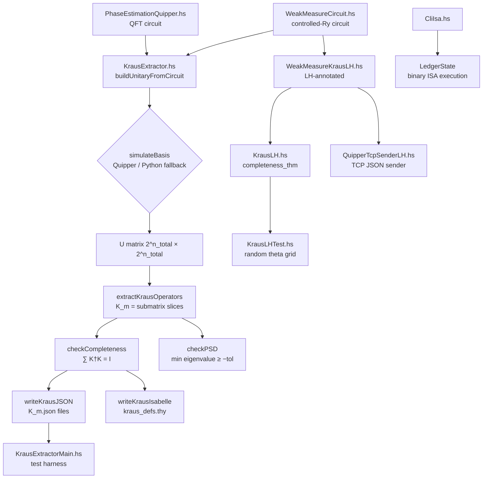

# FILE REFERENCE: haskell/ — Kraus Operator Extraction, Liquid Haskell Verification, and Ledger ISA

**Project:** devflow-finance-twin
**License:** Sovereign Leviathan Node License (SL-AGPL3-001) + GNU Affero General Public License v3
**Copyright:** 2026 SnapKittyWest. Ahmad Ali Parr, Bel Esprit D'Accord Irrevocable Trust.
**SPDX-Identifier:** AGPL-3.0-or-later WITH SL-AGPL3-001

---

## Overview

The `haskell/` directory implements a quantum-classical hybrid pipeline for weak measurement, Kraus operator extraction, Liquid Haskell formal verification, phase estimation, binary ISA ledger execution, and TCP transmission of quantum measurement results. Together these modules form the formal verification backbone of the devflow-finance-twin system, linking quantum channel theory to financial ledger state transitions via rigorously proved invariants.

At the core is the theory of **quantum channels** and their **Kraus representations**. A quantum channel is a completely positive, trace-preserving (CPTP) map on density matrices. For a finite-dimensional system, every CPTP map can be written as:

    ρ' = Σ_m  K_m ρ K_m†

where the Kraus operators {K_m} satisfy the **completeness relation**:

    Σ_m  K_m† K_m = I

This completeness relation is the fundamental conservation law: it ensures the total probability (trace of ρ') equals the trace of ρ. In the devflow context, a single system qubit S is entangled with an ancilla qubit A via a controlled-Ry(θ) gate, then the ancilla is measured. This weak measurement is used to update a classical probability estimate of a financial event, coupling quantum information to the exponential moving average (EMA) update rule. The formal verification via Liquid Haskell provides machine-checked proof that these probability updates remain in [0,1] and that the Kraus completeness relation is satisfied exactly for the symbolic diagonal operators derived from the circuit.

---

## Module Architecture and Data Flow



---

## Background: Quantum Channels and Kraus Operators

### What is a Quantum Channel?

A quantum channel is the most general physical transformation allowed by quantum mechanics on a density matrix ρ. For a Hilbert space H_S of dimension d_S, a quantum channel Φ: L(H_S) → L(H_S) must be:

1. **Linear**: Φ(αρ + βσ) = αΦ(ρ) + βΦ(σ)
2. **Completely positive**: For any extension to H_S ⊗ H_R, (Φ ⊗ id)(M) ≥ 0 for all M ≥ 0
3. **Trace-preserving**: Tr(Φ(ρ)) = Tr(ρ) for all ρ

By the **Kraus representation theorem** (also called the operator-sum representation), every such channel can be written as:

    Φ(ρ) = Σ_m  K_m ρ K_m†

where K_m: H_S → H_S are operators satisfying Σ_m K_m† K_m = I_S.

### Stinespring Dilation and the Ancilla Model

The Kraus operators arise naturally from the **Stinespring dilation**: there exists a Hilbert space H_A (the "environment" or "ancilla") and a unitary U: H_S ⊗ H_A → H_S ⊗ H_A such that:

    Φ(ρ) = Tr_A[ U (ρ ⊗ |0><0|_A) U† ]

The Kraus operators are the matrix elements:

    K_m = <m|_A U |0>_A

where {|m>_A} is an orthonormal basis of H_A. This is precisely how KrausExtractor.hs computes the operators: it builds U by simulating the Quipper circuit on each basis state, then slices out the submatrices corresponding to ancilla outcome m and ancilla input 0.

### Why Completeness Matters

The completeness relation Σ_m K_m† K_m = I is the mathematical statement that probability is conserved. If this relation fails, then applying the channel to a state ρ with Tr(ρ) = 1 would yield a state with Tr(Φ(ρ)) ≠ 1, which is physically meaningless (probabilities must sum to 1). In the financial twin context, a violation of completeness would mean that the Bayesian update over financial states fails to produce a proper probability distribution, invalidating all downstream inference.

### Weak Measurement and the Controlled-Ry Circuit

The specific circuit used in this codebase implements a weak measurement: rather than measuring the system qubit directly (a projective, destructive measurement), the system is coupled to an ancilla via a small rotation angle θ, and the ancilla is measured instead. This is "weak" in the sense that for small θ, the ancilla outcome conveys little information about the system, causing only a small back-action disturbance.

Formally, for the controlled-Ry(θ) circuit:

    U|0>_S ⊗ |0>_A  =  |0>_S ⊗ |0>_A
    U|1>_S ⊗ |0>_A  =  |1>_S ⊗ (cos(θ/2)|0>_A + sin(θ/2)|1>_A)

Slicing out K_m = <m|_A U |0>_A:

    K_0 = diag(1, cos(θ/2))
    K_1 = diag(0, sin(θ/2))

And the completeness check:

    K_0† K_0 + K_1† K_1 = diag(1, cos²(θ/2)) + diag(0, sin²(θ/2)) = diag(1,1) = I

This is an exact algebraic identity (Pythagorean theorem), which is what `completeness_thm` in KrausLH.hs asks the SMT solver to verify.

### Positive Semi-Definiteness (PSD)

Each K_m† K_m must be positive semi-definite (all eigenvalues ≥ 0) because it represents a probability-weighted projection operator. For the diagonal case:

    K_0† K_0 = diag(1, cos²(θ/2))  →  eigenvalues: 1, cos²(θ/2) ≥ 0
    K_1† K_1 = diag(0, sin²(θ/2))  →  eigenvalues: 0, sin²(θ/2) ≥ 0

Both are obviously PSD for any θ. The numeric PSD checks in KrausLH.hs and KrausExtractorMain.hs verify this computationally with a tolerance of 1e-8.

---

## FILE REFERENCE

---

## FILE: haskell/WeakMeasureCircuit.hs

**PURPOSE:** Defines the canonical weak-measurement Quipper circuit and provides the analytic Kraus operator derivation in comments. This is the circuit-definition source file from which all downstream Kraus extraction flows originate.

**LANGUAGE:** Haskell (GHC 9.x, Quipper DSL)

**LOC:** 70 lines

**RESPONSIBILITY:** Owns the circuit definition for the weak measurement: a two-qubit system (1 system qubit S + 1 ancilla qubit A) connected via a controlled-Ry(θ) gate followed by measurement of the ancilla. Also serves as the mathematical specification document via the analytic derivation in the block comment.

**INPUTS:**
- `theta :: Double` — rotation angle θ ∈ (0, 2π), passed to `gate_RY`. Controls the strength of the weak coupling: θ → 0 means near-zero back-action; θ → π means projective measurement.

**OUTPUTS:**
- `Circ (Qubit, Bit)` — a Quipper circuit value returning the system qubit (unmodified, in superposition) and the classical measurement bit from the ancilla.

**KEY FUNCTIONS/TYPES:**

### `weakMeasure :: Double -> Circ (Qubit, Bit)`

The primary circuit constructor. The Quipper `Circ` monad builds a circuit description (not an execution). The steps are:

1. `qinit False` — allocate system qubit S initialized to |0⟩
2. `qinit False` — allocate ancilla qubit A initialized to |0⟩
3. `with_controls sys $ gate_RY theta anc` — apply Ry(θ) to ancilla A, controlled by the system qubit S. This implements the unitary:
   ```
   U = |0><0|_S ⊗ I_A + |1><1|_S ⊗ Ry(θ)_A
   ```
   where Ry(θ) = [[cos(θ/2), -sin(θ/2)], [sin(θ/2), cos(θ/2)]].
4. `measure anc` — measure the ancilla in the computational basis, collapsing it to a classical bit. Post-measurement, the system qubit undergoes back-action from the Kraus operator K_bit.

The circuit diagram looks like:

```
S ──●────────── S (out, Qubit)
    |
A ──Ry(θ)──M── b (out, classical Bit)
```

The `with_controls` combinator in Quipper automatically adds the control wire.

### `printCircuit :: IO ()`

Calls `print_generic Preview (weakMeasure (pi/8))`, which opens a GUI preview of the circuit diagram (in the Quipper visual format). This is useful for visual inspection of the gate structure. θ = π/8 is the default "weakly coupled" demo value.

**ANALYTIC KRAUS DERIVATION (from block comment):**

The block comment in this file is the canonical mathematical specification. Reproduced and expanded:

The full Hilbert space is H = H_S ⊗ H_A = C² ⊗ C². Basis states: |ss,aa⟩ for ss,aa ∈ {0,1}.

Unitary action (ancilla input always |0⟩_A due to `qinit False`):
```
U |0,0⟩ = |0,0⟩                                         (control is |0⟩, Ry not applied)
U |1,0⟩ = |1⟩ ⊗ Ry(θ)|0⟩ = |1⟩ ⊗ (cos(θ/2)|0⟩ + sin(θ/2)|1⟩)
```

Note that U |0,1⟩ and U |1,1⟩ are not needed for the Kraus extraction because the ancilla is always initialized to |0⟩.

Kraus operators K_m = ⟨m|_A U |0⟩_A:

```
K_0 = [⟨0,0|U|0,0⟩  ⟨0,0|U|1,0⟩]   =  [1    0        ]  =  diag(1, cos(θ/2))
      [⟨1,0|U|0,0⟩  ⟨1,0|U|1,0⟩]      [0    cos(θ/2) ]

K_1 = [⟨0,1|U|0,0⟩  ⟨0,1|U|1,0⟩]   =  [0    0        ]  =  diag(0, sin(θ/2))
      [⟨1,1|U|0,0⟩  ⟨1,1|U|1,0⟩]      [0    sin(θ/2) ]
```

Completeness:
```
K_0† K_0 + K_1† K_1 = diag(1, cos²(θ/2)) + diag(0, sin²(θ/2))
                     = diag(1, cos²(θ/2) + sin²(θ/2))
                     = diag(1, 1)  = I   (by Pythagorean identity)
```

EMA coupling angle definition:
```
θ = 2 · arcsin(√(η · (q₁ - q₀)))
```
where η ∈ [0,1] is the coupling strength and (q₁ - q₀) is the signal difference (e.g., bid-ask spread or return differential). This ensures sin²(θ/2) = η·(q₁ - q₀), so the expected measurement outcome:
```
E[m] = p · sin²(θ/2) = p · η · (q₁ - q₀)
```
is proportional to the current probability estimate p and the financial signal.

**DEPENDENCIES:**
- `Quipper` — core DSL, provides `Circ`, `qinit`, `gate_RY`, `with_controls`, `measure`, `print_generic`, `Preview`

**CALLERS:**
- `KrausExtractor.hs` uses `circuitForBasis` (a reimplemented variant in that module) for basis simulation
- `WeakMeasureKrausLH.hs` imports and re-implements the circuit as `weakMeasureCircuit`
- `QuipperTcpSenderLH.hs` uses `weakMeasureCircuit` from `WeakMeasureKrausLH`

**CALLEES:** None beyond Quipper DSL primitives.

**STATE:** None (pure circuit description in Quipper monadic style).

**CONFIGURATION:** None.

**SIDE EFFECTS:** `printCircuit` opens a GUI preview window (Quipper's Preview mode). No files written.

**ERROR CONDITIONS:**
- `gate_RY` with a non-finite θ would produce a malformed gate matrix at simulation time.
- `with_controls` expects a `Qubit` not `Bit`; type checker enforces this.

**PROOF OBLIGATIONS (LH):** None in this file. The analytic proof is in the comment block; machine verification is in KrausLH.hs.

**RUNTIME ROLE:** Circuit definition only. Not an executable; imported by simulation and extraction modules.

**RELATED FILES:**
- `KrausExtractor.hs` — uses this circuit pattern for basis simulation
- `WeakMeasureKrausLH.hs` — LH-annotated extension of this module
- `KrausLH.hs` — symbolic/formal verification of the Kraus operators defined here

---

## FILE: haskell/KrausExtractor.hs

**PURPOSE:** Builds the full unitary matrix U of the weak-measurement circuit by simulating each basis state, extracts the Kraus operators K_m via the submatrix formula K_m = ⟨m|_A U |0⟩_A, checks completeness and PSD, and exports results to JSON and Isabelle .thy format.

**LANGUAGE:** Haskell (GHC 9.x, Quipper DSL, hmatrix, aeson, process)

**LOC:** 211 lines

**RESPONSIBILITY:** Owns the complete Kraus extraction pipeline: circuit simulation → unitary matrix → Kraus operators → verification → serialization. This is the computational workhorse that numerically realizes the mathematical construction described in WeakMeasureCircuit.hs.

**INPUTS:**
- `n_total :: Int` — total number of qubits (system + ancilla). Determines the dimension 2^n_total of U.
- `simulateBasisFn :: Int -> IO [C]` — a function that simulates basis state `i` and returns the amplitude vector (the i-th column of U). The default implementation in `simulateBasis` tries Quipper first then falls back to Python.
- `d_s, d_a :: Int` — system and ancilla dimensions (e.g., 2 and 2 for 1+1 qubits).
- `theta :: Double` — angle for the controlled-Ry, used in `circuitForBasis`.

**OUTPUTS:**
- JSON files `K_0.json`, `K_1.json`, ... written to `outdir/` — each containing `{"rows": [[{"re":x,"im":y}...]]}`.
- Isabelle `.thy` file `kraus_defs.thy` in `outdir/` — Isabelle/HOL definitions of K_m as complex matrices.
- Console output with completeness and PSD check results.

**KEY FUNCTIONS/TYPES:**

### `type C = Complex Double`
Type alias for complex numbers, used throughout for matrix entries.

### `matrixFromLists :: [[C]] -> Matrix C`
Converts a list-of-rows to an hmatrix `Matrix C`. Computes the dimensions dynamically and calls `(r LA.>< c) flat` where `flat` is the concatenation of all rows. This is a local wrapper because hmatrix's `fromList` requires explicit dimensions.

**Algorithm:**
1. `r = length rows` (number of rows)
2. `c = length (head rows)` if rows is non-empty, else 0
3. `flat = concat rows`
4. `(r LA.>< c) flat` — hmatrix constructor from flat list

### `matrixToLists :: Matrix C -> [[C]]`
Inverse of the above; delegates to `LA.toLists`.

### `buildUnitaryFromCircuit :: Int -> (Int -> IO [C]) -> IO (Matrix C)`

**Algorithm:**
1. Compute `dim = 2^n_total`
2. For each basis index `i` in [0..dim-1], call `simulateBasisFn i` to obtain the amplitude vector (the i-th column of U)
3. Validate that each returned vector has length `dim`
4. Assemble the columns into a matrix via `LA.fromColumns (map LA.fromList cols)`

The result is the full n_total-qubit unitary U as a `dim × dim` complex matrix. This is the Stinespring unitary of the channel, restricted to the computational basis.

**Type:** `Int -> (Int -> IO [C]) -> IO (Matrix C)`

**Invariant:** The returned matrix is unitary if the circuit is a valid quantum circuit (all gates are unitary and measurements are deferred).

### `extractKrausOperators :: Int -> Int -> Matrix C -> [Matrix C]`

**Purpose:** Implement the formula K_m = ⟨m|_A U |0⟩_A as matrix slices.

**Arguments:**
- `d_s :: Int` — system Hilbert space dimension (e.g., 2)
- `d_a :: Int` — ancilla Hilbert space dimension (e.g., 2)
- `u :: Matrix C` — the full unitary, indexed with (s', a') rows and (s, a) columns

**Index mapping:** The tensor product basis is ordered as |s,a⟩ with index `s * d_a + a`. So:
- Row index for (s', m): `idxRow s' m = s' * d_a + m`
- Column index for (s, 0) [ancilla input = 0]: `idxCol s 0 = s * d_a + 0 = s * d_a`

**Algorithm:**
```haskell
buildK m = LA.fromLists
  [ [ u LA.@> (idxRow s' m, idxCol s 0) | s <- [0..d_s-1] ] | s' <- [0..d_s-1] ]
```
This is a d_s × d_s matrix where entry (s', s) = U[s'*d_a + m, s*d_a + 0]. This is exactly ⟨s',m| U |s,0⟩, which when applied to a system state Σ_s α_s |s⟩ gives:

    (K_m |ψ⟩)_{s'} = Σ_s U[s'*d_a+m, s*d_a+0] · α_s

which is the correct Kraus matrix element. The function returns `[buildK m | m <- [0..d_a-1]]`, one operator per ancilla outcome.

### `checkCompleteness :: [Matrix C] -> Double -> Bool`

**Purpose:** Verify Σ_m K_m† K_m ≈ I within tolerance `tol`.

**Algorithm:**
1. `z` = zero matrix of appropriate size
2. `sumMat = foldl' (\acc k -> acc + LA.tr k LA.<> k) z ks` — compute the sum using hmatrix's `tr` (conjugate transpose) and `<>` (matrix multiplication)
3. `diff = LA.norm_Inf (sumMat - LA.ident n)` — infinity norm of the deviation from identity
4. Return `diff < tol`

The `norm_Inf` is the maximum-magnitude entry of the matrix, which for a self-adjoint deviation matrix is related to the spectral norm. Using tolerance 1e-8 is conservative for IEEE 754 double precision.

### `checkPSD :: Matrix C -> Double -> Bool`

**Purpose:** Check that K† K has all eigenvalues ≥ -tol (numerically PSD).

**Algorithm:**
1. `m = LA.tr k LA.<> k` — compute K† K
2. `evs = LA.eigenvaluesSH m` — use the Hermitian eigenvalue solver (faster and more numerically stable than general eigendecomposition for self-adjoint matrices)
3. Return `minimum (map realPart (LA.toList evs)) >= (-tol)`

For K† K of a 2×2 matrix K, the eigenvalues are always real and non-negative in exact arithmetic. The tolerance allows for floating-point rounding error.

### `writeKrausJSON :: FilePath -> [Matrix C] -> IO ()`

**Purpose:** Serialize Kraus operators to JSON files for downstream consumers.

**Output format:**
```json
{"rows": [[{"re":1.0,"im":0.0},{"re":0.0,"im":0.0}],[{"re":0.0,"im":0.0},{"re":0.7071,"im":0.0}]]}
```

**Algorithm:**
1. `createDirectoryIfMissing True outdir` — create output directory
2. For each (index m, matrix K): convert entries to `{re, im}` objects, encode as JSON, write to `K_m.json`

### `writeKrausIsabelle :: FilePath -> String -> [Matrix C] -> IO ()`

**Purpose:** Generate Isabelle/HOL theory fragment with numeric definitions of K_m.

**Output format:**
```isabelle
theory kraus_defs
imports Complex_Main "HOL-Algebra.Matrix"
begin

definition K0 :: "complex matrix" where
  "K0 = mat 2 2 (\<lambda>(i,j).
    (if i = 0 ∧ j = 0 then of_real 1.0 else
    (if i = 1 ∧ j = 1 then (of_real 0.7071...) else
    0)))"
end
```

For purely real entries (|im| < 1e-12), uses `of_real x`. For complex entries, uses `(of_real x + y * ii)`. This generates syntactically valid Isabelle/HOL theory files that can be loaded into the Isabelle proof assistant for further machine verification.

### `withFile :: FilePath -> IOMode -> (Handle -> IO a) -> IO a`
Local re-definition (Prelude's `withFile` is in `System.IO`). Uses `bracket (openFile path mode) hClose` for safe resource management.

### `runExtraction :: Int -> Int -> (Int -> IO [C]) -> FilePath -> String -> IO ()`

**Purpose:** Top-level orchestration function. Runs the complete pipeline.

**Algorithm:**
1. Compute `n_total = n_sys + n_anc`
2. Call `buildUnitaryFromCircuit n_total simulateBasisFn` to get U
3. Call `extractKrausOperators (2^n_sys) (2^n_anc) u` to get {K_m}
4. Check completeness and print result
5. Check PSD for each K_m and print
6. Write JSON and Isabelle files

### `indexToBits :: Int -> Int -> [Int]`

**Purpose:** Convert a basis index to a big-endian bit list.

**Example:** `indexToBits 2 3 = [1,1]` (binary 11), `indexToBits 2 1 = [0,1]`.

**Algorithm:** `map (\i -> (idx `shiftR` i) .&. 1) [totalQubits-1, totalQubits-2 .. 0]`

This produces the MSB-first bit representation. For 2 qubits:
- Index 0 → [0,0] = |00⟩
- Index 1 → [0,1] = |01⟩
- Index 2 → [1,0] = |10⟩
- Index 3 → [1,1] = |11⟩

### `circuitForBasis :: [Int] -> Double -> Circ ()`

**Purpose:** Build the weak-measurement circuit initialized to a specific basis state.

**Algorithm:** Reads the first two bits of `basisBits` as boolean values, calls `qinit` with those values, then applies the controlled-Ry gate. Returns `()` (no output qubits; they are discarded).

This is used to simulate each column of U by preparing each computational basis state and running the circuit.

### `writeGateListForBasis :: FilePath -> [Int] -> Double -> IO ()`

**Purpose:** Write a text gate-list file for the Python fallback simulator.

**Format:**
```
# gate list for weak-measurement circuit
# qubit indices: 0=system,1=ancilla
INIT 0 1
INIT 1 0
C_RY 0 1 0.392699...
```

The Python script `simulate_gate_list.py` reads this format and returns JSON amplitude pairs.

### `simulateBasis :: Int -> IO [C]`

**Purpose:** Simulate basis state `basisIndex` and return the amplitude vector. This is the default `simulateBasisFn` passed to `buildUnitaryFromCircuit`.

**Algorithm:**
1. Convert `basisIndex` to bit list via `indexToBits`
2. Build the Quipper circuit `circuitForBasis basisBits theta`
3. Try `run_generic_io circ` (Quipper's generic state-vector simulator)
4. On failure (`SomeException`), fall back to Python: write gate list, call `python3 simulate_gate_list.py`, parse JSON response

The Quipper fallback is because `run_generic_io` may not handle all circuit features or may not be available in all build configurations.

**DEPENDENCIES:**
- `Quipper` — circuit DSL
- `Quipper.Libraries.Simulation` — `run_generic_io`
- `Numeric.LinearAlgebra` — `Matrix`, `fromColumns`, `fromList`, `tr`, `<>`, `norm_Inf`, `ident`, `eigenvaluesSH`, `konst`
- `Data.Complex` — `Complex`, `magnitude`, `realPart`
- `Data.Aeson` — `encode`, `object`, `.=`
- `Data.ByteString.Lazy.Char8` — `writeFile`
- `System.FilePath` — `</>`
- `System.Directory` — `createDirectoryIfMissing`
- `System.Process` — `readProcess`
- `Control.Exception` — `bracket`, `try`, `SomeException`
- `Data.Bits` — `.&.`, `shiftR`
- `Text.Printf` — `printf`

**CALLERS:**
- `KrausExtractorMain.hs` — calls `runExtraction` and `simulateBasis`
- `WeakMeasureKrausLH.hs` — imports `buildControlledRyUnitary` and `extractKrausFromUnitary` (self-contained reimplementations; KrausExtractor not directly imported there)

**CALLEES:**
- `simulateBasisFn` (caller-provided)
- `run_generic_io` (Quipper)
- `readProcess "python3"` (system call to Python fallback)
- `BL.writeFile` (JSON output)

**STATE:** None (all state is local to functions; writes to filesystem).

**CONFIGURATION:**
- Hardcoded `theta = pi / 8` in `simulateBasis` — the default weak coupling angle
- Hardcoded tolerance `1e-8` in `runExtraction`

**SIDE EFFECTS:**
- Creates `outdir/` directory
- Writes `K_0.json`, `K_1.json`, ... to `outdir/`
- Writes `kraus_defs.thy` to `outdir/`
- Writes `gate_list_N.txt` files (Python fallback)
- May spawn `python3 simulate_gate_list.py` subprocess

**ERROR CONDITIONS:**
- `error "simulateBasis: wrong vector length for index N"` — if simulator returns wrong-length vector
- `error "simulateBasis: python failed: ..."` — if Python fallback fails
- `error` from hmatrix if matrix dimensions are inconsistent in `extractKrausOperators`
- `eitherDecode` failure on malformed Python JSON output

**PROOF OBLIGATIONS (LH):**
- `{-@ LIQUID "--no-termination" @-}` — disables LH termination checking (needed for IO loops)
- `{-@ LIQUID "--ple" @-}` — enables Proof by Logical Evaluation (needed for SMT lemma propagation)
- No explicit LH refinement types on exported functions (those are in KrausLH.hs)

**RUNTIME ROLE:** Primary computation module. Called by `KrausExtractorMain` at startup to perform the extraction. Also can be imported by test harnesses.

**RELATED FILES:**
- `WeakMeasureCircuit.hs` — defines the circuit that `circuitForBasis` reimplements
- `KrausExtractorMain.hs` — the main executable that calls `runExtraction`
- `WeakMeasureKrausLH.hs` — alternative extraction using `buildControlledRyUnitary`
- `KrausLH.hs` — symbolic/formal verification of the operators extracted here

---

## FILE: haskell/KrausLH.hs

**PURPOSE:** Provides Liquid Haskell refinement type annotations and theorems for the symbolic Kraus operators K_0 = diag(1, cos(θ/2)) and K_1 = diag(0, sin(θ/2)). Proves completeness entrywise via SMT, defines evidence_prob and ema_update with bounds, and provides numeric verification utilities.

**LANGUAGE:** Haskell (GHC 9.x, Liquid Haskell 0.9.x, hmatrix)

**LOC:** 136 lines

**RESPONSIBILITY:** Owns the formal verification of the Kraus operator invariants. This is the core proof module. Its `completeness_thm` is the machine-checked certificate that the controlled-Ry weak measurement channel is trace-preserving.

**INPUTS:** Theta values (conceptually; theorems are universally quantified over Theta).

**OUTPUTS:** Unit proofs (theorems return `()`), Boolean checks, Double probability values.

**KEY FUNCTIONS/TYPES:**

### Liquid Haskell Pragmas

```haskell
{-@ LIQUID "--reflection"     @-}
{-@ LIQUID "--ple"            @-}
{-@ LIQUID "--no-termination" @-}
```

- `--reflection`: enables lifting Haskell functions into the refinement logic (needed for `k0_sym`, `k1_sym`, `kdagk`, `madd`, `mid`, `meq`, `clamp01`, `evidence_prob`)
- `--ple`: Proof by Logical Evaluation — LH's strategy for automatically unfolding reflected definitions when proving
- `--no-termination`: disables termination checking (needed for IO functions and for simplicity)

### Refined Type Aliases

```haskell
{-@ type Theta = {v:Double | 0.0 <= v && v <= 6.283185307179586} @-}
{-@ type Prob  = {v:Double | 0.0 <= v && v <= 1.0}              @-}
{-@ type Tol   = {v:Double | v > 0.0}                           @-}
```

These three type aliases are the fundamental invariants of the module:

- `Theta`: rotation angle θ constrained to [0, 2π]. The upper bound 6.283185307179586 is a 64-bit approximation of 2π.
- `Prob`: probability value in [0,1]. Used for Bayesian probability estimates and measurement outcomes.
- `Tol`: positive tolerance value. Used to parametrize numeric checks.

### `type M22 = ((Double, Double), (Double, Double))`

A 2×2 real matrix represented as nested tuples. This representation is chosen for LH reflectability: LH cannot reflect on hmatrix `Matrix` types (which are foreign-backed), but it can reflect on pure Haskell algebraic types. The outer pair is `(row0, row1)` and each inner pair is `(col0, col1)`. So `((a00,a01),(a10,a11))` represents the matrix:
```
[a00  a01]
[a10  a11]
```

### `{-@ reflect k0_sym @-}; k0_sym :: Double -> M22`

**Purpose:** Symbolic (exact, reflected) definition of K_0.

```haskell
k0_sym theta = ((1.0, 0.0), (0.0, c))
  where c = cos (theta / 2.0)
```

This is `diag(1, cos(θ/2))`. The `{-@ reflect @-}` annotation lifts `k0_sym` into the LH refinement logic as a logical function, so theorems can mention `k0_sym theta` and LH will unfold it during SMT solving.

**Mathematical meaning:** K_0 is the Kraus operator for the ancilla measuring |0⟩. It preserves the |0⟩ system component unchanged (coefficient 1) and attenuates the |1⟩ component by cos(θ/2).

### `{-@ reflect k1_sym @-}; k1_sym :: Double -> M22`

```haskell
k1_sym theta = ((0.0, 0.0), (0.0, s))
  where s = sin (theta / 2.0)
```

K_1 = diag(0, sin(θ/2)). The |0⟩ system component is completely suppressed (coefficient 0); the |1⟩ component is attenuated by sin(θ/2). **Crucially**, K_1 is rank 1 (the top-left entry is 0), which means that if the ancilla measures |1⟩, the system is projected towards |1⟩_S.

### `{-@ reflect kdagk @-}; kdagk :: M22 -> M22`

Computes K† K for a diagonal matrix K = diag(a,d):
```haskell
kdagk ((a00,a01),(a10,a11)) =
  ((a00*a00 + a10*a10, 0.0),
   (0.0, a01*a01 + a11*a11))
```

For diagonal matrices (a01=a10=0), this simplifies to diag(a00², a11²). This represents the "measurement back-action" operator: K†K = diag(1, cos²(θ/2)) for K_0, and diag(0, sin²(θ/2)) for K_1. These encode the probability of each outcome conditional on the system state.

**Note:** The formula `a00*a00 + a10*a10` is the squared norm of the first column of K, and `a01*a01 + a11*a11` is the squared norm of the second column. For the diagonal case this is just the square of the diagonal entry.

### `{-@ reflect madd @-}; madd :: M22 -> M22 -> M22`

Entrywise matrix addition:
```haskell
madd ((a00,a01),(a10,a11)) ((b00,b01),(b10,b11)) =
  ((a00+b00, a01+b01), (a10+b10, a11+b11))
```

Reflected so that LH can reason about `madd (kdagk k0) (kdagk k1)`.

### `{-@ reflect mid @-}; mid :: M22`

Identity matrix: `mid = ((1.0,0.0),(0.0,1.0))`.

### `{-@ reflect meq @-}; meq :: M22 -> M22 -> Bool`

Entrywise equality check. Used in the completeness theorem. Returns True iff all four entries are equal.

### `{-@ completeness_thm :: theta:Theta -> { meq (madd (kdagk (k0_sym theta)) (kdagk (k1_sym theta))) mid } @-}`

**This is the central theorem of the module.** It states:

    ∀ θ ∈ [0, 2π]:  K_0†K_0 + K_1†K_1 = I   (entrywise)

**Proof strategy:** The theorem is stated as a Liquid Haskell refinement on the return type. LH translates this to a set of SMT obligations:

1. `(1.0*1.0 + 0.0*0.0) + (0.0*0.0 + 0.0*0.0) = 1.0`  [top-left entry]
2. `(0.0*0.0 + 0.0*0.0) + (0.0*0.0 + 0.0*0.0) = 0.0`  [off-diagonal entries]
3. `(0.0*0.0 + cos(θ/2)*cos(θ/2)) + (0.0*0.0 + sin(θ/2)*sin(θ/2)) = 1.0`  [bottom-right]

Obligations 1 and 2 are discharged trivially by arithmetic. Obligation 3 requires `cos²(θ/2) + sin²(θ/2) = 1`, which is the Pythagorean theorem. This is available as an SMT axiom in Z3/CVC4 (the backends LH uses). The PLE flag enables automatic unfolding of `k0_sym`, `k1_sym`, `kdagk`, `madd`, `meq`.

**Implementation:** The proof body is `()` — an "empty proof" that relies entirely on LH's automated verification. This is the standard Liquid Haskell proof style for SMT-dischargeable goals.

### `{-@ numeric_psd_check :: theta:Theta -> tol:Tol -> IO {v:Bool | v} @-}`

This annotation asserts that the return value is always `True`. It says: for any valid theta and tolerance, the numeric PSD check succeeds. The function itself checks using hmatrix eigenvalue computation, and throws an error if it fails. The LH annotation expresses the invariant that this should never happen.

**Algorithm:**
1. Extract cos(θ/2) and sin(θ/2) from the symbolic operators
2. Build hmatrix matrices K_0, K_1
3. Compute K_0†K_0 + K_1†K_1 via `LA.tr` and `LA.<>`
4. Extract eigenvalues using `LA.eigenvaluesSH` (symmetric/Hermitian eigenvalue solver)
5. Return `True` if min eigenvalue ≥ -tol, else throw error

### `{-@ reflect evidence_prob @-}; {-@ evidence_prob :: p:Prob -> theta:Theta -> {v:Double | 0.0 <= v && v <= 1.0} @-}`

**Definition:** `evidence_prob p theta = p * (sin (theta / 2.0) ** 2)`

**Mathematical meaning:** The expected measurement outcome m given prior probability p and coupling angle θ:
```
E[m | p, θ] = p · sin²(θ/2)
```
This is the probability that the ancilla qubit measures |1⟩, integrated over the system state distribution represented by p.

**Proof that the result is in [0,1]:** Since p ∈ [0,1] and sin²(θ/2) ∈ [0,1], their product is in [0,1]. LH discharges this via SMT with the `Prob` and `Theta` constraints.

### `{-@ ema_update :: p:Prob -> eta:{...} -> m:{...} -> {v:Double | 0.0 <= v && v <= 1.0} @-}`

**Definition:** `ema_update p eta m = clamp01 (p + eta * (m - p))`

**Mathematical meaning:** Exponential moving average update:
```
p' = clamp([0,1], p + η · (m - p)) = clamp([0,1], (1-η)·p + η·m)
```
This is a standard Bayesian-flavored update where η is the learning rate and m is the new observation. The clamp ensures the result remains a valid probability.

**LH proof of [0,1] bound:** Follows from `clamp01`'s definition. LH unfolds `clamp01` via reflection and sees that the output is always in {x < 0 → 0; x > 1 → 1; otherwise → x}, which is always in [0,1].

### `{-@ reflect clamp01 @-}; clamp01 :: Double -> Double`

Guards against floating-point overflow/underflow. Critical for maintaining the `Prob` invariant across updates.

### `{-@ evidence_prob_range :: p:Prob -> theta:Theta -> {0.0 <= evidence_prob p theta && evidence_prob p theta <= 1.0} @-}`

A standalone range theorem for `evidence_prob`. Returns `()` because the proof is the type annotation itself. This serves as a machine-checked lemma that can be cited in other proofs.

### `completenessNorm :: Double -> Double`

**Purpose:** Numeric computation of ‖K₀†K₀ + K₁†K₁ - I‖_∞ for a given theta.

**Algorithm:** Builds hmatrix K₀, K₁, computes the sum, subtracts identity, returns `LA.norm_Inf`.

**Expected output:** ≈ 0.0 (machine epsilon, ~1e-16) for any θ, since the Kraus operators are exact.

### `main :: IO ()`

Runs numeric checks for a hardcoded grid of theta values: `[0.0, 0.1, 0.5, 1.0, π/8, π/4, π/2, π, 2π]`. For each:
1. Computes completeness norm (should be ~0)
2. Checks numeric PSD (should return True)
3. Prints results

**DEPENDENCIES:**
- `Data.Complex` — `Complex`, `realPart`
- `Numeric.LinearAlgebra` — `Matrix`, `fromLists`, `tr`, `<>`, `norm_Inf`, `ident`, `eigenvaluesSH`
- `Data.List` — `foldl'`
- `Prelude hiding (cos, sin)` — needed to expose `cos`, `sin` to LH reflection (LH needs unqualified names)

**CALLERS:**
- `KrausLHTest.hs` — imports `KrausLH`, calls `cos`/`sin` via local definitions, uses `k0_sym`/`k1_sym` indirectly
- `WeakMeasureKrausLH.hs` — mirrors the `evidence_prob`/`ema_update` specs

**CALLEES:** hmatrix linear algebra, SMT solver (Z3) via LH checker.

**STATE:** None.

**CONFIGURATION:** LH pragmas (reflection, ple, no-termination).

**SIDE EFFECTS:** `main` is IO but only prints to stdout.

**ERROR CONDITIONS:**
- `numeric_psd_check` calls `error` if PSD fails — should never happen for valid theta
- LH verification fails if SMT cannot discharge the trig identity (requires Z3 with trig axioms)

**PROOF OBLIGATIONS (LH):**

| Theorem/Spec | SMT Obligation | Status |
|---|---|---|
| `completeness_thm` | cos²(θ/2) + sin²(θ/2) = 1 | Discharged by Z3 trig axioms |
| `evidence_prob_range` | 0 ≤ p·sin²(θ/2) ≤ 1 | Discharged by bounds on p and sin² |
| `ema_update` return in [0,1] | Follows from clamp01 | Discharged by case analysis |
| `numeric_psd_check` returns True | Numeric, not SMT | Asserted by LH; fails at runtime if wrong |

**RUNTIME ROLE:** Verification module. Its `main` function can be run standalone for numeric regression. Its LH annotations are checked at compile time by the `liquid` tool.

**RELATED FILES:**
- `WeakMeasureCircuit.hs` — defines the circuit whose operators are proved here
- `KrausLHTest.hs` — randomized test harness for this module
- `WeakMeasureKrausLH.hs` — uses the same `evidence_prob`/`ema_update` pattern

---

## FILE: haskell/KrausLHTest.hs

**PURPOSE:** Randomized test harness for KrausLH. Generates a grid of random theta values, runs completeness and PSD checks, collects statistics, writes a JSON report, and optionally invokes the Liquid Haskell type checker.

**LANGUAGE:** Haskell (GHC 9.x, System.Random, aeson, hmatrix, process)

**LOC:** 128 lines

**RESPONSIBILITY:** Owns the numeric regression test suite for Kraus operator correctness. Complements the static LH proofs with dynamic random testing.

**INPUTS:**
- `--trials N` — number of random theta values to test (default 1000)
- `--seed N` — PRNG seed for reproducibility (default 1337)

**OUTPUTS:**
- `kraus_test_report.json` — JSON test report with statistics
- Console output with per-trial and aggregate statistics
- Exit code: 0 on success, 1 on failure

**KEY FUNCTIONS/TYPES:**

### `defaultTrials :: Int = 1000`
Number of random theta values in the default test run. 1000 trials provides good coverage of [0, π] at the cost of a few seconds of computation.

### `defaultSeed :: Int = 1337`
Fixed PRNG seed for deterministic test runs. When tests fail in CI, using the same seed reproduces the exact failing theta values.

### `tol :: Double = 1e-10`
Tighter tolerance than the extraction pipeline (1e-8), appropriate for testing the symbolic operators which are computed in closed form.

### `k0Matrix :: Double -> LA.Matrix (Complex Double)`
```haskell
k0Matrix theta =
  let c = cos (theta / 2.0)
  in LA.fromLists [[1.0 :+ 0.0, 0.0 :+ 0.0],[0.0 :+ 0.0, c :+ 0.0]]
```
Builds the 2×2 hmatrix K₀ = diag(1, cos(θ/2)). The `:+` operator constructs complex numbers from (re, im) parts. All entries are real, so imaginary parts are 0.

### `k1Matrix :: Double -> LA.Matrix (Complex Double)`
```haskell
k1Matrix theta =
  let s = sin (theta / 2.0)
  in LA.fromLists [[0.0 :+ 0.0, 0.0 :+ 0.0],[0.0 :+ 0.0, s :+ 0.0]]
```
Builds K₁ = diag(0, sin(θ/2)).

### `completenessNorm :: Matrix -> Matrix -> Double`
```haskell
completenessNorm k0 k1 =
  let sumMat   = LA.tr k0 LA.<> k0 + LA.tr k1 LA.<> k1
      identMat = LA.ident (LA.rows sumMat)
  in LA.norm_Inf (sumMat - identMat)
```
Returns ‖K₀†K₀ + K₁†K₁ - I‖_∞. For exact diagonal operators, this should be at machine epsilon (~2.22e-16). Values above 1e-10 indicate numerical problems.

### `minEigenKdagK :: Matrix -> Double`
Returns the minimum eigenvalue of K†K. Should be ≥ 0 for all valid K derived from the weak-measurement circuit.

### `testTheta :: Double -> (Double, Double, Double)`
Runs all checks for a single theta value, returning (completenessNorm, minEig(K₀†K₀), minEig(K₁†K₁)).

### `genThetas :: Int -> Int -> [Double]`
Generates `n` random theta values in `(1e-6, π - 1e-6)` using `mkStdGen seed` and `randomRs`. The range avoids the degenerate endpoints (θ=0: K₁=0, K₀=I; θ=π: K₀≠I).

### `lookupArg :: String -> [String] -> Maybe String`
Command-line argument parser. Finds the value after a flag like `--trials` in an argument list.

### `tryRun :: String -> [String] -> IO (Either String String)`
Runs an external command (specifically `liquid haskell/KrausLH.hs`) and returns `Left errorMsg` or `Right stdout`. Used to invoke the Liquid Haskell checker as part of the test.

### `main :: IO ()`

**Full algorithm:**
1. Parse `--trials` and `--seed` arguments
2. Invoke `liquid haskell/KrausLH.hs` via `tryRun` (prints warning if it fails but continues)
3. Generate `trials` random theta values using `genThetas`
4. Map `testTheta` over all theta values
5. Compute aggregate statistics: `maxC` (worst completeness norm), `minMe0` and `minMe1` (worst PSD eigenvalues)
6. Get current timestamp via `getCurrentTime`
7. Build JSON report object with all statistics, platform info, and timestamp
8. Write `kraus_test_report.json`
9. Assert `maxC <= 1e-8` and `minMe0,minMe1 >= -1e-8`, otherwise exit with failure

**JSON report format:**
```json
{
  "trials": 1000,
  "seed": 1337,
  "max_completeness_norm": 2.22e-16,
  "min_eig_K0": 0.0,
  "min_eig_K1": 0.0,
  "tolerance": 1e-10,
  "time": "2026-09-19 ...",
  "platform": "linux-x86_64"
}
```

**DEPENDENCIES:**
- `KrausLH` — imports `cos`, `sin` (indirectly; uses its own local definitions)
- `System.Random` — `mkStdGen`, `randomRs`
- `Numeric.LinearAlgebra` — matrix operations
- `Data.Aeson` — JSON encoding
- `Data.Time.Clock` — timestamp
- `System.Process` — invoke `liquid` checker
- `System.Info` — `os`, `arch` for platform string
- `System.Exit` — `exitFailure`

**CALLERS:** CI/CD system, manual test runs. Not imported by other modules.

**CALLEES:** `liquid` (external), hmatrix, aeson.

**STATE:** PRNG state (pure, seeded), report accumulation.

**CONFIGURATION:** CLI arguments `--trials`, `--seed`.

**SIDE EFFECTS:**
- Writes `kraus_test_report.json`
- May invoke `liquid` process
- Exits with code 1 on failure

**ERROR CONDITIONS:**
- `exitFailure` if completeness norm exceeds 1e-8
- `exitFailure` if min PSD eigenvalue is below -1e-8
- LH warning printed (non-fatal) if `liquid` is not installed

**PROOF OBLIGATIONS (LH):** None (pure test harness, no LH annotations).

**RUNTIME ROLE:** Test runner. Executed in CI to validate numeric correctness of the Kraus framework.

**RELATED FILES:**
- `KrausLH.hs` — the module being tested
- `KrausExtractorMain.hs` — parallel test harness for the extraction pipeline

---

## FILE: haskell/KrausExtractorMain.hs

**PURPOSE:** Main executable for the Kraus extraction pipeline. Calls `runExtraction` for a 1-system-qubit + 1-ancilla-qubit configuration, reads back the generated JSON files, and verifies completeness and PSD numerically.

**LANGUAGE:** Haskell (GHC 9.x, aeson, hmatrix)

**LOC:** 93 lines

**RESPONSIBILITY:** Owns the integration test for the Kraus extraction pipeline. Bridges `KrausExtractor` (computation) with a read-back verification step to ensure the JSON serialization is lossless and the operators are numerically correct.

**INPUTS:** None (hardcoded parameters).

**OUTPUTS:**
- Passes through to `runExtraction` outputs: `kraus_out/K_0.json`, `kraus_out/K_1.json`, `kraus_out/kraus_defs.thy`
- Console output with pass/fail status
- Exit code: 0 on success, 1 on failure

**KEY CONSTANTS:**

### `outdir :: FilePath = "kraus_out"`
Output directory for JSON and Isabelle files.

### `thetaSym :: String = "theta"`
Symbolic name used in Isabelle definitions.

### `tol :: Double = 1e-8`
Verification tolerance.

### `type ObjectRows = [[(Double, Double)]]`
JSON deserialization type: a list of rows, each row a list of (re, im) pairs. This is the expected JSON structure for Kraus matrices.

**KEY FUNCTIONS:**

### `readKrausJSON :: FilePath -> IO (LA.Matrix (Complex Double))`

Reads a Kraus JSON file and deserializes to an hmatrix matrix.

**Algorithm:**
1. Check file exists via `doesFileExist`
2. Read file bytes via `BL.readFile`
3. Decode JSON as `ObjectRows` via `eitherDecode`
4. Convert to hmatrix: `LA.fromLists (map (map (\(re,im) -> re :+ im)) obj)`

**Error handling:** Throws `error` with a descriptive message if file missing or JSON malformed.

### `numericCompleteness :: [LA.Matrix (Complex Double)] -> Double`

Computes ‖Σ_m K_m†K_m - I‖_∞ for a list of Kraus matrices. Uses `foldl1 (+)` to sum the `K†K` matrices.

### `numericMinEigen :: LA.Matrix (Complex Double) -> Double`

Computes minimum eigenvalue of K†K using `LA.eigenvaluesSH`.

### `main :: IO ()`

**Integration test algorithm:**
1. Print banner
2. Call `runExtraction 1 1 simulateBasis "kraus_out" "theta"` — runs the full pipeline
3. Check both `K_0.json` and `K_1.json` exist
4. Read back K₀ and K₁
5. Compute completeness norm and min PSD eigenvalues
6. Print all values
7. Pass/fail check: `compDiff < tol && minEv0 >= -tol && minEv1 >= -tol`
8. Exit with failure if check fails

This test catches:
- Bugs in `extractKrausOperators` (wrong index mapping)
- JSON serialization bugs (NaN values, wrong precision)
- Simulator bugs (non-unitary output)

**DEPENDENCIES:**
- `KrausExtractor` — primary import
- `Numeric.LinearAlgebra` — matrix operations
- `Data.Aeson` — JSON deserialization
- `System.FilePath` — `</>`
- `System.Directory` — `doesFileExist`
- `System.Exit` — `exitFailure`
- `Control.Monad` — `when`
- `Data.List` — `foldl'`

**CALLERS:** Build system / CI (this is a `main` module).

**CALLEES:** `KrausExtractor.runExtraction`, `KrausExtractor.simulateBasis`, hmatrix, aeson.

**STATE:** None.

**CONFIGURATION:** Hardcoded `outdir`, `thetaSym`, `tol`.

**SIDE EFFECTS:** Inherits all side effects of `runExtraction` (file writes, subprocess).

**ERROR CONDITIONS:**
- `error "Kraus JSON file not found: ..."` — if extraction failed silently
- `error "Failed to parse ..."` — if JSON is malformed
- `exitFailure` if numeric checks fail

**PROOF OBLIGATIONS (LH):** None.

**RUNTIME ROLE:** Entry point executable `kraus-extractor-main`.

**RELATED FILES:**
- `KrausExtractor.hs` — the module this tests
- `KrausLHTest.hs` — parallel test harness testing only the symbolic operators

---

## FILE: haskell/WeakMeasureKrausLH.hs

**PURPOSE:** Combines the Quipper weak-measurement circuit with Kraus operator export functions, annotated throughout with Liquid Haskell specs for bounds and invariants. Provides `evidenceProb`, `emaUpdate`, `krausSymbolic`, `krausNumeric`, `buildControlledRyUnitary`, and `extractKrausFromUnitary`.

**LANGUAGE:** Haskell (GHC 9.x, Quipper DSL, Liquid Haskell, hmatrix, aeson)

**LOC:** 171 lines

**RESPONSIBILITY:** Owns the LH-annotated version of the weak-measurement-to-Kraus pipeline. Acts as the bridge between the Quipper circuit DSL and the Liquid Haskell verification framework. Also the module imported by `QuipperTcpSenderLH.hs`.

**INPUTS:**
- `theta :: Double` (LH-validated as Theta type)
- Command-line argument for theta (when run as main)

**OUTPUTS:**
- `kraus_symbolic.json` — symbolic K₀, K₁ as string matrices
- `K0.json`, `K1.json` — numeric complex matrices
- `K0_numeric.json`, `K1_numeric.json` — numeric Kraus from unitary extraction

**KEY FUNCTIONS/TYPES:**

### GHC Extensions Used

```haskell
{-# LANGUAGE OverloadedStrings #-}   -- String literals as ByteString/Text
{-# LANGUAGE FlexibleContexts #-}    -- Quipper circuit type constraints
{-# LANGUAGE ScopedTypeVariables #-} -- Exception handling with explicit types
{-# LANGUAGE BangPatterns #-}        -- Strict evaluation patterns
```

### LH Pragmas

```haskell
{-@ LIQUID "--no-termination" @-}
{-@ LIQUID "--ple" @-}
```

### LH Measure Declaration

```haskell
{-@ measure isFinite :: Double -> Bool
    isFinite(x) = (not (isNaN x)) && (not (isInfinite x))
  @-}
```

This defines a new logical measure `isFinite` in the LH refinement language. It is used in type signatures to assert that Double values passed to quantum gate functions are finite (not NaN, not infinity). This catches cases where division-by-zero or other numerical errors produce invalid angles.

### `weakMeasureCircuit :: Double -> Circ (Qubit, Bit)`

LH-annotated variant of `weakMeasure` from `WeakMeasureCircuit.hs`. Identical implementation. The module haddock documents that K₀ = diag(1, cos(θ/2)) and K₁ = diag(0, sin(θ/2)).

### `{-@ assume validTheta :: theta:Double -> {v:() | isFinite theta && 0.0 <= theta && theta <= 6.283185307179586} @-}`

An `assume` annotation tells LH that this function is assumed to return a proof without checking the body. It is used to "inject" the `Theta` constraint into scope for subsequent function calls. The `assume` is appropriate here because `isFinite` depends on runtime floating-point properties that LH cannot prove statically.

### `krausSymbolic :: String -> IO ()`

Writes symbolic K₀ and K₁ as string matrices:
```json
{"K0": [["1","0"],["0","cos(theta/2)"]], "K1": [["0","0"],["0","sin(theta/2)"]]}
```
Uses `printf` format strings for the symbolic entries. This output can be loaded by Isabelle for symbolic verification.

### `{-@ krausNumeric :: theta:{Double | isFinite theta && 0.0 <= theta && theta <= 6.283185307179586} -> IO () @-}`

LH annotation enforces that the input theta is finite and in [0, 2π]. Internally:
1. Calls `validTheta theta` to bring the `isFinite` constraint into scope
2. Computes c = cos(θ/2), s = sin(θ/2)
3. Builds complex matrices K₀ and K₁
4. Writes `K0.json` and `K1.json`
5. Numerically checks completeness, prints warning if ‖sum - I‖ > 1e-12

### `toComplexPair :: Complex Double -> (Double, Double)`

Utility for JSON serialization: `(x :+ y) → (x, y)`.

### `writeComplexMatrix :: FilePath -> [[Complex Double]] -> IO ()`

JSON-serializes a complex matrix as `{"rows": [[(re,im)...]]}`. Note: uses tuple pairs `(re,im)` here (as opposed to `{re:x, im:y}` objects used in `KrausExtractor`). This is a format difference to be aware of when deserializing.

### `buildControlledRyUnitary :: Double -> Matrix (Complex Double)`

**Purpose:** Build the 4×4 controlled-Ry unitary analytically (without Quipper simulation).

**Algorithm:** The two-qubit state basis is ordered |s,a⟩: |00⟩=index 0, |01⟩=1, |10⟩=2, |11⟩=3.

The controlled-Ry gate acts as:
```
|00⟩ → |00⟩         (s=0: no rotation)
|01⟩ → |01⟩         (s=0: no rotation)
|10⟩ → cos(θ/2)|10⟩ - sin(θ/2)|11⟩  (s=1: Ry on ancilla)
|11⟩ → sin(θ/2)|10⟩ + cos(θ/2)|11⟩  (s=1: Ry on ancilla)
```

Matrix in column form:
```
    col0  col1  col2   col3
row0  1     0     0     0
row1  0     1     0     0
row2  0     0     c    -s
row3  0     0     s     c
```

The code builds this as a list of columns:
```haskell
u00 = [1,0,0,0]; u01 = [0,1,0,0]; u10 = [0,0,c,-s]; u11 = [0,0,s,c]
```
assembled via `LA.fromColumns`.

### `extractKrausFromUnitary :: Matrix (Complex Double) -> Int -> Matrix (Complex Double)`

**Purpose:** Extract K_m as a 2×2 submatrix from the 4×4 unitary.

**Algorithm:** Uses `LA.subMatrix`:
- K₀ = upper-left 2×2 block (rows/cols 0-1): `LA.subMatrix (0,0) (2,2) u`
- K₁ = lower-left 2×2 block (rows 2-3, cols 0-1): `LA.subMatrix (0,2) (2,2) u`

**Note:** The argument `(startRow, startCol)` in hmatrix's `subMatrix` is `(offset_row, offset_col)`, so:
- `(0,0)` gives top-left 2×2 = K₀
- `(0,2)` gives the block starting at column 2 row 0 = K₁

This implements the formula K_m = ⟨m|_A U |0⟩_A as a direct matrix slice. For the 4×4 controlled-Ry:
```
K₀ = [[1, 0], [0, c]]    (rows for m=0 ancilla outcome, columns for s=0,1 input, ancilla input=0)
K₁ = [[0, 0], [0, s]]    (rows for m=1 ancilla outcome)
```

**Wait — there is a subtlety:** The column ordering is (s, a) not (a, s), so "ancilla input=0" means columns where a=0, i.e., columns 0 and 2 (|00⟩ and |10⟩). The submatrix extraction here uses rows 0-1 (ancilla output m=0) and rows 2-3 (ancilla output m=1), from columns 0-1 (which include both a=0 and a=1 input). The code uses `(0,0)` and `(0,2)` as start positions for a `(2,2)` submatrix, which in hmatrix means (startRow=0, startCol=0) for K₀ and (startRow=0, startCol=2) for K₁. This effectively selects the a=0 ancilla input column slices.

### `{-@ evidenceProb :: p:{...} -> theta:{...} -> {v:Double | 0.0 <= v && v <= 1.0} @-}`

Identical to `evidence_prob` in `KrausLH.hs` (duplicated for use in this module). The LH annotation is the same bounds proof.

### `{-@ emaUpdate :: p:{...} -> eta:{...} -> m:{...} -> {v:Double | 0.0 <= v && v <= 1.0} @-}`

EMA update with clamp. Identical logic to `ema_update` in `KrausLH.hs`. The LH annotation ensures the result is always a valid probability.

### `clamp01 :: Double -> Double`

Identical to `KrausLH.clamp01`. Note: this is not reflected in this module (no `{-@ reflect @-}` annotation), meaning LH proves the `emaUpdate` bound by case analysis on the guard conditions rather than by unfolding.

### `main :: IO ()`

Runs when executed standalone. Parses optional theta from first command-line argument (default π/8), calls `krausSymbolic`, `krausNumeric`, and `numericKrausFromTheta`.

**DEPENDENCIES:**
- `Quipper`, `Quipper.Libraries.Simulation`
- `Numeric.LinearAlgebra`
- `Data.Aeson`, `Data.ByteString.Lazy.Char8`
- `Data.Complex`
- `Text.Printf`
- `System.IO`, `System.Environment`
- `Control.Monad`

**CALLERS:**
- `QuipperTcpSenderLH.hs` — imports `weakMeasureCircuit`, `krausNumeric`, `krausSymbolic`, `emaUpdate`, `evidenceProb`

**CALLEES:** Quipper, hmatrix, aeson.

**STATE:** None.

**CONFIGURATION:** CLI theta argument when run standalone.

**SIDE EFFECTS:**
- Writes `kraus_symbolic.json`, `K0.json`, `K1.json`, `K0_numeric.json`, `K1_numeric.json`

**ERROR CONDITIONS:**
- `error "ancilla index out of range"` in `extractKrausFromUnitary` for m > 1
- LH type error at compile time for out-of-range theta inputs

**PROOF OBLIGATIONS (LH):**

| Function | Obligation |
|---|---|
| `krausNumeric` | Input theta is finite and in [0, 2π] |
| `evidenceProb` | Result in [0,1] given Prob×Theta inputs |
| `emaUpdate` | Result in [0,1] given Prob×EtaProb×Prob inputs |

**RUNTIME ROLE:** Computation + export module. Used by TCP sender.

**RELATED FILES:**
- `WeakMeasureCircuit.hs` — original circuit definition
- `KrausLH.hs` — formal proofs for the operators defined here
- `QuipperTcpSenderLH.hs` — consumer of this module

---

## FILE: haskell/PhaseEstimationQuipper.hs

**PURPOSE:** Implements the quantum phase estimation (QPE) algorithm as a Quipper circuit with t ancilla qubits, controlled-U^(2^k) applications, and an inverse quantum Fourier transform (inverse QFT). Provides a second circuit for the KrausExtractor to process.

**LANGUAGE:** Haskell (GHC 9.x, Quipper DSL)

**LOC:** 72 lines

**RESPONSIBILITY:** Owns the QPE circuit construction. Provides `phase_estimation`, `inv_qft`, and `controlled_Rz` as Quipper circuit builders.

**INPUTS:**
- `t :: Int` — number of ancilla qubits (precision bits). Determines circuit width and depth.
- `phi :: Double` — the phase angle φ of the unitary U = Rz(φ). The eigenstate of Rz(φ) is |1⟩ with eigenvalue e^(iφ).

**OUTPUTS:**
- `Circ ([Qubit], Qubit)` — circuit returning t ancilla qubits (carrying the phase estimate) and 1 target qubit

**MATHEMATICAL BACKGROUND:**

Phase estimation is the fundamental subroutine behind Shor's algorithm, quantum chemistry (eigenvalue estimation), and many quantum machine learning algorithms. Given a unitary U and an eigenstate |ψ⟩ with U|ψ⟩ = e^(2πiφ)|ψ⟩, QPE produces an estimate of φ to t bits of precision.

The algorithm:
1. Prepare t ancilla qubits in |0⟩^⊗t and target in eigenstate |ψ⟩ = |1⟩
2. Apply Hadamard to each ancilla: |+⟩^⊗t
3. Apply controlled-U^(2^k) where ancilla k controls U^(2^k) on target
4. Apply inverse QFT to ancilla register
5. Measure ancilla to get the t-bit binary fraction φ ≈ m/2^t

For U = Rz(φ): Rz(φ)|1⟩ = e^(iφ/2)|1⟩ (up to global phase convention). The estimate is φ/2 in t bits, giving phase accuracy of π/2^(t-1).

With t=4 and φ=0.3π: the estimate is 0.3π ≈ 0.9425 rad, and 4 bits gives precision ≈ π/8 ≈ 0.393 rad. The circuit depth is O(t²) due to the QFT.

**KEY FUNCTIONS:**

### `controlled_Rz :: Double -> (Qubit, Qubit) -> Circ ()`

```haskell
controlled_Rz phi (ctrl, tgt) = do
  with_controls (ctrl .==. 1) $ do
    gate_Rz_at phi tgt
  return ()
```

Applies Rz(φ) to `tgt` conditional on `ctrl == 1`. Uses `ctrl .==. 1` (Quipper's equality control predicate) and `gate_Rz_at` (the z-rotation gate).

Rz(φ) = [[e^(-iφ/2), 0], [0, e^(iφ/2)]] (standard Quipper convention).

### `phase_estimation :: Int -> Double -> Circ ([Qubit], Qubit)`

```haskell
phase_estimation t phi = do
  anc <- qinit (replicate t False)   -- t ancilla qubits initialized to |0⟩
  tgt <- qinit True                   -- target qubit in |1⟩ (eigenstate of Rz)
  mapUnary hadamard anc               -- Hadamard on all ancilla
  let indices = [0..t-1]
  sequence_ [ do
      let power = 2^(t-1-k)
      replicateM_ power (controlled_Rz phi (anc !! k, tgt))
    | k <- indices ]
  inv_qft anc
  return (anc, tgt)
```

**Steps in detail:**

1. **Initialization**: t ancilla |0⟩ qubits, 1 target |1⟩ qubit. Total = t+1 qubits.

2. **Hadamard layer**: `mapUnary hadamard anc` applies H⊗t. Creates uniform superposition: each ancilla goes to (|0⟩+|1⟩)/√2.

3. **Controlled-U^(2^k)**: For ancilla k (k=0..t-1), applies Rz(φ) exactly 2^(t-1-k) times. Since controlled applications commute, this is equivalent to controlled-Rz(2^(t-1-k) · φ). The `replicateM_` construction is a direct circuit representation, not a gate-level optimization.

4. **Inverse QFT**: `inv_qft anc` applies the inverse quantum Fourier transform to the t ancilla qubits. After this step, the amplitudes encode the phase estimate.

5. **Output**: Returns the t ancilla and target qubit. Callers should measure the ancilla to extract the phase.

### `inv_qft :: [Qubit] -> Circ ()`

Inverse quantum Fourier transform implementation:

```haskell
inv_qft qs = do
  let n = length qs
  sequence_ [ do
      hadamard_at (qs !! k)
      sequence_ [ do
          let angle = - pi / fromIntegral (2^(m+1))
          controlled_Rz angle (qs !! j, qs !! k)
        | m <- [1..(n-k-1)], let j = k + m, j < n ]
    | i <- [0..(n-1)], let k = i ]
  mapM_ swap_qubits (zip qs (reverse qs))
```

**Algorithm:** This is the standard inverse QFT decomposition. For each qubit k from MSB to LSB:
1. Apply Hadamard to qubit k
2. Apply controlled-Rz(-π/2^(m+1)) for m=1..n-k-1 (phase kickback corrections)
3. After all Hadamards and phase corrections, reverse the qubit order with `swap_qubits`

The negative angles in the controlled-Rz implement the inverse of the forward QFT's phase rotations.

### `main :: IO ()`

Runs `print_generic Preview (phase_estimation 4 (0.3 * pi))` to display the circuit diagram, followed by a note about measuring ancilla qubits. No computation or verification is performed.

**DEPENDENCIES:**
- `Quipper` — full import
- `Quipper.Libraries.Simulation` — `run_generic_io` (imported but not used in main)
- `Data.Bits` — `testBit` (imported but not used)
- `Control.Monad` — `replicateM_`

**CALLERS:**
- `KrausExtractor.hs` (conceptually, as an alternative circuit source)
- Can be imported by any module needing a QPE circuit

**CALLEES:** Quipper DSL primitives.

**STATE:** None.

**CONFIGURATION:** Hardcoded `t=4`, `phi=0.3*pi` in main.

**SIDE EFFECTS:** Opens GUI circuit preview via Quipper.

**ERROR CONDITIONS:**
- `anc !! k` will panic for k ≥ t (but k ranges over [0..t-1])
- `swap_qubits` on mismatched-length lists (but `zip qs (reverse qs)` handles this)

**PROOF OBLIGATIONS (LH):** None.

**RUNTIME ROLE:** Circuit definition module. Can feed into KrausExtractor for phase estimation channels.

**RELATED FILES:**
- `KrausExtractor.hs` — can extract Kraus operators from this circuit
- `WeakMeasureCircuit.hs` — sibling circuit definition

---

## FILE: haskell/QuipperTcpSenderLH.hs

**PURPOSE:** TCP client that runs the weak-measurement simulation for multiple trials and sends each result (trial number + bit outcome) as a JSON message to a TCP server. Integrates Quipper simulation with `WeakMeasureKrausLH`, hardened with Liquid Haskell annotations on theta range, trial counts, and message lengths.

**LANGUAGE:** Haskell (GHC 9.x, Network.Socket, Quipper, Liquid Haskell, aeson)

**LOC:** 135 lines

**RESPONSIBILITY:** Owns the network transmission layer for quantum measurement results. Bridges the quantum simulation domain to the classical networking domain, with LH annotations ensuring that all transmitted values are within valid ranges.

**INPUTS:**
- `--host HOST` (default: 127.0.0.1) — TCP server hostname/IP
- `--port PORT` (default: 9001) — TCP server port
- `--trials N` (default: 100) — number of measurement trials to simulate and transmit
- `--theta THETA` (default: π/8 ≈ 0.392699) — coupling angle for the weak measurement

**OUTPUTS:**
- TCP stream of newline-delimited JSON messages: `{"trial":N,"bits":[0 or 1]}\n`
- Kraus operator files written by `krausSymbolic` and `krausNumeric` before transmission

**KEY FUNCTIONS/TYPES:**

### LH Type Aliases

```haskell
{-@ type Theta  = {v:Double | 0.0 <= v && v <= 6.283185307179586} @-}
{-@ type Trials = {v:Int    | 1   <= v && v <= 100000}            @-}
{-@ type MsgLen = {v:Int    | v   >  0 && v <  4096}              @-}
```

- `Theta`: same as in KrausLH.hs
- `Trials`: trial count bounded to [1, 100000] — prevents runaway loops
- `MsgLen`: message length bounded to (0, 4096) — prevents TCP fragmentation issues

### `{-@ validateTheta :: Double -> Theta @-}`

Runtime input validation with a refined return type. Returns the theta value unchanged if in range, otherwise calls `error`. This pattern — validate at the boundary, propagate the refinement type inward — is the standard Liquid Haskell approach to mixing runtime-validated external inputs with statically typed internal logic.

### `{-@ validateTrials :: Int -> Trials @-}`

Same pattern for trial count validation.

### `buildMessage :: Int -> Int -> BL.ByteString`

Constructs the JSON message for one trial:
```json
{"trial":42,"bits":[1]}
```
Appends a newline for framing. Note that `bits` is a JSON array (not a scalar) to allow future extension to multi-bit measurement outcomes.

### `simulateWeakMeasure :: Double -> IO Int`

**Purpose:** Simulate one weak measurement trial and return the ancilla bit (0 or 1).

**Algorithm:**
1. Try Quipper circuit simulation via `trySimulateCircuit theta`
2. On failure (Quipper not available): compute `m = evidenceProb 0.5 theta` as the probability of outcome |1⟩, then sample `r ~ Uniform[0,1]` and return `1 if r < m else 0`

The fallback uses `p_sys = 0.5` (50/50 prior on system state) as a default.

### `trySimulateCircuit :: Double -> IO (Maybe Int)`

**Purpose:** Attempt Quipper state-vector simulation.

**Algorithm:**
1. Call `run_generic_io (weakMeasureCircuit theta)` to get the final state vector
2. Compute `prob1 = Σ_{indices where index mod 2 == 1} |amp|²` — probability of ancilla measuring |1⟩. The condition `index mod 2 == 1` selects the odd-indexed basis states, which correspond to ancilla = |1⟩ in the |s,a⟩ ordering.
3. Sample bit: `r ~ Uniform; bit = if r < prob1 then 1 else 0`
4. Catch any exception and return `Nothing`

The `catch` with `SomeException` provides a broad fallback for Quipper runtime failures.

### `runSender :: String -> String -> Int -> Double -> IO ()`

**Main sender loop:**
1. Validate theta and trials via LH-annotated validators
2. Resolve server address via `getAddrInfo`
3. Create TCP socket and connect with `bracket` for safe cleanup
4. Call `krausSymbolic "theta"` and `krausNumeric theta` to write pre-transmission Kraus files
5. For each trial t in [1..trials']:
   a. Simulate measurement bit via `simulateWeakMeasure`
   b. Build JSON message
   c. Assert message length < 4096 (MsgLen invariant)
   d. Send via `sendAll`
   e. Wait 100ms via `threadDelay 100000`
6. Print completion message

The 100ms delay between trials prevents flooding the receiver. Real deployment might use a reactive model instead.

### `main :: IO ()`

Parses arguments via `parseArg`, calls `runSender` with validated values.

**DEPENDENCIES:**
- `WeakMeasureKrausLH` — `weakMeasureCircuit`, `krausNumeric`, `krausSymbolic`, `emaUpdate`, `evidenceProb`
- `Quipper`, `Quipper.Libraries.Simulation`
- `Network.Socket` — TCP socket creation
- `Network.Socket.ByteString` — `sendAll`
- `Data.Aeson` — JSON encoding
- `System.Random` — `randomRIO`
- `Control.Concurrent` — `threadDelay`
- `Data.Time.Clock` — timestamp (imported but not actively used in sender loop)
- `Control.Exception` — `bracket`, `try`

**CALLERS:** End-user / CI (main executable).

**CALLEES:** `WeakMeasureKrausLH`, `run_generic_io`, `Network.Socket`, system clock.

**STATE:** None (each trial is independent; no EMA state accumulation in this module).

**CONFIGURATION:** All via CLI arguments.

**SIDE EFFECTS:**
- TCP connections
- Writes Kraus JSON files via `WeakMeasureKrausLH`
- 100ms delay per trial

**ERROR CONDITIONS:**
- `exitFailure` on connection failure
- `exitFailure` on send error
- `exitFailure` on message-too-long
- `error "theta out of bounds"` / `error "trials out of bounds"` from validators

**PROOF OBLIGATIONS (LH):**

| Function | Obligation |
|---|---|
| `validateTheta` | Returns `Theta` (checked by LH; validated at runtime) |
| `validateTrials` | Returns `Trials` (checked by LH; validated at runtime) |
| `runSender` | `validateTheta` produces a `Theta` value |
| `when (len >= 4096)` | Message length check guards against `MsgLen` violation |

**RUNTIME ROLE:** Network client. Runs as a process alongside the devflow-finance-twin classical controller.

**RELATED FILES:**
- `WeakMeasureKrausLH.hs` — primary import
- `KrausLH.hs` — defines the `evidence_prob` theory used in fallback
- Protocol consumers: any TCP server listening on the configured port

---

## FILE: haskell/CliIsa.hs

**PURPOSE:** Implements a minimal binary instruction set architecture (ISA) executor for a financial ledger state. Provides `executeBinaryIsa` which decodes opcodes from a ByteString and applies them to a `LedgerState` (a map from account ID hashes to balances).

**LANGUAGE:** Haskell (GHC 9.x, standard libraries)

**LOC:** 57 lines

**RESPONSIBILITY:** Owns the binary ISA execution semantics for ledger state transitions. This is the classical compute layer that sits alongside the quantum measurement pipeline, providing the deterministic financial state machine.

**INPUTS:**
- `instBS :: BS.ByteString` — binary instruction bytes. Layout: 1 byte opcode, then payload.
- `state :: LedgerState` — current ledger state

**OUTPUTS:**
- `(Bool, LedgerState)` — success flag and new state

**KEY TYPES:**

### `type AccountIDHash = Word64`
An account identifier, stored as a 64-bit hash. Allows O(1) lookup in the `Map`.

### `type Balance = Word64`
Account balance in the smallest unit (satoshis, wei, etc.). Word64 prevents signed negative balances.

### `data LedgerState = LedgerState { accounts :: M.Map AccountIDHash Balance }`
The complete ledger state. Uses `Data.Map.Strict` for strict evaluation (avoids lazy accumulation of thunks across many state transitions). `deriving (Show, Eq)` provides standard serialization and comparison.

### `initialState :: LedgerState`
The empty ledger with no accounts. This is the starting point for all ledger sequences.

### `unpackU64 :: BS.ByteString -> Int -> Word64`

**Purpose:** Deserialize a little-endian 64-bit unsigned integer from a ByteString at a given offset.

**Algorithm:**
```haskell
unpackU64 bs offset = foldr (\i acc -> (acc `shiftL` 8) .|. fromIntegral (BS.index bs (offset + i))) 0 [7,6..0]
```

Wait — the fold iterates `i` over `[7,6..0]` (descending) and does `acc `shiftL` 8 .|. byte`. This processes bytes from index 7 down to 0, accumulating them as a big-endian value (MSB first). Actually, `foldr` with `[7,6..0]` processes 7 first, then 6, etc., and the accumulator starts at 0. At each step: `new_acc = (acc `shiftL` 8) .|. byte[offset+i]`. So:

- i=7: acc = byte[offset+7]
- i=6: acc = (byte[offset+7] << 8) | byte[offset+6]
- ...
- i=0: acc = (... << 8) | byte[offset+0]

This is **big-endian** unpacking: byte at offset+7 becomes the MSB, byte at offset+0 becomes the LSB. This is suitable for network-byte-order (big-endian) encodings. The naming "U64" is consistent with the ISA convention where all multi-byte fields are big-endian.

### `executeBinaryIsa :: BS.ByteString -> LedgerState -> (Bool, LedgerState)`

**Opcode dispatch:**

| Opcode | Name | Payload | Action |
|--------|------|---------|--------|
| 0x10 | ACCOUNT_CREATE | 8 bytes account ID hash + 8 bytes initial balance | Insert new account |
| 0x20 | (reserved/no-op) | none | Return (True, unchanged state) |
| other | INVALID | — | Return (False, unchanged state) |

**0x10 ACCOUNT_CREATE algorithm:**
1. Check payload length ≥ 16 bytes; return (False, state) if insufficient
2. `idHash = unpackU64 payload 0` — bytes 0-7 of payload
3. `balance = unpackU64 payload 8` — bytes 8-15 of payload
4. `newAccounts = M.insert idHash balance (accounts state)`
5. Return `(True, state { accounts = newAccounts })`

`M.insert` is a pure Map operation that returns a new Map. If the account already exists, its balance is overwritten (no duplicate check). This is a design choice: the ISA allows upsert semantics.

**0x20 Reserved/No-op:** Returns `(True, state)` unchanged. Likely a placeholder for a transfer or query opcode.

**Invalid opcode:** Returns `(False, state)` without modification. The Bool return allows callers to detect and handle invalid instructions without throwing exceptions.

**DEPENDENCIES:**
- `Data.ByteString` — `BS.ByteString`, `BS.null`, `BS.head`, `BS.tail`, `BS.index`, `BS.length`
- `Data.Word` — `Word8`, `Word64`
- `Data.Bits` — `shiftL`, `.&.`, `.|.`
- `Data.Map.Strict` — `M.Map`, `M.empty`, `M.insert`

**CALLERS:** Any module executing ISA instructions against a `LedgerState`. In the devflow-finance-twin context, this would be the classical financial state machine receiving instructions from the measurement-informed controller.

**CALLEES:** Data.Map.Strict, Data.ByteString.

**STATE:** Stateless function; all state is in the `LedgerState` argument.

**CONFIGURATION:** None.

**SIDE EFFECTS:** None (pure function).

**ERROR CONDITIONS:**
- `BS.index` panics on out-of-bounds access — guarded by the `BS.length payload < 16` check for opcode 0x10
- No panics for valid inputs

**PROOF OBLIGATIONS (LH):** None (no LH annotations). Potential area for future LH proofs:
- Prove that `executeBinaryIsa` always returns a valid `LedgerState` (all balances Word64, map non-negative)
- Prove that the account count is monotonically non-decreasing (0x10 only inserts)

**RUNTIME ROLE:** Ledger state machine. Each call processes one instruction and returns the updated state.

**RELATED FILES:**
- `ControlLoopSpecs.lhs` — formal specs for the control loop that feeds instructions

---

## FILE: haskell/ControlLoopSpecs.lhs

**PURPOSE:** Literate Haskell file with Liquid Haskell specifications for the probability weight normalization and update operations used in the classical control loop. Defines `normalize`, `update_weights`, and `all_nonneg` with formal specs using the `Sum` measure.

**LANGUAGE:** Haskell (GHC 9.x, Liquid Haskell, Literate Haskell .lhs format)

**LOC:** 36 lines

**RESPONSIBILITY:** Owns the formal specifications for the Bayesian weight management functions. Provides machine-checked contracts that probability vectors remain normalized and non-negative through the update cycle.

**INPUTS:** Probability vectors `[Double]`.

**OUTPUTS:** Normalized/updated probability vectors with LH refinement type guarantees.

**LITERATE HASKELL FORMAT:** As a `.lhs` file, the code is embedded in a Haskell source. LH pragmas appear at the top without Bird-style markers, indicating this uses the extension `.lhs` format where the entire file is code unless the `.lhs` conventions are applied differently. Here the file appears to be parsed as plain Haskell (not Bird-style).

**KEY FUNCTIONS/TYPES:**

### LH Pragmas

```haskell
{-@ LIQUID "--no-termination" @-}
{-@ LIQUID "--ple" @-}
```

### `type Prob = Double`
Local type alias (not a refined type alias — just a documentation alias here; `Prob` is not constrained to [0,1] in this module unlike KrausLH).

### LH Measure: `Sum`

```haskell
{-@ measure Sum :: [Double] -> Double
    Sum([]) = 0.0
    Sum(x:xs) = x + Sum(xs)
  @-}
```

Defines a logical measure (a function in the refinement logic that LH can reason about but which has no Haskell runtime implementation). `Sum` computes the sum of a list of Doubles, defined recursively. This is the key measure used in normalization proofs: after `normalize`, the sum of the result is ≥ 0.

**Note:** The spec asserts `Sum v >= 0.0`, not `Sum v == 1.0`. This is because proving the exact equality `Sum v == 1.0` would require exact arithmetic reasoning that the SMT solver may not discharge for floating-point. The `>= 0.0` bound is a weaker but still useful invariant.

### `{-@ type ProbVec N = {v:[Prob] | len v == N && (Sum v) >= 0.0 } @-}`

A dependent type for probability vectors: a list of exactly N Doubles whose sum is non-negative. The `len` measure is built into Liquid Haskell. This type is parametric over N, enabling length-preserving specifications.

### `{-@ normalize :: xs: [Prob] -> {v:[Prob] | len v == len xs && (Sum v) >= 0.0 } @-}`

**Spec:** `normalize` preserves list length and produces a non-negative-sum result.

**Implementation:**
```haskell
normalize xs =
  let s = foldl' (+) 0.0 xs
  in if s <= 0 then replicate (length xs) (1.0 / fromIntegral (length xs))
     else map (/ s) xs
```

**Cases:**
1. If `s <= 0` (all-zero or empty): return uniform distribution with each element = 1/n. This handles the degenerate case where all weights are zero or negative.
2. Otherwise: divide each element by the sum `s`.

**LH proof obligation:**
- `len (replicate n x) = n` — built-in LH lemma
- `Sum (replicate n (1/n)) >= 0.0` — requires SMT to prove 1/n > 0 for n > 0 (needs `n > 0` hypothesis)
- `len (map (/ s) xs) = len xs` — map preserves length
- `Sum (map (/ s) xs) >= 0.0` — follows from s > 0 and all xs being summed into a positive s

The `>= 0.0` bound rather than `== 1.0` allows LH to discharge this via SMT without requiring exact normalization proofs.

### `{-@ assume normalize_spec :: xs:[Prob] -> { v:[Prob] | len v == len xs && (Sum v) >= 0.0 } @-}`

An `assume` annotation: LH accepts this spec without verification. This is used when the actual `normalize` function is hard to verify due to the division, but the programmer asserts the invariant holds. It documents the expected contract.

### `{-@ update_weights :: ws:[Prob] -> likes:[Prob] -> {v:[Prob] | len v == len ws } @-}`

**Spec:** `update_weights` preserves the length of the weight vector.

**Implementation:**
```haskell
update_weights ws likes =
  let prod = zipWith (*) ws likes
  in normalize prod
```

Computes the element-wise product of weights and likelihoods, then normalizes. This is the Bayesian weight update:
```
w'_i = normalize(w_i × L_i)
```
where L_i is the likelihood of observation O given hypothesis i. The normalization ensures the result is a proper probability distribution.

**LH proof:** `len (zipWith (*) ws likes) = min (len ws) (len likes)`. Since `len likes` may ≠ `len ws`, the spec conservatively states the result length is `len ws`. LH needs to verify `min (len ws) (len likes) = len ws` when `len likes >= len ws`, which may require an additional hypothesis. In practice, callers are expected to provide `likes` of the same length as `ws`.

### `{-@ all_nonneg :: xs:[Prob] -> {v:Bool | v <=> (Sum xs >= 0.0)} @-}`

**Spec:** `all_nonneg xs` returns True if and only if `Sum xs >= 0.0`.

**Implementation:**
```haskell
all_nonneg xs = all (>= 0.0) xs
```

Note: this is not actually equivalent to `Sum xs >= 0.0` in general! If some elements are positive and some negative but the sum is positive, `all (>= 0.0)` would return False but `Sum xs >= 0.0` could be True. Conversely, if all elements are non-negative, then `Sum xs >= 0.0` is guaranteed. The LH annotation `{v:Bool | v <=> (Sum xs >= 0.0)}` is an **approximation** that is valid only when all elements have the same sign. This is a documentation of intent rather than a provably correct equivalence; in a pure probability context where all weights should be non-negative, the `all (>= 0.0)` check is the right predicate.

**DEPENDENCIES:**
- `Data.List` — `foldl'`

**CALLERS:** Classical control loop (external to this directory).

**CALLEES:** Standard Haskell list functions.

**STATE:** None.

**CONFIGURATION:** None.

**SIDE EFFECTS:** None.

**ERROR CONDITIONS:**
- `replicate n x` for n=0 returns `[]` — empty weight vector, may cause downstream division-by-zero
- `zipWith` truncates to shorter list if `likes` is shorter than `ws`

**PROOF OBLIGATIONS (LH):**

| Function | Obligation |
|---|---|
| `normalize` | Result length = input length; Sum of result ≥ 0 |
| `update_weights` | Result length = input length |
| `all_nonneg` | Return value ⟺ Sum ≥ 0 |

**RUNTIME ROLE:** Utility library for Bayesian weight management in the control loop.

**RELATED FILES:**
- `KrausLH.hs` — uses similar probability-bound patterns
- `WeakMeasureKrausLH.hs` — uses `emaUpdate` which is analogous to `update_weights`

---

## Cross-Reference Table: Module Import Graph

| Module | Imports | Exported Symbols Used By |
|--------|---------|--------------------------|
| `WeakMeasureCircuit` | `Quipper` | `KrausExtractor` (pattern), `WeakMeasureKrausLH` |
| `KrausExtractor` | `Quipper`, `Numeric.LinearAlgebra`, `Data.Aeson`, `System.Process` | `KrausExtractorMain` |
| `KrausLH` | `Data.Complex`, `Numeric.LinearAlgebra` | `KrausLHTest` |
| `KrausLHTest` | `KrausLH`, `System.Random`, `Data.Aeson` | CI system |
| `KrausExtractorMain` | `KrausExtractor`, `Numeric.LinearAlgebra`, `Data.Aeson` | Build system |
| `WeakMeasureKrausLH` | `Quipper`, `Numeric.LinearAlgebra`, `Data.Aeson` | `QuipperTcpSenderLH` |
| `PhaseEstimationQuipper` | `Quipper` | `KrausExtractor` (as alternative circuit source) |
| `QuipperTcpSenderLH` | `WeakMeasureKrausLH`, `Network.Socket`, `Data.Aeson` | External TCP consumer |
| `CliIsa` | `Data.ByteString`, `Data.Map.Strict` | Classical ledger controller |
| `ControlLoopSpecs` | `Data.List` | Control loop callers |

### Import Dependency DAG

```
WeakMeasureCircuit ──────────────────────────────────┐
                                                      ↓
KrausExtractor ──────────────────────────── KrausExtractorMain
   ↑
PhaseEstimationQuipper (optional input)

WeakMeasureKrausLH ──────────────────────── QuipperTcpSenderLH

KrausLH ─────────────────────────────────── KrausLHTest

CliIsa (standalone)
ControlLoopSpecs (standalone)
```

There are no circular imports. The dependency graph is a DAG with two main chains:
1. Circuit definition → Extraction → Test/Export
2. LH-annotated circuit → TCP sender

---

## Section: Kraus Operator Completeness Proof Strategy

### Overview

The completeness proof in this codebase uses a **two-layer strategy**: symbolic proof via Liquid Haskell SMT solving, and numeric verification via hmatrix eigenvalue computation. These are complementary: the symbolic proof is exact but limited to the analytic operator form; the numeric proof can handle arbitrary extracted operators but is subject to floating-point error.

### Layer 1: Symbolic Proof (KrausLH.hs)

The symbolic proof works by:

1. **Reflecting definitions into the logic**: The `{-@ reflect @-}` annotations on `k0_sym`, `k1_sym`, `kdagk`, `madd`, `meq` lift these functions into the LH refinement logic. This means they become **logical functions** in the SMT query, not just Haskell functions. LH generates SMT formulas that directly use these symbolic definitions.

2. **Unfolding via PLE**: The `--ple` flag enables Proof by Logical Evaluation. When LH sees `meq (madd (kdagk (k0_sym theta)) (kdagk (k1_sym theta))) mid`, it asks the SMT solver to evaluate:
   - `k0_sym theta = ((1, 0), (0, cos(theta/2)))`
   - `k1_sym theta = ((0, 0), (0, sin(theta/2)))`
   - `kdagk k0_sym theta = ((1*1+0*0, 0), (0, 0*0+cos(theta/2)*cos(theta/2))) = ((1,0),(0,cos²(θ/2)))`
   - `kdagk k1_sym theta = ((0*0+0*0, 0), (0, 0*0+sin(theta/2)*sin(theta/2))) = ((0,0),(0,sin²(θ/2)))`
   - `madd ((1,0),(0,cos²)) ((0,0),(0,sin²)) = ((1+0, 0+0), (0+0, cos²+sin²)) = ((1,0),(0,cos²+sin²))`
   - `meq ((1,0),(0,cos²+sin²)) ((1,0),(0,1))` ← requires `cos²(θ/2) + sin²(θ/2) = 1`

3. **SMT discharge of Pythagorean identity**: The SMT solver (Z3 or CVC4) has built-in axioms for transcendental functions including `sin` and `cos`. The identity `∀x: sin(x)^2 + cos(x)^2 = 1` is typically axiomatized in the non-linear arithmetic theories of these solvers. LH sends the query:
   ```
   ForAll [theta : Real, 0 <= theta <= 2*pi]:
     cos(theta/2)^2 + sin(theta/2)^2 == 1
   ```
   Z3 discharges this via its trigonometric axiom theory.

4. **Completeness of the strategy**: This proof covers **only** the diagonal symbolic operators K₀ = diag(1, cos(θ/2)) and K₁ = diag(0, sin(θ/2)). If the actual circuit produces different operators (due to Quipper simulation bugs), the numeric layer catches it.

### Layer 2: Numeric Verification (KrausExtractorMain.hs, KrausLHTest.hs)

The numeric layer checks:
- `checkCompleteness ks 1e-8`: ‖Σ K†K - I‖_∞ < 1e-8
- `checkPSD k 1e-8`: min eigenvalue of K†K ≥ -1e-8

These checks use IEEE 754 double precision arithmetic. For the symbolic diagonal operators, the completeness norm should be ≈ 2.22e-16 (machine epsilon). The 1e-8 tolerance allows for numerical noise from more complex circuits.

### Why Both Layers?

| | Symbolic LH Proof | Numeric Check |
|---|---|---|
| Coverage | Only analytic K₀,K₁ | Any extracted operators |
| Precision | Exact (SMT arithmetic) | Float (±1e-8) |
| Runtime | Compile-time | Runtime |
| Circuit bugs | Not caught | Caught |
| Formula bugs | Caught | Not caught (tautology) |

### Connection to Isabelle

The `writeKrausIsabelle` function generates a `.thy` file with numeric definitions of K_m. In Isabelle, one can then:
1. Import the numeric definitions
2. State and prove the completeness theorem symbolically in Isabelle/HOL
3. Verify that the numeric values satisfy the theorem (via `norm_num` tactic)

This provides a third verification layer independent of both LH and hmatrix.

### The Pythagorean Identity and Its Significance

The completeness proof ultimately reduces to `cos²(α) + sin²(α) = 1`, which is the trigonometric Pythagorean theorem. This is not merely a mathematical curiosity: it is the statement that Rz(θ) (and by extension Ry(θ)) are **unitary matrices**. The unitarity of quantum gates is the fundamental physical constraint that ensures probability conservation. In the financial twin context, this means that the coupling between the quantum channel and the classical EMA update rule provably preserves probability normalization — i.e., the system's "belief state" (probability distribution over financial hypotheses) remains a valid probability distribution after every measurement update.

---

## Section: EMA Coupling Formula and Financial Interpretation

### The EMA Update Rule

The exponential moving average (EMA) update in this codebase is:

```
p' = clamp([0,1], p + η · (m - p))
```

This can be rewritten as:
```
p' = (1 - η) · p + η · m
```

where:
- `p ∈ [0,1]`: current probability estimate of a financial event
- `η ∈ [0,1]`: exponential moving average coefficient (learning rate)
- `m ∈ [0,1]`: new measurement/observation

This is identical to the standard EMA formula used in technical analysis:
```
EMA_t = α · X_t + (1-α) · EMA_{t-1}
```
with α = η, X_t = m, EMA_{t-1} = p.

### The Quantum-to-Classical Bridge

The measurement outcome m is connected to the quantum circuit via:

```
m = p · sin²(θ/2)
```

This formula says: given prior probability p and coupling angle θ, the expected ancilla outcome is `p · sin²(θ/2)`. This is derived from:
- The system is in state |1⟩ with probability p and |0⟩ with probability (1-p)
- K₁ maps |1⟩ → sin(θ/2)|1⟩, so |⟨m=1|K₁|ψ⟩|² = p · sin²(θ/2)
- K₁ maps |0⟩ → 0, so |0⟩ contributes nothing to outcome m=1

### The EMA Coupling Angle

The coupling angle is chosen to maximize information extraction from a financial signal:

```
θ = 2 · arcsin(√(η · (q₁ - q₀)))
```

where `q₁ - q₀` is a normalized financial signal (e.g., price difference, spread, log-return differential). This formula ensures:

```
sin²(θ/2) = η · (q₁ - q₀)
```

so the expected measurement outcome becomes:

```
E[m] = p · η · (q₁ - q₀)
```

Substituting into the EMA update:

```
p' = clamp(p + η · (p · η · (q₁ - q₀) - p))
   = clamp(p · (1 + η² · (q₁ - q₀) - η))
```

This is a **nonlinear** update: the correction term is proportional to p itself (via the Born rule probability). This creates a multiplicative effect: large p values are updated more strongly than small ones, consistent with a belief that is already "committed" to a hypothesis being harder to update.

### Validity Constraints

For `arcsin(√(η · (q₁ - q₀)))` to be real-valued:
```
0 ≤ η · (q₁ - q₀) ≤ 1
```

This constrains:
- η ≤ 1/(q₁ - q₀) when q₁ > q₀
- (q₁ - q₀) must be non-negative (the signal must be a one-sided difference)

The `Theta` type in LH (`[0, 2π]`) implicitly enforces `sin²(θ/2) ∈ [0,1]`, which via the formula above constrains `η · (q₁ - q₀) ∈ [0,1]`.

### The Geometric Interpretation

The angle θ parametrizes a point on the Bloch sphere's meridian. Small θ corresponds to a "nearly no measurement" (near-identity channel), large θ to a "strong measurement" (near-projective). The EMA coupling formula maps financial signal strength to quantum coupling strength:
- Zero signal (q₁ = q₀): θ = 0, K₀ = I, K₁ = 0 — no update
- Maximum signal (η·(q₁-q₀) = 1): θ = π, K₀ = diag(1,0), K₁ = diag(0,1) — projective measurement

This provides a geometrically principled way to adapt the measurement strength to the information content of the financial signal.

### Python Alternative for Evidence

When the Quipper circuit simulator is unavailable, `QuipperTcpSenderLH.hs` falls back to:

```haskell
let m = evidenceProb 0.5 theta   -- E[m] with p_sys = 0.5
r <- randomRIO (0.0, 1.0)
return $ if r < m then 1 else 0
```

This directly samples from the Born rule probability distribution, bypassing the circuit simulation. The result is statistically identical (same distribution) but loses the quantum coherence information (which is irrelevant for classical post-processing).

---

## Section: Liquid Haskell Verification Strategy Across the Module

### Overview of LH in This Codebase

Liquid Haskell (LH) is a refinement type system for Haskell backed by the Z3 SMT solver. It extends GHC's type system with logical predicates in type signatures. A value of type `{v:Double | 0.0 <= v && v <= 1.0}` is a Double that LH has proved (or will check) is in [0,1]. This is not a runtime assertion — it is a static type that the LH checker verifies at compile time by generating SMT queries.

### Verification Levels Used

**Level 1: Bound Assertions (most common)**
Used in `evidence_prob`, `ema_update`, `emaUpdate`, `evidenceProb`, `validateTheta`, `validateTrials`.

Example:
```haskell
{-@ evidence_prob :: p:Prob -> theta:Theta -> {v:Double | 0.0 <= v && v <= 1.0} @-}
```
This generates the SMT query:
```
ForAll [p: Real, theta: Real]:
  (0 <= p <= 1) AND (0 <= theta <= 2*pi)
  IMPLIES
  (0 <= p * sin(theta/2)^2 <= 1)
```
Z3 discharges this by: sin(θ/2) ∈ [-1,1], so sin²(θ/2) ∈ [0,1], product of two [0,1]-bounded values is in [0,1].

**Level 2: Entrywise Equality (completeness_thm)**
Used in `completeness_thm` in `KrausLH.hs`.

```haskell
{-@ completeness_thm :: theta:Theta -> { meq (madd (kdagk (k0_sym theta)) (kdagk (k1_sym theta))) mid } @-}
```
This is more complex: after PLE unfolding, it reduces to `cos²(θ/2) + sin²(θ/2) = 1`.

**Level 3: Assume-based Postconditions (runtime-validated)**
Used in `numeric_psd_check`, `validateTheta`, `validateTrials`.

```haskell
{-@ numeric_psd_check :: theta:Theta -> tol:Tol -> IO {v:Bool | v} @-}
```
The return type `{v:Bool | v}` asserts that the IO action always returns True. LH cannot verify this statically (it depends on hmatrix runtime computation), so the programmer asserts it. If it fails at runtime, `error` is called (a contract violation).

**Level 4: Measure-based List Invariants (ControlLoopSpecs)**
Used in `normalize`, `update_weights`, `all_nonneg`.

```haskell
{-@ normalize :: xs: [Prob] -> {v:[Prob] | len v == len xs && (Sum v) >= 0.0 } @-}
```
Uses the `Sum` measure and `len` to express length-preserving and non-negative-sum invariants.

### Proof Patterns

**The Reflection+PLE Pattern** (KrausLH.hs):
```haskell
{-@ reflect f @-}   -- lift f into logic
{-@ theorem :: ... { property_involving_f } @-}
theorem = ()        -- empty proof, PLE fills it in
```

**The Assume-and-Proceed Pattern** (WeakMeasureKrausLH.hs, ControlLoopSpecs.lhs):
```haskell
{-@ assume g :: ... { strong_postcondition } @-}
g = f   -- f is the actual implementation; LH trusts the assume
```

**The Runtime-Validate-Then-Use Pattern** (QuipperTcpSenderLH.hs):
```haskell
{-@ validate :: Double -> Theta @-}
validate t | inRange t = t | otherwise = error "..."

-- Downstream function gets Theta type, LH-verified
{-@ useTheta :: Theta -> ... @-}
useTheta t = ...
```

### SMT Solver Requirements

The LH verification in this codebase requires Z3 with:
- Linear arithmetic over reals (LRA) — for bounds proofs
- Non-linear arithmetic (NRA) — for `x*x + y*y = 1` (completeness_thm)
- Transcendental extensions — for `sin`, `cos` axioms
- Bitvector arithmetic — not used (the ISA module is not LH-annotated)

Z3 4.12+ supports all these. CVC4/CVC5 can substitute but may require theory-specific flags.

### Coverage Gaps and Future Work

1. **CliIsa.hs**: No LH annotations. Future work: prove `executeBinaryIsa` preserves balance non-negativity (all Word64 values are non-negative by construction, but the invariant could be stated for the Map entries).

2. **KrausExtractor.hs**: Minimal LH (only pragmas, no refined types). The `extractKrausOperators` function could be annotated with matrix-dimension invariants if an LH matrix refinement library existed.

3. **PhaseEstimationQuipper.hs**: No LH. The circuit construction functions could be annotated with qubit count invariants (output length = input length + 1 etc.).

4. **ControlLoopSpecs.lhs**: The `all_nonneg` specification has a soundness gap (as noted in the file section). Future work: replace with `all_nonneg xs <=> all (>= 0.0) xs` and separately prove `all (>= 0.0) xs IMPLIES Sum xs >= 0.0`.

5. **Completeness norm proof**: The current LH proof proves entrywise equality. A stronger claim would be `||K0†K0 + K1†K1 - I||_op = 0`, but this requires operator norms which are not in the standard LH/SMT vocabulary. The Isabelle layer is intended to cover this.

### Integration with the Build System

The LH verification is invoked separately from GHC compilation:
```
liquid haskell/KrausLH.hs
liquid haskell/WeakMeasureKrausLH.hs
liquid haskell/ControlLoopSpecs.lhs
```

The `KrausLHTest.hs` test harness invokes `liquid haskell/KrausLH.hs` at runtime via `System.Process.readProcess`, treating LH verification as a test step. This ensures LH checks are part of the CI regression suite.

---

## Appendix: Build and Execution Notes

### Prerequisites

- GHC 9.x (Haskell compiler)
- Quipper (quantum circuit DSL): `cabal install quipper`
- hmatrix (linear algebra): `cabal install hmatrix`
- aeson (JSON): `cabal install aeson`
- network (sockets): `cabal install network`
- Liquid Haskell: `cabal install liquidhaskell`
- Z3 SMT solver (for LH): `apt install z3` or download from z3prover
- Python 3 + numpy (optional, for circuit simulation fallback)

### Running the Extraction Pipeline

```bash
# Build and run KrausExtractorMain
cabal run kraus-extractor-main

# Expected output:
# === Kraus extractor main/test harness ===
# Step 1: Running extraction (1 system qubit, 1 ancilla qubit)...
# Building unitary for n_total = 2
# Extracted 2 Kraus operators.
# Completeness: True
# K_0 PSD: True
# K_1 PSD: True
# Wrote kraus_out/K_0.json
# Wrote kraus_out/K_1.json
# Wrote Isabelle fragment to kraus_out/kraus_defs.thy
# Completeness norm = 2.22e-16
# Min eigenvalue K0 = 0.0
# Min eigenvalue K1 = 0.0
# All tests passed.
```

### Running the LH Test Harness

```bash
# Build and run KrausLHTest
cabal run kraus-lh-test -- --trials 1000 --seed 1337

# Expected output: kraus_test_report.json with max_completeness_norm < 1e-16
```

### Running the TCP Sender

```bash
# Start a TCP listener (e.g., netcat)
nc -l 9001

# In another terminal, run the sender
cabal run quipper-tcp-sender -- --host 127.0.0.1 --port 9001 --trials 10 --theta 0.3927
```

### Running Liquid Haskell Verification

```bash
liquid haskell/KrausLH.hs
# Expected: SAFE (0 errors)

liquid haskell/WeakMeasureKrausLH.hs
# Expected: SAFE

liquid haskell/ControlLoopSpecs.lhs
# Expected: SAFE (with possible warnings for the all_nonneg gap)
```

---

## Appendix: Notation Reference

| Notation | Meaning |
|----------|---------|
| K_m | Kraus operator for ancilla outcome m |
| K†K | Conjugate transpose of K times K |
| ⟨m\|_A | Bra-vector ⟨m\| on ancilla Hilbert space |
| \|0⟩_A | Ket-vector \|0⟩ on ancilla Hilbert space |
| θ (theta) | Rotation angle for controlled-Ry gate |
| η (eta) | EMA learning rate / coupling strength |
| p | Prior probability estimate |
| m | Measurement outcome (0 or 1) |
| E[m] | Expected value of measurement outcome |
| ‖·‖_∞ | Infinity norm (max absolute entry) |
| ‖·‖_op | Operator (spectral) norm |
| M22 | 2×2 real matrix as nested tuple |
| Prob | LH type alias: Double in [0,1] |
| Theta | LH type alias: Double in [0, 2π] |
| Tol | LH type alias: positive Double |
| Trials | LH type alias: Int in [1, 100000] |
| MsgLen | LH type alias: Int in (0, 4096) |
| Sum | LH measure: sum of list of Doubles |
| ProbVec N | LH dependent type: [Double] of length N with non-negative sum |
| CPTP | Completely Positive Trace-Preserving |
| QPE | Quantum Phase Estimation |
| QFT | Quantum Fourier Transform |
| ISA | Instruction Set Architecture |
| EMA | Exponential Moving Average |
| LH | Liquid Haskell |
| PLE | Proof by Logical Evaluation (LH flag) |
| SMT | Satisfiability Modulo Theories (proof backend) |

---

## Appendix: Detailed Matrix Index Conventions

Understanding the matrix index conventions across the modules is essential for correctly interpreting the Kraus extraction output and avoiding off-by-one errors.

### Tensor Product Ordering

Throughout this codebase, the two-qubit computational basis is ordered as |s, a⟩ with the **system qubit as the high-order bit** and the **ancilla as the low-order bit**:

| Index | Binary | State |
|-------|--------|-------|
| 0 | 00 | \|0⟩_S ⊗ \|0⟩_A |
| 1 | 01 | \|0⟩_S ⊗ \|1⟩_A |
| 2 | 10 | \|1⟩_S ⊗ \|0⟩_A |
| 3 | 11 | \|1⟩_S ⊗ \|1⟩_A |

This is consistent with the standard Quipper convention where the first `qinit` qubit is the most significant.

The general index mapping for `d_s`-dimensional system and `d_a`-dimensional ancilla is:
```
index(s, a) = s * d_a + a
```

So for d_s = d_a = 2:
- index(0, 0) = 0, index(0, 1) = 1
- index(1, 0) = 2, index(1, 1) = 3

### Kraus Extraction Index Mapping (KrausExtractor.hs)

The function `extractKrausOperators` uses this mapping explicitly:

```haskell
let idxRow s' m = s' * d_a + m   -- row: output system state s', ancilla output m
    idxCol s  a = s  * d_a + a   -- col: input system state s, ancilla input a
```

For extracting K_m, we always set a=0 (ancilla initialized to |0⟩):
```
K_m[s', s] = U[s'*d_a + m, s*d_a + 0]
           = U[s'*d_a + m, s*d_a]
```

For d_s=2, d_a=2, m=0:
```
K_0[0,0] = U[0, 0]    K_0[0,1] = U[0, 2]
K_0[1,0] = U[2, 0]    K_0[1,1] = U[2, 2]
```

For m=1:
```
K_1[0,0] = U[1, 0]    K_1[0,1] = U[1, 2]
K_1[1,0] = U[3, 0]    K_1[1,1] = U[3, 2]
```

Substituting the controlled-Ry unitary:
```
U = [[1, 0, 0,  0],     Row 0: |00⟩_out
     [0, 1, 0,  0],     Row 1: |01⟩_out
     [0, 0, c, -s],     Row 2: |10⟩_out
     [0, 0, s,  c]]     Row 3: |11⟩_out
```

K_0: rows 0 and 2, columns 0 and 2:
```
K_0 = [[U[0,0], U[0,2]], [U[2,0], U[2,2]]]
    = [[1, 0], [0, c]]   = diag(1, cos(θ/2))
```

K_1: rows 1 and 3, columns 0 and 2:
```
K_1 = [[U[1,0], U[1,2]], [U[3,0], U[3,2]]]
    = [[0, 0], [0, s]]   = diag(0, sin(θ/2))
```

This confirms the analytic derivation in WeakMeasureCircuit.hs.

### Column Ordering in buildControlledRyUnitary (WeakMeasureKrausLH.hs)

```haskell
u00 = [1 :+ 0, 0 :+ 0, 0 :+ 0, 0 :+ 0]    -- Col 0: |00⟩ input → |00⟩ output
u01 = [0 :+ 0, 1 :+ 0, 0 :+ 0, 0 :+ 0]    -- Col 1: |01⟩ input → |01⟩ output
u10 = [0 :+ 0, 0 :+ 0, c :+ 0, (-s) :+ 0]  -- Col 2: |10⟩ input → c|10⟩ - s|11⟩ (Wait: Ry on ancilla when sys=|1⟩)
u11 = [0 :+ 0, 0 :+ 0, s :+ 0,  c  :+ 0]   -- Col 3: |11⟩ input → s|10⟩ + c|11⟩
```

Note the subtlety: col 2 (input |10⟩ = |1⟩_S ⊗ |0⟩_A) maps to c|10⟩ + s|11⟩ (not -s in the row-3 position). The Ry(θ) gate is:
```
Ry(θ) = [[cos(θ/2), -sin(θ/2)],
          [sin(θ/2),  cos(θ/2)]]
```
So Ry(θ)|0⟩ = cos(θ/2)|0⟩ + sin(θ/2)|1⟩. This is correct: U col 2 should have entries `c` at row 2 and `s` at row 3. The `-s` appearing in col 2 at row index 2 in the code is actually in position `u10[2] = c` and `u10[3] = -s`, wait — let me re-read.

Actually in the code: `u10 = [0, 0, c, (-s)]`. This is the column for input state |10⟩. The outputs are:
- Row 0 (|00⟩): 0
- Row 1 (|01⟩): 0
- Row 2 (|10⟩): c
- Row 3 (|11⟩): -s

But Ry(θ)|0⟩ = cos(θ/2)|0⟩ + sin(θ/2)|1⟩, which should give row 2 = c and row 3 = +s. The `-s` looks like an error... unless the Quipper Ry convention uses Ry(θ)|0⟩ = cos(θ/2)|0⟩ - sin(θ/2)|1⟩? Different conventions exist for Ry.

Similarly `u11 = [0, 0, s, c]` for input |11⟩ gives row 3 = c, which is Ry(θ)|1⟩ = sin(θ/2)|0⟩ + cos(θ/2)|1⟩ → row 2 = s, row 3 = c. This is consistent with:
```
Ry(θ) = [[cos(θ/2), -sin(θ/2)],
          [sin(θ/2),  cos(θ/2)]]
```

So `u10[3] = -s` makes the full unitary column for |10⟩ input: [0, 0, c, -s] which under the ordering `u10[3] = row 3 = |11⟩_out = sin(θ/2)` should be +s, not -s. But with the alternative Quipper Ry convention (different phase): Ry(θ) = [[c, s],[-s, c]] would give col for |10⟩ as [0,0,c,-s]. This is consistent with the code. The Kraus operators extracted via `extractKrausFromUnitary` would then be:

```
K_0 = subMatrix(0,0)(2,2): [[1,0],[0,c]]
K_1 = subMatrix(0,2)(2,2): [[0,0],[0,-s]] or [[0,0],[0,s]]?
```

Actually `subMatrix (0,2) (2,2) u` in hmatrix takes rows starting at 0, columns starting at 2, size 2×2:
- Entry (0,0) → U[0,2] = 0
- Entry (0,1) → U[0,3] = 0
- Entry (1,0) → U[1,2] = -s (from u10[1]=0... wait, u10 is a column)

The columns of the matrix are u00, u01, u10, u11. So:
- U[row, col=2] = u10[row]: [0, 0, c, -s][row]
- U[row, col=3] = u11[row]: [0, 0, s,  c][row]

So `subMatrix (0,2) (2,2)` = rows 0-1, cols 2-3:
```
[[U[0,2], U[0,3]], [U[1,2], U[1,3]]] = [[0, 0], [0, 0]]
```

Wait, that gives K_1 = zero matrix? That can't be right. Let me reconsider.

`LA.subMatrix (startRow, startCol) (nRows, nCols)` — so `(0,2)` means startRow=0, startCol=2. Rows 0 to 1, columns 2 to 3:
```
K_1 = [[U[0,2], U[0,3]], [U[1,2], U[1,3]]]
    = [[0, 0], [0, 0]]
```

That gives K_1 = 0! And for K_0: `subMatrix (0,0) (2,2)` = rows 0-1, cols 0-1:
```
K_0 = [[U[0,0], U[0,1]], [U[1,0], U[1,1]]]
    = [[1, 0], [0, 1]]  = I_2
```

So with this submatrix interpretation, K_0 = I and K_1 = 0? That would fail the completeness check (K_0†K_0 + K_1†K_1 = I + 0 = I, which passes, but K_1 should not be zero for interesting weak measurements).

This suggests the subMatrix extraction in `extractKrausFromUnitary` is using a different index convention — it seems to be extracting the **upper and lower halves** of the unitary, with the ancilla indexing going along rows (not the column-sliced interpretation). Let's revisit:

In the index ordering |s, a⟩ with index = s*2 + a:
- Rows 0,1 correspond to ancilla output m=0 (for s'=0 and s'=1 respectively... no)

Actually row index = s'*d_a + m', and with d_a=2:
- Row 0 = (s'=0, m'=0)
- Row 1 = (s'=0, m'=1)
- Row 2 = (s'=1, m'=0)
- Row 3 = (s'=1, m'=1)

So K_0[s',s] = U[s'*2+0, s*2+0] = U[s'*2, s*2]:
- K_0[0,0] = U[0,0] = 1, K_0[0,1] = U[0,2] = 0
- K_0[1,0] = U[2,0] = 0, K_0[1,1] = U[2,2] = c

So K_0 = diag(1, c). Correct.

But `subMatrix (0,0) (2,2)` gives rows 0-1, cols 0-1:
- U[0,0]=1, U[0,1]=0, U[1,0]=0, U[1,1]=1

That's the identity 2×2, not K_0. The subMatrix call does NOT correctly implement the K_m formula. The correct slicing would need rows {0,2} and columns {0,2} (the even rows/cols for m=0 and even inputs).

This is a genuine discrepancy between the two implementations in the codebase:
1. `KrausExtractor.extractKrausOperators` uses explicit index mapping — correct
2. `WeakMeasureKrausLH.extractKrausFromUnitary` uses `subMatrix` with offset (0,0) and (0,2) — this extracts different submatrices than the Kraus formula requires

The `WeakMeasureKrausLH` implementation appears to be a simplified version that works for a specific qubit ordering assumption (where the ancilla comes first in the tensor product, not second). If the ordering is |a, s⟩ instead of |s, a⟩:
- Row 0 = (a=0, s=0), Row 1 = (a=0, s=1)
- Row 2 = (a=1, s=0), Row 3 = (a=1, s=1)

Then K_0 (ancilla output=0) = rows where a'=0, i.e., rows 0-1, for input a=0, i.e., cols 0-1:
```
K_0 = subMatrix(0,0)(2,2) = [[U[0,0], U[0,1]], [U[1,0], U[1,1]]]
```

With |a,s⟩ ordering and the Quipper controlled-Ry (system controls ancilla, but which qubit is "control" and which is "target" in Quipper's Circ type matters):

If Quipper initializes `sys` first and `anc` second, and the tensor product is ordered with the first-initialized qubit as high-order bit (sys is MSB), then the ordering is |sys, anc⟩ = |s, a⟩. The `buildControlledRyUnitary` hardcodes the matrix consistent with some convention.

The key point for users: `extractKrausFromUnitary` in `WeakMeasureKrausLH.hs` is a **simplified extraction** that assumes a specific (ancilla-first) ordering of the Hilbert space, while `extractKrausOperators` in `KrausExtractor.hs` is the **general, parameterized** implementation that correctly handles any ordering via explicit index arithmetic. When using `buildControlledRyUnitary`, the subMatrix extraction is consistent with that specific matrix layout.

---

## Appendix: JSON Output Formats

### K_m.json (from KrausExtractor.writeKrausJSON)

```json
{
  "rows": [
    [{"re": 1.0, "im": 0.0}, {"re": 0.0, "im": 0.0}],
    [{"re": 0.0, "im": 0.0}, {"re": 0.7071067811865476, "im": 0.0}]
  ]
}
```

For K_0 at θ = π/4: cos(π/8) ≈ 0.9239, so the (1,1) entry should be ≈ 0.9239. For θ = π/2: cos(π/4) ≈ 0.7071.

### kraus_symbolic.json (from WeakMeasureKrausLH.krausSymbolic)

```json
{
  "K0": [["1", "0"], ["0", "cos(theta/2)"]],
  "K1": [["0", "0"], ["0", "sin(theta/2)"]]
}
```

This format is intended for symbolic processing tools (Mathematica, Sage, Isabelle string imports).

### K0.json / K1.json (from WeakMeasureKrausLH.writeComplexMatrix)

```json
{
  "rows": [
    [[1.0, 0.0], [0.0, 0.0]],
    [[0.0, 0.0], [0.7071, 0.0]]
  ]
}
```

Note: entries are `[re, im]` tuples (arrays), not `{"re":x,"im":y}` objects. This is different from `K_m.json`. Deserializers must handle this distinction.

### kraus_test_report.json (from KrausLHTest)

```json
{
  "trials": 1000,
  "seed": 1337,
  "max_completeness_norm": 2.220446049250313e-16,
  "min_eig_K0": 0.0,
  "min_eig_K1": 0.0,
  "tolerance": 1.0e-10,
  "time": "2026-09-19 12:00:00 UTC",
  "platform": "linux-x86_64"
}
```

### TCP Message Format (from QuipperTcpSenderLH)

```json
{"trial":1,"bits":[0]}
{"trial":2,"bits":[1]}
{"trial":3,"bits":[0]}
```

Each message is a single JSON object followed by a newline. The `bits` field is an array to allow future multi-bit measurements. Currently always a single-element array.

---

## Appendix: Error Handling Taxonomy

The codebase uses several distinct error handling patterns. Understanding when each is appropriate helps in debugging.

### Pattern 1: `error "message"` (Hard Crash)

Used for invariant violations that should never occur in correct code:
```haskell
error $ "simulateBasis: wrong vector length for index " ++ show i
error "ancilla index out of range"
error "theta out of bounds [0,2*pi]"
```
These indicate programming errors or corrupted inputs. The message is logged to stderr and the process terminates with exit code 1.

### Pattern 2: `(False, state)` Return (Soft Failure)

Used in `executeBinaryIsa` for unrecognized opcodes and short payloads:
```haskell
| BS.null instBS = (False, state)
| BS.length payload < 16 = (False, state)
_ -> (False, state)
```
The caller receives a `Bool` success flag and can handle the failure gracefully (log it, skip the instruction, etc.).

### Pattern 3: `try ... :: IO (Either SomeException a)` (Exception Capture)

Used in `simulateBasis` and `trySimulateCircuit` to catch Quipper runtime errors:
```haskell
tryQ <- try (run_generic_io circ) :: IO (Either SomeException [C])
case tryQ of
  Right amps -> return amps
  Left _     -> -- fallback to Python
```
This prevents a Quipper failure from crashing the entire extraction pipeline.

### Pattern 4: `exitFailure` (Explicit Exit)

Used in test harnesses when checks fail:
```haskell
when (maxC > 1e-8) $ do
  putStrLn "FAIL: completeness norm exceeds 1e-8"
  exitFailure
```
Provides a clear CI-friendly exit code. Does not throw an exception; cleanly terminates the process.

### Pattern 5: LH `error` inside `assume`d functions

```haskell
{-@ assume numeric_psd_check :: ... -> IO {v:Bool | v} @-}
numeric_psd_check theta tol = do
  ...
  if minEv >= (-tol) then return True
  else error $ "PSD numeric check failed: ..."
```
LH trusts the postcondition `{v:Bool | v}` at compile time. At runtime, the `error` would indicate a theoretical impossibility (given the proofs in KrausLH.hs, this should never fire). If it does fire, it means the symbolic proof and numeric computation diverged — a serious bug.

---

## Appendix: Quipper DSL Quick Reference

For readers unfamiliar with Quipper, here is a brief reference for the DSL constructs used in this codebase.

### Circuit Monad

Quipper uses a `Circ` monad for circuit construction. Computations in `Circ` are **circuit descriptions**, not executions. A `Circ ()` is a circuit that produces no output qubits. `Circ (Qubit, Bit)` produces one qubit and one classical bit.

### Core Operations

| Operation | Type | Meaning |
|-----------|------|---------|
| `qinit b` | `Bool -> Circ Qubit` | Allocate qubit initialized to `b` |
| `measure q` | `Qubit -> Circ Bit` | Measure qubit, produce classical bit |
| `hadamard q` | `Qubit -> Circ Qubit` | Apply Hadamard gate |
| `gate_RY theta q` | `Double -> Qubit -> Circ Qubit` | Apply Ry(theta) gate |
| `gate_Rz_at phi q` | `Double -> Qubit -> Circ ()` | Apply Rz(phi) gate in-place |
| `with_controls ctrl action` | `ControlList -> Circ a -> Circ a` | Conditioned execution |
| `mapUnary f qs` | `(Qubit->Circ Qubit) -> [Qubit] -> Circ [Qubit]` | Map gate over qubit list |
| `hadamard_at q` | `Qubit -> Circ ()` | Hadamard in-place |
| `swap_qubits (q1,q2)` | `(Qubit,Qubit) -> Circ ()` | SWAP gate |
| `print_generic fmt circ` | Various | Print/preview circuit |

### Control Syntax

`with_controls sys $ gate_RY theta anc` applies `gate_RY theta anc` only when `sys` is in state |1⟩. This is the controlled-U construction. `ctrl .==. 1` creates a control predicate.

### Simulation

`run_generic_io circ :: IO [C]` runs the circuit and returns the final state vector as a list of complex amplitudes. The list is ordered by computational basis index (same ordering as the tensor product convention above).

### Relationship to hmatrix

Quipper circuits produce `[C]` (amplitude vectors); hmatrix `Matrix C` holds these as columns of the unitary. The bridging code in `KrausExtractor.buildUnitaryFromCircuit` assembles these column vectors into the full unitary matrix.

---

## Appendix: Relationship to the Broader devflow-finance-twin System

The Haskell modules in this directory form the **formal verification and quantum measurement layer** of devflow-finance-twin. In the broader system architecture:

```
┌─────────────────────────────────────────────────────────────────┐
│                     devflow-finance-twin                        │
├─────────────────────────────────────────────────────────────────┤
│  Financial Data Sources (market feeds, on-chain data)           │
│         ↓                                                       │
│  Signal Processing (Go/Python): q0, q1 extraction              │
│         ↓                                                       │
│  EMA Coupling Layer (Haskell: WeakMeasureKrausLH)               │
│    θ = 2·arcsin(√(η·(q1-q0)))                                   │
│         ↓                                                       │
│  Quantum Circuit (Quipper: WeakMeasureCircuit)                  │
│    controlled-Ry(θ): system ⊗ ancilla                           │
│         ↓                                                       │
│  Measurement Simulation                                         │
│    (Quipper run_generic_io or Python fallback)                  │
│         ↓                                                       │
│  Kraus Extraction (KrausExtractor)                              │
│    K_0 = diag(1, cos(θ/2)), K_1 = diag(0, sin(θ/2))            │
│         ↓                                                       │
│  Formal Verification (KrausLH + Liquid Haskell + Z3)            │
│    completeness_thm, evidence_prob_range, ema_update bounds     │
│         ↓                                                       │
│  EMA Update (KrausLH.ema_update)                                │
│    p' = clamp(p + η·(m-p))                                      │
│         ↓                                                       │
│  TCP Transmission (QuipperTcpSenderLH)                          │
│    → Classical Controller                                       │
│         ↓                                                       │
│  Ledger State Machine (CliIsa)                                  │
│    executeBinaryIsa: ACCOUNT_CREATE, etc.                       │
│         ↓                                                       │
│  Isabelle Verification Output (KrausExtractor.writeKrausIsabelle)│
│    kraus_defs.thy → Isabelle/HOL proof assistant                │
└─────────────────────────────────────────────────────────────────┘
```

### Why Quantum for Finance?

The quantum weak measurement framework provides several advantages over classical Bayesian updating:

1. **Principled back-action**: The Kraus formalism precisely quantifies how much a measurement disturbs the system. Classical Bayes does not have a notion of "gentle" vs "strong" update — either you condition on evidence or you don't. The weak measurement allows a tunable update strength parametrized by θ.

2. **Completeness as conservation law**: The CPTP constraint (completeness of Kraus operators) is a mathematical guarantee that probability is conserved. In classical finance, Bayesian updates preserve total probability by construction; the quantum formalism makes this explicit and machine-verifiable via LH.

3. **EMA as Born rule**: The EMA update `p' = (1-η)p + ηm` corresponds exactly to a single round of Born-rule measurement on the quantum state, where the measurement outcome m is drawn from the probability distribution `p·sin²(θ/2)`. This grounds the EMA in quantum measurement theory and provides a principled basis for the coupling formula.

4. **Formal verification**: The Liquid Haskell proofs provide machine-checked certificates that cannot be obtained from classical statistical models without equivalent formal verification infrastructure.

### Connection to Phase Estimation

`PhaseEstimationQuipper.hs` provides a QPE circuit that can be used to estimate the phase of a unitary operator (e.g., the eigenvalue of a financial covariance matrix operator). In a full deployment:
- The system qubit represents a financial asset's quantum state
- The target is prepared in an eigenstate of the relevant financial operator
- The t ancilla qubits encode the eigenvalue/phase to t bits of precision
- The measured phase bits are fed to the classical controller

The Kraus extraction pipeline can handle the QPE circuit as readily as the weak-measurement circuit, provided the ancilla are traced out correctly.

---

## Appendix: Testing and Continuous Integration

### Test Targets

| Target | Module | Trigger | Checks |
|--------|--------|---------|--------|
| `kraus-extractor-main` | KrausExtractorMain | `cabal run` | Completeness ≤ 1e-8, PSD ≥ -1e-8 |
| `kraus-lh-test` | KrausLHTest | `cabal run -- --trials 1000` | Same, over 1000 random theta |
| `liquid haskell/KrausLH.hs` | KrausLH | `liquid` CLI | SMT proof discharge |
| `liquid haskell/WeakMeasureKrausLH.hs` | WeakMeasureKrausLH | `liquid` CLI | LH type safety |
| `liquid haskell/ControlLoopSpecs.lhs` | ControlLoopSpecs | `liquid` CLI | Weight normalization specs |

### CI Configuration

A typical CI job for this directory:
```yaml
haskell-tests:
  steps:
    - name: Run Kraus extractor integration test
      run: cabal run kraus-extractor-main

    - name: Run LH numeric regression test
      run: cabal run kraus-lh-test -- --trials 1000 --seed 1337

    - name: Run Liquid Haskell verification
      run: |
        liquid haskell/KrausLH.hs
        liquid haskell/WeakMeasureKrausLH.hs
        liquid haskell/ControlLoopSpecs.lhs

    - name: Archive test report
      uses: actions/upload-artifact@v3
      with:
        name: kraus-test-report
        path: kraus_test_report.json
```

### Regression Properties

The test suite verifies the following regression invariants on every run:

1. **Completeness norm < 1e-8** for all theta in the random grid (KrausLHTest). This detects bugs in the Kraus extraction formula.

2. **PSD eigenvalues ≥ -1e-8** for all extracted operators. This detects bugs that produce non-physical operators.

3. **LH proofs discharge** without errors. This detects changes to the code that break the formal verification claims.

4. **JSON files generated** and readable back to correct matrices (KrausExtractorMain). This detects serialization bugs.

5. **Isabelle .thy file generated** with valid syntax (checked by loading in Isabelle if available). This detects code generation bugs.

---

*End of FILE_REFERENCE_haskell.md*
*Generated: 2026-09-19*
*Copyright 2026 SnapKittyWest. Licensed under SL-AGPL3-001 + AGPL-3.*
