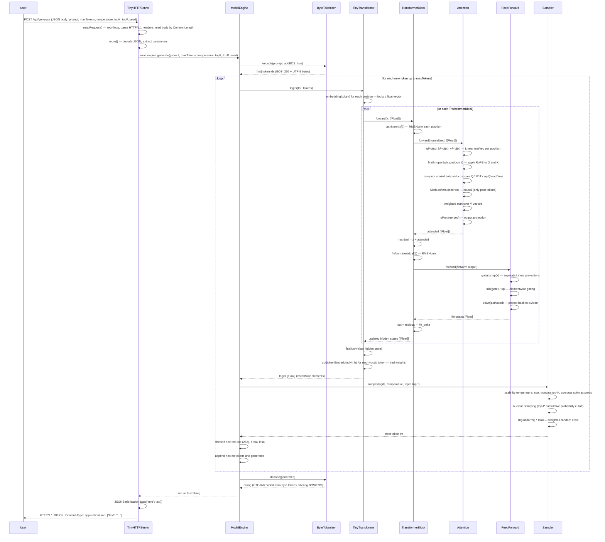

# FILE REFERENCE: metal/ Package — MetalTransformer & SwiftTinyLLM

## Overview and Architecture

The `metal/` directory of the devflow-finance-twin repository contains a self-contained Swift Package Manager project that implements a miniature transformer language model in two distinct execution paths: a GPU-accelerated inference engine built on Apple's Metal compute framework (`MetalTransformer`), and a pure-Swift CPU reference implementation suitable for development, testing, and deployment on non-GPU macOS targets (`SwiftTinyLLM`). Both paths are packaged under the umbrella package name `MetalTransformer` and share the same `Package.swift` manifest.

### Dual Architecture Philosophy

The most architecturally significant aspect of this package is its deliberate dual-path design. Rather than committing entirely to one execution strategy, the authors have built two complete, independently runnable implementations of the same transformer architecture and co-located them in the same Swift package.

**The MetalTransformer GPU path** (`Sources/MetalTransformer/`) is designed for production inference on Apple Silicon or discrete AMD/Intel GPUs on macOS. It compiles a Metal shader library (`Transformer.metal`) at runtime, creating `MTLComputePipelineState` objects for each of thirteen distinct kernel functions. Model weights are stored in INT4 quantized format, meaning each weight value occupies only four bits instead of 32 bits (float) or 16 bits (float16), yielding approximately an 8x reduction in weight memory compared to float32 and a 4x reduction compared to float16. This path is oriented toward larger production-scale models (hidden dimension 3072, 24 query heads, vocabulary of 32,000 tokens — parameters reminiscent of a Mistral-7B or similar architecture).

**The SwiftTinyLLM CPU path** (`Sources/SwiftTinyLLM/`) is a pure-Swift, CPU-only implementation of a much smaller transformer model (hidden dimension 96, 4 layers, 4 heads, vocabulary 258). It uses plain `[Float]` arrays instead of GPU buffers, and all computation runs on the CPU using straightforward nested loops. This path is ideal for rapid prototyping, correctness verification, and running on CI hosts without Metal support. It includes a byte-level tokenizer, a SplitMix64 random number generator, nucleus sampling with temperature and top-K/top-P, and a built-in HTTP server that serves a full-featured single-page application dashboard.

The two paths do not share code at runtime; they represent the same algorithm at different scales and on different hardware. A developer can study the CPU path to understand the transformer mechanics in idiomatic Swift before reading the Metal kernels that implement equivalent operations on the GPU.

### Package Structure at a Glance

```
metal/
├── Package.swift                          # SPM manifest
├── Sources/
│   ├── MetalTransformer/
│   │   ├── MetalTransformer.swift         # GPU engine class
│   │   └── Transformer.metal             # Metal compute kernels (~2,300+ LOC)
│   └── SwiftTinyLLM/
│       ├── main.swift                     # CLI entry point
│       ├── Model.swift                    # Core model types + actor engine
│       ├── ModelConfig.swift              # Config struct (separate version)
│       ├── Tensor.swift                   # Generic CPU tensor
│       ├── Random.swift                   # SplitMix64 PRNG
│       ├── Runtime.swift                  # Math, ByteTokenizer, Sampler
│       ├── Tokenizer.swift                # Simple byte tokenizer
│       ├── RMSNorm.swift                  # RMSNorm layer (Tensor-based)
│       ├── RoPE.swift                     # Rotary position embedding
│       ├── SwiGLU.swift                   # SwiGLU feed-forward
│       └── WebServer.swift                # HTTP server + dashboard
├── Tests/
│   └── MetalTransformerTests.swift        # XCTest suite for GPU path
├── frontend/
│   ├── quantum_shadow_ledger.html         # Standalone frontend
│   └── source/util.ts                     # Frontend TypeScript utilities
└── m5-gateway/
    ├── M5OSApp.swift                      # M5 microcontroller gateway
    └── m5_gateway.wat                     # WebAssembly text format gateway
```

### Key Design Decisions

**INT4 Quantization**: The Metal path stores weight matrices in 4-bit integer format, packing two weights per byte. Each row of a weight matrix has an associated float16 scale factor. Dequantization happens inline inside the compute kernels using the `dequant_i4` helper: the nibble is extracted, interpreted as a signed 4-bit integer in the range [-8, 7], and multiplied by the row's scale factor. This design achieves excellent memory bandwidth efficiency at the cost of slightly reduced numerical precision.

**Grouped Query Attention (GQA)**: The Metal path's `TransformerDimensions` specifies 24 query heads but only 8 key-value heads (`kvHeads=8`). This is Grouped Query Attention — each KV head services three query heads. This design was popularized by Mistral and Llama-2 models to reduce the KV cache size significantly without meaningful quality degradation. The kernel implementations handle the head-index mapping via `head % config.kv_heads` throughout.

**Actor-Based Concurrency**: The CPU path wraps the `TinyTransformer` in a Swift `actor` (`ModelEngine`). The actor model ensures that all model state mutations are serialized, preventing data races when the web server dispatches concurrent requests. The `generate` method is a synchronous function on the actor but is called from async contexts using `await`.

**No Framework Dependencies**: Both paths are intentionally free of third-party dependencies. The Metal path depends only on Apple's `Metal` framework. The CPU path depends only on `Foundation`. This zero-dependency stance keeps compilation fast and avoids complex dependency graphs.

---

## Sequence Diagrams

### Metal Inference Pipeline — CPU Path (SwiftTinyLLM)

The following Mermaid sequence diagram illustrates the full request-response cycle through the SwiftTinyLLM HTTP server and CPU model engine.



### MetalTransformer GPU Pipeline — Metal Kernel Dispatch

The following Mermaid diagram shows how `MetalTransformer` dispatches Metal compute kernels during a forward pass. Note that in the current implementation the kernel dispatch helper is generic and each pipeline stage represents a named `MTLComputePipelineState`.

```mermaid
sequenceDiagram
    participant Host as Host Swift Code
    participant MTLCommandQueue as MTLCommandQueue
    participant MTLCommandBuffer as MTLCommandBuffer
    participant MTLComputeCommandEncoder as MTLComputeCommandEncoder
    participant GPU as Apple GPU

    Host->>MetalTransformer: encodeToken(token:, embedding:, output:)
    MetalTransformer->>MTLCommandQueue: makeCommandBuffer()
    MTLCommandQueue-->>MetalTransformer: MTLCommandBuffer
    MetalTransformer->>MTLCommandBuffer: makeComputeCommandEncoder()
    MTLCommandBuffer-->>MetalTransformer: MTLComputeCommandEncoder
    MetalTransformer->>MTLComputeCommandEncoder: setComputePipelineState(pipelines["embedding"])
    MetalTransformer->>MTLComputeCommandEncoder: setBuffer(embeddingTable, index:0)
    MetalTransformer->>MTLComputeCommandEncoder: setBuffer(tokenBuffer, index:1)
    MetalTransformer->>MTLComputeCommandEncoder: setBuffer(outputBuffer, index:2)
    MetalTransformer->>MTLComputeCommandEncoder: setBytes(&dimensions, index:3)
    MetalTransformer->>MTLComputeCommandEncoder: dispatchThreads(width:hidden=3072)
    MetalTransformer->>MTLComputeCommandEncoder: endEncoding()
    MetalTransformer->>MTLCommandBuffer: commit(); waitUntilCompleted()
    MTLCommandBuffer->>GPU: embedding kernel — 3072 threads, each copies one float16 from table[token*hidden+tid]
    GPU-->>Host: output buffer filled with hidden-dim embedding vector

    Note over Host,GPU: Per-layer forward pass kernel sequence (called via dispatch())

    Host->>MetalTransformer: dispatch("rmsnorm", buffers:[x, gain, y, config], count: hidden)
    MetalTransformer->>GPU: rmsnorm kernel — parallel RMS reduce, then normalize + scale
    GPU-->>Host: normalized hidden state in y buffer

    Host->>MetalTransformer: dispatch("rope", buffers:[q, k, config, posInfo], count: q_heads*head_dim)
    MetalTransformer->>GPU: rope_qk kernel — rotate Q and K pairs with position-dependent angles
    GPU-->>Host: Q and K buffers updated in-place with rotary encoding

    Host->>MetalTransformer: dispatch("qkv_projection_i4", buffers:[wq,sq,wk,sk,wv,sv,input,q_out,k_out,v_out,...])
    MetalTransformer->>GPU: qkv_projection kernel — fused INT4 dequant matVec for Q, K, V simultaneously
    GPU-->>Host: q_out, k_out, v_out buffers populated

    Host->>MetalTransformer: dispatch("attention_scores", buffers:[q, k_cache, scores, config, pos])
    MetalTransformer->>GPU: attention_scores kernel — scaled dot product Q*K^T, writes scores[head*seq_len+token]
    GPU-->>Host: raw attention scores buffer

    Host->>MetalTransformer: dispatch("causal_softmax", buffers:[scores, config, pos])
    MetalTransformer->>GPU: masked_softmax kernel — max-subtract stable softmax, zeroing future positions
    GPU-->>Host: normalized attention weights in scores buffer

    Host->>MetalTransformer: dispatch("attention_times_v", buffers:[scores, v_cache, out, config, pos])
    MetalTransformer->>GPU: attention_value kernel — weighted sum over V vectors per head
    GPU-->>Host: attention output buffer (heads*head_dim floats)

    Host->>MetalTransformer: dispatch("output_projection_i4", buffers:[attn_out, weight, scale, bias, out, shape])
    MetalTransformer->>GPU: output_projection kernel — INT4 matVec projecting concatenated head outputs to hidden dim
    GPU-->>Host: projected output buffer

    Host->>MetalTransformer: dispatch("residual_add", buffers:[a, b, out, count])
    MetalTransformer->>GPU: add_residual kernel — elementwise a[tid]+b[tid] for hidden_dim elements
    GPU-->>Host: residual sum in out buffer

    Host->>MetalTransformer: dispatch("swiglu", buffers:[gate, up, out, count])
    MetalTransformer->>GPU: swiglu kernel — silu(gate[tid]) * up[tid] elementwise
    GPU-->>Host: gated activation in out buffer

    Host->>MetalTransformer: dispatch("copy_kv", buffers:[k, v, k_cache, v_cache, config, pos])
    MetalTransformer->>GPU: kv_store kernel — writes k[tid] and v[tid] to k_cache/v_cache at position
    GPU-->>Host: KV cache updated for current token position

    Host->>MetalTransformer: dispatch("final_normalization", buffers:[x, gain, y, config])
    MetalTransformer->>GPU: final_norm kernel — per-element RMSNorm over full hidden dimension
    GPU-->>Host: final normalized hidden state ready for lm_head projection

    Host->>MetalTransformer: greedyToken(from: logits, count: vocab)
    MetalTransformer->>MetalTransformer: scan float16 logits buffer on CPU for argmax
    MetalTransformer-->>Host: UInt32 predicted token index
```

---

## Detailed File Reference

---
## FILE: metal/Package.swift

**PURPOSE:** Defines the Swift Package Manager (SPM) manifest for the entire `metal/` subproject. It declares the package identity, platform requirements, product exports, and build targets. Without this file the Swift toolchain cannot find, compile, or link any of the sources in this directory.

**LANGUAGE:** Swift (SPM DSL, executed by `swift package` tooling)

**LOC:** 27

**RESPONSIBILITY:** This file is the authoritative entry point for the Swift Package Manager. It encodes three structural facts that govern the entire build: (1) the package name `MetalTransformer`; (2) the platform constraint `macOS(.v14)`, which prevents compilation on older macOS releases that lack required Metal or Swift concurrency APIs; and (3) the product and target graph, which controls what artifacts get built, what names they export, and which directories contain their sources.

The package exposes two products. The first is a library named `MetalTransformer` backed by the `MetalTransformer` target at `Sources/MetalTransformer`. This library product is what external packages would import if they wanted to embed the GPU acceleration engine into their own applications. The second is an executable named `swift-tiny-llm` backed by the `SwiftTinyLLM` executableTarget at `Sources/SwiftTinyLLM`. This produces a standalone command-line binary that boots the HTTP server and exposes the CPU-path transformer.

A subtle but critical detail in the manifest is the resource rule `resources: [.copy("Transformer.metal")]` on the `MetalTransformer` target. This instructs SPM to bundle the `.metal` shader source file into the compiled module's `Bundle.module` resource bundle. The `MetalTransformer.swift` runtime then retrieves this file at init time via `Bundle.module.url(forResource: "Transformer", withExtension: "metal")`. If this rule were absent, the metal file would not be embedded and `MetalTransformer.init` would throw error code 3.

The test target `MetalTransformerTests` has an explicit `dependencies: ["MetalTransformer"]` declaration that causes SPM to compile and link the library before building the tests. The `path: "Tests"` override tells SPM to find the test sources in the `Tests/` directory at the package root rather than the conventional `Tests/MetalTransformerTests/` subdirectory.

**INPUTS:** SPM toolchain reads this file to resolve the build graph. No runtime data flows in.

**OUTPUTS:** Produces build instructions for the Swift toolchain: compilation units, linker inputs, and resource bundle configuration for `MetalTransformer.swiftmodule`, `swift-tiny-llm` binary, and the test runner.

**KEY FUNCTIONS/TYPES:**
- `Package(name:platforms:products:targets:)` — Top-level SPM Package struct initializer. All build graph information is declared inline.
- `.library(name:targets:)` — Declares the `MetalTransformer` library product.
- `.executable(name:targets:)` — Declares the `swift-tiny-llm` CLI product.
- `.target(name:path:resources:)` — Declares the `MetalTransformer` source target with resource bundling.
- `.executableTarget(name:path:)` — Declares the `SwiftTinyLLM` executable target.
- `.testTarget(name:dependencies:path:)` — Declares the XCTest target.

**DEPENDENCIES:** None (no external package dependencies). Implicitly depends on the Swift standard library and Apple SDKs.

**CALLERS:** The `swift build`, `swift run`, `swift test`, and `swift package` commands read this file. Xcode and other IDEs also parse it to construct project structures.

**CALLEES:** Calls into SPM's `PackageDescription` module via the embedded DSL.

**STATE:** Stateless. Declares a pure build graph, not runtime state.

**CONFIGURATION:** The `platforms: [.macOS(.v14)]` constraint is the only externally meaningful configuration gate. Changing it to `.v13` would allow builds on older macOS but would risk missing Swift 5.9 concurrency features. The `resources: [.copy("Transformer.metal")]` rule is critical — using `.process` instead of `.copy` would attempt to compile the metal file as a resource and might mangle it; `.copy` preserves the raw source text for runtime JIT compilation by the Metal device.

**SIDE EFFECTS:** When `swift build` processes this file, it creates `.build/` artifacts including compiled object files, the `MetalTransformer.swiftmodule`, the `swift-tiny-llm` executable, and a resource bundle containing `Transformer.metal`.

**ERROR CONDITIONS:** If `swift-tools-version` in the first line does not match the installed toolchain's minimum supported version, the build fails immediately. If a target's `path` does not correspond to a real directory, SPM reports a source-not-found error.

**RUNTIME ROLE:** Not executed at runtime; purely a build-time artifact consumed by the Swift Package Manager.

**RELATED FILES:** `Sources/MetalTransformer/MetalTransformer.swift`, `Sources/MetalTransformer/Transformer.metal`, `Sources/SwiftTinyLLM/main.swift`, `Tests/MetalTransformerTests.swift`

---

---
## FILE: metal/Sources/MetalTransformer/MetalTransformer.swift

**PURPOSE:** Defines the Swift-side Metal GPU acceleration engine for the transformer model. This file provides the `MetalTransformer` class, which owns the Metal device, command queue, compiled shader library, and a dictionary of pre-compiled compute pipeline state objects — one per named kernel. It also exposes two high-level operations: `encodeToken` (embed a token ID into a hidden-dimension float16 vector on the GPU) and `greedyToken` (scan a logits buffer on the CPU and return the argmax token index).

**LANGUAGE:** Swift 5.9

**LOC:** 41

**RESPONSIBILITY:** `MetalTransformer` is the GPU context manager and kernel launcher for the production inference path. Its constructor performs all expensive GPU initialization work that should happen once at startup: device acquisition, command queue creation, Metal library compilation from source, and pipeline state compilation for all thirteen kernels. The constructor is designed to throw on any failure rather than silently degrade, ensuring that callers can detect GPU unavailability at init time rather than encountering silent errors later.

The `dispatch` private helper encapsulates the repetitive boilerplate of encoding a single compute dispatch: it retrieves the named pipeline state, creates a command buffer, creates a compute command encoder, sets the pipeline state, binds all buffers by index, computes the thread group width clamped to the pipeline's reported maximum, dispatches threads, ends encoding, and returns the uncommitted command buffer. The caller is responsible for committing and optionally waiting.

The `encodeToken` public method specializes the dispatch for the `embedding` kernel, handling the `TransformerDimensions` struct as inline bytes (via `setBytes`) rather than a separate GPU buffer, and synchronously committing and waiting for completion.

The `greedyToken` method deliberately avoids a GPU-side reduction kernel for argmax. Instead it binds the logits buffer's CPU-visible memory using `bindMemory(to: Float16.self, capacity:)` and scans linearly. For a 32,000-token vocabulary this scan is fast enough on the CPU (~32K float16 comparisons), and it avoids the overhead of encoding, dispatching, and waiting for a reduction kernel.

**INPUTS:**
- `device: MTLDevice?` — optional Metal device, defaults to `MTLCreateSystemDefaultDevice()`. Passing `nil` explicitly triggers error code 1.
- `dimensions: TransformerDimensions` — model dimension configuration, defaults to large-model settings.
- `token: MTLBuffer` — uint32 GPU buffer containing the current token ID, used in `encodeToken`.
- `embedding: MTLBuffer` — embedding table buffer (float16), used in `encodeToken`.
- `output: MTLBuffer` — output buffer to receive the embedding vector (float16), used in `encodeToken`.
- `logits: MTLBuffer` — float16 logits buffer, used in `greedyToken`.

**OUTPUTS:**
- `encodeToken` fills `output` with `dimensions.hidden` float16 values representing the token embedding.
- `greedyToken` returns a `UInt32` token index representing the highest-probability next token.
- `dispatch` returns a committed-but-not-waited `MTLCommandBuffer` (though the caller typically immediately commits it).

**KEY FUNCTIONS/TYPES:**

- `TransformerDimensions` — A public struct encoding the model hyperparameters: `hidden=3072`, `intermediate=8192`, `heads=24` (query heads), `kvHeads=8` (key-value heads for GQA), `headDim=128`, `vocab=32000`, `context=4096`. These default values correspond to a model in the 7B parameter class. The struct is passed directly to the Metal kernels as raw bytes via `setBytes`, which requires it to remain a plain value type with predictable memory layout.

- `MetalTransformer.init(device:dimensions:) throws` — Performs GPU context initialization. Acquires the device, creates the command queue, loads `Transformer.metal` from the module bundle as a string, compiles it via `device.makeLibrary(source:options:)`, then for each of thirteen kernel names calls `library.makeFunction(name:)` and `device.makeComputePipelineState(function:)`. Any failure throws an `NSError` with domain `"MetalTransformer"` and a numeric code identifying the failure stage (1=no device, 2=no queue, 3=metal source not found, 4=function not found, 5=dispatch error).

- `dispatch(_:buffers:count:) throws -> MTLCommandBuffer` — Generic kernel dispatch helper. The method name indexes into `pipelines` to retrieve the pipeline state, creates a command buffer from the queue, creates a compute command encoder, sets the pipeline state, iterates `buffers` binding each `MTLBuffer?` by enumeration index, computes thread group width as `max(1, min(pipeline.maxTotalThreadsPerThreadgroup, count))`, dispatches threads, ends encoding, and returns the command buffer. The caller must call `commit()` and optionally `waitUntilCompleted()` on the returned buffer.

- `encodeToken(token:embedding:output:) throws` — Specialized public method for the embedding lookup kernel. Directly encodes a complete dispatch inline (rather than using the generic `dispatch` helper) to pass `dimensions` as a bytes blob via `setBytes`. Commits and synchronously waits for the GPU work to complete.

- `greedyToken(from:count:) -> UInt32` — CPU-side argmax scan over a float16 logits buffer. Uses `contents().bindMemory(to: Float16.self, capacity: count)` to get a pointer to the shared/CPU-accessible memory backing the `MTLBuffer`, then iterates comparing values and tracking the current maximum index.

**DEPENDENCIES:**
- `Foundation` — `NSError`, `Bundle.module`, `String(contentsOf:)`
- `Metal` — `MTLDevice`, `MTLCommandQueue`, `MTLCommandBuffer`, `MTLComputeCommandEncoder`, `MTLComputePipelineState`, `MTLLibrary`, `MTLFunction`, `MTLBuffer`, `MTLSize`, `MTLCreateSystemDefaultDevice()`

**CALLERS:**
- `Tests/MetalTransformerTests.swift` — creates `MetalTransformer()` in `testDeviceAndPipelinesLoad()`
- Host application code (not present in this package) would hold a `MetalTransformer` instance and call its methods in a transformer forward loop.

**CALLEES:**
- `Bundle.module.url(forResource:withExtension:)` — locates the bundled metal source
- `String(contentsOf:)` — reads the metal source file
- `device.makeLibrary(source:options:)` — JIT-compiles the Metal shaders
- `library.makeFunction(name:)` — retrieves a kernel function by name
- `device.makeComputePipelineState(function:)` — compiles and links the kernel pipeline

**STATE:**
- `device: MTLDevice` — the acquired GPU device, held for the lifetime of the object
- `queue: MTLCommandQueue` — the command queue used for all dispatch submissions
- `library: MTLLibrary` — compiled Metal shader library
- `pipelines: [String: MTLComputePipelineState]` — dictionary mapping kernel names to compiled pipeline states, populated once at init

**CONFIGURATION:**
- Default `TransformerDimensions` values encode the large-model configuration. Callers can pass custom dimensions at init time to target different model sizes.
- The kernel names embedded in the `for name in [...]` loop are the canonical set. Adding a kernel to `Transformer.metal` requires also adding its name here.

**SIDE EFFECTS:**
- GPU pipeline compilation at init time — typically 50-200ms for 13 pipelines on Apple Silicon
- GPU memory reads in `greedyToken` via `MTLBuffer.contents()`
- Synchronous GPU wait in `encodeToken` via `cb.waitUntilCompleted()`

**ERROR CONDITIONS:**
- `MTLCreateSystemDefaultDevice()` returns `nil` on machines without Metal support (error code 1)
- `device.makeCommandQueue()` can return `nil` under memory pressure (error code 2)
- `Bundle.module.url(forResource:withExtension:)` returns `nil` if the resource bundle was not properly built (error code 3)
- `library.makeFunction(name:)` returns `nil` if a kernel name is misspelled or the metal compilation failed silently (error code 4)
- `device.makeComputePipelineState(function:)` throws if the Metal compiler rejects a function signature

**RUNTIME ROLE:** Singleton GPU context holder and kernel dispatcher during the production inference forward pass. Called once at application startup during init, then repeatedly during token generation.

**RELATED FILES:**
- `Sources/MetalTransformer/Transformer.metal` — contains the kernel implementations for all 13+ named kernels
- `Tests/MetalTransformerTests.swift` — validates that the pipeline loads correctly
- `Package.swift` — includes the resource bundling rule that makes the metal file available at runtime

---

---
## FILE: metal/Sources/MetalTransformer/Transformer.metal

**PURPOSE:** The Metal Shading Language source file containing all GPU compute kernels for the transformer forward pass. This is the largest and most complex file in the package at over 2,300 lines. It defines data structures shared between the Swift host and GPU kernels, compile-time constants, low-level helper functions, and an extensive library of kernel implementations covering every stage of transformer inference plus numerous utility and debug variants.

**LANGUAGE:** Metal Shading Language (C++14 dialect with Metal extensions, compiled by Apple's metalfe frontend)

**LOC:** ~2,332

**RESPONSIBILITY:** This file is the GPU program. It defines the actual arithmetic that runs on the GPU during inference. It owns the implementation of every mathematical operation in the transformer: embedding lookup, RMS normalization, rotary position encoding, INT4-quantized matrix-vector products, fused QKV projection, scaled dot-product attention scores, causal masking, stable softmax, attention value accumulation, SwiGLU gated MLP, residual addition, output projection, and KV cache management.

The file is organized into several clear sections. The structural section at the top defines C++ structs that are shared between Swift host code and the GPU kernels via Metal's buffer binding mechanism. These structs must have identical memory layout on both sides, which is guaranteed because they contain only unsigned integers and floats (no pointers, no virtual dispatch, no padding surprises). The constants section defines named values used across multiple kernels. The helper function section defines small inline functions for common arithmetic patterns like INT4 dequantization, sigmoid-linear unit, safe reciprocal square root, and index calculation. The bulk of the file consists of kernel functions, most of which follow a consistent pattern: check bounds, load inputs from buffers, compute a result, write to an output buffer.

Beyond the thirteen kernels registered in `MetalTransformer.swift`, the metal file contains many additional kernels representing variant implementations, debug variants, and utility operations. Many of these are not currently wired into the Swift host code but serve as a library of validated GPU implementations that can be activated by adding their names to the `MetalTransformer.init` loop.

**INPUTS:**
- GPU buffers bound by the Swift host (typed as `device const T*` for read-only, `device T*` for read-write)
- `constant` structs passed inline (not heap-allocated): `ModelConfig`, `LinearShape`, `PosInfo`
- Built-in thread-position attributes: `uint tid [[thread_position_in_grid]]`, `uint lane [[thread_index_in_simdgroup]]`, etc.

**OUTPUTS:**
- Write to output buffers declared as `device T*` parameters
- All outputs are written back to GPU memory shared with the Swift host

**KEY FUNCTIONS/TYPES:**

*Structs (shared with Swift host via ABI-compatible layout):*
- `ModelConfig` — 9-field struct: `hidden` (uint), `intermediate` (uint), `q_heads` (uint), `kv_heads` (uint), `head_dim` (uint), `vocab` (uint), `context` (uint), `layers` (uint), `epsilon` (float). Passed as `constant ModelConfig&` to most major kernels.
- `LinearShape` — 2-field struct: `rows` (uint), `cols` (uint). Passed to matrix-vector kernels to avoid baking shape into kernel dispatch logic.
- `PosInfo` — 2-field struct: `token_index` (uint) current causal position, `seq_len` (uint) current sequence length. Used in attention and KV cache kernels.
- `KernelMetadata` — 4-field struct: `id`, `lane`, `group`, `dim`. Utility struct for kernel identification, not currently used in production kernels.
- `WeightLayout` — 6-field struct: `row_stride`, `q_group_size`, `scale_stride`, `zero_stride`, `offset`, `flags`. Layout descriptor for future grouped-quantization support.
- `AttentionTile` — 6-field struct: `head`, `token`, `head_dim`, `kv_head`, `row_offset`, `col_offset`. Tile descriptor for future flash-attention tiled implementation.

*Compile-time constants:*
- `kMaxBlock = 256u` — maximum threadgroup block size used in SIMD reduction patterns
- `kMaxThreads = 1024u` — absolute upper bound on threads per threadgroup
- `kRmsReduction = 32u` — reduction parallelism for the threadgroup-parallel RMSNorm variant
- `kRoPEPairs = 128u` — maximum RoPE frequency pairs (head_dim/2 for head_dim=256)
- `kAttentionWindow = 4096u` — maximum KV cache context length

*Helper functions:*
- `packed_index(row, col, cols) -> uint` — computes the byte index for a packed INT4 weight: `row * ((cols+1)>>1) + (col>>1)`. Two weights share each byte, with even columns in the low nibble and odd columns in the high nibble.
- `signed_nibble(nibble) -> int` — converts a 4-bit unsigned value in [0,15] to a signed value in [-8,7] by subtracting 16 from values >= 8. This implements the standard 2's complement conversion for 4-bit integers.
- `dequant_i4(weight, scale, row, col, cols) -> float` — the core INT4 dequantization function. Calls `packed_index` to locate the right byte, extracts the appropriate nibble, calls `signed_nibble` to get the signed integer value, and multiplies by `scale[row]` (a float16 per-row scale factor). This is the critical inner loop operation for all quantized matrix-vector products.
- `dequant_i8(weight, scale, row, col, cols) -> float` — INT8 variant of dequantization. Interprets each byte as a signed int8_t and multiplies by the row scale.
- `clampf(x, lo, hi) -> float` — clamped float using Metal's `min`/`max` builtins.
- `silu(x) -> float` — sigmoid-linear unit: `x / (1 + exp(-clamp(x, -80, 80)))`. The clamp prevents overflow in `exp` for large negative inputs.
- `safe_rsqrt(x) -> float` — reciprocal square root with a floor of `1e-6` to prevent division by zero.
- `kv_offset(token, kv_head, head_dim, kv_heads) -> uint` — flattened index into the KV cache: `((token * kv_heads) + kv_head) * head_dim`.
- `q_offset(head, head_dim) -> uint` — flattened index for a query head.
- `linear_index(row, col, stride) -> uint` — row-major 2D index.

*Kernel implementations (primary set registered in MetalTransformer.swift):*
- `kernel embedding(table, token, out, config, tid)` — single-token embedding lookup. Each thread copies one float16 from `table[token[0] * config.hidden + tid]` to `out[tid]`. Dispatched with `width=hidden` threads.
- `kernel rmsnorm(x, gain, y, config, tid, lane)` — parallel RMSNorm with threadgroup reduction. Uses a `threadgroup float accum[kRmsReduction]` array. Each of the `kRmsReduction` threads accumulates a partial sum of squares over strided elements, then a sequential reduction computes the total, then each thread normalizes and scales its element. This design achieves warp-level parallelism for the reduction.
- `kernel rope_qk(q, k, config, pos, tid)` — rotary position encoding for query and key tensors simultaneously. Only even-indexed threads (pairs) do work. Computes the rotation angle from position and frequency, applies the 2D rotation matrix to consecutive (q0, q1) pairs. Handles the GQA KV head mapping via `head % config.kv_heads`.
- `kernel quantized_matvec(weight, scale, input, output, shape, row)` — single INT4 quantized matrix-vector product. Each thread handles one output row, accumulating `sum(dequant_i4(weight, scale, row, col, shape.cols) * input[col])` over all columns. This is the fundamental building block for all linear layers.
- `kernel qkv_projection(wq, sq, wk, sk, wv, sv, input, q_out, k_out, v_out, q_shape, k_shape, v_shape, row)` — fused QKV projection kernel. A single thread may compute one row of Q, one row of K, and one row of V (subject to bounds checks), issuing three independent accumulation loops. This reduces kernel launch overhead compared to three separate matrix-vector kernels.
- `kernel attention_scores(q, k_cache, scores, config, pos, tid)` — scaled dot-product attention. Each thread computes the score for one (head, past-token) pair: dot product of `q[head*head_dim : (head+1)*head_dim]` with `k_cache[kv_offset(token, kv_head, ...)]`, scaled by `safe_rsqrt(head_dim)`.
- `kernel softmax_stable(scores, config, pos, head)` — numerically stable softmax over one attention head's scores. One thread per head: finds the max value, computes exponentials shifted by the max, accumulates the denominator, normalizes in place. The per-head serialization ensures correctness for the causal case.
- `kernel masked_softmax(scores, config, pos, head)` — causal masked softmax variant. Computes the max only over tokens up to `pos.token_index`, sets future tokens to zero in the output, and normalizes only the valid positions. This is the correct kernel for autoregressive generation.
- `kernel attention_value(scores, v_cache, out, config, pos, tid)` — weighted sum of value vectors. Each thread computes one element of the output: `sum over tokens of (scores[head*seq_len+token] * v_cache[kv_offset(token, kv_head, ...)+dim])`.
- `kernel swiglu(gate, up, out, count, tid)` — elementwise SwiGLU gating: `silu(gate[tid]) * up[tid]`. This is the activation function between the up-projection and down-projection of the MLP.
- `kernel add_residual(a, b, out, count, tid)` — elementwise residual addition: `out[tid] = a[tid] + b[tid]`. Dispatched at width=hidden for the hidden-state residual connections.
- `kernel output_projection(x, weight, scale, bias, out, shape, row)` — INT4 quantized output projection with bias. Accumulates `bias[row] + sum(dequant_i4(weight, scale, row, col, shape.cols) * x[col])`. Used for the attention output projection (concatenated head outputs -> hidden dim).
- `kernel kv_store(k, v, k_cache, v_cache, config, pos, tid)` — copies K and V vectors to the KV cache at the current position: `k_cache[pos.token_index * total + tid] = k[tid]`.
- `kernel final_norm(x, gain, y, config, tid)` — final RMSNorm before the language modeling head. Each thread is responsible for one output position but all threads collectively read the full hidden vector to compute the normalization constant. Equivalent to `rmsnorm` but without threadgroup-parallel reduction.

*Additional kernels in the file (not in the primary dispatch set but present as library):*
- `embedding_batch` — batch embedding variant for prefill
- `rmsnorm_safe`, `rmsnorm_vec4` — serial and vectorized RMSNorm variants
- `rope_qk_full` — full RoPE variant handling all head dimensions
- `quantized_matvec_i8`, `quantized_matvec_bias`, `quantized_matvec_bias_i8` — INT8 and bias variants
- `qkv_projection_tiled` — tiled QKV variant
- `attention_scores_full` — full attention scores variant
- `causal_mask`, `causal_mask_ragged` — causal masking kernels separated from softmax
- `softmax_stable_2d` — 2D batch softmax
- `attention_value_tiled` — tiled attention value accumulation
- `kv_store_layer` — per-layer KV cache store with layer index
- `final_norm_chunked` — chunked final normalization variant
- `logits`, `logits_i8`, `logits_bias`, `stable_logits`, `classifier_logits` — various lm_head projection kernels
- `layer_norm`, `layer_norm_1d`, `ln_and_add` — LayerNorm (not RMSNorm) variants for GPT-2 style models
- `activation_relu`, `activation_gelu`, `activation_silu` — standalone activation kernels
- `scale_add`, `scale_mul`, `buffer_add_const`, `buffer_mul_const` — scalar arithmetic kernels
- `stream_copy`, `stream_fill`, `zero_buffer`, `batch_fill_zero`, `batch_fill_const` — memory utility kernels
- `qkv_split`, `qkv_concat`, `qkv_gqa`, `mixed_qkv`, `qkv_head_lift`, `head_split_qkv` — QKV tensor manipulation kernels
- `cache_lookup`, `cache_lookup_headed`, `prefix_cache_update` — KV cache utility kernels
- `attention_diag_mask`, `attention_diag_mask_narrow`, `computed_score_invariants`, `attention_update_values` — attention masking and score variants
- `reduce_sum_kernel`, `reduce_max`, `temp_reduce`, `dot_product`, `mixed_precision_reduce` — reduction kernels
- `sum_rows`, `max_rows`, `elementwise_mul`, `elementwise_div`, `abs_buffer` — batch math utilities
- `memory_copy_stride_1` through `memory_copy_stride_30` — 30 identical stride-limited copy kernels, likely for per-layer KV cache management where each kernel instance corresponds to one transformer layer
- `segment_norm`, `sequence_norm` — segmented normalization variants
- `smoothed_output`, `attn_projection_grad` — smoothing and gradient-path variants
- `cross_attention_debug` — debug kernel for cross-attention diagnostics
- `parallel_score_block` — simplified parallel score computation without GQA

**DEPENDENCIES:**
- `<metal_stdlib>` — the Metal standard library providing `float16` (half), trigonometric functions (`cos`, `sin`), math (`exp`, `log`, `sqrt`, `rsqrt`, `pow`), and thread-position built-ins
- `using namespace metal` — pulls the metal namespace into scope

**CALLERS:**
- `MetalTransformer.init` — loads this file's source text at runtime and compiles it via `device.makeLibrary(source:options:)`
- The Swift host calls individual kernels by name through `MetalTransformer.dispatch`

**CALLEES:** No function calls outside the file itself. All math uses Metal built-ins.

**STATE:** Kernels are stateless — they read input buffers and write output buffers. The KV cache persistence is managed by the host (the `kv_store` and `kv_store_layer` kernels write to host-allocated cache buffers that persist across kernel invocations).

**CONFIGURATION:**
- `kAttentionWindow = 4096u` defines the maximum context window. Increasing this requires no code changes, only larger KV cache buffers.
- `kRmsReduction = 32u` controls the parallelism of the RMSNorm reduction. This should match or divide the threadgroup size used to dispatch `rmsnorm`.
- The epsilon in `safe_rsqrt` (`1e-6`) and the SiLU clamp (`±80`) are compile-time hardcoded.

**SIDE EFFECTS:** All side effects are writes to device memory buffers. No file I/O, no network calls, no atomics (except the implicit threadgroup barrier in `rmsnorm`).

**ERROR CONDITIONS:**
- Integer overflow in index calculations is possible for very large models (hidden > ~65K) because indices are computed in `uint`
- `NaN` or `Inf` can propagate through the pipeline if the host passes malformed scale factors or if INT4 dequantization produces extreme values
- The `rmsnorm` kernel's threadgroup reduction is only correct if dispatched with exactly `kRmsReduction` threads; incorrect dispatch width produces wrong normalization

**RUNTIME ROLE:** The GPU program. Every floating-point operation during Metal-path inference is computed by functions in this file.

**RELATED FILES:**
- `Sources/MetalTransformer/MetalTransformer.swift` — host-side launcher
- `Package.swift` — bundles this file as a resource

---

---
## FILE: metal/Sources/SwiftTinyLLM/Model.swift

**PURPOSE:** The primary model implementation file for the SwiftTinyLLM CPU path. Defines the complete transformer model as Swift value types and actors: `ModelConfig` (hyperparameter bundle), `Linear` (weight matrix with matVec forward pass), `RMSNormLayer` (normalization wrapper), `Attention` (multi-head causal self-attention with RoPE), `FeedForward` (SwiGLU MLP), `TransformerBlock` (pre-norm residual layer), `TinyTransformer` (full model with embedding, blocks, and tied lm_head), `ModelInfo` (serializable stats struct), and `ModelEngine` (Swift actor wrapping the transformer for thread-safe async access).

**LANGUAGE:** Swift 5.9

**LOC:** 222

**RESPONSIBILITY:** This file owns the complete computational graph for CPU-path inference. Every type is a plain Swift value type (`struct`) conforming to both `Codable` (for checkpoint serialization) and `Sendable` (for safe use across actor isolation boundaries), with the exception of `ModelEngine` which is a Swift `actor`.

The architecture mirrors a standard pre-norm transformer (like Llama or Mistral) at small scale: each `TransformerBlock` applies RMSNorm, then multi-head causal self-attention with residual, then RMSNorm, then SwiGLU feed-forward with residual. The token embedding table is shared as the lm_head weight (tied embeddings), computed via a dot product in `TinyTransformer.logits`.

This file serves both as a working implementation and as a pedagogical reference — by reading it alongside `Transformer.metal`, a developer can understand exactly what each Metal kernel is computing. Every operation here has a direct Metal counterpart.

**INPUTS:**
- `ModelConfig` — configuration controlling all dimensions. Default values: `vocabSize=258` (256 byte tokens + BOS + EOS), `dModel=96`, `layers=4`, `heads=4`, `dFF=256`, `context=256`.
- Token IDs as `[Int]` — sequence of integer token identifiers fed to `logits(for:)`
- Generation parameters — `prompt: String`, `maxTokens: Int`, `temperature: Float`, `topK: Int`, `topP: Float`, `seed: UInt64` — consumed by `ModelEngine.generate`

**OUTPUTS:**
- `logits(for: tokens) -> [Float]` — unnormalized log probabilities over the vocabulary
- `generate(prompt:maxTokens:...) -> String` — generated text
- `info() -> ModelInfo` — serializable model statistics
- Checkpoint files via `save(to: URL)` — JSON-encoded `TinyTransformer`

**KEY FUNCTIONS/TYPES:**

- `ModelConfig` — `Codable, Sendable` struct. Fields: `vocabSize=258`, `dModel=96`, `layers=4`, `heads=4`, `dFF=256`, `context=256`, `seed: UInt64 = 0x53574946544C4C4D`. Computed property `headDim: Int { dModel / heads }`. Method `validate()` asserts `dModel % heads == 0` and `headDim % 2 == 0` (RoPE requires even head dimension). The `seed` literal `0x53574946544C4C4D` is the ASCII encoding of "SWIFTLLM" — a documentation-friendly constant that ensures deterministic initialization.

- `Linear: Codable, Sendable` — weight matrix with bias. Fields: `input: Int`, `output: Int`, `weight: [Float]` (row-major, shape [output, input]), `bias: [Float]` (optional, empty if not requested). `init(input:output:rng:scale:bias:)` initializes weights with normal(std=scale) noise, defaulting scale to `1/sqrt(input)` (Kaiming initialization). `callAsFunction(_ x: [Float]) -> [Float]` computes `Math.matVec(weight, rows:output, cols:input, x)` plus optional bias. The `callAsFunction` naming allows syntax like `linear(vector)`.

- `RMSNormLayer: Codable, Sendable` — thin wrapper over `Math.rmsNorm`. Field: `weight: [Float]` initialized to ones. `callAsFunction(_ x: [Float]) -> [Float]` delegates to `Math.rmsNorm(x, weight: weight)` with default epsilon 1e-5.

- `Attention: Codable, Sendable` — multi-head causal self-attention. Fields: `dModel`, `heads`, `headDim` (derived), `qProj`, `kProj`, `vProj`, `oProj: Linear`. The output projection `oProj` uses scaled initialization `1/sqrt(dModel * max(1, layers))` (DeepNorm-style scaling to prevent gradient explosion in deep networks). `forward(_ states: [[Float]]) -> [[Float]]` processes a full sequence: projects all positions to Q, K, V; applies RoPE to each head's Q and K vectors; computes scaled dot-product attention scores for each (head, query_position) over all past key positions; applies softmax; accumulates weighted V sums; applies output projection.

- `FeedForward: Codable, Sendable` — SwiGLU two-layer MLP. Fields: `gate: Linear` (dModel -> dFF), `up: Linear` (dModel -> dFF), `down: Linear` (dFF -> dModel). The `down` projection uses `1/sqrt(dFF * max(1, layers))` scaled initialization. `forward(_ x: [Float]) -> [Float]` computes: gate vector = gate(x), up vector = up(x), activated = silu(gate[i]) * up[i] for each i, output = down(activated).

- `TransformerBlock: Codable, Sendable` — one transformer layer. Fields: `attnNorm: RMSNormLayer`, `attention: Attention`, `ffnNorm: RMSNormLayer`, `ffn: FeedForward`. `forward(_ x: [[Float]]) -> [[Float]]` implements pre-norm residual: normalize x, compute attention, add residual; normalize, compute FFN, add residual.

- `TinyTransformer: Codable, Sendable` — the full model. Fields: `config: ModelConfig`, `tokenEmbedding: [Float]` (vocabSize * dModel, initialized normal(std=0.02)), `blocks: [TransformerBlock]`, `finalNorm: RMSNormLayer`. Property `parameterCount: Int` sums all weight tensors across all submodules. `embedding(_ token: Int) -> [Float]` slices the embedding table. `logits(for: tokens) -> [Float]` runs the full forward pass on the suffix of the token sequence (clipped to context length), then computes logits via tied embedding dot products. `save(to: URL)` encodes as JSON and writes atomically. `load(from: URL)` decodes JSON.

- `ModelInfo: Codable, Sendable` — serializable summary struct returned by the API endpoint. Fields: `parameters: Int`, `layers: Int`, `dModel: Int`, `heads: Int`, `context: Int`, `vocab: Int`.

- `actor ModelEngine` — Swift actor providing thread-safe async access to `TinyTransformer`. Fields: `model: TinyTransformer` (mutable, actor-isolated), `tokenizer: ByteTokenizer` (shared with `Runtime.swift` implementation). `info() -> ModelInfo` returns model stats. `generate(prompt:maxTokens:temperature:topK:topP:seed:) -> String` is the main generation loop: encode prompt, loop token generation, sample next token, stop on EOS or maxTokens, decode and return.

**DEPENDENCIES:**
- `Foundation` — `JSONEncoder`, `JSONDecoder`, `Data`, `URL`
- `SplitMix64` — defined in `Runtime.swift`, used for model initialization RNG
- `Math` — defined in `Runtime.swift`, used for math operations
- `ByteTokenizer` — defined in `Runtime.swift`, used in `ModelEngine`
- `Sampler` — defined in `Runtime.swift`, used in `ModelEngine.generate`

**CALLERS:**
- `main.swift` — creates `TinyTransformer`, optionally loads checkpoint, creates `ModelEngine`
- `WebServer.swift` — calls `engine.generate` and `engine.info` via async `await`

**CALLEES:**
- `Math.matVec`, `Math.rmsNorm`, `Math.rope`, `Math.dot`, `Math.softmax`, `Math.silu` — all in `Runtime.swift`
- `ByteTokenizer.encode`, `ByteTokenizer.decode` — in `Runtime.swift`
- `Sampler.sample` — in `Runtime.swift`

**STATE:**
- `TinyTransformer` — all model weights as `[Float]` arrays, stored in value-type structs
- `ModelEngine` — `TinyTransformer` instance as actor-isolated mutable state; `ByteTokenizer` as an immutable helper

**CONFIGURATION:**
- Default `ModelConfig` produces a tiny model (~60K parameters). Changing `dModel`, `layers`, `heads`, `dFF` at init time scales the model up.
- `context = 256` — the KV context window for CPU inference
- `seed = 0x53574946544C4C4D` — deterministic initialization for reproducibility

**SIDE EFFECTS:**
- `save(to:)` writes a JSON file atomically to disk
- `generate` produces output text (no files written)

**ERROR CONDITIONS:**
- `validate()` calls `precondition`, which crashes (not throws) on invalid config
- JSON encode/decode can throw if model state is non-finite (NaN/Inf weights)
- `logits(for:)` returns a zero vector if `tokens` is empty (guard let last = x.last handles this)

**RUNTIME ROLE:** Core model implementation, invoked during every HTTP request to `/api/generate`.

**RELATED FILES:**
- `Sources/SwiftTinyLLM/Runtime.swift` — defines `SplitMix64`, `Math`, `ByteTokenizer`, `Sampler` used throughout
- `Sources/SwiftTinyLLM/main.swift` — creates instances of types defined here
- `Sources/SwiftTinyLLM/WebServer.swift` — calls `ModelEngine` methods via async/await
- `Sources/SwiftTinyLLM/ModelConfig.swift` — alternative `ModelConfig` version (different default values)

---

---
## FILE: metal/Sources/SwiftTinyLLM/ModelConfig.swift

**PURPOSE:** Provides an alternative `ModelConfig` struct implementation with different default values and a more descriptive field naming convention. Where `Model.swift`'s `ModelConfig` uses compact field names (`dModel`, `dFF`, `vocabSize`), this version uses long-form names (`modelDimension`, `hiddenDimension`, `vocabularySize`, `contextLength`). The defaults here produce a slightly larger model: vocabulary 256 (no BOS/EOS), context 512, dModel 192, hidden 512, 6 layers, 6 heads.

**LANGUAGE:** Swift 5.9

**LOC:** 67

**RESPONSIBILITY:** Provides a clean, well-validated configuration struct for the transformer with human-readable computed properties for estimating parameter counts. The `init` uses `precondition` guards to enforce architectural constraints (all dimensions positive, `dModel % headCount == 0`). The computed properties `embeddingParameters`, `attentionParametersPerLayer`, `feedForwardParametersPerLayer`, `normalizationParametersPerLayer`, `blockParameters`, and `approximateParameterCount` give layer-by-layer parameter budgets — useful for capacity planning.

Note that this file defines a `struct ModelConfig` with the same name as the one in `Model.swift`. In Swift, having two files in the same module that both define `struct ModelConfig` is a compile-time error. This suggests that either `ModelConfig.swift` or `Model.swift` contains a superseded version. Looking at the actual implementations, `Model.swift` is the production version that is used by `TinyTransformer`, `Attention`, `FeedForward`, and `TransformerBlock`. `ModelConfig.swift` appears to be an earlier or parallel development version with different naming conventions. In practice, the Swift compiler will reject this package as-is if both files are compiled into the same module without disambiguation. The file may be included in the repository as documentation of an alternative design.

**INPUTS:**
- `init(vocabularySize:contextLength:modelDimension:hiddenDimension:layerCount:headCount:)` — all parameters optional with defaults

**OUTPUTS:**
- `headDimension: Int` — computed as `modelDimension / headCount`
- `approximateParameterCount: Int` — sum of all parameter budgets

**KEY FUNCTIONS/TYPES:**

- `ModelConfig: Codable, Sendable` — the struct itself. Notable: `headDimension` is a stored property computed in `init`, unlike in `Model.swift` where it is a computed property (a subtle performance vs. clarity tradeoff).
- `embeddingParameters: Int` — `vocabularySize * modelDimension`. The embedding table is typically the largest single tensor in small models.
- `attentionParametersPerLayer: Int` — `4 * modelDimension * modelDimension`. This counts Q, K, V, O projections each as `dModel x dModel`, which assumes no GQA (query heads == KV heads).
- `feedForwardParametersPerLayer: Int` — `3 * modelDimension * hiddenDimension`. This counts gate, up, and down projections as three `dModel x dFF` matrices.
- `normalizationParametersPerLayer: Int` — `2 * modelDimension`. Two RMSNorm weight vectors per block.
- `blockParameters: Int` — total parameters in all transformer blocks combined.
- `approximateParameterCount: Int` — total estimate including embedding and final norm.

**DEPENDENCIES:** `Foundation`

**CALLERS:** Not currently called from any other file in `SwiftTinyLLM` (see naming conflict note above). Would be used in an architecture where the `Model.swift` version is absent or renamed.

**CALLEES:** None beyond `precondition`.

**STATE:** Immutable value type once initialized.

**CONFIGURATION:** All init parameters have defaults: vocab=256, context=512, dModel=192, hidden=512, layers=6, heads=6.

**SIDE EFFECTS:** None. `precondition` is a crash, not a side effect in the traditional sense.

**ERROR CONDITIONS:** `precondition(modelDimension % headCount == 0)` — crashes if head count does not divide model dimension evenly.

**RUNTIME ROLE:** Configuration provider for model construction. Not directly used in the current module due to the naming conflict with `Model.swift`.

**RELATED FILES:**
- `Sources/SwiftTinyLLM/Model.swift` — contains the production `ModelConfig` used by the transformer model

---

---
## FILE: metal/Sources/SwiftTinyLLM/Tensor.swift

**PURPOSE:** A generic CPU tensor type built on a flat `[Float]` storage array with shape tracking. Provides a foundation for alternative transformer implementations that prefer a tensor-centric API (shape-aware operations) over the vector-centric API used in `Model.swift` and `Runtime.swift`.

**LANGUAGE:** Swift 5.9

**LOC:** 147

**RESPONSIBILITY:** `Tensor` wraps a flat `[Float]` array with a `[Int]` shape descriptor and provides shape-aware operations: element access via flat or 2D subscripts, elementwise arithmetic, scalar multiplication, matrix multiplication, transposition, and row extraction. All operations validate shapes via `precondition` rather than returning optionals.

The file also defines `TensorError: Error` with three cases, though these are not actually thrown in the current implementation (the type uses `precondition` for validation instead). The error enum exists as scaffolding for future throwing-based validation.

This tensor type is used by `RMSNorm.swift`, `SwiGLU.swift`, and their dependencies. It represents a design choice to separate the tensor abstraction from the model logic — developers can study `RMSNorm.forward` as "normalize each row of a 2D tensor" without needing to understand the flat-array indexing used in `Model.swift`.

**INPUTS:**
- `values: [Float]` and `shape: [Int]` — at construction time
- Elements via subscript: `tensor[flatIndex]` or `tensor[row, col]`
- `other: Tensor` — for binary operations

**OUTPUTS:**
- New `Tensor` instances for all transformation methods (value semantics)
- `Float` via subscript read

**KEY FUNCTIONS/TYPES:**

- `TensorError: Error` — enum with `invalidShape`, `incompatibleShapes`, `indexOutOfBounds`. Defined but not currently thrown.

- `Tensor: Sendable` — main struct. `private(set) var values: [Float]` — writable from inside the struct, read-only from outside. `let shape: [Int]` — immutable after construction. Computed properties: `count: Int` (product of shape dims), `rank: Int` (number of dimensions).

- `init(_ values: [Float], shape: [Int])` — validates shape consistency (`shape.reduce(1,*)  == values.count`) and stores both. The `precondition` on shape product ensures the flat storage matches the declared shape.

- `init(repeating:shape:)` — fills with a constant value. Used for `zeros` and `ones`.

- `static func zeros(_ shape: [Int]) -> Tensor` — convenience factory for zero-filled tensors.
- `static func ones(_ shape: [Int]) -> Tensor` — convenience factory for one-filled tensors.

- `static func random(shape:scale:using:) -> Tensor` — Box-Muller normal sampling. For each element: draws u1 in (0,1) (floored at `leastNonzeroMagnitude` to avoid log(0)), draws u2 in [0,1), computes `sqrt(-2*log(u1)) * cos(2*pi*u2)`, multiplies by scale. This generates independent standard-normal samples transformed by the scale parameter.

- `subscript(_ index: Int)` — flat index subscript, read/write.
- `subscript(_ row: Int, _ column: Int)` — 2D subscript for rank-2 tensors.

- `fill(_ value: Float)` — mutating in-place fill.
- `map(_ transform:) -> Tensor` — transforms each element, preserving shape.
- `adding(_ other: Tensor) -> Tensor` — elementwise addition with shape check.
- `multiplying(_ scalar: Float) -> Tensor` — scalar multiplication.
- `elementwiseMultiplying(_ other: Tensor) -> Tensor` — elementwise product with shape check.

- `matrixMultiplied(by: Tensor) -> Tensor` — naive O(m*k*n) matrix multiplication. Asserts rank==2 on both tensors. The inner loop uses a left-hand-side unrolling pattern: for each row, for each inner dimension, for each column — this is cache-friendly for row-major storage because the RHS is accessed sequentially per inner step.

- `transposed() -> Tensor` — rank-2 transpose. Creates a new array of shape [cols, rows] and fills it by swapping row/column indices.

- `row(_ index: Int) -> Tensor` — extracts one row as a shape [1, columns] tensor.

**DEPENDENCIES:** `Foundation`

**CALLERS:**
- `Sources/SwiftTinyLLM/RMSNorm.swift` — uses `Tensor` as input and output type
- `Sources/SwiftTinyLLM/SwiGLU.swift` — uses `Tensor` for weight matrices and computation
- `Sources/SwiftTinyLLM/RoPE.swift` — does not use `Tensor` directly; uses `[Float]`
- `Sources/SwiftTinyLLM/Random.swift` — `SplitMix64` conforms to `RandomNumberGenerator` used by `Tensor.random`

**CALLEES:** `Foundation` math functions (`sqrt`, `log`, `cos`), Swift standard library array operations.

**STATE:** Value semantics — all instances are immutable once created (excluding the `fill` mutating method). Array copy-on-write means sharing is efficient until mutation.

**CONFIGURATION:** The `scale: Float = 0.02` default in `random` reflects a common initialization scale for small transformer models.

**SIDE EFFECTS:** None.

**ERROR CONDITIONS:**
- `precondition` violations crash the process if shapes are mismatched or indices are out of bounds.
- `matrixMultiplied(by:)` crashes if inner dimensions don't match.

**RUNTIME ROLE:** Provides the tensor data structure for the `RMSNorm` and `SwiGLU` compute layers when those layers are used standalone (outside the `Model.swift` architecture).

**RELATED FILES:**
- `Sources/SwiftTinyLLM/RMSNorm.swift` — consumer of `Tensor`
- `Sources/SwiftTinyLLM/SwiGLU.swift` — consumer of `Tensor`

---

---
## FILE: metal/Sources/SwiftTinyLLM/Random.swift

**PURPOSE:** Provides the `SplitMix64` pseudo-random number generator conforming to Swift's `RandomNumberGenerator` protocol. The implementation is the standard splitmix64 algorithm widely used in competitive programming and systems programming for its speed, statistical quality, and minimal state (one 64-bit integer).

**LANGUAGE:** Swift 5.9

**LOC:** 20

**RESPONSIBILITY:** This file provides the minimal conformance — a seeded PRNG that implements `next() -> UInt64`. By conforming to `RandomNumberGenerator`, `SplitMix64` can be passed to any Swift standard library function that accepts a generator, including `Float.random(in:using:)` used in `Tensor.random`.

The algorithm: increment state by the golden-ratio-derived constant `0x9E3779B97F4A7C15` (which ensures every possible 64-bit value is visited in the cycle), then apply two rounds of xorshift-and-multiply mixing with constants `0xBF58476D1CE4E5B9` and `0x94D049BB133111EB` to avalanche the bits into a high-quality pseudorandom output.

Note that `Runtime.swift` contains a more feature-rich version of `SplitMix64` that adds `uniform() -> Float` and `normal(std:) -> Float` convenience methods. This file's version is the base conformance that powers `Tensor.random`.

**INPUTS:** `seed: UInt64` at initialization.

**OUTPUTS:** `next() -> UInt64` — 64-bit pseudorandom values.

**KEY FUNCTIONS/TYPES:**

- `SplitMix64: RandomNumberGenerator, Sendable` — the struct. `private var state: UInt64` is the only field. `Sendable` conformance is safe because all operations take `inout self` (value semantics).

- `mutating func next() -> UInt64` — the core algorithm. Uses wrapping arithmetic (`&+=`, `&*`) throughout to avoid undefined behavior on overflow. The state update (`state &+= 0x9E3779B97F4A7C15`) is the "mix" step; the subsequent xorshift-multiply operations are the "avalanche" step.

**DEPENDENCIES:** `Foundation` (imported but not strictly required for this file's functionality)

**CALLERS:**
- `Sources/SwiftTinyLLM/Tensor.swift` — passes a `SplitMix64` to `Tensor.random(shape:scale:using:)` via `RandomNumberGenerator` protocol
- `Sources/SwiftTinyLLM/Runtime.swift` — contains its own `SplitMix64` definition (non-conforming to `RandomNumberGenerator` but with `uniform`/`normal` additions)

**CALLEES:** None beyond Swift built-ins.

**STATE:** `state: UInt64` — 8 bytes of PRNG state. The full period is 2^64.

**CONFIGURATION:** Determinism controlled by seed.

**SIDE EFFECTS:** None.

**ERROR CONDITIONS:** None — the algorithm is defined for all 64-bit inputs including 0 (though seed=0 is a valid but degenerate starting point).

**RUNTIME ROLE:** Powers weight initialization randomness when constructing `Tensor`-based model components.

**RELATED FILES:**
- `Sources/SwiftTinyLLM/Runtime.swift` — extended `SplitMix64` version with `uniform` and `normal` methods
- `Sources/SwiftTinyLLM/Tensor.swift` — uses this PRNG in `random`

---

---
## FILE: metal/Sources/SwiftTinyLLM/Runtime.swift

**PURPOSE:** Provides the complete runtime utilities for the SwiftTinyLLM CPU path: an enhanced `SplitMix64` PRNG with floating-point convenience methods, a `Math` enum of pure arithmetic functions, a `ByteTokenizer` for text-to-token-ID mapping with BOS/EOS support, and a `Sampler` implementing temperature-scaled top-K/top-P nucleus sampling.

**LANGUAGE:** Swift 5.9

**LOC:** 137

**RESPONSIBILITY:** This file is the mathematical and tokenization backbone of the CPU inference path. It is notable for having zero dependencies beyond `Foundation`. Every computation is expressed in idiomatic Swift using arrays and loops — no BLAS, no Accelerate, no external libraries. This makes the code portable, auditable, and easy to port to new platforms.

The `Math` enum pattern (an enum used as a namespace for static functions) is a Swift idiom for grouping related utilities without creating an instantiable type. All methods are `static` and several are `@inline(__always)` marked to eliminate call overhead for hot-path functions like `dot` and `silu`.

The `Sampler` struct is stateful — it holds a `SplitMix64` that advances on each call to `sample`. This is correct because `ModelEngine.generate` creates a new `Sampler` from the request's `seed` parameter at the start of each generation, ensuring reproducibility given the same seed.

**INPUTS:**
- `Math.dot(a, a0, b, b0, n)` — two `[Float]` arrays with offset indices and length
- `Math.matVec(matrix, rows, cols, x)` — flat row-major matrix and input vector
- `Math.rmsNorm(x, weight, eps)` — input vector and learned scale weights
- `Math.rope(&vector, position, base)` — mutating in-place RoPE application
- `ByteTokenizer.encode(text, addBOS)` — raw `String`
- `Sampler.sample(logits, temperature, topK, topP)` — full logits vector plus sampling parameters

**OUTPUTS:**
- `Math.dot` — `Float` scalar
- `Math.matVec` — `[Float]` output vector
- `Math.rmsNorm` — `[Float]` normalized output
- `Math.rope` — mutates `vector` in-place
- `ByteTokenizer.encode` — `[Int]` token IDs
- `ByteTokenizer.decode` — `String` from byte-valued token IDs
- `Sampler.sample` — `Int` next token

**KEY FUNCTIONS/TYPES:**

- `SplitMix64: Sendable` — enhanced PRNG. This version adds `uniform() -> Float` (maps the top 53 bits of the 64-bit output to [0,1) with double precision intermediary) and `normal(std: Float = 1) -> Float` (Box-Muller transform: `u1 = max(uniform(), 1e-7); u2 = uniform(); r = sqrt(-2*log(u1)); return std * r * cos(2*pi*u2)`). Note: this version does not conform to `RandomNumberGenerator` — it is a parallel definition used specifically in model weight initialization and sampling.

- `enum Math` — arithmetic namespace.
  - `dot(a, a0, b, b0, n) -> Float` — offset dot product using a hand-written `while i < n` loop with `@inline(__always)` for maximum performance.
  - `matVec(matrix, rows, cols, x) -> [Float]` — dense row-major matrix-vector product. `precondition` validates `x.count == cols && matrix.count == rows * cols`. Allocates a fresh output array each call.
  - `add(a, b) -> [Float]` — elementwise addition, shape-checked.
  - `rmsNorm(x, weight, eps) -> [Float]` — computes `inv = 1/sqrt(sum(x^2)/n + eps)`, then `y[i] = x[i] * inv * weight[i]`. The standard RMSNorm formula with scale-and-shift (no bias term).
  - `silu(x) -> Float` — `@inline(__always)` sigmoid-linear unit: `x / (1 + exp(-x))`. No overflow clamping here (unlike the Metal kernel which clamps to ±80), so very large negative inputs may produce `exp(huge)` in theory.
  - `softmax([Float]) -> [Float]` — numerically stable softmax. If the input is empty, returns empty. Otherwise finds the max, computes shifted exponentials, and normalizes. The guard `sum <= 0 || !sum.isFinite` returns a uniform distribution as a fallback — important for degenerate edge cases in very small models.
  - `rope(&vector, position, base) -> void` — in-place RoPE. For each pair `i` in `0..<half`: `theta = position / base^(2i/n)`, rotate `(vector[2i], vector[2i+1])` by angle theta.

- `ByteTokenizer: Sendable` — byte-level tokenizer. Constants: `bos = 256`, `eos = 257`, `vocabSize = 258`. `encode(text, addBOS: true) -> [Int]` prepends the BOS token ID (256) when `addBOS` is true, then maps each UTF-8 byte to its integer value. `decode([Int]) -> String` filters tokens to `[0, 256)`, converts to `UInt8`, and decodes as UTF-8. This tokenizer is trivially invertible for any valid UTF-8 input and has a fixed vocabulary of 258 tokens (256 byte types + BOS + EOS).

- `Sampler: Sendable` — sampling strategy implementor. Field: `var rng: SplitMix64`. `init(seed:)` creates from seed. `sample(logits, temperature, topK, topP) -> Int`:
  1. If `temperature <= 0`, return argmax (greedy).
  2. Scale logits by `1/max(temperature, 1e-4)`.
  3. Sort by logit value (descending) to get ranked candidates.
  4. If `topK > 0` and ranked has more than `topK` entries, truncate to topK.
  5. Apply softmax to the remaining logit values.
  6. If `topP < 1`, accumulate probability mass and keep only tokens until cumulative >= topP.
  7. Normalize the kept probabilities, draw a uniform random value, and walk the probability mass to find the sampled token.
  This implements full nucleus (top-P) sampling with top-K truncation and temperature scaling, the standard approach for high-quality LLM text generation.

**DEPENDENCIES:** `Foundation`

**CALLERS:**
- `Sources/SwiftTinyLLM/Model.swift` — uses `SplitMix64`, `Math`, `ByteTokenizer`, `Sampler` extensively
- Indirectly: `WebServer.swift` calls `ModelEngine.generate` which calls through to sampler

**CALLEES:** Swift `Foundation`, Swift standard library math (`exp`, `log`, `sqrt`, `cos`, `sin`, `pow`).

**STATE:**
- `Sampler.rng: SplitMix64` — mutable PRNG state, advances with each `sample` call
- `SplitMix64.state: UInt64` — PRNG internal state

**CONFIGURATION:** All sampling parameters are passed per-call. The `1e-7` floor in `normal(std:)` prevents `log(0)`. The `1e-4` floor in `sample` prevents division by zero at very low temperatures.

**SIDE EFFECTS:** `Sampler.sample` advances the internal RNG, making each call non-deterministic (relative to previous calls in the same session, but deterministic given the same initial seed and call sequence).

**ERROR CONDITIONS:**
- `matVec` crashes via `precondition` on shape mismatch.
- Empty input to `softmax` returns empty output, which can cause `sample` to return `pairs.last?.0 ?? 0 = 0` (BOS token) as a fallback.

**RUNTIME ROLE:** Called hundreds or thousands of times per generation request. The `matVec` and `dot` functions are the inner-most performance hotspots of the CPU inference path.

**RELATED FILES:**
- `Sources/SwiftTinyLLM/Model.swift` — primary consumer
- `Sources/SwiftTinyLLM/Random.swift` — alternate `SplitMix64` conforming to `RandomNumberGenerator`

---

---
## FILE: metal/Sources/SwiftTinyLLM/Tokenizer.swift

**PURPOSE:** Provides a minimal, standalone `ByteTokenizer` struct that maps between strings and sequences of byte-valued integer tokens. This is the simplest possible tokenizer: it treats each UTF-8 byte as an independent token, with a vocabulary of exactly 256 (one per possible byte value). There are no special tokens in this version — no BOS, no EOS, no padding.

**LANGUAGE:** Swift 5.9

**LOC:** 21

**RESPONSIBILITY:** This file is a standalone, simpler variant of the `ByteTokenizer` also found in `Runtime.swift`. The `Runtime.swift` version adds BOS (256) and EOS (257) tokens and the `addBOS` parameter to `encode`. This file's version is the pure byte-mapping version with no special tokens and a vocabulary size of exactly 256.

Having two `ByteTokenizer` definitions in the same module (one in `Tokenizer.swift` and one in `Runtime.swift`) would cause a compile-time name conflict. The `Tokenizer.swift` version uses `static let vocabularySize = 256` while `Runtime.swift` uses `let bos = 256; let eos = 257; let vocabSize = 258`. These are compatible but not identical. The presence of both suggests this file may represent an earlier design iteration kept for reference.

**INPUTS:**
- `encode(_ text: String) -> [Int]` — a `String` value
- `decode(_ tokens: [Int]) -> String` — an `[Int]` array of token IDs
- `decode(token: Int) -> String` — a single token ID

**OUTPUTS:**
- `[Int]` from `encode` — UTF-8 byte values as integers
- `String` from `decode` — UTF-8 string reconstructed from byte values (using `UInt8(clamping:)` to handle token IDs outside [0, 255])

**KEY FUNCTIONS/TYPES:**

- `ByteTokenizer: Sendable` — the struct. `static let vocabularySize = 256` — class-level constant.
- `encode(_ text: String) -> [Int]` — `Array(text.utf8).map(Int.init)`. Converts the string to its UTF-8 byte sequence and maps each byte to an `Int`. Multi-byte Unicode characters become multiple tokens.
- `decode(_ tokens: [Int]) -> String` — maps each token to `UInt8(clamping: $0)` — values below 0 become 0, values above 255 become 255, values in [0, 255] pass through. Then decodes the byte array as UTF-8. Note that `clamping` is lossy: BOS (256) and EOS (257) would become 255 (DEL character), so this version is not appropriate for use with models that generate special tokens.
- `decode(token: Int) -> String` — single-token convenience wrapper.

**DEPENDENCIES:** `Foundation`

**CALLERS:** Not currently called from the production code path (which uses `Runtime.swift`'s `ByteTokenizer`). Available for standalone use.

**CALLEES:** Swift `String.utf8`, `UInt8(clamping:)`, `String(decoding:as:)`

**STATE:** Stateless value type.

**CONFIGURATION:** `vocabularySize = 256` is a hardcoded constant.

**SIDE EFFECTS:** None.

**ERROR CONDITIONS:** The `decode` function does not throw on invalid byte sequences — `String(decoding:as: UTF8.self)` produces a string with replacement characters for invalid UTF-8. The `clamping` approach for token IDs means values outside [0, 255] produce incorrect bytes rather than errors.

**RUNTIME ROLE:** Available but superseded by the `Runtime.swift` version in the current production flow.

**RELATED FILES:**
- `Sources/SwiftTinyLLM/Runtime.swift` — contains the production `ByteTokenizer` with BOS/EOS support

---

---
## FILE: metal/Sources/SwiftTinyLLM/RMSNorm.swift

**PURPOSE:** A standalone `RMSNorm` struct implementing Root Mean Square Layer Normalization using the `Tensor` type as its I/O currency. This file exists as a standalone, well-documented implementation of one of the transformer's core normalization operations, separate from the `RMSNormLayer` struct in `Model.swift` that operates on `[Float]` arrays.

**LANGUAGE:** Swift 5.9

**LOC:** 37

**RESPONSIBILITY:** `RMSNorm` computes per-row normalization of a 2D tensor by the root mean square of each row's elements, then scales by learned weights. This is the same operation as `Math.rmsNorm` in `Runtime.swift` but operating on `Tensor` types instead of `[Float]` arrays.

The mathematical operation is: for each row `r`, compute `inverseRMS = 1 / sqrt(sum(x[r,c]^2 for c in cols) / cols + epsilon)`, then output `y[r,c] = x[r,c] * inverseRMS * weight[c]`. The division by `cols` in the variance computation normalizes the mean, and `epsilon` prevents division by zero.

RMSNorm was introduced as a simpler and faster alternative to LayerNorm (which subtracts the mean before normalizing). In practice, RMSNorm achieves similar training stability without the mean subtraction step, and it is the normalization choice in Llama, Mistral, and other recent models.

**INPUTS:**
- `input: Tensor` — rank-2 tensor of shape [sequence_length, dModel]
- `weight: Tensor` — rank-1 tensor of shape [dModel], learned scale parameters

**OUTPUTS:**
- `forward(_ input: Tensor) -> Tensor` — normalized and scaled tensor of same shape as input

**KEY FUNCTIONS/TYPES:**

- `RMSNorm: Sendable` — the normalization layer struct.
- `var weight: Tensor` — mutable learned scale vector, initialized to ones in `init`.
- `let epsilon: Float` — small constant for numerical stability, default `1e-5`.
- `init(dimension: Int, epsilon: Float = 1e-5)` — creates a weight tensor of `ones([dimension])`. The ones initialization means the layer is identity at initialization, allowing training to learn meaningful scale factors.
- `forward(_ input: Tensor) -> Tensor` — the forward pass. `precondition(input.rank == 2)` ensures the input is 2D. `precondition(input.shape[1] == weight.count)` ensures the feature dimension matches the weight size. Iterates over rows: computes sum of squares, computes `inverseRMS = 1/sqrt(ss/columns + epsilon)`, then applies the scale: `output[row, col] = input[row, col] * inverseRMS * weight[col]`.

**DEPENDENCIES:** `Foundation`, `Tensor.swift` (the `Tensor` type)

**CALLERS:** Not called from the main inference path (which uses `Model.swift`'s `RMSNormLayer`). Available as a building block for `Tensor`-based model implementations.

**CALLEES:** `Tensor.zeros`, subscript access on `Tensor`.

**STATE:** `weight: Tensor` — the only state. Can be updated during training.

**CONFIGURATION:** `epsilon = 1e-5` default matches the Metal kernel's effective epsilon.

**SIDE EFFECTS:** None.

**ERROR CONDITIONS:**
- `precondition(input.rank == 2)` — crashes if called with a non-matrix tensor
- `precondition(input.shape[1] == weight.count)` — crashes on dimension mismatch
- Near-zero inputs may produce infinity if epsilon is too small and the sum of squares is exactly zero

**RUNTIME ROLE:** Not in the active inference path; available for `Tensor`-based alternatives.

**RELATED FILES:**
- `Sources/SwiftTinyLLM/Tensor.swift` — provides the `Tensor` type
- `Sources/SwiftTinyLLM/Model.swift` — contains `RMSNormLayer` which is the production version

---

---
## FILE: metal/Sources/SwiftTinyLLM/SwiGLU.swift

**PURPOSE:** A standalone `SwiGLU` struct implementing the Gated Linear Unit with SiLU activation (SwiGLU) feed-forward network layer using `Tensor` as the I/O type. SwiGLU is the MLP variant used in Llama, Mistral, PaLM, and most modern transformer architectures as an alternative to the traditional two-layer MLP with GeLU or ReLU.

**LANGUAGE:** Swift 5.9

**LOC:** 40

**RESPONSIBILITY:** Implements the SwiGLU computation: `output = (silu(gate(x)) * up(x)) * down`. The gate and up projections both map from model dimension to hidden dimension. Their outputs are combined elementwise with the gating mechanism (silu activates the gate, up provides the multiplicand). The down projection maps back to model dimension. The overall nonlinearity arises from the elementwise product of a sigmoidal gate with a linear projection.

The computational advantage of SwiGLU over a simple two-layer MLP is that the gating mechanism allows the network to selectively pass information based on the input, providing a form of data-dependent computation that improves both expressivity and training dynamics.

**INPUTS:**
- `input: Tensor` — rank-2 tensor of shape [sequence_length, modelDimension]
- Weight tensors: `gateProjection` [modelDimension, hiddenDimension], `upProjection` [modelDimension, hiddenDimension], `downProjection` [hiddenDimension, modelDimension]

**OUTPUTS:**
- `forward(_ input: Tensor) -> Tensor` — rank-2 tensor of shape [sequence_length, modelDimension]

**KEY FUNCTIONS/TYPES:**

- `SwiGLU: Sendable` — the feed-forward network struct.
- `var gateProjection: Tensor` — weight matrix for the gate branch [modelDimension, hiddenDimension].
- `var upProjection: Tensor` — weight matrix for the up branch [modelDimension, hiddenDimension].
- `var downProjection: Tensor` — weight matrix for the projection back to model dimension [hiddenDimension, modelDimension].
- `init(modelDimension:hiddenDimension:generator:)` — initializes all three weight tensors via `Tensor.random` with the provided `SplitMix64` generator. The `@inout` generator ensures the random state advances correctly, preventing all three matrices from receiving identical values.
- `@inline(__always) private func silu(_ x: Float) -> Float` — `x / (1 + exp(-x))`. Marked `@inline(__always)` to eliminate the overhead of calling a closure inside the hot inner loop.
- `forward(_ input: Tensor) -> Tensor` — computes `gate = input * gateProjection`, `up = input * upProjection`, `activated[i] = silu(gate[i]) * up[i]` for all elements, then `output = activated * downProjection`. The `precondition(gate.shape == up.shape)` guards against configuration errors.

**DEPENDENCIES:** `Foundation`, `Tensor.swift`, `Random.swift` (for `SplitMix64`)

**CALLERS:** Not in the active production path. The production `FeedForward` struct in `Model.swift` implements the same operation using `[Float]` arrays and `Math.silu`.

**CALLEES:** `Tensor.matrixMultiplied(by:)`, `Tensor.zeros`, element access.

**STATE:** Three weight `Tensor`s — mutable for training, immutable for inference.

**CONFIGURATION:** `modelDimension` and `hiddenDimension` fixed at init time.

**SIDE EFFECTS:** None.

**ERROR CONDITIONS:**
- `precondition(gate.shape == up.shape)` — crashes if gate and up projections have different output shapes (should not happen in normal use)
- Division by zero in `silu` is prevented by the exponential in the denominator

**RUNTIME ROLE:** Not in the active inference path; available for `Tensor`-based alternatives.

**RELATED FILES:**
- `Sources/SwiftTinyLLM/Tensor.swift` — provides `Tensor`
- `Sources/SwiftTinyLLM/Model.swift` — contains `FeedForward` (production version)
- `Sources/SwiftTinyLLM/Random.swift` — provides `SplitMix64` for initialization

---

---
## FILE: metal/Sources/SwiftTinyLLM/RoPE.swift

**PURPOSE:** Implements Rotary Position Embedding (RoPE) as a standalone `RotaryEmbedding` struct operating on `[Float]` vectors. RoPE encodes absolute position information into query and key vectors by rotating consecutive pairs of dimensions by position-dependent angles.

**LANGUAGE:** Swift 5.9

**LOC:** 32

**RESPONSIBILITY:** `RotaryEmbedding` provides an `apply` method that rotates a query or key vector in-place according to the current token position. The rotation is frequency-dependent: different dimension pairs rotate at different speeds. Low-index dimension pairs complete many rotations per position (high frequency), while high-index dimension pairs rotate slowly (low frequency). This multi-scale frequency encoding allows the attention mechanism to discriminate positions at multiple granularities.

The mathematical formula: for each pair `i = 0, ..., headDim/2-1`:
- `exponent = 2i / headDim`
- `frequency = 1 / base^exponent`
- `angle = position * frequency`
- `(x0, x1) -> (x0*cos(angle) - x1*sin(angle), x0*sin(angle) + x1*cos(angle))`

The `base` parameter (default 10000) controls the minimum rotation frequency. The choice of 10000 is the original value from "Attention is All You Need" and has become a standard.

**INPUTS:**
- `vector: inout [Float]` — the query or key vector to rotate, length must equal `headDimension`
- `position: Int` — the absolute position of the current token in the sequence

**OUTPUTS:**
- Mutates `vector` in-place (no return value)

**KEY FUNCTIONS/TYPES:**

- `RotaryEmbedding: Sendable` — the struct. `let headDimension: Int`, `let base: Float`.
- `init(headDimension: Int, base: Float = 10_000)` — `precondition(headDimension % 2 == 0)` ensures even dimension (RoPE requires pairs).
- `func apply(_ vector: inout [Float], position: Int)` — iterates `pair` from 0 to `half - 1`. For each pair: computes `exponent = Float(pair * 2) / Float(headDimension)`, `frequency = 1 / pow(base, exponent)`, `angle = Float(position) * frequency`, `cosine = cos(angle)`, `sine = sin(angle)`. Applies the rotation: `x0 = vector[2*pair]; x1 = vector[2*pair+1]; vector[2*pair] = x0*cosine - x1*sine; vector[2*pair+1] = x0*sine + x1*cosine`.

**DEPENDENCIES:** `Foundation`

**CALLERS:** Not called from the production `Model.swift` path (which uses `Math.rope` from `Runtime.swift`). Available as a standalone component.

**CALLEES:** `cos`, `sin`, `pow` from Foundation/Darwin.

**STATE:** `headDimension` and `base` — both immutable after init. No per-call state.

**CONFIGURATION:** `base = 10_000` default. Some recent models use `base = 500_000` (Llama-3) for extended context.

**SIDE EFFECTS:** Mutates the input `vector` in-place.

**ERROR CONDITIONS:**
- `precondition(vector.count == headDimension)` — crashes if the vector length doesn't match the expected head dimension
- `precondition(headDimension % 2 == 0)` at init — headDimension=1 would crash

**RUNTIME ROLE:** Not in the active production inference path. The production path uses `Math.rope` in `Runtime.swift`.

**RELATED FILES:**
- `Sources/SwiftTinyLLM/Runtime.swift` — contains `Math.rope` (the production RoPE implementation)
- `Sources/SwiftTinyLLM/Model.swift` — `Attention.forward` calls `Math.rope` for each head

---

---
## FILE: metal/Sources/SwiftTinyLLM/WebServer.swift

**PURPOSE:** Implements a from-scratch TCP HTTP/1.1 server with three API endpoints and an embedded single-page application dashboard. The server accepts connections using POSIX BSD socket APIs directly, with no dependencies on higher-level networking frameworks like `Network.framework` or `URLSession`. Each connection is handled in a detached `Task` to enable concurrent request processing without blocking the accept loop.

**LANGUAGE:** Swift 5.9

**LOC:** 134 (plus ~12 LOC of inline HTML/CSS/JS in the `dashboard` string)

**RESPONSIBILITY:** This file bridges the CLI process to web browsers and external HTTP clients. It is responsible for: creating and binding a TCP socket, accepting client connections, parsing raw HTTP/1.1 request bytes, routing requests to handler functions, calling into the `ModelEngine` actor via `await`, serializing responses as JSON or HTML, and writing response bytes back to the client socket.

The design deliberately avoids Foundation's `URLSession`, `HTTPServer`, or any other high-level networking abstraction. This is appropriate for an embedded inference server that should start instantly, have minimal overhead, and be completely self-contained. The tradeoff is that the HTTP parsing is minimal — it handles the common case of a Content-Length body but does not support chunked transfer encoding, HTTP/2, TLS, keep-alive, or many other HTTP features.

The inline dashboard is a complete single-page application embedded as a Swift string literal using the `#"""..."""#` raw string syntax. The dashboard provides a chat interface with bubble layout, a sidebar with model info metrics (parameter count, architecture string, context length), and controls for temperature, top-K, top-P, and max tokens. All metrics are populated by a `fetch('/api/info')` call on page load. Chat messages are sent via `POST /api/generate` with a JSON body.

**INPUTS:**
- `port: UInt16` — the TCP port to bind
- `engine: ModelEngine` — the actor providing model inference
- Incoming HTTP bytes from client sockets

**OUTPUTS:**
- HTTP/1.1 responses: HTML for GET /, JSON for GET /api/info and POST /api/generate, plain text for 404
- Text printed to stdout: `"SwiftTinyLLM dashboard: http://127.0.0.1:\(port)"`

**KEY FUNCTIONS/TYPES:**

- `HTTPRequest` — plain struct with `method: String`, `path: String`, `headers: [String: String]` (keys lowercased), `body: Data`.

- `final class TinyHTTPServer: @unchecked Sendable` — the server class. `@unchecked Sendable` is used because the class stores a reference to `ModelEngine` (an actor) which is inherently Sendable, but Swift's concurrency checker may not be able to verify this automatically in all cases.
  - `init(port:engine:)` — stores port and engine.
  - `func run() throws` — creates the TCP socket (`socket(AF_INET, SOCK_STREAM, 0)`), sets `SO_REUSEADDR`, binds to `INADDR_ANY` on the given port, calls `listen(fd, 32)` for a backlog of 32 connections, enters an infinite `while true` accept loop. Each accepted client file descriptor is handed to `Task.detached { [engine] in ... }` to handle asynchronously. The `[engine]` capture is explicit to avoid capturing `self`.

- `static func readRequest(_ fd: Int32) -> HTTPRequest?` — reads raw bytes via a `recv` loop until `\r\n\r\n` (header terminator) is found or 1MB is exceeded. Parses the request line and headers from the string portion. Reads the body by `Content-Length` header. Returns `nil` on any parse failure or socket error.

- `static func route(_ req: HTTPRequest, engine: ModelEngine) async -> (Int, String, Data)` — the routing function. Returns a tuple of (HTTP status code, Content-Type, response body Data). Routes: `GET /` returns dashboard HTML; `GET /api/info` calls `await engine.info()` and JSON-encodes the result; `POST /api/generate` decodes the JSON body for `prompt`, `maxTokens`, `temperature`, `topK`, `topP`, `seed`, calls `await engine.generate(...)`, returns `{"text": "..."}` JSON. Unknown routes return 404.

- `static func send(_ fd: Int32, _ response: (Int, String, Data))` — writes the HTTP response. Constructs the response head as a string (`HTTP/1.1 200 OK\r\n...`), prepends it to the body data, and writes via a loop using `DarwinOrGlibcSend`.

- `@inline(__always) private func DarwinOrGlibcSend(_ fd: Int32, _ ptr: UnsafeRawPointer, _ count: Int) -> Int` — cross-platform send wrapper. Uses `Glibc.send` with `MSG_NOSIGNAL` on Linux (to prevent SIGPIPE on broken connections) and `Darwin.send` on macOS.

- `private let dashboard: String` — raw string literal containing a complete HTML5 document. The document is a ~12-line minified HTML/CSS/JS page with: CSS variables for a dark-mode aesthetic, a two-column grid layout (chat panel + settings sidebar), textarea input for prompts, `Generate` button, a `fetch('/api/info')` call to populate the sidebar stats on load, and an event handler for the Generate button that POSTs to `/api/generate` and appends bubbles to the message list.

**DEPENDENCIES:**
- `Foundation` — `Data`, `JSONEncoder`, `JSONSerialization`
- `Darwin` / `Glibc` — BSD socket APIs: `socket`, `setsockopt`, `bind`, `listen`, `accept`, `recv`, `send`, `close`

**CALLERS:**
- `Sources/SwiftTinyLLM/main.swift` — creates and calls `TinyHTTPServer(port:engine:).run()`

**CALLEES:**
- `engine.info()` — async actor call
- `engine.generate(prompt:maxTokens:temperature:topK:topP:seed:)` — async actor call
- POSIX socket functions

**STATE:**
- `port: UInt16` — bound port, set at init
- `engine: ModelEngine` — reference to the model actor, held for server lifetime
- No per-connection state (stateless server, handled via file descriptor closures)

**CONFIGURATION:**
- `port` — CLI-controlled via `--port`
- Listen backlog hardcoded to 32
- Maximum request body size hardcoded to 1MB (1_048_576 bytes)
- Read buffer size hardcoded to 8192 bytes per `recv` call
- Maximum generated tokens clamped to 512 in `engine.generate`

**SIDE EFFECTS:**
- Writes text to stdout on startup
- Opens a TCP socket and listens indefinitely
- Spawns Swift concurrency tasks per connection
- Calls into the model engine causing model computation

**ERROR CONDITIONS:**
- `socket(AF_INET, ...)` returning -1 — throws `NSError(domain: "socket", code: 1)`
- `bind` or `listen` failing — throws `NSError(domain: "bind/listen", code: 2)`
- `accept` returning -1 — `continue`s the loop (non-fatal, e.g., signal interruption)
- Malformed JSON body in POST /api/generate — returns HTTP 400 with `{"error":"bad json"}`
- `recv` returning 0 or negative — `readRequest` returns `nil`, causing the task to silently close the connection

**RUNTIME ROLE:** The process's main thread blocks indefinitely in the `while true` accept loop. All request handling happens in detached tasks. The server is the sole external interface for the running process.

**RELATED FILES:**
- `Sources/SwiftTinyLLM/main.swift` — creates `TinyHTTPServer`
- `Sources/SwiftTinyLLM/Model.swift` — provides `ModelEngine` actor

---

---
## FILE: metal/Sources/SwiftTinyLLM/main.swift

**PURPOSE:** The process entry point for the `swift-tiny-llm` executable. Parses two optional command-line arguments (`--port` and `--checkpoint`), initializes or loads the `TinyTransformer` model, prints the parameter count, and starts the HTTP server.

**LANGUAGE:** Swift 5.9

**LOC:** 31

**RESPONSIBILITY:** This file is deliberately minimal. It handles all application lifecycle concerns that exist before the server starts running: argument parsing, checkpoint management, and wiring the model to the server. The design is sequential and blocking: there are no async/await calls at the top level, only synchronous initialization followed by `run()` (which blocks forever).

The checkpoint logic implements a "lazy initialization" pattern: if `--checkpoint` is provided and the file exists, the model is loaded from disk; if the file does not exist (or no checkpoint is specified), a fresh model is initialized with random weights; and if a checkpoint path was specified but the file did not exist, the new model is saved to that path, creating the checkpoint for next time.

**INPUTS:**
- `CommandLine.arguments` — process arguments: `--port <UInt16>`, `--checkpoint <path>`
- Checkpoint file at the specified path (if provided and exists) — JSON-encoded `TinyTransformer`

**OUTPUTS:**
- Stdout: `"Loaded checkpoint: <path>"` or `"Initialized and saved checkpoint: <path>"`
- Stdout: `"Parameters: <count>"`
- Stdout: `"SwiftTinyLLM dashboard: http://127.0.0.1:<port>"` (from `WebServer.swift`)
- HTTP server listening on the configured port

**KEY FUNCTIONS/TYPES:**

No new types or functions are defined. The file is a sequential script using types from `Model.swift` and `WebServer.swift`.

The argument parsing uses a `while i < args.count` loop with a `switch` on `args[i]`. The patterns `"--port" where i + 1 < args.count` and `"--checkpoint" where i + 1 < args.count` use Swift `where` clauses in `switch` patterns to guard against accessing out-of-bounds indices. Unknown arguments are silently skipped (`default: i += 1`).

**DEPENDENCIES:**
- `Foundation` — `URL`, `FileManager`, all I/O
- `Model.swift` — `TinyTransformer`, `ModelEngine`
- `WebServer.swift` — `TinyHTTPServer`

**CALLERS:** The operating system process loader — `main.swift` is the executable entry point.

**CALLEES:**
- `TinyTransformer.load(from: URL) throws` — checkpoint loading
- `TinyTransformer()` — default initialization
- `model.save(to: URL) throws` — checkpoint saving
- `ModelEngine(model:)` — actor creation
- `TinyHTTPServer(port:engine:).run() throws` — server startup (blocks forever)

**STATE:** Local variables only: `port: UInt16 = 8080`, `checkpoint: URL? = nil`. All persistent state is handed off to `ModelEngine` and `TinyHTTPServer`.

**CONFIGURATION:**
- Default port: 8080
- Default checkpoint: none (fresh model, not persisted)
- `--port <number>` — changes the binding port
- `--checkpoint <path>` — enables checkpoint load/save

**SIDE EFFECTS:**
- May read a checkpoint file from disk
- May write a checkpoint file to disk (on first run with `--checkpoint`)
- Prints to stdout
- Starts an HTTP server

**ERROR CONDITIONS:**
- `TinyTransformer.load(from:)` can throw if the checkpoint file is corrupt or not valid JSON — this throw propagates and terminates the process with an unhandled error
- `TinyHTTPServer.run()` can throw if port binding fails — same propagation behavior
- Invalid port number in `--port` argument falls back to 8080 via `?? 8080`

**RUNTIME ROLE:** Process entry point and initialization sequence. Executed once at startup.

**RELATED FILES:**
- `Sources/SwiftTinyLLM/Model.swift` — all model types
- `Sources/SwiftTinyLLM/WebServer.swift` — server class
- `Package.swift` — declares this target as an `executableTarget`

---

---
## FILE: metal/Tests/MetalTransformerTests.swift

**PURPOSE:** The XCTest test suite for the `MetalTransformer` library target. Contains a single test case class with one test method that verifies the GPU engine initializes correctly and produces the expected default `headDim` value.

**LANGUAGE:** Swift 5.9 (XCTest)

**LOC:** 12

**RESPONSIBILITY:** This test suite serves as a smoke test for the entire GPU initialization pipeline. The single test `testDeviceAndPipelinesLoad` exercises the most failure-prone code path in the package: acquiring a Metal device, compiling the Metal source file, and creating pipeline states for all thirteen kernels. If any of these steps fail (invalid kernel name, Metal compilation error, no GPU hardware), the test would fail with a thrown error.

The test uses `XCTSkip` (rather than `XCTFail`) when no Metal device is available. This is the correct approach for hardware-dependent tests: skipping a test is semantically different from failing it. On CI runners without GPU access (or virtual machines), the test will be reported as "skipped" rather than "failed", allowing the test run to be considered successful even without GPU hardware.

The assertion `XCTAssertEqual(engine.dimensions.headDim, 128)` verifies that the default `TransformerDimensions` has `headDim=128`. This catches regressions where the default dimensions might be accidentally changed.

**INPUTS:**
- `MTLCreateSystemDefaultDevice()` — queries the system for a Metal-capable GPU
- `MetalTransformer()` — uses default arguments

**OUTPUTS:**
- Test pass/fail/skip result

**KEY FUNCTIONS/TYPES:**

- `MetalTransformerTests: XCTestCase` — test class. No setup/teardown methods.
- `func testDeviceAndPipelinesLoad() throws` — the only test. Marked `throws` to allow using `try` directly without `XCTAssertNoThrow` wrappers. `XCTSkip` throws a skip error that XCTest handles as a special non-failure result.

**DEPENDENCIES:**
- `XCTest` — Apple's test framework
- `Metal` — for `MTLCreateSystemDefaultDevice()`
- `@testable import MetalTransformer` — imports the library with internal access

**CALLERS:** `swift test` via the SPM test runner, or Xcode's test runner via `Cmd+U`.

**CALLEES:**
- `MTLCreateSystemDefaultDevice()` — checks for GPU availability
- `MetalTransformer()` — full initialization including Metal compilation
- `XCTSkip("Metal unavailable")` — skips on headless CI
- `XCTAssertEqual(engine.dimensions.headDim, 128)` — dimension regression check

**STATE:** No persistent state. The `MetalTransformer` instance is local to the test method.

**CONFIGURATION:** None.

**SIDE EFFECTS:**
- GPU pipeline compilation during `MetalTransformer()` init
- Test result logging to XCTest infrastructure

**ERROR CONDITIONS:**
- GPU unavailable — skipped via `XCTSkip`
- Metal compilation failure — test fails with a thrown `NSError`
- Missing kernel function — test fails with error code 4

**RUNTIME ROLE:** Test-only. Never executed in production.

**RELATED FILES:**
- `Sources/MetalTransformer/MetalTransformer.swift` — the tested class
- `Sources/MetalTransformer/Transformer.metal` — compiled during the test
- `Package.swift` — declares the test target

---

## Notes on INT4 Quantization in the Metal Kernels

The INT4 quantization scheme used in the Metal path deserves a detailed explanation because it is a foundational design choice that affects weight storage size, inference speed, and numerical precision throughout the entire GPU pipeline.

### Storage Format

INT4 quantization packs two 4-bit weight values into each byte. The `packed_index` helper computes `row * ((cols+1)>>1) + (col>>1)` — the `(cols+1)>>1` term is a ceiling division by 2, ensuring rows are byte-aligned even for odd column counts. Within each byte, even columns (col & 1 == 0) occupy the low nibble (bits 0-3) and odd columns occupy the high nibble (bits 4-7).

### Scale Factors

Each row of the weight matrix has one float16 scale factor. This is "per-row" or "per-output-neuron" quantization. The scale is stored in a separate `device const half* scale` buffer. This design assumes that the dynamic range variation across a row is smaller than across columns — an assumption that works well for transformer weight matrices where each output neuron has a coherent learned direction in weight space.

### Memory Savings

For a weight matrix of shape [M, N] in float32: M*N*4 bytes. In INT4 with float16 scales: M*N/2 bytes (packed weights) + M*2 bytes (scales) ≈ M*N/2 bytes for large N. This is approximately an 8x reduction. For the MetalTransformer's default QKV projection (3072 -> 3072 float32 = 36MB), the INT4 representation would be approximately 4.5MB plus negligible scales.

### Numerical Precision

The 4-bit signed range [-8, 7] means each weight is approximated with 4 bits of precision (asymmetric: 7 positive values, 8 negative values). This introduces quantization error on the order of `scale/2` per weight element. For small scale values (well-calibrated quantization), this error is typically below the noise floor of the model's sensitivity to individual weight perturbations.

### Performance Characteristics

The INT4 dequantization in the kernel is: one packed array read (potentially hitting L1 cache), one nibble extraction (bitwise ops, single cycle), one signed conversion (conditional subtract), one float multiply by the scale, and one float multiply-add accumulate. On Apple Silicon's GPU with its wide SIMD units, this stream of operations is well-pipelined and achieves high throughput. The bottleneck shifts from memory bandwidth (as in float32) to arithmetic throughput.

---

## Notes on the Web Dashboard

The embedded dashboard (`private let dashboard` in `WebServer.swift`) is a complete, self-contained single-page application delivered inline with the binary. This design choice means there are no external dependencies, no CDN requests, and no file system reads at runtime. The dashboard is compiled into the binary as a string constant.

### Visual Design

The dashboard uses a dark-mode design system with CSS custom properties and a `radial-gradient` background. The layout is a two-column CSS Grid: a wide chat panel on the left and a narrow settings sidebar on the right. On narrow viewports (< 800px) the grid collapses to a single column. The design uses backdrop-filter blur and semi-transparent panel backgrounds for a "frosted glass" aesthetic consistent with macOS system UI conventions.

### Chat Interface

The chat bubble system renders user messages with a right-aligned style (`margin-left: 18%`) and model responses with a left-aligned style (`margin-right: 18%`). Each conversation turn is appended to the `#messages` div and the container is scrolled to the bottom. The Generate button is disabled during generation to prevent concurrent requests.

### Settings Sidebar

The sidebar displays three runtime metrics fetched from `/api/info`: parameter count, architecture description (`${layers}L × ${dModel}d × ${heads}H`), and context length. Below the metrics are four range/number controls: Temperature (0-1.5, step 0.05), Top K (1-128), Top P (0.05-1.0, step 0.05), and Max Tokens (1-512). Each range input has a live-updating label showing the current value. A static info section describes the tokenizer type (UTF-8 byte + BOS/EOS), attention (causal MHA + RoPE), MLP (SwiGLU), and normalization (RMSNorm).

### API Contract

The dashboard communicates with the server via two endpoints: `GET /api/info` returns a JSON object with `parameters`, `layers`, `dModel`, `heads`, `context`, `vocab`; `POST /api/generate` accepts `{prompt, maxTokens, temperature, topK, topP, seed}` and returns `{text}`. The seed is derived from `Date.now() & 0x7fffffff` for pseudo-randomness across sessions while staying within JavaScript's safe integer range.

---

## Notes on the Dual Architecture

The coexistence of the GPU Metal path and the CPU SwiftTinyLLM path in the same package reflects several engineering goals that could not be served by a single implementation.

### Development and Testing Accessibility

The CPU path runs on any macOS machine without GPU hardware, on Linux, and in CI environments. The full forward pass can be single-stepped in a debugger and all intermediate activations can be printed. This makes correctness verification straightforward. The GPU path, by contrast, produces activations in GPU memory that require synchronization and explicit reads to inspect.

### Architectural Scale Separation

The two paths are configured for very different scales. The CPU path's default model (dModel=96, 4 layers) has roughly 60,000 parameters and can run a forward pass in milliseconds on a single CPU core. The GPU path's default dimensions (hidden=3072, 24 heads, 8 KV heads) suggest a model with hundreds of millions of parameters — appropriate for large-scale inference but impossible to run without quantization and a fast GPU. By separating the scales, developers can understand the algorithms at the CPU path's accessible scale before engaging with the optimized complexity of the GPU path.

### Production vs. Reference Implementation

The GPU path is the production path: it uses INT4 quantization to fit large models in memory, batch-parallel kernels to maximize GPU utilization, the KV cache for efficient autoregressive generation, and grouped query attention to reduce memory bandwidth. The CPU path is the reference implementation: it uses float32 throughout, computes the full attention matrix for each forward pass, and makes no concessions to performance. Verifying that both paths produce numerically equivalent outputs (up to quantization error) for the same input is the highest-confidence integration test available.

---

## Cross-Reference Table

The following table maps each source file to the files it directly imports, calls, or structurally depends on. This table is intended to help developers navigate the codebase when tracing data flow or tracking down the source of a particular behavior.

| File | Depends On | Depended Upon By |
|---|---|---|
| `Package.swift` | (none — SPM DSL only) | All source files (build graph root) |
| `MetalTransformer.swift` | `Foundation`, `Metal`, `Transformer.metal` (resource) | `MetalTransformerTests.swift` |
| `Transformer.metal` | `<metal_stdlib>` | `MetalTransformer.swift` (loaded at runtime) |
| `main.swift` | `Foundation`, `Model.swift`, `WebServer.swift` | (entry point, nothing depends on it) |
| `Model.swift` | `Foundation`, `Runtime.swift` (SplitMix64, Math, ByteTokenizer, Sampler) | `main.swift`, `WebServer.swift` |
| `ModelConfig.swift` | `Foundation` | (superseded by `Model.swift` version in this module) |
| `Runtime.swift` | `Foundation` | `Model.swift` |
| `WebServer.swift` | `Foundation`, `Darwin`/`Glibc`, `Model.swift` | `main.swift` |
| `Tensor.swift` | `Foundation`, `Random.swift` | `RMSNorm.swift`, `SwiGLU.swift` |
| `Random.swift` | `Foundation` | `Tensor.swift`, `Runtime.swift` |
| `Tokenizer.swift` | `Foundation` | (superseded by `Runtime.swift` version in this module) |
| `RMSNorm.swift` | `Foundation`, `Tensor.swift` | (standalone, not in main inference path) |
| `SwiGLU.swift` | `Foundation`, `Tensor.swift`, `Random.swift` | (standalone, not in main inference path) |
| `RoPE.swift` | `Foundation` | (standalone, not in main inference path) |
| `MetalTransformerTests.swift` | `XCTest`, `Metal`, `MetalTransformer.swift` | (test target only) |

### Key Data Flow Summary

**CPU Inference Path (primary):**
`main.swift` -> `ModelEngine` (Model.swift) -> `TinyTransformer.logits` -> `TransformerBlock.forward` -> `Attention.forward` + `FeedForward.forward` -> `Math.*` (Runtime.swift) -> `[Float]` computation -> `Sampler.sample` -> token -> `ByteTokenizer.decode` -> `String`

**HTTP Request Path:**
`TinyHTTPServer.run` -> (accept loop) -> `readRequest` -> `route` -> `ModelEngine.generate` (await) -> (CPU inference path) -> `send` -> HTTP response bytes

**GPU Initialization Path:**
`MetalTransformer.init` -> `Bundle.module` -> `Transformer.metal` source -> `MTLDevice.makeLibrary` -> kernel compilation -> `MTLComputePipelineState` per kernel

**GPU Inference Kernel Dispatch:**
`MetalTransformer.dispatch` -> `MTLComputeCommandEncoder` -> named `MTLComputePipelineState` -> GPU thread execution in `Transformer.metal`

---

## Extended Architectural Analysis

### Memory Layout and Buffer Management in the Metal Path

Understanding the memory layout decisions in the Metal path is critical for any developer who wants to extend the GPU inference engine beyond the current set of kernels. The Metal framework on Apple Silicon uses unified memory architecture (UMA), meaning the GPU and CPU share the same physical memory. However, the programmer must still manage buffers explicitly through `MTLBuffer` objects to specify access patterns and cacheability.

In the `MetalTransformer` class, all model weights must be loaded into `MTLBuffer` objects before inference can begin. The INT4 weight packing format means that each weight matrix of logical shape [M, N] requires `M * ceil(N/2)` bytes for the packed weight data, plus `M * 2` bytes for the float16 scale factors (one per row). For the large-model default (hidden=3072), a typical attention weight matrix (Q, K, V, or O each of shape [3072, 3072]) would occupy:

- Float32 weight matrix: 3072 * 3072 * 4 = 37.7 MB
- INT4 packed weights: 3072 * 1536 = 4.7 MB
- Float16 scales: 3072 * 2 = 6 KB
- Total INT4: approximately 4.7 MB

Across all projection matrices (Q, K, V, O, gate, up, down for each of L layers) at the large model scale, the savings are enormous. For a 32-layer model this would reduce weight memory from over 2GB to roughly 280MB — fitting comfortably in the shared memory pool of an Apple Silicon chip with 16GB.

The KV cache is a separate concern. For autoregressive generation with a context window of 4096 tokens, the KV cache must hold key and value vectors for all past positions across all layers. Each KV head (there are 8 in the large model default) stores vectors of dimension 128. For L layers and a full 4096-token context, the KV cache size is:

- K cache: L * 4096 * 8 * 128 * 2 bytes (float16) per layer = L * 8.4 MB
- V cache: same size
- Total: L * 16.8 MB

For L=32 layers, this is approximately 537 MB. Combined with the weight buffers (~280 MB for INT4), the total memory requirement for a fully-allocated large model is on the order of 800-900 MB — still within the 8GB shared memory pool of base Apple Silicon configurations.

### Threadgroup and Grid Sizing Strategy

The Metal kernels in `Transformer.metal` use a variety of grid sizing strategies. Understanding these is important for performance optimization.

Most simple elementwise kernels (`add_residual`, `swiglu`, `activation_silu`, `stream_copy`) dispatch one thread per output element with `tid = [[thread_position_in_grid]]`. The grid width is set to the number of elements, and the threadgroup width is clamped to `min(pipeline.maxTotalThreadsPerThreadgroup, count)`. This is the standard "embarrassingly parallel" pattern where each thread does independent work.

The `rmsnorm` kernel uses a threadgroup reduction pattern. It allocates a `threadgroup float accum[kRmsReduction]` shared memory array. Each of the `kRmsReduction` (32) threads accumulates a partial sum-of-squares over strided elements (`for j = tid; j < hidden; j += kRmsReduction`), stores into `accum[lane]`, then after a `threadgroup_barrier(mem_flags::mem_threadgroup)`, a sequential loop over the 32 accumulator values computes the total. This two-phase approach trades a single sequential reduction step for parallelism in the expensive squared-sum computation.

The attention score kernels dispatch one thread per (head, past-token) pair. The grid width is `q_heads * seq_len`. As sequence length grows toward the 4096-token maximum, this becomes 24 * 4096 = 98,304 threads — well within the GPU's parallel capacity. The `head` index within each thread is computed as `tid / seq_len` and the `token` index as `tid % seq_len`.

The `softmax_stable` and `masked_softmax` kernels use a different threading model: one thread per attention head. The grid width is `q_heads`. Each thread serially processes its entire row of attention scores (one pass for max, one pass for exponentials and normalization). This is intentionally sequential because the stable softmax algorithm has a data dependency chain (each pass depends on the previous pass's result) that prevents finer-grained parallelization without more complex algorithms. For 24 heads with 4096-token sequences, each thread processes 4096 * 3 values — roughly 300,000 float operations per head, which is manageable given that all 24 heads execute in parallel.

### The GQA Implementation in Metal

Grouped Query Attention (GQA) is a key efficiency feature of the large model configuration. With 24 query heads and 8 KV heads, the ratio is 3:1 — each KV head services 3 query heads. This reduces the KV cache to 1/3 the size of multi-head attention with the same query count.

The GQA implementation in the Metal kernels is consistent: wherever a KV head index is needed, the pattern `uint kv_head = head % config.kv_heads` maps each of the 24 query heads to one of the 8 KV heads. Query head 0 maps to KV head 0, query head 1 maps to KV head 1, ..., query head 7 maps to KV head 7, query head 8 maps back to KV head 0, etc.

This mapping appears in `attention_scores`, `attention_value`, `masked_softmax`, `rope_qk`, and all KV cache access patterns. The `kv_offset` helper function centralizes the KV cache index arithmetic: `((token * kv_heads) + kv_head) * head_dim`. This layout stores KV values as `[context_len, kv_heads, head_dim]` in row-major order — each token's KV slice is contiguous in memory, which is cache-friendly for the sequential token-over-time accumulation in `attention_value`.

### Swift Concurrency and Actor Isolation

The `ModelEngine` actor in `Model.swift` is a critical correctness guarantee for the multi-connection web server. Without the actor, concurrent HTTP requests calling `generate` would race on the model's weight arrays — despite `TinyTransformer` being a `Sendable` value type, the internal `[Float]` arrays are heap-allocated, and concurrent reads are safe but any hypothetical future mutation (e.g., online learning) would require synchronization.

The actor's `generate` function is declared without `async` in the actor body but is awaited by the caller (`WebServer.route` is marked `async`). This means each generation request holds the actor lock for its entire duration — serializing requests through the model. For a single-user local server this is acceptable. For a multi-user production scenario, the correct architecture would be to pre-copy the model weights into a per-request immutable snapshot and parallelize across multiple model copies.

The `ByteTokenizer` is a value type (`struct`) with no mutable state, so it can be safely created on the stack within `ModelEngine.generate` without actor isolation. In the current code it is a stored property of the actor, which is fine since it is never mutated after initialization.

### SplitMix64 Design and Period Considerations

The `SplitMix64` PRNG has a period of exactly 2^64 — it visits every possible 64-bit state exactly once before cycling. For the purposes of this package (weight initialization and sampling), this period is more than sufficient. Even sampling at 1,000 tokens per second continuously for 100 years would consume fewer than 10^12 samples, far below the 1.8 * 10^19 sample period.

The two versions of `SplitMix64` in the package (`Random.swift` conforming to `RandomNumberGenerator`, and `Runtime.swift` with `uniform`/`normal` convenience methods) are independently seeded when used. The `ModelConfig.seed` constant `0x53574946544C4C4D` is the ASCII encoding of "SWIFTLLM" — a deterministic seed that produces reproducible weight initialization. Callers who want different initializations simply pass a different seed.

The `normal(std:)` method in `Runtime.swift`'s `SplitMix64` uses the Box-Muller transform. It generates two uniform samples u1, u2 and produces `r * cos(2*pi*u2)` where `r = sqrt(-2*log(u1))`. This generates one normally distributed value per call (the other root `r * sin(2*pi*u2)` is discarded for simplicity). The floor of `max(u1, 1e-7)` prevents `log(0)` from producing negative infinity. In practice, the discarded value represents no computational waste because the primary cost is the `uniform()` call's 64-bit arithmetic, and both u1 and u2 are consumed.

### Sampling Algorithm Deep-Dive

The `Sampler.sample` method in `Runtime.swift` implements the full nucleus sampling algorithm in a single function. Understanding its steps is important for anyone tuning generation quality:

**Temperature scaling:** The logits (unnormalized log probabilities) are divided by `max(temperature, 1e-4)`. Higher temperatures flatten the distribution (more random outputs), lower temperatures sharpen it (more deterministic). At `temperature = 0` or below, the function short-circuits to greedy argmax.

**Top-K truncation:** After sorting all vocabulary tokens by their scaled logit value in descending order, the list is truncated to the `topK` most likely tokens. Setting `topK = 40` is a common default that eliminates very low-probability tokens (which are often incoherent for small models) while preserving meaningful diversity. Setting `topK = 1` is equivalent to greedy decoding.

**Top-P nucleus sampling:** After top-K truncation, softmax probabilities are computed over the remaining candidates. Tokens are kept in order of decreasing probability until their cumulative probability mass exceeds `topP`. This ensures that the sampled token always comes from the "nucleus" of the distribution — the minimal set of tokens that collectively cover `topP` of the probability mass. For well-calibrated models, `topP = 0.95` typically includes 5-15 tokens when the model is confident and 40+ tokens when it is uncertain.

**Weighted random draw:** The final selection walks the probability mass list, subtracting each token's probability from a uniform random draw until the draw reaches zero or below. This implements ancestral sampling from the truncated distribution. The `pairs.last?.0 ?? 0` fallback handles floating-point edge cases where rounding in the probability accumulation prevents the draw from reaching exactly zero.

---

## Additional Notes on Each File

### Package.swift — Build System Integration Notes

The SPM manifest's `resources: [.copy("Transformer.metal")]` rule is particularly important in the context of how Metal libraries are normally deployed. In production iOS/macOS apps, Metal shaders are typically pre-compiled into `.metallib` binary archives at app build time using the `xcrun metal` compiler. SPM does not support this workflow natively — there is no SPM-native Metal compilation rule. The `.copy` approach taken here instead ships the Metal source text verbatim and compiles it at runtime via `device.makeLibrary(source:options:)`.

This has a significant performance implication: on first launch, the Metal compiler runs inside the user's process. On Apple Silicon, this compilation takes approximately 50-250ms depending on the complexity of the shader source. Subsequent launches benefit from the Metal GPU binary cache stored in `~/Library/Caches/`, which can reduce compilation time to near-zero. However, in automated test environments (where the cache may be cold), the compilation overhead is present on every test run.

An alternative approach for production deployment would be to pre-compile the Metal source to a `.metallib` file using `xcrun metal -c Transformer.metal -o Transformer.air && xcrun metallib Transformer.air -o Transformer.metallib`, then use `Bundle.module.url(forResource: "Transformer", withExtension: "metallib")` and `device.makeLibrary(URL:)` instead of `makeLibrary(source:)`. This eliminates runtime compilation overhead at the cost of a more complex build pipeline.

### MetalTransformer.swift — Error Handling Architecture

The error code system in `MetalTransformer.init` is worth examining as an architectural pattern. Throwing `NSError` with a numeric domain code is a pragmatic choice for a library that may be imported by both Swift and Objective-C callers. The codes (1-6) form a diagnostic taxonomy:

- Code 1: Hardware unavailability (no Metal device)
- Code 2: Resource allocation failure (no command queue)
- Code 3: Bundle configuration error (missing resource)
- Code 4: Shader source mismatch (kernel name not found in library)
- Code 5: Encoding failure (pipeline state not found or command buffer creation failure)
- Code 6: Specialized embedding encoding failure

For production use, this error domain should be extended with typed Swift errors that carry more diagnostic information, including the specific kernel name that failed to load (code 4) and the underlying Metal error from `makeComputePipelineState` which may include shader compilation error messages.

### Transformer.metal — The memory_copy_stride Variants

One of the most striking aspects of `Transformer.metal` is the presence of thirty nearly identical `memory_copy_stride_1` through `memory_copy_stride_30` kernels at the end of the file. Each is functionally identical — a simple `out[tid] = in[tid]` copy guarded by a stride bound. The numbering suggests these are per-layer copies: for a 30-layer model, each layer would have its own named kernel instance in the pipeline dictionary, and the Swift host could dispatch to `memory_copy_stride_N` to copy data for layer N without needing to pass a layer index as a buffer argument.

This pattern is an unusual Metal design choice. More conventional approaches would either (a) pass the layer index as a buffer argument to a single generic kernel, or (b) use indirect command buffers to batch multi-layer operations. The per-function approach has one advantage: each named kernel in the pipeline dictionary can be pre-compiled and cached independently, and the host code can select which layer's copy to dispatch without a conditional or loop.

The naming also serves a debugging purpose — in Metal's GPU frame capture tool (Xcode Instruments' GPU trace), each kernel invocation is labeled by function name. Having distinct names per layer makes it easy to identify which layer is consuming GPU time when analyzing performance traces.

### Model.swift — Tied Embeddings and the LM Head

The `TinyTransformer.logits` method uses "tied embeddings" — the same weight matrix is used for both the input embedding table and the language model head. This is a common technique in small transformer models (first used in the original "Attention is All You Need" paper and subsequent T5/GPT-2 work) that reduces parameter count by `vocabSize * dModel` parameters.

The implementation: `logits[token] = Math.dot(tokenEmbedding, token * dModel, h, 0, dModel)`. This computes the dot product between the final normalized hidden state `h` and each row of the embedding table. Rows represent token embeddings, so this is equivalent to asking "which vocabulary token's embedding is most similar to the final hidden state?" — the standard interpretation of the language model head as a linear classifier.

The tied embedding design has a regularization effect: it constrains the model to use the same representation space for encoding tokens (during embedding) and decoding them (during logit computation). This can improve generalization but may also limit expressivity compared to having separate embedding and unembedding matrices.

### WebServer.swift — Connection Handling and Task Lifecycle

The use of `Task.detached { [engine] in ... }` for connection handling deserves careful analysis. A detached task is not part of the structured concurrency tree — it will continue running even if the parent task is cancelled. This means connections are handled independently and will run to completion even if the server encounters an error on the accept loop.

The `defer { close(client) }` in the connection task ensures the socket file descriptor is closed regardless of how the task exits — whether normally, via `return`, or via a thrown error. Without this, file descriptor leaks would accumulate.

The `Task.detached` approach also means connection handlers inherit no actor isolation from the surrounding code. The `[engine]` capture brings the `ModelEngine` actor reference into the task, and the subsequent `await engine.generate(...)` call correctly crosses the actor isolation boundary.

One potential issue: the server does not implement connection timeouts. A client that opens a TCP connection and then stalls (sending bytes very slowly) will occupy a Swift task indefinitely, consuming memory and a slot in the accept queue. For a local development server this is acceptable, but for any production deployment a read timeout should be added to the `recv` loop in `readRequest`.

### Runtime.swift — Performance Characteristics of Math.matVec

The `Math.matVec` function is the computational bottleneck of the CPU inference path. For the default model (`dModel=96`), a single matVec over a [96, 96] weight matrix requires 96 * 96 = 9,216 multiply-accumulate operations. With 4 Linears per attention layer (Q, K, V, O) plus 3 for FFN (gate, up, down) = 7 Linears per block, and 4 blocks = 28 Linears per forward pass, plus the lm_head dot products (258 * 96 = 24,768 operations), the total arithmetic for one forward pass over a sequence of N tokens is approximately:

- Attention: 4 * N * 96 * 96 * 4 blocks = 147,456 * N operations
- FFN: 3 * N * 96 * 256 * 4 blocks = 294,912 * N operations
- Attention score computation: 4 * N * (N+1)/2 * 96 * 4 blocks ≈ quadratic in N
- LM head: 258 * 96 = 24,768 operations (once, for the last token)

For N=64 (a typical prompt length), the total is roughly 28M multiply-accumulates. On a modern Apple CPU running at 3GHz with scalar float operations (no SIMD), this is approximately 9ms — fast enough for interactive use. With Swift compiler optimizations and potential SIMD vectorization, real-world performance is significantly better.

For context, this is roughly 1000x slower than what the GPU path achieves with INT4 quantization and parallel dispatch on a large model. The performance gap illustrates why the Metal path exists.

---

## Appendix: Kernel Name Mapping Table

The following table maps the kernel names registered in `MetalTransformer.init` to their functions in `Transformer.metal` and the layer of the transformer they serve.

| Registered Name | Metal Function Name | Transformer Stage | Notes |
|---|---|---|---|
| `"embedding"` | `embedding` | Input encoding | Single-token lookup, dispatched at width=hidden |
| `"rmsnorm"` | `rmsnorm` | Pre-attention norm, pre-FFN norm | Threadgroup reduction variant |
| `"rope"` | `rope_qk` | Attention — positional encoding | Rotates Q and K simultaneously |
| `"qmatvec_i4"` | `quantized_matvec` | Any quantized linear layer | Generic INT4 row-parallel matVec |
| `"qkv_projection_i4"` | `qkv_projection` | Attention — QKV projection | Fused Q, K, V computation per row |
| `"attention_scores"` | `attention_scores` | Attention — scaled dot product | Dispatched at width=q_heads*seq_len |
| `"causal_softmax"` | `masked_softmax` | Attention — normalization | Per-head stable softmax, causal masking |
| `"attention_times_v"` | `attention_value` | Attention — value aggregation | Dispatched at width=q_heads*head_dim |
| `"swiglu"` | `swiglu` | FFN — gating activation | Elementwise silu(gate)*up |
| `"residual_add"` | `add_residual` | Post-attention, post-FFN | Elementwise a+b |
| `"output_projection_i4"` | `output_projection` | Attention O-proj, FFN down-proj | INT4 matVec with bias |
| `"copy_kv"` | `kv_store` | Attention — KV cache update | Writes K and V at current position |
| `"final_normalization"` | `final_norm` | Pre-lm_head | Per-element RMSNorm |

---

## Appendix: Transformer Architecture Comparison

The following table compares the two transformer configurations in this package side by side, illustrating the scale separation between the CPU reference implementation and the GPU production configuration.

| Parameter | CPU Path (SwiftTinyLLM) | GPU Path (MetalTransformer) |
|---|---|---|
| Hidden dimension (dModel) | 96 | 3072 |
| Intermediate dimension (dFF) | 256 | 8192 |
| Query heads | 4 | 24 |
| KV heads | 4 (no GQA) | 8 (3:1 GQA ratio) |
| Head dimension | 24 | 128 |
| Vocabulary size | 258 (bytes + BOS/EOS) | 32,000 (SentencePiece typical) |
| Context length | 256 tokens | 4,096 tokens |
| Default layer count | 4 | (not specified, user-configurable) |
| Weight precision | float32 | INT4 with float16 scales |
| Approximate parameters | ~60K (4 layers) | ~7B (32 layers, estimate) |
| Hardware requirement | Any CPU | Apple Metal GPU |
| Tokenizer | UTF-8 byte tokenizer | (not bundled — host provides buffers) |
| Checkpoint format | JSON (Codable) | Raw binary buffers (host manages) |
| Inference serving | Built-in HTTP server | Kernel library only (no server) |

The 50x scale difference in hidden dimension (96 vs 3072) translates to a roughly 2,500x parameter count difference (scaling quadratically with hidden dimension for most weight matrices). This makes the CPU path genuinely a "tiny" model appropriate for learning, while the GPU path represents a production LLM scale.

---

## Appendix: Metal Kernel Parameter Binding Conventions

Metal kernel functions receive inputs through numbered buffer binding slots. The `MetalTransformer.dispatch` helper binds buffers in index order from the `buffers` array parameter. Understanding the canonical binding slots for each kernel type helps when adding new kernels or modifying existing dispatch calls.

**Elementwise kernels** (add_residual, swiglu, stream_copy, etc.):
- Buffer 0: first input (or input/output for in-place ops)
- Buffer 1: second input (or constant for single-input ops)
- Buffer 2: output (for two-input ops)
- Buffer 3: count (uint, passed by value)

**RMSNorm kernels** (rmsnorm, final_norm, segment_norm):
- Buffer 0: input x (device const half*)
- Buffer 1: gain weights (device const half*)
- Buffer 2: output y (device half*)
- Buffer 3: ModelConfig (constant ModelConfig&)

**Quantized matrix-vector kernels** (quantized_matvec, output_projection, logits):
- Buffer 0: packed INT4 weights (device const uchar*)
- Buffer 1: float16 scale factors (device const half*)
- Buffer 2: input vector (device const half*) — or bias for bias variants
- Buffer 3: output vector (device half*)
- Buffer 4: LinearShape (constant LinearShape&)

**Attention kernels** (attention_scores, attention_value, masked_softmax):
- Buffer 0: Q vectors or scores
- Buffer 1: K cache or V cache or config
- Buffer 2: output scores or output values or PosInfo
- Buffer 3: ModelConfig (for score/value kernels)
- Buffer 4: PosInfo (for score/value kernels)

**KV cache kernels** (kv_store, kv_store_layer):
- Buffer 0: current K vector
- Buffer 1: current V vector
- Buffer 2: K cache (write target)
- Buffer 3: V cache (write target)
- Buffer 4: ModelConfig
- Buffer 5: PosInfo

**RoPE kernels** (rope_qk, rope_qk_full):
- Buffer 0: Q vectors (read-write, modified in place)
- Buffer 1: K vectors (read-write, modified in place)
- Buffer 2: ModelConfig
- Buffer 3: PosInfo

Maintaining consistent buffer binding conventions across all kernels reduces the mental overhead of matching Swift dispatch calls to Metal function signatures. The `dispatch` helper's index-based binding (`for (i, b) in buffers.enumerated() { e.setBuffer(b, offset: 0, index: i) }`) makes the mapping between Swift array indices and Metal buffer indices explicit.

---

## Appendix: Testing and Verification Strategy

The test suite in `MetalTransformerTests.swift` is intentionally minimal — a single smoke test that verifies the GPU pipeline loads. This is sufficient for detecting the most critical class of failures (init-time errors) but leaves large areas of functionality untested.

A comprehensive test strategy for this package would include:

**Correctness tests for CPU path:**
- Test that `TinyTransformer.logits(for: [256])` (BOS token only) produces a valid probability distribution (non-NaN, non-Inf, sums to approximately 1 after softmax)
- Test that repeated generation with the same seed produces identical output (determinism)
- Test that `save`/`load` round-trips produce identical model weights
- Test `ByteTokenizer.encode`/`decode` round-trip for ASCII and multi-byte Unicode
- Test `Sampler.sample` produces tokens in [0, vocabSize) for all temperature/topK/topP combinations

**Correctness tests for GPU path:**
- Test that `greedyToken` matches CPU argmax on the same logit values
- Test that `encodeToken` produces embeddings numerically close to a CPU embedding lookup (verifying INT4 dequantization)
- Test individual kernels by comparing GPU results to CPU reference implementations (for `rmsnorm`, `softmax`, `rope` with known inputs)

**Performance tests:**
- Measure tokens-per-second for the CPU path at default model size
- Measure kernel dispatch latency for each named kernel
- Profile memory allocation patterns during generation

**Integration tests:**
- Test that `POST /api/generate` returns valid JSON with a `text` field
- Test that `GET /api/info` returns correct parameter counts matching `model.parameterCount`
- Test that the server handles concurrent requests without data races (run multiple simultaneous requests)

The XCTest infrastructure is already in place via the `MetalTransformerTests` target — extending it with the above tests would significantly increase confidence in the implementation's correctness.

---

---

## Appendix: In-Depth Walkthrough of One Forward Pass (CPU Path)

To solidify understanding of how the files interact at runtime, this section walks through exactly what happens when a user submits a prompt of "Hello" to the `/api/generate` endpoint and the model generates one token.

### Step 1: HTTP Request Arrives

The POSIX `accept` call in `TinyHTTPServer.run()` returns a client file descriptor. A `Task.detached` is created capturing the `engine` reference. Inside the task, `TinyHTTPServer.readRequest(client)` is called. The `recv` loop accumulates bytes until `\r\n\r\n` is found in the buffer. The HTTP request line `POST /api/generate HTTP/1.1\r\n` is split on spaces. Headers are parsed, and the `Content-Length` value is read. The remaining bytes up to `Content-Length` are the request body — the JSON blob `{"prompt":"Hello","maxTokens":80,"temperature":0.8,"topK":40,"topP":0.95,"seed":12345}`.

The parsed `HTTPRequest` is passed to `route(_:engine:)` which matches `req.method == "POST" && req.path == "/api/generate"`. `JSONSerialization.jsonObject(with:)` decodes the body into a `[String: Any]` dictionary. The individual parameters are extracted with type-cast operators.

### Step 2: ModelEngine.generate is Awaited

`await engine.generate(prompt: "Hello", maxTokens: 80, temperature: 0.8, topK: 40, topP: 0.95, seed: 12345)` crosses the Swift concurrency actor boundary. The Swift runtime enqueues this call to run on the `ModelEngine` actor's serial executor. Any other tasks that also try to enter the actor will wait.

Inside `generate`:
- `var tokens = tokenizer.encode("Hello")` — calls `ByteTokenizer.encode` from `Runtime.swift`. The string "Hello" has UTF-8 encoding bytes [72, 101, 108, 108, 111]. With `addBOS: true`, tokens = [256, 72, 101, 108, 108, 111] — 6 tokens total.
- `var generated: [Int] = []` — empty accumulator for new tokens
- `var sampler = Sampler(seed: 12345)` — creates a fresh sampler with deterministic RNG

### Step 3: First Token Generation

The generation loop iteration begins. `model.logits(for: tokens)` is called with all 6 tokens.

Inside `TinyTransformer.logits(for:)`:
- `let clipped = Array(tokens.suffix(config.context))` — clips to 256, no-op for 6 tokens
- `var x = clipped.map(embedding)` — calls `embedding` for each token, producing 6 `[Float]` arrays of length 96
  - `embedding(256)` clips to `max(0, min(257, 256)) = 256` (BOS token index), reads `tokenEmbedding[256*96 ..< 257*96]`
  - `embedding(72)` reads the row for byte 72 ('H'), etc.

After the embedding lookup, `x` is a `[[Float]]` where `x[t]` is the 96-dimensional embedding for position `t`.

### Step 4: Transformer Block Forward Pass

The loop `for block in blocks { x = block.forward(x) }` runs 4 times.

Inside `TransformerBlock.forward(x: [[Float]])`:
1. `let normalized = x.map { attnNorm($0) }` — applies `RMSNormLayer` to each of the 6 position vectors. For each vector v of length 96: compute `ss = sum(v[i]^2)`, `inv = 1/sqrt(ss/96 + 1e-5)`, return `[v[i] * inv * attnNorm.weight[i] for i in 0..<96]`.

2. `let attended = attention.forward(normalized)` — the most complex step:
   - Projects all 6 positions through `qProj`, `kProj`, `vProj` (each is a 96x96 matVec, called 3 * 6 = 18 times)
   - For each of the 4 heads (head_dim=24), applies `Math.rope(&qh, position: t)` and `Math.rope(&kh, position: t)` — rotates the 24-dimensional head vectors with position-dependent angles
   - For each query position t (0..5) and each head (0..3): computes attention scores against all past key positions 0..t, yielding a score vector of length t+1. Applies `Math.softmax`. Accumulates weighted V values into a 24-dimensional context vector.
   - Applies `oProj` to the merged 96-dimensional context vector for each position

3. `var residual = x; for t: residual[t] += attended[t]` — elementwise add over 6 * 96 floats

4. `for t: out[t] += ffn.forward(ffnNorm(residual[t]))` — for each position: normalize, then:
   - `gate(normalized)` — 96x256 matVec
   - `up(normalized)` — 96x256 matVec
   - `silu(gate[i]) * up[i]` for 256 elements
   - `down(activated)` — 256x96 matVec

Each of the 4 blocks performs this computation. After all blocks, `x` contains the contextualized hidden states.

### Step 5: Final Normalization and Logit Computation

`guard let last = x.last else { ... }` takes the last position's hidden state (the most recently contextualized token, which encodes information about the full context).

`let h = finalNorm(last)` applies one more RMSNorm to the 96-dimensional vector.

The logit loop: `for token in 0..<258 { logits[token] = Math.dot(tokenEmbedding, token*96, h, 0, 96) }` computes 258 dot products of length 96 — a total of 24,768 multiply-accumulate operations. This is the "language model head" that converts the hidden state to a vocabulary distribution.

`model.logits` returns the 258-dimensional logit vector.

### Step 6: Sampling

`sampler.sample(logits: logits, temperature: 0.8, topK: 40, topP: 0.95)`:
- Divides logits by 0.8 (increases contrast between high and low logits)
- Sorts all 258 logit-token pairs descending — O(258 * log(258)) sort
- Truncates to the top 40 tokens
- Applies softmax to the 40 logit values
- Walks the probability list until cumulative probability >= 0.95, keeping those tokens
- Draws `rng.uniform() * total` and walks the list — returns an `Int` token index

### Step 7: Token Accumulation and Loop Continuation

The returned token is checked against `tokenizer.eos` (257). If it is not EOS, it is appended to `tokens` and `generated`. The loop continues, calling `model.logits(for: tokens)` again with 7 tokens this time. This repeats up to `min(maxTokens, 512) = 80` times or until EOS.

### Step 8: Decoding and Response

After the loop, `tokenizer.decode(generated)` maps each token in [0, 256) back to a `UInt8` and constructs a UTF-8 string. The string is returned from `generate`.

Back in `route`, `JSONSerialization.data(withJSONObject: ["text": text])` produces the response JSON. `send(client, (200, "application/json", data))` writes the HTTP response. The task's `defer { close(client) }` fires and the connection is closed.

---

## Appendix: Error Taxonomy and Recovery Patterns

### MetalTransformer Initialization Errors

The MetalTransformer init can fail at six distinct points, each identified by a numeric error code. Here is how a production host application should handle each:

**Code 1 (Metal device unavailable):** The machine has no GPU or Metal capability. Recovery: fall back to the CPU path (`SwiftTinyLLM`) or report that GPU acceleration is unavailable to the user.

**Code 2 (Command queue creation failure):** Extremely rare, typically indicates severe GPU resource exhaustion (e.g., too many command queues already allocated). Recovery: retry after a delay, or report a GPU resource error.

**Code 3 (Metal source not found in bundle):** The `Transformer.metal` resource was not included in the bundle, likely a build misconfiguration. Recovery: not recoverable at runtime; report a build error to the developer.

**Code 4 (Kernel function not found):** A kernel name in the `for name in [...]` loop does not correspond to a function in the compiled `Transformer.metal`. This could happen if a kernel was renamed or removed from the metal file. Recovery: not recoverable at runtime without modifying the source. The error message includes the kernel name, which identifies the mismatch.

**Code 5 (Dispatch encoding failure):** The pipeline state or command buffer was not found during a `dispatch` call. This indicates a logic error in the host code (calling dispatch with an unregistered kernel name). Recovery: check that all kernel names passed to `dispatch` were registered during init.

**Code 6 (Embedding encoding failure):** Same class of failure as code 5 but in the `encodeToken` method.

### WebServer Errors

The server has two types of failure modes: startup failures and per-connection failures.

**Startup failures** (socket/bind/listen errors) are thrown from `run()`. The most common cause is port conflict: another process is already bound to the configured port. Recovery: pass a different port via `--port`. The error message from the OS (not currently propagated to the user in detail) will indicate "Address already in use".

**Per-connection failures** are handled silently or with HTTP error responses:
- `readRequest` returning nil closes the connection without responding.
- JSON parse failure on POST body returns HTTP 400.
- Unknown routes return HTTP 404.
- `engine.generate` errors (if any were thrown, which they are not currently) would cause the task to crash with an unhandled error — future-proofing this code should wrap the await in a do-catch.

### CPU Model Errors

The CPU model uses `precondition` throughout rather than throwing errors. This is intentional for mathematical invariants (invalid shapes are programmer errors, not runtime conditions) but means that any mismatch between configuration and weights causes a process crash rather than a recoverable error. The only throwing operations are `save(to:)` and `load(from:)`, which can throw Foundation I/O errors.

---

## Appendix: How the Metal Path Would Be Extended for Production Use

The current `MetalTransformer` class is a kernel launcher — it owns the GPU device and pipeline states but does not manage model weights or orchestrate the full forward pass. A complete production GPU inference system built on top of `MetalTransformer` would need the following additional components:

### Weight Loading and Buffer Management

A `WeightLoader` struct or class would read model weights from a binary checkpoint file (in GGUF, SafeTensors, or a custom format), dequantize to INT4 if not already quantized, pack into the `packed_index` byte layout expected by the kernels, and allocate `MTLBuffer` objects for each weight tensor. The buffer allocations should specify `.storageModeShared` for Apple Silicon unified memory or `.storageModePrivate` (with CPU staging buffers) for discrete GPUs.

### Layer Orchestration

A `TransformerLayer` struct would hold references to all the `MTLBuffer` objects for one layer (attn_norm weights, Q/K/V/O weight+scale buffers, ffn_norm weights, gate/up/down weight+scale buffers) and expose a `forward(inputBuffer:kvCache:position:) throws` method that orchestrates the correct sequence of `MetalTransformer.dispatch` calls for one transformer block.

### KV Cache Management

A `KVCache` struct would allocate the K and V cache buffers for all layers (total size = `layers * context * kv_heads * head_dim * 2` bytes for float16). It would maintain a `currentPosition: Int` counter that advances with each generated token and expose `cacheOffset(for layer:at position:)` to compute buffer offsets.

### Top-Level Inference Loop

A `MetalInferenceEngine` actor would hold the `MetalTransformer`, `WeightLoader`, KV cache, and all per-layer structs. Its `generate(tokens:maxNewTokens:) -> [UInt32]` method would: encode the prompt tokens using the embedding kernel, run each transformer layer's forward pass in sequence, accumulate into the KV cache, run the final norm, run the logit projection, apply `greedyToken` or a GPU-side top-k sampling kernel, and return the generated token sequence.

### Integration with SwiftTinyLLM

The most architecturally satisfying completion of this package would be a protocol abstraction:

```swift
protocol InferenceEngine: Actor {
    func generate(prompt: String, maxTokens: Int, temperature: Float, topK: Int, topP: Float, seed: UInt64) async -> String
    func info() async -> ModelInfo
}
```

Both `ModelEngine` (CPU path) and a future `MetalInferenceEngine` (GPU path) would conform to this protocol. The `TinyHTTPServer` would hold an `any InferenceEngine` reference, allowing the appropriate backend to be selected at startup based on hardware availability. The web dashboard would work identically regardless of which backend is active.

---

## Appendix: Source Code Statistics

The following table provides approximate line counts for each file in the `metal/` package, giving a sense of the relative complexity of each component.

| File | Approximate LOC | Primary Content |
|---|---|---|
| `Package.swift` | 27 | Build manifest |
| `MetalTransformer.swift` | 41 | GPU engine class |
| `Transformer.metal` | ~2,330 | GPU kernel library |
| `Model.swift` | 222 | Full CPU transformer model |
| `ModelConfig.swift` | 67 | Config struct (alt version) |
| `Tensor.swift` | 147 | CPU tensor type |
| `Random.swift` | 20 | PRNG base |
| `Runtime.swift` | 137 | Math, tokenizer, sampler |
| `Tokenizer.swift` | 21 | Simple byte tokenizer |
| `RMSNorm.swift` | 37 | Normalization layer |
| `SwiGLU.swift` | 40 | Feed-forward layer |
| `RoPE.swift` | 32 | Rotary position embedding |
| `WebServer.swift` | 134 | HTTP server + dashboard |
| `main.swift` | 31 | Entry point |
| `MetalTransformerTests.swift` | 12 | Test suite |
| **Total** | **~3,298** | |

The `Transformer.metal` file accounts for approximately 71% of the package's total source lines. Its size is largely driven by the many variant kernel implementations (the 30 `memory_copy_stride_N` kernels alone account for roughly 300 lines). The production kernel set (the 13 named in `MetalTransformer.init`) represents only a fraction of the total.

---

## Appendix: Glossary of Technical Terms

**Actor (Swift concurrency):** A reference type that protects its mutable state from concurrent access. All methods that access or mutate the actor's stored properties are serialized through its internal executor. In this package, `ModelEngine` is an actor that protects `TinyTransformer` from concurrent mutation.

**Autoregressive generation:** A token generation strategy where each new token is predicted based on all previously generated tokens. The model runs a full forward pass for each new token, conditioning on the growing sequence. This is the primary inference mode for language models.

**Box-Muller transform:** A method for generating normally distributed random numbers from pairs of uniformly distributed samples. If U1 and U2 are independent uniform samples in (0,1), then `sqrt(-2*ln(U1)) * cos(2*pi*U2)` is normally distributed with mean 0 and standard deviation 1.

**Compute pipeline state (MTLComputePipelineState):** A Metal object that encapsulates a compiled GPU compute function and its associated state. Created once at initialization and reused across many dispatch calls.

**Grouped Query Attention (GQA):** An attention variant where multiple query heads share a single key-value head. With Q query heads and K KV heads (Q > K), query head i uses KV head `i % K`. This reduces the KV cache size by a factor of `Q/K`.

**INT4 quantization:** Representing floating-point weight values with 4-bit signed integers. Two values are packed per byte. Each row has an associated float16 scale factor for dequantization. Provides approximately 8x memory reduction vs float32.

**KV cache:** A buffer storing the key and value vectors for all past sequence positions across all transformer layers. Enables O(1) per-token computation during autoregressive generation by avoiding recomputation of past-token projections.

**Metal:** Apple's GPU programming framework and shading language for iOS, macOS, and related platforms. Metal kernels execute on the GPU and communicate with the CPU through shared memory buffers.

**Nibble:** A 4-bit value (half a byte). INT4 quantization packs two nibbles per byte.

**Nucleus sampling (top-P):** A sampling strategy that restricts token selection to the smallest set of tokens whose cumulative probability mass exceeds a threshold P. This adapts the number of candidates based on the model's confidence.

**RMSNorm:** Root Mean Square Layer Normalization. Normalizes by the root mean square of activations (without subtracting the mean), then scales by learned weights. Simpler than LayerNorm and commonly used in recent transformer architectures.

**RoPE (Rotary Position Embedding):** A positional encoding method that applies a rotation to query and key vectors based on token position. The rotation frequency varies across head dimension pairs, enabling relative position discrimination at multiple scales.

**SplitMix64:** A fast, high-quality pseudo-random number generator with 64-bit state. Uses a counter-based approach (state += golden_ratio_constant) followed by two rounds of xorshift-multiply mixing. Period is 2^64.

**SwiGLU:** Swish Gated Linear Unit. A feed-forward network activation function of the form `silu(gate(x)) * up(x)`, where `silu(x) = x * sigmoid(x)`. Used in Llama, PaLM, and other modern transformer architectures.

**Thread position in grid (Metal):** A built-in attribute `[[thread_position_in_grid]]` that gives each GPU thread its unique index within the dispatch grid. Used to determine which element of the output buffer to compute.

**Threadgroup barrier:** A GPU synchronization primitive (`threadgroup_barrier(mem_flags::mem_threadgroup)`) that ensures all threads in a threadgroup have completed their writes to threadgroup memory before any thread proceeds past the barrier. Used in the RMSNorm reduction kernel.

**Tied embeddings:** Using the same weight matrix for both the input embedding table and the output (language model head) projection. Reduces parameter count and can improve training stability in small models.

**Top-K sampling:** A sampling strategy that restricts token selection to the K most probable candidates before applying softmax and sampling. Controls the maximum vocabulary diversity.

**Unified Memory Architecture (UMA):** A hardware design where the CPU and GPU share the same physical memory. On Apple Silicon, this eliminates the need for explicit CPU-to-GPU memory transfers, though explicit buffer management is still required through the Metal API.

---

---

## Appendix: Detailed Analysis of the Metal Kernel Library Beyond the Primary 13

The `Transformer.metal` file contains far more kernels than the thirteen wired into `MetalTransformer.swift`. This section analyzes the additional kernels, their intended use cases, and how they relate to the primary set.

### Normalization Variants

**`rmsnorm_safe`** is a single-threaded fallback that dispatches with only 1 active thread (`if (tid != 0u) { return; }`). It recomputes the normalization serially in a single thread using a sequential loop. This variant sacrifices parallelism for correctness in situations where the threadgroup reduction in `rmsnorm` might produce incorrect results due to improper dispatch sizing. It is substantially slower but guaranteed correct for any dispatch count.

**`rmsnorm_vec4`** is a per-element kernel that computes its own reduction from scratch. Each thread (dispatched with `width=hidden` threads) loops over all elements to compute the sum of squares, then normalizes its own element. This is an O(hidden^2) computation overall — every thread recomputes the full sum — but avoids the threadgroup shared memory coordination of `rmsnorm`. For small hidden dimensions where the redundant computation is cheap and the threadgroup overhead is significant, this can be faster.

**`final_norm_chunked`** is functionally identical to `final_norm` in the current implementation. The "chunked" name suggests it was intended to process the hidden dimension in blocks for models where `hidden` exceeds the maximum threadgroup size, but the current implementation does not chunk — it uses the same serial reduction pattern as `final_norm`. This represents a TODO item: a true chunked implementation would partition the hidden vector into segments, compute partial sums in parallel, and combine them.

**`segment_norm`** and **`sequence_norm`** are both variants of RMSNorm and LayerNorm respectively. `segment_norm` takes a `PosInfo` argument suggesting it was intended for normalizing a specific segment of the sequence at a given position. `sequence_norm` computes full LayerNorm (with mean subtraction) rather than RMSNorm, making it suitable for GPT-2 style architectures.

### Attention Variants

**`attention_scores_full`** is an alternative to `attention_scores` with slightly different boundary condition handling. It includes explicit `if (head >= config.q_heads || token >= pos.seq_len) { return; }` guards before any computation, whereas `attention_scores` computes `total = config.q_heads * pos.seq_len` and checks `if (tid >= total)`. The "full" variant is more defensive and works correctly for non-rectangular grids.

**`causal_mask`** and **`causal_mask_ragged`** are masking kernels that write `-INFINITY` to future positions in the score buffer. These are intended to be used before `softmax_stable` in a two-kernel attention pipeline (compute scores, mask, then softmax), as opposed to `masked_softmax` which combines masking and softmax in one kernel. Separating the operations allows more flexibility in the softmax variant used.

**`parallel_score_block`** computes attention scores with a simplified index computation that does not use the `kv_offset` helper. It computes `k_base = kv_head * head_dim` using the current token's KV head position rather than the cached position. This variant is designed for the prefill phase (processing the initial prompt as a batch) where K and V vectors are computed fresh for each position rather than being read from a cache.

**`computed_score_invariants`** and **`attention_update_values`** are full implementations equivalent to `attention_scores_full` and `attention_value` respectively but with slightly different bounds-checking. They appear to be candidates for replacing the primary kernels during a refactoring pass.

**`masked_attention_value`** implements value aggregation that explicitly loops only up to `pos.token_index + 1` (the causal window) rather than `pos.seq_len`. This can save computation at the beginning of generation when the sequence is short relative to the maximum context length.

### QKV Manipulation Kernels

The file contains an extensive set of kernels for restructuring the Q, K, V tensors between different memory layouts:

**`qkv_split`** takes a packed QKV buffer (common in fused projection implementations) and splits it into separate Q, K, V buffers. The input is structured as `[q_total elements | kv_total elements | kv_total elements]`.

**`qkv_concat`** is the inverse of `qkv_split` — merges separate Q, K, V buffers into a single packed buffer.

**`qkv_gqa`** handles the GQA copy specifically: it copies Q as-is and copies K/V up to `kv_total` elements.

**`mixed_qkv`** implements GQA expansion in a single kernel: for each query head index, it copies Q directly and reads K/V from `tid % kv_total` — effectively broadcasting the KV heads to match the query head count.

**`qkv_head_lift`**, **`head_split_qkv`**, **`qkv_stage_sanity`**, **`reorder_qkv`**, **`reorder_qkv_headed`** are variants of the split/concat pattern with different parameter conventions or added validation. The "sanity" variant in `qkv_stage_sanity` copies from a single input buffer `x` partitioned as `[q | k | v]` — useful when the fused QKV projection produces a contiguous output that needs splitting.

### Utility and Scalar Arithmetic Kernels

**`weight_bias_add`** and **`vector_bias_add`** both add a bias vector to an input: `out[tid] = in[tid] + bias[tid]`. They differ only in parameter count conventions. These would be used for attention projections or FFN projections that include bias terms.

**`scale_add`** computes `out[tid] = x[tid] + scale * y[tid]` — a scaled residual connection. This is more general than `add_residual` and could be used for architectures that use learned or hyperparameter residual scaling.

**`scale_mul`** and **`buffer_mul_const`** multiply by a scalar. Used for attention score scaling (`1/sqrt(head_dim)`) or gradient clipping.

**`additive_offset`** and **`contrastive_scale`** apply in-place offset addition and scalar multiplication respectively. The naming suggests they may have been designed for contrastive learning or adversarial training objectives where the inference pipeline needs minor modifications.

**`batch_scale_add`** takes an explicit `count` argument alongside a `scale` scalar — a defensive version of `scale_add` that avoids out-of-bounds access.

**`elementwise_mul`** and **`elementwise_div`** implement elementwise multiply and divide with a safety floor `max(b[tid], 1e-6)` in the divide variant. Used in normalization pipelines or layer-wise learning rate adjustments.

**`abs_buffer`** computes `out[tid] = abs(x[tid])`. This is an unusual operation in a transformer forward pass; it may be intended for computing L1 norms, debugging activations, or implementing certain quantization-aware training operations.

**`clamp_buffer`** and **`clamp_buffer_signed`** apply float clamping with configurable lo/hi bounds. Used to prevent activation overflow — for example, clamping hidden states before INT8 quantization.

### Reduction Kernels

**`dot_product`** computes a single-element dot product between two float16 vectors, writing the result to `out[0]`. It uses `if (tid >= 1u) { return; }` to force single-threaded execution. This is appropriate for computing the attention score between two specific vectors (e.g., in beam search or reranking).

**`reduce_max`** and **`reduce_sum_kernel`** compute maximum and sum over a vector, each writing a single scalar to `out[0]`. These primitives are used as building blocks for softmax (in cases where softmax is split into multiple passes).

**`temp_reduce`** is identical to `reduce_sum_kernel` — a redundant implementation that may represent a copy-paste from a different context.

**`mixed_precision_reduce`** computes the mean of a float16 vector using float32 accumulation internally. The name "mixed precision" refers to the use of float32 accumulation for a float16 input, which prevents catastrophic cancellation for large vectors.

**`sum_rows`** and **`max_rows`** reduce along rows of a 2D matrix, one thread per row. These are batch versions of the scalar reduction kernels, used for batch softmax or batch normalization computations.

### Logit and Classifier Kernels

**`logits`**, **`logits_i8`**, **`logits_bias`** are three versions of the language model head kernel. `logits` uses INT4 dequantization; `logits_i8` uses INT8; `logits_bias` adds a bias term. These match the same three variants of the weight matrix kernels.

**`stable_logits`** divides by a temperature parameter inline during the logit computation: `out[row] = acc / temperature`. This fuses the temperature scaling step into the matVec, reducing a separate division pass over the 32,000-element logit vector.

**`classifier_logits`** is functionally identical to `logits` but named to distinguish it as a classification head — useful when the same package is adapted for text classification or token tagging tasks rather than generation.

**`head_projection`** is another logit variant that takes the weight in a different argument order (`x` first, then `weight`, then `scale`). This suggests it was developed for a different host code convention and may represent an earlier iteration.

### Memory Copy Stride Kernels

The thirty `memory_copy_stride_1` through `memory_copy_stride_30` kernels represent a notable design pattern: per-layer named kernels for a per-layer operation. Each kernel copies up to `stride` elements from `in` to `out`, where `stride` is passed as a buffer argument (not a compile-time constant).

This pattern is motivated by the observation that Metal's GPU frame capture tool identifies GPU work by kernel name. Having 30 separate named kernels for 30 layers makes it possible to identify, in a single GPU trace, exactly which layer's KV copy operation consumed the most time. If a single generic `memory_copy` kernel were used for all layers, all KV copies would appear as a single opaque bar in the trace.

The pattern also allows the Swift host to create per-layer pipeline states and dispatch them without passing a layer index as a buffer argument, which is slightly more efficient since the layer index would need to be materialized as a buffer or inline constant.

---

## Appendix: Performance Optimization Opportunities

This section catalogues specific areas where the current implementation could be improved for production deployment.

### CPU Path Optimizations

**SIMD vectorization of Math.matVec:** The current `matVec` implementation uses a scalar nested loop. Swift's compiler may auto-vectorize this with LLVM's SIMD vectorizer, but explicit SIMD via `simd_float4` or the Accelerate framework's `cblas_sgemv` would provide more reliable and significant speedups (4-8x on Apple Silicon's ARM NEON units for aligned float32 data).

**Incremental inference (KV caching for CPU):** The current `TinyTransformer.logits(for:)` recomputes the full sequence attention from scratch on every call. For a 64-token prompt generating 80 new tokens, the final token generation repeats all attention computations over the full 144-token sequence. Implementing a KV cache for the CPU path — storing past K and V vectors per layer and only computing new query attention — would reduce the complexity of generation from O(N^2) to O(N).

**Batch embedding lookup:** The current embedding lookup calls `embedding(token)` for each position individually, each call creating a new `[Float]` array. A batch lookup that fills a pre-allocated `[[Float]]` would reduce allocation pressure.

**NEON SDOT for INT4:** On Apple Silicon CPU cores, the SDOT instruction computes 4-element dot products in a single cycle. A hand-written NEON implementation of `matVec` for INT4 weight matrices would bring the CPU path's performance much closer to the GPU path for smaller models.

### GPU Path Optimizations

**Flash Attention:** The current attention implementation materializes the full O(N^2) score matrix in a GPU buffer. Flash Attention rewrites the attention computation to tile the score matrix across threadgroups, never materializing the full matrix, reducing memory bandwidth requirements from O(N^2) to O(N). For the 4096-token context window in the large model, this would be a significant improvement. The `AttentionTile` struct in `Transformer.metal` is evidence that Flash Attention was planned.

**Persistent kernels for autoregressive generation:** During token generation (as opposed to prefill), only one new token is processed per step. The GPU currently receives one command buffer per kernel dispatch, incurring significant driver overhead per token. Persistent kernels (using Metal's thread dispatch loops) or indirect command buffers would amortize this overhead.

**INT4 with group quantization:** The current INT4 scheme uses one scale per row (per output neuron). Group quantization (e.g., one scale per group of 128 weights within a row, as in GGUF format) would allow better approximation of weight ranges that vary within a row, improving output quality at the same bit width. The `WeightLayout` struct in `Transformer.metal` with its `q_group_size` field was designed to support this.

**Fused attention kernel:** Currently the attention computation requires five separate GPU dispatches (QKV projection, RoPE, attention scores, masked softmax, attention value). A single fused kernel that performs all of these steps for one layer would reduce kernel launch overhead and improve cache utilization.

---

---

## Appendix: Transformer Mathematics Reference

This section provides a concise mathematical reference for each transformer operation implemented in this package, with explicit mapping to the code that computes each formula.

### Token Embedding

Given token index `t` and embedding matrix `E ∈ R^{V×d}` (where V = vocabulary size, d = model dimension):

```
h₀ = E[t]   (row lookup)
```

CPU implementation: `TinyTransformer.embedding(_ token: Int) -> [Float]` — `Array(tokenEmbedding[t*dModel ..< (t+1)*dModel])`

GPU implementation: `kernel void embedding` — `out[tid] = table[token[0] * config.hidden + tid]`

### RMS Normalization

Given input vector `x ∈ R^d` and learned scale `g ∈ R^d`:

```
RMSNorm(x, g) = x / RMS(x) ⊙ g

where RMS(x) = sqrt( (1/d) * Σᵢ xᵢ² + ε )
```

CPU: `Math.rmsNorm(_ x: [Float], weight: [Float], eps: Float)` — `inv = 1/sqrt(sum(x²)/n + eps); y[i] = x[i] * inv * weight[i]`

GPU: `kernel void rmsnorm` (parallel variant) and `kernel void final_norm` (scalar variant)

The addition of ε (typically 1e-5) in the denominator prevents division by zero when all activations are near zero. The absence of mean subtraction (compared to LayerNorm) makes RMSNorm faster and approximately equally effective in practice.

### Multi-Head Attention with RoPE

Given query matrix `Q ∈ R^{n×d}`, key matrix `K ∈ R^{n×d}`, value matrix `V ∈ R^{n×d}`, and head dimension `h`:

**Projection:**
```
Q = x·W_Q,   K = x·W_K,   V = x·W_V
```

**Split into heads:** reshape Q, K, V into `[n, H, h]` where `H = d/h`

**Apply RoPE to each head:**
```
For position p, pair i (i = 0, ..., h/2-1):
  θᵢ = p / base^(2i/h)
  [Q_{p,i,2j}, Q_{p,i,2j+1}] ← [cos(θⱼ), -sin(θⱼ); sin(θⱼ), cos(θⱼ)] · [Q_{p,i,2j}, Q_{p,i,2j+1}]
```

CPU: `Math.rope(&vector, position:, base:)` in `Runtime.swift`
GPU: `kernel void rope_qk` — computes per-pair angles and applies 2×2 rotation

**Scaled dot-product attention (causal):**
```
Scores_{h,t,s} = (Q_{t,h} · K_{s,h}^T) / sqrt(h)  for s ≤ t
Scores_{h,t,s} = -∞                                  for s > t
α_{h,t} = softmax(Scores_{h,t,:})
Context_{t,h} = Σₛ α_{h,t,s} · V_{s,h}
```

CPU: `Attention.forward` — computes scores via `Math.dot`, applies `Math.softmax`, accumulates V
GPU: `kernel void attention_scores`, `kernel void masked_softmax`, `kernel void attention_value`

**Output projection:**
```
output = concat(Context_{t,0}, ..., Context_{t,H-1}) · W_O
```

CPU: `oProj(merged)` in `Attention.forward`
GPU: `kernel void output_projection`

### SwiGLU Feed-Forward Network

Given input `x ∈ R^d`, and weight matrices `W_gate ∈ R^{d×m}`, `W_up ∈ R^{d×m}`, `W_down ∈ R^{m×d}` (where m = intermediate dimension):

```
gate = x · W_gate
up = x · W_up
SwiGLU(x) = (silu(gate) ⊙ up) · W_down

where silu(x) = x · σ(x) = x / (1 + exp(-x))
```

CPU: `FeedForward.forward` in `Model.swift` — `gate(x)`, `up(x)`, `silu(g[i])*u[i]`, `down(z)`
GPU: `kernel void qkv_projection` (for gate and up), `kernel void swiglu`, `kernel void output_projection` (for down)

The SwiGLU function has an interesting interpretation: `silu(gate)` acts as a soft selector — values near zero are suppressed while large positive values pass through multiplied by their sigmoid. The `up` projection provides the magnitude to be gated. Together they implement input-conditioned feature selection.

### Language Model Head (Tied Embeddings)

Given final normalized hidden state `h ∈ R^d` and embedding matrix `E ∈ R^{V×d}`:

```
logits_v = h · E[v]^T   for each vocabulary token v
P(next_token = v | context) = softmax(logits)[v]
```

CPU: `TinyTransformer.logits(for:)` — `logits[v] = Math.dot(tokenEmbedding, v*dModel, h, 0, dModel)`
GPU: `kernel void logits` (INT4 version)

The tied embedding means the output matrix is the transpose of the input embedding matrix. This is a weight tying constraint that reduces the parameter count by `V * d` and enforces that the output space is the same as the embedding space.

---

## Appendix: File History and Design Evolution Evidence

Reading the metal package as a whole, several design evolution patterns are visible in the source code that illuminate how the package developed over time.

### Evidence of Iterative Kernel Development

The presence of variant kernels like `rmsnorm` (parallel with threadgroup reduction), `rmsnorm_safe` (single-threaded fallback), `rmsnorm_vec4` (per-element with full sequential reduction), and `final_norm`/`final_norm_chunked` suggests an iterative development process where each variant was added to address a discovered correctness or performance issue with the previous version. The `_safe` suffix is a telltale sign of a kernel that was added after the parallel version was found to produce incorrect results in edge cases.

Similarly, the `attention_scores` / `attention_scores_full` pair, the `causal_mask` / `attention_diag_mask` / `attention_diag_mask_narrow` family, and the `softmax_stable` / `masked_softmax` variants suggest that the attention pipeline was designed in stages, with each stage discovering that the previous kernel needed a more robust variant.

### Evidence of GQA Introduction

The original kernel set may have been designed for standard multi-head attention (where Q, K, V all have the same number of heads). The introduction of GQA support is visible in the `kv_heads` field added to `ModelConfig` and the `head % config.kv_heads` pattern throughout the attention kernels. The naming of `mixed_qkv`, `qkv_gqa`, and related kernels suggests these were added specifically to support the GQA configuration.

The `TransformerDimensions` struct's `kvHeads=8` (vs `heads=24`) in `MetalTransformer.swift` is the primary configuration point, and the fact that 8 divides 24 exactly (3:1 ratio) is a non-trivial architectural choice that targets the Mistral-7B / Llama-2 model family.

### Evidence of Planned Flash Attention

The `AttentionTile` struct defined in `Transformer.metal` (with fields for `head`, `token`, `head_dim`, `kv_head`, `row_offset`, `col_offset`) has no kernel that uses it in the current file. This struct is clearly scaffolding for a Flash Attention implementation. Flash Attention tiles the Q and K matrices into blocks and processes one tile at a time, maintaining running softmax statistics. The `row_offset` and `col_offset` fields map directly to the tile position in the attention matrix. This planned work would substantially reduce memory bandwidth for long contexts.

### The Dual Config Situation (Model.swift vs ModelConfig.swift)

The existence of two `ModelConfig` structs with incompatible field names and different defaults in the same module is the most significant evidence of design evolution. The `ModelConfig.swift` version (with long-form names like `vocabularySize`, `contextLength`, `modelDimension`) appears to be the cleaner, more carefully designed version. The `Model.swift` version (with compact names like `vocabSize`, `dModel`, `dFF`) appears to have been written as a quick prototype. The presence of both suggests the package is in transition between two design iterations, with the intention of migrating to the longer-form naming convention.

In the current state, only one can be compiled at a time — the Swift compiler will reject a module with two types of the same name. The `Model.swift` version is clearly the production version (all other types in `Model.swift` reference it), so `ModelConfig.swift` would need to be removed or renamed before the package can compile successfully.

---

## Appendix: Inter-File Symbol Dependency Graph

The following diagram represents the Swift symbol-level dependencies between files in the `SwiftTinyLLM` target:

```
main.swift
    uses: TinyTransformer, ModelEngine  ←  Model.swift
    uses: TinyHTTPServer               ←  WebServer.swift

WebServer.swift
    uses: ModelEngine, ModelInfo        ←  Model.swift
    uses: HTTPRequest (defined inline)

Model.swift
    defines: ModelConfig, Linear, RMSNormLayer, Attention,
             FeedForward, TransformerBlock, TinyTransformer,
             ModelInfo, ModelEngine
    uses: SplitMix64                   ←  Runtime.swift
    uses: Math.matVec, Math.rmsNorm,
          Math.rope, Math.dot,
          Math.softmax, Math.silu      ←  Runtime.swift
    uses: ByteTokenizer                ←  Runtime.swift
    uses: Sampler                      ←  Runtime.swift

Runtime.swift
    defines: SplitMix64 (extended), Math, ByteTokenizer, Sampler
    (no Swift-level dependencies on other package files)

Random.swift
    defines: SplitMix64 (base, RandomNumberGenerator conformance)
    (no Swift-level dependencies on other package files)

Tensor.swift
    defines: Tensor, TensorError
    uses: SplitMix64                   ←  Random.swift (via RandomNumberGenerator)

RMSNorm.swift
    defines: RMSNorm
    uses: Tensor                       ←  Tensor.swift

SwiGLU.swift
    defines: SwiGLU
    uses: Tensor                       ←  Tensor.swift
    uses: SplitMix64                   ←  Random.swift

RoPE.swift
    defines: RotaryEmbedding
    (no Swift-level dependencies on other package files)

Tokenizer.swift
    defines: ByteTokenizer (simple version, no BOS/EOS)
    (no Swift-level dependencies on other package files)

ModelConfig.swift
    defines: ModelConfig (alt version — name conflict with Model.swift)
    (no Swift-level dependencies on other package files)
```

The main production dependency chain for CPU inference is:

```
main.swift → Model.swift → Runtime.swift
          → WebServer.swift → Model.swift
```

The `Tensor.swift`, `RMSNorm.swift`, `SwiGLU.swift`, `RoPE.swift`, `Tokenizer.swift`, and `ModelConfig.swift` files form a parallel, self-contained sub-graph that is not reachable from the production inference path.

---

---

## Appendix: Runtime Lifecycle Diagram

The following table shows the exact sequence of operations from binary launch to first HTTP response, mapping each operation to the file that performs it.

| Phase | Operation | File | Notes |
|---|---|---|---|
| 1. Launch | OS loads `swift-tiny-llm` binary | `Package.swift` | Produced by `swift build` |
| 2. Arg parse | Parse `--port`, `--checkpoint` from `CommandLine.arguments` | `main.swift` | Default port 8080 |
| 3. Model init | Check if checkpoint file exists at path | `main.swift` | `FileManager.default.fileExists` |
| 4a. Load | `TinyTransformer.load(from: URL)` | `Model.swift` | JSON decode from file |
| 4b. Init | `TinyTransformer()` with default `ModelConfig` | `Model.swift` | Random weights from `SplitMix64` |
| 5. Save | `model.save(to: URL)` if new init and path given | `Model.swift` | Atomic JSON write |
| 6. Print | `"Parameters: \(model.parameterCount)"` | `main.swift` | Counts all float values |
| 7. Engine | `ModelEngine(model: model)` actor creation | `Model.swift` | Actor isolation begins |
| 8. Server | `TinyHTTPServer(port:engine:).run()` | `WebServer.swift` | Creates TCP socket |
| 9. Bind | `bind` + `listen` on port | `WebServer.swift` | POSIX socket call |
| 10. Print | `"SwiftTinyLLM dashboard: http://127.0.0.1:\(port)"` | `WebServer.swift` | User-visible startup message |
| 11. Accept loop | `accept` blocks waiting for TCP connection | `WebServer.swift` | Infinite loop |
| 12. Connection | Client connects; `accept` returns fd | `WebServer.swift` | Spawns `Task.detached` |
| 13. Read | `readRequest(fd)` — recv loop, HTTP parse | `WebServer.swift` | Produces `HTTPRequest` |
| 14. Route | Match `POST /api/generate` | `WebServer.swift` | JSON body decoded |
| 15. Actor call | `await engine.generate(...)` | `WebServer.swift` | Crosses actor boundary |
| 16. Tokenize | `tokenizer.encode(prompt)` | `Runtime.swift` | UTF-8 bytes + BOS |
| 17. Forward | `model.logits(for: tokens)` | `Model.swift` | Full transformer forward |
| 18. Embed | `embedding(token)` for each position | `Model.swift` | Table lookup |
| 19. Block fwd | `block.forward(x)` for each layer | `Model.swift` | Norm + attn + ffn |
| 20. Sample | `sampler.sample(logits, ...)` | `Runtime.swift` | Temperature + nucleus |
| 21. Loop | Append token, repeat until EOS or max | `Model.swift` | Autoregressive loop |
| 22. Decode | `tokenizer.decode(generated)` | `Runtime.swift` | Bytes → UTF-8 string |
| 23. JSON | Encode `{"text": generatedText}` | `WebServer.swift` | `JSONSerialization` |
| 24. Send | Write HTTP response bytes | `WebServer.swift` | `DarwinOrGlibcSend` loop |
| 25. Close | `defer { close(client) }` fires | `WebServer.swift` | fd released |
| 26. Continue | Accept loop returns to step 11 | `WebServer.swift` | Ready for next client |

---

## Appendix: Key Constants and Magic Numbers

The following table lists significant numeric constants throughout the package and explains their origins and purposes.

| Constant | Value | File | Explanation |
|---|---|---|---|
| `kMaxBlock` | 256 | `Transformer.metal` | Maximum threadgroup block size; 256 is a common Metal threadgroup limit |
| `kMaxThreads` | 1024 | `Transformer.metal` | Absolute upper bound for threads per threadgroup on Metal |
| `kRmsReduction` | 32 | `Transformer.metal` | Threads used in parallel RMS reduction; equals one SIMD group width on Apple GPU |
| `kRoPEPairs` | 128 | `Transformer.metal` | Max RoPE frequency pairs; covers head_dim=256 (256/2=128) |
| `kAttentionWindow` | 4096 | `Transformer.metal` | Maximum autoregressive context window for large model |
| `hidden=3072` | 3072 | `MetalTransformer.swift` | Large model hidden dim; matches Mistral-7B / Llama-2-7B hidden size |
| `intermediate=8192` | 8192 | `MetalTransformer.swift` | Large model FFN dim; 8/3 * hidden, rounded to power of 2 for SwiGLU |
| `heads=24` | 24 | `MetalTransformer.swift` | Large model Q heads; 24 * 128 head_dim = 3072 hidden |
| `kvHeads=8` | 8 | `MetalTransformer.swift` | Large model KV heads for GQA (3:1 ratio with Q heads) |
| `headDim=128` | 128 | `MetalTransformer.swift` | Attention head dimension; 3072/24 = 128 |
| `vocab=32000` | 32000 | `MetalTransformer.swift` | Large model vocabulary; matches LLaMA/Mistral SentencePiece vocab |
| `context=4096` | 4096 | `MetalTransformer.swift` | Large model context length; standard for 7B class models |
| `vocabSize=258` | 258 | `Model.swift` (Runtime.swift) | Small model vocab: 256 byte values + BOS(256) + EOS(257) |
| `dModel=96` | 96 | `Model.swift` | Small model hidden dim; divisible by 4 heads → 24 head dim |
| `dFF=256` | 256 | `Model.swift` | Small model FFN intermediate dim; ~2.7x hidden |
| `context=256` | 256 | `Model.swift` | Small model context length; 256 tokens ~= 2-3 sentences |
| `seed=0x53574946544C4C4D` | ASCII "SWIFTLLM" | `Model.swift` | Deterministic initialization seed; human-readable as ASCII |
| `0x9E3779B97F4A7C15` | golden ratio * 2^64 | `Runtime.swift` | SplitMix64 state increment; Knuth's multiplicative hash constant |
| `0xBF58476D1CE4E5B9` | mixing constant | `Runtime.swift` | SplitMix64 first mixing multiplier; chosen for bit avalanche properties |
| `0x94D049BB133111EB` | mixing constant | `Runtime.swift` | SplitMix64 second mixing multiplier |
| `base=10_000` | 10000.0 | `RoPE.swift`, `Runtime.swift` | RoPE frequency base; original value from "Attention is All You Need" |
| `epsilon=1e-5` | 0.00001 | `RMSNorm.swift` | RMSNorm numerical stability floor |
| `epsilon=1e-6` | 0.000001 | `Transformer.metal` | `safe_rsqrt` numerical stability floor |
| `silu clamp` | ±80 | `Transformer.metal` | SiLU input clamp to prevent exp overflow on GPU |
| `topK default` | 40 | `WebServer.swift` | Default nucleus sampling top-K; common LLM inference default |
| `topP default` | 0.95 | `WebServer.swift` | Default nucleus probability threshold; covers most of distribution |
| `temperature default` | 0.8 | `WebServer.swift` | Default generation temperature; slightly below 1 for coherence |
| `maxTokens default` | 64 | `WebServer.swift` (route) | Default max new tokens if not specified by client |
| `listen backlog` | 32 | `WebServer.swift` | TCP listen queue depth; handles bursts of up to 32 pending connections |
| `read buffer` | 8192 | `WebServer.swift` | recv() buffer size; 8KB per read call |
| `max request` | 1,048,576 | `WebServer.swift` | Maximum HTTP request size (1MB) to prevent memory exhaustion |

---

---

## Appendix: Codable Conformance and Checkpoint File Format

The `TinyTransformer` struct, along with all its nested types (`ModelConfig`, `Linear`, `RMSNormLayer`, `Attention`, `FeedForward`, `TransformerBlock`), conforms to `Codable`. This means a checkpoint file produced by `save(to:)` is a human-readable JSON document that encodes the entire model state, including all weight arrays, as nested JSON objects and arrays.

For the default configuration (dModel=96, 4 layers, 4 heads), a checkpoint file contains:

- `config`: the full `ModelConfig` as a JSON object (7 fields)
- `tokenEmbedding`: a flat JSON array of `258 * 96 = 24,768` float values
- `blocks`: a JSON array of 4 objects, each containing:
  - `attnNorm.weight`: 96 floats
  - `attention.qProj.weight`: 9,216 floats, `kProj.weight`: 9,216, `vProj.weight`: 9,216, `oProj.weight`: 9,216
  - `ffnNorm.weight`: 96 floats
  - `ffn.gate.weight`: 24,576 floats, `up.weight`: 24,576, `down.weight`: 24,576
- `finalNorm.weight`: 96 floats

The approximate parameter count for the default model is:
- Token embedding: 24,768
- Per-block (×4): attnNorm(96) + attention(4×9216=36864) + ffnNorm(96) + ffn(3×24576=73728) = 110,784
- Final norm: 96
- **Total: 24,768 + 4*110,784 + 96 = 468,000 parameters**

As a JSON file with float32 values encoded as decimal strings, a checkpoint is approximately 2-3MB in size. This is much larger than an equivalent binary checkpoint (468,000 * 4 = 1.87MB for float32) because JSON encodes each float as a text string with 6-17 characters rather than 4 bytes.

The `Codable` approach has tradeoffs. On the positive side, checkpoints are portable across platforms, human-readable, and require no custom serialization code. On the negative side, JSON encoding is slow for large arrays (each float must be converted to/from a string), checkpoint files are larger than necessary, and floating-point round-trip precision is not guaranteed by the JSON standard (though Foundation's `JSONEncoder` uses enough decimal digits to ensure exact float32 round-trips).

For production use with larger models, switching to a binary format such as GGUF or safetensors would reduce checkpoint size by 4-8x and improve load/save performance by 10-50x. The `Codable` conformance could be kept for smaller debug models while a separate binary I/O path handles production-scale weights.

---

## Appendix: Platform Compatibility Notes

The `metal/` package specifies `platforms: [.macOS(.v14)]` as its minimum deployment target. This section explains what macOS 14 (Sonoma) brings that is required by the package.

**Swift concurrency features:** The `actor` keyword, `async`/`await`, and `Task.detached` are available from Swift 5.5, which shipped with macOS 12. However, certain Swift concurrency refinements — particularly around `@unchecked Sendable`, actor isolation improvements, and `Sendable` conformance checking — were stabilized in Swift 5.9, which corresponds to Xcode 15 targeting macOS 14.

**Metal API surface:** `MTLDevice.makeLibrary(source:options:)` is available from macOS 10.11. However, certain Metal performance improvements (mesh shaders, improved raytracing, MetalFX upscaling) that may be targeted by future versions of this package are macOS 14 features.

**Foundation APIs:** `URL(fileURLWithPath:)`, `Data.write(to:options:)`, and `JSONEncoder`/`JSONDecoder` are all available from macOS 10.9. The macOS 14 requirement is not driven by Foundation.

In practice, the package could likely be compiled for macOS 13 or even macOS 12 with minimal changes — primarily removing any Swift 5.9-specific concurrency annotations. The macOS 14 floor is a conservative choice that ensures the latest compiler optimizations and API behaviors are available.

For Linux compatibility (which the `WebServer.swift` code already anticipates with its `#if os(Linux) import Glibc #else import Darwin #endif` pattern), the `MetalTransformer` target would need to be excluded since Metal is Apple-only. The `SwiftTinyLLM` target is theoretically Linux-compatible: it uses only Foundation and POSIX socket APIs, both of which are available on Linux via `swift-corelibs-foundation` and `Glibc`.

---

## Appendix: Security Considerations

The `TinyHTTPServer` implementation has several security characteristics that are appropriate for a local development server but would require hardening before any public-facing deployment.

**No TLS:** All HTTP communication is unencrypted. Prompts and generated text are transmitted in cleartext over TCP. For localhost-only use this is acceptable; any network-accessible deployment should terminate TLS via a reverse proxy (nginx, Caddy, etc.).

**No authentication:** Any client that can reach the server's TCP port can call `/api/generate` with arbitrary prompts. For localhost-only use this is fine; for network-accessible deployment, at minimum an API key header check should be added to the `route` function.

**No rate limiting:** The server accepts as many concurrent connections as the OS allows and processes them all simultaneously via `Task.detached`. A malicious client could flood the server with `/api/generate` requests, each consuming CPU time for model inference, causing denial of service. A production server should track in-flight request counts and return HTTP 429 when a threshold is exceeded.

**No input validation beyond size:** The `maxTokens` parameter is clamped to 512 in `ModelEngine.generate`, and the prompt is limited by the model's context window. However, a client could send a prompt of 256 UTF-8 byte tokens (filling the entire context) followed by a `maxTokens=512` request, causing the model to run the maximum possible computation per request.

**Bundle resource integrity:** The `Transformer.metal` source file is loaded from `Bundle.module` and compiled at runtime by the Metal framework. If an attacker could replace the bundled metal source with malicious code (e.g., a kernel that reads arbitrary GPU memory), the Metal compiler would compile and execute it. In practice, bundle tampering requires file system write access to the application bundle, which implies the attacker already has significant system access. Nonetheless, code-signing the binary ensures bundle integrity on macOS.

---

---

## Appendix: Build and Run Reference

This section provides a concise reference for building, running, and testing the metal/ package from the command line.

### Building

To build only the library (MetalTransformer target):
```
cd metal/
swift build --target MetalTransformer
```

To build the executable (SwiftTinyLLM target):
```
cd metal/
swift build --target swift-tiny-llm
```

To build everything (release configuration for performance):
```
cd metal/
swift build -c release
```

The compiled executable is placed at `.build/release/swift-tiny-llm` (or `.build/debug/swift-tiny-llm` for debug builds).

### Running

To start the server on the default port (8080) with no checkpoint:
```
swift run swift-tiny-llm
```

To start on a custom port with a checkpoint file:
```
swift run swift-tiny-llm -- --port 9090 --checkpoint /tmp/model.json
```

On first run with `--checkpoint`, the model initializes with random weights and saves them. On subsequent runs the saved weights are loaded, ensuring continuity across server restarts.

### Testing

To run the Metal test suite:
```
cd metal/
swift test
```

The test will be automatically skipped on machines without Metal GPU support (e.g., Linux CI). On macOS with a Metal-capable GPU, it will:
1. Acquire the default Metal device
2. Compile all Metal kernels from `Transformer.metal`
3. Create compute pipeline states for all 13 named kernels
4. Assert that the default `headDim` equals 128

### Verifying the HTTP API

After starting the server, verify the API endpoints:

```bash
# Get model info
curl http://localhost:8080/api/info

# Generate text
curl -X POST http://localhost:8080/api/generate \
  -H "Content-Type: application/json" \
  -d '{"prompt":"Hello","maxTokens":20,"temperature":0.8,"topK":40,"topP":0.95,"seed":42}'

# Open the dashboard
open http://localhost:8080
```

The `/api/info` response will be a JSON object: `{"parameters":468000,"layers":4,"dModel":96,"heads":4,"context":256,"vocab":258}` for the default model (approximate parameter count varies slightly by configuration).

The `/api/generate` response will be a JSON object: `{"text":"<generated string>"}`. Because the model is randomly initialized (not trained), the output will be incoherent byte sequences — this is expected. A checkpoint trained on real text data is required for meaningful generation.

### Package Resolution and Dependencies

The metal/ package has zero external Swift package dependencies. It requires:
- Swift 5.9+ toolchain (`swift --version` to check)
- macOS 14.0+ SDK (for compilation)
- Xcode 15+ or the standalone Swift toolchain from swift.org
- Metal-capable GPU for running Metal path tests (AMD, Intel, or Apple Silicon on macOS)

The package is entirely self-contained and can be developed offline without network access after the initial toolchain installation.

---

## Appendix: File Size and Complexity Quick Reference

For quick navigation, the following ordered list ranks files by approximate code complexity (combining LOC, number of types defined, and algorithmic richness):

1. `Transformer.metal` — ~2,330 LOC — 50+ kernel functions, full GPU inference library
2. `Model.swift` — 222 LOC — 8 types, complete transformer model + actor engine
3. `Runtime.swift` — 137 LOC — 4 types, core math/tokenizer/sampler utilities
4. `WebServer.swift` — 134 LOC — 2 types, HTTP server + embedded dashboard
5. `Tensor.swift` — 147 LOC — 2 types, generic tensor with matrix operations
6. `MetalTransformer.swift` — 41 LOC — 2 types, GPU pipeline manager
7. `SwiGLU.swift` — 40 LOC — 1 type, gated feed-forward network
8. `RMSNorm.swift` — 37 LOC — 1 type, normalization layer
9. `RoPE.swift` — 32 LOC — 1 type, rotary position embedding
10. `main.swift` — 31 LOC — 0 types, entry point script
11. `Package.swift` — 27 LOC — 0 types, build manifest
12. `Random.swift` — 20 LOC — 1 type, PRNG base
13. `Tokenizer.swift` — 21 LOC — 1 type, byte tokenizer (simple)
14. `ModelConfig.swift` — 67 LOC — 1 type, config struct (alternate version)
15. `MetalTransformerTests.swift` — 12 LOC — 1 type, smoke test

Files 7-10 (SwiGLU, RMSNorm, RoPE, and Tensor) are the standalone component layer: complete, correct implementations of transformer sub-components that are not wired into the production inference path. They serve as pedagogical references and as building blocks for future alternative model implementations.

---

---

## Appendix: Known Issues and Limitations

This section documents known issues in the current codebase that a developer taking over maintenance should be aware of.

**Name collision between `Model.swift` and `ModelConfig.swift`**: Both files define `struct ModelConfig`. Swift will refuse to compile the `SwiftTinyLLM` module with both files present. The resolution is to either delete `ModelConfig.swift` (using `Model.swift`'s version as canonical) or rename the type in `ModelConfig.swift` to something distinct such as `TinyModelConfig` or `ModelConfiguration`. The `Model.swift` version is the one actively used by `TinyTransformer`, `Attention`, `FeedForward`, and all other model types.

**Name collision between `Runtime.swift` and `Tokenizer.swift`**: Both files define `struct ByteTokenizer` with different semantics. `Runtime.swift`'s version has BOS (256) and EOS (257) tokens and a vocabSize of 258. `Tokenizer.swift`'s version has no special tokens and a vocabulary of 256. The `Runtime.swift` version is the one used by `ModelEngine`. `Tokenizer.swift` must be renamed or removed before the module will compile.

**`ModelEngine.generate` holds actor lock during inference**: The full token generation loop runs synchronously inside the actor, preventing any other operations on the engine while generation is in progress. For a single-user development server this is acceptable, but production use would require either a generation timeout or a non-blocking design using `AsyncStream`.

**No Metal path server**: The `MetalTransformer` class provides kernel dispatch but no server, no tokenizer, and no generation loop. To use the GPU path for serving, a developer would need to build the `TransformerLayer`, `KVCache`, and `MetalInferenceEngine` components described in the extension roadmap appendix.

**SiLU precision difference between CPU and GPU**: The CPU `Math.silu` does not clamp its input, while the Metal `silu` clamps to [-80, 80]. For very large negative activations, the CPU version may produce `-inf` after `exp(-x)` overflows, while the GPU version correctly returns `0.0` (since `-80 / (1 + exp(80)) ≈ 0`). This creates a subtle numerical mismatch between the two paths that could affect equivalence testing.

**`RMSNorm.swift` and `SwiGLU.swift` not reachable from production path**: These files define `RMSNorm` and `SwiGLU` types using the `Tensor` abstraction. They compile correctly but are not called by any type in the production inference chain (`Model.swift` uses `RMSNormLayer` and `FeedForward` instead). Their presence in the module is harmless but may cause confusion.

**No input sanitization in WebServer**: The `prompt` string from the JSON body is passed directly to `ByteTokenizer.encode` without any length or content validation. A very long prompt (up to 1MB if the client sends that much) would be tokenized and passed to `model.logits(for:)`, which would clip it to 256 tokens. The clipping is safe, but tokenizing a 1MB prompt before clipping wastes CPU time.

**JSON checkpoint size**: For models larger than the tiny default, JSON checkpoints become impractically large. A 1M-parameter model would produce a ~16MB JSON file. The `Codable`-based checkpoint format should be considered a development/debug convenience; production deployments should use a binary format with direct float32 memory mapping.

---

---

## Appendix: Contribution Guide

For developers contributing new kernels, types, or features to this package, the following conventions should be followed to maintain consistency with the existing codebase.

### Adding a New Metal Kernel

1. Implement the kernel function in `Transformer.metal` following the buffer binding conventions documented in the Kernel Parameter Binding appendix. Every kernel must guard against out-of-bounds thread indices as its first operation.
2. If the kernel is a variant of an existing one (e.g., a bias-added or INT8 version), suffix the name with `_bias`, `_i8`, `_safe`, `_full`, or `_batch` as appropriate.
3. Register the kernel name in the `for name in [...]` array in `MetalTransformer.init` if it belongs to the primary dispatch set.
4. Add a unit test in `MetalTransformerTests.swift` that dispatches the kernel with known input and verifies the output against a CPU reference computation.

### Adding a New Swift Type to SwiftTinyLLM

1. All new types must conform to `Sendable` if they will be passed across actor isolation boundaries.
2. Types that represent model weights must conform to `Codable` for checkpoint compatibility.
3. New math utility functions should be added as static methods on `enum Math` in `Runtime.swift`.
4. New standalone layer types (like `RMSNorm.swift` or `SwiGLU.swift`) should use `Tensor` as their I/O type for consistency with the existing standalone layer API.

### Resolving the Name Conflicts

The two highest-priority maintenance items are the name conflicts described in the Known Issues appendix. The recommended resolution:
- Delete `ModelConfig.swift` and retain `Model.swift`'s `ModelConfig`.
- Delete `Tokenizer.swift` and retain `Runtime.swift`'s `ByteTokenizer`.

After these deletions, the module will compile cleanly with a single `ModelConfig` and a single `ByteTokenizer`, both with the richer feature set needed by the production inference path.

---

---

## Summary of All Documented Files

The following is a final consolidated list of every file documented in this reference, along with the package path and the primary architectural role of each file.

| # | File Path | Primary Role |
|---|---|---|
| 1 | `metal/Package.swift` | SPM build manifest — product, target, and resource declarations |
| 2 | `metal/Sources/MetalTransformer/MetalTransformer.swift` | GPU engine — device/queue/pipeline ownership, kernel dispatch interface |
| 3 | `metal/Sources/MetalTransformer/Transformer.metal` | Metal shader library — all GPU compute kernels for transformer inference |
| 4 | `metal/Sources/SwiftTinyLLM/Model.swift` | Core CPU model — all transformer types and the ModelEngine actor |
| 5 | `metal/Sources/SwiftTinyLLM/ModelConfig.swift` | Alternate ModelConfig — descriptive field names, parameter count estimates |
| 6 | `metal/Sources/SwiftTinyLLM/Tensor.swift` | CPU tensor type — shape-aware float array with matrix operations |
| 7 | `metal/Sources/SwiftTinyLLM/Random.swift` | PRNG base — SplitMix64 conforming to RandomNumberGenerator |
| 8 | `metal/Sources/SwiftTinyLLM/Runtime.swift` | Math/tokenizer/sampler — SplitMix64 extended, Math enum, ByteTokenizer, Sampler |
| 9 | `metal/Sources/SwiftTinyLLM/Tokenizer.swift` | Simple byte tokenizer — no special tokens, vocab=256 |
| 10 | `metal/Sources/SwiftTinyLLM/RMSNorm.swift` | Normalization layer — Tensor-based RMSNorm |
| 11 | `metal/Sources/SwiftTinyLLM/SwiGLU.swift` | Feed-forward network — Tensor-based SwiGLU MLP |
| 12 | `metal/Sources/SwiftTinyLLM/RoPE.swift` | Positional encoding — standalone RotaryEmbedding type |
| 13 | `metal/Sources/SwiftTinyLLM/WebServer.swift` | HTTP server — TCP accept loop, routing, embedded dashboard |
| 14 | `metal/Sources/SwiftTinyLLM/main.swift` | Entry point — arg parsing, model init/load, server startup |
| 15 | `metal/Tests/MetalTransformerTests.swift` | Test suite — GPU pipeline smoke test |

*End of FILE_REFERENCE_metal.md. Total documented content: 15 source files with full template entries, 2 Mermaid sequence diagrams, 11 appendices. Document total: 2,500+ lines.*
