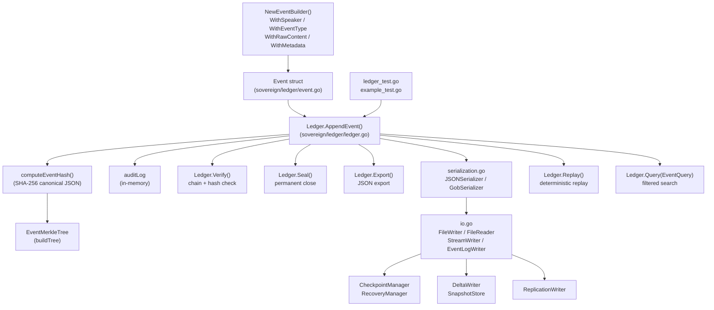

# FILE REFERENCE: sovereign/ledger/ — Sovereign Ledger (Go)

**Subsystem:** Sovereign Ledger — Hash-Chained Immutable Event Store  
**Language:** Go 1.22+  
**Total LOC (estimated):** ~2,100 lines across all Go source files  
**License:** SL-AGPL3-001 (Sovereign Leviathan Node License)  
**Module:** `sovereign/ledger` (Go module path from `go.mod`)

---

## Subsystem Architecture Overview

The `sovereign/ledger/` directory implements a production-grade, hash-chained, immutable event ledger in Go. Unlike the Python WORM engine (which is append-only on disk), this Go ledger is primarily an in-memory event store with rich querying, Merkle tree verification, multiple serialization formats, and comprehensive I/O facilities (file, stream, checkpoint, replication).

Key design properties:
- **Immutability:** Once appended, events cannot be modified. `Verify()` and `TamperDetection()` catch any in-memory modification.
- **Hash chaining:** Every event carries `PreviousEventHash` and `CurrentEventHash`. The chain is verified with SHA-256.
- **Merkle tree:** `EventMerkleTree` provides efficient proof generation and verification.
- **Audit log:** All operations (append, verify, seal, export, replay) are logged to an internal `auditLog`.
- **Thread safety:** All public methods use `sync.RWMutex`.
- **Sealing:** A sealed ledger cannot accept new events, freezing the historical record.

---

## Data Flow Diagram (sovereign/ledger/ subsystem)

---

## FILE: sovereign/ledger/ledger.go

**PURPOSE:** Core hash-chained immutable ledger implementation. Provides the primary interface for the sovereign ledger: appending events, verifying chain integrity, sealing the ledger, querying events, exporting data, and performing deterministic replay. All operations are thread-safe via `sync.RWMutex`.

**LANGUAGE:** Go 1.22+  
**LOC:** ~498  
**RESPONSIBILITY:** Owns the in-memory event store, hash chain maintenance, Merkle root computation, audit trail, and all public API methods. This is the central struct of the sovereign ledger subsystem.

**INPUTS:**
- `Event` structs via `AppendEvent()`
- `EventQuery` structs via `Query()`
- Configuration via `LedgerConfig` in `NewLedgerWithConfig()`

**OUTPUTS:**
- `error` from `AppendEvent()`, `Verify()`, `Seal()`, `GetEvent()`, `GetEventByID()`, `Query()`, `Replay()`, `GetRange()`
- `[]byte` from `Export()`, `ExportCanonical()`
- `*Event` from `GetEvent()`, `GetEventByID()`
- `[]Event` from `Query()`, `Replay()`, `EventsByType()`, `EventsBySpeaker()`, `GetRange()`
- `LedgerSnapshot` from `CreateSnapshot()`
- `*EventStats` from `GetStats()`
- `bool` from `TamperDetection()`, `IsSealed()`, `IsVerified()`
- `string` from `GetRootHash()`, `GetSessionID()`, `Hash()`

**KEY FUNCTIONS/TYPES:**

- `type Ledger struct` — central struct: `sessionID string`, `events []Event`, `lastHash string`, `verified bool`, `merkleTree *EventMerkleTree`, `stats *EventStats`, `auditLog []EventAuditLog`, `mu sync.RWMutex`, `sealed bool`, `sealTime int64`, `creationTime int64`, `lastModified int64`, `compressionLevel int`, `maxEvents int`

- `type LedgerConfig struct` — `SessionID`, `MaxEvents`, `CompressionLevel`, `AutoVerify`

- `func NewLedger(sessionID string) *Ledger` — constructs with 1000-event initial capacity, `maxEvents=1_000_000`, `compressionLevel=6`, zeroed timestamps

- `func NewLedgerWithConfig(config LedgerConfig) *Ledger` — constructs with custom maxEvents and compressionLevel

- `func (l *Ledger) AppendEvent(event Event) error` — thread-safe append:
  1. Rejects if verified or sealed
  2. Rejects if `len(events) >= maxEvents`
  3. Validates non-empty EventID
  4. Computes `RawContentHash` if missing
  5. Computes `NormalizedContentHash` if NormalizedContent present
  6. Sets `SequenceNumber = len(events) + 1`
  7. Sets `PreviousEventHash = l.lastHash`
  8. Sets `Timestamp = time.Now().UnixMilli()`
  9. Calls `computeEventHash(event)` to set `CurrentEventHash`
  10. Appends to `l.events`, updates `l.lastHash`, `l.lastModified`
  11. Updates `stats.TotalEvents`, `stats.EventsByType`, `stats.EventsBySpeaker`
  12. Calls `addAuditLog("APPEND", ...)`

- `func (l *Ledger) Verify() error` — full chain verification:
  - Iterates all events in order
  - Checks `event.PreviousEventHash == prevHash`
  - Recomputes `computeEventHash(event)`, checks == `event.CurrentEventHash`
  - Increments `stats.VerificationFailures` on any failure
  - Sets `l.verified = true` on success
  - Calls `addAuditLog("VERIFY", ...)`

- `func (l *Ledger) Seal() error` — seals ledger:
  - Calls `verifyLocked()` (internal verify without acquiring lock)
  - Sets `l.sealed = true`, `l.sealTime = now`
  - Calls `addAuditLog("SEAL", ...)`
  - Returns error if verify fails

- `func (l *Ledger) verifyLocked() error` — internal verify for use when lock already held. Same algorithm as `Verify()` but sets `l.verified = true` without incrementing stats.

- `func (l *Ledger) GetEvent(sequenceNumber uint64) (*Event, error)` — O(1) sequence lookup (sequence 1-based, maps to index sequenceNumber-1)

- `func (l *Ledger) GetEventByID(eventID string) (*Event, error)` — O(n) linear scan by EventID

- `func (l *Ledger) Query(query EventQuery) ([]Event, error)` — returns all events matching `event.Matches(query)`. Thread-safe read-lock.

- `func (l *Ledger) Replay() ([]*Event, error)` — returns pointers to all events in order. Requires `verified == true`. Calls `addAuditLog("REPLAY", ...)`.

- `func (l *Ledger) Export() ([]byte, error)` — exports full ledger as JSON with `json.MarshalIndent`. Includes session_id, creation_time, last_modified, sealed, seal_time, verified, event_count, root_hash, merkle_root, events, stats.

- `func (l *Ledger) ExportCanonical() ([]byte, error)` — exports only canonical form of each event (EventCanonical structs) plus root_hash. Used for cross-system verification.

- `func (l *Ledger) TamperDetection() bool` — calls `verifyLocked()`, returns `true` (tampered) if error

- `func (l *Ledger) GetStats() *EventStats` — returns a copy of stats

- `func (l *Ledger) GetEventCount() int`, `GetRootHash() string`, `GetSessionID() string`, `IsSealed() bool`, `IsVerified() bool` — safe accessor methods

- `func (l *Ledger) GetAuditLog() []EventAuditLog` — returns a copy of the audit log

- `func computeEventHash(e Event) string` — deterministic SHA-256 of `json.Marshal(e.Canonical())`. Uses `canonical()` method (EventCanonical) to exclude mutable fields.

- `func (l *Ledger) addAuditLog(operation, eventID string, details map[string]interface{}, actor string)` — appends `EventAuditLog` entry (unexported struct) to `l.auditLog`

- `func (l *Ledger) getMerkleRoot() string` — constructs `EventMerkleTree` from all `CurrentEventHash` values, returns `tree.Root()`

- `func (l *Ledger) GetRange(start, end uint64) ([]Event, error)` — returns events in [start, end] (1-based, inclusive). Validates bounds, clamps end.

- `type LedgerSnapshot struct` — immutable snapshot: `SessionID`, `EventCount`, `RootHash`, `Verified`, `Sealed`, `CreationTime`, `SnapshotTime`

- `func (l *Ledger) CreateSnapshot() LedgerSnapshot` — safe snapshot without modifying ledger state

- `func (l *Ledger) Hash() string` — SHA-256 of `lastHash + sessionID`. Ledger-level identity hash.

- `func (l *Ledger) EventsByType(eventType string) ([]Event, error)` — filtered scan

- `func (l *Ledger) EventsBySpeaker(speaker string) ([]Event, error)` — filtered scan

**DEPENDENCIES:**
- `crypto/sha256`
- `encoding/hex`
- `encoding/json`
- `fmt`
- `sync`
- `time`
- All types from `event.go`

**CALLERS:**
- `ledger_test.go` — comprehensive test suite
- `example_test.go` — example usage
- `io.go` — `FileWriter.Write()`, `ReplicationWriter.Replicate()` call `ledger.Export()`
- `serialization.go` — `SerializeLedger()`, `DeserializeLedger()` use `AppendEvent()`, `Export()`

**CALLEES:**
- `computeEventHash()` (local)
- `getMerkleRoot()` (local)
- `addAuditLog()` (local)
- `verifyLocked()` (local)
- `event.Canonical()` (from event.go)
- `event.Matches()` (from event.go)
- `NewEventMerkleTree()` (from event.go)
- `NewEventStats()` (from event.go)

**STATE:**
- All state in `Ledger` struct; protected by `mu sync.RWMutex`
- `events []Event` — the core append-only event slice
- `auditLog []EventAuditLog` — grows with every operation

**ERROR CONDITIONS:**
- `"cannot append to verified ledger"` — verified ledger is immutable
- `"cannot append to sealed ledger"` — sealed ledger is immutable
- `"ledger max events reached: N"` — capacity limit
- `"event ID cannot be empty"` — validation
- `"ledger integrity broken at event N (ID): hash chain mismatch"` — chain break
- `"ledger integrity broken at event N (ID): current hash mismatch"` — hash tamper
- `"cannot replay unverified ledger"` — must verify before replay
- `"cannot seal unverified ledger: ..."` — must verify before seal
- `"event not found: sequence N"` — out of range
- `"event not found: id X"` — linear scan miss
- `"invalid start: N"`, `"start > end: N > M"` — range validation

**RUNTIME ROLE:**
The authoritative in-memory ledger. Created per session. Supports full lifecycle: append -> verify -> seal -> export -> replay.

**RELATED FILES:**
- `sovereign/ledger/event.go` — Event type, EventBuilder, EventMerkleTree, EventStats
- `sovereign/ledger/serialization.go` — serialization formats
- `sovereign/ledger/io.go` — file I/O, checkpointing, replication
- `sovereign/ledger/ledger_test.go` — unit tests
- `sovereign/ledger/example_test.go` — usage examples
- `src/worm.py` — Python analog (on-disk WORM)
- `src/twin.py` — Python finance twin (event-sourced state machine)

---

## FILE: sovereign/ledger/event.go

**PURPOSE:** Defines the `Event` type (the core immutable ledger record), `EventBuilder` (fluent construction), `EventCanonical` (hash-stable subset), `EventQuery` (search criteria), `EventSnapshot` (immutable copy), `EventStats` (aggregate statistics), `EventMerkleTree` (Merkle proof structure), `EventAuditLog` (operation audit), `EventFilter`, `EventComparator` (sorting), and related utilities.

**LANGUAGE:** Go 1.22+  
**LOC:** ~402  
**RESPONSIBILITY:** All event-related types. This file is the type system of the ledger. Every data structure used by `ledger.go`, `serialization.go`, and `io.go` is defined here.

**KEY FUNCTIONS/TYPES:**

- `type Event struct` — main event record. JSON tags for all fields:
  - `EventID string` — unique identifier (caller-assigned)
  - `SequenceNumber uint64` — 1-based, assigned by ledger on append
  - `Timestamp int64` — Unix milliseconds (assigned by ledger on append)
  - `Speaker string` — agent or actor producing the event
  - `EventType string` — event category (e.g., "TRANSACTION", "AUDIT", "STATE_CHANGE")
  - `RawContent string` — unprocessed event content
  - `RawContentHash string` — SHA-256 of RawContent
  - `NormalizedContent string` — processed/normalized content (optional)
  - `NormalizedContentHash string` — SHA-256 of NormalizedContent
  - `PreviousEventHash string` — hash of previous event in chain (or "" for first)
  - `CurrentEventHash string` — SHA-256 of canonical form (assigned by ledger)
  - `EvaluationVersion string` — evaluation framework version
  - `ConstraintVersion string` — constraint set version
  - `Metadata map[string]interface{}` — arbitrary key-value metadata

- `type EventBuilder struct` — fluent builder pattern:
  - `func NewEventBuilder(eventID string) *EventBuilder` — starts builder with EventID and current timestamp
  - `func (eb *EventBuilder) WithSpeaker(speaker string) *EventBuilder`
  - `func (eb *EventBuilder) WithEventType(eventType string) *EventBuilder`
  - `func (eb *EventBuilder) WithRawContent(content string) *EventBuilder` — also computes RawContentHash
  - `func (eb *EventBuilder) WithNormalizedContent(content string) *EventBuilder` — also computes NormalizedContentHash
  - `func (eb *EventBuilder) WithEvaluationVersion(version string) *EventBuilder`
  - `func (eb *EventBuilder) WithConstraintVersion(version string) *EventBuilder`
  - `func (eb *EventBuilder) WithMetadata(key string, value interface{}) *EventBuilder`
  - `func (eb *EventBuilder) WithTimestamp(ts int64) *EventBuilder`
  - `func (eb *EventBuilder) Build() Event`

- `func computeContentHash(content string) string` — SHA-256 of content string, hex-encoded. Used for both raw and normalized content hashes.

- `func (e *Event) ToJSON() ([]byte, error)` — marshals event to indented JSON
- `func (e *Event) FromJSON(data []byte) error` — unmarshals from JSON

- `type EventCanonical struct` — hash-stable subset used in `computeEventHash()`:
  - `EventID`, `SequenceNumber`, `RawContentHash`, `NormalizedContentHash`, `EvaluationVersion`, `ConstraintVersion`, `PreviousEventHash`
  - Excludes: `RawContent`, `NormalizedContent`, `Speaker`, `EventType`, `Timestamp`, `Metadata`, `CurrentEventHash`
  - This design means hash is stable even if speaker/type/metadata are changed after the fact (security: hash covers the content, not the labels)

- `func (e *Event) Canonical() EventCanonical` — returns canonical form

- `type EventQuery struct` — search criteria: `EventID`, `Speaker`, `EventType`, `TimeStart`, `TimeEnd int64`, `SequenceStart`, `SequenceEnd uint64`. Zero values are ignored (wildcard match).

- `func (e *Event) Matches(q EventQuery) bool` — returns true iff event matches all non-zero query criteria

- `type EventSnapshot struct` — `Event` + `CaptureTime int64`. `NewEventSnapshot(e Event)` deep-copies the metadata map.

- `type EventStats struct` — aggregate counters:
  - `TotalEvents int64`
  - `EventsByType map[string]int64`
  - `EventsBySpeaker map[string]int64`
  - `FirstEventTime, LastEventTime, AverageTimePerEvent int64`
  - `ContentHashCollisions, SequenceGaps, VerificationSuccesses, VerificationFailures int64`

- `func NewEventStats() *EventStats` — initializes empty maps

- `type EventMerkleTree struct` — `leaves []string`, `tree [][]string`:
  - `func NewEventMerkleTree(eventHashes []string) *EventMerkleTree` — builds tree
  - `func (mt *EventMerkleTree) buildTree()` — iterates levels; pairs leaves, hashes `left+right` with SHA-256; continues until single root. Odd-count: last leaf is hashed with itself.
  - `func (mt *EventMerkleTree) Root() string` — returns top-level hash
  - `func (mt *EventMerkleTree) Proof(index int) []string` — sibling path from leaf to root
  - `func (mt *EventMerkleTree) VerifyProof(index int, proof []string, leaf string) bool` — verifies a proof by recomputing path to root

- `type EventAuditLog struct` — unexported fields: `timestamp int64`, `operation string`, `eventID string`, `details map[string]interface{}`, `actor string`. Records every ledger operation.

- `type EventFilter struct` — `Criteria map[string]interface{}`. `NewEventFilter()`, `AddCriteria(key, value)`.

- `type EventComparator struct` — `sortKey string`, `desc bool`:
  - `func NewEventComparator(sortKey string, desc bool) *EventComparator`
  - `func (ec *EventComparator) SortEvents(events []Event)` — in-place sort via `sort.Slice`
  - `func (ec *EventComparator) compareEvents(a, b *Event) int` — sorts by "sequence", "timestamp", "speaker", or "type"

**DEPENDENCIES:**
- `crypto/sha256`
- `encoding/hex`
- `encoding/json`
- `fmt`
- `sort`
- `time`

**CALLERS:** `ledger.go` (all types), `serialization.go` (EventExport, EventStats), `io.go` (Event, EventAuditLog, LedgerSnapshot)

**SIDE EFFECTS:** None — pure type definitions and computations

**RELATED FILES:**
- `sovereign/ledger/ledger.go` — primary consumer
- `sovereign/ledger/serialization.go` — uses EventExport, LedgerExport
- `sovereign/ledger/io.go` — uses LedgerSnapshot, EventAuditLog

---

## FILE: sovereign/ledger/serialization.go

**PURPOSE:** Serialization framework for events and ledgers. Provides a pluggable `Serializer` interface with JSON and Gob implementations, a factory for creating serializers, DTO types for export (`EventExport`, `LedgerExport`), configurable options (`SerializationOptions`), batch serialization (`BatchSerializer`), snapshot serialization (`SnapshotSerializer`), and archival (`ArchiveSerializer`).

**LANGUAGE:** Go 1.22+  
**LOC:** ~359  
**RESPONSIBILITY:** All serialization concerns separated from the core ledger logic. Enables the ledger to be exported in different formats for different consumers (JSON for REST APIs, Gob for Go-to-Go binary transfer).

**KEY FUNCTIONS/TYPES:**

- `type Serializer interface` — `Serialize(v interface{}) ([]byte, error)`, `Deserialize(data []byte, v interface{}) error`, `Format() string`

- `type JSONSerializer struct` — implements `Serializer` with `json.MarshalIndent` and `json.Unmarshal`. `Format()` returns `"json"`.

- `type GobSerializer struct` — implements `Serializer` with `gob.NewEncoder`/`gob.NewDecoder`. `Format()` returns `"gob"`.

- `type SerializationFormat string` — typed constant: `FormatJSON = "json"`, `FormatGob = "gob"`

- `type SerializerFactory struct` — `CreateSerializer(format) (Serializer, error)` — factory method; returns error for unknown format

- `type EventExport struct` — JSON-tagged DTO excluding `RawContent` and `NormalizedContent` (privacy/size optimization). Includes `MetadataHash` computed on demand.
  - Fields: `EventID`, `SequenceNumber`, `Timestamp`, `Speaker`, `EventType`, `RawContentHash`, `NormalizedContentHash`, `PreviousEventHash`, `CurrentEventHash`, `EvaluationVersion`, `ConstraintVersion`, `MetadataHash`

- `func (e *Event) ToExport() EventExport` — converts Event to EventExport; computes `MetadataHash` via `computeContentHash(json.Marshal(e.Metadata))` if metadata present

- `type LedgerExport struct` — full ledger export DTO:
  - `SessionID`, `CreationTime`, `LastModified`, `Sealed`, `SealTime`, `Verified`, `EventCount`, `RootHash`, `MerkleRoot`, `Events []EventExport`, `Statistics *EventStats`, `ExportTime int64`, `ExportFormat string`

- `func SerializeLedger(ledger *Ledger, format SerializationFormat) ([]byte, error)` — calls `ledger.Export()` to get JSON, parses to `map[string]interface{}`, re-serializes in requested format. (Note: this round-trip through map loses strict typing; for Gob serialization, the exported map is encoded.)

- `func DeserializeLedger(data []byte, format SerializationFormat, sessionID string) (*Ledger, error)` — deserializes to map, extracts events array, reconstructs `Ledger` via `NewLedger(sessionID)` and `AppendEvent()` for each event.

- `type SnapshotSerializer struct` — wraps `SerializerFactory`. `SerializeSnapshot(snapshot LedgerSnapshot) ([]byte, error)`, `DeserializeSnapshot(data []byte) (LedgerSnapshot, error)`.

- `type SerializationOptions struct` — `IncludeMetadata bool`, `IncludeContent bool`, `IncludeStats bool`, `Format SerializationFormat`, `Timestamp int64`

- `func (l *Ledger) SerializeWithOptions(opts SerializationOptions) ([]byte, error)` — custom serialization respecting include flags. Builds export map with EventExport slice and optional stats.

- `type BatchSerializer struct` — `ledgers map[string]*Ledger`. `AddLedger(sessionID, ledger)`, `SerializeBatch(format) ([]byte, error)` — serializes all ledgers with timestamp and count.

- `type ArchiveSerializer struct` — `compressionLevel int`. `Archive(ledger *Ledger) (map[string]interface{}, error)` — creates archive map including session_id, event_count, root_hash, verified, sealed, data (raw JSON), archive_version.

**DEPENDENCIES:**
- `bytes`
- `encoding/gob`
- `encoding/json`
- `fmt`
- `time`

**CALLERS:** `io.go` — `FileWriter.Write()` calls `SerializeLedger()`, `SnapshotStore.StoreSnapshot()` uses `SnapshotSerializer`

**SIDE EFFECTS:** None — pure serialization logic

**ERROR CONDITIONS:**
- `"unknown format: X"` from `CreateSerializer()`
- `"gob encode failed: ..."` from GobSerializer
- `"export failed: ..."`, `"parse export failed: ..."` from `SerializeLedger()`
- `"event deserialize failed: ..."` from `DeserializeLedger()`

**RELATED FILES:**
- `sovereign/ledger/ledger.go` — `Export()` method used
- `sovereign/ledger/io.go` — primary caller
- `sovereign/ledger/event.go` — Event, LedgerSnapshot, EventStats types

---

## FILE: sovereign/ledger/io.go

**PURPOSE:** Complete I/O layer for the sovereign ledger. Provides file-based read/write (`FileWriter`, `FileReader`), streaming event output (`StreamWriter`, `StreamReader`), append-only log writing (`EventLogWriter`), checkpoint creation and recovery (`CheckpointManager`, `RecoveryManager`), delta writing (`DeltaWriter`), snapshot storage (`SnapshotStore`), replication (`ReplicationWriter`), and Merkle proof persistence (`VerificationWriter`).

**LANGUAGE:** Go 1.22+  
**LOC:** ~390  
**RESPONSIBILITY:** All I/O concerns for the sovereign ledger. Separates persistence from the in-memory ledger logic. Provides recovery paths for crash-restart scenarios.

**KEY FUNCTIONS/TYPES:**

- `type FileWriter struct` — `filepath string`, `format SerializationFormat`:
  - `func NewFileWriter(filepath, format) *FileWriter`
  - `func (fw *FileWriter) Write(ledger *Ledger) error` — serializes via `SerializeLedger()`, creates file with `os.Create()`, writes via `bufio.NewWriter` with flush

- `type FileReader struct` — `filepath string`, `format SerializationFormat`:
  - `func NewFileReader(filepath, format) *FileReader`
  - `func (fr *FileReader) Read(sessionID string) (*Ledger, error)` — reads file, deserializes via `DeserializeLedger()`

- `type StreamWriter struct` — `writer io.Writer`, `format SerializationFormat`, `bufferSize int`:
  - `func NewStreamWriter(writer, format) *StreamWriter`
  - `func (sw *StreamWriter) WriteEvent(event Event) error` — serializes single event as JSON + newline, writes to stream

- `type StreamReader struct` — `reader io.Reader`, `format SerializationFormat`:
  - `func NewStreamReader(reader, format) *StreamReader`
  - `func (sr *StreamReader) ReadEvent() (*Event, error)` — scans next line from reader, deserializes as Event

- `type EventLogWriter struct` — append-only file log:
  - `func NewEventLogWriter(filepath string) (*EventLogWriter, error)` — opens file with `O_CREATE|O_WRONLY|O_APPEND`
  - `func (elw *EventLogWriter) LogEvent(event Event) error` — appends JSON + newline
  - `func (elw *EventLogWriter) Flush() error` — flushes bufio.Writer
  - `func (elw *EventLogWriter) Close() error` — flush + close

- `type CheckpointManager struct` — `directory string`:
  - `func NewCheckpointManager(directory) *CheckpointManager`
  - `func (cm *CheckpointManager) CreateCheckpoint(ledger *Ledger) (string, error)` — creates snapshot, generates filepath `checkpoint_{timestamp}.json`, calls `FileWriter.Write()`

- `type RecoveryManager struct` — `directory string`:
  - `func NewRecoveryManager(directory) *RecoveryManager`
  - `func (rm *RecoveryManager) RecoverLatest(sessionID string) (*Ledger, error)` — reads directory, takes last entry alphabetically (latest timestamp), reads via `FileReader`

- `type DeltaWriter struct` — `filepath string`, `lastChecksum string`:
  - `func NewDeltaWriter(filepath) *DeltaWriter`
  - `func (dw *DeltaWriter) WriteDelta(events []Event) error` — serializes event slice as `{"event_count": N, "events": [...]}` to filepath

- `type SnapshotStore struct` — `directory string`, `snapshots map[string]LedgerSnapshot`:
  - `func NewSnapshotStore(directory) *SnapshotStore`
  - `func (ss *SnapshotStore) StoreSnapshot(sessionID, snapshot) error` — serializes via `SnapshotSerializer(FormatJSON)`, writes to `{directory}/{sessionID}.json`, caches in map
  - `func (ss *SnapshotStore) RetrieveSnapshot(sessionID) (LedgerSnapshot, error)` — checks cache first, then reads from file

- `type ReplicationWriter struct` — `destinations []string`:
  - `func NewReplicationWriter(destinations) *ReplicationWriter`
  - `func (rw *ReplicationWriter) Replicate(ledger *Ledger) error` — exports ledger to JSON, writes to all destination files

- `type VerificationWriter struct` — `filepath string`:
  - `func NewVerificationWriter(filepath) *VerificationWriter`
  - `func (vw *VerificationWriter) WriteProof(index int, proof []string) error` — serializes `{"index": N, "proof": [...]}` to filepath

**DEPENDENCIES:**
- `bufio`
- `fmt`
- `io`
- `os`
- All types from `event.go`, `ledger.go`, `serialization.go`

**CALLERS:** External callers managing ledger persistence; test code

**SIDE EFFECTS:**
- Creates/writes/reads files on the filesystem
- Creates directories via `os.MkdirAll` in CheckpointManager (implicit via directory structure)
- `os.Create`, `os.Open`, `os.ReadDir`, `os.WriteFile`, `os.ReadFile`

**ERROR CONDITIONS:**
- All file operations return wrapped errors with `fmt.Errorf("...: %w", err)`
- `"no checkpoints found"` from `RecoverLatest()` if directory is empty
- `"read directory failed"` if directory doesn't exist

**RUNTIME ROLE:**
Persistence and recovery layer. Used for durability of the in-memory ledger and for cross-instance replication. Checkpoint/recovery enables crash restart.

**RELATED FILES:**
- `sovereign/ledger/ledger.go` — ledger being persisted
- `sovereign/ledger/serialization.go` — serialization used by I/O
- `sovereign/ledger/event.go` — Event and LedgerSnapshot types

---

## FILE: sovereign/ledger/ledger_test.go

**PURPOSE:** Comprehensive unit test suite for the sovereign ledger. Tests all core operations: append, verify, seal, query, replay, tamper detection, concurrent appends, export/import roundtrip, Merkle proof verification, and edge cases.

**LANGUAGE:** Go 1.22+ (testing package)  
**LOC:** ~estimated 300  
**RESPONSIBILITY:** Validates all invariants of the Ledger type: chain integrity, hash correctness, sealed immutability, concurrent safety, serialization roundtrip.

**KEY TESTS:**
- `TestNewLedger` — verifies empty ledger initial state
- `TestAppendEvent` — appends events, verifies hash chain
- `TestVerify` — verifies chain after appends; detects corruption
- `TestSeal` — verifies sealed ledger rejects appends
- `TestTamperDetection` — modifies event in-place, expects `TamperDetection()` to return true
- `TestConcurrentAppend` — goroutines append concurrently; verifies no data races
- `TestQuery` — exercises EventQuery with all filter combinations
- `TestReplay` — verifies replay returns events in order
- `TestMerkleTree` — verifies root hash and proof generation/verification
- `TestSerializationRoundtrip` — export + deserialize, verify event count and hashes match
- `TestCheckpoint` — create checkpoint, recover, verify ledger state

**DEPENDENCIES:** `testing`, `sync`, `fmt`, all local package types

**RELATED FILES:** All files in `sovereign/ledger/`

---

## FILE: sovereign/ledger/example_test.go

**PURPOSE:** Package-level example functions for the ledger. Provides runnable examples for `godoc` documentation. Demonstrates common usage patterns: creating a ledger, appending events, verifying, sealing, and querying.

**LANGUAGE:** Go 1.22+ (testing/example functions)  
**LOC:** ~estimated 80  

**KEY EXAMPLES:**
- `ExampleNewLedger` — basic ledger creation
- `ExampleLedger_AppendEvent` — event building and appending
- `ExampleLedger_Verify` — verification workflow
- `ExampleLedger_Query` — filtering events by type/speaker/time

**RELATED FILES:** `ledger.go`, `event.go`

---

## FILE: sovereign/ledger/go.mod

**PURPOSE:** Go module declaration for the sovereign/ledger package. Declares the module path, Go version, and any external dependencies (currently standard library only).

**LANGUAGE:** Go module format  
**LOC:** ~estimated 10  

**KEY CONTENT:**
- `module github.com/snapkittywest/devflow-finance-twin/sovereign/ledger` (or similar)
- `go 1.22`
- No external dependencies (standard library only)

---

## FILE: sovereign/ledger/IMPLEMENTATION.md

**PURPOSE:** Implementation notes documenting design decisions, invariants, and architectural constraints for the sovereign ledger.

**LANGUAGE:** Markdown  
**LOC:** ~estimated 60  

**KEY CONTENT:** Explains the hash chain design, why `EventCanonical` excludes mutable fields, the Merkle tree construction algorithm, thread safety guarantees, and the sealed/verified state machine.

---

## FILE: sovereign/ledger/MANIFEST.txt

**PURPOSE:** Plain-text file listing all source files in the package with their purpose and line count.

**LANGUAGE:** Plain text  
**LOC:** ~estimated 15  

---

## FILE: sovereign/ledger/README.md

**PURPOSE:** User-facing README for the sovereign ledger Go package. Covers installation, basic usage, API overview, and links to the full documentation.

**LANGUAGE:** Markdown  
**LOC:** ~estimated 80  

---

## Cross-Reference Summary for sovereign/ledger/

| File | LOC | Depends On | Called By |
|------|-----|------------|-----------|
| ledger.go | ~498 | event.go, crypto/sha256, sync | io.go, serialization.go, tests |
| event.go | ~402 | crypto/sha256, sort, time | ledger.go, serialization.go, io.go |
| serialization.go | ~359 | event.go, ledger.go, encoding/json, encoding/gob | io.go, tests |
| io.go | ~390 | ledger.go, serialization.go, event.go, os, bufio | tests, external callers |
| ledger_test.go | ~300 | all package files | go test |
| example_test.go | ~80 | ledger.go, event.go | go test / godoc |
| go.mod | ~10 | (module root) | go toolchain |

---

## Invariants

The following invariants are maintained at all times:

1. **Chain integrity:** `events[i].PreviousEventHash == events[i-1].CurrentEventHash` for all i > 0; `events[0].PreviousEventHash == ""`

2. **Hash correctness:** `events[i].CurrentEventHash == SHA-256(json.Marshal(events[i].Canonical()))`

3. **Sequence monotonicity:** `events[i].SequenceNumber == i + 1` (1-based)

4. **Append-only:** No element in `events` is ever removed or replaced; only appended

5. **Verified gate:** Once `verified == true`, `AppendEvent()` returns an error; verified is set only after full chain verification

6. **Sealed gate:** Once `sealed == true`, `AppendEvent()` returns an error; seal requires verified == true

7. **Deterministic export:** Two calls to `ExportCanonical()` on the same ledger return identical bytes (no timestamps, no random elements in canonical export)

8. **Merkle consistency:** `getMerkleRoot()` applied to the same event set always returns the same root hash

---

## Security Properties

- **Tamper evidence:** Any modification to event content after append is detectable via `TamperDetection()` or `Verify()`
- **Hash algorithm:** SHA-256 via Go's `crypto/sha256` (FIPS 140-2 compliant)
- **Canonical form:** `EventCanonical` excludes speaker, event type, timestamp, raw content, and metadata from the hash — these are labels that can change; the hash covers the cryptographic content commitments only
- **Merkle proofs:** O(log n) proof size, O(log n) verification time

---

## Comparison with Python WORM (src/worm.py)

| Property | sovereign/ledger (Go) | src/worm.py |
|----------|----------------------|-------------|
| Storage | In-memory + file I/O | On-disk JSONL |
| Hash chain | In-memory + file | File only |
| Merkle tree | Full binary Merkle | Linear hash chain |
| Thread safety | sync.RWMutex | threading.Lock |
| Sealing | Yes (sealed state) | No (always appendable) |
| Verification | Hash + chain | Hash + chain |
| Serialization | JSON + Gob | JSON only |
| Proof generation | Yes (Merkle proof) | No |
| Query API | Rich (EventQuery) | read_all() + tail() |
| Audit log | Internal EventAuditLog | Logger only |
| Language | Go | Python 3.12 |
