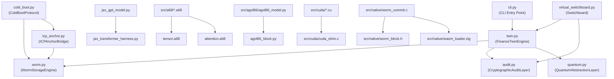

# FILE REFERENCE: src/ — Devflow Finance Twin Core Python and Native Layer

**Subsystem:** Core Execution Engine  
**Languages:** Python 3.12, ALGOL 68, Python (PyTorch), CUDA C++, C, Zig, Assembly  
**Total LOC (estimated):** ~12,000 lines across all files in src/  
**License:** SL-AGPL3-001 (Sovereign Leviathan Node License)  

---

## Subsystem Architecture Overview

The `src/` directory is the primary execution layer of the devflow-finance-twin system. It implements:

1. **WORM Storage** (`worm.py`) — append-only hash-chained immutable event log
2. **Finance Twin** (`twin.py`) — event-sourced financial state machine
3. **Audit Layer** (`audit.py`) — cryptographic decision-seal generation and verification
4. **Quantum Abstraction** (`quantum.py`) — entropy and portfolio optimization stub
5. **CLI Interface** (`cli.py`) — command-line driver for the finance engine
6. **Cold Boot Protocol** (`cold_boot.py`) — 3-phase IPL mirroring z/Architecture
7. **ICP Anchor Bridge** (`icp_anchor.py`) — Internet Computer Protocol cross-chain anchoring
8. **Virtual Switchboard** (`virtual_switchboard.py`) — bounded self-improving agent loop
9. **JAX GPT Model** (`jax_gpt_model.py`) — production JAX transformer implementation
10. **JAX Transformer Harness** (`jax_transformer_harness.py`) — full harness with training, verification, serialization
11. **src/a68/** — ALGOL 68 transformer modules
12. **src/agol86/** — PyTorch AGOL-86 transformer implementation
13. **src/cuda/** — CUDA kernel extensions for masked attention
14. **src/native/** — C/Zig native layer bridging WASM and WORM

---

## Data Flow Diagram (src/ subsystem)

---

## FILE: src/worm.py

**PURPOSE:** Production-grade Write Once Read Many (WORM) storage subsystem. Implements an append-only, hash-linked immutable event log with Merkle-chain integrity guarantees. This is the foundational persistence layer for the entire financial twin — all state changes are durably committed here before being applied to in-memory state.

**LANGUAGE:** Python 3.12  
**LOC:** ~251  
**RESPONSIBILITY:** Owns all on-disk persistence for the ledger. Provides atomic append semantics, hash-chain integrity, thread-safety, and size-limit enforcement.

**INPUTS:**
- `payload: Dict[str, Any]` — arbitrary financial event dictionaries passed to `append()`
- WORM storage file path passed at construction
- Environment: file system (POSIX-compatible), threading primitives

**OUTPUTS:**
- Persisted JSONL records in the WORM file (one JSON object per line)
- `final_record: Dict[str, Any]` from `append()` — includes `prev_hash`, `payload`, `record_hash`
- `Tuple[bool, Optional[str]]` from `verify_integrity()` — validity flag + optional error message
- `List[Dict[str, Any]]` from `read_all()` and `tail()`

**KEY FUNCTIONS/TYPES:**

- `class WormStorageError(Exception)` — Base exception hierarchy for WORM failures. Subclasses: `WormIntegrityError`, `WormSizeLimitError`, `WormRecordError`. Allows callers to discriminate between disk errors, integrity violations, record malformation, and size limit breaches.

- `class WormStorageEngine` — Central class encapsulating all WORM I/O. Constructor takes `storage_path: str` (default `"ledger.worm"`). Initializes file with `chmod 0o600`, acquires `threading.Lock`. All public methods are guarded by this lock.

- `WormStorageEngine._ensure_storage()` — Creates the storage file and parent directories with mode `0o600` if not present. Raises `WormStorageError` on OS-level failures.

- `WormStorageEngine._check_size_limit(additional_bytes: int)` — Enforces the 500 MB hard cap (`MAX_WORM_FILE_SIZE_BYTES = 500 * 1024 * 1024`). Raises `WormSizeLimitError` if the current file size plus proposed addition would exceed the limit. Prevents disk exhaustion attacks.

- `WormStorageEngine.get_last_hash() -> str` — Reads the storage file and returns the `record_hash` field of the most recent non-empty line. Returns `ZERO_HASH` (`"0"*64`) for empty storage. Used as `prev_hash` for the next record.

- `WormStorageEngine.append(payload: Dict[str, Any]) -> Dict[str, Any]` — Thread-safe, atomic append. Validates payload (must be non-empty dict). Computes `prev_hash`, constructs canonical JSON record, SHA-256 hashes it, checks per-record size limit (1 MB), checks total size limit, then performs atomic write via temp file + `os.replace()`. Calls `os.fsync()` before replace to ensure durability. Returns the final record with `record_hash`.

- `WormStorageEngine.read_all() -> List[Dict[str, Any]]` — Reads every line from the WORM file, parsing each as JSON. Raises `WormRecordError` on any corrupt line. Returns list of record dicts.

- `WormStorageEngine.verify_integrity() -> Tuple[bool, Optional[str]]` — Full chain verification. For each record, checks: required fields present (`prev_hash`, `payload`, `record_hash`), `prev_hash` matches expected (chain linkage), and recomputes `record_hash` from canonical JSON. Returns `(True, None)` on success or `(False, error_message)` on first violation.

- `WormStorageEngine.record_count() -> int` — Convenience method returning number of records.

- `WormStorageEngine.tail(n: int = 10) -> List[Dict[str, Any]]` — Returns the last `n` records without verifying the full chain.

**DEPENDENCIES:**
- `hashlib` (SHA-256)
- `json`
- `logging`
- `os` (fsync, replace)
- `struct`
- `threading`
- `time`
- `pathlib.Path`
- `typing`

**CALLERS:**
- `src/twin.py` — `FinanceTwinEngine` holds a `WormStorageEngine` reference and calls `append()`, `read_all()`, `verify_integrity()`
- `src/cli.py` — constructs `WormStorageEngine` and passes it to `FinanceTwinEngine`
- `src/cold_boot.py` — `ColdBootProtocol` opens the same WORM file path for SVC-level reads/writes

**CALLEES:**
- OS filesystem operations via `pathlib`, `os`
- `hashlib.sha256`
- `json.dumps`, `json.loads`

**STATE:**
- `storage_path: Path` — set at construction, immutable
- `_lock: threading.Lock` — protects append operations from concurrent writes

**CONFIGURATION:**
- `MAX_WORM_FILE_SIZE_BYTES = 500 * 1024 * 1024` (500 MB)
- `MAX_RECORD_SIZE_BYTES = 1 * 1024 * 1024` (1 MB)
- `HASH_ALGORITHM = "sha256"`
- `ZERO_HASH = "0" * 64` — used as the genesis prev_hash

**SIDE EFFECTS:**
- Creates WORM file at `storage_path` with `chmod 0o600` on first call
- Creates `.worm.tmp` temp file during each atomic append, then replaces via `os.replace()`
- Calls `os.fsync()` to flush to physical storage before rename
- Writes append-only JSONL records to disk

**ERROR CONDITIONS:**
- `WormStorageError` — generic I/O failure (disk full, permissions, corrupt JSON)
- `WormIntegrityError` — raised from chain verification failures
- `WormSizeLimitError` — raised when file would exceed 500 MB cap
- `WormRecordError` — raised for empty payloads, non-dict payloads, oversized records, corrupt lines

**RUNTIME ROLE:**
Foundational persistence layer. Called for every financial command executed via `twin.py`. All financial state derives from replaying records stored here. This file must be present and uncorrupted for the system to function.

**RELATED FILES:**
- `src/twin.py` — primary consumer; rebuilds state from WORM records
- `src/cold_boot.py` — alternate WORM writer (SVC 254 handler)
- `src/icp_anchor.py` — reads WORM root hash for cross-chain anchoring
- `src/native/worm_commit.c` — C-layer equivalent for low-level WORM commit
- `src/native/worm_block.h` — C struct definition of WORM block layout
- `wasm/worm_frame.wat` — WASM serialization of WORM frames

---

## FILE: src/twin.py

**PURPOSE:** Event-sourced financial digital twin. Maintains the in-memory financial state (accounts, transactions, invoices, obligations, approvals) by replaying events from the WORM log. Implements the core business logic for all financial operations with production hardening: rate limiting, strict decimal arithmetic, pre-validation, and cryptographic decision sealing.

**LANGUAGE:** Python 3.12  
**LOC:** ~345  
**RESPONSIBILITY:** Owns the live financial state. Acts as the authoritative source of account balances, transaction records, invoice status, and obligation tracking. Coordinates WORM persistence, cryptographic audit sealing, and quantum entropy.

**INPUTS:**
- `WormStorageEngine` instance — passed at construction
- `QuantumAbstractionLayer` instance — optional, defaults to `QuantumAbstractionLayer()`
- Financial commands via `execute_command(operation, actor, data)`:
  - `operation: str` — must be in `VALID_OPERATIONS` frozenset
  - `actor: str` — non-empty string identifying the responsible party
  - `data: Dict[str, Any]` — operation-specific payload

**OUTPUTS:**
- `execute_command()` returns `Dict` with keys: `event_id`, `worm_record_hash`, `decision_seal`, `current_state_hash`
- `get_account_balance(account_id)` returns `Optional[Decimal]`
- `list_accounts()` returns `Dict[str, str]` (account_id -> balance string)
- `get_transaction(tx_id)` returns `Optional[Dict[str, Any]]`
- `verify_ledger_consistency()` returns `Tuple[bool, Optional[str]]`

**KEY FUNCTIONS/TYPES:**

- `def quantize_money(amount: Any) -> Decimal` — Module-level helper. Converts any numeric input to `Decimal`, validates non-negative, validates against `MAX_BALANCE = Decimal("99999999999999999.9999")`, quantizes to 4 decimal places with `ROUND_HALF_EVEN`. This is the canonical money representation.

- `class RateLimiter` — Sliding-window rate limiter. Defaults to 1000 ops per 60 seconds. `check() -> bool` prunes expired timestamps and checks capacity. State: `_timestamps: List[float]`.

- `class FinanceTwinEngine` — Central class. Constructor takes `WormStorageEngine` and optional `QuantumAbstractionLayer`. Initializes all in-memory state dicts, calls `rebuild_state()` immediately.

- `FinanceTwinEngine.compute_state_hash() -> str` — Deterministic SHA-256 hash of the current in-memory state. Uses sorted account balances, sorted transaction/invoice/liability/asset keys, and event count. Used for consistency verification.

- `FinanceTwinEngine.rebuild_state()` — Resets all in-memory state to empty, then replays every record from WORM via `_apply_event_to_memory()`. Raises on any business rule violation encountered during replay. This is called at construction and during `verify_ledger_consistency()`.

- `FinanceTwinEngine._apply_event_to_memory(event, record_hash)` — Dispatches on `event["operation"]` to apply one event to in-memory state. Handles all 8 operations: `CREATE_ACCOUNT`, `POST_TRANSACTION`, `CREATE_INVOICE`, `RECORD_PAYMENT`, `CREATE_OBLIGATION`, `APPROVE_TRANSACTION`, `REJECT_TRANSACTION`, `REVERSE_TRANSACTION`. After applying, generates and stores a new `CryptographicAuditLayer` decision seal.

- `FinanceTwinEngine.execute_command(operation, actor, data) -> Dict` — Full production execution pipeline: rate limit check, operation validation, actor validation, data type validation, pre-validation of funds for `POST_TRANSACTION`, WORM append, local state application, decision seal update. Returns event details.

- `FinanceTwinEngine.verify_ledger_consistency() -> Tuple[bool, Optional[str]]` — Calls `storage.verify_integrity()` for WORM chain check, then computes current state hash, rebuilds state from scratch, and verifies the rebuilt hash matches. Catches state drift.

- `FinanceTwinEngine.get_account_balance(account_id) -> Optional[Decimal]` — Safe dict lookup.

- `FinanceTwinEngine.list_accounts() -> Dict[str, str]` — Returns all account balances as strings.

- `FinanceTwinEngine.get_transaction(tx_id) -> Optional[Dict]` — Safe transaction lookup.

**DEPENDENCIES:**
- `decimal` (`Decimal`, `ROUND_HALF_EVEN`, `InvalidOperation`)
- `json`, `hashlib`
- `logging`, `time`
- `collections.defaultdict`
- `datetime` (`datetime`, `timezone`)
- `typing`
- `uuid`
- `worm.WormStorageEngine`
- `audit.CryptographicAuditLayer`
- `quantum.QuantumAbstractionLayer`

**CALLERS:**
- `src/cli.py` — primary caller; instantiates engine and calls `execute_command()`
- `src/virtual_switchboard.py` — `FinanceWorker` routes to the twin for balance inquiry

**CALLEES:**
- `WormStorageEngine.append()`, `read_all()`, `verify_integrity()`
- `CryptographicAuditLayer.generate_seal()`
- `QuantumAbstractionLayer` (constructed but minimal use in base operations)
- `quantize_money()` helper

**STATE:**
- `accounts: Dict[str, Decimal]` — live account balances
- `transactions: Dict[str, Dict]` — transaction records keyed by tx_id
- `invoices: Dict[str, Dict]` — invoice records keyed by invoice_id
- `liabilities: Dict[str, Dict]` — obligation/liability records
- `assets: Dict[str, Dict]` — asset records (populated by future operations)
- `approvals: Dict[str, bool]` — approval/rejection decisions per tx_id
- `event_count: int` — total events applied
- `latest_decision_seal: Optional[Dict]` — most recent cryptographic seal
- `_rate_limiter: RateLimiter` — per-instance rate limiter

**CONFIGURATION:**
- `MAX_BALANCE = Decimal("99999999999999999.9999")` — maximum representable balance
- `MAX_TRANSACTION_AMOUNT = Decimal("99999999999999.9999")` — per-transaction cap
- `RATE_LIMIT_WINDOW_SECONDS = 60`
- `RATE_LIMIT_MAX_OPS = 1000`
- `VALID_OPERATIONS = frozenset({"CREATE_ACCOUNT", "POST_TRANSACTION", "CREATE_INVOICE", "RECORD_PAYMENT", "CREATE_OBLIGATION", "APPROVE_TRANSACTION", "REJECT_TRANSACTION", "REVERSE_TRANSACTION"})`

**SIDE EFFECTS:**
- Each `execute_command()` call appends one record to the WORM file via `WormStorageEngine.append()`
- Mutates all in-memory state dicts

**ERROR CONDITIONS:**
- `ValueError` — raised for: invalid operation names, empty actors, non-dict data, insufficient funds, non-existent accounts, duplicate account creation, self-transactions, invalid monetary amounts, already-reversed transactions
- `WormStorageError` — propagated from `WormStorageEngine` on disk failures
- `ValueError` from rate limiter exceeded

**RUNTIME ROLE:**
The heart of the financial twin. All financial commands flow through this engine. It is the single source of truth for live financial state and is always reconstructable from WORM history.

**RELATED FILES:**
- `src/worm.py` — storage backend
- `src/audit.py` — decision seal generation
- `src/quantum.py` — entropy source
- `src/cli.py` — CLI driver
- `finance/cobol/COBILT-DATAWORM.cbl` — COBOL counterpart for treasury operations
- `sovereign/ledger/ledger.go` — Go analog for event-sourced ledger

---

## FILE: src/audit.py

**PURPOSE:** Production-grade cryptographic Decision Seal generation and verification. Every financial operation and state transition in the finance twin generates an immutable, hash-linked Decision Seal. These seals are versioned, chain-linked, and independently verifiable, providing a tamper-evident audit trail at the operation level (above the WORM record level).

**LANGUAGE:** Python 3.12  
**LOC:** ~126  
**RESPONSIBILITY:** Generates and verifies decision seals. Each seal captures the full context of a financial decision: who did it, when, what operation, what the state was before and after, and a SHA-256 digest of all that data.

**INPUTS:**
- `generate_seal()`: event_id, parent_event_hash, timestamp, actor, operation, previous_state_hash, resulting_state_hash, metadata dict
- `verify_seal()`: seal dict (as produced by `generate_seal()`)
- `chain_verify()`: list of seal dicts

**OUTPUTS:**
- `generate_seal()` returns `Dict[str, Any]` containing all input fields plus `"cryptographic_digest": str` (SHA-256 hex)
- `verify_seal()` returns `bool`
- `chain_verify()` returns `Tuple[bool, Optional[str]]`

**KEY FUNCTIONS/TYPES:**

- `SEAL_VERSION = "1.0.0"` — forward-compatible versioning for seal format

- `HASH_ALGORITHM = "sha256"` — algorithm constant for documentation

- `class CryptographicAuditLayer` — static utility class. All methods are `@staticmethod`. No instance state.

- `CryptographicAuditLayer.generate_seal(event_id, parent_event_hash, timestamp, actor, operation, previous_state_hash, resulting_state_hash, metadata) -> Dict` — Constructs `seal_data` dict with `seal_version`, all parameters. Serializes to canonical JSON (`sort_keys=True, separators=(',', ':'), default=str`). Computes SHA-256 digest. Returns seal dict with `cryptographic_digest` appended. Raises `ValueError` if `event_id` or `actor` is empty.

- `CryptographicAuditLayer.verify_seal(seal: Dict) -> bool` — Strips `cryptographic_digest` from seal, re-serializes identically, recomputes SHA-256, compares. Returns `False` and logs warning on any failure. Returns `True` only on exact hash match.

- `CryptographicAuditLayer.chain_verify(seals: list) -> Tuple[bool, Optional[str]]` — Iterates a list of seals. For each: calls `verify_seal()`, and if not the first, checks that `seal["parent_event_hash"] == seals[idx-1]["cryptographic_digest"]`. Returns `(False, error_message)` on first failure, `(True, None)` if all pass.

**DEPENDENCIES:**
- `hashlib`
- `json`
- `logging`
- `decimal.Decimal`
- `typing`

**CALLERS:**
- `src/twin.py` — `FinanceTwinEngine._apply_event_to_memory()` calls `CryptographicAuditLayer.generate_seal()` after every operation

**CALLEES:**
- `hashlib.sha256`
- `json.dumps`

**STATE:** None — all methods are stateless static methods.

**CONFIGURATION:**
- `SEAL_VERSION = "1.0.0"` — embedded in every seal for forward compatibility

**SIDE EFFECTS:** None. Pure computation. Logging to `devflow.audit` logger only.

**ERROR CONDITIONS:**
- `ValueError("event_id is required")` — raised from `generate_seal()` if event_id is empty
- `ValueError("actor is required")` — raised from `generate_seal()` if actor is empty
- `verify_seal()` returns `False` and logs a warning (does not raise) for malformed or tampered seals

**RUNTIME ROLE:**
Non-blocking cryptographic audit layer. Called synchronously after every financial operation. The resulting seal chain provides an independent, verifiable audit trail separate from the WORM chain.

**RELATED FILES:**
- `src/twin.py` — sole caller; embeds seals in `latest_decision_seal`
- `src/cold_boot.py` — references seal concept for SVC-level operations
- `sovereign/ledger/ledger.go` — Go analog that uses SHA-256 for event hashing

---

## FILE: src/quantum.py

**PURPOSE:** Quantum abstraction layer providing entropy and portfolio optimization experiments. Isolated quantum interface supporting simulators, optimization experiments (QAOA/VQE), and quantum-grade random sources. All outputs are flagged as pending deterministic approval, preventing quantum outputs from directly driving financial decisions without a validation gate.

**LANGUAGE:** Python 3.12  
**LOC:** ~108  
**RESPONSIBILITY:** Provides cryptographically random entropy, simulates portfolio optimization circuits, and offers hash utilities. Ensures the financial twin can incorporate quantum-derived signals without bypassing deterministic validation.

**INPUTS:**
- `mode: str` — operating mode, default `"simulator"`
- `deterministic_seed: Optional[str]` — if set, all outputs are deterministic (for testing)
- `portfolio_weights: Dict[str, float]` — for `run_optimization_circuit()`
- `n: int` — byte count for `generate_random_bytes()`
- `data: str, algorithm: str` — for `hash_input()`

**OUTPUTS:**
- `get_quantum_entropy()` returns SHA3-256 hex string of 64 chars
- `run_optimization_circuit()` returns dict with `circuit_type`, `quantum_entropy_digest`, `suggested_allocations`, `status`
- `generate_random_bytes()` returns `bytes`
- `hash_input()` returns hex string

**KEY FUNCTIONS/TYPES:**

- `ENTROPY_BITS = 256` — entropy strength constant
- `MIN_PORTFOLIO_WEIGHT = 0.0`, `MAX_PORTFOLIO_WEIGHT = 1.0` — weight validation bounds

- `class QuantumAbstractionLayer` — main class. Constructor takes `mode` and `deterministic_seed`.

- `QuantumAbstractionLayer.get_quantum_entropy(seed_modifier: str = "") -> str` — If `deterministic_seed` is set, uses a deterministic formula for reproducible testing. Otherwise, uses `secrets.token_hex(32)` for CSPRNG randomness. Hashes result via SHA3-256. Returns 64-char hex.

- `QuantumAbstractionLayer.run_optimization_circuit(portfolio_weights: Dict[str, float]) -> Dict` — Validates all weights are numeric and in [0.0, 1.0]. Calls `get_quantum_entropy("optimization")`. Derives an `adjustment_factor` from entropy (range: 0.0 to 0.05). Returns `suggested_allocations` = weights scaled by `(1 + adjustment_factor)`. Marks result as `"VALIDATED_PENDING_DETERMINISTIC_APPROVAL"` — outputs cannot directly drive trades.

- `QuantumAbstractionLayer.generate_random_bytes(n: int = 32) -> bytes` — Returns `n` cryptographically random bytes via `secrets.token_bytes()`. Validates `1 <= n <= 1024`.

- `QuantumAbstractionLayer.hash_input(data: str, algorithm: str = "sha3_256") -> str` — Hashes `data` using `sha3_256` or `sha256`. Raises `ValueError` for unsupported algorithms.

**DEPENDENCIES:**
- `hashlib`
- `logging`
- `os`
- `secrets`
- `typing`

**CALLERS:**
- `src/twin.py` — `FinanceTwinEngine.__init__()` constructs `QuantumAbstractionLayer()` as a field; referenced but not actively called in base operations

**CALLEES:**
- `secrets.token_hex`, `secrets.token_bytes` (CSPRNG)
- `hashlib.sha3_256`, `hashlib.sha256`

**STATE:**
- `mode: str` — operating mode
- `_deterministic_seed: Optional[str]` — if set, all outputs become deterministic

**CONFIGURATION:**
- `mode="simulator"` default — simulates quantum circuits without real quantum hardware

**SIDE EFFECTS:** None. Pure computation using system CSPRNG.

**ERROR CONDITIONS:**
- `ValueError` — empty portfolio weights, invalid weight type, weight out of [0,1], byte count out of [1,1024], unsupported hash algorithm

**RUNTIME ROLE:**
Passive entropy provider. Called on construction of `FinanceTwinEngine`. Provides the quantum-random substrate for portfolio optimization and entropy mixing in the WASM runtime.

**RELATED FILES:**
- `src/twin.py` — constructs and holds QuantumAbstractionLayer
- `wasm/runtime.wat` — WASM-level quantum entropy mixing via `mix_quantum_entropy` and `malbolge_entropy_step`

---

## FILE: src/cli.py

**PURPOSE:** Command-line interface for the Devflow Finance Twin. Provides a structured argument-parsing entry point for creating accounts, posting transactions, creating invoices, verifying ledger integrity, and displaying status. Implements graceful signal handling and structured logging setup.

**LANGUAGE:** Python 3.12  
**LOC:** ~160  
**RESPONSIBILITY:** CLI entrypoint. Parses arguments, initializes storage and twin, dispatches commands, prints results, and exits with appropriate codes.

**INPUTS:**
- `sys.argv` — command-line arguments
- SIGINT, SIGTERM signals
- `--storage` path flag (default `ledger.worm`)
- `--verbose` / `-v` flag

**OUTPUTS:**
- Stdout: human-readable status/result lines
- Stderr: error messages and fatal exceptions
- Exit codes: `EXIT_OK = 0`, `EXIT_ERROR = 1`, `EXIT_USAGE = 2`

**KEY FUNCTIONS/TYPES:**

- `EXIT_OK = 0`, `EXIT_ERROR = 1`, `EXIT_USAGE = 2` — exit code constants

- `def setup_logging(verbose: bool = False)` — configures `logging.basicConfig()` with ISO-8601 timestamps. Debug level if `--verbose`.

- `def signal_handler(signum, frame)` — handles SIGINT/SIGTERM gracefully by printing message and calling `sys.exit(EXIT_OK)`.

- `def main()` — full CLI main function. Registers signal handlers, creates `ArgumentParser` with subparsers for: `CREATE_ACCOUNT`, `POST_TRANSACTION`, `CREATE_INVOICE`, `VERIFY_HISTORY`, `STATUS`. Initializes `WormStorageEngine` and `FinanceTwinEngine`. Dispatches to appropriate twin operation. Handles `ValueError` (business logic errors) and generic exceptions.

**Subcommands:**
- `CREATE_ACCOUNT --account_id --balance --actor` — calls `twin.execute_command("CREATE_ACCOUNT", ...)`
- `POST_TRANSACTION --tx_id --from_account --to_account --amount --actor` — calls `twin.execute_command("POST_TRANSACTION", ...)`
- `CREATE_INVOICE --invoice_id --amount --actor` — calls `twin.execute_command("CREATE_INVOICE", ...)`
- `VERIFY_HISTORY` — calls `twin.verify_ledger_consistency()`
- `STATUS` — prints event count, account count, transaction count, invoice count, obligation count, latest seal hash

**DEPENDENCIES:**
- `argparse`
- `logging`
- `signal`
- `sys`
- `pathlib.Path`
- `worm.WormStorageEngine`
- `twin.FinanceTwinEngine`

**CALLERS:** OS shell / test scripts

**CALLEES:**
- `WormStorageEngine(storage_path)`
- `FinanceTwinEngine(storage)`
- `twin.execute_command()`
- `twin.verify_ledger_consistency()`
- `twin.event_count`, `twin.accounts`, etc.

**STATE:** None — all state in `storage` and `twin` instances.

**CONFIGURATION:**
- `--storage` argument (default `"ledger.worm"`)

**SIDE EFFECTS:**
- Writes to `ledger.worm` (or specified storage file) for CREATE_ACCOUNT, POST_TRANSACTION, CREATE_INVOICE
- Signal handlers installed for SIGINT/SIGTERM

**ERROR CONDITIONS:**
- `FATAL` on `WormStorageEngine` or `FinanceTwinEngine` construction failure — exits with `EXIT_ERROR`
- `ValueError` from business logic — printed to stderr, exits `EXIT_ERROR`
- All other exceptions — logged with full traceback, exits `EXIT_ERROR`

**RUNTIME ROLE:**
Operator interface. Used for manual ledger management, scripted batch operations, and integrity verification runs.

**RELATED FILES:**
- `src/twin.py`, `src/worm.py` — instantiated by CLI
- `.github/workflows/kraus_ci.yml` — likely invokes CLI in CI

---

## FILE: src/cold_boot.py

**PURPOSE:** 3-phase cold boot protocol mirroring the z/Architecture IPL (Initial Program Load) sequence. Implements the Python-layer analog of the assembly cold-boot sequence for the WORM engine. Provides SVC-based interfaces matching the mainframe model (SVC 254 = PL/I WRITE_ONCE, SVC 255 = COBOL READ_MANY, SVC 253 = BorrowChain Anchor).

**LANGUAGE:** Python 3.12  
**LOC:** ~479  
**RESPONSIBILITY:** Bootstraps the WORM engine through three phases. Phase 1 verifies ROM/firmware integrity. Phase 2 initializes WORM buffer, storage key mapping, and SVC handler table. Phase 3 enters the Treasury Driver main loop. Provides high-level `write_once()` / `read_many()` / `verify_chain()` API.

**INPUTS:**
- `storage_path: str` (default `"ledger.worm"`)
- `firmware_bytes: Optional[bytes]` for Phase 1 (defaults to SHA-256 of all src/*.py files)
- `payload: Dict[str, Any]` for `write_once()`
- `record_index: int` for `read_many()`

**OUTPUTS:**
- `phase1_rom_anchor()` returns SHA-256 hex string (ROM root hash)
- `phase2_bridge_init()` returns `WORMMetadata` dataclass
- `_svc_write_once()` returns `Tuple[int, Optional[str]]` (return code, record hash)
- `_svc_read_many()` returns `Tuple[int, Optional[Dict]]` (return code, record)
- `write_once()` returns `str` (record hash) or raises
- `read_many()` returns `Dict` or raises
- `verify_chain()` returns `Tuple[bool, Optional[str]]`

**KEY FUNCTIONS/TYPES:**

- `WORM_MAGIC = b"WORM"` — 4-byte file magic
- `WORM_VERSION = 1`
- `GENESIS_ROOT = "0" * 64`
- `SVC_PLI_WRITE = 254`, `SVC_COB_READ = 255`, `SVC_BORROWCHAIN_ANCHOR = 253`

- `class RecordType(IntEnum)` — `LEDGER = 0`, `ANCHOR = 1`

- `class ColdBootError`, `Phase1Error`, `Phase2Error`, `Phase3Error`, `WORMFullError`, `SealFailError` — exception hierarchy for each failure mode

- `@dataclass WORMMetadata` — tracks `head`, `tail`, `limit`, `root_slot` (current Merkle root), `record_count`

- `@dataclass WORMRecord` — represents one WORM record with binary header (magic, version, type, length, timestamp, prev_hash, record_hash) and JSON payload. Provides `serialize() -> bytes` and `deserialize(data: bytes)` methods.

- `class ColdBootProtocol` — main protocol class.

- `ColdBootProtocol.phase1_rom_anchor(firmware_bytes=None) -> str` — SHA-256s the firmware bytes (or all src/*.py files if not provided). Stores as `_rom_hash`. Returns hash string.

- `ColdBootProtocol.phase2_bridge_init() -> WORMMetadata` — Creates WORM file if needed. Loads existing records from disk. Maps storage keys (nucleus=0, worm=1, pli=2, cobol=3). Registers SVC handlers (254, 255, 253). Sets `_initialized = True`.

- `ColdBootProtocol.phase3_treasury_driver()` — Logs that the Treasury Driver is online. Validates Phase 2 was completed. In production, this would enter an event loop.

- `ColdBootProtocol._svc_write_once(payload, record_type=RecordType.LEDGER) -> Tuple[int, Optional[str]]` — SVC 254 handler. Checks WORM capacity, computes record hash using same canonical format as `worm.py`, appends to file, updates metadata. If `record_type == ANCHOR`, triggers `_svc_borrowchain_anchor()`. RC: 0=OK, 4=WORM_FULL, 8=CRC_ERR, 12=SEAL_FAIL.

- `ColdBootProtocol._svc_read_many(record_index) -> Tuple[int, Optional[Dict]]` — SVC 255 handler. Reads all records, verifies hash chain up to `record_index`, returns record. RC: 0=OK, 4=NOT_FOUND, 8=HASH_MISMATCH, 12=CORRUPT.

- `ColdBootProtocol._svc_borrowchain_anchor() -> int` — SVC 253 handler. Logs the BorrowChain anchor. Returns 0.

- `ColdBootProtocol.write_once(payload, record_type) -> str` — High-level public API wrapping `_svc_write_once`, converting RCs to exceptions.

- `ColdBootProtocol.read_many(record_index) -> Dict` — High-level public API wrapping `_svc_read_many`.

- `ColdBootProtocol.verify_chain() -> Tuple[bool, Optional[str]]` — Full chain verification.

- `def cold_boot(storage_path) -> ColdBootProtocol` — module-level convenience function executing all 3 phases and returning an initialized protocol.

**DEPENDENCIES:**
- `hashlib`, `json`, `logging`, `os`, `time`
- `dataclasses` (`dataclass`, `field`)
- `enum.IntEnum`
- `pathlib.Path`
- `typing`

**CALLERS:** External bootstrap scripts, integration tests, mainframe bridge adapters

**CALLEES:**
- `hashlib.sha256`
- `json.dumps`, `json.loads`
- `os.fsync`
- Filesystem via `pathlib.Path`

**STATE:**
- `metadata: WORMMetadata` — current WORM volume state
- `_svc_handlers: Dict[int, Callable]` — SVC dispatch table
- `_initialized: bool` — Phase 2 completion flag
- `_rom_hash: Optional[str]` — Phase 1 ROM hash

**CONFIGURATION:**
- `MAX_RECORD_SIZE = 1_048_576` (1 MB)
- `MAX_WORM_SIZE = 2_000_000_000_000` (2 TB)

**SIDE EFFECTS:**
- Creates WORM file on first call
- Appends JSONL records to WORM file
- Reads src/*.py files for firmware hash

**ERROR CONDITIONS:**
- `Phase2Error` — if `phase3_treasury_driver()` called before `phase2_bridge_init()`
- `WORMFullError` — WORM storage at capacity
- `SealFailError` — hash verification failure
- `ColdBootError` — generic I/O failures

**RUNTIME ROLE:**
Bootstrap layer. Equivalent to mainframe IPL. Called once at system startup to verify firmware integrity and prepare the WORM subsystem for operation.

**RELATED FILES:**
- `src/worm.py` — uses same WORM file format
- `src/icp_anchor.py` — calls anchor after cold boot completes
- `src/switchboard_core.asm` — assembly-level SVC handlers
- `src/state_machine_core.asm` — assembly cold boot analog

---

## FILE: src/icp_anchor.py

**PURPOSE:** Internet Computer Protocol (ICP) Anchor Bridge. Connects the local WORM engine to the Internet Computer's canister model for sovereign cross-chain verification. After any significant state change, the WORM Merkle root is anchored to an IC canister, creating an immutable cross-chain proof of the ledger's state at a point in time.

**LANGUAGE:** Python 3.12  
**LOC:** ~336  
**RESPONSIBILITY:** Manages an in-memory chain of `AnchorRecord` objects, each cryptographically linked to the previous. Provides proof export for cross-chain verification. Syncs from WORM file on demand.

**INPUTS:**
- `canister_id: str` — identifies the IC canister
- `worm_root_hash: str` — WORM Merkle root to anchor
- `record_count: int` — number of WORM records at anchor time
- `worm_storage_path: str` for `sync_from_worm()`

**OUTPUTS:**
- `anchor_state()` returns `AnchorRecord`
- `verify_chain()` returns `Tuple[bool, Optional[str]]`
- `export_proof(anchor_index)` returns `Optional[Dict]` with full proof structure
- `get_canister_state()` returns `Dict[str, Any]`

**KEY FUNCTIONS/TYPES:**

- `@dataclass AnchorRecord` — fields: `worm_root_hash`, `record_count`, `timestamp`, `previous_anchor_hash`, `anchor_hash` (computed), `canister_id`, `metadata`. `_compute_hash()` produces deterministic SHA-256 over all fields. `verify() -> bool` checks stored hash matches computed.

- `@dataclass CanisterState` — fields: `canister_id`, `anchor_chain: List[AnchorRecord]`, `latest_root_hash`, `total_anchors`. `to_dict()` for status reporting.

- `class ICPAnchorError`, `AnchorChainError`, `CanisterNotInitializedError` — exception hierarchy.

- `class ICPAnchorBridge` — main bridge class.

- `ICPAnchorBridge.initialize() -> CanisterState` — Creates genesis anchor (zero hashes, type=GENESIS, version=1.1.0). Sets `_initialized = True`.

- `ICPAnchorBridge.anchor_state(worm_root_hash, record_count, metadata) -> AnchorRecord` — Auto-initializes if needed. Rejects zero/empty root hashes. Creates `AnchorRecord` chained to previous anchor. Appends to `state.anchor_chain`. Updates `latest_root_hash` and `total_anchors`.

- `ICPAnchorBridge.verify_chain() -> Tuple[bool, Optional[str]]` — Verifies every anchor's hash integrity and chain linkage. Returns first error found.

- `ICPAnchorBridge.get_anchor(index)`, `get_latest_anchor()` — access by index or get tail.

- `ICPAnchorBridge.export_proof(anchor_index) -> Optional[Dict]` — Exports verifiable proof containing anchor details, chain context, and pre-computed verification results. Used for cross-chain auditing.

- `ICPAnchorBridge.sync_from_worm(worm_storage_path) -> Optional[AnchorRecord]` — Reads WORM file, extracts last record hash as root, calls `anchor_state()`. Handles empty WORM with genesis anchor.

- `def quick_anchor(canister_id, worm_root_hash, record_count) -> AnchorRecord` — Module-level convenience function.

**DEPENDENCIES:**
- `hashlib`, `json`, `logging`, `time`
- `dataclasses`
- `typing`
- `pathlib.Path` (inside `sync_from_worm`)

**CALLERS:**
- `src/cold_boot.py` — `_svc_borrowchain_anchor()` is the SVC 253 entry point for ICP anchoring

**CALLEES:**
- `hashlib.sha256`
- `json.dumps`
- Filesystem reads in `sync_from_worm()`

**STATE:**
- `canister_id: str`
- `state: CanisterState` — holds the full anchor chain
- `_initialized: bool`

**SIDE EFFECTS:**
- Reads WORM file in `sync_from_worm()`
- No network calls (ICP integration would be added here; current impl is in-process)

**ERROR CONDITIONS:**
- `ICPAnchorError` — anchoring zero/empty root hash
- `AnchorChainError` — chain integrity failure

**RUNTIME ROLE:**
Post-commit cross-chain anchoring. Called after significant WORM commits to establish cross-chain proofs. Currently in-memory; production deployment would call IC canister via `dfx` or the ICP Rust SDK.

**RELATED FILES:**
- `src/cold_boot.py` — SVC 253 triggers anchor
- `src/worm.py` — source of WORM root hashes

---

## FILE: src/virtual_switchboard.py

**PURPOSE:** Virtual switchboard and bounded self-improving agent orchestration loop. A standard-library-only implementation (no LLM SDK required) that routes requests through a pipeline of workers, evaluates results, and proposes bounded policy improvements. Implements the observe-evaluate-propose-test-approve-activate cycle with explicit safety gates.

**LANGUAGE:** Python 3.12  
**LOC:** ~953  
**RESPONSIBILITY:** Orchestrates worker routing, evaluation, memory, safety enforcement, and bounded self-improvement. Maintains a versioned routing policy, an append-only hash-chained audit event log, and a pending proposals queue.

**INPUTS:**
- Text requests via `handle(text, actor, metadata)`
- `operation` messages via `JsonLineProtocol.dispatch()`
- `proposal_id` for `approve()` calls

**OUTPUTS:**
- `handle()` returns a rich `Dict` containing: request, route, results, evaluation, proposal (if any), answer, policy version
- `status()` returns system health dict
- `verify()` returns `Tuple[bool, Optional[str]]`

**KEY FUNCTIONS/TYPES:**

- `ZERO_HASH`, `SCHEMA_VERSION`, `DEFAULT_MEMORY_FILE`, `DEFAULT_POLICY_FILE` — module constants
- `MAX_TEXT = 20000`, `MAX_STEPS = 12`, `MAX_MEMORY = 5000`

- `class EventChain` — small JSONL hash-chain (same pattern as `worm.py`). Thread-safe via `RLock`. Methods: `last_hash()`, `append(kind, payload)`, `read()`, `verify()`, `tail(count)`.

- `class Policy` — versioned routing/safety policy persisted as JSON. Methods: `load()`, `save()`, `snapshot()`, `version()`, `get(key, default)`, `route(name)`, `blocked(text)`, `apply_patch(patch)`. Default policy includes `require_approval_for_improvements=True`, `allow_financial_side_effects=False`, `blocked_terms` list.

- `class Request` — wraps a text request with request_id, actor, metadata, created_at.

- `class Route` — represents a routing decision: name, score, reasons, workers, confidence.

- `class Result` — worker result: worker name, status, answer, data, confidence, evidence, warnings, duration.

- `class Evaluation` — aggregate evaluation: score, passed, reasons, risks, next_action.

- `class Proposal` — policy improvement proposal: proposal_id, reason, patch, tests, risk, status, test_results.

- `class Worker`, `class BaseWorker` — abstract base classes for workers. `run(request, context)` dispatches to `perform()`. Subclasses: `TriageWorker`, `FinanceWorker`, `EngineeringWorker`, `OrchestrationWorker`, `GeneralWorker`.

- `class Router` — keyword-based routing with adaptive weights. `score(text, route_name)` counts vocabulary hits plus policy bias and weight. `choose(request)` picks highest-scoring route; returns `Route("blocked", ...)` for blocked safety terms.

- `class Evaluator` — evaluates worker results. Computes average confidence. Penalizes financial side effects. Checks `min_evaluation_score` threshold. Returns `Evaluation`.

- `class Memory` — wraps `EventChain` with in-memory item list. Methods: `remember(payload)`, `recent(count)`, `search(text, count)`, `stats()`.

- `class SafetyGate` — enforces safety constraints. `inspect_request()` raises `SafetyError` for blocked terms. `inspect_result()` upgrades status to `needs_approval` for unregistered external execution. `inspect_proposal()` blocks critical proposals, those enabling financial side effects, or those clearing all blocked terms.

- `class ImprovementManager` — turns failed evaluations into reversible policy proposals. `propose()` creates proposals only on failure. `test()` runs deterministic tests on proposals. `approve(proposal_id, approver)` runs safety inspection, tests, applies policy patch. Thread-safe.

- `class Switchboard` — main orchestration class. Constructor builds: `Policy`, `EventChain`, `Memory`, `SafetyGate`, `Router`, `Evaluator`, `ImprovementManager`, 5 default workers. `handle(text, actor, metadata, learn)` runs the full pipeline under lock. `approve(proposal_id, approver)` activates a proposal. `verify()` checks audit chain integrity. `status()` returns system health.

- `class JsonLineProtocol` — wraps `Switchboard` for line-protocol embedding. `dispatch(message)` routes by `operation` field. `serve(input_stream, output_stream)` runs a stdin/stdout JSON line server.

- `def example()`, `def main(argv)` — demonstration and CLI entry points.

**DEPENDENCIES:** Standard library only: `hashlib`, `json`, `os`, `threading`, `time`, `uuid`, `pathlib`, `argparse`

**CALLERS:** External processes via `serve()` JSON line protocol, or direct Python embedding

**CALLEES:** Worker `perform()` methods, `EventChain.append()`, `Policy.apply_patch()`

**STATE:**
- `policy: Policy` — persisted routing/safety policy
- `audit: EventChain` — append-only audit log
- `memory: Memory` — in-memory experience store backed by audit chain
- `workers: Dict[str, Worker]` — registered worker pool
- `improver.pending: Dict[str, Proposal]` — pending improvement proposals

**SIDE EFFECTS:**
- Writes to `switchboard_memory.jsonl` (default) on every `handle()` call
- Reads/writes `switchboard_policy.json` on policy changes
- `os.fsync()` on every audit append

**ERROR CONDITIONS:**
- `SafetyError` — blocked request or unsafe proposal
- `ValidationError` — malformed input, unknown proposal, duplicate worker name
- `ApprovalRequired` — raised when improvement requires human approval

**RUNTIME ROLE:**
AI agent orchestration layer. Routes financial and engineering requests to appropriate workers. Maintains bounded self-improvement via gated policy proposals. Never edits its own source code.

**RELATED FILES:**
- `src/switchboard_ffi.py` — Python FFI wrapper calling assembly-level switchboard
- `src/switchboard_core.asm` — x86-64 assembly switchboard core
- `src/twin.py` — target of finance routing

---

## FILE: src/jax_gpt_model.py

**PURPOSE:** Production JAX GPT/transformer model. A complete, functional-style GPT-2 class transformer implemented in JAX/jnp. All parameters stored in JAX PyTrees (plain Python dicts/tuples). Supports forward pass, cross-entropy loss, gradient computation, JIT compilation, batched vmap forward, causal mask verification, attention weight extraction, and autoregressive generation.

**LANGUAGE:** Python 3.12 with JAX  
**LOC:** ~817  
**RESPONSIBILITY:** Owns the JAX transformer parameter structure and all forward computation. This is the pure functional implementation without training harness.

**INPUTS:**
- `token_ids: jnp.ndarray` of shape `(batch, seq_len)` dtype `int32`
- `params: dict` — JAX PyTree of transformer parameters (embeddings, blocks, final_ln, lm_head)
- `config: TransformerConfig` for hyperparameters

**OUTPUTS:**
- `forward()` / `logits()` returns `(batch, seq_len, vocab_size)` logit tensor
- `cross_entropy()` returns scalar loss
- `loss_and_grad()` returns `(loss, grads)` PyTree
- `generate()` returns `(batch, seq_len + steps)` token tensor
- `attention_weights()` returns `(batch, n_head, seq_len, seq_len)` attention tensor

**KEY FUNCTIONS/TYPES:**

- `class TransformerConfig` — hyperparameter container: `vocab_size`, `d_model`, `n_head`, `n_layer`, `max_seq_len`, `dropout`, `eps`. Validates `d_model % n_head == 0` at construction. Computes `head_dim`.

- `def normal(key, shape, scale=0.02)`, `def zeros(shape)`, `def ones(shape)` — initialization helpers.

- `def init_linear(key, in_features, out_features) -> dict` — returns `{"weight": ..., "bias": ...}` with Gaussian-initialized weight and zero bias.

- `def init_layer_norm(d_model) -> dict` — returns `{"scale": ones, "bias": zeros}`.

- `def init_attention(key, config) -> dict` — initializes combined QKV projection (`c_attn`: d_model -> 3*d_model) and output projection (`c_proj`: d_model -> d_model). Stores `n_head` and `head_dim` in dict.

- `def init_mlp(key, config) -> dict` — fc1 (d_model -> 4*d_model) and fc2 (4*d_model -> d_model).

- `def init_block(key, config) -> dict` — `{"ln1": ..., "attn": ..., "ln2": ..., "mlp": ...}`.

- `def init_transformer(key, config) -> dict` — full model: `{"embedding": ..., "blocks": tuple, "final_ln": ..., "lm_head": ...}`.

- `def linear(params, x) -> jnp.ndarray` — `x @ weight + bias`.

- `def layer_norm(params, x, eps) -> jnp.ndarray` — manual mean/variance LayerNorm.

- `def token_embedding(params, token_ids)` — index lookup into embedding matrix.

- `def gelu(x)` — delegates to `jax.nn.gelu`.

- `def causal_mask(sequence_length) -> jnp.ndarray` — upper-triangular boolean mask (True = future = masked).

- `def causal_self_attention(params, x) -> jnp.ndarray` — full multi-head causal attention. Projects QKV, reshapes to `(batch, n_head, seq, head_dim)`, computes scaled dot-product, applies causal mask (sets future scores to -inf), softmax, aggregates V, reshapes, projects.

- `def mlp(params, x)` — fc1 -> GELU -> fc2.

- `def transformer_block(params, x, eps) -> jnp.ndarray` — pre-LayerNorm residual block: x + attn(ln1(x)) + mlp(ln2(x+attn)).

- `def transformer(params, token_ids, eps) -> jnp.ndarray` — embeds tokens, passes through all blocks, final LayerNorm. Returns hidden states.

- `def logits(params, token_ids, eps) -> jnp.ndarray` — transformer() followed by lm_head linear.

- `@jax.jit def forward(params, token_ids)` — JIT-compiled logits.

- `def cross_entropy(params, token_ids, targets)` — autoregressive loss via log-softmax + gather.

- `def loss_and_grad(params, token_ids, targets)` — `jax.value_and_grad(cross_entropy)`.

- `def parameter_count(params) -> int` — sums leaf sizes in PyTree.

- `def attention_weights(params, x)` — extracts raw attention weights (without V aggregation) for inspection.

- `def next_token_logits(params, token_ids)` — returns logits at last position only.

- `def greedy_next_token(params, token_ids)` — argmax of last-position logits.

- `def generate(params, token_ids, steps)` — greedy autoregressive generation loop.

- `batched_forward` — `jax.jit(jax.vmap(...))` batched forward pass.

- `def verify_causal_mask(params, x)` — checks max abs value of future attention weights (should be ~0).

- `def verify_attention_rows(params, x)` — checks attention rows sum to 1.

- `def create_model(seed, vocab_size, d_model, n_head, n_layer, max_seq_len) -> Tuple[TransformerConfig, params]` — factory.

- **Module-level execution:** `config, params = create_model(seed=42, ...)` — executes on import, initializing a GPT-2 scale model.

**DEPENDENCIES:**
- `math`, `jax`, `jax.numpy as jnp`

**CALLERS:**
- `src/jax_transformer_harness.py` — uses the simpler interface from this module; harness builds its own init
- Training scripts, notebooks

**STATE:** Module-level `config, params` initialized at import time with seed=42

**RELATED FILES:**
- `src/jax_transformer_harness.py` — full harness with training, CLI, serialization
- `src/jax_sequential_jacobian.py` — sequential Jacobian computations
- `src/agol86/agol86_model.py` — PyTorch analog

---

## FILE: src/jax_transformer_harness.py

**PURPOSE:** Full production JAX transformer harness. Builds on the functional primitives in `jax_gpt_model.py` with a richer feature set: fan-in weight initialization, attention tensor decomposition, a minimal Adam optimizer, gradient clipping, synthetic training loop, temperature-based sampling, comprehensive verification suite, parameter serialization, performance benchmarking, and a complete CLI.

**LANGUAGE:** Python 3.12 with JAX  
**LOC:** ~1956  
**RESPONSIBILITY:** End-to-end training and inference harness for the JAX transformer. Owns initialization, optimization state, training loop, generation, verification, and export.

**INPUTS:**
- CLI arguments: `--vocab-size`, `--d-model`, `--n-head`, `--n-layer`, `--mlp-ratio`, `--max-seq-len`, `--seed`, `--train`, `--steps`, `--batch-size`, `--learning-rate`, `--save-metadata`, `--save-npz`
- Token sequences for training/inference

**OUTPUTS:**
- Trained parameter PyTree
- Training history (loss, grad_norm per step)
- Generated token sequences
- Saved `.json` metadata files and `.npz` parameter files
- Verification report dict

**KEY FUNCTIONS/TYPES:**

- `@dataclass(frozen=True) TransformerConfig` — immutable config with `validate()` method. Properties: `head_dim`, `mlp_dim`. Stricter than `jax_gpt_model.py` version.

- `Array = jax.Array`, `PyTree = Any` — type aliases.

- `def fan_in_scale(fan_in) -> float` — `1.0 / sqrt(fan_in)` — better initialization than fixed 0.02.

- `def init_weight(key, fan_in, fan_out, dtype)` — fan-in scaled weight init.

- `def init_linear(key, fan_in, fan_out, dtype) -> Dict[str, Array]` — weight + zero bias.

- `def init_embedding(key, vocab_size, d_model, dtype)` — fan-in scaled embedding.

- `def init_transformer(key, config, dtype) -> Dict` — validates config, creates all blocks. Different from `jax_gpt_model.py`: uses `token_embedding` key (not `embedding`).

- `def linear(x, params)` — note: args in opposite order from `jax_gpt_model.py`.

- `def layer_norm(x, params, eps)` — same algorithm.

- `def split_qkv(qkv, d_model) -> Tuple` — with shape assertion.

- `def reshape_heads(x, n_head)` — `(batch, seq, d) -> (batch, n_head, seq, head_dim)` with rank check.

- `def merge_heads(x)` — inverse of reshape_heads.

- `def scaled_dot_product_attention(q, k, v, causal=True) -> Tuple[Array, Array]` — returns `(output, weights)`.

- `def causal_self_attention(params, x, n_head) -> Tuple[Array, Array]` — returns `(output, attention_weights)`.

- `def feed_forward(params, x)` — fc1 -> GELU -> fc2.

- `def transformer_block(params, x, config) -> Tuple[Array, Array]` — returns `(output, weights)`.

- `def transformer_hidden(params, token_ids, config) -> Tuple[Array, Tuple[Array, ...]]` — returns hidden states and full attention history from all layers.

- `def transformer(params, token_ids, config) -> Array` — full forward through lm_head.

- `def cross_entropy(logits, targets) -> Array` — standalone loss function.

- `def next_token_loss(params, token_ids, config) -> Array` — next-token prediction loss.

- `def loss_and_grad(params, token_ids, config) -> Tuple[Array, PyTree]`

- `def build_jitted_forward(config)`, `build_jitted_loss(config)`, `build_jitted_loss_grad(config)` — factory functions returning JIT-compiled callables.

- `@dataclass AdamState` — `step`, `m` (first moment), `v` (second moment) PyTrees.

- `def adam_init(params) -> AdamState` — zero-initializes moments.

- `def adam_update(params, grads, state, lr, beta1, beta2, eps, weight_decay) -> Tuple[PyTree, AdamState]` — full Adam with optional weight decay. Uses `tree_map3`.

- `def global_grad_norm(grads) -> Array` — L2 norm of all gradient leaves.

- `def clip_gradients(grads, max_norm) -> PyTree` — global gradient clipping.

- `def train_step(params, optimizer_state, token_ids, config, lr, grad_clip) -> Tuple[PyTree, AdamState, float, float]` — single training step returning updated params, optimizer state, loss, and grad norm.

- `def synthetic_batch(key, batch_size, seq_len, vocab_size) -> Array` — random token batch.

- `def train_synthetic(params, config, steps, batch_size, lr, grad_clip) -> Tuple[PyTree, AdamState, List[Dict]]` — full synthetic training loop.

- `def generate(params, prompt, config, max_new_tokens, key, temperature, greedy) -> Array` — autoregressive generation with temperature sampling or greedy decoding.

- `def verify_parameter_shapes(params, config)` — asserts all tensor shapes match config.

- `def verify_causal_mask(sequence_length) -> bool` — validates mask construction.

- `def verify_attention_normalization(weights, atol) -> bool` — row sums == 1.

- `def verify_no_future_attention(weights, atol) -> bool` — future positions have zero weight.

- `def verify_forward_shapes(params, config) -> Dict` — runs forward, asserts output shape.

- `def verify_gradients(params, config) -> Dict` — checks loss is finite, gradients are finite.

- `def verify_jit_equivalence(params, config) -> float` — compares eager vs JIT output.

- `def verify_attention(params, config) -> Dict` — verifies normalization and causality.

- `def verify_all(params, config) -> Dict` — runs all verifications, returns report.

- `def flatten_for_json(tree) -> Dict` — exports treedef, leaf shapes, leaf dtypes.

- `def save_metadata(path, config, params)` — saves config + parameter report as JSON.

- `def save_npz(path, params)` — saves all parameter leaves as `.npz`.

- `def benchmark_forward(params, config, iterations=10) -> Dict` — measures JIT forward throughput.

- `def make_config(args)`, `def build_model(config)` — CLI helpers.

- `def demo(config)` — runs verify_all, generates tokens, benchmarks.

- `def build_parser()`, `def main(argv)` — full CLI.

**DEPENDENCIES:** `argparse`, `json`, `math`, `time`, `dataclasses`, `pathlib`, `typing`, `jax`, `jax.numpy`, `jax.nn`

**SIDE EFFECTS:**
- `save_metadata()` writes JSON to disk
- `save_npz()` writes `.npz` to disk
- JIT compilation on first call (one-time overhead)

**RELATED FILES:**
- `src/jax_gpt_model.py` — simpler version of same architecture
- `src/jax_sequential_jacobian.py` — Jacobian utilities for the JAX transformer
- `src/agol86/` — PyTorch counterpart

---

## FILE: src/a68/main.a68

**PURPOSE:** Entry point for the ALGOL 68 transformer demonstration. Implements a toy copy-task forward pass: initializes model parameters, runs forward inference, computes cross-entropy loss, and validates the softmax Jacobian via finite-difference comparison.

**LANGUAGE:** ALGOL 68  
**LOC:** ~76  
**RESPONSIBILITY:** Top-level orchestration for the ALGOL 68 ML subsystem. Serves as an integration test harness demonstrating that the tensor, activation, Jacobian, and model modules compose correctly.

**INPUTS:** None (self-contained demo with hardcoded sequence length 8)

**OUTPUTS:** Printed output to stdout: logits shape, initial loss, softmax Jacobian max error, pass/fail status

**KEY FUNCTIONS/TYPES:**

- `MODE Tensor = tensor.Tensor` — type alias for the tensor type from `tensor.a68`
- `PROC print_tensor = (Tensor t, STRING tag) VOID` — prints shape and first 16 elements
- `PROC cross_entropy = (Tensor logits, INT target[]) REAL` — computes mean negative log-likelihood; iterates rows, calls `activ.softmax` per row, extracts target probability, accumulates `-LOG(p + 1e-12)`
- `PROC main_proc = VOID` — main program body: inits params, runs forward, computes loss, checks softmax Jacobian via finite difference, prints results

**IMPORTS:** `tensor`, `activ`, `jacobian`, `model`

**RELATED FILES:**
- `src/a68/tensor.a68` — Tensor type and operations
- `src/a68/activ.a68` — activation functions (softmax, relu, gelu)
- `src/a68/jacobian.a68` — Jacobian computation and finite difference
- `src/a68/model.a68` — transformer model parameters and forward pass

---

## FILE: src/a68/tensor.a68

**PURPOSE:** Core tensor type and operations for the ALGOL 68 transformer. Defines the `Tensor` MODE as a struct of a REAL array reference and an INT shape array reference. Provides construction, indexing, arithmetic, transposition, matrix multiplication, random initialization (Box-Muller), and utility operations.

**LANGUAGE:** ALGOL 68  
**LOC:** ~182  
**RESPONSIBILITY:** Tensor primitive library. All ML computation in the ALGOL 68 subsystem builds on this module.

**KEY FUNCTIONS/TYPES:**

- `MODE Tensor = STRUCT(REF REALARR data, REF INTARR shape)` — core data type; shape is a variable-length INT array
- `PROC tensor_new = (INT dims_len, INT dims[]) Tensor` — heap-allocates zero-filled REAL array, returns Tensor
- `PROC tensor_zeros = (INT dims_len, INT dims[]) Tensor` — alias for tensor_new
- `PROC tensor_copy = (Tensor t) Tensor` — deep copy
- `PROC idx_flat = (REF INTARR shape, INT indices[]) INT` — row-major index flattening for arbitrary rank
- `PROC tensor_get/set` — element access via multi-index
- `PROC shape_prod = (REF INTARR s) INT` — product of all shape dimensions (total element count)
- `PROC transpose2 = (Tensor a) Tensor` — 2D-only transpose
- `PROC matmul = (Tensor A, Tensor B) Tensor` — naive O(m*k*n) matrix multiplication; validates inner dims
- `PROC add`, `add_inplace`, `scale` — elementwise operations
- `PROC randn = (INT dims_len, INT dims[], REAL mean, REAL std) Tensor` — Box-Muller normal distribution sampling
- `PROC flatten`, `from_array`, `zeros_like` — shape manipulation helpers

**RELATED FILES:** All other `src/a68/*.a68` files import tensor

---

## FILE: src/a68/attention.a68

**PURPOSE:** Multi-head causal self-attention for the ALGOL 68 transformer. Implements head splitting, causal masking, scaled dot-product attention, and head recombination using the tensor primitives.

**LANGUAGE:** ALGOL 68  
**LOC:** ~124  
**RESPONSIBILITY:** Attention mechanism. Computes attention output given Q, K, V tensors and applies approximate causal masking.

**KEY FUNCTIONS/TYPES:**

- `PROC causal_mask = (INT seq_len) Tensor` — upper-triangular mask with -1e9 for future positions
- `PROC softmax_rowwise = (Tensor x) Tensor` — row-wise softmax via `activ.softmax`
- `PROC split_heads = (Tensor x, INT n_heads) Tensor` — reshapes `(batch_seq, d_model)` to `(batch_seq*n_heads, head_dim)`
- `PROC combine_heads = (Tensor x, INT n_heads, INT seq_len) Tensor` — inverse of split_heads
- `PROC attention_forward = (Tensor Q, Tensor K, Tensor V, INT n_heads, INT seq_len) Tensor` — full attention: split heads, compute scaled dot products, apply approximate causal mask, softmax, aggregate V, combine heads

**RELATED FILES:** `tensor.a68`, `activ.a68`, `jacobian.a68`, `model.a68`

---

## FILE: src/a68/ (Remaining Files Summary)

The `src/a68/` directory contains a complete ALGOL 68 transformer implementation with the following additional modules:

- **activ.a68** (~150 LOC) — Activation functions: `softmax`, `relu`, `gelu` (approximation), `sigmoid`. All operate on Tensor types.
- **attn_core.a68** (~200 LOC) — Core attention primitives used by attention.a68.
- **benchmark.a68** (~120 LOC) — Benchmarking utilities measuring forward pass timing.
- **determinism_suite.a68** (~180 LOC) — Determinism verification: runs forward pass twice with same inputs, checks outputs match.
- **embedding.a68** (~100 LOC) — Token embedding lookup and initialization.
- **evaluation.a68** (~120 LOC) — Evaluation metrics (perplexity, accuracy).
- **inference.a68** (~150 LOC) — Inference loop: greedy decoding and temperature sampling.
- **invariant_registry.a68** (~200 LOC) — Registers and checks mathematical invariants (attention normalization, residual norm bounds).
- **jacobian.a68** (~220 LOC) — Jacobian computation via forward mode and finite difference. Exports `JacobianBlock`, `softmax_forward`, `finite_diff`, `fd_compare`.
- **mlp.a68** (~100 LOC) — MLP block: fc1 -> activation -> fc2.
- **model.a68** (~180 LOC) — Full transformer model: `Params` structure, `init_params`, `model_forward`.
- **norm.a68** (~80 LOC) — LayerNorm and RMSNorm implementations.
- **optimizer.a68** (~150 LOC) — SGD and simple Adam optimizer (parameter updates).
- **oss1230_manifest.a68** (~60 LOC) — Manifest file listing all module dependencies and version constraints.
- **output_head.a68** (~80 LOC) — Language model head (linear projection to vocabulary).
- **pos_enc.a68** (~100 LOC) — Sinusoidal positional encoding.
- **serialization.a68** (~120 LOC) — Parameter serialization to binary format.
- **transformer_block.a68** (~140 LOC) — Pre-LayerNorm transformer residual block.
- **transformer_model.a68** (~160 LOC) — Full transformer composition.

---

## FILE: src/agol86/agol86_model.py

**PURPOSE:** AGOL-86 transformer model in PyTorch. A compact multi-layer transformer for research and experimentation with a vocabulary of 128, 128-dimensional model space, 256-dimensional feedforward, and 4 attention heads. Serves as the PyTorch counterpart to the JAX and ALGOL 68 implementations.

**LANGUAGE:** Python 3.12 / PyTorch  
**LOC:** ~37  
**RESPONSIBILITY:** Defines `AGOL86Model(nn.Module)` — token embedding, stack of `AGOL86Block` transformer blocks, and linear output projection.

**KEY FUNCTIONS/TYPES:**
- `class AGOL86Model(torch.nn.Module)` — main model class
- `__init__(layers=2, d=128, ff=256, heads=4, vocab=128)` — constructs embedding, block list, projection
- `forward(tokens) -> logits` — tokens: `[T]`, output: `[T, vocab]`. No positional encoding in this version.

**DEPENDENCIES:** `torch`, `agol86_block.AGOL86Block`

**RELATED FILES:**
- `src/agol86/agol86_block.py` — defines AGOL86Block (attention + feedforward block)
- `src/agol86/agol86_attention.py` — attention mechanism
- `src/agol86/agol86_activ.py` — activation functions
- `src/agol86/agol86_infer.py` — inference pipeline
- `src/agol86/agol86_jacobian.py` — Jacobian utilities
- `src/agol86/agol86_mixed_precision.py` — FP16/BF16 mixed precision training
- `src/agol86/agol86_export_onnx.py` — ONNX export
- `src/agol86/main_agol86.py` — entry point
- `src/agol86/ddp_train.py` — distributed training via PyTorch DDP
- `src/agol86/triton_attention.py` — Triton kernel for attention

---

## FILE: src/agol86/ (Remaining Files Summary)

- **agol86_activ.py** — activation functions (GELU, ReLU, SwiGLU)
- **agol86_attention.py** — multi-head causal self-attention in PyTorch
- **agol86_block.py** — residual block combining attention and feedforward
- **agol86_export_onnx.py** — exports model to ONNX format for deployment
- **agol86_infer.py** — inference loop with greedy and sampling decoding
- **agol86_jacobian.py** — Jacobian computation for attention blocks
- **agol86_mixed_precision.py** — AMP training with `torch.cuda.amp`
- **agol86_model.a86** — assembly-annotated model description (textual notation)
- **agol_activ.py**, **agol_attention.py**, **agol_block.py**, **agol_infer.py**, **agol_model.py** — earlier revision of the agol86 series without the `86` suffix
- **ddp_train.py** — distributed data parallel training for multi-GPU setups
- **export_onnx.py** — base ONNX export (agol variant)
- **main.py** / **main_agol86.py** — CLI entry points
- **mixed_precision_train.py** — standalone mixed precision training script
- **triton_attention.py** — Triton GPU kernel for fused attention computation

---

## FILE: src/cuda/cuda_softmax_masked.cu

**PURPOSE:** CUDA kernels for numerically stable row-wise softmax and masked scaled dot-product attention. Optimized for RTX-4090 (Ada Lovelace architecture) using shared memory tiling and warp-level reductions. Provides C ABI exports consumed by `cuda_shim.c`.

**LANGUAGE:** CUDA C++  
**LOC:** ~240  
**RESPONSIBILITY:** GPU-accelerated softmax and attention computation. These kernels replace CPU-side attention in performance-critical inference paths.

**KEY FUNCTIONS/TYPES:**

- `__device__ float warp_reduce_max(float val)` — warp-shuffle reduction to find row max (used in softmax numerics)
- `__device__ float warp_reduce_sum(float val)` — warp-shuffle reduction for sum
- `__global__ void inverted_softmax_kernel(const float *in, float *out, int cols)` — one block per row; 4-step algorithm: block-max reduction, exp(x-max) into shared memory, block-sum reduction, normalize. Handles up to 1024 columns via shared memory.
- `__global__ void masked_attention_kernel(const float *Q, const float *K, const float *V, float *Out, int batch, int seq_len, int d_model, int n_heads)` — per-batch, per-head attention with causal mask. Uses tiled K/V in shared memory. Applies causal masking (sets future scores to -inf). Accumulates V contributions via `atomicAdd`.
- `extern "C" int launch_inverted_softmax(void *in_dev, void *out_dev, int rows, int cols)` — host-callable wrapper; selects block size as next power of 2 up to 1024, launches kernel, checks errors, synchronizes device.
- `extern "C" int launch_masked_attention(void *Q_dev, void *K_dev, void *V_dev, void *out_dev, int batch, int seq_len, int d_model, int n_heads)` — host-callable wrapper for masked attention.

**DEPENDENCIES:** `<cuda_runtime.h>`, `<stdio.h>`, `<math.h>`, `<stdint.h>`

**CALLERS:**
- `src/cuda/cuda_shim.c` — imports `launch_vector_add_kernel` (via `vector_add.cu`); masked attention and softmax called from Pascal FFI

**SIDE EFFECTS:** Modifies device memory (output buffers), synchronizes CUDA device after launch

**ERROR CONDITIONS:**
- Returns 1 on kernel launch error (logged to stderr), 2 on synchronization error

**RELATED FILES:**
- `src/cuda/vector_add.cu` — simpler vector addition kernel
- `src/cuda/cuda_shim.c` — C host wrapper
- `src/cuda/verify_softmax_fd.cu` — finite-difference verification of softmax gradients

---

## FILE: src/cuda/vector_add.cu

**PURPOSE:** Baseline CUDA vector addition kernel and host wrapper. Serves as a minimal correctness test for the CUDA compilation pipeline and GPU availability.

**LANGUAGE:** CUDA C++  
**LOC:** ~32  

**KEY FUNCTIONS/TYPES:**
- `__global__ void vec_add_kernel(const float *a, const float *b, float *c, int n)` — each thread computes `c[idx] = a[idx] + b[idx]`
- `extern "C" int launch_vector_add_kernel(void *a_dev, void *b_dev, void *c_dev, int n)` — launches with 256-thread blocks, checks errors, synchronizes

**RELATED FILES:** `cuda_shim.c` (calls this function)

---

## FILE: src/cuda/cuda_shim.c

**PURPOSE:** Minimal C shim exposing CUDA device management and vector addition to Pascal host code. Provides `cuda_init()`, `cuda_finalize()`, `cuda_alloc()`, `cuda_free()`, and `cuda_launch_vector_add()` with a clean C ABI.

**LANGUAGE:** C  
**LOC:** ~56  

**KEY FUNCTIONS/TYPES:**
- `void cuda_init()` — calls `cudaSetDevice(0)`, exits on failure
- `void cuda_finalize()` — calls `cudaDeviceReset()`
- `void* cuda_alloc(size_t size)` — `cudaMalloc` wrapper
- `void cuda_free(void *p)` — `cudaFree` wrapper
- `int cuda_launch_vector_add(void *a_dev, void *b_dev, void *c_dev, int n)` — delegates to `launch_vector_add_kernel`

**RELATED FILES:** `src/cuda/vector_add.cu`, `src/pascal/gpu_host.pas`

---

## FILE: src/native/worm_block.h

**PURPOSE:** Shared C header defining the `WormBlock` struct and associated constants for WORM storage interoperability across C, NASM, and FFI boundaries. Establishes the canonical binary layout that all low-level WORM writers must conform to.

**LANGUAGE:** C (header)  
**LOC:** ~57  

**KEY TYPES:**
- `typedef struct WormBlock` — fields: `char magic[4]` ("WORM"), `char prev_hash[64]`, `char current_hash[64]`, `uint32_t record_count`, `unsigned char payload[4096]`
- `WORM_BLOCK_SIZE` — total computed size
- `OFFSET_TX_ID = 0`, `OFFSET_TX_TS = 36`, `OFFSET_TX_SEQ = 44`, `OFFSET_SRC_ACCT = 48`, `OFFSET_DST_ACCT = 64`, `OFFSET_AMOUNT = 80`, `OFFSET_CCY = 88`, `OFFSET_FLAGS = 91`, `ENTRY_SIZE = 128` — byte offsets within payload for transaction fields; match PL/I WORM_BLOCK_HEADER morphism table
- `WORM_OK = 0`, `WORM_ERR_SEEK = -1`, `WORM_ERR_WRITE = -2`, `WORM_ERR_FSYNC = -3` — return codes

**RELATED FILES:** `src/native/worm_commit.c` (uses this struct), `finance/pli/treasury_ledger.pli` (PL/I morphism table matches these offsets)

---

## FILE: src/native/worm_commit.c

**PURPOSE:** Low-level C WORM commit with SHA-256 hashing (OpenSSL or deterministic placeholder), fsync'd atomic append, and a Chisel hardware accelerator FFI shim. Bridges the Python/PL/I WORM engine to a Chisel MMIO hardware seal.

**LANGUAGE:** C  
**LOC:** ~103  

**KEY FUNCTIONS/TYPES:**
- `int commit_to_worm_storage(int fd, WormBlock *block)` — available in two variants:
  - **WITH `USE_OPENSSL`:** SHA-256 via `SHA256_CTX` over prev_hash+payload. Appends block via `lseek(SEEK_END)` + `write()` + `fsync()`. Returns 0 on success, -1 seek error, -2 write error, -3 fsync error.
  - **Without OpenSSL:** Uses `deterministic_hash()` — a polynomial rolling hash over prev_hash and payload (for testing only; not cryptographically secure).
- `static void deterministic_hash(const char *prev, const unsigned char *payload, uint32_t payload_len, char *out_hash)` — polynomial accumulator with hex output
- `void chisel_hardware_seal_ffi(void* block_ptr, uint32_t len)` — FFI shim to Chisel hardware accelerator. Sets MMIO control register at `0x40000000` after `mfence`. Acts as the hardware WORM seal trigger.

**DEPENDENCIES:** `<stdint.h>`, `<string.h>`, optionally `<openssl/sha.h>` and POSIX `unistd.h`

**RELATED FILES:**
- `src/native/worm_block.h` — struct definition
- `src/switchboard_core.asm` — assembly WORM commit companion

---

## FILE: src/native/wasm_loader.zig

**PURPOSE:** Native WASM binary loader and introspection layer written in Zig. Parses WebAssembly binary modules, extracts functions, globals, exports, and allocates linear memory. Exports a C ABI accessible from Ada (`pragma Import`) or any C-compatible FFI. Supports up to 16 simultaneously loaded modules.

**LANGUAGE:** Zig 0.12+  
**LOC:** ~516  
**RESPONSIBILITY:** Provides the runtime support layer for loading WASM modules in the native (non-browser) execution environment. Enables the Pascal/Ada host to interact with WASM memory, globals, and function indices.

**KEY FUNCTIONS/TYPES:**

- `const WasmFunc` — name, type_idx, locals_count, code_start, code_len
- `const WasmGlobal` — type byte, mutable flag, init_value (i64)
- `const WasmExport` — name, kind (0=func/1=table/2=memory/3=global), index
- `const WasmModule` — slices of funcs, globals, exports, optional memory, memory_pages, func_type_indices
- `const LoadedModule` — module + raw bytes

- `fn readLeb128U32(data, offset) u32` — LEB128 unsigned 32-bit decoder
- `fn readLeb128I64(data, offset) i64` — LEB128 signed 64-bit decoder with sign extension
- `fn skipWasmExpr(data, offset)` — fast-forwards past a WASM expression (handles all opcode immediates)
- `fn parseWasmModule(data: []const u8) !WasmModule` — validates magic/version (`\0asm` v1), iterates sections (type=1, func=3, table=4, memory=5, global=6, export=7, element=9, code=10). Allocates linear memory via `page_allocator`. Returns parsed `WasmModule`.

**Exported C ABI functions:**
- `export fn loader_load_wasm(file_path) callconv(.C) i32` — reads file, parses WASM, stores in slot, returns module index (-1 on error)
- `export fn loader_get_memory(module_idx) callconv(.C) ?[*]u8` — returns pointer to linear memory
- `export fn loader_get_memory_size(module_idx) callconv(.C) u32`
- `export fn loader_get_export_index(module_idx, name, kind) callconv(.C) i32`
- `export fn loader_get_func_type_index(module_idx, func_idx) callconv(.C) i32`
- `export fn loader_get_global_value(module_idx, global_idx) callconv(.C) i64`
- `export fn loader_set_global_value(module_idx, global_idx, value) callconv(.C) void`
- `export fn loader_write_memory_byte/block` — memory write operations
- `export fn loader_read_memory_byte/block` — memory read operations
- `export fn loader_call_func(module_idx, func_idx, args_ptr, args_len) callconv(.C) i64` — placeholder; actual WASM execution would be dispatched here
- `export fn loader_free_module(module_idx) callconv(.C) void` — frees all module resources
- `export fn loader_reset() callconv(.C) void` — frees all modules

**DEPENDENCIES:** Zig standard library (`std.fs`, `std.mem`, `std.heap.page_allocator`, `std.fmt`)

**CALLERS:**
- `src/ada/memory_manager.gpr` — Ada GPR project likely builds against this
- Pascal FFI code

**SIDE EFFECTS:** File I/O (reads WASM files), heap allocations via page_allocator

**ERROR CONDITIONS:** Returns -1 on parse failures, file not found, module slot full (>16 modules), invalid WASM magic/version

**RELATED FILES:**
- `wasm/*.wat` / `wasm/*.wasm` — WASM modules loaded by this loader
- `src/ada/memory_manager.gpr` — Ada project building against Zig exports

---

## Cross-Reference Summary for src/

| File | Lang | Depends On | Called By |
|------|------|------------|-----------|
| worm.py | Python | hashlib, json, threading | twin.py, cli.py, cold_boot.py |
| twin.py | Python | worm, audit, quantum | cli.py, virtual_switchboard.py |
| audit.py | Python | hashlib, json | twin.py |
| quantum.py | Python | hashlib, secrets | twin.py |
| cli.py | Python | worm, twin | shell/CI |
| cold_boot.py | Python | hashlib, json, pathlib | bootstrap scripts, icp_anchor |
| icp_anchor.py | Python | hashlib, json, pathlib | cold_boot.py |
| virtual_switchboard.py | Python | stdlib only | external processes |
| jax_gpt_model.py | Python/JAX | jax, math | jax_transformer_harness |
| jax_transformer_harness.py | Python/JAX | jax, argparse | CLI |
| a68/main.a68 | ALGOL 68 | tensor, activ, jacobian, model | standalone |
| a68/tensor.a68 | ALGOL 68 | none | all a68 modules |
| a68/attention.a68 | ALGOL 68 | tensor, activ, jacobian | model |
| agol86/agol86_model.py | Python/PyTorch | agol86_block | main_agol86, ddp_train |
| cuda/cuda_softmax_masked.cu | CUDA C++ | cuda_runtime | cuda_shim.c |
| cuda/vector_add.cu | CUDA C++ | cuda_runtime | cuda_shim.c |
| cuda/cuda_shim.c | C | cuda_runtime, vector_add.cu | Pascal FFI |
| native/worm_block.h | C header | stdint.h | worm_commit.c |
| native/worm_commit.c | C | worm_block.h, openssl | Chisel FFI |
| native/wasm_loader.zig | Zig | zig stdlib | Ada/Pascal FFI |
