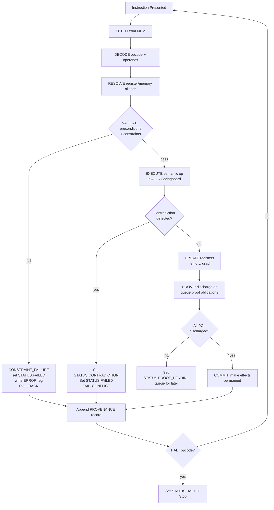
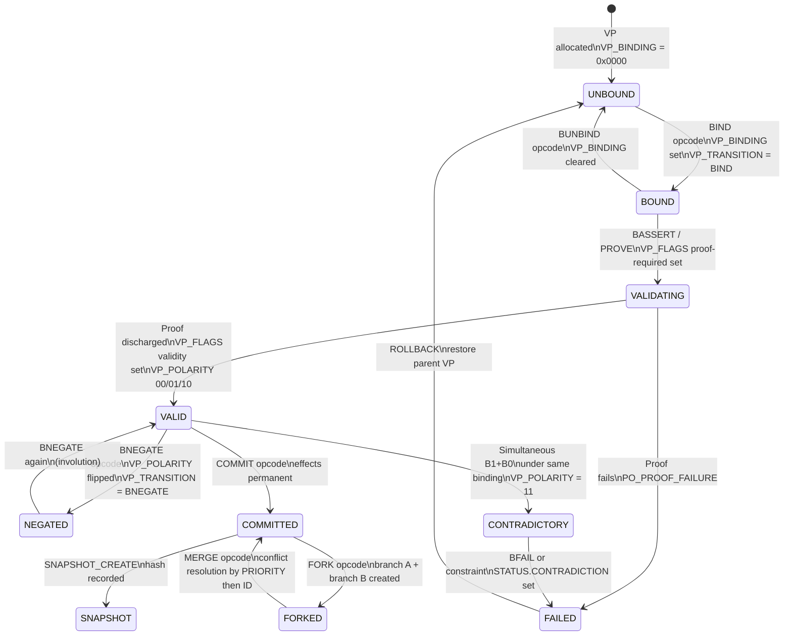
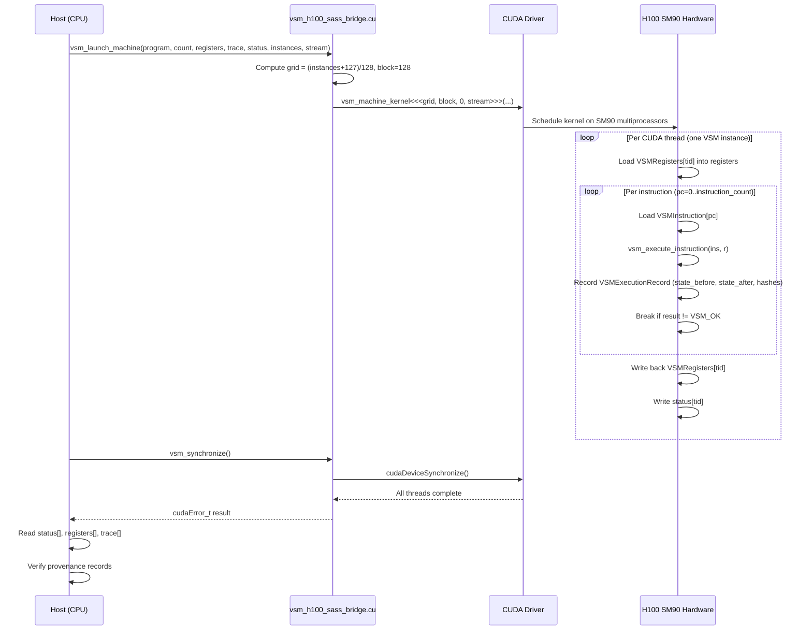

# FILE REFERENCE: vsm2500/

VSM-2500 (Virtual Semantic Machine 2500) is a deterministic binary-semantic virtual intelligence
architecture. It replaces floating-point tensors and probabilistic next-token selection with
structured 128-bit Virtual Parameter objects, binary semantic algebra, and a Viral Springboard
propagation mechanism. All state transitions carry proof obligations and are recorded in an
immutable provenance ledger. The GPU implementation targets NVIDIA Hopper (SM90 / H100).

---

## FILE: vsm2500/vsm2500_specification.txt

**PURPOSE:** Normative specification for the entire VSM-2500 architecture. Defines every object,
opcode, register, memory layout, proof obligation, failure mode, and serialization format. This is
the ground truth for all implementation files.

**LANGUAGE:** Plain text (structured specification prose)

**KEY STRUCTURES/OPCODES:**

*Virtual Parameter (VP) — 128-bit structured word:*

| Bits     | Field         | Meaning                                      |
|----------|---------------|----------------------------------------------|
| [15:0]   | VP_ID         | Unique 16-bit identifier within model instance |
| [31:16]  | VP_DOMAIN     | Semantic domain tag (0x0000..0xFFFF)         |
| [47:32]  | VP_STATE      | Current binary semantic value                |
| [63:48]  | VP_POLARITY   | 00 neutral, 01 positive, 10 negative, 11 contradictory |
| [79:64]  | VP_BINDING    | Bound object reference or 0x0000 unbound     |
| [95:80]  | VP_SCOPE      | Visibility mask (local/global/branch)        |
| [111:96] | VP_TRANSITION | Last applied operator code                   |
| [127:112]| VP_FLAGS      | Validity, mutability, proof-required bits    |

Extended 128-bit VPs: VP_MEMORY, VP_CONSTRAINT, VP_INVARIANT, VP_OPERATOR (32+96),
VP_ROUTING (64+64), VP_PROOF, VP_HISTORY (64+64), VP_RESOLUTION, VP_COMPOSITION,
VP_STABILITY (32+96), VP_ENTROPY (64+64), VP_PRIORITY (16+112), VP_VALIDITY (8+120).

*Binary Semantic Algebra operators:*
BAND, BOR, BXOR, BNOT, BEQ, BNE, BGT, BLT, BIND, BUNBIND, BASSERT, BNEGATE, BPROVE, BFAIL, BHALT

*Virtual Instruction Set opcodes (16-bit, format [15:10] OPCODE | [9:5] DEST | [4:0] SRC/IMM):*

| Opcode   | Hex   | Function                                    |
|----------|-------|---------------------------------------------|
| LOAD     | 0x01  | Load memory cell into register              |
| STORE    | 0x02  | Store register into memory cell             |
| AND      | 0x10  | BAND operator                               |
| OR       | 0x11  | BOR operator                                |
| XOR      | 0x12  | BXOR operator                               |
| NOT      | 0x13  | BNOT (semantic negation)                    |
| BIND     | 0x20  | Concatenate two semantic words              |
| UNBIND   | 0x21  | Split structured object into components     |
| ASSERT   | 0x22  | Force validity bit                          |
| REJECT   | 0x23  | Force reject state                          |
| PROVE    | 0x30  | Attach proof obligation handle              |
| VERIFY   | 0x31  | Execute proof obligation                    |
| ROUTE    | 0x40  | Semantic routing                            |
| MERGE    | 0x41  | Merge states                                |
| FORK     | 0x43  | Create branch                               |
| SEED     | 0x50  | Create springboard seed                     |
| SPRING   | 0x51  | SPRINGBOARD_CREATE                          |
| PROPAGATE| 0x52  | SPRINGBOARD_PROPAGATE                       |
| COMMIT   | 0x53  | Commit state permanently                    |
| ROLLBACK | 0x54  | Restore prior state                         |
| HALT     | 0xFF  | Terminate execution                         |

*Viral Springboard (256-bit):*

| Bits      | Field              |
|-----------|--------------------|
| [63:0]    | SOURCE_STATE_HASH  |
| [127:64]  | SEED               |
| [159:128] | CONSTRAINT_SET_ID  |
| [191:160] | TRANSITION_RULE    |
| [223:192] | TARGET_STATE_HASH  |
| [255:224] | VALIDATION_RESULT  |

Springboard opcodes: SPRINGBOARD_CREATE, VALIDATE, PROPAGATE, COMPOSE, REJECT, COLLAPSE,
COMMIT, ROLLBACK, FORK, MERGE.

Propagation equation: `S[t+1] = F(S[t], P[t], C[t], O[t])` — apply operator, intersect
constraints, update VPs by inheritance+delta, attach provenance, validate.

*VM structure:* 32 x 128-bit semantic registers (R0-R15 + SEM, CTX, BIND, PROOF, STATE, MEM,
ROUTE, SEED, VALID, ERROR, HISTORY), semantic memory arena, VP table, constraint list, 256-entry
semantic stack, propagation queue, semantic graph, immutable provenance ledger, pending proofs,
32-bit STATUS word.

*STATUS bits:* 0 RUNNING, 1 HALTED, 2 FAILED, 3 CONTRADICTION, 4 PROOF_PENDING, 5 BRANCHED,
6 SNAPSHOTTED, 7 VERIFIED.

*Failure codes:* INVALID_STATE, INVALID_PARAMETER, INVALID_OPCODE, INVALID_BINDING,
CONSTRAINT_FAILURE, PROOF_FAILURE, MEMORY_FAILURE, ROUTING_FAILURE, PROPAGATION_FAILURE,
CONFLICT, ROLLBACK, HALT, CONSTITUTIONAL_FAILURE, RESOURCE_EXHAUSTED.

*Proof obligations (PO1-PO12):* state validity, parameter validity, instruction validity, memory
safety, constraint consistency, transition validity, provenance integrity, deterministic execution,
springboard well-formedness, graph acyclicity, constitutional compliance, resource bounds.

*Serialization format:* magic 0xVSM25 | version | flags | parameter section | register section |
memory section | graph section | constraint section | proof section | provenance section |
CRC64 checksum | terminator 0xENDVSM.

**EXECUTION MODEL:**

Eight-stage pipeline per instruction: FETCH → DECODE → RESOLVE → VALIDATE → EXECUTE → UPDATE →
PROVE → COMMIT. Every instruction specifies input state, output state, precondition, postcondition,
failure condition, side effects, determinism guarantee, and proof obligation. No probabilistic
selection exists anywhere in the core; candidate selection uses bitwise population count scoring
with hash-based tie-breaking.

**DEPENDENCIES:** Self-contained normative text. All implementation files are subordinate to this.

**RELATED FILES:** vsm2500_core.sv (hardware model), vsm2500_h100_sass_bridge.cu (GPU bridge),
all other vsm2500_*.cu files (CUDA implementations).

---

## FILE: vsm2500/vsm2500_core.sv

**PURPOSE:** Synthesizable SystemVerilog implementation of the VSM-2500 binary semantic core.
Provides a register-level hardware model suitable for FPGA/ASIC synthesis or RTL simulation.
Includes a simulation-only testbench fragment under `` `ifdef SIMULATION ``.

**LANGUAGE:** SystemVerilog (synthesizable subset + simulation testbench)

**KEY STRUCTURES/OPCODES:**

*Package `vsm_pkg` exports:*
- `vp_t` — packed struct mapping all 8 VP fields (vp_id, vp_domain, vp_state, vp_polarity,
  vp_binding, vp_scope, vp_transition, vp_flags) into a 128-bit word.
- `springboard_t` — packed struct: source_hash[63:0], seed[63:0], constraint_id[31:0],
  transition_rule[31:0], target_hash[63:0], validation_result[31:0].
- `mem_cell_t` — 256-bit packed struct: addr, value, typ, cls, provenance, validity,
  constraints, timestamp, parent, children.
- `opcode_e` — enum covering OP_NOP through OP_HALT with same hex values as specification.
- `status_t` — packed struct of 8 single-bit flags (running, halted, failed, contradiction,
  proof_pending, branched, snapshotted, verified).
- `fail_e` — enum of 10 failure codes matching specification.

*Module `vsm_binary_alu`:*
- Combinational ALU for 128-bit semantic words.
- Handles AND, OR, XOR, NOT, BIND (concatenate lower 64 bits of a||b), COMPARE.
- Contradiction detection: simultaneous B11 polarity on both operands sets `contrad` output.

*Module `vsm_register_file`:*
- 32-entry × 128-bit synchronous register file with async reset.
- Single write port (waddr/wdata), dual read ports (raddr_a/raddr_b).
- Reset: all registers cleared to B0.

*Module `vsm_springboard_ctrl`:*
- Stateful controller for the Viral Springboard lifecycle.
- `create_i` → initializes sb_r from source_hash, seed, constraint_id, rule inputs.
- `validate_i` → checks seed != 0; sets validation_result=1 (valid) or 0xDEAD (reject).
- `propagate_i` → when validated, computes target_hash = source_hash XOR seed.
- `commit_i` / `rollback_i` → clears active flag / resets entire springboard.

*Module `vsm_core` (top-level):*
- Instantiates vsm_register_file, vsm_binary_alu, vsm_springboard_ctrl.
- Main always_ff block dispatches opcodes: ALU ops write RF if no contradiction; OP_SPRING
  triggers sb_create+sb_validate; OP_PROPAGATE triggers sb_propagate; OP_COMMIT sets verified;
  OP_ROLLBACK triggers sb_rollback; OP_HALT sets running=0, halted=1; OP_REJECT forces failed.
- Springboard rejection path: sb_reject signal sets FAIL_PROPAGATION.

**EXECUTION MODEL:**

Single-clock-cycle dispatch. Instructions presented on `instr_valid`. ALU operations are
combinational (result available same cycle as register read). Springboard control is registered
(takes multiple cycles for create+validate+propagate sequence). All state registers reset
synchronously on `!rst_n`.

**DEPENDENCIES:** Self-contained SystemVerilog. Uses `vsm_pkg` package defined in same file.

**RELATED FILES:** vsm2500_specification.txt (normative source), vsm2500_h100_sass_bridge.cu
(CUDA parallel equivalent).

---

## FILE: vsm2500/vsm2500_h100_sass_bridge.cu

**PURPOSE:** Primary CUDA/C++ bridge between the VSM-2500 semantic architecture and NVIDIA H100
(SM90) hardware. Defines all data structures, device primitives, and GPU kernels. Provides
`extern "C"` launch wrappers callable from the host. Also acts as the formal SASS generation
target: building with `nvcc -arch=sm_90 -cubin` produces the SM90 SASS that actually runs on H100.

**LANGUAGE:** CUDA C++ (device kernels + host launch wrappers)

**KEY STRUCTURES/OPCODES:**

*C++ structs (all `alignas(16)`):*

| Struct                  | Key Fields                                                        |
|-------------------------|-------------------------------------------------------------------|
| `VSMVirtualParameter`   | id, semantic_id, binary_signature, dimension, element_type, memory_offset, version, provenance, validity, constraint_state, value, flags |
| `VSMEmbedding`          | embed_id, semantic_id, binary_signature, dimension, element_type, memory_offset, version, provenance, validity, constraint_state |
| `VSMInstruction`        | opcode(u8), rd(u8), rs1(u8), rs2(u8), immediate(u32), operand(u64) |
| `VSMConstraint`         | id, predicate, scope, dependencies, priority (all u64), result(u32), flags(u32) |
| `VSMProof`              | statement, input_hash, output_hash, rule (u64 each), result(u32), flags(u32) |
| `VSMProvenance`         | state_id, parent_id, instruction_id, input_hash, output_hash, branch_id (u64), validation(u32), status(u32) |
| `VSMSpringboard`        | source, seed, constraints, transition, target, validation, provenance (u64), state(u32), flags(u32) |
| `VSMState`              | state_id, parent_id, semantic, seed, route, history, proof, flags (u64), validity(u32), status(u32), pc(u64) |
| `VSMRegisters`          | r[32] (u64), sem, ctx, bind, proof, state, mem, route, seed, valid, error, history (u64 each) |
| `VSMFeature`            | feature_id, source_id (u64), layer_id, position (u32), value(f32), validity(u32), provenance(u64), constraint_state(u32) |
| `VSMExecutionRecord`    | sequence, state_before, state_after, instruction, parameter, input_hash, output_hash (u64), constraint_result, proof_result, status, lane (u32) |

*Enum `VSM_OPCODE`:* VSM_NOP(0x00) through VSM_HALT(0xFF) — 32 opcodes covering all ISA
operations (NOP, LOAD, STORE, MOVE, AND, OR, XOR, NOT, EQ, NEQ, MASK, SHL, SHR, ROL, ROR,
BIND, UNBIND, ASSERT, REJECT, PROVE, VERIFY, ROUTE, FORK, JOIN, SEED, SPRING, PROPAGATE,
COMMIT, ROLLBACK, COMPOSE, SPLIT, MERGE, HALT).

*Enum `VSM_STATUS`:* VSM_OK(0) through VSM_HALTED(10).

*Device primitives (`__device__ __forceinline__`):*
- `vsm_mix(u64)` — Murmur-inspired hash mixer (two multiply+xor rounds).
- `vsm_semantic_hash(u64)` — alias for vsm_mix.
- `vsm_bind(a,b)` / `vsm_unbind(a,b)` — both implemented as XOR (involution property).
- `vsm_compose(a,b)` — `vsm_mix(a ^ vsm_rol64(b, 17))`.
- `vsm_merge(a,b)` — `vsm_mix((a&b) ^ vsm_rol64(a|b, 13))`.
- `vsm_split(x)` — `x ^ vsm_ror64(x, 29)`.
- `vsm_constraint_eval(constraints, count, state)` — linear scan; fails if any constraint
  predicate masked by scope does not match state.
- `vsm_proof_eval(proof, input, output)` — hashes input/output and compares to proof record.
- `vsm_warp_xor(x)` — warp-level XOR reduction via `__shfl_xor_sync`.
- `vsm_execute_instruction(ins, r)` — full ISA interpreter in device code.

*GPU kernels:*
- `vsm_binary_semantics_kernel` — computes `vsm_mix(a^b^(a&b)^(a|b))` per element.
- `vsm_embedding_lookup_kernel` — maps semantic_id → float embedding row (row = id % table_rows).
- `vsm_embedding_binary_kernel` — transforms semantic ids through rol/ror/mix chain.
- `vsm_embedding_transform_kernel` — scales float embeddings by 1/√2.
- `vsm_relu_kernel` — ReLU activation.
- `vsm_maxpool2d_kernel` — configurable window/stride max-pooling.
- `vsm_conv2d_kernel` — 2D convolution with optional bias, fused with ReLU.
- `vsm_fc_kernel` — fully-connected layer (dense matrix-vector multiply).
- `vsm_semantic_feature_kernel` — promotes float values to VSMFeature structs with provenance.
- `vsm_springboard_kernel` — validates springboard (zero-check) and computes target via vsm_compose.
- `vsm_springboard_propagate_kernel` — applies springboard to input states via XOR chain + vsm_mix.
- `vsm_machine_kernel` — runs full VSM program per parallel instance; records VSMExecutionRecord trace.
- `vsm_warp_semantic_reduce_kernel` — warp XOR reduction.
- `vsm_binary_feature_kernel` — converts float signs to bit-packed u64 via `__ballot_sync`.

*Host launch wrappers (`extern "C"`):*
- `vsm_launch_machine` — block=128, grid=(instances+127)/128.
- `vsm_launch_embedding` — block=256.
- `vsm_launch_binary` — block=256.
- `vsm_launch_conv` — block=256, computes output element count.
- `vsm_launch_pool` — block=256.
- `vsm_launch_fc` — block=256.
- `vsm_launch_springboard` — block=256.
- `vsm_launch_propagation` — block=256.
- `vsm_launch_features` — block=256.
- `vsm_launch_binary_features` — block=256.
- `vsm_launch_relu` — block=256.
- `vsm_launch_warp_reduce` — block=256.
- `vsm_runtime_architecture()` — returns `major*10 + minor` compute capability.
- `vsm_runtime_is_sm90()` — returns 1 if architecture == 0x90.
- `vsm_synchronize()` — wraps `cudaDeviceSynchronize`.

**EXECUTION MODEL:**

Each CUDA thread executes one VSM instance independently. The `vsm_machine_kernel` gives every
thread a copy of `VSMRegisters` in registers; it runs the instruction sequence serially within
the thread, writes back the final register file, and optionally emits a per-instruction
`VSMExecutionRecord`. Massively parallel execution of independent VSM instances maps directly to
CUDA's SIMT model. The Viral Springboard uses `vsm_compose` (mix + rol) rather than the
XOR-only form in the SV model, providing better avalanche properties. SASS is generated by the
NVIDIA toolchain from the compiled cubin; the source file explicitly states it does not assert
SASS content.

**DEPENDENCIES:** `<cuda.h>`, `<cuda_runtime.h>`, `<stdint.h>`, `<stddef.h>`. Requires CUDA
toolkit and SM90-capable device for execution. Build: `nvcc -O3 -std=c++17 -arch=sm_90 ...`

**RELATED FILES:** vsm2500_specification.txt (normative), vsm2500_core.sv (RTL model),
vsm2500_cuda_execution_block.cu (alternative kernel set), vsm2500_isa_kernel.cu (ISA kernel
with main()), vsm2500_semantic_cuda.cu (semantic pipeline with launch wrappers).

---

## FILE: vsm2500/vsm2500_cuda_execution_block.cu

**PURPOSE:** Alternative CUDA execution block with slightly different register file layout (16
general registers instead of 32) and a `snapshot` kernel for register-file state capture. Serves
as the canonical SM90 cubin target alongside the bridge file. Contains full opcode table, all
neural network primitives, and the VSM program kernel. The recursion chain comment at the bottom
documents the complete object hierarchy from SEMANTIC_OBJECT to SM90 SASS.

**LANGUAGE:** CUDA C++ (SM90 execution scaffold, `extern "C"` block)

**KEY STRUCTURES/OPCODES:**

Same opcode enum as the bridge (VSM_NOP through VSM_HALT). Notable differences from bridge:
- `VSMRegisterFile` has `r[16]` (16 general-purpose registers, indexed with `& 15u` mask).
- `VSMConstraint.validity` field checked explicitly (validity != 1 → failure).
- Additional `vsm_embedding_xor` kernel (XOR of two embedding arrays).
- `vsm_snapshot` kernel — copies one VSMRegisterFile array to another.
- `vsm_warp_xor` kernel uses loop `offset = 16; offset >>= 1` with `__shfl_xor_sync`.
- `vsm_merge(a,b)` simplified to `a ^ b` (vs. mix-based formula in bridge).
- `vsm_split(value, index)` extracts single bit at position index.

**EXECUTION MODEL:** Identical to bridge: one thread per VSM instance, serial instruction
execution within thread, parallel across block/grid. Adds explicit `vsm_snapshot` for
checkpointing register state across a GPU-to-GPU copy.

**DEPENDENCIES:** `<cuda_runtime.h>`, `<stdint.h>`. Build commands documented in file header.

**RELATED FILES:** vsm2500_h100_sass_bridge.cu (primary bridge), vsm2500_specification.txt.

---

## FILE: vsm2500/vsm2500_isa_kernel.cu

**PURPOSE:** Self-contained ISA kernel with `main()` entry point for device query and stream
smoke test. Adds `vsm_constraint_kernel` and `vsm_provenance` kernels not present in other files.
Demonstrates complete build + SASS extraction workflow in embedded comments.

**LANGUAGE:** CUDA C++ (includes `main()`)

**KEY STRUCTURES/OPCODES:**

Defines `VSMParameter` (compact version of VirtualParameter without value/flags fields).
Notable extra kernels vs. other files:
- `vsm_embedding_lookup_u64` — u64 table lookup (not float), computes row = semantic_id % vocabulary.
- `vsm_embedding_xor` — masks input array with a mask array.
- `vsm_embedding_rotate` — applies `vsm_rotl64` with configurable rotation amount.
- `vsm_embedding_mix` — applies `vsm_mix` per element.
- `vsm_binary_feature_map` — creates VSMFeature structs from u64 semantic values (value field
  is cast from upper 32 bits).
- `vsm_constraint_kernel` — per-state constraint checking across a constraint array.
- `vsm_provenance` — computes provenance hash as `vsm_mix(state ^ (tid << 32))`.
- `vsm_semantic_reduce` — warp XOR reduction using `__shfl_xor_sync`.
- `vsm_isa_kernel` — main program execution kernel (runs VSM program per instance).

`main()` queries `cudaGetDeviceProperties` and prints device name, compute capability, global
memory, multiprocessor count, and warp size. Creates and destroys a CUDA stream as smoke test.

**EXECUTION MODEL:** Same SIMT model. `vsm_isa_kernel` uses block=128. Additional kernels expose
individual pipeline stages (constraint check, provenance computation, reduction) as standalone
launch targets for pipeline orchestration.

**DEPENDENCIES:** `<cuda_runtime.h>`, `<stdint.h>`, `<stdio.h>`, `<stdlib.h>`.

**RELATED FILES:** vsm2500_h100_sass_bridge.cu, vsm2500_cuda_execution_block.cu.

---

## FILE: vsm2500/vsm2500_semantic_cuda.cu

**PURPOSE:** Most complete standalone semantic pipeline. Defines `VSMModelHeader`, `VSMBinary`,
and `VSMValidity` enum not present elsewhere. Contains `vsm_quantize_binary` kernel (float-to-bit
quantization via `__ballot_sync`), `vsm_binary_reduce` kernel, `vsm_conv2d_naive` (non-fused
variant), `vsm_conv2d_relu` (fused variant), and `vsm_springboard_validate`/`vsm_springboard_propagate`
as separate `__device__` functions. Also exports `vsm_status_string()` for debugging.

**LANGUAGE:** CUDA C++ (includes `main()`)

**KEY STRUCTURES/OPCODES:**

`VSMModelHeader`: magic(0x56534D32), version(2500), architecture, flags, plus counts of
parameters, embeddings, instructions, constraints, proofs, provenance records.

`VSMValidity` enum: VSM_UNKNOWN=0, VSM_VALID=1, VSM_INVALID=2, VSM_CONFLICTED=3.

Device functions:
- `vsm_validate_parameter(p)` — checks dimension>0, element_type<=VSM_F32, validity!=INVALID.
- `vsm_validate_state(s)` — checks validity==VALID and status==OK.
- `vsm_binary_semantics(opcode, a, b)` — dispatch table for binary operators.
- `vsm_constraint_check(constraints, count, state)` — device function (not kernel).
- `vsm_springboard_validate(s)` / `vsm_springboard_propagate(s, state)` — separated for clarity.

Launch wrappers: `vsm_launch_embedding`, `vsm_launch_conv` (calls vsm_conv2d_relu), `vsm_launch_pool`,
`vsm_launch_fc`, `vsm_launch_springboard`, `vsm_launch_program`, `vsm_check_kernel`,
`vsm_status_string`.

**EXECUTION MODEL:** Same as other CUDA files. The `vsm_execute_program` kernel uses
`gridDim.x * blockDim.x` for bounds check rather than a passed `instances` count. The separate
springboard device functions allow springboard logic to be inlined into other kernels.

**DEPENDENCIES:** `<cuda_runtime.h>`, `<stdint.h>`, `<stdio.h>`, `<stdlib.h>`, `<string.h>`.

**RELATED FILES:** All other vsm2500_*.cu files.

---

## FILE: vsm2500/p2_fabric.cpp

**PURPOSE:** Reference implementation of the P2 Hardware Parallel Fabric — a 32-lane parallel
execution model targeting NVIDIA H100 SM90 as its physical substrate. Provides the mirror/invariant/
clone/crystallization framework that ensures execution determinism. This is a virtual architecture
model; it does not represent NVIDIA internal H100 microcode.

**LANGUAGE:** C++ (namespace `p2`, standard library only, no CUDA)

**KEY STRUCTURES/OPCODES:**

- `MirrorState` — per-lane: registers[REGISTER_COUNT=256], pc, predicate, flags, active, halted,
  local_state.
- `Lane` — holds two MirrorState copies: `architectural` (committed) and `speculative`.
- `Barrier` — arrivals, expected, released (warp-style synchronization).
- `Fabric` — 32 lanes, 1024 shared words, 32 barriers, issue queue, active_mask, commit_mask,
  cycle counter, halted_mask.
- `Crystal` / `ParallelCrystal` — records (before_hash, after_hash, cycle, instruction,
  invariant_valid, clone_valid) from a crystallization step.
- `ArchitecturalMirror` — primary + shadow Fabric pair for mirrored execution.
- `Opcode` enum: NOP, MOV, LOAD, STORE, ADD, SUB, MUL, AND, OR, XOR, NOT, SHL, SHR, ROTL, ROTR,
  CMP, SELECT, BROADCAST, SHUFFLE, PERMUTE, REDUCE_ADD/AND/OR/XOR, BARRIER, FENCE, BRANCH,
  JUMP, COMMIT, ROLLBACK, HALT.
- `Unit` enum: ALU, LOGIC, SHIFT, COMPARE, MEMORY, BRANCH, REDUCE, COMMIT.

Key functions:
- `decode(word)` — decodes 64-bit instruction word: [63:56] opcode, [55:48] dst, [47:40] src0,
  [39:32] src1, [31:24] pred, [23:0] imm.
- `encode(...)` — inverse of decode.
- `execute_lane` / `execute_parallel` — dispatch instruction across all active lanes.
- `crystallize(fabric)` — validates invariants then commits speculative → architectural state.
- `mirror_crystallize` — snapshot + crystallize + re-mirror.
- `validated_step` / `fail_closed_execute` — execute with invariant check and rollback on failure.
- `mirror_loop` / `mirrored_execute` — execute on primary and shadow, verify equivalence.
- `state_hash(fabric)` — Boost-style hash mix over all architectural state.
- `clone_equivalent(a, b)` — checks state_hash equality then field-by-field comparison.

Invariants (INV001-INV008): lane domain (32 lanes, 256 registers), word domain (64-bit),
active mask bounds, register array size, speculative mirror agreement, barrier domain bounds,
composite architecture check, no speculative leak.

**EXECUTION MODEL:** Deterministic SIMT simulation. All 32 lanes execute the same instruction
simultaneously. Speculation is captured in the `speculative` copy; `crystallize` commits it
atomically only after invariant validation and clone equivalence proof. Rollback restores
speculative state from architectural state. The mirror pattern runs two independent copies and
asserts bit-for-bit equivalence as a hardware reliability check.

**DEPENDENCIES:** `<array>`, `<cstdint>`, `<cstring>`, `<limits>`, `<stdexcept>`, `<utility>`.
SL-AGPL3-001 license.

**RELATED FILES:** p2_hardware_parallel_fabric.cpp (extended version), p3_binary_microcode_p2_fabric.cpp
(P3 microcode layer), p4_microcode_vsm2500.cpp (P4 microcode), vsm2500_h100_sass_bridge.cu.

---

## FILE: vsm2500/p2_hardware_parallel_fabric.cpp

**PURPOSE:** Extended version of p2_fabric.cpp under namespace `p2` with slight naming differences
(AND_ / OR_ / XOR_ / NOT_ suffixed enum values to avoid keyword conflicts), using C++ type aliases
(`using u8 = std::uint8_t` etc.). Adds `MAX_PROGRAM = 4096` constant and explicit `MASK32`/`MASK8`
constants. Otherwise implements the same mirror/invariant/clone/crystallization model.

**LANGUAGE:** C++ (namespace `p2`, SL-AGPL3-001 license)

**KEY STRUCTURES/OPCODES:** Same as p2_fabric.cpp. The opcode enum values match; AND/OR/XOR/NOT
are suffixed with `_` to avoid C++ reserved words.

**EXECUTION MODEL:** Identical to p2_fabric.cpp. Formal reference implementation with explicit
statement that it is virtual architecture only and does not represent NVIDIA internal microcode.

**DEPENDENCIES:** `<array>`, `<cstdint>`, `<cstdlib>`, `<cstring>`, `<limits>`, `<stdexcept>`,
`<type_traits>`. SL-AGPL3-001 license.

**RELATED FILES:** p2_fabric.cpp, p3_binary_microcode_p2_fabric.cpp.

---

## FILE: vsm2500/p3_binary_microcode_p2_fabric.cpp

**PURPOSE:** Defines the P3 binary microcode encoding layer that sits above the P2 fabric and
below the SM90 SASS level. P3 represents VSM binary microcode (not NVIDIA internal microcode).
Combined reference for P3→P4 micro-op→SM90 SASS recursion chain.

**LANGUAGE:** C++ (C99-style types, `p3_u8/u16/u32/u64`, SL-AGPL3-001 license)

**KEY STRUCTURES/OPCODES:**

P3 instruction classes (4-bit class field):

| Class      | Value | Operations                                              |
|------------|-------|---------------------------------------------------------|
| P3_ALU     | 0x0   | ADD, SUB, AND, OR, XOR, NOT, SHL, SHR, ROL, ROR, MASK, MERGE, SPLIT |
| P3_MEMORY  | 0x1   | Load/store operations                                   |
| P3_COMPARE | 0x2   | Comparison operators                                    |
| P3_BIND    | 0x3   | BIND/UNBIND/COMPOSE operations                          |
| P3_STATE   | 0x4   | SEED, SPRING, PROPAGATE, FORK, JOIN, ROLLBACK, SNAPSHOT |
| P3_BRANCH  | 0x5   | Conditional branch                                      |
| P3_PROOF   | 0x6   | PROVE, VERIFY operations                                |
| P3_COMMIT  | 0x7   | COMMIT/CONSTRAINT operations                            |
| P3_HALT    | 0xF   | Halt                                                    |

P3 magic: 0x50330001. Word bits: 64. The file establishes P3 as the intermediate representation
between the VSM-2500 virtual ISA and the SM90 SASS encoding produced by the NVIDIA toolchain.

**EXECUTION MODEL:** The P3→P4 recursion chain: P3 binary microcode → P4 micro-ops → SM90
SASS control signals → datapath operations → register reads/writes → memory commits.

**DEPENDENCIES:** `<stdint.h>`, `<stddef.h>`. SL-AGPL3-001 license.

**RELATED FILES:** p4_microcode_vsm2500.cpp (P4 layer), p2_fabric.cpp (P2 layer below P3).

---

## FILE: vsm2500/p4_microcode_vsm2500.cpp

**PURPOSE:** Defines the P4 virtual microcode execution model — the lowest virtual architectural
layer before SM90 SASS. Implements the full 19-level recursion chain from VSM semantic state
(L0) down to architectural state (L19). Documents build commands for cubin and SASS extraction.
Implements a C99 reference interpreter for the P4 opcode set.

**LANGUAGE:** C++ / C99 (SL-AGPL3-001 license)

**KEY STRUCTURES/OPCODES:**

P4 opcodes: P4_NOP(0x00), P4_READ_REG(0x01), P4_WRITE_REG(0x02), P4_AND(0x03), P4_OR(0x04),
P4_XOR(0x05), P4_NOT(0x06), P4_SHIFT(0x07), P4_ROTATE(0x08), P4_COMPARE(0x09), P4_MASK(0x0A).

19-level recursion chain:
L0 VSM semantic state → L1 binary word → L2 virtual parameter → L3 embedding element →
L4 feature element → L5 GPU thread state → L6 warp state → L7 SM90 instruction →
L8 SASS encoding → L9 instruction decode → L10 micro-op → L11 control signal vector →
L12 datapath operation → L13 register read → L14 ALU/logical operation → L15 register write →
L16 memory request → L17 cache/fabric transaction → L18 retire/commit → L19 architectural state.

The file explicitly states H100 internal microcode is not fabricated; SM90 SASS is obtained only
from the NVIDIA toolchain.

**EXECUTION MODEL:** P4 is a C99 reference interpreter operating on `p4_word` (u64) registers.
It provides a formal specification of the micro-op semantics that the NVIDIA compiler targets
when compiling the CUDA kernels above.

**DEPENDENCIES:** `<stdint.h>`, `<stddef.h>`. SL-AGPL3-001 license.

**RELATED FILES:** p3_binary_microcode_p2_fabric.cpp, vsm2500_h100_sass_bridge.cu.

---

## FILE: vsm2500/hopper_gemm_kernel_spec.txt

**PURPOSE:** Specification for a custom GEMM (General Matrix-Matrix Multiply) kernel targeting
NVIDIA Hopper (SM90/H100/H200). Defines tiling hierarchy, TMA descriptor construction, shared
memory layout, software pipelining, and epilogue handling for `C = alpha*A*B + beta*C`. Used by
the VSM-2500 system for high-throughput matrix operations on the H100.

**LANGUAGE:** Plain text (specification)

**KEY STRUCTURES/OPCODES:**

Hardware assumptions: SM 9.0, 4th-gen Tensor Cores + Hopper WGMMA, TMA required, 228 KB dynamic
shared memory per CTA, 255 registers per thread, warpgroup = 128 threads.

Tiling hierarchy: CTA tile (recommended 128×256×64 for FP16, 128×128×64 for FP8, 64×256×32 for
TF32) → Warpgroup tile (64×128×64) → Warp tile (WGMMA shapes 16×16×16 etc.) → Thread tile
(8×8 or 16×8 accumulator fragments).

Memory hierarchy: HBM3 (3.35 TB/s) → TMA (Tensor Memory Accelerator with box descriptors) →
Shared memory (double/triple buffered, 128-byte aligned, swizzled) → Register file → Tensor Cores.

TMA descriptors: `make_tma_copy_descriptor` with box_size, Swizzle128B mode, multicast cluster
mask (for Distributed Shared Memory).

**EXECUTION MODEL:** Asynchronous pipeline with `cp.async` / wgmma instruction overlap.
Thread Block Clusters enable cross-CTA shared memory via Distributed Shared Memory.

**DEPENDENCIES:** Requires NVIDIA Hopper hardware and CUDA toolkit with SM90 support.

**RELATED FILES:** vsm2500_h100_sass_bridge.cu (uses GEMM results in neural network layers).

---

## VSM-2500 Execution Flowchart

---

## Virtual Parameter Lifecycle State Machine

---

## H100 SASS Bridge Sequence Diagram

---

## Comparison: VSM-2500 vs Traditional Neural Inference

| Aspect                    | Traditional LLM Inference          | VSM-2500                                     |
|---------------------------|-------------------------------------|----------------------------------------------|
| Primary primitive         | Float32/BF16 tensor                 | 128-bit Virtual Parameter (binary)           |
| Selection mechanism       | Softmax probability distribution    | Deterministic binary compatibility + hash    |
| State representation      | Activation vectors                  | Binary semantic words + VP table             |
| Transition model          | Matrix multiply + non-linearity     | Viral Springboard (XOR chain + mix)          |
| Failure handling          | Silent numerical degradation        | Explicit failure states + ERROR register     |
| Provenance                | None                                | Immutable ledger, every transition recorded  |
| Proof obligations         | None                                | Mandatory PO1-PO12 before COMMIT             |
| Contradiction             | Not represented                     | Explicit CONTRADICTION state (VP_POLARITY=11)|
| Rollback                  | None (stateless per token)          | Full architectural rollback to any checkpoint|
| Determinism               | Stochastic (sampling)               | Deterministic by construction                |
| Constitutional layer       | None                                | Versioned rule set; violation = halt         |
| GPU mapping               | cuBLAS GEMM + attention kernels     | vsm_machine_kernel; SIMT per VSM instance    |
| Serialization             | Safetensors / GGUF                  | VSM binary format with CRC64                 |
| External verifiability    | Model weights only                  | Full snapshot + provenance chain verifiable  |
