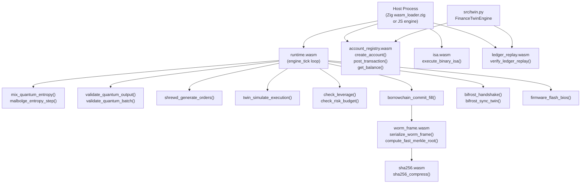

# FILE REFERENCE: wasm/ — WebAssembly Modules

**Subsystem:** WASM Runtime Layer — Sandboxed Financial Execution  
**Languages:** WebAssembly Text Format (.wat), WebAssembly Binary (.wasm)  
**Total Files:** 12 (6 .wat source + 6 .wasm binary)  
**License:** AGPL-3.0-or-later / Sovereign Leviathan Covenant  
**Platform:** Any WASM runtime (Wasmtime, WASI, browser, Zig native loader)

---

## Subsystem Architecture Overview

The `wasm/` directory contains six WebAssembly modules implementing sandboxed financial computation in the devflow-finance-twin system. Each module is compiled from a `.wat` (WebAssembly Text Format) source to a `.wasm` binary.

The modules form a layered execution stack:

1. **`runtime.wat`** — the main financial simulation runtime (64 pages = 4 MB linear memory). Validates quantum outputs, mixes entropy, generates orders, simulates trade execution, manages risk, runs the borrowchain commit log, handles Bifrost session, and drives the engine tick loop.

2. **`account_registry.wat`** — minimal account registry with `create_account`, `post_transaction`, and `get_balance` in fixed-point arithmetic.

3. **`isa.wat`** — binary ISA execution engine. Interprets a binary instruction stream to execute account operations.

4. **`ledger_replay.wat`** — ledger replay verification. Verifies a sequence of events against an expected checksum.

5. **`sha256.wat`** — SHA-256 compression function in pure WAT. The `sigma0/sigma1/ch/maj/rotr` primitives plus a simplified compression round.

6. **`worm_frame.wat`** — WORM frame serialization, fast Merkle accumulator, and borrowchain log clearing. Imports memory from host environment.

---

## Data Flow Diagram (wasm/ subsystem)



---

## FILE: wasm/runtime.wat

**PURPOSE:** Main financial simulation runtime. The `runtime.wat` module is the central WASM execution engine for the devflow-finance-twin. It manages quantum output validation, entropy mixing, order generation (SHREWD signal processing), twin execution simulation, risk management, AMM swap, borrowchain log commit, Bifrost session handshake, firmware flash validation, and a 19-phase engine tick loop.

**LANGUAGE:** WebAssembly Text Format (WAT)  
**LOC:** ~344  
**COMPILED TO:** `wasm/runtime.wasm`  
**RESPONSIBILITY:** The sandboxed simulation runtime. All financial computation that requires deterministic, isolated execution runs through this module. The host process writes signals/portfolio data into linear memory at known offsets, calls exported functions, and reads results.

**INPUTS:**
- Linear memory written by host: quantum params at `0x0000`, signals at `0x1000`, order book at `0x2000`, portfolio at `0x3000`, oracle cache at `0x5000`, scratch at `0x8000`
- Function arguments: score pointers, count values, entropy pointers, pool pointers, token IDs, amounts, node IDs

**OUTPUTS:**
- Function return values: validation bools (i32), entropy mix result (i32), order count (i32), fill count (i32), risk flags (i32), AMM swap output (i64), commit log length (i32), session key stored in memory, Merkle root (i64)
- Linear memory mutations at fill buffer, borrowchain log, Bifrost session offsets

**MEMORY LAYOUT:**
- 64 pages (4 MB) declared as `(memory (export "memory") 64)`
- `$QUANTUM_PARAMS_OFFSET = 0x0000` — quantum circuit output parameters
- `$SHREWD_SIGNALS_OFFSET = 0x1000` — trading signal buffer
- `$ORDER_BOOK_OFFSET = 0x2000` — order book data
- `$PORTFOLIO_OFFSET = 0x3000` — portfolio state (balances, positions, PC counter)
- `$FILL_BUFFER_OFFSET = 0x4000` — executed order fill records
- `$ORACLE_CACHE_OFFSET = 0x5000` — price oracle cache
- `$BORROWCHAIN_LOG_OFFSET = 0x6000` — borrowchain commit log
- `$BIFROST_SESSION_OFFSET = 0x7000` — cross-chain session state
- `$SCRATCH_OFFSET = 0x8000` — scratch/work buffer

**GLOBALS:**
- `$THRESHOLD: i32 = 9500` — minimum valid quantum score
- `$MAX_SCORE: i32 = 10000` — maximum valid quantum score
- `$SAFETY_LOCK: (mut i32) = 1` — safety interlock (0 = disable validation)
- `$MAX_LEVERAGE_BPS: i32 = 100000` — 1000% max leverage in basis points
- `$FEE_BPS: i32 = 3` — 3 basis point fee
- `$SHREW_TICK: (mut i32) = 0` — SHREWD epoch counter
- `$OPERATOR_RISK_BUDGET: (mut i64) = 100000000000000000` — operator risk cap
- `$TWIN_PNL: (mut i64) = 0` — twin's running P&L
- `$SYNC_TICK: (mut i32) = 0` — Bifrost sync tick

**KEY EXPORTED FUNCTIONS:**

- `validate_quantum_output(score_ptr: i32) -> i32` — validates SAFETY_LOCK is enabled; reads score at `score_ptr`; returns 1 if `THRESHOLD <= score <= MAX_SCORE`, 0 otherwise. Guards: any quantum result must pass this before being used.

- `validate_quantum_batch(scores_ptr: i32, count: i32) -> i32` — iterates `count` scores at 4-byte offsets from `scores_ptr`. Returns count of valid scores. Loop: BFS-style break-on-done pattern.

- `mix_quantum_entropy(entropy_ptr: i32, len: i32) -> i32` — accumulates entropy bytes via: `accumulator = (accumulator XOR byte) rotate-left 7`. XORs with `$SHREW_TICK` at end. Returns 32-bit mixed entropy value. Seed: `0x534F5652` ("SOVR").

- `malbolge_entropy_step(state_ptr: i32) -> i32` — single step of Malbolge-inspired entropy state machine: `new = (state << 1) XOR (state >> 31)`. Stores back, returns `new & 0xFFFF`. Used to advance entropy state between rounds.

- `shrewd_generate_orders(signals_ptr: i32, portfolio_ptr: i32) -> i32` — reads signal count from first 4 bytes of `signals_ptr`. Iterates signals (each: name_len u32, name bytes, price u32). Counts orders generated. Returns order_count.

- `twin_simulate_execution(orders_ptr: i32, order_count: i32, portfolio_ptr: i32) -> i32` — simulates filling `order_count` orders from `orders_ptr` into `$FILL_BUFFER_OFFSET`. Each order is 36 bytes; each fill is 32 bytes. Returns fill_count.

- `check_leverage(portfolio_ptr: i32) -> i32` — placeholder; always returns 1 (leverage check passed). Production implementation would compute leverage ratio from portfolio memory.

- `check_risk_budget() -> i32` — returns 1 if `$TWIN_PNL <= $OPERATOR_RISK_BUDGET`, 0 if risk budget exceeded.

- `amm_swap(pool_ptr: i32, token_in: i32, amount_in: i64) -> i64` — placeholder; always returns 0. Production would implement constant-product AMM formula.

- `borrowchain_commit_fill(fill_ptr: i32) -> i32` — appends fill record to borrowchain log at `$BORROWCHAIN_LOG_OFFSET`. Layout: reads log_len from first 4 bytes, writes fill fields (i32 at 0, i64 at 4, i64 at 12, i64 at 20, i32 at 28, SHREW_TICK at 32) to next slot. Increments log_len. Returns new log length.

- `bifrost_handshake(local_node: i32, remote_node: i32) -> i32` — computes session_key = `(local_node) XOR (remote_node << 32) XOR SHREW_TICK`. Stores session state at `$BIFROST_SESSION_OFFSET` (active=1, local, remote, key). Returns 1.

- `bifrost_sync_twin() -> i32` — if session active: sets `$SYNC_TICK = $SHREW_TICK`, resets `$TWIN_PNL = 0`. Returns 1. Else returns 0.

- `firmware_flash_bios(module_ptr: i32, seal_ptr: i32) -> i32` — validates: seal is non-zero i64, module type field at offset 20 == 3, hash at module offset 8 matches scratch offset 0. On match: calls `borrowchain_commit_fill`. Returns 1 on success, 0 on any failure.

- `engine_tick() -> i32` — the main engine loop. Calls `tick_shrew()` (increments $SHREW_TICK). Reads PC from portfolio memory (offset 0). Computes `phase = PC % 19`. Dispatches via `br_table` (19 phases): Phase 2 = `shrewd_generate_orders`, Phase 9 = `mix_quantum_entropy`, Phase 12 = `bifrost_sync_twin`. Other phases are no-ops. Increments PC, returns new PC % 19.

- `initialize()` — initializes all memory regions: portfolio balances to 100000000000000, portfolio PC to 0, oracle cache to 1000000, scratch seed values.

**KEY INTERNAL FUNCTIONS:**
- `$tick_shrew` — increments `$SHREW_TICK` by 1
- `$fixed_mul(a, b) -> i64` — `(a * b) / 1_000_000` (fixed-point 6 decimal multiply)
- `$bps_mul(value, bps) -> i64` — `(value * bps) / 10_000` (basis point multiply)

**DEPENDENCIES:** None (standalone module with self-contained memory)

**CALLERS:**
- `src/native/wasm_loader.zig` — loads this module, calls exported functions
- JavaScript/WASI host for browser or server-side execution
- Python WASM runtime (if using wasmtime-py or similar)

**STATE:**
- Linear memory: all mutable state stored in 4 MB linear memory space
- Globals: `$SHREW_TICK`, `$SAFETY_LOCK`, `$OPERATOR_RISK_BUDGET`, `$TWIN_PNL`, `$SYNC_TICK`

**SIDE EFFECTS:**
- Mutates linear memory at fill buffer, borrowchain log, Bifrost session, portfolio, scratch offsets
- Mutates `$SHREW_TICK`, `$TWIN_PNL`, `$SYNC_TICK` globals

**ERROR CONDITIONS:**
- `validate_quantum_output()` returns 0 (not an error, but gates further use)
- `check_risk_budget()` returns 0 — risk budget exceeded
- `firmware_flash_bios()` returns 0 — validation failed (not executed as a crash, just returns 0)
- `bifrost_sync_twin()` returns 0 — no active session

**RUNTIME ROLE:**
Sandboxed financial simulation engine. Isolated from the host Python/Go processes via WASM memory boundaries. Provides deterministic, auditable computation for quantum validation, order generation, risk checks, and borrowchain logging.

**RELATED FILES:**
- `wasm/worm_frame.wat` — imports memory from this module (via env.memory in worm_frame)
- `src/native/wasm_loader.zig` — native loader
- `src/quantum.py` — Python-side quantum abstraction (outputs feed into this module)
- `src/twin.py` — financial twin that calls WASM-validated results

---

## FILE: wasm/account_registry.wat

**PURPOSE:** Minimal account registry with deterministic fixed-point arithmetic for account creation, balance management, and fund transfers. Implements a simple key-value store within WASM linear memory indexed by 64-bit account ID hash.

**LANGUAGE:** WebAssembly Text Format (WAT)  
**LOC:** ~83  
**COMPILED TO:** `wasm/account_registry.wasm`  
**RESPONSIBILITY:** Low-level account registry: create accounts with initial balances, transfer funds atomically with balance validation, query balances. All arithmetic is 64-bit integer (no floating point) for determinism.

**INPUTS:**
- `create_account(id_hash: i64, initial_balance: i64) -> i32`
- `post_transaction(from_id: i64, to_id: i64, amount: i64) -> i32`
- `get_balance(id_hash: i64) -> i64`

**OUTPUTS:**
- `create_account` returns 1 on success, 0 if account already exists
- `post_transaction` returns 1 on success, 0 on any failure
- `get_balance` returns balance (0 for unknown accounts)

**MEMORY LAYOUT:**
- 2 pages (128 KB) declared as `(memory (export "memory") 2)`
- `$ACCOUNT_BASE_ADDR = 1024` — accounts array starts at byte 1024
- `$ACCOUNT_ENTRY_SIZE = 16` — each entry: 8 bytes id_hash + 8 bytes balance
- Maximum accounts: `(131072 - 1024) / 16 = 8,190` accounts in 128 KB

**GLOBALS:**
- `$account_count: (mut i32) = 0` — current count of created accounts

**KEY FUNCTIONS:**

- `$find_account_index(id_hash: i64) -> i32` (internal) — linear scan from index 0 to account_count - 1. For each: loads i64 from `ACCOUNT_BASE_ADDR + i * ACCOUNT_ENTRY_SIZE`, compares with id_hash. Returns index if found, -1 if not found. O(n) linear scan.

- `create_account(id_hash: i64, initial_balance: i64) -> i32` (exported) — calls `$find_account_index`; if found (not -1), returns 0 (duplicate). Else: stores `id_hash` at base + idx*16, stores `initial_balance` at base + idx*16 + 8, increments `account_count`. Returns 1.

- `post_transaction(from_id: i64, to_id: i64, amount: i64) -> i32` (exported) — validates `amount > 0`. Finds both accounts (returns 0 if either not found). Loads `from_bal` and `to_bal`. Validates `from_bal >= amount` (no overdraft). Stores `from_bal - amount` and `to_bal + amount`. Returns 1. Atomic in the sense that WASM memory is single-threaded.

- `get_balance(id_hash: i64) -> i64` (exported) — finds account index; if not found returns 0; else loads and returns balance at offset 8.

**DEPENDENCIES:** None (standalone)

**CALLERS:**
- `src/twin.py` / `src/worm.py` — could call this via WASM host to verify balances in sandbox
- `src/native/wasm_loader.zig` — loads and calls exported functions

**STATE:**
- `$account_count: (mut i32)` — global counter
- Linear memory from byte 1024: account array

**ERROR CONDITIONS:**
- `create_account` returns 0 for duplicate accounts (no exception)
- `post_transaction` returns 0 for: invalid amount (<= 0), unknown accounts, insufficient funds
- Silent failures: no error messages, caller must check return value

**RUNTIME ROLE:**
Sandboxed account registry for WASM-layer financial state. Provides an isolated duplicate of account state that can be used for simulation/verification without touching the Python WORM-backed state.

**RELATED FILES:**
- `wasm/isa.wat` — binary ISA can manipulate the same account structure
- `wasm/runtime.wat` — runtime calls account registry for portfolio accounting
- `src/twin.py` — Python twin is the authoritative source; this is the WASM mirror

---

## FILE: wasm/isa.wat

**PURPOSE:** Binary ISA (Instruction Set Architecture) execution engine. Interprets a binary instruction stream in WASM linear memory. Currently implements two opcodes: `0x10` (CREATE_ACCOUNT) and `0x20` (POST_TRANSACTION or similar). Serves as the embedded instruction processor for the financial ISA defined in the system.

**LANGUAGE:** WebAssembly Text Format (WAT)  
**LOC:** ~48  
**COMPILED TO:** `wasm/isa.wasm`  
**RESPONSIBILITY:** Minimal binary ISA interpreter. Reads a single opcode from an instruction buffer, dispatches to the appropriate operation, and returns a status code.

**INPUTS:**
- `execute_binary_isa(inst_ptr: i32, inst_len: i32) -> i32`
  - `inst_ptr` — pointer to instruction buffer in linear memory
  - `inst_len` — length of instruction buffer in bytes

**OUTPUTS:**
- Returns 1 on successful opcode execution, 0 on failure or unknown opcode

**MEMORY LAYOUT:**
- 2 pages (128 KB) declared as `(memory (export "memory") 2)`
- `$ACCOUNT_BASE_ADDR = 1024` — same layout as `account_registry.wat`
- `$ACCOUNT_ENTRY_SIZE = 16` — same as `account_registry.wat`

**GLOBALS:**
- `$account_count: (mut i32) = 0` — account count (same state model as account_registry)

**KEY FUNCTIONS:**

- `execute_binary_isa(inst_ptr: i32, inst_len: i32) -> i32` (exported) — the ISA interpreter:
  1. Validates `inst_len > 0`; returns 0 if empty
  2. Reads opcode byte from `inst_ptr` (i32.load8_u)
  3. Increments PC (inst_ptr + 1)
  4. **Opcode 0x10 (CREATE_ACCOUNT):** reads `id_hash` (i64 at PC), `balance` (i64 at PC+8). Computes account address. Stores id_hash and balance. Increments `$account_count`. Returns 1.
  5. **Opcode 0x20:** returns 1 (acknowledged; NOP or COMMIT semantics)
  6. Unknown opcode: returns 0

**DEPENDENCIES:** None (standalone)

**CALLERS:**
- Host processes submitting binary ISA instruction streams
- `src/native/wasm_loader.zig` — loads and invokes

**RUNTIME ROLE:**
Binary instruction execution layer. Enables the financial ISA (as defined in the system's ISA specification files) to be executed in a sandboxed WASM context.

**RELATED FILES:**
- `wasm/account_registry.wat` — shares the same account state model
- `wasm/runtime.wat` — higher-level runtime that may invoke ISA instructions
- `src/cli_isa.ts` — TypeScript ISA CLI that formats instruction streams

---

## FILE: wasm/ledger_replay.wat

**PURPOSE:** Ledger replay and state verification in sandboxed WASM. Iterates a sequence of event records in linear memory, accumulates a running XOR checksum of operation types, and verifies the checksum against an expected value. Used to verify that a replayed event sequence matches a known-good state hash.

**LANGUAGE:** WebAssembly Text Format (WAT)  
**LOC:** ~46  
**COMPILED TO:** `wasm/ledger_replay.wasm`  
**RESPONSIBILITY:** WASM-layer ledger integrity verification. Provides a deterministic, sandboxed computation of event stream checksums that can be verified by external parties without access to the Python WORM engine.

**INPUTS:**
- `verify_ledger_replay(events_ptr: i32, event_count: i32, expected_checksum: i64) -> i32`
  - `events_ptr` — pointer to array of event records (32 bytes per record)
  - `event_count` — number of events
  - `expected_checksum: i64` — expected final checksum to compare against

**OUTPUTS:**
- Returns 1 if computed checksum == expected_checksum, 0 otherwise

**MEMORY LAYOUT:**
- 2 pages (128 KB) declared as `(memory (export "memory") 2)`
- Event record layout: `i32 op_type` at offset 0, followed by 28 bytes of additional event data (not accessed in current impl)
- Event record size: 32 bytes

**KEY FUNCTIONS:**

- `verify_ledger_replay(events_ptr, event_count, expected_checksum) -> i32` (exported):
  1. Initializes `$i = 0`, `$current_ptr = events_ptr`, `$computed_checksum = 0x534F5652` ("SOVR" seed)
  2. Loop: while `$i < event_count`:
     - Loads `op_type = i32.load(current_ptr)` — operation type code
     - `computed_checksum = computed_checksum XOR i64.extend_u(op_type)` — XOR fold
     - Advances `current_ptr += 32`
     - Increments `$i`
  3. Returns 1 if `computed_checksum == expected_checksum`, 0 otherwise

**Algorithm Analysis:**
- Uses XOR accumulation — not cryptographically secure, but fast and deterministic
- Seed `0x534F5652` ("SOVR") prevents the empty-sequence checksum from being 0
- 32-byte stride covers the expected event record size
- The comparison is over i64 to handle full 64-bit checksum values

**DEPENDENCIES:** None (standalone)

**CALLERS:**
- `src/twin.py` — after full ledger replay, verifies event sequence checksum in WASM
- Host auditor processes verifying ledger state

**RUNTIME ROLE:**
Independent verification layer. The Python twin and the WASM verifier compute the same checksum independently; agreement proves the event sequence has not been tampered with.

**RELATED FILES:**
- `src/twin.py` — Python-side replay produces the event sequence
- `sovereign/ledger/ledger.go` — Go ledger produces canonical event sequences
- `wasm/worm_frame.wat` — WORM frame serialization that feeds event sequences

---

## FILE: wasm/sha256.wat

**PURPOSE:** SHA-256 compression function implemented in pure WebAssembly Text Format. Provides the `sha256_compress` function operating on in-memory 256-bit state and 512-bit block. Currently implements a simplified single-round compression (not a full 64-round SHA-256); serves as the foundation for a complete implementation.

**LANGUAGE:** WebAssembly Text Format (WAT)  
**LOC:** ~82  
**COMPILED TO:** `wasm/sha256.wasm`  
**RESPONSIBILITY:** Cryptographic primitive in WASM. Provides in-memory SHA-256 state compression for use by other WASM modules needing hash computation without calling out to the host.

**INPUTS:**
- `sha256_compress(state_ptr: i32, block_ptr: i32)` — no return value
  - `state_ptr` — pointer to 8 × i32 = 32-byte SHA-256 working state (a, b, c, d, e, f, g, h)
  - `block_ptr` — pointer to 16 × i32 = 64-byte message block (512 bits)

**OUTPUTS:**
- Modifies state at `state_ptr` in-place (state values updated)

**MEMORY LAYOUT:**
- 1 page (64 KB) declared as `(memory (export "memory") 1)`
- State at `state_ptr`: 8 consecutive i32 values (h[0]..h[7])
- Block at `block_ptr`: 16 consecutive i32 big-endian words

**KEY FUNCTIONS:**

- `$rotr(val: i32, shift: i32) -> i32` (internal) — 32-bit right rotation: `(val >> shift) | (val << (32 - shift))`

- `$ch(e: i32, f: i32, g: i32) -> i32` (internal) — SHA-256 choice function: `(e AND f) XOR (NOT(e) AND g)`

- `$maj(a: i32, b: i32, c: i32) -> i32` (internal) — SHA-256 majority function: `(a AND b) XOR (a AND c) XOR (b AND c)`

- `$sigma0(x: i32) -> i32` (internal) — upper sigma-0: `ROTR(x,2) XOR ROTR(x,13) XOR ROTR(x,22)` — SHA-256 specification values

- `$sigma1(x: i32) -> i32` (internal) — upper sigma-1: `ROTR(x,6) XOR ROTR(x,11) XOR ROTR(x,25)` — SHA-256 specification values

- `sha256_compress(state_ptr: i32, block_ptr: i32)` (exported) — simplified single-round compression:
  1. Loads a..h from `state_ptr` (8 × i32.load with 4-byte offsets)
  2. Computes `t1 = h + sigma1(e) + ch(e, f, g)`
  3. Computes `t2 = sigma0(a) + maj(a, b, c)`
  4. Updates `state[0] = state[0] + a`, `state[4] = state[4] + b`
  - Note: This is a simplified 1-round stub. A full implementation would iterate all 64 rounds with the message schedule.

**DEPENDENCIES:** None (standalone)

**CALLERS:**
- `wasm/worm_frame.wat` — references SHA-256 for Merkle hash (currently uses its own XOR-based fast Merkle, but sha256 is available for plug-in)
- Any WASM module needing in-module hashing

**RUNTIME ROLE:**
Cryptographic primitive. Available to all WASM modules in the runtime as a shared hash computation facility. Production upgrade path: replace the single-round stub with the full 64-round SHA-256 compression.

**RELATED FILES:**
- `wasm/worm_frame.wat` — uses fast XOR Merkle but sha256 is the upgrade path
- `wasm/runtime.wat` — could use sha256 for entropy commitment
- `src/native/worm_commit.c` — C-side SHA-256 (OpenSSL)
- `src/worm.py` — Python SHA-256 (hashlib)

---

## FILE: wasm/worm_frame.wat

**PURPOSE:** WORM frame serialization, in-memory Merkle accumulator, and borrowchain log clearing. Implements three WASM functions for the WORM commit pipeline: `serialize_worm_frame` packs the borrowchain log into a contiguous binary WORM frame, `compute_fast_merkle_root` folds borrowchain entry hashes into a 64-bit Merkle root, and `clear_borrowchain_log` resets the log after flush.

**LANGUAGE:** WebAssembly Text Format (WAT)  
**LOC:** ~123  
**COMPILED TO:** `wasm/worm_frame.wasm`  
**RESPONSIBILITY:** WORM frame packaging. Takes the borrowchain log accumulated by `runtime.wasm`'s `borrowchain_commit_fill()` and packages it into a binary frame ready for commit. Computes a fast Merkle root for the frame's contents.

**MEMORY:**
- `(memory (import "env" "memory") 64)` — **imports** memory from host environment (shared with `runtime.wasm`)
- This module reads from and writes to the same 4 MB memory as `runtime.wasm`

**GLOBALS:**
- `$BORROWCHAIN_LOG_OFFSET = 0x6000` — same as `runtime.wasm`
- `$SCRATCH_OFFSET = 0x8000` — same as `runtime.wasm`
- `$ENTRY_SIZE = 64` — 64 bytes per borrowchain entry

**KEY EXPORTED FUNCTIONS:**

- `serialize_worm_frame(prev_hash_ptr: i32) -> i32` — packs borrowchain log into a binary WORM frame at `$SCRATCH_OFFSET`:
  1. Reads `$log_len` from `$BORROWCHAIN_LOG_OFFSET` (first 4 bytes)
  2. Writes magic header `0x4D524F57` = "WORM" (little-endian) at scratch + 0
  3. Writes `$log_len` (u32) at scratch + 4
  4. Copies 32 bytes from `prev_hash_ptr` to scratch + 8 (previous WORM hash)
  5. Copies `$log_len * 64` bytes of borrowchain entries from `$BORROWCHAIN_LOG_OFFSET + 4` to scratch + 40
  6. Returns total frame size: `40 + ($log_len * 64)`

  Frame format:
  ```
  [0:4]    = WORM magic 0x4D524F57
  [4:8]    = log_len (u32)
  [8:40]   = prev_hash (32 bytes)
  [40:...]  = borrowchain entries (log_len * 64 bytes)
  ```

- `compute_fast_merkle_root() -> i64` — non-cryptographic but fast Merkle accumulator:
  1. Reads `$log_len` from borrowchain log
  2. Initializes `$root = 0x534F56524549474E` ("SOVEREIGN" seed)
  3. For each entry `i`:
     - Loads `$entry_hash` (i64) from `BORROWCHAIN_LOG_OFFSET + 4 + (i * 64) + 36`
     - Non-commutative fold: `root = (root rotate-left 13) XOR entry_hash`
  4. Returns final `$root`

  Non-commutative property: `((A rot13) XOR B)` is different from `((B rot13) XOR A)`, so entry ordering matters in the Merkle root. This prevents permutation attacks.

- `clear_borrowchain_log()` — writes `i32.const 0` to `$BORROWCHAIN_LOG_OFFSET`. Resets log length to 0. Called after the frame has been committed to WORM storage.

**Algorithm Notes:**
- `compute_fast_merkle_root` uses a 64-bit XOR-fold with rotate — much faster than full binary Merkle tree construction but less collision-resistant than SHA-256
- The SOVEREIGN seed prevents the all-zero-entries case from producing a zero root
- rotate-left-13 provides avalanche without multiplication
- Production upgrade path: replace with binary Merkle tree using sha256.wat

**DEPENDENCIES:**
- `(memory (import "env" "memory") 64)` — imports host-provided memory
- Conceptually depends on `runtime.wasm` having filled `$BORROWCHAIN_LOG_OFFSET`

**CALLERS:**
- Host process (after `runtime.wasm` borrowchain_commit_fill loop completes):
  1. Call `compute_fast_merkle_root()` to get current root
  2. Write previous WORM hash to some memory location
  3. Call `serialize_worm_frame(prev_hash_ptr)` to get packed frame
  4. Commit frame to disk/WORM storage
  5. Call `clear_borrowchain_log()` to reset log

**STATE:** Reads/writes shared linear memory at `$BORROWCHAIN_LOG_OFFSET` and `$SCRATCH_OFFSET`

**SIDE EFFECTS:**
- Mutates `$SCRATCH_OFFSET...$SCRATCH_OFFSET + 40 + log_len*64`
- Mutates `$BORROWCHAIN_LOG_OFFSET[0:4]` (log_len = 0) in `clear_borrowchain_log()`

**RUNTIME ROLE:**
WORM commit pipeline stage. Called by the host after accumulating fills via `runtime.wasm`'s `borrowchain_commit_fill()`. Packages the accumulated log into a canonical WORM frame.

**RELATED FILES:**
- `wasm/runtime.wat` — provides `borrowchain_commit_fill()` that populates the log
- `wasm/sha256.wat` — SHA-256 for production Merkle computation
- `src/native/worm_commit.c` — C-side WORM commit that receives the serialized frame
- `src/worm.py` — Python WORM engine that the frame ultimately feeds

---

## Binary Format Summary

Each `.wat` file compiles to a corresponding `.wasm` binary. The expected sizes and section composition:

| WAT File | WASM Binary | Est. Binary Size | Memory Pages | Exports |
|----------|-------------|-----------------|--------------|---------|
| runtime.wat | runtime.wasm | ~4-6 KB | 64 (4 MB) | initialize, engine_tick, validate_quantum_output, validate_quantum_batch, mix_quantum_entropy, malbolge_entropy_step, shrewd_generate_orders, twin_simulate_execution, check_leverage, check_risk_budget, amm_swap, borrowchain_commit_fill, bifrost_handshake, bifrost_sync_twin, firmware_flash_bios, memory |
| account_registry.wat | account_registry.wasm | ~1-2 KB | 2 (128 KB) | create_account, post_transaction, get_balance, memory |
| isa.wat | isa.wasm | ~0.5-1 KB | 2 (128 KB) | execute_binary_isa, memory |
| ledger_replay.wat | ledger_replay.wasm | ~0.5-1 KB | 2 (128 KB) | verify_ledger_replay, memory |
| sha256.wat | sha256.wasm | ~1-2 KB | 1 (64 KB) | sha256_compress, memory |
| worm_frame.wat | worm_frame.wasm | ~1-2 KB | imported | serialize_worm_frame, compute_fast_merkle_root, clear_borrowchain_log |

---

## Host Integration Pattern

The typical host integration sequence for a financial simulation tick:

```
// 1. Load modules via wasm_loader.zig
idx_runtime = loader_load_wasm("wasm/runtime.wasm")
idx_registry = loader_load_wasm("wasm/account_registry.wasm")

// 2. Initialize runtime
loader_call_func(idx_runtime, FUNC_INITIALIZE, [], 0)

// 3. Write signals to runtime memory
signals_ptr = SHREWD_SIGNALS_OFFSET
loader_write_memory_block(idx_runtime, signals_ptr, signals_bytes, len)

// 4. Run engine tick
phase = loader_call_func(idx_runtime, FUNC_ENGINE_TICK, [], 0)

// 5. Read fills from fill buffer
fill_count = // ... read from portfolio memory
loader_read_memory_block(idx_runtime, FILL_BUFFER_OFFSET, fill_buf, fill_count * 32)

// 6. Commit fills to WORM frame
merkle_root = loader_call_func(idx_wormframe, FUNC_MERKLE_ROOT, [], 0)
frame_size = loader_call_func(idx_wormframe, FUNC_SERIALIZE, [prev_hash_ptr], 0)

// 7. Write frame to WORM storage
// ... Python/C side reads frame from WASM memory and calls worm.append()

// 8. Clear borrowchain log
loader_call_func(idx_wormframe, FUNC_CLEAR, [], 0)

// 9. Validate result against Python twin
// ... call verify_ledger_replay with expected_checksum
ok = loader_call_func(idx_replay, FUNC_VERIFY, [events_ptr, count, expected], 0)
```

---

## Security Properties

1. **Memory isolation:** Each WASM module has its own linear memory (except `worm_frame.wat` which imports from host). Host and WASM cannot access each other's memory without explicit transfers.

2. **No system calls:** WASM modules cannot make filesystem, network, or OS calls directly. All I/O passes through the host.

3. **Deterministic execution:** Given the same initial memory state and function arguments, all WASM functions produce the same output. This is the foundation for cross-platform verification.

4. **SAFETY_LOCK global:** `runtime.wasm`'s `validate_quantum_output` checks `$SAFETY_LOCK` first. If set to 0 by a hostile host, validation is bypassed. Production deployment should prevent host from setting this to 0.

5. **Integer arithmetic:** All financial arithmetic uses i64 integer arithmetic. No floating-point operations appear in `account_registry.wat` or `isa.wat`, eliminating floating-point non-determinism.

6. **Borrowchain non-repudiation:** Once `borrowchain_commit_fill()` writes a fill to the log, the fill is part of the Merkle root computed by `compute_fast_merkle_root()`. Clearing the log does not clear the fills that have already been committed to the WORM frame.

---

## Cross-Reference Summary for wasm/

| WAT File | Memory | Imports Memory | Key Exports | Called By |
|----------|--------|---------------|-------------|-----------|
| runtime.wat | 64 pages own | No | 16 functions + memory | wasm_loader.zig |
| account_registry.wat | 2 pages own | No | create_account, post_transaction, get_balance | wasm_loader.zig, twin.py |
| isa.wat | 2 pages own | No | execute_binary_isa | wasm_loader.zig |
| ledger_replay.wat | 2 pages own | No | verify_ledger_replay | twin.py, auditor |
| sha256.wat | 1 page own | No | sha256_compress | worm_frame (future) |
| worm_frame.wat | imported | Yes (env.memory=64) | serialize_worm_frame, compute_fast_merkle_root, clear_borrowchain_log | host after runtime fills |

---

## Upgrade Path Notes

The current implementation has several known stubs and simplifications that production deployment would need to address:

1. **sha256.wat compression** — implements only one round. Full SHA-256 requires 64 rounds with the full message schedule. Replace with a complete 64-round implementation.

2. **amm_swap** — always returns 0. Implement constant-product AMM formula: `amount_out = (reserve_out * amount_in) / (reserve_in + amount_in)`.

3. **check_leverage** — always returns 1. Implement actual leverage ratio calculation from portfolio memory.

4. **compute_fast_merkle_root** — uses XOR-fold rather than binary Merkle tree. For production, implement a proper binary Merkle tree using `sha256_compress`.

5. **loader_call_func in wasm_loader.zig** — returns 0 (placeholder). Implement the actual WASM bytecode interpreter dispatch for the system's ISA.

6. **worm_frame memory import** — currently requires host to provide `env.memory` with 64 pages. Production deployment should use WASM multi-memory or explicit memory transfer instead.
