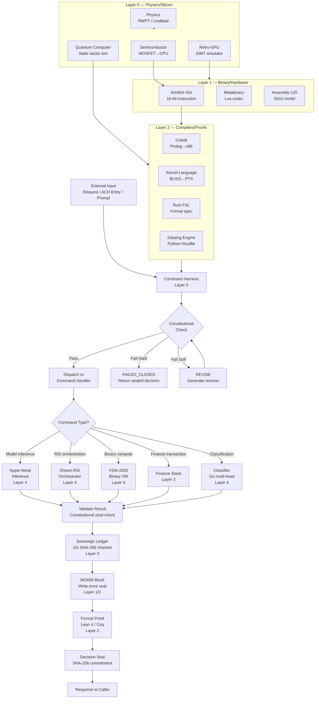
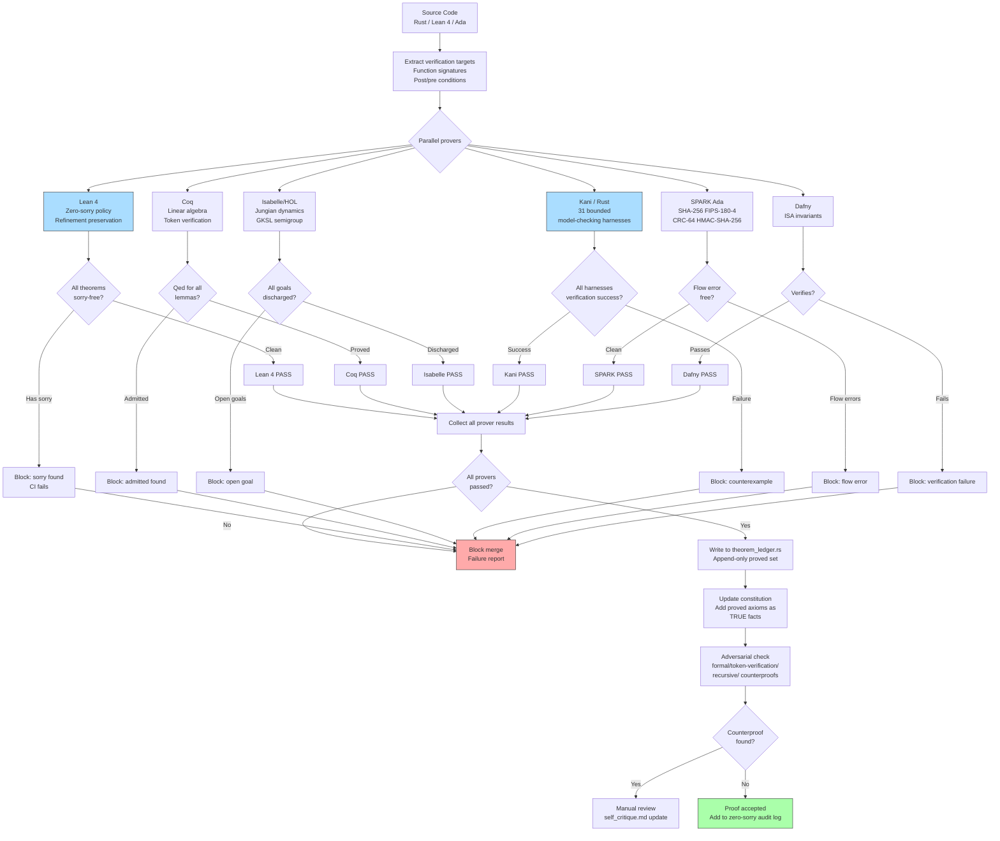
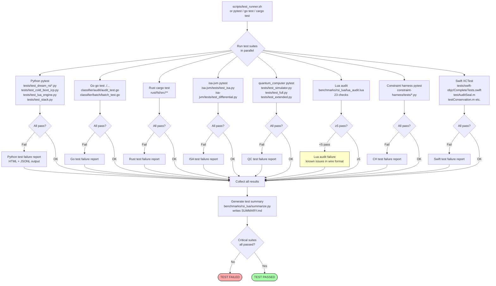
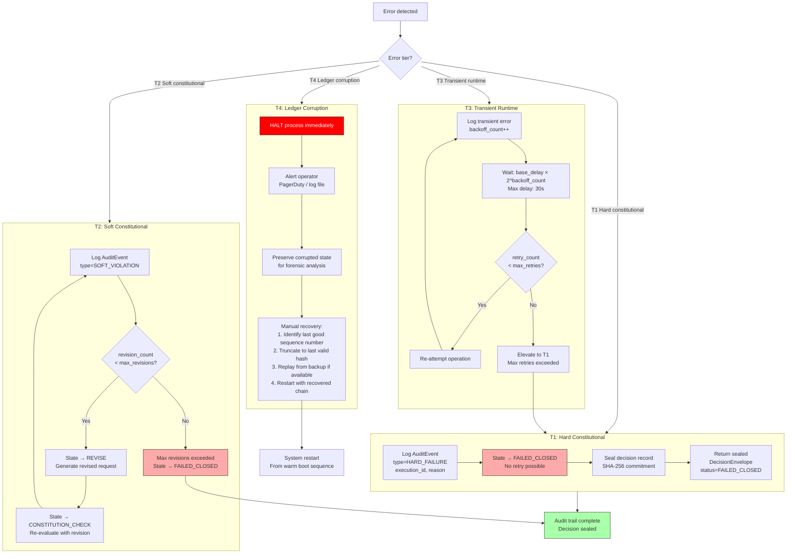

# Flowcharts

> 20+ Mermaid flowcharts covering all major system workflows.
> Repository: devflow-finance-twin
> Generated: 2026-09-19

---

## Table of Contents

1. [Full System Overview](#1-full-system-overview)
2. [Recursive RSI Loop](#2-recursive-rsi-loop)
3. [Finance Transaction Flow](#3-finance-transaction-flow)
4. [Formal Verification Pipeline](#4-formal-verification-pipeline)
5. [Metal Inference Pipeline](#5-metal-inference-pipeline)
6. [VSM-2500 Execution](#6-vsm-2500-execution)
7. [Bootstrap Chain (Boot Sequence)](#7-bootstrap-chain-boot-sequence)
8. [Constraint Evaluation (Constitution Check)](#8-constraint-evaluation-constitution-check)
9. [WASM Module Lifecycle](#9-wasm-module-lifecycle)
10. [Ledger Commit](#10-ledger-commit)
11. [KV Cache Management](#11-kv-cache-management)
12. [Policy Selection](#12-policy-selection)
13. [Discovery Tree Traversal](#13-discovery-tree-traversal)
14. [Replay Traversal](#14-replay-traversal)
15. [Build Process](#15-build-process)
16. [Test Execution](#16-test-execution)
17. [Error Recovery](#17-error-recovery)
18. [ACH Return Processing](#18-ach-return-processing)
19. [Classifier Dispatch](#19-classifier-dispatch)
20. [Datalog Evaluation](#20-datalog-evaluation)
21. [Metabinary Encode/Decode](#21-metabinary-encodedecode)
22. [Quantum Circuit Execution](#22-quantum-circuit-execution)
23. [NAND# Fetch-Decode-Execute](#23-nand-fetch-decode-execute)
24. [Cobalt Compiler Pipeline](#24-cobalt-compiler-pipeline)

---

## 1. Full System Overview



---

## 2. Recursive RSI Loop

```mermaid
flowchart TD
    START([Start: RSIOrchestrator.run\nprompt, rounds=R, revisions=M]) --> INIT[Initialize\nSimulatorPool = empty\nWorldStore = empty\npolicy_0 = default]

    INIT --> ROUND_START[Round t = 0]

    ROUND_START --> ONLINE[Online Exploration\nFixedDiscoveryAgent.propose+execute\nBuilds DiscoveryTree T_t]

    ONLINE --> TREE_DONE{Tree T_t built?}
    TREE_DONE -->|Discovery error| SKIP_ROUND[Log error\nSkip round\nt++]
    TREE_DONE -->|Success| WORLD_ADD[WorldStore.add(T_t)\nH_t = H_{t-1} ∪ {T_t}]

    WORLD_ADD --> KEEP_INCUMBENT[candidate_0 = policy_t\ncandidate_set = [policy_t]]

    KEEP_INCUMBENT --> GEN_REVISIONS[PolicyDeveloper.generate_revisions\nπ_1...π_M from policy_t]

    GEN_REVISIONS --> REVISIONS_DONE{Error?}
    REVISIONS_DONE -->|Error| USE_INCUMBENT[candidate_set = [policy_t] only]
    REVISIONS_DONE -->|OK| ADD_CANDIDATES[candidate_set += [π_1...π_M]]

    USE_INCUMBENT --> REPLAY_PHASE
    ADD_CANDIDATES --> REPLAY_PHASE

    REPLAY_PHASE[Replay Phase:\nFor each candidate π_i\n For each world T_j in H_t\n  HistoricalReplay.evaluate(π_i, T_j)] --> SCORES[Compute scores\nmean score per candidate]

    SCORES --> SELECT_WINNER[winner = argmax scores]

    SELECT_WINNER --> INCUMBENT_SAFE{winner.score ≥\ncandidate_0.score?}
    INCUMBENT_SAFE -->|No — regression| KEEP_INC[winner = candidate_0\nIncumbent preserved]
    INCUMBENT_SAFE -->|Yes| DEPLOY_WINNER[policy_{t+1} = winner]
    KEEP_INC --> DEPLOY_WINNER

    DEPLOY_WINNER --> PERSIST{Persist?}
    PERSIST -->|Yes| JSONL[WorldStore.save_to_jsonl\nAppend T_t to .jsonl file]
    PERSIST -->|No| INC_ROUND
    JSONL --> INC_ROUND

    INC_ROUND[t++] --> CHECK_DONE{t < R?}
    CHECK_DONE -->|Yes| ROUND_START
    CHECK_DONE -->|No| RETURN_RESULT[Return RunResult\nfinal_policy, metrics, world_pool]

    SKIP_ROUND --> CHECK_DONE
    RETURN_RESULT --> END([End])

    style INCUMBENT_SAFE fill:#f9f,stroke:#333
    style KEEP_INC fill:#faa,stroke:#333
    style ONLINE fill:#adf,stroke:#333
    style REPLAY_PHASE fill:#adf,stroke:#333
```

---

## 3. Finance Transaction Flow

```mermaid
flowchart TD
    ACH_IN[ACH Entry Arrives\nNAMCO/SEC/Amount/Routing] --> ACHRTRN[COBOL ACHRTRN\nACH Return Processor]

    ACHRTRN --> LOAD_ITEM[LOAD item from ACHITEM\nby company+batch+entry key]

    LOAD_ITEM --> FOUND{Item found?}
    FOUND -->|NOTFOUND| FAIL_NF[FAIL NOTFOUND\nReturn code 08]
    FOUND -->|Found| STATE_CHECK{item.state IN\nPOSTED, SETTLED?}

    STATE_CHECK -->|No| FAIL_BS[FAIL BADSTATE\nReturn code 12]
    STATE_CHECK -->|Yes| ALREADY_RT{state =\nRETURNED?}

    ALREADY_RT -->|Yes| FAIL_ART[FAIL ALREADYRT\nReturn code 16]
    ALREADY_RT -->|No| SET_RETURN[item.state = RETURNED\nitem.reason = reason_code]

    SET_RETURN --> SAVE_ITEM[SAVE item to ACHITEM]

    SAVE_ITEM --> COBILT[COBOL COBILT-ACH-TREASURY\nACH-to-Treasury bridge]

    COBILT --> BUILD_EVT[Build treasury event\ntype=ACH_RETURN\npayload=item JSON]

    BUILD_EVT --> PL1_LEDGER[PL/I treasury ledger\nPost debit/credit entries]

    PL1_LEDGER --> DR_CR{D/C balance\ncheck?}
    DR_CR -->|Imbalanced| PL1_COND[PL/I ON OVERFLOW\nHandler: flag error]
    DR_CR -->|Balanced| GO_LEDGER[Sovereign Ledger\nGo: Append ACH_RETURN event]

    GO_LEDGER --> HASH_CHAIN[Compute hash chain\nHash = SHA256(payload+PrevHash)]

    HASH_CHAIN --> LEDGWYCB[COBOL LEDGWYCB\nWORM bridge write]

    LEDGWYCB --> WORM_BLOCK[Write WORM block\n64-byte header + payload\nsealed=false]

    WORM_BLOCK --> SCALA_ZIO[Scala/ZIO\nConcurrent coordination\nFiber: await settlement]

    SCALA_ZIO --> RAIL_SUB[RAIL_SUBMISSIONS insert\nstatus=SUBMITTED]

    RAIL_SUB --> WAIT_ACK{ACK received\nfrom clearing house?}

    WAIT_ACK -->|Timeout 24h| RAIL_FAIL[RAIL_SUBMISSIONS\nstatus=FAILED\nAlert operations]
    WAIT_ACK -->|ACK| RAIL_SETTLE[RAIL_SUBMISSIONS\nstatus=SETTLED]

    RAIL_SETTLE --> SEAL_WORM[Seal WORM block\nsealed=true\nno further writes]

    SEAL_WORM --> RPGLE_EOD[RPGLE End-of-Day batch\nIBM i job queue\nBalance reconciliation]

    RPGLE_EOD --> EOD_DONE{Balances\nreconcile?}
    EOD_DONE -->|No| EOD_EXCEPTION[Exception report\nManual review queue]
    EOD_DONE -->|Yes| AUDIT_SEAL[Generate audit seal\nSHA-256 over day's events]

    AUDIT_SEAL --> CSHARP[C# managed gateway\nFinalize day close\nExport to downstream]

    FAIL_NF --> END_FAIL([Return failure code])
    FAIL_BS --> END_FAIL
    FAIL_ART --> END_FAIL
    PL1_COND --> END_FAIL
    RAIL_FAIL --> END_FAIL
    EOD_EXCEPTION --> END_FAIL
    CSHARP --> END_OK([Transaction complete])

    style SEAL_WORM fill:#afa,stroke:#333
    style HASH_CHAIN fill:#adf,stroke:#333
    style FAIL_NF fill:#faa,stroke:#333
    style FAIL_BS fill:#faa,stroke:#333
    style FAIL_ART fill:#faa,stroke:#333
```

---

## 4. Formal Verification Pipeline



---

## 5. Metal Inference Pipeline

```mermaid
flowchart TD
    TOKEN_IN[Input token IDs\nseq_len integers] --> EMB_LOOKUP[kernel: embedding_lookup\nLookup row in embedding table\nOutput: [seq_len, d_model] f16]

    EMB_LOOKUP --> LAYERS[For layer l = 0..N_LAYERS-1]

    LAYERS --> RMS1[kernel: rms_norm\nNormalize hidden state\nscale: learnable weight]

    RMS1 --> ROPE[kernel: rope_encode\nApply rotary position encoding\nto Q and K projections]

    ROPE --> QKV[Parallel kernels:\nq_proj: Wq × x → Q [seq, n_heads, head_dim]\nk_proj: Wk × x → K [seq, n_heads, head_dim]\nv_proj: Wv × x → V [seq, n_heads, head_dim]]

    QKV --> KV_CACHE_CHECK{KV cache\nfull?}
    KV_CACHE_CHECK -->|seq >= max_seq_len| KV_EVICT[Evict oldest\nmax_seq_len-1 entries\nFIFO eviction]
    KV_CACHE_CHECK -->|Not full| KV_UPDATE[kernel: kv_cache_update\nAppend K,V at current position]
    KV_EVICT --> KV_UPDATE

    KV_UPDATE --> KV_READ[kernel: kv_cache_read\nRead all K,V up to current pos]

    KV_READ --> ATTN_SCORES[kernel: attention_scores\nQKᵀ / √head_dim\nOutput: [seq, n_heads, kv_len] f16]

    ATTN_SCORES --> SOFTMAX[kernel: softmax\nNormalize along kv_len dim\nNumerically stable: subtract max first]

    SOFTMAX --> ATTN_COMBINE[kernel: attention_combine\nWeighted sum over V\nOutput: [seq, n_heads, head_dim] f16]

    ATTN_COMBINE --> O_PROJ[kernel: o_proj\nReshape + linear\nOutput: [seq, d_model] f16]

    O_PROJ --> RESIDUAL1[Add residual\nresidual = x + attention_output]

    RESIDUAL1 --> RMS2[kernel: rms_norm\nNormalize for FFN]

    RMS2 --> FFN_GATE[kernel: ffn_gate\nSiLU activation branch\nGate: silu(Wg × x)]

    FFN_GATE --> FFN_UP[kernel: ffn_up\nUp-projection\nUp: Wu × x]

    FFN_UP --> SWI_GLU[Element-wise multiply\ngate ⊙ up]

    SWI_GLU --> FFN_DOWN[kernel: ffn_down\nDown-projection\nOutput: [seq, d_model] f16]

    FFN_DOWN --> RESIDUAL2[Add residual\nx = residual1 + ffn_output]

    RESIDUAL2 --> NEXT_LAYER{More layers?}
    NEXT_LAYER -->|l < N_LAYERS-1| LAYERS
    NEXT_LAYER -->|l = N_LAYERS-1| FINAL_NORM[Final rms_norm\nNormalize final hidden state]

    FINAL_NORM --> LOGITS_KERNEL[kernel: logits\nLinear projection\nx → [vocab_size] f32]

    LOGITS_KERNEL --> INT4_PATH{Weights INT4\nquantized?}
    INT4_PATH -->|Yes| DEQUANT[kernel: int4_dequantize\nFor each group of 32:\nw_f16 = int4_val × scale_f16]
    DEQUANT --> LOGITS_KERNEL
    INT4_PATH -->|No/Done| LOGITS_OUT[Logits tensor\n[vocab_size] f32]

    LOGITS_OUT --> NEXT_TOKEN[Sample next token\nor argmax for greedy]

    style KV_EVICT fill:#ffc,stroke:#333
    style SOFTMAX fill:#adf,stroke:#333
    style DEQUANT fill:#adf,stroke:#333
```

---

## 6. VSM-2500 Execution

```mermaid
flowchart TD
    PROG[VSM-2500 Program\n16-bit instruction words] --> INIT_VM[Initialize VM state\nRegister file: 16 × 128-bit VP\nPC = 0\nStack = empty]

    INIT_VM --> FETCH[Fetch instruction\nword = MEM16[PC]\nPC += 2]

    FETCH --> DECODE[Decode\nopcode = bits[15:13]\ndest = bits[12:9]\nsrcA = bits[8:5]\nsrcB = bits[4:0]]

    DECODE --> DISPATCH{Opcode?}

    DISPATCH -->|000 NAND| NAND_OP[VP_dest = VP_NAND(VP_srcA, VP_srcB)\n= ~(VP_srcA AND VP_srcB)\n128-bit bitwise]

    DISPATCH -->|001 LOAD| LOAD_OP[VP_dest = VP_MEM[VP_srcB]\n128-bit aligned load]

    DISPATCH -->|010 STORE| STORE_OP[VP_MEM[VP_srcB] = VP_srcA\n128-bit aligned store]

    DISPATCH -->|011 SELECT| SELECT_OP[VP_dest = VP_SELECT(VP_srcA, VP_srcB)\nif popcount(VP_srcA) >= popcount(VP_srcB)\n  dest = srcA else dest = srcB\nDeterministic, no float]

    DISPATCH -->|100 CALL| CALL_OP[STACK.push(PC)\nPC = VP_srcA[0:63]]

    DISPATCH -->|101 RET| RET_OP[PC = STACK.pop()]

    DISPATCH -->|110 HALT| HALT_OP[Halt VM\nReturn result register set]

    DISPATCH -->|111 NOP| NOP_OP[No operation]

    NAND_OP --> PROVENANCE[Write provenance tag\nTag = SHA256(opcode+srcA+srcB+result)[0:8]]
    LOAD_OP --> PROVENANCE
    STORE_OP --> PROVENANCE
    SELECT_OP --> PROVENANCE
    NOP_OP --> NEXT_FETCH

    PROVENANCE --> NEXT_FETCH[Increment metrics\ninstruction_count++]

    CALL_OP --> NEXT_FETCH
    RET_OP --> NEXT_FETCH
    HALT_OP --> DONE

    NEXT_FETCH --> STEP_LIMIT{instruction_count\n>= step_limit?}
    STEP_LIMIT -->|Yes| VSM_FAULT[VSM_FAULT\nStep limit exceeded]
    STEP_LIMIT -->|No| FETCH

    DONE([Return VP register file\n+ provenance chain])

    VSM_FAULT --> HOST_TRAP[Host trap handler\nLog + return fault code]

    subgraph H100[H100 SASS Bridge]
        SASS_AND[LDAR.128\n128-bit load/operate\nSM90 CUDA]
        SASS_NOT[NOT.128\nBitwise NOT on\n128-bit register]
        SASS_SYNC[CCTL.128\nCooperative groups\nbarrier]
    end

    NAND_OP -.->|H100 path| SASS_NOT
    SASS_NOT -.-> SASS_AND
    SASS_AND -.-> PROVENANCE

    style SELECT_OP fill:#adf,stroke:#333
    style NAND_OP fill:#adf,stroke:#333
    style VSM_FAULT fill:#faa,stroke:#333
```

---

## 7. Bootstrap Chain (Boot Sequence)

```mermaid
flowchart TD
    POWER[Power-On Reset\nor Software Reset] --> ARCH{Architecture?}

    ARCH -->|6502+x86| A65_RESET[RESET_HANDLER at $E000\nSEI — disable interrupts\nLDX #$FF / TXS — init stack]

    ARCH -->|x86-64| X86_FIRM[FIRMWARE_INIT\nCLI — disable interrupts\nCLD — clear decimal mode]

    A65_RESET --> A65_CPU_INIT[CPU_INIT\nZero A, X, Y\nClear C, V, D, B flags]
    A65_CPU_INIT --> A65_MEM_INIT[MEM_INIT\nZero-fill $0000-$01FF\nInit zero-page variables]
    A65_MEM_INIT --> A65_ROM_INIT[ROM_INIT\nCopy ROM image from host\nVerify checksum at $FFFD]
    A65_ROM_INIT --> A65_MONITOR[CLI — enable interrupts\nJMP MONITOR_ENTRY]

    X86_FIRM --> CPU_VECTOR[CPU_VECTOR_TABLE_SETUP\nLIDT — load IDT\nInstall 32 exception handlers\nInstall 16 IRQ handlers]
    CPU_VECTOR --> ISA_INIT[ISA_INITIALIZATION\nInit NAND# register file R0-R15\nSet PC to entry vector\nConfigure privilege rings]
    ISA_INIT --> X86_BRIDGE[X86_BRIDGE_CONFIG\nNAND#↔x86 address translation\nSegment descriptor setup]
    X86_BRIDGE --> INT_REG[INTERRUPT_HANDLER_REGISTER\nRegister all vectors in IDT\nSet APIC base address\nEnable APIC]

    A65_MONITOR --> KL_RUNTIME[Kernel Language Runtime\ncpl_bridge.c init\nst80_runtime.c init\nKernel.Mod Oberon init]
    INT_REG --> KL_RUNTIME

    KL_RUNTIME --> CH_INIT[Constraint Harness Init\nLoad constitution axioms\nLoad MXML schema\nSM: current = RECEIVE\nInit audit log: empty]

    CH_INIT --> LEDGER_INIT[Sovereign Ledger Init\nOpen/create event store\nVerify hash chain integrity\nLoad genesis block or create]

    LEDGER_INIT --> CHAIN_OK{Chain\nintegrity?}
    CHAIN_OK -->|Corrupt| LEDGER_HALT[HALT: LedgerCorruptionError\nAlert operator\nManual recovery required]
    CHAIN_OK -->|OK| FINANCE_INIT[Finance Stack Init\nCOBOL WORKING-STORAGE init\nRPGLE data area init\nGo DB2 connection\nScala/ZIO fiber runtime]

    FINANCE_INIT --> RSI_INIT[Dream-RSI Init\nRSIOrchestrator()\nEmpty SimulatorPool\nEmpty WorldStore\nReload JSONL if configured]

    RSI_INIT --> METAL_INIT[Metal Inference Init\nMTLCreateSystemDefaultDevice\nLoad 15 .metallib kernels\nAllocate KV cache buffers\nLoad INT4 quantized weights\nCreate MTLCommandQueue]

    METAL_INIT --> METAL_OK{Metal device\navailable?}
    METAL_OK -->|No device| METAL_CPU[Fall back to\nCPU inference path]
    METAL_OK -->|Available| READY

    METAL_CPU --> READY

    READY([System Ready\nAccepting requests])

    style LEDGER_HALT fill:#faa,stroke:#333
    style CHAIN_OK fill:#f9f,stroke:#333
    style READY fill:#afa,stroke:#333
```

---

## 8. Constraint Evaluation (Constitution Check)

```mermaid
flowchart TD
    ENTER[Enter CONSTITUTION_CHECK\ncontext = request data\naxioms = required axiom list] --> AXIOM_LOOP[For each axiom in axioms]

    AXIOM_LOOP --> WHICH_AXIOM{Axiom name?}

    WHICH_AXIOM -->|authorization| AUTH_CHECK[Get agent from context\nGet task_id from context\nGet allowed_tasks from context]
    AUTH_CHECK --> AUTH_RESULT{agent in\nallowed_tasks?}
    AUTH_RESULT -->|Yes| AUTH_PASS[AxiomResult: PASS\nhard=True]
    AUTH_RESULT -->|No| AUTH_FAIL[AxiomResult: FAIL\nhard=True]
    AUTH_RESULT -->|Missing| AUTH_UNK[AxiomResult: UNKNOWN\nhard=True]

    WHICH_AXIOM -->|determinism| DET_CHECK[Hash request input\nCheck no random state injected\nCompare with expected hash]
    DET_CHECK --> DET_RESULT{Hash\nmatch?}
    DET_RESULT -->|Match| DET_PASS[AxiomResult: PASS]
    DET_RESULT -->|Mismatch| DET_FAIL[AxiomResult: FAIL]

    WHICH_AXIOM -->|provenance| PROV_CHECK[Verify request carries\nvalid SHA-256 provenance tag\nformat: 64-char hex]
    PROV_CHECK --> PROV_RESULT{Valid\nformat?}
    PROV_RESULT -->|Valid| PROV_PASS[AxiomResult: PASS]
    PROV_RESULT -->|Invalid| PROV_FAIL[AxiomResult: FAIL\nhard=False (soft)]

    WHICH_AXIOM -->|scope_limit| SCOPE_CHECK[Compare payload size\nto configured max_bytes]
    SCOPE_CHECK --> SCOPE_RESULT{size ≤\nmax_bytes?}
    SCOPE_RESULT -->|Within limit| SCOPE_PASS[AxiomResult: PASS]
    SCOPE_RESULT -->|Exceeds limit| SCOPE_FAIL[AxiomResult: FAIL\nhard=False (soft)]

    WHICH_AXIOM -->|format_validity| FMT_CHECK[MXML schema validation\nParse + validate against schema.py]
    FMT_CHECK --> FMT_RESULT{Schema\nvalid?}
    FMT_RESULT -->|Valid| FMT_PASS[AxiomResult: PASS]
    FMT_RESULT -->|Invalid| FMT_FAIL[AxiomResult: FAIL\nhard=False (soft)]

    AUTH_PASS --> COLLECT_RESULTS[Collect AxiomResult]
    AUTH_FAIL --> COLLECT_RESULTS
    AUTH_UNK --> COLLECT_RESULTS
    DET_PASS --> COLLECT_RESULTS
    DET_FAIL --> COLLECT_RESULTS
    PROV_PASS --> COLLECT_RESULTS
    PROV_FAIL --> COLLECT_RESULTS
    SCOPE_PASS --> COLLECT_RESULTS
    SCOPE_FAIL --> COLLECT_RESULTS
    FMT_PASS --> COLLECT_RESULTS
    FMT_FAIL --> COLLECT_RESULTS

    COLLECT_RESULTS --> MORE_AXIOMS{More axioms?}
    MORE_AXIOMS -->|Yes| AXIOM_LOOP
    MORE_AXIOMS -->|No| AGGREGATE[Aggregate results\nPrecedence: FAILED_CLOSED > REVISE > ACCEPT]

    AGGREGATE --> HARD_FAIL_CHECK{Any hard\nFAIL or UNKNOWN?}
    HARD_FAIL_CHECK -->|Yes| CLOSED[→ FAILED_CLOSED\nConstitutionalDecision.status = FAILED_CLOSED]
    HARD_FAIL_CHECK -->|No| SOFT_CHECK{Any soft\nFAIL?}

    SOFT_CHECK -->|Yes| REVISE_CHECK{revision_count\n< max_revisions?}
    REVISE_CHECK -->|Yes| REVISE_OK[→ REVISE\nDecision.may_revise = True]
    REVISE_CHECK -->|No| SOFT_CLOSED[→ FAILED_CLOSED\nMax revisions exceeded]
    SOFT_CHECK -->|No| PASS_ALL[→ DECOMPOSE\nAll axioms passed]

    CLOSED --> EMIT_AUDIT[Emit AuditEvent\nstate_transition\nFAILED_CLOSED]
    SOFT_CLOSED --> EMIT_AUDIT
    REVISE_OK --> EMIT_AUDIT2[Emit AuditEvent\nstate_transition\nREVISE]
    PASS_ALL --> EMIT_AUDIT3[Emit AuditEvent\nstate_transition\nDECOMPOSE]

    style CLOSED fill:#faa,stroke:#333
    style SOFT_CLOSED fill:#faa,stroke:#333
    style PASS_ALL fill:#afa,stroke:#333
    style REVISE_OK fill:#ffc,stroke:#333
```

---

## 9. WASM Module Lifecycle

```mermaid
flowchart TD
    BUILD[Build time:\nscripts/compile_wasm.js] --> COMPILE_AS[Compile AssemblyScript\nruntime.wasm\nisa.wasm\naccount_registry.wasm]

    BUILD --> COMPILE_RUST[Cargo build --target wasm32-unknown-unknown\nworm_frame.wasm\nledger_replay.wasm\nsha256.wasm]

    COMPILE_AS --> BUNDLE[Bundle 6 .wasm modules\nwith shared memory_layout.h]
    COMPILE_RUST --> BUNDLE

    BUNDLE --> VALIDATE[wasm-validate\nCheck well-formedness\nCheck type safety]

    VALIDATE --> OK{Valid?}
    OK -->|No| FIX[Fix compilation errors]
    OK -->|Yes| INSTANTIATE

    FIX --> BUILD

    INSTANTIATE[Runtime instantiation\nWebAssembly.instantiateStreaming] --> SHARED_MEM[Allocate shared linear memory\n64 pages × 64KB = 4MB\nShared across all 6 modules]

    SHARED_MEM --> REGION_MAP[Map memory regions\nper memory_layout.h:\nruntime: 0x000000-0x0FFFFF\nisa: 0x100000-0x1FFFFF\nworm_frame: 0x200000-0x27FFFF\nledger_replay: 0x280000-0x2FFFFF\naccount_registry: 0x300000-0x37FFFF\nsha256: 0x380000-0x3FFFFF]

    REGION_MAP --> LINK[Link modules via\nWebAssembly imports/exports\nCross-module function table]

    LINK --> INIT_CALL[Call __wasm_init()\non each module in order:\n1. sha256\n2. runtime\n3. isa\n4. worm_frame\n5. ledger_replay\n6. account_registry]

    INIT_CALL --> READY_STATE[Modules ready\nExport functions available\nShared memory mapped]

    READY_STATE --> USE[Runtime use\nisa.wasm: execute_nand_program\nworm_frame.wasm: create_worm_block\nledger_replay.wasm: replay_events\nsha256.wasm: hash_bytes\naccount_registry.wasm: get_account]

    USE --> GC{Module needs\nreset?}
    GC -->|Memory pressure| RESET[Reset module memory region\nRe-run __wasm_init()]
    GC -->|Normal| USE

    RESET --> READY_STATE

    subgraph SANDBOX[WASM Sandbox Properties]
        NO_HOST[No direct host memory access]
        NO_SYSCALL[No direct syscalls]
        BOUNDS[Bounds-checked memory\nvia WASM runtime]
        TYPED[Typed function exports\nno arbitrary code exec]
    end

    style READY_STATE fill:#afa,stroke:#333
    style SHARED_MEM fill:#adf,stroke:#333
```

---

## 10. Ledger Commit

```mermaid
flowchart TD
    CALLER[Caller: ledger.Append(event)] --> ACQUIRE[Acquire write lock\nsync.RWMutex.Lock()]

    ACQUIRE --> GET_SEQ[Get next sequence number\nseq = len(events) + 1\nAtomic increment]

    GET_SEQ --> GET_PREV[Get previous hash\nif len(events) == 0:\n  prevHash = genesis_hash\nelse:\n  prevHash = events[-1].Hash]

    GET_PREV --> BUILD_PAYLOAD[Build hash payload\npayload = canonical_json(event)]

    BUILD_PAYLOAD --> COMPUTE_HASH[Compute event hash\nHash = SHA256(payload + prevHash)]

    COMPUTE_HASH --> ASSIGN_FIELDS[Assign to event record\nevent.Seq = seq\nevent.PrevHash = prevHash\nevent.Hash = hash\nevent.OccurredAt = time.Now()]

    ASSIGN_FIELDS --> APPEND_SLICE[Append to events slice\nevents = append(events, event)]

    APPEND_SLICE --> PERSIST_DB{Persistence\nconfigured?}

    PERSIST_DB -->|SQLite| SQL_INSERT[INSERT INTO events\n(seq, aggregate_id, event_type,\npayload, occurred_at, prev_hash, hash)]

    PERSIST_DB -->|In-memory only| RELEASE_LOCK

    SQL_INSERT --> SQL_OK{INSERT\nsucceeded?}
    SQL_OK -->|DB error| ROLLBACK[Remove from slice\nevents = events[:len-1]\nReturn error]
    SQL_OK -->|OK| RELEASE_LOCK

    ROLLBACK --> RELEASE_LOCK2[Release write lock\nsync.RWMutex.Unlock()]
    RELEASE_LOCK --> DONE
    RELEASE_LOCK2 --> RETURN_ERR[Return LedgerUnavailableError]

    DONE[Release write lock\nsync.RWMutex.Unlock()] --> NOTIFY[Notify replicas if\nreplication configured\nledger.Replicate()]

    NOTIFY --> CHECK_MERKLE{Merkle root\nupdate needed?}
    CHECK_MERKLE -->|Yes (batch boundary)| MERKLE[MerkleRoot(events[batch_start:])\nStore in snapshot]
    CHECK_MERKLE -->|No| RETURN_OK

    MERKLE --> RETURN_OK[Return nil (success)\nevent.Seq available to caller]

    style COMPUTE_HASH fill:#adf,stroke:#333
    style ROLLBACK fill:#faa,stroke:#333
    style RETURN_OK fill:#afa,stroke:#333
```

---

## 11. KV Cache Management

```mermaid
flowchart TD
    FORWARD[Forward pass\nnew token at position pos] --> CHECK_CAP{pos < max_seq_len?}

    CHECK_CAP -->|pos >= max_seq_len| EVICT_CHECK[Need eviction\nmax_seq_len entries full]

    EVICT_CHECK --> EVICT_STRAT{Eviction strategy}
    EVICT_STRAT -->|FIFO (default)| FIFO_EVICT[Shift cache left by 1\nRemove oldest entry at pos=0\nShift positions 1..N-1 → 0..N-2\npos = max_seq_len - 1]

    FIFO_EVICT --> WRITE_NEW

    CHECK_CAP -->|pos < max_seq_len| WRITE_NEW[Write K,V at current position\nFor each layer l, head h:\n  key_cache[l, h, pos, :] = K_computed\n  val_cache[l, h, pos, :] = V_computed]

    WRITE_NEW --> READ_CACHE[Read K,V cache for attention\nFor each layer l, head h:\n  K_all = key_cache[l, h, 0:pos+1, :]\n  V_all = val_cache[l, h, 0:pos+1, :]]

    READ_CACHE --> ATTN[Compute attention over\nall cached K,V pairs\nAttention: softmax(Q·Kᵀ/√d)·V]

    ATTN --> NEXT_POS[pos++]

    NEXT_POS --> EOS{End of sequence\nor HALT token?}
    EOS -->|No| FORWARD
    EOS -->|Yes| CLEAR_CACHE[Clear cache\nReset pos = 0\nZero all cache buffers\n(process restart or new session)]

    CLEAR_CACHE --> SESSION_END([Session ended])

    subgraph CACHE_LAYOUT[Cache Memory Layout]
        DIM1[Dimension 1: layer L = 0..N_layers-1]
        DIM2[Dimension 2: head H = 0..n_heads-1]
        DIM3[Dimension 3: position P = 0..max_seq_len-1]
        DIM4[Dimension 4: dim D = 0..head_dim-1]
        TOTAL[Total size: N_layers × n_heads × max_seq_len × head_dim × 2 bytes (f16)]
    end

    style FIFO_EVICT fill:#ffc,stroke:#333
    style WRITE_NEW fill:#adf,stroke:#333
    style CLEAR_CACHE fill:#faa,stroke:#333
```

---

## 12. Policy Selection

```mermaid
flowchart TD
    REVISIONS[Policy candidates\nπ_0 = incumbent\nπ_1 ... π_M = revisions] --> WORLD_POOL[Historical world pool\nH = {T_1, ..., T_t}\n|H| = t worlds]

    WORLD_POOL --> REPLAY_ALL[For each candidate π_i\n For each world T_j in H\n  HistoricalReplay.evaluate(π_i, T_j) → score_ij]

    REPLAY_ALL --> SCORE_MATRIX[Score matrix S\nS[i][j] = score of π_i on T_j]

    SCORE_MATRIX --> AGG[Aggregate scores\nmean_score[i] = mean(S[i][:])]

    AGG --> SORT[Sort candidates by\nmean_score descending]

    SORT --> WINNER[winner = candidates[0]\n(highest mean score)]

    WINNER --> SAFETY_CHECK{winner.mean_score\n>= π_0.mean_score?}

    SAFETY_CHECK -->|winner ≥ incumbent| DEPLOY_WINNER[Deploy winner\npolicy_{t+1} = winner\nMetric: policy changed]

    SAFETY_CHECK -->|winner < incumbent\nregression detected| SAFETY_KEPT[Keep incumbent\npolicy_{t+1} = π_0\nMetric: incumbent retained]

    DEPLOY_WINNER --> LOG_SELECTION[Log selection event to ledger\ntype: POLICY_SELECTION\npayload: {winner_id, score, round}]

    SAFETY_KEPT --> LOG_SELECTION

    LOG_SELECTION --> ADVANCE_ROUND[Advance to round t+1\nUse new policy for online exploration]

    subgraph SCORING[Scoring Details]
        TREE_TRAVERSE[Traverse tree T_j\nusing policy π_i routing]
        NODE_SCORE[Score each visited node\nDomainEvaluator.score(node)]
        AGG_TREE[Tree score = mean node score\nweighted by visit depth]
    end

    REPLAY_ALL -.-> SCORING

    style SAFETY_CHECK fill:#f9f,stroke:#333
    style SAFETY_KEPT fill:#ffc,stroke:#333
    style DEPLOY_WINNER fill:#afa,stroke:#333
```

---

## 13. Discovery Tree Traversal

```mermaid
flowchart TD
    START_TRAV[Online Traversal\nStart from root\npolicy_t.select_action(node)] --> ROOT_NODE[Visit root node\nroot_id = tree.root_id\ncurrent = tree.get(root_id)]

    ROOT_NODE --> FRONTIER_INIT[Initialize frontier\nFIFO queue = [root]\nvisited = {root_id}]

    FRONTIER_INIT --> FRONTIER_EMPTY{Frontier\nempty?}
    FRONTIER_EMPTY -->|Yes| TRAV_DONE[Traversal complete\nReturn tree snapshot]
    FRONTIER_EMPTY -->|No| DEQUEUE[Dequeue node\ncurrent = frontier.popleft()]

    DEQUEUE --> BUDGET_CHECK{Compute budget\nconsumed?}
    BUDGET_CHECK -->|Budget exceeded| TRAV_DONE
    BUDGET_CHECK -->|Within budget| PROPOSE[FixedDiscoveryAgent.propose(current)\nGenerate candidate children\nhash-derived proposals]

    PROPOSE --> FOR_EACH_PROPOSAL[For each proposal p]

    FOR_EACH_PROPOSAL --> EXECUTE[FixedDiscoveryAgent.execute(p)\nRun proposal\nGet score, cost]

    EXECUTE --> EVAL[DomainEvaluator.evaluate(p)\nScore proposal in domain\nReturn score ∈ [0,1]]

    EVAL --> ADD_NODE[tree.add(parent=current.node_id\nscore=eval_score\ncost=p.cost\nbranch_id=p.branch_id\nmetadata=p.metadata)]

    ADD_NODE --> CHECK_CHILDREN{More proposals\nfor current node?}
    CHECK_CHILDREN -->|Yes| FOR_EACH_PROPOSAL
    CHECK_CHILDREN -->|No| ENQUEUE_CHILDREN[Enqueue all new children\nfrontier.extend(new_children)]

    ENQUEUE_CHILDREN --> METRICS_UPDATE[Metrics:\ndiscovery_agent_calls++\nonline_executions += len(proposals)]

    METRICS_UPDATE --> FRONTIER_EMPTY

    TRAV_DONE --> TREE_SIZE[Tree summary:\nTotal nodes: tree.size()\nRoot score: root.score\nMax depth reached]

    style PROPOSE fill:#adf,stroke:#333
    style TRAV_DONE fill:#afa,stroke:#333
    style BUDGET_CHECK fill:#f9f,stroke:#333
```

---

## 14. Replay Traversal

```mermaid
flowchart TD
    REPLAY_START[HistoricalReplay.evaluate\npolicy=π_i\nworld=T_j\nNO discovery agent calls] --> LOAD_TREE[Load historical tree T_j\nfrom WorldStore\nor from JSONL]

    LOAD_TREE --> INIT_REPLAY[Initialize replay state\ntraversal_order = T_j.bfs_order()\ncurrent_score = 0\nvisit_count = 0]

    INIT_REPLAY --> REPLAY_LOOP[For each node in traversal_order]

    REPLAY_LOOP --> GET_NODE[node = T_j.get(node_id)\n(existing node, no new proposals)]

    GET_NODE --> POLICY_ROUTE[policy.route(node)\nDoes policy select this branch?]

    POLICY_ROUTE --> ROUTED{Policy routes\nthrough this node?}

    ROUTED -->|No (prune)| SKIP_NODE[Skip subtree\n(policy doesn't select this path)]
    ROUTED -->|Yes| EVAL_NODE[DomainEvaluator.score(node)\nOffline scoring\nNo discovery agent call]

    EVAL_NODE --> ACCUM[Accumulate:\ncurrent_score += node.score\nvisit_count++]

    ACCUM --> MORE_NODES{More nodes\nin T_j?}
    SKIP_NODE --> MORE_NODES

    MORE_NODES -->|Yes| REPLAY_LOOP
    MORE_NODES -->|No| COMPUTE_FINAL[Compute final score\nif visit_count > 0:\n  score = current_score / visit_count\nelse:\n  score = 0.0]

    COMPUTE_FINAL --> METRICS_REPLAY[Metrics:\nreplay_evaluations++\noffline_evaluations++\n(no discovery_agent_calls)]

    METRICS_REPLAY --> RETURN_SCORE[Return score ∈ [0,1]\nfor use in policy selection]

    subgraph ISOLATION[Online/Offline Isolation]
        NO_PROPOSE[No FixedDiscoveryAgent.propose calls]
        NO_EXECUTE[No FixedDiscoveryAgent.execute calls]
        READ_ONLY[Tree is read-only during replay]
        PURE_EVAL[Only DomainEvaluator.score called]
    end

    style EVAL_NODE fill:#adf,stroke:#333
    style RETURN_SCORE fill:#afa,stroke:#333
    style ISOLATION fill:#ffe,stroke:#333
```

---

## 15. Build Process

```mermaid
flowchart TD
    MAKE[make / scripts/build_all.sh] --> PARALLEL_BUILD{Build in parallel}

    PARALLEL_BUILD --> GO_BUILD[Go build\ncd classifier/ && go build ./...\ncd polyglot/ && go build ./...]
    PARALLEL_BUILD --> RUST_BUILD[Cargo build\ncd rust/fsl/ && cargo build --release]
    PARALLEL_BUILD --> PY_CHECK[Python type check\nmypy dream_rsi/ constraint-harness/]
    PARALLEL_BUILD --> ADA_BUILD[Ada GNAT build\ngnatmake languages/ada/memory_manager.adb]
    PARALLEL_BUILD --> HS_BUILD[Haskell Cabal build\ncabal build qflow cobalt-compiler]
    PARALLEL_BUILD --> ZIG_BUILD[Zig build\nzig build (build.zig)]

    GO_BUILD --> GO_DONE{Go OK?}
    RUST_BUILD --> RUST_DONE{Rust OK?}
    PY_CHECK --> PY_DONE{Types OK?}
    ADA_BUILD --> ADA_DONE{Ada OK?}
    HS_BUILD --> HS_DONE{Haskell OK?}
    ZIG_BUILD --> ZIG_DONE{Zig OK?}

    GO_DONE -->|Fail| FAIL([BUILD FAILED])
    RUST_DONE -->|Fail| FAIL
    PY_DONE -->|Fail| FAIL
    ADA_DONE -->|Fail| FAIL
    HS_DONE -->|Fail| FAIL
    ZIG_DONE -->|Fail| FAIL

    GO_DONE -->|OK| COLLECT_ARTIFACTS
    RUST_DONE -->|OK| COLLECT_ARTIFACTS
    PY_DONE -->|OK| COLLECT_ARTIFACTS
    ADA_DONE -->|OK| COLLECT_ARTIFACTS
    HS_DONE -->|OK| COLLECT_ARTIFACTS
    ZIG_DONE -->|OK| COLLECT_ARTIFACTS

    COLLECT_ARTIFACTS[Collect build artifacts] --> WASM_BUILD[WASM compilation\nscripts/compile_wasm.js]

    WASM_BUILD --> WASM_DONE{WASM OK?}
    WASM_DONE -->|Fail| FAIL
    WASM_DONE -->|OK| PTX_SYNTH[PTX synthesis\nscripts/synthesize_ptx.sh\nnvcc -ptx gpu/kernels/*.cu]

    PTX_SYNTH --> PTX_DONE{PTX OK?}
    PTX_DONE -->|No CUDA| PTX_SKIP[Skip PTX\n(non-GPU host)]
    PTX_DONE -->|OK| PROOF_CHECK

    PTX_SKIP --> PROOF_CHECK

    PROOF_CHECK[Formal verification\nscripts/run_pipeline.sh prove] --> LEAN_CHECK[Lean 4: lake build\nZero-sorry check]

    LEAN_CHECK --> LEAN_DONE{No sorry?}
    LEAN_DONE -->|sorry found| FAIL
    LEAN_DONE -->|OK| KANI_CHECK[Kani: cargo kani\n31 harnesses]

    KANI_CHECK --> KANI_DONE{All pass?}
    KANI_DONE -->|Fail| FAIL
    KANI_DONE -->|OK| DIAGRAM_GEN[Generate diagrams\nscripts/generate_diagrams.sh\ndot → SVG/PNG]

    DIAGRAM_GEN --> LICENSE_CHECK[License header check\nscripts/add-license-headers.ps1\nVerify all source files tagged]

    LICENSE_CHECK --> BUILD_OK([BUILD SUCCEEDED\nAll artifacts ready])

    style FAIL fill:#faa,stroke:#333
    style BUILD_OK fill:#afa,stroke:#333
```

---

## 16. Test Execution



---

## 17. Error Recovery



---

## 18. ACH Return Processing

```mermaid
flowchart TD
    ACH_FILE[ACH File received\nNACHA format\nfrom originating bank] --> PARSE_ACH[Parse NACHA format\nFile header, batch header,\nentry detail, addenda records]

    PARSE_ACH --> VALIDATE_ACH{NACHA format\nvalid?}
    VALIDATE_ACH -->|Invalid| REJECT_FILE[Reject file\nReturn R01-R29 reason code]
    VALIDATE_ACH -->|Valid| ROUTE_ENTRIES[Route each entry\nby SEC code]

    ROUTE_ENTRIES --> SEC_CODE{SEC code?}
    SEC_CODE -->|PPD/CCD| STD_ENTRY[Standard entry processing]
    SEC_CODE -->|IAT| IAT_ENTRY[International entry\nadditional OFAC check]
    SEC_CODE -->|CTX| CTX_ENTRY[Corporate entry\nwith addenda parsing]

    STD_ENTRY --> ACHRTRN_CALL[Call COBOL ACHRTRN\nreturn_item(company, batch, entry, reason)]
    IAT_ENTRY --> OFAC{OFAC\nclearance?}
    OFAC -->|Hold| OFAC_HOLD[Place on hold\nAlert compliance]
    OFAC -->|Clear| ACHRTRN_CALL
    CTX_ENTRY --> ACHRTRN_CALL

    ACHRTRN_CALL --> RETURN_CODE{COBOL\nreturn code?}
    RETURN_CODE -->|00 Success| LEDGER_EVENT[Post to sovereign ledger\nACH_RETURN event]
    RETURN_CODE -->|08 NOTFOUND| ERROR_LOG[Log: entry not found\nGenerate NOC (Notice of Change)]
    RETURN_CODE -->|12 BADSTATE| ERROR_LOG2[Log: invalid state transition\nReturn to originator]
    RETURN_CODE -->|16 ALREADYRT| ERROR_LOG3[Log: already returned\nNo action required\nIdempotent]

    LEDGER_EVENT --> WORM_WRITE[Write WORM block\nvia LEDGWYCB COBOL\nimmutable record]

    WORM_WRITE --> RETURN_FILE[Generate return file\nNACHA return batch\nSEC code R-xx]

    RETURN_FILE --> TRANSMIT[Transmit to Fed\nor clearing house\nvia RAIL_SUBMISSIONS]

    ERROR_LOG --> DAILY_REPORT
    ERROR_LOG2 --> DAILY_REPORT
    ERROR_LOG3 --> DAILY_REPORT
    TRANSMIT --> DAILY_REPORT

    DAILY_REPORT[Daily exception report\nvia RPGLE end-of-day batch] --> EOD_RECONCILE[Reconcile:\nReturns sent vs. received\nBalance check]

    style REJECT_FILE fill:#faa,stroke:#333
    style OFAC_HOLD fill:#ffc,stroke:#333
    style WORM_WRITE fill:#afa,stroke:#333
    style ERROR_LOG3 fill:#adf,stroke:#333
```

---

## 19. Classifier Dispatch

```mermaid
flowchart TD
    INPUT[Input bytes\n[]byte] --> HASH_INPUT[Compute input hash\nSHA-256(canonical_json(input))\nInputMetadata.ContentHash]

    HASH_INPUT --> ROUTER[Router.Route(input)\n→ ordered head list]

    ROUTER --> HEAD_LIST[head_ids = [h1, h2, ..., hN]]

    HEAD_LIST --> FAN_OUT[Fan out to N goroutines\nOne per head (capped by maxConcurrency)]

    FAN_OUT --> H1[Head h1.Infer(input)\n→ NoulChoice]
    FAN_OUT --> H2[Head h2.Infer(input)\n→ NoulChoice]
    FAN_OUT --> HN[Head hN.Infer(input)\n→ NoulChoice]

    H1 --> COLLECT[Collect NoulChoices\nvia channel]
    H2 --> COLLECT
    HN --> COLLECT

    COLLECT --> AGGREGATE[Aggregate\nMajority vote on label\nGeometric mean on confidence]

    AGGREGATE --> THRESHOLD{Confidence\n≥ threshold?}
    THRESHOLD -->|No| LOW_CONF[FinalLabel = UNCERTAIN\nConfidence < threshold]
    THRESHOLD -->|Yes| HIGH_CONF[FinalLabel = majority label]

    LOW_CONF --> ENVELOPE
    HIGH_CONF --> ENVELOPE

    ENVELOPE[Build DecisionEnvelope\nInputMetadata\nModelMetadata\nRouteChoices\nNoulChoices\nFinalLabel, Confidence\nLatencyNs] --> AUDIT_RECORD[Audit log append\nAuditEntry: classify event\nInputHash, ModelMetadata\nDecisionEnvelope summary]

    AUDIT_RECORD --> RETURN_ENVELOPE[Return DecisionEnvelope]

    subgraph BACKENDS[Backend Options]
        CPU_BACK[CPUBackend\nParallel goroutines\nSemaphore N = maxConcurrency]
        HIER[HierarchicalClassifier\nCoarse → fine 2-stage]
        ENS[EnsembleClassifier\nN classifiers vote]
        CAL[CalibratedClassifier\nPlatt scaling post-hoc]
    end

    style HIGH_CONF fill:#afa,stroke:#333
    style LOW_CONF fill:#ffc,stroke:#333
    style AUDIT_RECORD fill:#adf,stroke:#333
```

---

## 20. Datalog Evaluation

```mermaid
flowchart TD
    DL_INPUT[Datalog program\nfacts + rules\n+ query] --> PARSE_DL[Parse\nTerms: Atom, Variable, Compound\nRules: head :- body+\nFacts: head.]

    PARSE_DL --> STRATIFY[Stratify program\nBuild dependency graph\nEdge A→B if A's body contains ¬B]

    STRATIFY --> CYCLE_CHECK{Cyclic\nnegation?}
    CYCLE_CHECK -->|Yes| STRAT_ERROR[StratificationError\nNot well-founded]
    CYCLE_CHECK -->|No| STRATA[Topological sort\n→ strata list S_1, ..., S_k]

    STRATA --> PROCESS_STRATA[For each stratum S_i\nin topological order]

    PROCESS_STRATA --> INIT_DELTA[Initialize:\ndelta_new = EDB facts for S_i\nIDB_prev = ∅]

    INIT_DELTA --> FIXPOINT_LOOP[Semi-naive evaluation loop]

    FIXPOINT_LOOP --> APPLY_RULES[For each rule r in S_i:\n Apply r to (delta_old ∪ IDB_prev)\n → new_tuples]

    APPLY_RULES --> UNIFICATION[For each body literal:\n Unify with known facts\n via Robinson unification\n with occurs-check]

    UNIFICATION --> FILTER[Filter by negated literals\n(from lower strata, already complete)]

    FILTER --> NEW_FACTS[new_facts = new_tuples - IDB_prev]

    NEW_FACTS --> DELTA_CHECK{delta_new = ∅?}
    DELTA_CHECK -->|No| UPDATE_IDB[IDB_prev += delta_new\ndelta_old = delta_new\ndelta_new = ∅]
    UPDATE_IDB --> FIXPOINT_LOOP

    DELTA_CHECK -->|Yes fixpoint| STRATUM_DONE{More strata?}
    STRATUM_DONE -->|Yes| PROCESS_STRATA
    STRATUM_DONE -->|No| EVALUATE[Evaluate query\nUnify query against final IDB\nReturn matching substitutions]

    EVALUATE --> RETURN_DL[Return result set\nList of substitutions {var: val}]

    subgraph SOUFFLE[Souffle Path]
        SFL_INPUT[.dl file input]
        SFL_COMPILE[souffle -F . -D . program.dl]
        SFL_OUTPUT[Output relations\nvia .output directive]
        SFL_INPUT --> SFL_COMPILE --> SFL_OUTPUT
    end

    style STRAT_ERROR fill:#faa,stroke:#333
    style RETURN_DL fill:#afa,stroke:#333
    style FIXPOINT_LOOP fill:#adf,stroke:#333
```

---

## 21. Metabinary Encode/Decode

```mermaid
flowchart TD
    AST_NODE[Input: AST node\nopcode, children[], payload] --> ENCODE[metabinary_codec.encode(node)]

    ENCODE --> WRITE_HEADER[Write header (16 bytes)\nmagic: 0x4D455441 'META'\nversion: uint16 LE\nflags: uint16 LE\nnode_count: uint32 LE\npayload_length: uint32 LE]

    WRITE_HEADER --> WRITE_NODE[Write node record\nopcode: uint16 LE\nchild_count: uint16 LE]

    WRITE_NODE --> WRITE_CHILDREN[Write child offsets\nFor each child:\n  offset: uint32 LE]

    WRITE_CHILDREN --> WRITE_PAYLOAD[Write payload bytes]

    WRITE_PAYLOAD --> RECURSE{Child nodes\nto write?}
    RECURSE -->|Yes| WRITE_NODE
    RECURSE -->|No| ENCODED_BYTES[Return encoded byte string]

    ENCODED_BYTES --> ROUNDTRIP{Known issue:\nDecoder rejects\nencoder output?}
    ROUNDTRIP -->|Wire format bug| PARTIAL_OK[Partial functions work:\n- truncated_input detection ✓\n- nand_all_words_roundtrip ✓\n- header decode only ✓\n- full roundtrip ✗]

    subgraph DECODE_PATH[Decode path]
        DECODE_IN[Input: byte string, offset]
        PARSE_HEADER[Parse header 16 bytes\nVerify magic = 'META'\nRead counts]
        CHECK_TRUNC{Bytes available\n>= payload_length?}
        TRUNC_ERR[Raise truncated_input error\n(correctly detected)]
        PARSE_NODE[Parse node record\nRead opcode, child_count]
        PARSE_CHILD_OFFSETS[Read child offsets\nN × 4 bytes]
        PARSE_PAYLOAD[Read payload bytes]
        RECURSE_CHILDREN[Recursively decode children\nusing offsets]
        RETURN_NODE[Return (AST_node, new_offset)]
        DECODE_IN --> PARSE_HEADER --> CHECK_TRUNC
        CHECK_TRUNC -->|Truncated| TRUNC_ERR
        CHECK_TRUNC -->|OK| PARSE_NODE --> PARSE_CHILD_OFFSETS --> PARSE_PAYLOAD --> RECURSE_CHILDREN --> RETURN_NODE
    end

    style ROUNDTRIP fill:#ffc,stroke:#333
    style TRUNC_ERR fill:#faa,stroke:#333
    style ENCODED_BYTES fill:#adf,stroke:#333
```

---

## 22. Quantum Circuit Execution

```mermaid
flowchart TD
    CIRCUIT[QuantumCircuit definition\ngates: [H(q0), CNOT(q0,q1), ...]\nn_qubits: int] --> VALIDATE_CIRC{Circuit\nwell-formed?}

    VALIDATE_CIRC -->|Invalid qubit ref| CIRC_ERR[CircuitError\nqubit not in register]
    VALIDATE_CIRC -->|OK| OPTIMIZE[Circuit optimizer\ncancel_adjacent_gates\nmerge_single_qubit_rotations]

    OPTIMIZE --> DAG_BUILD[Build DAG representation\nNodes = gates\nEdges = qubit wire dependencies]

    DAG_BUILD --> SCHEDULE[Gate scheduler\nTopological sort\nGroup commuting gates]

    SCHEDULE --> INIT_STATE[Initialize state vector\n|ψ⟩ = |0...0⟩\nShape: (2^n_qubits,) complex128]

    INIT_STATE --> GATE_LOOP[For each gate in scheduled order]

    GATE_LOOP --> GATE_TYPE{Gate type?}

    GATE_TYPE -->|Single qubit H,X,Y,Z,S,T,Rx,Ry,Rz| SQ_APPLY[Apply 2×2 unitary to target qubit\n|ψ'⟩ = (I⊗...⊗U⊗...⊗I)|ψ⟩\nKronecker product expansion]

    GATE_TYPE -->|Two qubit CNOT,CCNOT| TQ_APPLY[Apply 4×4 or 8×8 unitary\nto control+target qubits]

    GATE_TYPE -->|Measure| MEASURE[Compute probabilities\nprob(0) = |⟨0|ψ⟩|²\nSample bit b ~ Bernoulli(prob(0))\nCollapse: project + renormalize]

    GATE_TYPE -->|Noise channel| KRAUS[Apply Kraus operators\nρ' = Σ_k K_k ρ K_k†\nRequires density matrix mode]

    SQ_APPLY --> MORE_GATES{More gates?}
    TQ_APPLY --> MORE_GATES
    MEASURE --> MORE_GATES
    KRAUS --> MORE_GATES

    MORE_GATES -->|Yes| GATE_LOOP
    MORE_GATES -->|No| RESULT[Final state |ψ⟩\nor density matrix ρ]

    RESULT --> FIDELITY[Optional: compute fidelity\nF = |⟨ψ_target|ψ⟩|²]

    FIDELITY --> RETURN_STATE[Return QuantumState\n+ measurement outcomes\n+ fidelity if target given]

    style CIRC_ERR fill:#faa,stroke:#333
    style RETURN_STATE fill:#afa,stroke:#333
    style MEASURE fill:#f9f,stroke:#333
```

---

## 23. NAND# Fetch-Decode-Execute

```mermaid
flowchart TD
    POWER_ON[CPU power on\nPC = boot_vector] --> FETCH[FETCH\nword = MEM16[PC]\nPC = PC + 2]

    FETCH --> DECODE[DECODE\nopcode = (word >> 13) & 0x7\ndest   = (word >>  9) & 0xF\nsrcA   = (word >>  5) & 0xF\nsrcB   = (word >>  0) & 0x1F]

    DECODE --> DISPATCH{opcode}

    DISPATCH -->|000| EX_NAND[NAND\nR[dest] = ~(R[srcA] AND R[srcB])\n128-bit on VSM / 64-bit on reference]

    DISPATCH -->|001| EX_LOAD[LOAD\nR[dest] = MEM64[R[srcB]]\n8-byte aligned read]

    DISPATCH -->|010| EX_STORE[STORE\nMEM64[R[srcB]] = R[srcA]\n8-byte aligned write]

    DISPATCH -->|011| EX_BRANCH[BRANCH\nif R[dest] != 0:\n  PC = PC + sign_extend5(srcB) × 2]

    DISPATCH -->|100| EX_CALL[CALL\nSP = SP - 8\nMEM64[SP] = PC\nPC = R[srcA]]

    DISPATCH -->|101| EX_RET[RET\nPC = MEM64[SP]\nSP = SP + 8]

    DISPATCH -->|110| EX_HALT[HALT\nStop execution\nReturn register file to host]

    DISPATCH -->|111| EX_NOP[NOP\n(no operation)]

    EX_NAND --> WB[WRITEBACK\nUpdate register file\nRecord provenance tag]
    EX_LOAD --> WB
    EX_STORE --> WB_NO_REG[WRITEBACK\n(memory only)]
    EX_BRANCH --> WB_PC[WRITEBACK\nUpdate PC]
    EX_CALL --> WB_STACK[WRITEBACK\nUpdate PC + stack]
    EX_RET --> WB_PC
    EX_HALT --> DONE([Execution complete])
    EX_NOP --> WB

    WB --> TRAP_CHECK{Trap condition?}
    WB_NO_REG --> TRAP_CHECK
    WB_PC --> TRAP_CHECK
    WB_STACK --> TRAP_CHECK

    TRAP_CHECK -->|Undefined memory| MEM_FAULT[VSM_SEGFAULT\nHost trap handler]
    TRAP_CHECK -->|Stack underflow| STACK_FAULT[VSM_FAULT\nSP < stack_base]
    TRAP_CHECK -->|No fault| FETCH

    MEM_FAULT --> HOST_HANDLER[Host trap handler\nLog fault + return code]
    STACK_FAULT --> HOST_HANDLER

    style EX_NAND fill:#adf,stroke:#333
    style EX_HALT fill:#afa,stroke:#333
    style MEM_FAULT fill:#faa,stroke:#333
    style STACK_FAULT fill:#faa,stroke:#333
```

---

## 24. Cobalt Compiler Pipeline

```mermaid
flowchart TD
    PROLOG_SRC[Prolog source file\n.pl extension] --> LEXER[Definite Clause Grammar lexer\nTokens: atoms, vars, ops,\nfunctors, clauses]

    LEXER --> PARSER[DCG parser\n→ Prolog AST\n(clauses, facts, rules, goals)]

    PARSER --> LIQUID_HS[Liquid Haskell type check\nExtract refinement types from guards\nX > 0 → {v:Int | v > 0}]

    LIQUID_HS --> REFINEMENT_OK{Refinement\nconsistent?}
    REFINEMENT_OK -->|No| LH_ERR[LiquidHaskell type error\nUnsafe predicate]
    REFINEMENT_OK -->|Yes| LOWER_COBALT[Lower to Cobalt IR\n3-address SSA form\nφ-nodes at merge points]

    LOWER_COBALT --> OPT_PASSES[Optimization passes\n1. Constant folding\n2. Dead code elimination\n3. Copy propagation\n4. Loop-invariant code motion]

    OPT_PASSES --> REGALLOC[Register allocation\nLinear scan (Poletto & Sarkar 1999)\nLive intervals from SSA\nSpill to stack on pressure]

    REGALLOC --> EMIT_X86[Emit x86-64 assembly\nNASM syntax\nSystem V AMD64 ABI]

    EMIT_X86 --> VERIFY_REFINEMENTS[Verify refinement preservation\nEXECUTE(LOWER(e)) == EVAL(e)\nLean 4 proof check]

    VERIFY_REFINEMENTS --> PROOF_OK{Proof\naccepts?}
    PROOF_OK -->|Sorry or gap| PROOF_ERR[Block: refinement\npreservation not proved]
    PROOF_OK -->|Proved| ASSEMBLE[nasm -f elf64\nAssemble to .o]

    ASSEMBLE --> LINK[ld link\nWith runtime stubs\nfrom cobalt-compiler/src/]

    LINK --> EXECUTABLE[Output: ELF executable\nLinked Prolog→x86-64 binary]

    EXECUTABLE --> RECORD_LEDGER[Record in sovereign ledger\ntype: COMPILE_ARTIFACT\nsource_hash, compiler_ver, output_hash]

    LH_ERR --> COMPILER_ERR([Compilation failed])
    PROOF_ERR --> COMPILER_ERR

    style LH_ERR fill:#faa,stroke:#333
    style PROOF_ERR fill:#faa,stroke:#333
    style EXECUTABLE fill:#afa,stroke:#333
    style RECORD_LEDGER fill:#adf,stroke:#333
```

---

*End of FLOWCHARTS.md*
