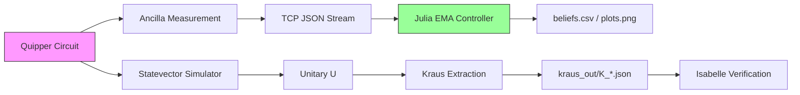
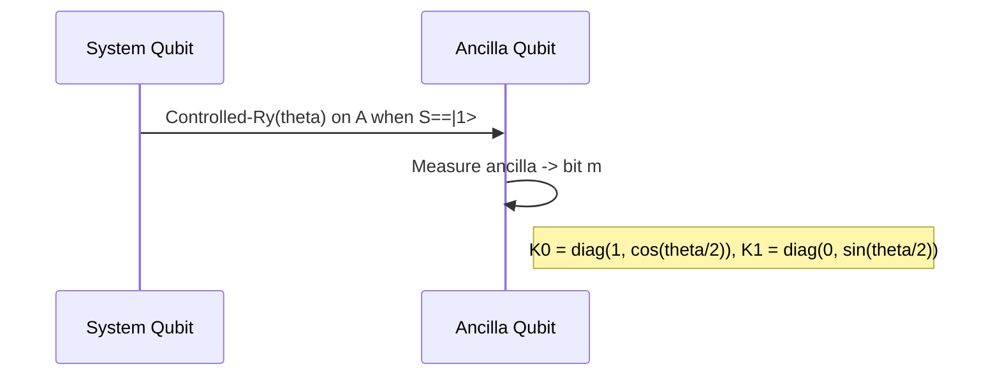
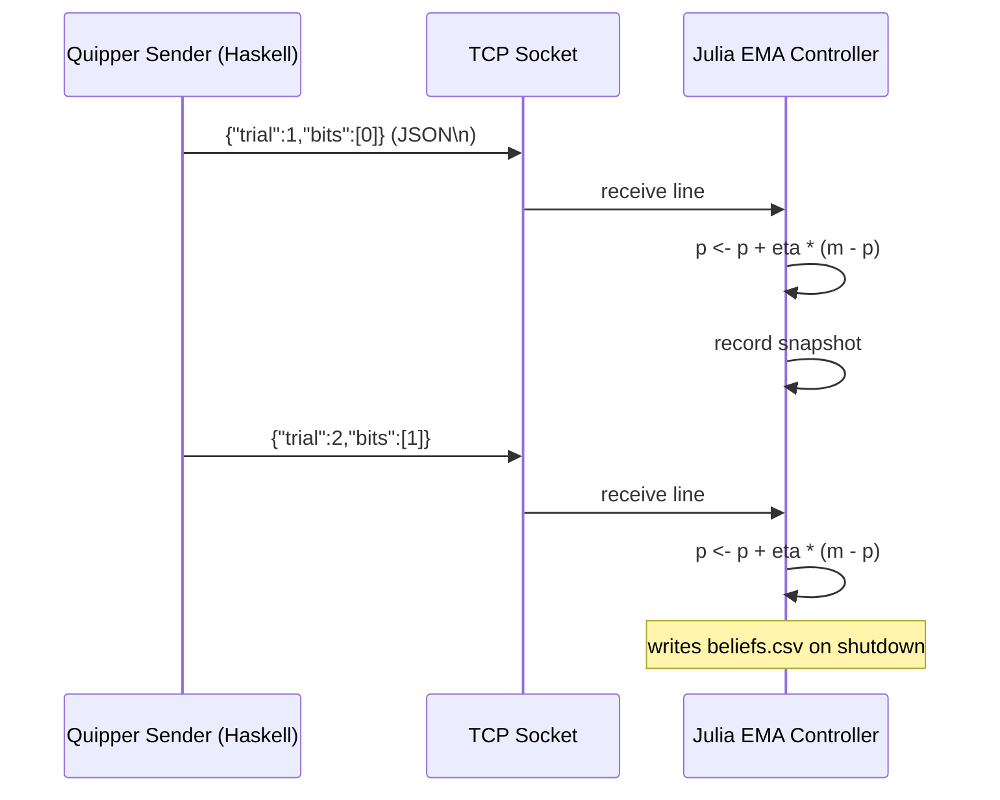
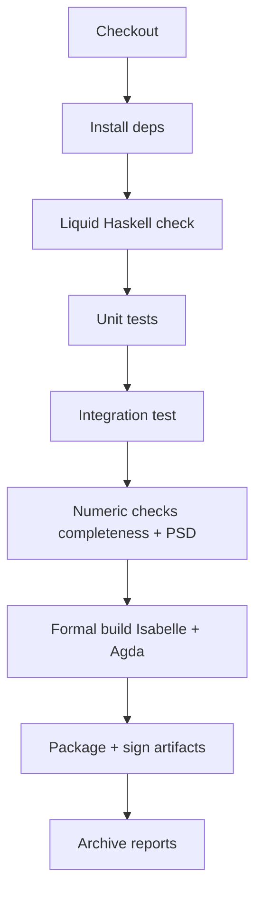
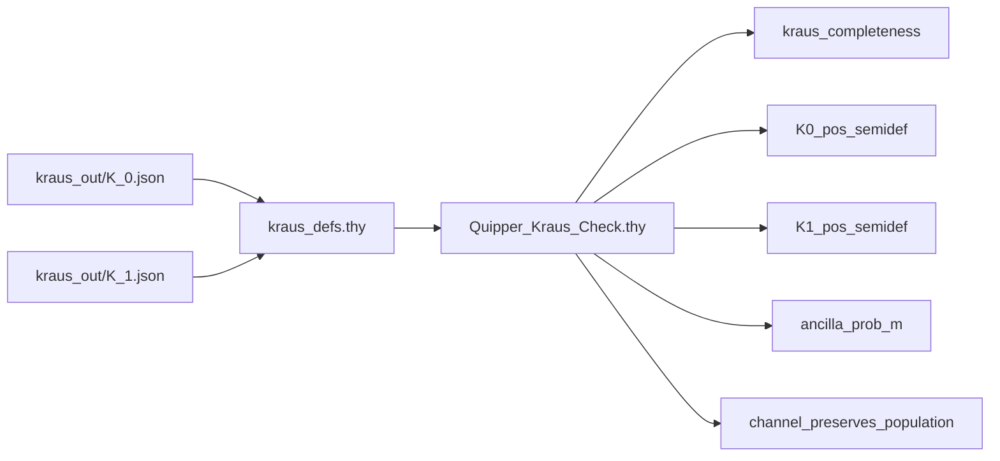

# Jungian Quantum Pipeline

<!-- SPDX-License-Identifier: LicenseRef-SovereignLeviathan-1.0 AND AGPL-3.0-or-later -->

**One-line summary**
Reproducible pipeline: Quipper weak-measurement → Kraus extraction → TCP streaming → Julia EMA controller → Isabelle verification.

---

## Visual Overview

**ASCII flowchart**

```
[Quipper Circuit] --> [Statevector / Simulator] --> [Unitary U]
       |                                           |
       |--measure--> {"trial":n,"bits":[...]} --> [TCP JSON stream] --> [Julia EMA controller]
                                                       |
                                                       v
                                               [beliefs.csv, plots.png]
                                                       |
                                                       v
                                               [Isabelle proofs consume K_m]
```

**Mermaid flowchart**



---

## Component Diagrams

### Quipper Circuit Detail



### IPC Sequence



### CI Pipeline



### Isabelle Verification



---

## Quickstart

```bash
# 1. Start Julia listener
julia --project=. julia/julia_driver.jl --host 127.0.0.1 --port 9001 --eta 0.1

# 2. Run Quipper sender
runhaskell haskell/QuipperTcpSenderLH.hs --host 127.0.0.1 --port 9001 --trials 200 --theta 0.392699081698724

# 3. Extract Kraus operators
cabal run kraus-extractor -- --outdir kraus_out --theta 0.392699081698724

# 4. Verify in Isabelle
isabelle build -v -d isabelle Quipper_Kraus_Session

# 5. Oscillator attractor search
python3 dynamics/oscillator_fixedpoints.py

# 6. Run full pipeline
bash run_pipeline.sh
```

---

## Repository layout

```
/
  haskell/
    WeakMeasureCircuit.hs
    WeakMeasureKrausLH.hs
    KrausLH.hs
    KrausLHTest.hs
    KrausExtractor.hs
    KrausExtractorMain.hs
    QuipperTcpSenderLH.hs
    PhaseEstimationQuipper.hs
    test_runner.sh
  julia/
    RWPT.jl
    FPGAMock.jl
    FutharkFFI.jl
    FPGA_API.jl
    julia_driver.jl
    quipper_client.jl
    e2e_sim_harness.jl
    jung_sim.jl
    jung_rwpt_sim.jl
  python/
    simulate_gate_list.py
    oscillator_fixedpoints.py
  futhark/
    wigner_futhark.fut
  isabelle/
    Density_Matrix.thy
    Lindblad_GKSL.thy
    Quantum_Jump_Update.thy
    Control_Invariants.thy
    GKSL_Semigroup.thy
    Quipper_Kraus_Check.thy
    Jungian_Formalization.thy
    Jungian_Prob_Dynamics.thy
    Jungian_Stochastic_Convergence_Full.thy
    Almost_Sure_Convergence.thy
  agda/
    SymbolOscillatorInvariant.agda
  data/
    pulse_table.csv
    dds_register_map.csv
  docs/
    flow.svg
    provenance.json
  .github/
    workflows/
      kraus_ci.yml
  LICENSE
  LICENSE-RECURSIVE-INFECTION
  README.md
  CONTRIBUTING.md
  PRODUCTION_HARDENING.md
  run_pipeline.sh
```

---

## Artifacts

| Artifact | Description |
|---|---|
| `kraus_out/K_0.json` | Numeric K₀ matrix |
| `kraus_out/K_1.json` | Numeric K₁ matrix |
| `kraus_out/kraus_defs.thy` | Isabelle definitions (auto-generated) |
| `beliefs.csv` | EMA belief trajectories from Julia controller |
| `kraus_test_report.json` | Numeric completeness + PSD report |
| `provenance/provenance.json` | Commit hash, toolchain, seed, theta |

---

## Formal verification status

| Theory | Status |
|--------|--------|
| `Density_Matrix.thy` | Complete |
| `Lindblad_GKSL.thy` | Complete |
| `Quantum_Jump_Update.thy` | Complete |
| `Control_Invariants.thy` | Complete |
| `GKSL_Semigroup.thy` | Structured (sorry: Trotter CPTP) |
| `Quipper_Kraus_Check.thy` | Complete |
| `Jungian_Prob_Dynamics.thy` | Complete |
| `Almost_Sure_Convergence.thy` | Structured (sorry: Birkhoff invocation) |
| `SymbolOscillatorInvariant.agda` | Skeleton (sorry: arithmetic lemmas) |

---

## Acceptance criteria

- IPC: Julia receives 100 messages within 30s and writes `beliefs.csv`
- Completeness: `‖∑ K_m†K_m − I‖_∞ < 1e-8`
- PSD: min eigenvalue of each `K_m†K_m ≥ -1e-8`
- Isabelle: session builds with no `sorry`
- LH: `liquid` reports no violations

---

## Provenance

```json
{
  "commit": "REPLACE_WITH_COMMIT",
  "toolchain": {
    "ghc": "REPLACE_GHC_VERSION",
    "quipper": "REPLACE_VERSION",
    "isabelle": "REPLACE_VERSION"
  },
  "theta": "pi/8",
  "seed": 1337,
  "generated": "2026-09-11T00:00:00Z"
}
```

---

## License

Sovereign Leviathan Covenant (MGPLv3) + Recursive Infection Clause.
Base: GNU AGPL-3.0. Governing law: England and Wales.

See `LICENSE` and `LICENSE-RECURSIVE-INFECTION`.
