# State Machines

> Every significant state machine in the repository as Mermaid stateDiagram-v2.
> Repository: devflow-finance-twin
> Generated: 2026-09-19

---

## Table of Contents

1. [Constraint Harness Runtime States](#1-constraint-harness-runtime-states)
2. [RSI Orchestrator States](#2-rsi-orchestrator-states)
3. [Sovereign Ledger States](#3-sovereign-ledger-states)
4. [Metal Inference States](#4-metal-inference-states)
5. [VSM-2500 Parameter Lifecycle](#5-vsm-2500-parameter-lifecycle)
6. [Constraint Constitution States](#6-constraint-constitution-states)
7. [Dream-RSI Policy States](#7-dream-rsi-policy-states)
8. [Audit Log States](#8-audit-log-states)
9. [WORM Block States](#9-worm-block-states)
10. [ORC Task Queue States](#10-orc-task-queue-states)
11. [Finance Transaction States](#11-finance-transaction-states)
12. [Apple Metal Command Buffer States](#12-apple-metal-command-buffer-states)
13. [Constraint Harness Scheduler States](#13-constraint-harness-scheduler-states)
14. [Discovery Tree Node States](#14-discovery-tree-node-states)
15. [Historical World Store States](#15-historical-world-store-states)
16. [Classifier Audit Log States](#16-classifier-audit-log-states)
17. [NAND# CPU States](#17-nand-cpu-states)
18. [QFlow Compiler States](#18-qflow-compiler-states)
19. [Quantum Circuit Execution States](#19-quantum-circuit-execution-states)
20. [Apple 6502 CPU States](#20-apple-6502-cpu-states)

---

## 1. Constraint Harness Runtime States

The constraint harness state machine is defined in `constraint-harness/runtime/states.py`. This is the primary runtime state machine governing every AI request processed through the system.

### Legal Transition Table

| From | To | Trigger |
|------|----|---------|
| RECEIVE | PARSE | Input received and buffer allocated |
| RECEIVE | FAILED_CLOSED | Fatal I/O error |
| PARSE | CONSTITUTION_CHECK | Parse successful |
| PARSE | FAILED_CLOSED | Parse error (malformed MXML) |
| CONSTITUTION_CHECK | DECOMPOSE | All hard axioms pass, no soft violations |
| CONSTITUTION_CHECK | REVISE | Soft axiom violation (may_revise=True) |
| CONSTITUTION_CHECK | FAILED_CLOSED | Hard axiom violation |
| DECOMPOSE | ROUTE | Sub-task decomposition complete |
| DECOMPOSE | FAILED_CLOSED | Decomposition error |
| ROUTE | DISPATCH | Head list determined by classifier |
| ROUTE | FAILED_CLOSED | No valid route found |
| DISPATCH | SUPERVISE | Command dispatch initiated |
| DISPATCH | FAILED_CLOSED | Dispatch error |
| SUPERVISE | VALIDATE | Execution complete, result received |
| SUPERVISE | FAILED_CLOSED | Supervision timeout or crash |
| VALIDATE | CROSS_CHECK | Primary validation passes |
| VALIDATE | REVISE | Soft validation failure |
| VALIDATE | FAILED_CLOSED | Hard validation failure |
| CROSS_CHECK | SYNTHESIZE | Cross-validation passes |
| CROSS_CHECK | REVISE | Cross-validation discrepancy |
| CROSS_CHECK | FAILED_CLOSED | Critical cross-check failure |
| SYNTHESIZE | FINALIZE | Result synthesis complete |
| SYNTHESIZE | FAILED_CLOSED | Synthesis error |
| FINALIZE | RETURN | Decision record sealed |
| FINALIZE | FAILED_CLOSED | Finalization error |
| RETURN | (terminal) | — |
| REVISE | CONSTITUTION_CHECK | Revision generated, re-evaluate |
| REVISE | DISPATCH | Revision targets dispatch only |
| REVISE | FAILED_CLOSED | Max revisions exceeded |
| FAILED_CLOSED | (terminal) | — |

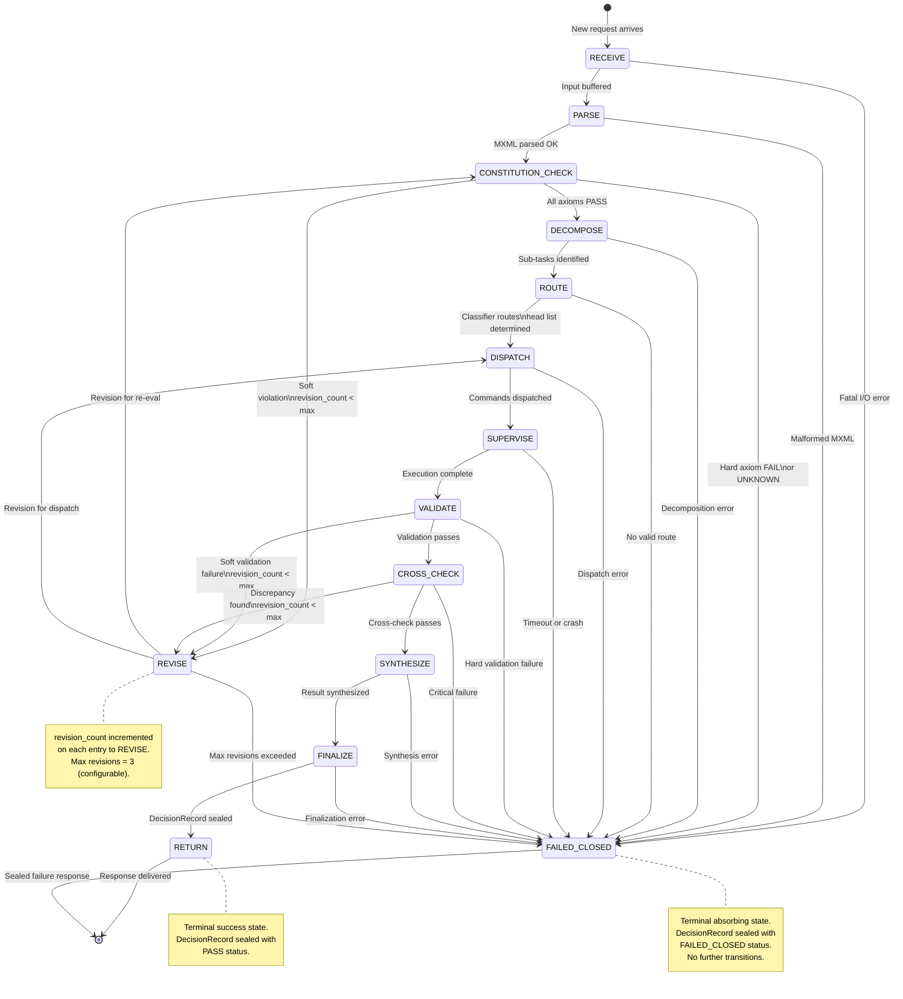
```mermaid
stateDiagram-v2
    [*] --> RECEIVE : New request arrives

    RECEIVE --> PARSE : Input buffered
    RECEIVE --> FAILED_CLOSED : Fatal I/O error

    PARSE --> CONSTITUTION_CHECK : MXML parsed OK
    PARSE --> FAILED_CLOSED : Malformed MXML

    CONSTITUTION_CHECK --> DECOMPOSE : All axioms PASS
    CONSTITUTION_CHECK --> REVISE : Soft violation\nrevision_count < max
    CONSTITUTION_CHECK --> FAILED_CLOSED : Hard axiom FAIL\nor UNKNOWN

    DECOMPOSE --> ROUTE : Sub-tasks identified
    DECOMPOSE --> FAILED_CLOSED : Decomposition error

    ROUTE --> DISPATCH : Classifier routes\nhead list determined
    ROUTE --> FAILED_CLOSED : No valid route

    DISPATCH --> SUPERVISE : Commands dispatched
    DISPATCH --> FAILED_CLOSED : Dispatch error

    SUPERVISE --> VALIDATE : Execution complete
    SUPERVISE --> FAILED_CLOSED : Timeout or crash

    VALIDATE --> CROSS_CHECK : Validation passes
    VALIDATE --> REVISE : Soft validation failure\nrevision_count < max
    VALIDATE --> FAILED_CLOSED : Hard validation failure

    CROSS_CHECK --> SYNTHESIZE : Cross-check passes
    CROSS_CHECK --> REVISE : Discrepancy found\nrevision_count < max
    CROSS_CHECK --> FAILED_CLOSED : Critical failure

    SYNTHESIZE --> FINALIZE : Result synthesized
    SYNTHESIZE --> FAILED_CLOSED : Synthesis error

    FINALIZE --> RETURN : DecisionRecord sealed
    FINALIZE --> FAILED_CLOSED : Finalization error

    RETURN --> [*] : Response delivered

    REVISE --> CONSTITUTION_CHECK : Revision for re-eval
    REVISE --> DISPATCH : Revision for dispatch
    REVISE --> FAILED_CLOSED : Max revisions exceeded

    FAILED_CLOSED --> [*] : Sealed failure response

    note right of REVISE
        revision_count incremented
        on each entry to REVISE.
        Max revisions = 3 (configurable).
    end note

    note right of FAILED_CLOSED
        Terminal absorbing state.
        DecisionRecord sealed with
        FAILED_CLOSED status.
        No further transitions.
    end note

    note right of RETURN
        Terminal success state.
        DecisionRecord sealed with
        PASS status.
    end note
```

### State Invariants

Each state enforces invariants:

**RECEIVE:** `execution_id != None`, `history == []`
**PARSE:** `current == PARSE` iff input bytes available in buffer
**CONSTITUTION_CHECK:** `len(axiom_results) == len(required_axioms)` after evaluation
**REVISE:** `revision_count >= 1`; if `revision_count >= max_revisions`, next transition must be `FAILED_CLOSED`
**RETURN:** `decision_record.seal != ""` (seal computed before RETURN entered)
**FAILED_CLOSED:** `decision_record.seal != ""` (always sealed, even on failure)

---

## 2. RSI Orchestrator States

The RSI orchestrator state machine governs a single round of the recursive self-improvement loop, defined in `dream_rsi/core/orchestrator.py`.

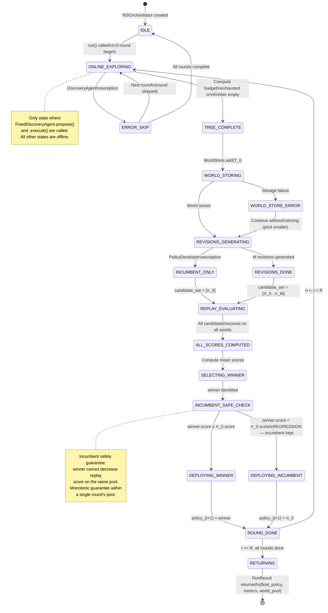
```mermaid
stateDiagram-v2
    [*] --> IDLE : RSIOrchestrator created

    IDLE --> ONLINE_EXPLORING : run() called\nt=0 round begins

    ONLINE_EXPLORING --> TREE_COMPLETE : Compute budget\nexhausted or\nfrontier empty
    ONLINE_EXPLORING --> ERROR_SKIP : DiscoveryAgent\nexception

    ERROR_SKIP --> ONLINE_EXPLORING : Next round\n(round skipped)
    ERROR_SKIP --> IDLE : All rounds complete

    TREE_COMPLETE --> WORLD_STORING : WorldStore.add(T_t)

    WORLD_STORING --> REVISIONS_GENERATING : World stored
    WORLD_STORING --> WORLD_STORE_ERROR : Storage failure

    WORLD_STORE_ERROR --> REVISIONS_GENERATING : Continue without\nstoring (pool smaller)

    REVISIONS_GENERATING --> REVISIONS_DONE : M revisions generated
    REVISIONS_GENERATING --> INCUMBENT_ONLY : PolicyDeveloper\nexception

    INCUMBENT_ONLY --> REPLAY_EVALUATING : candidate_set = [π_0]
    REVISIONS_DONE --> REPLAY_EVALUATING : candidate_set = [π_0...π_M]

    REPLAY_EVALUATING --> ALL_SCORES_COMPUTED : All candidates\nscored on all worlds

    ALL_SCORES_COMPUTED --> SELECTING_WINNER : Compute mean scores

    SELECTING_WINNER --> INCUMBENT_SAFE_CHECK : winner identified

    INCUMBENT_SAFE_CHECK --> DEPLOYING_WINNER : winner.score ≥ π_0.score
    INCUMBENT_SAFE_CHECK --> DEPLOYING_INCUMBENT : winner.score < π_0.score\nREGRESSION — incumbent kept

    DEPLOYING_WINNER --> ROUND_DONE : policy_{t+1} = winner
    DEPLOYING_INCUMBENT --> ROUND_DONE : policy_{t+1} = π_0

    ROUND_DONE --> ONLINE_EXPLORING : t++, t < R
    ROUND_DONE --> RETURNING : t == R, all rounds done

    RETURNING --> [*] : RunResult returned\n{final_policy, metrics, world_pool}

    note right of INCUMBENT_SAFE_CHECK
        Incumbent safety guarantee:
        winner cannot decrease replay
        score on the same pool.
        Monotonic guarantee within
        a single round's pool.
    end note

    note right of ONLINE_EXPLORING
        Only state where
        FixedDiscoveryAgent.propose()
        and .execute() are called.
        All other states are offline.
    end note
```

### Metric Invariants by State

| State | Metric update |
|-------|---------------|
| ONLINE_EXPLORING (each proposal) | `discovery_agent_calls++` |
| ONLINE_EXPLORING (each execution) | `online_executions++` |
| REVISIONS_GENERATING (each revision) | `policy_revisions++` |
| REPLAY_EVALUATING (each evaluation) | `replay_evaluations++`, `offline_evaluations++` |
| ROUND_DONE | `generations++` |

---

## 3. Sovereign Ledger States

The sovereign ledger state machine governs the lifecycle of the ledger store itself, defined in `sovereign/` (Go).

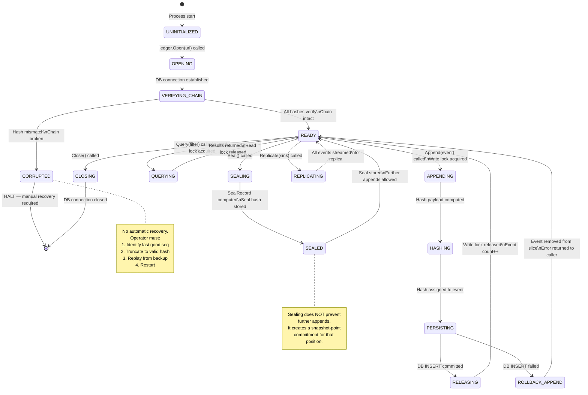
```mermaid
stateDiagram-v2
    [*] --> UNINITIALIZED : Process start

    UNINITIALIZED --> OPENING : ledger.Open(url) called

    OPENING --> VERIFYING_CHAIN : DB connection established

    VERIFYING_CHAIN --> READY : All hashes verify\nChain intact
    VERIFYING_CHAIN --> CORRUPTED : Hash mismatch\nChain broken

    CORRUPTED --> [*] : HALT — manual recovery required

    READY --> APPENDING : Append(event) called\nWrite lock acquired

    APPENDING --> HASHING : Hash payload computed

    HASHING --> PERSISTING : Hash assigned to event

    PERSISTING --> RELEASING : DB INSERT committed
    PERSISTING --> ROLLBACK_APPEND : DB INSERT failed

    ROLLBACK_APPEND --> READY : Event removed from slice\nError returned to caller

    RELEASING --> READY : Write lock released\nEvent count++

    READY --> QUERYING : Query(filter) called\nRead lock acquired

    QUERYING --> READY : Results returned\nRead lock released

    READY --> SEALING : Seal() called

    SEALING --> SEALED : SealRecord computed\nSeal hash stored

    SEALED --> READY : Seal stored\nFurther appends allowed

    READY --> REPLICATING : Replicate(sink) called

    REPLICATING --> READY : All events streamed\nto replica

    READY --> CLOSING : Close() called

    CLOSING --> [*] : DB connection closed

    note right of CORRUPTED
        No automatic recovery.
        Operator must:
        1. Identify last good seq
        2. Truncate to valid hash
        3. Replay from backup
        4. Restart
    end note

    note right of SEALED
        Sealing does NOT prevent
        further appends.
        It creates a snapshot-point
        commitment for that position.
    end note
```

---

## 4. Metal Inference States

The Apple Metal inference state machine governs the lifecycle of the Metal inference engine, defined in `apple-metal-inference/Sources/`.

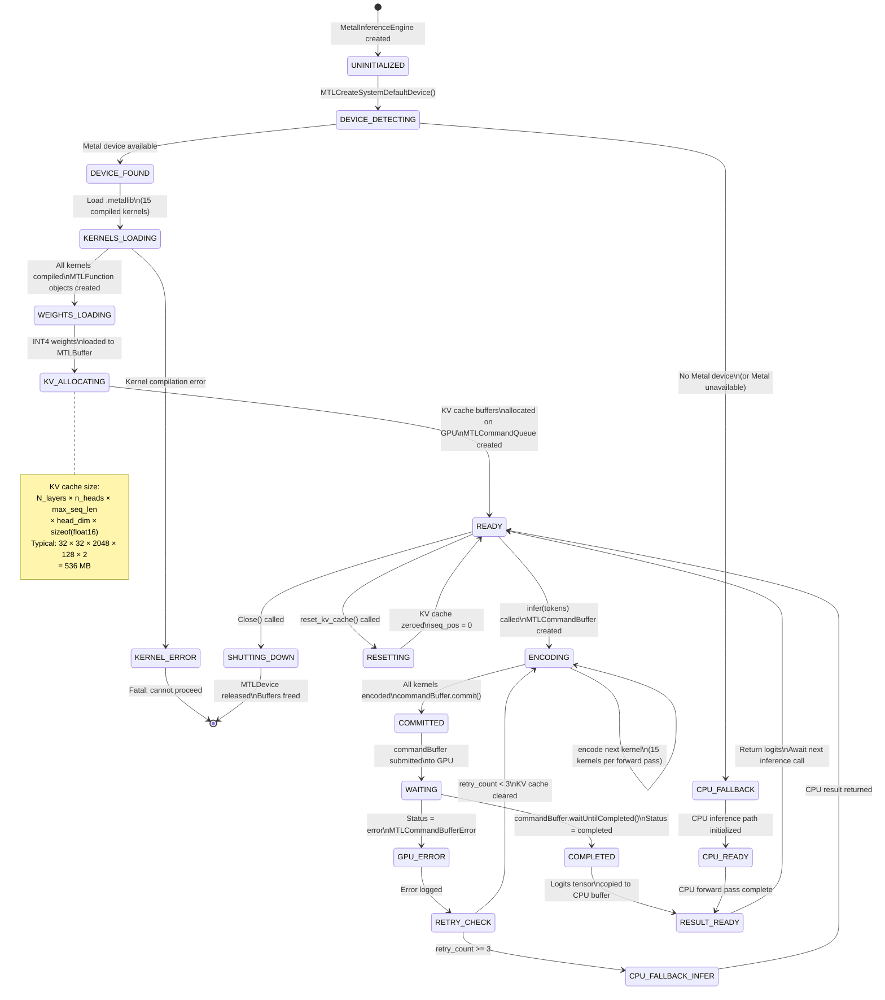
```mermaid
stateDiagram-v2
    [*] --> UNINITIALIZED : MetalInferenceEngine created

    UNINITIALIZED --> DEVICE_DETECTING : MTLCreateSystemDefaultDevice()

    DEVICE_DETECTING --> DEVICE_FOUND : Metal device available
    DEVICE_DETECTING --> CPU_FALLBACK : No Metal device\n(or Metal unavailable)

    CPU_FALLBACK --> CPU_READY : CPU inference path initialized

    DEVICE_FOUND --> KERNELS_LOADING : Load .metallib\n(15 compiled kernels)

    KERNELS_LOADING --> WEIGHTS_LOADING : All kernels compiled\nMTLFunction objects created
    KERNELS_LOADING --> KERNEL_ERROR : Kernel compilation error

    KERNEL_ERROR --> [*] : Fatal: cannot proceed

    WEIGHTS_LOADING --> KV_ALLOCATING : INT4 weights\nloaded to MTLBuffer

    KV_ALLOCATING --> READY : KV cache buffers\nallocated on GPU\nMTLCommandQueue created

    READY --> ENCODING : infer(tokens) called\nMTLCommandBuffer created

    ENCODING --> ENCODING : encode next kernel\n(15 kernels per forward pass)

    ENCODING --> COMMITTED : All kernels encoded\ncommandBuffer.commit()

    COMMITTED --> WAITING : commandBuffer submitted\nto GPU

    WAITING --> COMPLETED : commandBuffer.waitUntilCompleted()\nStatus = completed

    WAITING --> GPU_ERROR : Status = error\nMTLCommandBufferError

    GPU_ERROR --> RETRY_CHECK : Error logged

    RETRY_CHECK --> ENCODING : retry_count < 3\nKV cache cleared

    RETRY_CHECK --> CPU_FALLBACK_INFER : retry_count >= 3

    CPU_FALLBACK_INFER --> READY : CPU result returned

    COMPLETED --> RESULT_READY : Logits tensor\ncopied to CPU buffer

    RESULT_READY --> READY : Return logits\nAwait next inference call

    CPU_READY --> RESULT_READY : CPU forward pass complete

    READY --> RESETTING : reset_kv_cache() called

    RESETTING --> READY : KV cache zeroed\nseq_pos = 0

    READY --> SHUTTING_DOWN : Close() called

    SHUTTING_DOWN --> [*] : MTLDevice released\nBuffers freed

    note right of KV_ALLOCATING
        KV cache size:
        N_layers × n_heads × max_seq_len
        × head_dim × sizeof(float16)
        Typical: 32 × 32 × 2048 × 128 × 2
        = 536 MB
    end note
```

---

## 5. VSM-2500 Parameter Lifecycle

The Virtual Parameter (VP) object lifecycle in the VSM-2500 binary semantic VM, defined in `vsm2500/` and `rust/fsl/src/sovereign_neural_saas_core.rs`.

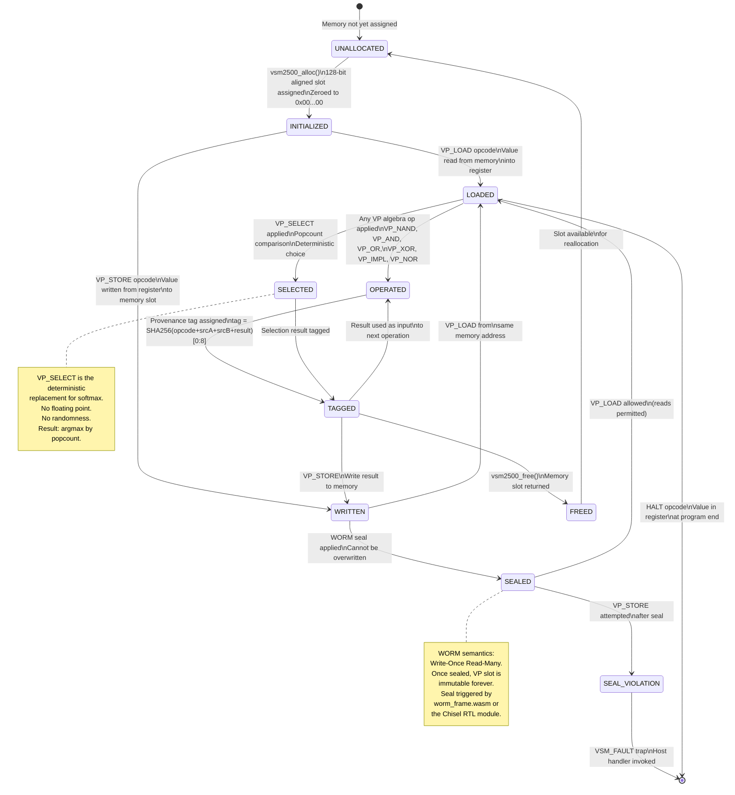
```mermaid
stateDiagram-v2
    [*] --> UNALLOCATED : Memory not yet assigned

    UNALLOCATED --> INITIALIZED : vsm2500_alloc()\n128-bit aligned slot assigned\nZeroed to 0x00...00

    INITIALIZED --> LOADED : VP_LOAD opcode\nValue read from memory\ninto register

    INITIALIZED --> WRITTEN : VP_STORE opcode\nValue written from register\nto memory slot

    LOADED --> OPERATED : Any VP algebra op applied\nVP_NAND, VP_AND, VP_OR,\nVP_XOR, VP_IMPL, VP_NOR

    OPERATED --> TAGGED : Provenance tag assigned\ntag = SHA256(opcode+srcA+srcB+result)[0:8]

    TAGGED --> WRITTEN : VP_STORE\nWrite result to memory

    TAGGED --> OPERATED : Result used as input\nto next operation

    LOADED --> SELECTED : VP_SELECT applied\nPopcount comparison\nDeterministic choice

    SELECTED --> TAGGED : Selection result tagged

    WRITTEN --> LOADED : VP_LOAD from\nsame memory address

    WRITTEN --> SEALED : WORM seal applied\nCannot be overwritten

    SEALED --> LOADED : VP_LOAD allowed\n(reads permitted)

    SEALED --> SEAL_VIOLATION : VP_STORE attempted\nafter seal

    SEAL_VIOLATION --> [*] : VSM_FAULT trap\nHost handler invoked

    TAGGED --> FREED : vsm2500_free()\nMemory slot returned

    FREED --> UNALLOCATED : Slot available\nfor reallocation

    LOADED --> [*] : HALT opcode\nValue in register\nat program end

    note right of SEALED
        WORM semantics:
        Write-Once Read-Many.
        Once sealed, VP slot is
        immutable forever.
        Seal triggered by
        worm_frame.wasm or
        the Chisel RTL module.
    end note

    note right of SELECTED
        VP_SELECT is the deterministic
        replacement for softmax.
        No floating point.
        No randomness.
        Result: argmax by popcount.
    end note
```

---

## 6. Constraint Constitution States

The constitution evaluation state machine for a single axiom evaluation, defined in `constraint-harness/constitution/constitution.py`.

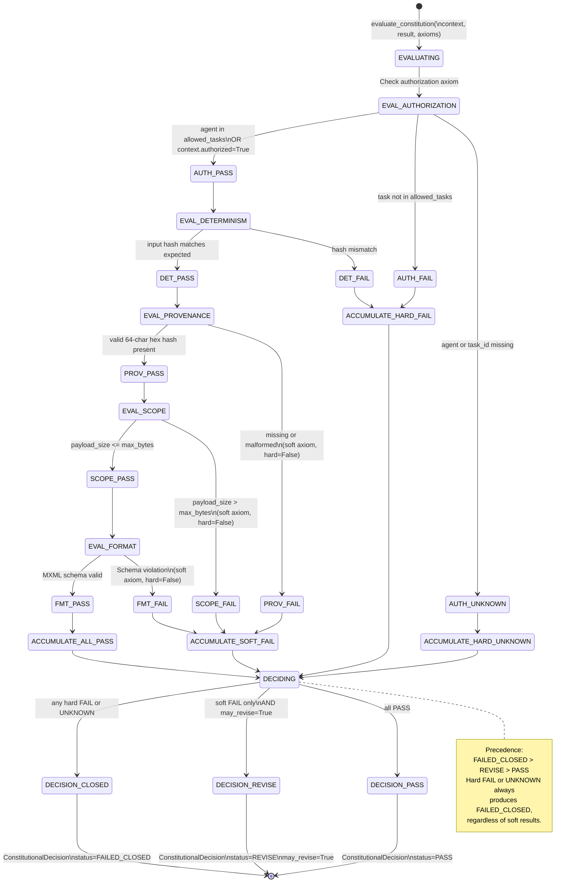
```mermaid
stateDiagram-v2
    [*] --> EVALUATING : evaluate_constitution(\ncontext, result, axioms)

    EVALUATING --> EVAL_AUTHORIZATION : Check authorization axiom

    EVAL_AUTHORIZATION --> AUTH_PASS : agent in allowed_tasks\nOR context.authorized=True
    EVAL_AUTHORIZATION --> AUTH_FAIL : task not in allowed_tasks
    EVAL_AUTHORIZATION --> AUTH_UNKNOWN : agent or task_id missing

    AUTH_PASS --> EVAL_DETERMINISM
    AUTH_FAIL --> ACCUMULATE_HARD_FAIL
    AUTH_UNKNOWN --> ACCUMULATE_HARD_UNKNOWN

    EVAL_DETERMINISM --> DET_PASS : input hash matches expected
    EVAL_DETERMINISM --> DET_FAIL : hash mismatch

    DET_PASS --> EVAL_PROVENANCE
    DET_FAIL --> ACCUMULATE_HARD_FAIL

    EVAL_PROVENANCE --> PROV_PASS : valid 64-char hex hash present
    EVAL_PROVENANCE --> PROV_FAIL : missing or malformed\n(soft axiom, hard=False)

    PROV_PASS --> EVAL_SCOPE
    PROV_FAIL --> ACCUMULATE_SOFT_FAIL

    EVAL_SCOPE --> SCOPE_PASS : payload_size <= max_bytes
    EVAL_SCOPE --> SCOPE_FAIL : payload_size > max_bytes\n(soft axiom, hard=False)

    SCOPE_PASS --> EVAL_FORMAT
    SCOPE_FAIL --> ACCUMULATE_SOFT_FAIL

    EVAL_FORMAT --> FMT_PASS : MXML schema valid
    EVAL_FORMAT --> FMT_FAIL : Schema violation\n(soft axiom, hard=False)

    FMT_PASS --> ACCUMULATE_ALL_PASS
    FMT_FAIL --> ACCUMULATE_SOFT_FAIL

    ACCUMULATE_HARD_FAIL --> DECIDING
    ACCUMULATE_HARD_UNKNOWN --> DECIDING
    ACCUMULATE_SOFT_FAIL --> DECIDING
    ACCUMULATE_ALL_PASS --> DECIDING

    DECIDING --> DECISION_CLOSED : any hard FAIL or UNKNOWN
    DECIDING --> DECISION_REVISE : soft FAIL only\nAND may_revise=True
    DECIDING --> DECISION_PASS : all PASS

    DECISION_CLOSED --> [*] : ConstitutionalDecision\nstatus=FAILED_CLOSED
    DECISION_REVISE --> [*] : ConstitutionalDecision\nstatus=REVISE\nmay_revise=True
    DECISION_PASS --> [*] : ConstitutionalDecision\nstatus=PASS

    note right of DECIDING
        Precedence:
        FAILED_CLOSED > REVISE > PASS
        Hard FAIL or UNKNOWN always
        produces FAILED_CLOSED,
        regardless of soft results.
    end note
```

---

## 7. Dream-RSI Policy States

The lifecycle of a single policy object in the Dream-RSI system, spanning creation through selection or retirement.

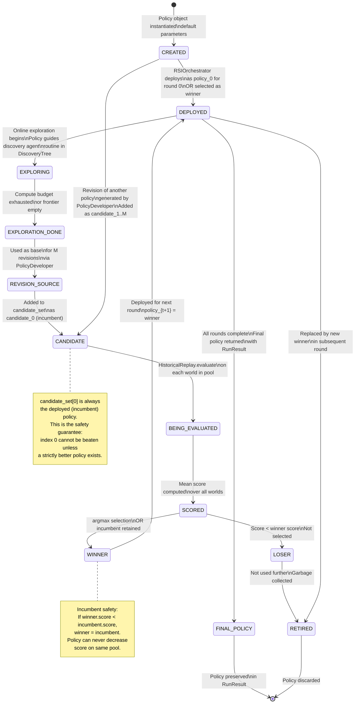
```mermaid
stateDiagram-v2
    [*] --> CREATED : Policy object instantiated\ndefault parameters

    CREATED --> DEPLOYED : RSIOrchestrator deploys\nas policy_0 for round 0\nOR selected as winner

    DEPLOYED --> EXPLORING : Online exploration begins\nPolicy guides discovery agent\nroutine in DiscoveryTree

    EXPLORING --> EXPLORATION_DONE : Compute budget exhausted\nor frontier empty

    EXPLORATION_DONE --> REVISION_SOURCE : Used as base\nfor M revisions\nvia PolicyDeveloper

    REVISION_SOURCE --> CANDIDATE : Added to candidate_set\nas candidate_0 (incumbent)

    CREATED --> CANDIDATE : Revision of another policy\ngenerated by PolicyDeveloper\nAdded as candidate_1..M

    CANDIDATE --> BEING_EVALUATED : HistoricalReplay.evaluate\non each world in pool

    BEING_EVALUATED --> SCORED : Mean score computed\nover all worlds

    SCORED --> WINNER : argmax selection\nOR incumbent retained

    SCORED --> LOSER : Score < winner score\nNot selected

    WINNER --> DEPLOYED : Deployed for next round\npolicy_{t+1} = winner

    LOSER --> RETIRED : Not used further\nGarbage collected

    DEPLOYED --> RETIRED : Replaced by new winner\nin subsequent round

    DEPLOYED --> FINAL_POLICY : All rounds complete\nFinal policy returned\nwith RunResult

    FINAL_POLICY --> [*] : Policy preserved\nin RunResult

    RETIRED --> [*] : Policy discarded

    note right of WINNER
        Incumbent safety:
        If winner.score < incumbent.score,
        winner = incumbent.
        Policy can never decrease
        score on same pool.
    end note

    note right of CANDIDATE
        candidate_set[0] is always
        the deployed (incumbent) policy.
        This is the safety guarantee:
        index 0 cannot be beaten unless
        a strictly better policy exists.
    end note
```

---

## 8. Audit Log States

The constraint-harness audit log state machine, defined in `constraint-harness/audit/`.

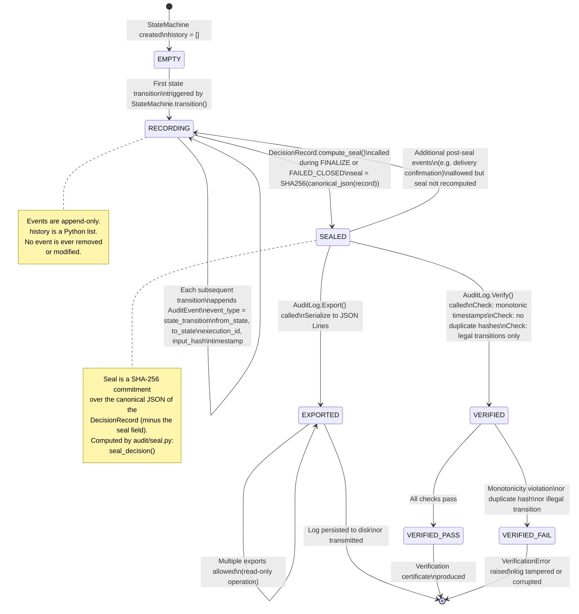
```mermaid
stateDiagram-v2
    [*] --> EMPTY : StateMachine created\nhistory = []

    EMPTY --> RECORDING : First state transition\ntriggered by StateMachine.transition()

    RECORDING --> RECORDING : Each subsequent transition\nappends AuditEvent\nevent_type = state_transition\nfrom_state, to_state\nexecution_id, input_hash\ntimestamp

    RECORDING --> SEALED : DecisionRecord.compute_seal()\ncalled during FINALIZE or FAILED_CLOSED\nseal = SHA256(canonical_json(record))

    SEALED --> RECORDING : Additional post-seal events\n(e.g. delivery confirmation)\nallowed but seal not recomputed

    SEALED --> EXPORTED : AuditLog.Export() called\nSerialize to JSON Lines

    EXPORTED --> EXPORTED : Multiple exports allowed\n(read-only operation)

    SEALED --> VERIFIED : AuditLog.Verify() called\nCheck: monotonic timestamps\nCheck: no duplicate hashes\nCheck: legal transitions only

    VERIFIED --> VERIFIED_PASS : All checks pass
    VERIFIED --> VERIFIED_FAIL : Monotonicity violation\nor duplicate hash\nor illegal transition

    EXPORTED --> [*] : Log persisted to disk\nor transmitted

    VERIFIED_PASS --> [*] : Verification certificate\nproduced

    VERIFIED_FAIL --> [*] : VerificationError raised\nlog tampered or corrupted

    note right of SEALED
        Seal is a SHA-256 commitment
        over the canonical JSON of the
        DecisionRecord (minus the seal field).
        Computed by audit/seal.py:
        seal_decision()
    end note

    note right of RECORDING
        Events are append-only.
        history is a Python list.
        No event is ever removed
        or modified.
    end note
```

---

## 9. WORM Block States

The Write-Once Read-Many block lifecycle, implemented in both `wasm/worm_frame.wasm` (Rust) and `languages/chisel/WormHardwareAccelerator.scala`.

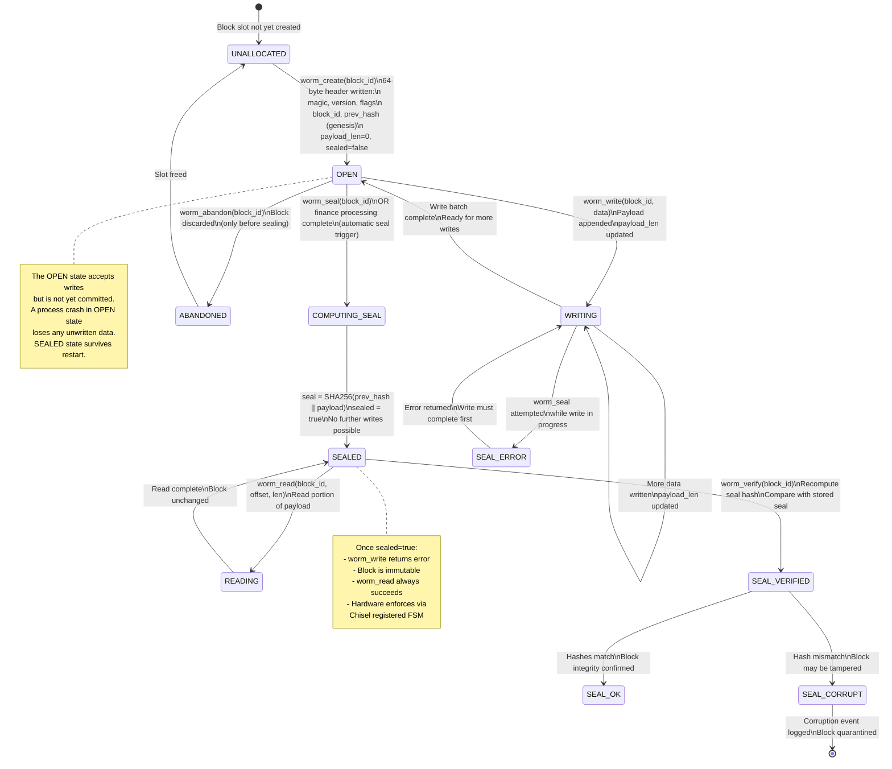
```mermaid
stateDiagram-v2
    [*] --> UNALLOCATED : Block slot not yet created

    UNALLOCATED --> OPEN : worm_create(block_id)\n64-byte header written:\n  magic, version, flags\n  block_id, prev_hash (genesis)\n  payload_len=0, sealed=false

    OPEN --> WRITING : worm_write(block_id, data)\nPayload appended\npayload_len updated

    WRITING --> WRITING : More data written\npayload_len updated

    WRITING --> OPEN : Write batch complete\nReady for more writes

    OPEN --> COMPUTING_SEAL : worm_seal(block_id)\nOR finance processing complete\n(automatic seal trigger)

    COMPUTING_SEAL --> SEALED : seal = SHA256(prev_hash || payload)\nsealed = true\nNo further writes possible

    SEALED --> READING : worm_read(block_id, offset, len)\nRead portion of payload

    READING --> SEALED : Read complete\nBlock unchanged

    SEALED --> SEAL_VERIFIED : worm_verify(block_id)\nRecompute seal hash\nCompare with stored seal

    SEAL_VERIFIED --> SEAL_OK : Hashes match\nBlock integrity confirmed

    SEAL_VERIFIED --> SEAL_CORRUPT : Hash mismatch\nBlock may be tampered

    SEAL_CORRUPT --> [*] : Corruption event logged\nBlock quarantined

    WRITING --> SEAL_ERROR : worm_seal attempted\nwhile write in progress

    SEAL_ERROR --> WRITING : Error returned\nWrite must complete first

    OPEN --> ABANDONED : worm_abandon(block_id)\nBlock discarded\n(only before sealing)

    ABANDONED --> UNALLOCATED : Slot freed

    note right of SEALED
        Once sealed=true:
        - worm_write returns error
        - Block is immutable
        - worm_read always succeeds
        - Hardware enforces via
          Chisel registered FSM
    end note

    note right of OPEN
        The OPEN state accepts writes
        but is not yet committed.
        A process crash in OPEN state
        loses any unwritten data.
        SEALED state survives restart.
    end note
```

---

## 10. ORC Task Queue States

The orchestrator task queue state machine, defined in `schema/ORC_SCHEMA.sql` ORCTASK table.

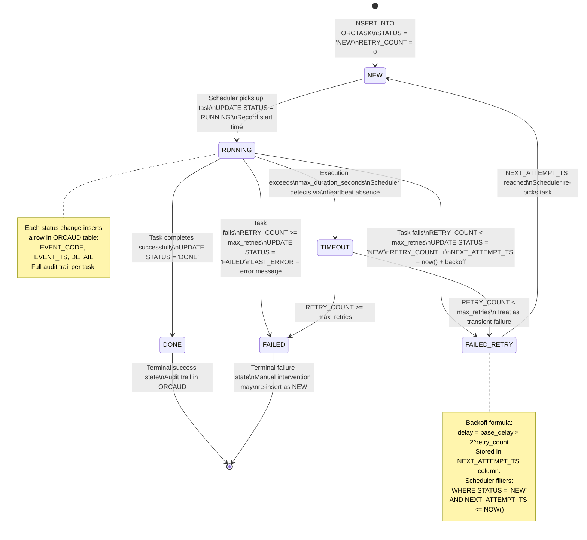
```mermaid
stateDiagram-v2
    [*] --> NEW : INSERT INTO ORCTASK\nSTATUS = 'NEW'\nRETRY_COUNT = 0

    NEW --> RUNNING : Scheduler picks up task\nUPDATE STATUS = 'RUNNING'\nRecord start time

    RUNNING --> DONE : Task completes successfully\nUPDATE STATUS = 'DONE'

    RUNNING --> FAILED_RETRY : Task fails\nRETRY_COUNT < max_retries\nUPDATE STATUS = 'NEW'\nRETRY_COUNT++\nNEXT_ATTEMPT_TS = now() + backoff

    RUNNING --> FAILED : Task fails\nRETRY_COUNT >= max_retries\nUPDATE STATUS = 'FAILED'\nLAST_ERROR = error message

    FAILED_RETRY --> NEW : NEXT_ATTEMPT_TS reached\nScheduler re-picks task

    RUNNING --> TIMEOUT : Execution exceeds\nmax_duration_seconds\nScheduler detects via\nheartbeat absence

    TIMEOUT --> FAILED_RETRY : RETRY_COUNT < max_retries\nTreat as transient failure

    TIMEOUT --> FAILED : RETRY_COUNT >= max_retries

    DONE --> [*] : Terminal success state\nAudit trail in ORCAUD

    FAILED --> [*] : Terminal failure state\nManual intervention may\nre-insert as NEW

    note right of FAILED_RETRY
        Backoff formula:
        delay = base_delay × 2^retry_count
        Stored in NEXT_ATTEMPT_TS column.
        Scheduler filters:
        WHERE STATUS = 'NEW'
        AND NEXT_ATTEMPT_TS <= NOW()
    end note

    note right of RUNNING
        Each status change inserts
        a row in ORCAUD table:
        EVENT_CODE, EVENT_TS, DETAIL
        Full audit trail per task.
    end note
```

---

## 11. Finance Transaction States

The end-to-end finance transaction state machine spanning COBOL, Go ledger, and RPGLE.

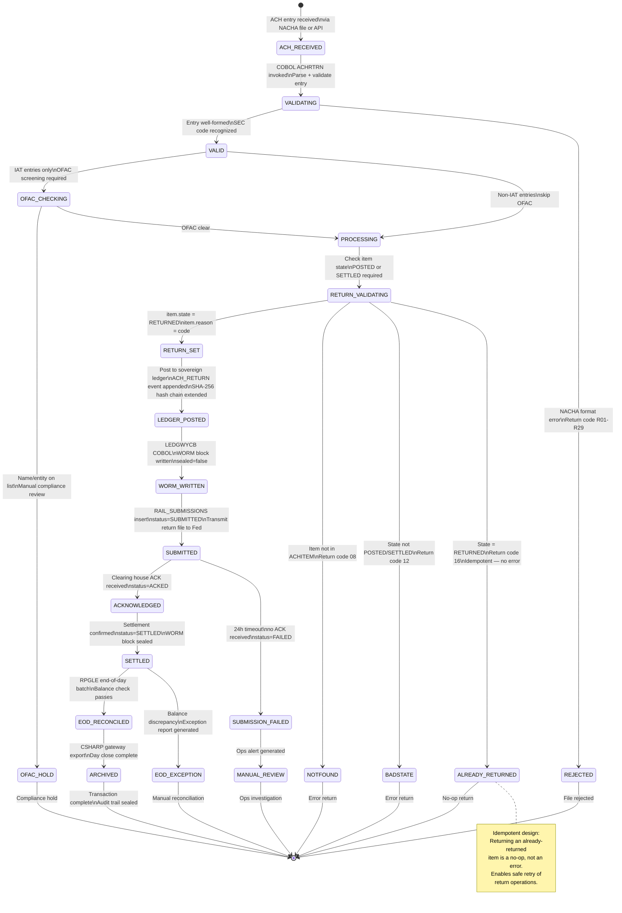
```mermaid
stateDiagram-v2
    [*] --> ACH_RECEIVED : ACH entry received\nvia NACHA file or API

    ACH_RECEIVED --> VALIDATING : COBOL ACHRTRN invoked\nParse + validate entry

    VALIDATING --> VALID : Entry well-formed\nSEC code recognized

    VALIDATING --> REJECTED : NACHA format error\nReturn code R01-R29

    VALID --> OFAC_CHECKING : IAT entries only\nOFAC screening required

    VALID --> PROCESSING : Non-IAT entries\nskip OFAC

    OFAC_CHECKING --> OFAC_HOLD : Name/entity on list\nManual compliance review

    OFAC_CHECKING --> PROCESSING : OFAC clear

    PROCESSING --> RETURN_VALIDATING : Check item state\nPOSTED or SETTLED required

    RETURN_VALIDATING --> RETURN_SET : item.state = RETURNED\nitem.reason = code

    RETURN_VALIDATING --> NOTFOUND : Item not in ACHITEM\nReturn code 08

    RETURN_VALIDATING --> BADSTATE : State not POSTED/SETTLED\nReturn code 12

    RETURN_VALIDATING --> ALREADY_RETURNED : State = RETURNED\nReturn code 16\nIdempotent — no error

    RETURN_SET --> LEDGER_POSTED : Post to sovereign ledger\nACH_RETURN event appended\nSHA-256 hash chain extended

    LEDGER_POSTED --> WORM_WRITTEN : LEDGWYCB COBOL\nWORM block written\nsealed=false

    WORM_WRITTEN --> SUBMITTED : RAIL_SUBMISSIONS insert\nstatus=SUBMITTED\nTransmit return file to Fed

    SUBMITTED --> ACKNOWLEDGED : Clearing house ACK received\nstatus=ACKED

    ACKNOWLEDGED --> SETTLED : Settlement confirmed\nstatus=SETTLED\nWORM block sealed

    SUBMITTED --> SUBMISSION_FAILED : 24h timeout\nno ACK received\nstatus=FAILED

    SUBMISSION_FAILED --> MANUAL_REVIEW : Ops alert generated

    SETTLED --> EOD_RECONCILED : RPGLE end-of-day batch\nBalance check passes

    SETTLED --> EOD_EXCEPTION : Balance discrepancy\nException report generated

    EOD_RECONCILED --> ARCHIVED : CSHARP gateway export\nDay close complete

    ARCHIVED --> [*] : Transaction complete\nAudit trail sealed

    REJECTED --> [*] : File rejected
    NOTFOUND --> [*] : Error return
    BADSTATE --> [*] : Error return
    ALREADY_RETURNED --> [*] : No-op return
    OFAC_HOLD --> [*] : Compliance hold
    MANUAL_REVIEW --> [*] : Ops investigation
    EOD_EXCEPTION --> [*] : Manual reconciliation

    note right of ALREADY_RETURNED
        Idempotent design:
        Returning an already-returned
        item is a no-op, not an error.
        Enables safe retry of
        return operations.
    end note
```

---

## 12. Apple Metal Command Buffer States

The Metal command buffer state machine for a single inference forward pass.

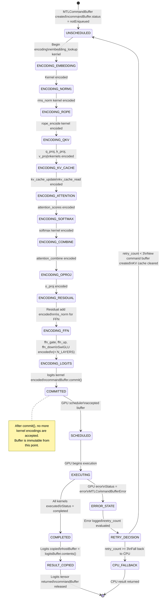
```mermaid
stateDiagram-v2
    [*] --> UNSCHEDULED : MTLCommandBuffer created\ncommandBuffer.status = notEnqueued

    UNSCHEDULED --> ENCODING_EMBEDDING : Begin encoding\nembedding_lookup kernel

    ENCODING_EMBEDDING --> ENCODING_NORM1 : Kernel encoded

    ENCODING_NORM1 --> ENCODING_ROPE : rms_norm kernel encoded

    ENCODING_ROPE --> ENCODING_QKV : rope_encode kernel encoded

    ENCODING_QKV --> ENCODING_KV_CACHE : q_proj, k_proj, v_proj\nkernels encoded

    ENCODING_KV_CACHE --> ENCODING_ATTENTION : kv_cache_update\nkv_cache_read encoded

    ENCODING_ATTENTION --> ENCODING_SOFTMAX : attention_scores encoded

    ENCODING_SOFTMAX --> ENCODING_COMBINE : softmax kernel encoded

    ENCODING_COMBINE --> ENCODING_OPROJ : attention_combine encoded

    ENCODING_OPROJ --> ENCODING_RESIDUAL : o_proj encoded

    ENCODING_RESIDUAL --> ENCODING_FFN : Residual add encoded\nrms_norm for FFN

    ENCODING_FFN --> ENCODING_LOGITS : ffn_gate, ffn_up, ffn_down\nSwiGLU encoded\n(× N_LAYERS)

    ENCODING_LOGITS --> COMMITTED : logits kernel encoded\ncommandBuffer.commit()

    COMMITTED --> SCHEDULED : GPU scheduler\naccepted buffer

    SCHEDULED --> EXECUTING : GPU begins execution

    EXECUTING --> COMPLETED : All kernels executed\nStatus = completed

    EXECUTING --> ERROR_STATE : GPU error\nStatus = error\nMTLCommandBufferError

    COMPLETED --> RESULT_COPIED : Logits copied\nhostBuffer = logitsBuffer.contents()

    RESULT_COPIED --> [*] : Logits tensor returned\ncommandBuffer released

    ERROR_STATE --> RETRY_DECISION : Error logged\nretry_count evaluated

    RETRY_DECISION --> UNSCHEDULED : retry_count < 3\nNew command buffer created\nKV cache cleared

    RETRY_DECISION --> CPU_FALLBACK : retry_count >= 3\nFall back to CPU

    CPU_FALLBACK --> [*] : CPU result returned

    note right of COMMITTED
        After commit(), no more
        kernel encodings are accepted.
        Buffer is immutable from
        this point.
    end note
```

---

## 13. Constraint Harness Scheduler States

The DAG-based task scheduler state machine in `constraint-harness/scheduler/`.

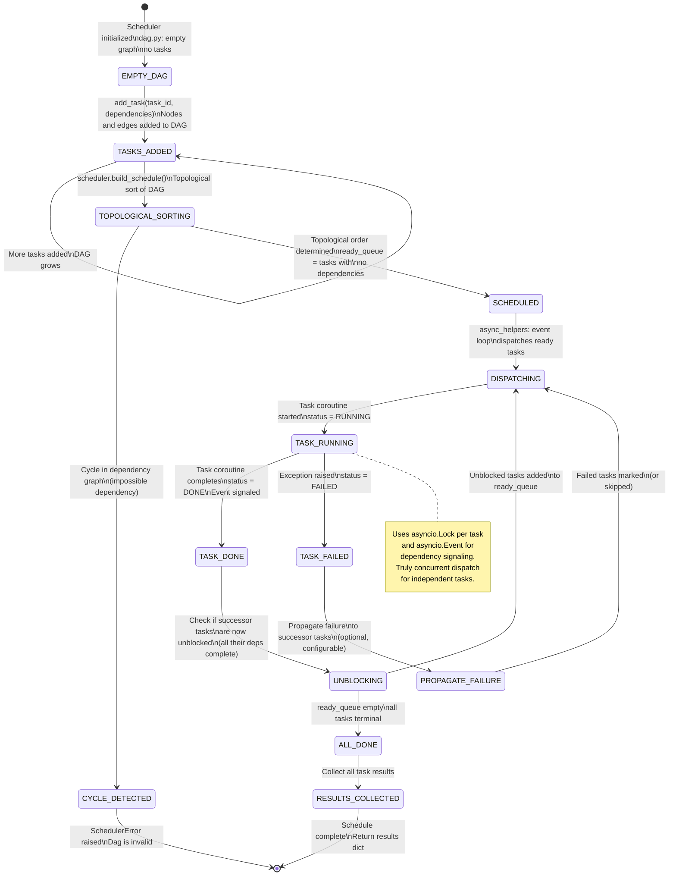
```mermaid
stateDiagram-v2
    [*] --> EMPTY_DAG : Scheduler initialized\ndag.py: empty graph\nno tasks

    EMPTY_DAG --> TASKS_ADDED : add_task(task_id, dependencies)\nNodes and edges added to DAG

    TASKS_ADDED --> TASKS_ADDED : More tasks added\nDAG grows

    TASKS_ADDED --> TOPOLOGICAL_SORTING : scheduler.build_schedule()\nTopological sort of DAG

    TOPOLOGICAL_SORTING --> CYCLE_DETECTED : Cycle in dependency graph\n(impossible dependency)

    CYCLE_DETECTED --> [*] : SchedulerError raised\nDag is invalid

    TOPOLOGICAL_SORTING --> SCHEDULED : Topological order determined\nready_queue = tasks with\nno dependencies

    SCHEDULED --> DISPATCHING : async_helpers: event loop\ndispatches ready tasks

    DISPATCHING --> TASK_RUNNING : Task coroutine started\nstatus = RUNNING

    TASK_RUNNING --> TASK_DONE : Task coroutine completes\nstatus = DONE\nEvent signaled

    TASK_RUNNING --> TASK_FAILED : Exception raised\nstatus = FAILED

    TASK_DONE --> UNBLOCKING : Check if successor tasks\nare now unblocked\n(all their deps complete)

    UNBLOCKING --> DISPATCHING : Unblocked tasks added\nto ready_queue

    TASK_FAILED --> PROPAGATE_FAILURE : Propagate failure\nto successor tasks\n(optional, configurable)

    PROPAGATE_FAILURE --> DISPATCHING : Failed tasks marked\n(or skipped)

    UNBLOCKING --> ALL_DONE : ready_queue empty\nall tasks terminal

    ALL_DONE --> RESULTS_COLLECTED : Collect all task results

    RESULTS_COLLECTED --> [*] : Schedule complete\nReturn results dict

    note right of TASK_RUNNING
        Uses asyncio.Lock per task
        and asyncio.Event for
        dependency signaling.
        Truly concurrent dispatch
        for independent tasks.
    end note
```

---

## 14. Discovery Tree Node States

State machine for individual nodes in the `DiscoveryTree`, defined in `dream_rsi/tree.py`.

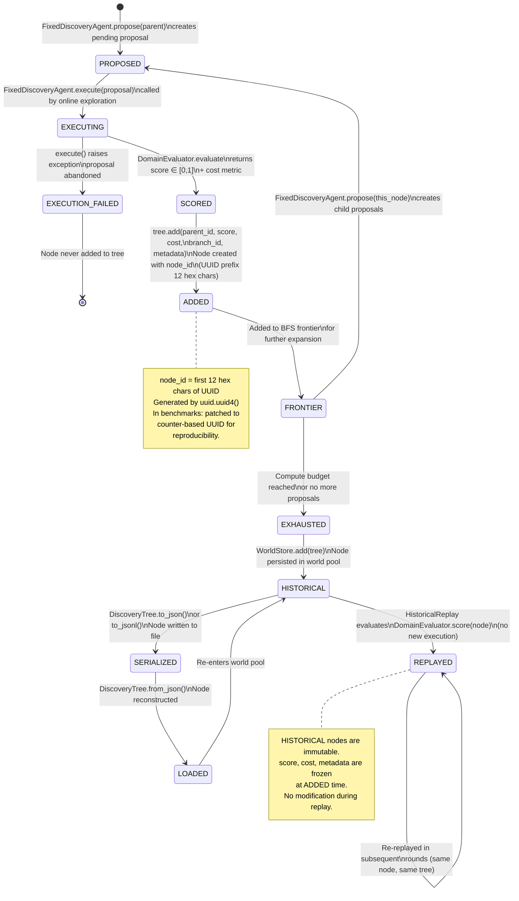
```mermaid
stateDiagram-v2
    [*] --> PROPOSED : FixedDiscoveryAgent.propose(parent)\ncreates pending proposal

    PROPOSED --> EXECUTING : FixedDiscoveryAgent.execute(proposal)\ncalled by online exploration

    EXECUTING --> SCORED : DomainEvaluator.evaluate\nreturns score ∈ [0,1]\n+ cost metric

    EXECUTING --> EXECUTION_FAILED : execute() raises exception\nproposal abandoned

    EXECUTION_FAILED --> [*] : Node never added to tree

    SCORED --> ADDED : tree.add(parent_id, score, cost,\nbranch_id, metadata)\nNode created with node_id\n(UUID prefix 12 hex chars)

    ADDED --> FRONTIER : Added to BFS frontier\nfor further expansion

    FRONTIER --> PROPOSED : FixedDiscoveryAgent.propose(this_node)\ncreates child proposals

    FRONTIER --> EXHAUSTED : Compute budget reached\nor no more proposals

    EXHAUSTED --> HISTORICAL : WorldStore.add(tree)\nNode persisted in world pool

    HISTORICAL --> REPLAYED : HistoricalReplay evaluates\nDomainEvaluator.score(node)\n(no new execution)

    REPLAYED --> REPLAYED : Re-replayed in subsequent\nrounds (same node, same tree)

    HISTORICAL --> SERIALIZED : DiscoveryTree.to_json()\nor to_jsonl()\nNode written to file

    SERIALIZED --> LOADED : DiscoveryTree.from_json()\nNode reconstructed

    LOADED --> HISTORICAL : Re-enters world pool

    note right of ADDED
        node_id = first 12 hex chars of UUID
        Generated by uuid.uuid4()
        In benchmarks: patched to
        counter-based UUID for
        reproducibility.
    end note

    note right of REPLAYED
        HISTORICAL nodes are immutable.
        score, cost, metadata are frozen
        at ADDED time.
        No modification during replay.
    end note
```

---

## 15. Historical World Store States

State machine for the `WorldStore` accumulator in `dream_rsi/`.

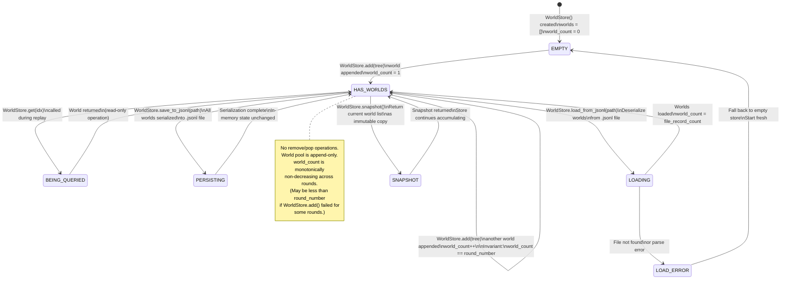
```mermaid
stateDiagram-v2
    [*] --> EMPTY : WorldStore() created\nworlds = []\nworld_count = 0

    EMPTY --> HAS_WORLDS : WorldStore.add(tree)\nworld appended\nworld_count = 1

    HAS_WORLDS --> HAS_WORLDS : WorldStore.add(tree)\nanother world appended\nworld_count++\n\nInvariant:\nworld_count == round_number

    HAS_WORLDS --> BEING_QUERIED : WorldStore.get(idx)\ncalled during replay

    BEING_QUERIED --> HAS_WORLDS : World returned\n(read-only operation)

    HAS_WORLDS --> PERSISTING : WorldStore.save_to_jsonl(path)\nAll worlds serialized\nto .jsonl file

    PERSISTING --> HAS_WORLDS : Serialization complete\nIn-memory state unchanged

    HAS_WORLDS --> LOADING : WorldStore.load_from_jsonl(path)\nDeserialize worlds\nfrom .jsonl file

    LOADING --> HAS_WORLDS : Worlds loaded\nworld_count = file_record_count

    LOADING --> LOAD_ERROR : File not found\nor parse error

    LOAD_ERROR --> EMPTY : Fall back to empty store\nStart fresh

    HAS_WORLDS --> SNAPSHOT : WorldStore.snapshot()\nReturn current world list\nas immutable copy

    SNAPSHOT --> HAS_WORLDS : Snapshot returned\nStore continues accumulating

    note right of HAS_WORLDS
        No remove/pop operations.
        World pool is append-only.
        world_count is monotonically
        non-decreasing across rounds.
        (May be less than round_number
        if WorldStore.add() failed for
        some rounds.)
    end note
```

---

## 16. Classifier Audit Log States

The audit log state machine in `classifier/audit/audit.go`.

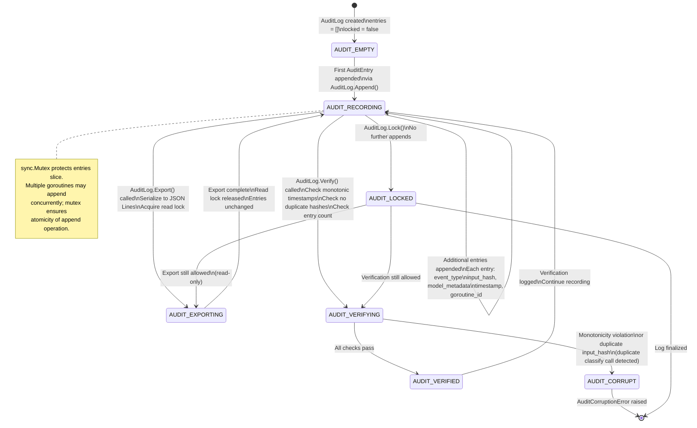
```mermaid
stateDiagram-v2
    [*] --> AUDIT_EMPTY : AuditLog created\nentries = []\nlocked = false

    AUDIT_EMPTY --> AUDIT_RECORDING : First AuditEntry appended\nvia AuditLog.Append()

    AUDIT_RECORDING --> AUDIT_RECORDING : Additional entries appended\nEach entry: event_type\ninput_hash, model_metadata\ntimestamp, goroutine_id

    AUDIT_RECORDING --> AUDIT_EXPORTING : AuditLog.Export() called\nSerialize to JSON Lines\nAcquire read lock

    AUDIT_EXPORTING --> AUDIT_RECORDING : Export complete\nRead lock released\nEntries unchanged

    AUDIT_RECORDING --> AUDIT_VERIFYING : AuditLog.Verify() called\nCheck monotonic timestamps\nCheck no duplicate hashes\nCheck entry count

    AUDIT_VERIFYING --> AUDIT_VERIFIED : All checks pass

    AUDIT_VERIFYING --> AUDIT_CORRUPT : Monotonicity violation\nor duplicate input_hash\n(duplicate classify call detected)

    AUDIT_VERIFIED --> AUDIT_RECORDING : Verification logged\nContinue recording

    AUDIT_CORRUPT --> [*] : AuditCorruptionError raised

    AUDIT_RECORDING --> AUDIT_LOCKED : AuditLog.Lock()\nNo further appends

    AUDIT_LOCKED --> AUDIT_EXPORTING : Export still allowed\n(read-only)

    AUDIT_LOCKED --> AUDIT_VERIFYING : Verification still allowed

    AUDIT_LOCKED --> [*] : Log finalized

    note right of AUDIT_RECORDING
        sync.Mutex protects entries slice.
        Multiple goroutines may append
        concurrently; mutex ensures
        atomicity of append operation.
    end note
```

---

## 17. NAND# CPU States

State machine for the NAND# reference CPU implementation in `assembly-120-strict-model/PHASE_2_CPU_EXECUTION_ENGINE.asm`.

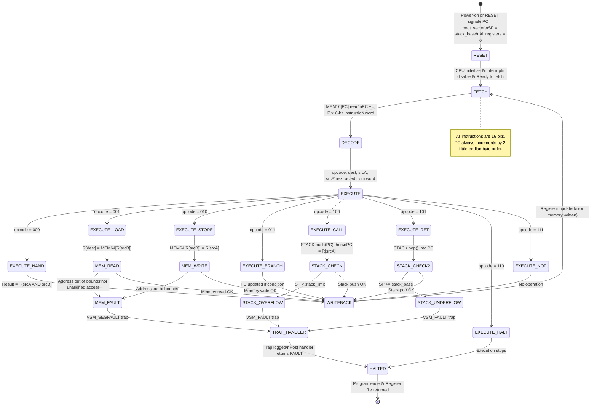
```mermaid
stateDiagram-v2
    [*] --> RESET : Power-on or RESET signal\nPC = boot_vector\nSP = stack_base\nAll registers = 0

    RESET --> FETCH : CPU initialized\nInterrupts disabled\nReady to fetch

    FETCH --> DECODE : MEM16[PC] read\nPC += 2\n16-bit instruction word

    DECODE --> EXECUTE : opcode, dest, srcA, srcB\nextracted from word

    EXECUTE --> EXECUTE_NAND : opcode = 000

    EXECUTE --> EXECUTE_LOAD : opcode = 001

    EXECUTE --> EXECUTE_STORE : opcode = 010

    EXECUTE --> EXECUTE_BRANCH : opcode = 011

    EXECUTE --> EXECUTE_CALL : opcode = 100

    EXECUTE --> EXECUTE_RET : opcode = 101

    EXECUTE --> EXECUTE_HALT : opcode = 110

    EXECUTE --> EXECUTE_NOP : opcode = 111

    EXECUTE_NAND --> WRITEBACK : Result = ~(srcA AND srcB)

    EXECUTE_LOAD --> MEM_READ : R[dest] = MEM64[R[srcB]]

    MEM_READ --> MEM_FAULT : Address out of bounds\nor unaligned access

    MEM_READ --> WRITEBACK : Memory read OK

    EXECUTE_STORE --> MEM_WRITE : MEM64[R[srcB]] = R[srcA]

    MEM_WRITE --> MEM_FAULT : Address out of bounds

    MEM_WRITE --> WRITEBACK : Memory write OK

    EXECUTE_BRANCH --> WRITEBACK : PC updated if condition

    EXECUTE_CALL --> STACK_CHECK : STACK.push(PC) then\nPC = R[srcA]

    STACK_CHECK --> STACK_OVERFLOW : SP < stack_limit

    STACK_CHECK --> WRITEBACK : Stack push OK

    EXECUTE_RET --> STACK_CHECK2 : STACK.pop() into PC

    STACK_CHECK2 --> STACK_UNDERFLOW : SP >= stack_base

    STACK_CHECK2 --> WRITEBACK : Stack pop OK

    EXECUTE_NOP --> WRITEBACK : No operation

    EXECUTE_HALT --> HALTED : Execution stops

    WRITEBACK --> FETCH : Registers updated\n(or memory written)

    MEM_FAULT --> TRAP_HANDLER : VSM_SEGFAULT trap

    STACK_OVERFLOW --> TRAP_HANDLER : VSM_FAULT trap

    STACK_UNDERFLOW --> TRAP_HANDLER : VSM_FAULT trap

    TRAP_HANDLER --> HALTED : Trap logged\nHost handler returns FAULT

    HALTED --> [*] : Program ended\nRegister file returned

    note right of FETCH
        All instructions are 16 bits.
        PC always increments by 2.
        Little-endian byte order.
    end note
```

---

## 18. QFlow Compiler States

State machine for the QFlow quantum dataflow compiler in `qflow/compiler/`.

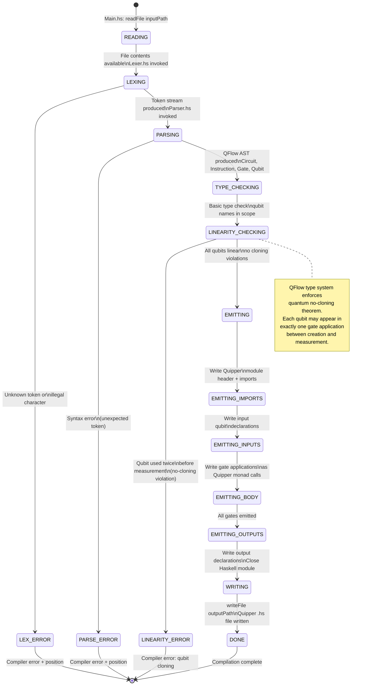
```mermaid
stateDiagram-v2
    [*] --> READING : Main.hs: readFile inputPath

    READING --> LEXING : File contents available\nLexer.hs invoked

    LEXING --> LEX_ERROR : Unknown token or\nillegal character

    LEXING --> PARSING : Token stream produced\nParser.hs invoked

    LEX_ERROR --> [*] : Compiler error + position

    PARSING --> PARSE_ERROR : Syntax error\n(unexpected token)

    PARSING --> TYPE_CHECKING : QFlow AST produced\nCircuit, Instruction, Gate, Qubit

    PARSE_ERROR --> [*] : Compiler error + position

    TYPE_CHECKING --> LINEARITY_CHECKING : Basic type check\nqubit names in scope

    LINEARITY_CHECKING --> LINEARITY_ERROR : Qubit used twice\nbefore measurement\n(no-cloning violation)

    LINEARITY_CHECKING --> EMITTING : All qubits linear\nno cloning violations

    LINEARITY_ERROR --> [*] : Compiler error: qubit cloning

    EMITTING --> EMITTING_IMPORTS : Write Quipper\nmodule header + imports

    EMITTING_IMPORTS --> EMITTING_INPUTS : Write input qubit\ndeclarations

    EMITTING_INPUTS --> EMITTING_BODY : Write gate applications\nas Quipper monad calls

    EMITTING_BODY --> EMITTING_OUTPUTS : All gates emitted

    EMITTING_OUTPUTS --> WRITING : Write output declarations\nClose Haskell module

    WRITING --> DONE : writeFile outputPath\nQuipper .hs file written

    DONE --> [*] : Compilation complete

    note right of LINEARITY_CHECKING
        QFlow type system enforces
        quantum no-cloning theorem.
        Each qubit may appear in
        exactly one gate application
        between creation and measurement.
    end note
```

---

## 19. Quantum Circuit Execution States

State machine for `quantum_computer/vm/simulator.py`.

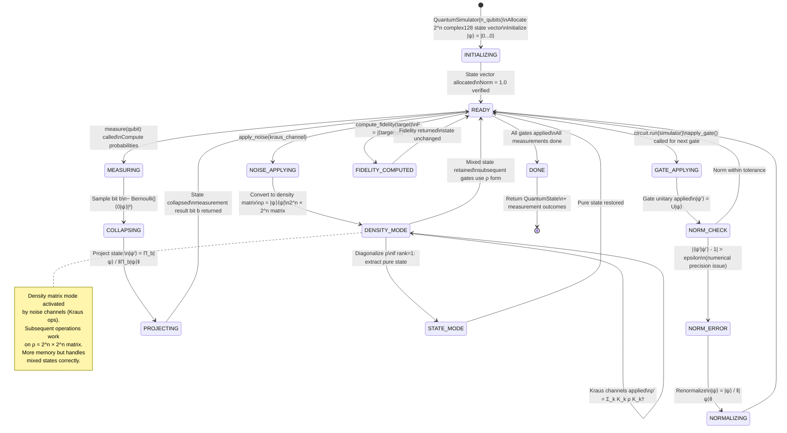
```mermaid
stateDiagram-v2
    [*] --> INITIALIZING : QuantumSimulator(n_qubits)\nAllocate 2^n complex128 state vector\nInitialize |ψ⟩ = |0...0⟩

    INITIALIZING --> READY : State vector allocated\nNorm = 1.0 verified

    READY --> GATE_APPLYING : circuit.run(simulator)\napply_gate() called for next gate

    GATE_APPLYING --> NORM_CHECK : Gate unitary applied\n|ψ'⟩ = U|ψ⟩

    NORM_CHECK --> NORM_ERROR : |⟨ψ'|ψ'⟩ - 1| > epsilon\n(numerical precision issue)

    NORM_ERROR --> NORMALIZING : Renormalize\n|ψ⟩ = |ψ⟩ / ‖|ψ⟩‖

    NORMALIZING --> READY

    NORM_CHECK --> READY : Norm within tolerance

    READY --> MEASURING : measure(qubit) called\nCompute probabilities

    MEASURING --> COLLAPSING : Sample bit b\n~ Bernoulli(|⟨0|ψ⟩|²)

    COLLAPSING --> PROJECTING : Project state:\n|ψ'⟩ = Π_b|ψ⟩ / ‖Π_b|ψ⟩‖

    PROJECTING --> READY : State collapsed\nmeasurement result bit b returned

    READY --> NOISE_APPLYING : apply_noise(kraus_channel)

    NOISE_APPLYING --> DENSITY_MODE : Convert to density matrix\nρ = |ψ⟩⟨ψ|\n2^n × 2^n matrix

    DENSITY_MODE --> DENSITY_MODE : Kraus channels applied\nρ' = Σ_k K_k ρ K_k†

    DENSITY_MODE --> STATE_MODE : Diagonalize ρ\nif rank=1: extract pure state

    STATE_MODE --> READY : Pure state restored

    DENSITY_MODE --> READY : Mixed state retained\nsubsequent gates use ρ form

    READY --> FIDELITY_COMPUTED : compute_fidelity(target)\nF = |⟨target|ψ⟩|²

    FIDELITY_COMPUTED --> READY : Fidelity returned\nstate unchanged

    READY --> DONE : All gates applied\nAll measurements done

    DONE --> [*] : Return QuantumState\n+ measurement outcomes

    note right of DENSITY_MODE
        Density matrix mode activated
        by noise channels (Kraus ops).
        Subsequent operations work
        on ρ = 2^n × 2^n matrix.
        More memory but handles
        mixed states correctly.
    end note
```

---

## 20. Apple 6502 CPU States

State machine for the Apple II 6502 CPU emulator in `apple6502x86/`.

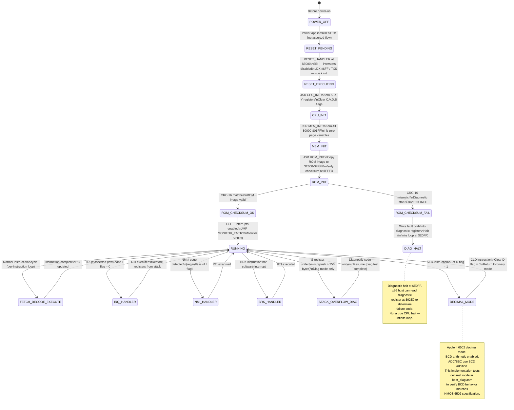
```mermaid
stateDiagram-v2
    [*] --> POWER_OFF : Before power-on

    POWER_OFF --> RESET_PENDING : Power applied\nRESET# line asserted (low)

    RESET_PENDING --> RESET_EXECUTING : RESET_HANDLER at $E000\nSEI — interrupts disabled\nLDX #$FF / TXS — stack init

    RESET_EXECUTING --> CPU_INIT : JSR CPU_INIT\nZero A, X, Y registers\nClear C,V,D,B flags

    CPU_INIT --> MEM_INIT : JSR MEM_INIT\nZero-fill $0000-$01FF\nInit zero-page variables

    MEM_INIT --> ROM_INIT : JSR ROM_INIT\nCopy ROM image to $E000-$FFFF\nVerify checksum at $FFFD

    ROM_INIT --> ROM_CHECKSUM_OK : CRC-16 matches\nROM image valid

    ROM_INIT --> ROM_CHECKSUM_FAIL : CRC-16 mismatch\nDiagnostic status $02E0 = 0xFF

    ROM_CHECKSUM_FAIL --> DIAG_HALT : Write fault code\nto diagnostic register\nHalt (infinite loop at $E0FF)

    ROM_CHECKSUM_OK --> RUNNING : CLI — interrupts enabled\nJMP MONITOR_ENTRY\nMonitor running

    RUNNING --> FETCH_DECODE_EXECUTE : Normal instruction\ncycle (per-instruction loop)

    FETCH_DECODE_EXECUTE --> RUNNING : Instruction complete\nPC updated

    RUNNING --> IRQ_HANDLER : IRQ# asserted (low)\nand I flag = 0

    IRQ_HANDLER --> RUNNING : RTI executed\nRestore registers from stack

    RUNNING --> NMI_HANDLER : NMI# edge detected\n(regardless of I flag)

    NMI_HANDLER --> RUNNING : RTI executed

    RUNNING --> BRK_HANDLER : BRK instruction\nor software interrupt

    BRK_HANDLER --> RUNNING : RTI executed

    RUNNING --> STACK_OVERFLOW_DIAG : S register underflows\n(push > 256 bytes)\nDiag mode only

    STACK_OVERFLOW_DIAG --> RUNNING : Diagnostic code written\nResume (diag test complete)

    RUNNING --> DECIMAL_MODE : SED instruction\nSet D flag = 1

    DECIMAL_MODE --> RUNNING : CLD instruction\nClear D flag = 0\nReturn to binary mode

    note right of DECIMAL_MODE
        Apple II 6502 decimal mode:
        BCD arithmetic enabled.
        ADC/SBC use BCD addition.
        This implementation tests
        decimal mode in boot_diag.asm
        to verify BCD behavior matches
        NMOS 6502 specification.
    end note

    note right of DIAG_HALT
        Diagnostic halt at $E0FF.
        x86 host can read diagnostic
        register at $02E0 to determine
        failure code.
        Not a true CPU halt —
        infinite loop.
    end note
```

---

*End of STATE_MACHINES.md*
